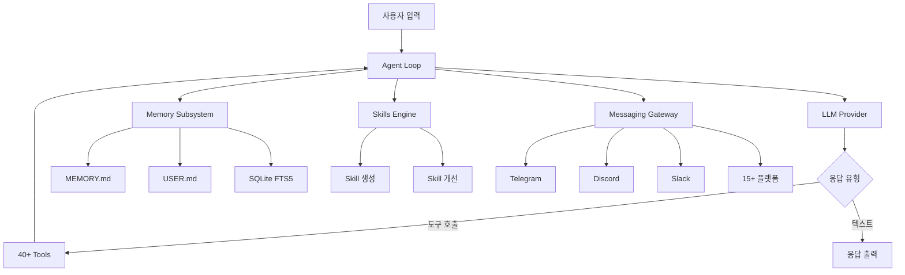
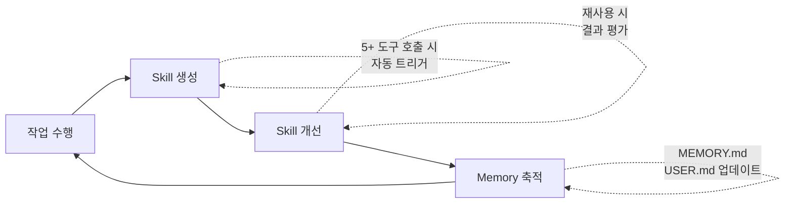
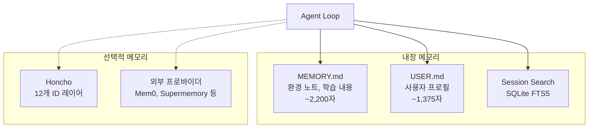
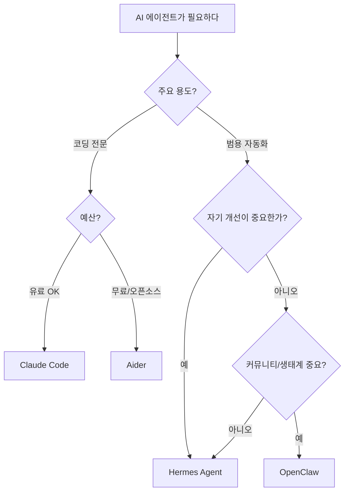

# 1. 들어가며

## 1.1 Hermes Agent란?

**Hermes Agent**는 [Nous Research](https://nousresearch.com/)가 개발한 오픈소스 자기 개선형(Self-improving) AI 에이전트 프레임워크다. 2026년 2월에 첫 릴리즈된 이후 빠르게 성장하여 GitHub 54,000+ 스타를 기록하며 AI 에이전트 생태계에서 주목받고 있다.

> "The agent that grows with you."

기존 AI 에이전트와의 가장 큰 차이는 **사용할수록 스스로 성장한다**는 점이다. 복잡한 작업을 완료하면 자동으로 재사용 가능한 **Skill**을 생성하고, 반복 사용할수록 그 Skill을 개선한다. 세션이 끝나도 학습한 내용은 **Persistent Memory**에 남아 다음 대화에서 활용된다.

| 항목 | 내용 |
|------|------|
| 개발사 | Nous Research |
| 라이선스 | MIT (완전 오픈소스) |
| 주요 언어 | Python (93.9%), Node.js |
| 첫 릴리즈 | 2026년 2월 |
| GitHub 스타 | 54,000+ |
| 텔레메트리 | 제로 (데이터 수집 없음) |

## 1.2 왜 Hermes Agent인가?

Claude Code, OpenClaw, Aider 등 다양한 AI 에이전트가 있는데 왜 Hermes Agent에 주목해야 할까?

**핵심 차별점:**

1. **자기 개선(Self-improving)**: 유일하게 내장 Learning Loop를 가진 에이전트. 작업 → Skill 생성 → Skill 개선 → 메모리 축적의 순환 루프
2. **범용 에이전트**: 코딩 전문이 아닌 리서치, DevOps, 스마트홈, 보고서 작성 등 범용 자율 에이전트
3. **모델 무관(Model Agnostic)**: Anthropic, OpenAI, Google, Ollama 등 어떤 LLM이든 코드 변경 없이 교체 가능
4. **자체 호스팅**: $5/월 VPS에 설치하고 Telegram으로 원격 작업 가능. 제로 텔레메트리
5. **MCP 양방향 지원**: MCP 클라이언트 + 서버 역할 모두 가능

## 1.3 Nous Research 소개

[Nous Research](https://nousresearch.com/)는 오픈소스 AI 연구소로, 다음과 같은 모델 패밀리로 잘 알려져 있다:

- **Hermes**: 범용 파인튜닝 모델 시리즈
- **Nomos**: 추론 특화 모델
- **Psyche**: 분산 학습 프레임워크

Hermes Agent는 이 연구소의 모델 개발 경험을 바탕으로 만들어진 에이전트 프레임워크다.

---

# 2. 설치 및 초기 설정

## 2.1 Quick Install (60초 설치)

가장 빠른 설치 방법:

```bash
curl -fsSL https://raw.githubusercontent.com/NousResearch/hermes-agent/main/scripts/install.sh | bash
source ~/.bashrc   # 또는: source ~/.zshrc
hermes             # 바로 시작!
```

**지원 플랫폼:** Linux, macOS, WSL2, Android (Termux). 네이티브 Windows는 미지원(WSL2 사용).

스크립트가 자동으로 설치하는 의존성:
- uv (Python 패키지 매니저)
- Python 3.11
- Node.js v22
- ripgrep
- ffmpeg

## 2.2 수동 설치

수동으로 설치하려면:

```bash
git clone --recurse-submodules https://github.com/NousResearch/hermes-agent.git
cd hermes-agent
curl -LsSf https://astral.sh/uv/install.sh | sh
uv venv venv --python 3.11
source venv/bin/activate
uv pip install -e ".[all]"
```

## 2.3 초기 설정

설치 후 기본 설정:

```bash
hermes model          # LLM 프로바이더 및 모델 선택
hermes tools          # 도구 활성화/비활성화
hermes config set OPENROUTER_API_KEY sk-or-v1-your-key-here
hermes gateway setup  # 메시징 플랫폼 설정
hermes doctor         # 진단 및 트러블슈팅
```

모델 전환 예시:

```bash
hermes model anthropic/claude-sonnet-4    # Anthropic Claude
hermes model openai/gpt-4o               # OpenAI GPT-4o
hermes model ollama/llama3               # 로컬 Ollama
```

## 2.4 디렉토리 구조

Hermes Agent의 모든 설정과 데이터는 `~/.hermes/`에 저장된다:

```
~/.hermes/
├── config.yaml          # 주요 설정 (모델, 도구, MCP 등)
├── .env                 # API 키와 시크릿
├── SOUL.md              # 에이전트 아이덴티티 (시스템 프롬프트)
├── memories/            # 영구 메모리 파일
│   ├── MEMORY.md        # 에이전트가 큐레이션한 환경 노트
│   └── USER.md          # 사용자 프로필
├── skills/              # 에이전트가 생성한 스킬
├── cron/                # 스케줄 작업
├── sessions/            # Gateway 세션 (채팅 기록)
└── logs/                # 에러 및 Gateway 로그
```

---

# 3. 핵심 아키텍처

## 3.1 Agent Loop 동작 방식

Hermes Agent의 코어 엔진은 `run_agent.py`의 `AIAgent` 클래스다. 동기식 오케스트레이션 시스템으로 프로바이더 선택, 프롬프트 구성, 도구 실행, 재시도, 압축, 영속성을 처리한다.



## 3.2 프로젝트 구조

```
hermes-agent/
├── agent/          # 코어 에이전트 구현 (AIAgent, 프롬프트, 압축)
├── gateway/        # 메시징 플랫폼 통합 (Telegram, Discord 등)
├── hermes_cli/     # 터미널 UI (CLI 인터페이스)
├── skills/         # 내장 스킬 라이브러리
├── tools/          # 40+ 도구 구현
└── cron/           # 스케줄링 시스템
```

| 레이어 | 역할 |
|--------|------|
| **Agent Loop** | 모든 작업을 구동하는 단일 오케스트레이션 엔진 |
| **Terminal Backends** | 6개 실행 환경 — Local, Docker, SSH, Daytona, Singularity, Modal |
| **Messaging Gateway** | 15+ 플랫폼 연결 단일 프로세스 |
| **Memory Subsystem** | 이중 파일 메모리 + SQLite FTS5 + Honcho |
| **Skills Engine** | 점진적 공개(Progressive Disclosure) 스킬 시스템 |
| **Cron Scheduler** | 내장 스케줄 작업 실행 |

## 3.3 Context Files 우선순위

Hermes Agent는 프로젝트별 지침 파일을 자동으로 탐색한다. 우선순위:

```
.hermes.md > AGENTS.md > CLAUDE.md > .cursorrules
```

모든 Context Files는 합산 **20,000자**로 제한된다. Claude Code의 `CLAUDE.md`와 동일한 파일을 그대로 사용할 수 있어 기존 프로젝트에서 쉽게 전환 가능하다.

## 3.4 컨텍스트 압축

대화가 길어지면 자동으로 컨텍스트를 압축한다:

- **트리거 조건**: 컨텍스트의 50% 사용 시 자동 발동
- **방식**: 별도 LLM 호출로 이전 대화를 요약
- **설정**: 압축에 사용할 모델을 별도로 지정 가능 (비용 절감)

---

# 4. Learning Loop — 자기 개선의 핵심

Hermes Agent의 가장 중요한 차별점인 Learning Loop는 4단계로 구성된다.



## 4.1 Skill 자동 생성

복잡한 작업(5회 이상 도구 호출)을 완료하면 에이전트가 자동으로 해당 워크플로우를 **Skill**로 추상화한다. Skill은 구조화된 Markdown 문서로, 절차(Procedure), 함정(Pitfalls), 검증(Verification) 단계를 포함한다.

예를 들어 "프로젝트 초기 설정" 작업을 반복하면, 에이전트가 자동으로 "프로젝트 초기 설정 스킬"을 생성하여 다음번에는 더 빠르고 정확하게 수행한다.

## 4.2 Skill 개선

기존 Skill이 재사용될 때, 에이전트는 결과를 평가하고 Skill을 개선한다:

- 성공한 경우: 검증 단계를 강화
- 실패한 경우: 함정(Pitfalls) 섹션을 업데이트
- 환경 변화 감지: 절차를 자동 수정

## 4.3 SKILL.md 파일 형식

Skill은 [agentskills.io](https://agentskills.io) 오픈 표준을 따른다:

```yaml
---
name: project-setup
description: 새 Python 프로젝트 초기 설정
version: 1.2.0
platforms: [macos, linux]
metadata:
  hermes:
    tags: [python, project, setup]
    category: devops
    fallback_for_toolsets: [web]
    requires_toolsets: [terminal]
---
# 프로젝트 초기 설정

## When to Use
새 Python 프로젝트를 처음 시작할 때

## Procedure
1. uv init으로 프로젝트 생성
2. pyproject.toml 설정
3. 기본 디렉토리 구조 생성
4. pre-commit 설정

## Pitfalls
- Python 버전 호환성 확인 필요
- uv가 설치되어 있지 않은 경우 먼저 설치

## Verification
- `uv run python --version` 실행 확인
- `uv run pytest` 통과 확인
```

## 4.4 Skills Hub

Skill은 다양한 소스에서 가져올 수 있다:

| 소스 | 설명 |
|------|------|
| **Official Skills** | Hermes Agent 내장 스킬 |
| **skills.sh** | Vercel 기반 스킬 레지스트리 |
| **GitHub Repos** | GitHub 저장소에서 직접 가져오기 |
| **ClawHub** | 커뮤니티 스킬 마켓플레이스 |
| **Well-Known Endpoints** | 표준 엔드포인트 자동 탐색 |
| **LobeHub Agents** | LobeHub 에이전트 호환 |

**Progressive Disclosure** 방식으로 스킬을 로드하여 토큰을 절약한다:

- **Level 0**: `skills_list()` — 메타데이터만 반환 (~3k 토큰)
- **Level 1**: `skill_view(name)` — 전체 콘텐츠 로드
- **Level 2**: `skill_view(name, path)` — 특정 참조 파일 조회

---

# 5. 다계층 메모리 시스템

Hermes Agent의 메모리 시스템은 여러 계층으로 구성되어, 단기 대화부터 장기 사용자 모델링까지 커버한다.



## 5.1 MEMORY.md

에이전트가 자동으로 큐레이션하는 환경 노트다.

- **용량**: ~2,200자 제한 (~800 토큰)
- **내용**: 프로젝트 컨벤션, 학습한 교훈, 환경 설정 정보
- **위치**: `~/.hermes/memories/MEMORY.md`
- **특징**: 에이전트가 스스로 중요하다고 판단한 정보를 자동으로 추가/수정/삭제

Claude Code의 memory 시스템과 유사하지만, Hermes Agent는 에이전트가 **자율적으로** 메모리를 관리한다는 점이 다르다.

## 5.2 USER.md

사용자 프로필을 저장한다.

- **용량**: ~1,375자 제한 (~500 토큰)
- **내용**: 사용자 이름, 선호도, 커뮤니케이션 스타일, 워크플로우 습관
- **위치**: `~/.hermes/memories/USER.md`
- **특징**: 대화를 통해 사용자에 대해 학습한 내용을 자동 축적

## 5.3 Session Search

과거 대화를 전문 검색할 수 있는 기능:

- **구현**: SQLite FTS5 (Full-Text Search)
- **방식**: 모든 세션이 SQLite DB에 저장되고, `session_search` 도구로 검색
- **특징**: 검색 결과를 LLM이 요약하여 관련 컨텍스트만 추출

```
"지난번에 Docker 설정할 때 어떤 포트를 사용했지?"
→ session_search가 과거 대화를 검색하여 답변
```

## 5.4 Honcho — 변증법적 사용자 모델링

선택적으로 활성화할 수 있는 고급 사용자 모델링 시스템:

- **12개 ID 레이어**: 인구통계, 커뮤니케이션 스타일, 도메인 전문성 등
- **변증법적 접근**: 기존 사용자 모델을 지속적으로 검증하고 업데이트
- **크로스 세션**: 세션 간 Q&A와 시맨틱 검색 지원

기본 MEMORY.md/USER.md만으로도 충분하며, Honcho는 더 정교한 개인화가 필요한 경우에 활용한다.

추가로 8개 외부 메모리 프로바이더(Mem0, Supermemory, Holographic 등)도 플러그인으로 연결 가능하다.

---

# 6. 40+ 내장 도구

Hermes Agent는 40개 이상의 도구를 Toolset 단위로 관리한다.

## 6.1 핵심 도구

| Toolset | 도구 | 설명 |
|---------|------|------|
| **web** | `web_search`, `web_extract` | 인터넷 검색 및 웹페이지 추출 |
| **terminal** | `terminal`, `process` | 셸 명령 실행, 백그라운드 프로세스 관리 |
| **file** | `read_file`, `patch` | 파일 읽기 및 패치 방식 수정 |
| **browser** | `browser_navigate`, `browser_snapshot`, `browser_vision` | 헤드리스 브라우저 자동화 |

## 6.2 AI 도구

| Toolset | 도구 | 설명 |
|---------|------|------|
| **vision** | `vision_analyze` | 이미지/스크린샷 분석 |
| **image_gen** | `image_generate` | 텍스트→이미지 생성 (FAL.ai FLUX 2 Pro) |
| **tts** | `text_to_speech` | 텍스트→음성 변환 (Edge, ElevenLabs, OpenAI, NeuTTS) |

## 6.3 에이전트 도구

| Toolset | 도구 | 설명 |
|---------|------|------|
| **memory** | `memory` | 영구 저장소 추가/교체/삭제 |
| **session_search** | `session_search` | 과거 대화 전문 검색 |
| **skills** | `skill_manage` | 스킬 CRUD (생성/조회/수정/삭제) |
| **delegation** | `delegate_task` | 격리된 서브에이전트 생성 (최대 3개 동시) |
| **code_execution** | `execute_code` | 샌드박스 Python RPC |
| **cronjob** | `cronjob` | 반복 작업 스케줄링 |
| **todo** | `todo` | 작업 계획 및 추적 |
| **clarify** | `clarify` | 사용자에게 추가 정보 요청 |

도구 관리:

```bash
hermes tools          # 활성화된 도구 목록 확인 및 토글
```

---

# 7. 실전 활용

## 7.1 CLI 기본 사용법

```bash
hermes                          # 대화 시작
hermes -c                       # 마지막 세션 이어서 시작
hermes chat -q "Hello!"         # 원샷 질문
hermes model anthropic/claude-sonnet-4  # 모델 전환
hermes doctor                   # 진단
```

## 7.2 Python 라이브러리로 사용하기

Hermes Agent는 CLI뿐 아니라 Python 라이브러리로도 사용할 수 있다.

**기본 채팅:**

```python
from run_agent import AIAgent

agent = AIAgent(
    model="anthropic/claude-sonnet-4",
    quiet_mode=True,
)
response = agent.chat("프랑스의 수도는?")
print(response)
```

**대화 히스토리 유지:**

```python
result = agent.run_conversation(
    user_message="Python 3.13의 최신 기능을 검색해줘",
    task_id="research-1",
)
print(result["final_response"])
print(f"교환된 메시지: {len(result['messages'])}")

# 멀티턴 대화
result1 = agent.run_conversation("내 이름은 Alice야")
history = result1["messages"]
result2 = agent.run_conversation(
    "내 이름이 뭐였지?",
    conversation_history=history,
)
```

**도구 접근 제어:**

```python
# 웹 도구만 활성화
agent = AIAgent(
    model="anthropic/claude-sonnet-4",
    enabled_toolsets=["web"],
    quiet_mode=True,
)

# 특정 도구 비활성화
agent = AIAgent(
    model="anthropic/claude-sonnet-4",
    disabled_toolsets=["terminal", "browser"],
    quiet_mode=True,
)
```

## 7.3 FastAPI 통합 예제

Hermes Agent를 웹 API로 노출하는 간단한 예제:

```python
from fastapi import FastAPI
from pydantic import BaseModel
from run_agent import AIAgent

app = FastAPI()

class ChatRequest(BaseModel):
    message: str
    model: str = "anthropic/claude-sonnet-4"

@app.post("/chat")
async def chat(request: ChatRequest):
    agent = AIAgent(
        model=request.model,
        quiet_mode=True,
        skip_context_files=True,
        skip_memory=True,
    )
    response = agent.chat(request.message)
    return {"response": response}
```

## 7.4 Telegram/Discord 연동하기

Hermes Agent의 Messaging Gateway를 사용하면 Telegram, Discord 등에서 에이전트와 대화할 수 있다.

**Gateway 설정:**

```bash
hermes gateway setup           # 대화형 설정 마법사
hermes gateway restart         # Gateway 재시작
hermes channels status --probe # 채널 상태 확인
```

단일 Gateway 프로세스로 다음 15+ 플랫폼을 동시에 연결할 수 있다:

Telegram, Discord, Slack, WhatsApp, Signal, Email, SMS, Home Assistant, DingTalk, Feishu, WeCom, Weixin, BlueBubbles, Matrix, Mattermost

VPS에 Hermes Agent를 설치하고 Telegram으로 연결하면, 언제 어디서든 스마트폰으로 에이전트에게 작업을 지시할 수 있다.

---

# 8. 고급 기능

## 8.1 서브에이전트 위임 (delegate_task)

복잡한 작업을 격리된 서브에이전트에게 위임할 수 있다:

- **최대 3개** 동시 실행
- 각 서브에이전트는 독립된 컨텍스트와 제한된 도구셋을 가짐
- 병렬 처리로 효율성 향상

```
"이 프로젝트의 보안 취약점을 검사하면서, 동시에 API 문서를 생성해줘"
→ 서브에이전트 1: 보안 스캔 (terminal + file 도구만)
→ 서브에이전트 2: API 문서 생성 (file + web 도구만)
```

## 8.2 MCP 통합

Hermes Agent는 MCP(Model Context Protocol)를 **양방향**으로 지원한다.

**MCP 클라이언트로 사용:**

`~/.hermes/config.yaml`에 MCP 서버를 등록하면 시작 시 자동으로 도구를 탐색하고 등록한다:

```yaml
mcp_servers:
  github:
    command: npx
    args: ["-y", "@modelcontextprotocol/server-github"]
    env:
      GITHUB_PERSONAL_ACCESS_TOKEN: "ghp_xxx"
  
  filesystem:
    command: npx
    args: ["-y", "@modelcontextprotocol/server-filesystem", "/home/user/projects"]
```

stdio와 HTTP 서버 모두 지원한다.

**MCP 서버로 사용:**

```bash
hermes mcp serve
```

이 명령으로 Hermes Agent 자체를 MCP 서버로 노출하여 다른 MCP 클라이언트에서 Hermes의 도구를 활용할 수 있다.

## 8.3 Cron 스케줄링

`cronjob` 도구로 반복 작업을 스케줄링할 수 있다:

- 일일 리포트 생성
- 야간 백업 실행
- 주간 감사 보고서 생성
- 특정 시간에 메시징 플랫폼으로 결과 전송

## 8.4 Checkpoints (자동 스냅샷)

파괴적인 작업(파일 삭제, 대규모 수정 등)을 실행하기 전에 자동으로 파일시스템 스냅샷을 생성한다. 문제가 발생하면 즉시 이전 상태로 롤백할 수 있다.

## 8.5 Self-Evolution (간략 소개)

[hermes-agent-self-evolution](https://github.com/NousResearch/hermes-agent-self-evolution) 저장소에서는 **DSPy + GEPA**(Genetic-Pareto Prompt Evolution)를 사용하여 스킬, 도구 설명, 시스템 프롬프트, 코드를 자동으로 진화시키는 기능을 제공한다.

- GPU 불필요 — API 호출로만 동작
- 최적화 1회당 $2~10 비용
- 별도 저장소로 분리된 실험적 기능

---

# 9. 다른 에이전트와의 비교

## 9.1 기능 비교표

| Feature | Hermes Agent | Claude Code | OpenClaw | Aider |
|---------|-------------|-------------|----------|-------|
| **자기 개선** | O (스킬 + 메모리 루프) | X | X | X |
| **영구 메모리** | FTS5 + 큐레이션 + Honcho | 제한적 | X | X |
| **모델 무관** | O (어떤 프로바이더든) | Claude 전용 | O | O |
| **자체 호스팅** | O | 클라우드 서비스 | O | O |
| **멀티 플랫폼** | 15+ 플랫폼 | 터미널/IDE | Web UI | 터미널 |
| **샌드박스 실행** | 6개 백엔드 | X | Docker | X |
| **스킬 자동 생성** | O | X | X | X |
| **라이선스** | MIT | 독점 | MIT | Apache 2.0 |
| **주요 용도** | 범용 자율 에이전트 | 코딩 | 코딩 | 코딩 |
| **MCP 지원** | O (양방향) | O | X | X |

## 9.2 Hermes vs Claude Code

| 관점 | Hermes Agent | Claude Code |
|------|-------------|-------------|
| **강점** | 자기 개선, 모델 무관, 멀티 플랫폼 | 코딩 특화, 안정성, 통합 UX |
| **적합한 경우** | 범용 자동화, 장기 사용, VPS 운영 | 전문적인 소프트웨어 개발 |
| **비용** | API 키만 있으면 무료 | 구독료 ($20/월) |

Claude Code는 코딩에 최적화된 안정적인 도구이고, Hermes Agent는 코딩을 포함한 모든 종류의 작업을 자율적으로 수행하는 범용 에이전트다.

## 9.3 Hermes vs OpenClaw

| 관점 | Hermes Agent | OpenClaw |
|------|-------------|----------|
| **강점** | Learning Loop, 메모리 시스템 | 대규모 커뮤니티 (180K+ 스타), 모바일 노드 |
| **차이** | Skills 자동 생성/개선 | Skills 수동 관리 |
| **메시징** | 내장 Gateway | 내장 Gateway (유사) |

두 프레임워크 모두 자체 호스팅 AI 에이전트지만, Hermes Agent는 "자기 개선"에, OpenClaw는 "편의성과 생태계"에 초점을 맞추고 있다.

## 9.4 선택 가이드



---

# 10. 마무리

## 10.1 장단점 정리

### 장점

1. **자기 개선**: 사용할수록 Skill과 Memory가 축적되어 점점 나아짐
2. **완전 오픈소스 (MIT)**: 자체 호스팅, 수정, 상업적 사용 자유
3. **모델 무관**: 어떤 LLM이든 코드 변경 없이 교체 가능
4. **범용 에이전트**: 코딩뿐 아니라 리서치, DevOps, 스마트홈 등 다양한 용도
5. **멀티 플랫폼**: $5/월 VPS에서 Telegram으로 원격 작업 가능
6. **6개 샌드박스 백엔드**: 로컬부터 Docker, SSH, Modal까지 유연한 실행 환경
7. **MCP 양방향 지원**: 클라이언트 + 서버 역할 모두 가능

### 단점/고려사항

1. **초기 설정 복잡**: API 키, 모델, Gateway 설정 등 초기 투자 필요
2. **Self-hosted 운영 부담**: 직접 인프라 관리 필요 (vs 매니지드 서비스)
3. **학습 곡선**: Skills, Memory, Context Files 등 개념 이해 필요
4. **프로젝트 성숙도**: 2026년 2월 출시로 아직 초기 단계
5. **문서**: 빠르게 성장 중이라 문서가 기능을 따라가지 못할 수 있음

## 10.2 어떤 경우에 Hermes Agent가 적합한가?

**적합한 경우:**
- 반복적이고 구조화된 작업이 많은 경우 (Skill 자동 생성 활용)
- 같은 사용자/팀이 지속적으로 사용하는 경우 (메모리 축적 효과)
- 코딩 이외의 다양한 자동화가 필요한 경우 (범용 에이전트)
- 특정 LLM에 종속되고 싶지 않은 경우 (모델 무관)
- VPS에서 원격으로 작업하고 싶은 경우 (메시징 Gateway)

**부적합한 경우:**
- 전문적인 소프트웨어 개발에 집중하는 경우 → Claude Code 추천
- 설정 없이 바로 사용하고 싶은 경우 → Claude Code 또는 Aider 추천
- 매니지드 서비스를 선호하는 경우 → Claude Code 추천

## 10.3 참고 링크

### 공식

- [Hermes Agent 공식 사이트](https://hermes-agent.nousresearch.com/)
- [GitHub - NousResearch/hermes-agent](https://github.com/NousResearch/hermes-agent)
- [공식 문서](https://hermes-agent.nousresearch.com/docs/)
- [설치 가이드](https://hermes-agent.nousresearch.com/docs/getting-started/installation/)

### 기능별 문서

- [도구 & Toolsets](https://hermes-agent.nousresearch.com/docs/user-guide/features/tools)
- [Skills 시스템](https://hermes-agent.nousresearch.com/docs/user-guide/features/skills/)
- [Persistent Memory](https://hermes-agent.nousresearch.com/docs/user-guide/features/memory/)
- [MCP 통합](https://hermes-agent.nousresearch.com/docs/user-guide/features/mcp)
- [Python 라이브러리 사용법](https://hermes-agent.nousresearch.com/docs/guides/python-library/)

### 커뮤니티

- [awesome-hermes-agent](https://github.com/0xNyk/awesome-hermes-agent)
- [hermes-agent-self-evolution](https://github.com/NousResearch/hermes-agent-self-evolution)
