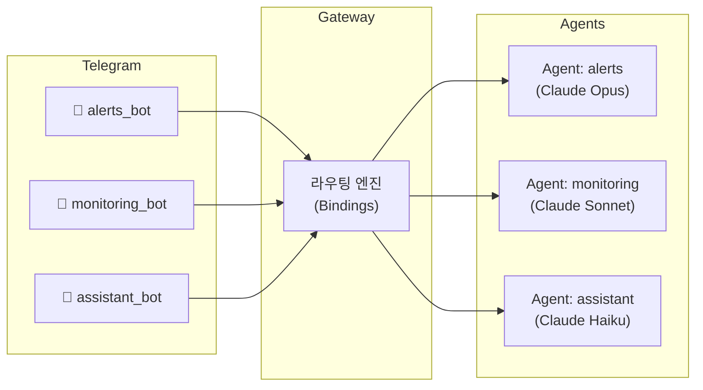
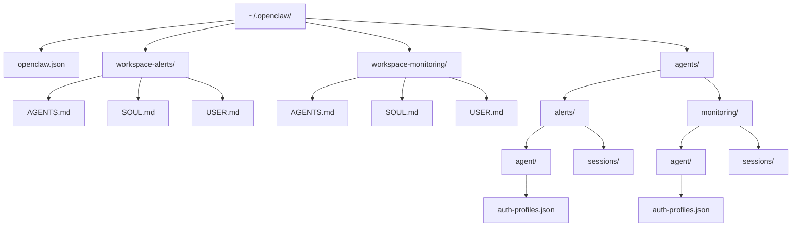
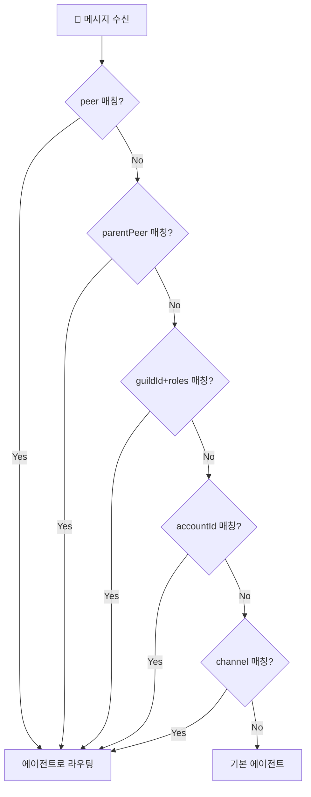

# 1. 들어가며

OpenClaw는 WhatsApp, Telegram, Discord 등 메시징 앱을 AI 에이전트와 연결하는 **자체 호스팅 게이트웨이**다. 기본적으로 하나의 에이전트가 모든 메시지를 처리하지만, 실제 운영에서는 용도별로 봇을 분리하고 싶은 경우가 많다.

예를 들어:

- **알림봇**: 서버 장애나 배포 알림만 전달
- **모니터링봇**: 시스템 메트릭 분석 및 리포트
- **어시스턴트봇**: 일상적인 질문과 작업 처리

OpenClaw의 **멀티 에이전트** 기능을 사용하면 이런 구성이 가능하다. 각 에이전트는 완전히 격리된 독립적인 "뇌(brain)"로 동작하며, 하나의 Gateway에서 관리할 수 있다.

이 글에서는 Telegram 봇 여러 개를 OpenClaw 멀티 에이전트로 구성하는 방법을 단계별로 정리한다.

> OpenClaw 기본 개념과 설치는 [OpenClaw 완벽 가이드](/article/openclaw-완벽-가이드) 글을 참고하자.

# 2. 멀티 에이전트 아키텍처

## 2.1 전체 구조

멀티 에이전트 시스템의 핵심은 **하나의 Gateway가 여러 에이전트를 관리하고, 바인딩 규칙에 따라 메시지를 라우팅**하는 것이다.



각 Telegram 봇은 독립된 계정(accountId)을 가지고, 바인딩 규칙을 통해 특정 에이전트로 연결된다.

## 2.2 에이전트의 구성요소

각 에이전트는 완전히 격리된 구성요소를 가진다.

| 구성요소 | 경로 | 역할 |
|----------|------|------|
| **Workspace** | `~/.openclaw/workspace-<agentId>/` | AGENTS.md, SOUL.md, USER.md, 로컬 파일 |
| **상태 디렉토리(agentDir)** | `~/.openclaw/agents/<agentId>/agent/` | 인증 프로필, 모델 레지스트리, 에이전트 설정 |
| **세션 저장소** | `~/.openclaw/agents/<agentId>/sessions/` | 대화 기록 |

> **주의**: `agentDir`을 에이전트 간에 절대 공유하지 않는다. 공유하면 인증 충돌이 발생한다.

## 2.3 디렉토리 구조

실제 파일시스템에서의 멀티 에이전트 구조는 다음과 같다.



각 에이전트의 Workspace에는 에이전트의 성격과 역할을 정의하는 파일이 있다.

- **AGENTS.md**: 에이전트의 지시사항과 도구 설정
- **SOUL.md**: 에이전트의 페르소나와 성격
- **USER.md**: 사용자 정보와 선호도

# 3. 사전 준비

## 3.1 OpenClaw 설치

OpenClaw가 아직 설치되지 않았다면 다음 명령어로 설치한다.

```bash
# macOS/Linux
curl -fsSL https://openclaw.ai/install.sh | bash

# 온보딩 마법사 실행 (인증, 게이트웨이, 채널 구성)
openclaw onboard --install-daemon
```

**요구사항:**
- Node.js 22 이상
- AI 프로바이더 API 키 (Anthropic, OpenAI 등)

## 3.2 Telegram 봇 생성 (BotFather)

Telegram에서 [@BotFather](https://t.me/BotFather)와 대화하여 에이전트 수만큼 봇을 생성한다.

1. BotFather에게 `/newbot` 명령 전송
2. 봇 이름 입력 (예: `My Alert Bot`)
3. 봇 사용자명 입력 (예: `my_alert_bot`)
4. 발급된 **봇 토큰**을 안전하게 보관

이 과정을 봇 개수만큼 반복한다. 예를 들어 3개의 에이전트를 운영할 예정이라면 3개의 봇을 생성한다.

```
# BotFather에서 받은 토큰 예시
alerts_bot:     123456:ABC-DEF1234ghIkl-zyx57W2v1u123ew11
monitoring_bot: 987654:XYZ-UVW9876tgHjk-abc34V3w9z456ty22
assistant_bot:  111222:GHI-JKL5678mnOpq-rst12X4y6z789ab33
```

# 4. 멀티 에이전트 설정

## 4.1 Step 1 - 에이전트 추가

OpenClaw CLI로 각 에이전트를 추가한다.

```bash
openclaw agents add alerts
openclaw agents add monitoring
openclaw agents add assistant
```

각 명령은 자동으로 다음을 생성한다.
- Workspace 디렉토리 (`~/.openclaw/workspace-<agentId>/`)
- 상태 디렉토리 (`~/.openclaw/agents/<agentId>/agent/`)
- 세션 저장소 (`~/.openclaw/agents/<agentId>/sessions/`)

## 4.2 Step 2 - OpenClaw에게 봇 토큰 전달

`openclaw.json`을 직접 편집할 필요가 없다. OpenClaw 대화창(Dashboard 또는 Telegram)에서 새로운 봇을 추가했다고 알려주고 토큰을 전달하면, OpenClaw가 알아서 설정을 추가하고 Gateway를 재시작한다.

```
사용자: "새로운 Telegram 봇을 추가했어. 이름은 alerts_bot이고 토큰은 123456:ABC-DEF1234... 야"
OpenClaw: 설정 추가 완료 → Gateway 자동 재시작
```

**실제 워크플로우:**

1. BotFather에서 봇 생성 → 토큰 복사
2. OpenClaw 대화창에서 토큰 전달
3. OpenClaw가 자동으로 처리:
   - `openclaw.json`에 에이전트 및 Telegram 계정 추가
   - 바인딩 규칙 생성
   - Gateway 재시작

## 4.3 openclaw.json 구조 이해

OpenClaw가 자동으로 설정을 생성하지만, 내부 구조를 이해하면 커스터마이징이나 트러블슈팅에 도움이 된다. `openclaw.json`은 크게 3개 섹션으로 구성된다.

### agents 섹션

각 에이전트(AI 뇌)를 정의한다. 에이전트마다 독립된 workspace와 모델을 지정할 수 있다.

```json5
{
  agents: {
    list: [
      {
        id: "alerts",
        name: "Alert Agent",
        workspace: "~/.openclaw/workspace-alerts",
        agentDir: "~/.openclaw/agents/alerts/agent",
        model: "anthropic/claude-opus-4-6",
      },
      {
        id: "monitoring",
        name: "Monitoring Agent",
        workspace: "~/.openclaw/workspace-monitoring",
        agentDir: "~/.openclaw/agents/monitoring/agent",
        model: "anthropic/claude-sonnet-4-5",
      },
      {
        id: "assistant",
        name: "Assistant Agent",
        workspace: "~/.openclaw/workspace-assistant",
        agentDir: "~/.openclaw/agents/assistant/agent",
        model: "anthropic/claude-haiku-4-5",
      },
    ],
  },
}
```

에이전트별로 다른 모델을 사용할 수 있어, 용도에 맞게 성능과 비용을 조절할 수 있다.

### channels 섹션

Telegram 봇 토큰과 접근 정책을 설정한다.

```json5
{
  channels: {
    telegram: {
      accounts: {
        alerts_bot: {
          botToken: "123456:ABC-DEF1234ghIkl-zyx57W2v1u123ew11",
          dmPolicy: "pairing",
        },
        monitoring_bot: {
          botToken: "987654:XYZ-UVW9876tgHjk-abc34V3w9z456ty22",
          dmPolicy: "allowlist",
          allowFrom: ["tg:123456789"],
        },
        assistant_bot: {
          botToken: "111222:GHI-JKL5678mnOpq-rst12X4y6z789ab33",
          dmPolicy: "open",
          allowFrom: ["*"],
        },
      },
    },
  },
}
```

`dmPolicy`는 봇에게 DM을 보낼 수 있는 사람을 제어한다.

| dmPolicy | 설명 |
|----------|------|
| `pairing` | 페어링 코드를 입력한 사용자만 대화 가능 (기본값) |
| `allowlist` | `allowFrom`에 등록된 사용자만 대화 가능 |
| `open` | 누구나 대화 가능 (`allowFrom: ["*"]` 필요) |
| `disabled` | DM 비활성화 |

### bindings 섹션

어떤 봇의 메시지가 어떤 에이전트로 전달되는지 라우팅 규칙을 정의한다.

```json5
{
  bindings: [
    {
      agentId: "alerts",
      match: { channel: "telegram", accountId: "alerts_bot" },
    },
    {
      agentId: "monitoring",
      match: { channel: "telegram", accountId: "monitoring_bot" },
    },
    {
      agentId: "assistant",
      match: { channel: "telegram", accountId: "assistant_bot" },
    },
  ],
}
```

> dmPolicy 변경, 모델 교체, 바인딩 세분화 등 고급 설정이 필요할 때는 이 파일을 직접 편집할 수 있다.

## 4.4 Step 3 - 검증 및 실행

설정이 완료되면 다음 명령어로 확인한다.

```bash
# 에이전트 목록 및 바인딩 확인
openclaw agents list --bindings

# 채널 상태 점검 (봇 토큰 유효성 확인)
openclaw channels status --probe

# Gateway 재시작 (수동 설정 변경 시)
openclaw gateway restart
```

정상적으로 설정되었다면 각 Telegram 봇에 메시지를 보내면 해당 에이전트가 응답한다.

# 5. 라우팅 규칙 심화

## 5.1 라우팅 우선순위

Gateway는 메시지를 받으면 바인딩 규칙을 **결정론적**으로 평가한다. 가장 구체적인 매칭이 우선이다.

| 우선순위 | 매칭 기준 | 설명 |
|----------|-----------|------|
| 1 | `peer` | 정확한 DM/그룹/채널 ID |
| 2 | `parentPeer` | 스레드 상속 |
| 3 | `guildId + roles` | Discord 역할 기반 |
| 4 | `guildId` | Discord 서버 |
| 5 | `teamId` | Slack 팀 |
| 6 | `accountId` | 채널별 계정 (Telegram 봇) |
| 7 | `channel` (`accountId: "*"`) | 채널 수준 |
| 8 | 기본 에이전트 | 폴백 |

같은 우선순위 레벨에서 여러 바인딩이 매칭되면 **설정 파일에서 먼저 선언된 규칙**이 적용된다.



## 5.2 특정 사용자를 다른 에이전트로 라우팅

같은 Telegram 봇이지만 특정 사용자만 다른 에이전트로 보내는 것도 가능하다. `peer` 매칭이 `accountId` 매칭보다 우선순위가 높기 때문이다.

```json5
{
  bindings: [
    // peer 매칭 (우선순위 1) - VIP 사용자는 고성능 에이전트
    {
      agentId: "vip",
      match: {
        channel: "telegram",
        accountId: "default",
        peer: { kind: "direct", id: "tg:123456789" },
      },
    },
    // accountId 매칭 (우선순위 6) - 나머지는 일반 에이전트
    {
      agentId: "general",
      match: { channel: "telegram", accountId: "default" },
    },
  ],
}
```

더 구체적인 규칙을 반드시 **먼저** 작성해야 한다. 순서가 바뀌면 모든 메시지가 general 에이전트로 갈 수 있다.

# 6. 실전 활용 시나리오

## 6.1 시나리오 1 - 용도별 봇 분리

가장 일반적인 패턴이다. 각 봇이 전문 분야를 담당한다.

| 봇 | 모델 | 용도 |
|----|------|------|
| `alerts_bot` | Claude Opus | 서버 알림, 긴급 대응 |
| `monitoring_bot` | Claude Sonnet | 시스템 분석, 리포트 |
| `assistant_bot` | Claude Haiku | 일반 질의응답 (비용 절감) |

고성능이 필요한 알림 처리에는 Opus를, 일상적인 대화에는 Haiku를 사용하여 비용을 최적화할 수 있다.

## 6.2 시나리오 2 - 채널별 에이전트 분리

Telegram뿐 아니라 다른 채널과 조합하여 에이전트를 분리할 수도 있다.

```json5
{
  bindings: [
    // WhatsApp → 일상 대화 에이전트 (경량 모델)
    { agentId: "chat", match: { channel: "whatsapp" } },
    // Telegram → 심화 작업 에이전트 (고성능 모델)
    { agentId: "deep_work", match: { channel: "telegram" } },
  ],
}
```

이렇게 하면 WhatsApp에서는 가벼운 대화를, Telegram에서는 코드 리뷰나 문서 분석 같은 심화 작업을 처리할 수 있다.

## 6.3 시나리오 3 - 그룹별 에이전트 분리

Telegram 그룹마다 다른 에이전트를 연결할 수 있다. 예를 들어 개발팀 그룹과 운영팀 그룹에 서로 다른 에이전트를 배정한다.

```json5
{
  bindings: [
    // 개발팀 그룹 → 코딩 에이전트
    {
      agentId: "dev_agent",
      match: {
        channel: "telegram",
        accountId: "team_bot",
        peer: { kind: "group", id: "tg:-1001234567890" },
      },
    },
    // 운영팀 그룹 → 운영 에이전트
    {
      agentId: "ops_agent",
      match: {
        channel: "telegram",
        accountId: "team_bot",
        peer: { kind: "group", id: "tg:-1009876543210" },
      },
    },
  ],
}
```

# 7. Telegram 채널 상세 옵션

OpenClaw의 Telegram 채널은 다양한 옵션을 제공한다.

| 옵션 | 기본값 | 설명 |
|------|--------|------|
| `botToken` | - | BotFather에서 발급받은 봇 토큰 (필수) |
| `tokenFile` | - | 파일 경로에서 토큰 읽기 |
| `dmPolicy` | `pairing` | DM 접근 제어 정책 |
| `allowFrom` | `[]` | 허용 사용자 ID 목록 (예: `tg:123456789`) |
| `groupPolicy` | `allowlist` | 그룹 접근 정책: `open`, `allowlist`, `disabled` |
| `requireMention` | - | 그룹에서 봇 멘션 필수 여부 |
| `streamMode` | `off` | 실시간 응답 미리보기: `off`, `partial`, `block` |
| `textChunkLimit` | `4000` | 아웃바운드 메시지 최대 길이 |
| `webhookUrl` | - | 웹훅 모드 활성화 URL |
| `replyToMode` | `off` | 답장 모드: `off`, `first`, `all` |

**`streamMode`**는 에이전트가 응답을 생성하는 동안 실시간으로 미리보기를 보여주는 기능이다. `partial`은 부분 텍스트를 점진적으로 보여주고, `block`은 완성된 블록 단위로 보여준다.

# 8. 주의사항

멀티 에이전트 구성 시 주의할 점을 정리한다.

**agentDir 공유 금지**

각 에이전트의 `agentDir`은 반드시 독립적이어야 한다. 공유하면 인증 프로필이 충돌하여 예측 불가능한 동작이 발생한다.

```
# 올바른 구성
~/.openclaw/agents/alerts/agent/     ← alerts 전용
~/.openclaw/agents/monitoring/agent/ ← monitoring 전용

# 잘못된 구성 (공유 금지)
~/.openclaw/agents/shared/agent/     ← 여러 에이전트가 공유 ❌
```

**dmPolicy는 계정 레벨 설정**

`dmPolicy`는 Telegram 봇 계정(account) 단위로 설정된다. 같은 봇 계정 내에서 에이전트별로 다르게 설정할 수 없다. 접근 정책을 다르게 하려면 별도의 봇 계정을 사용해야 한다.

**바인딩 순서 중요**

같은 우선순위 레벨에서 여러 규칙이 매칭될 수 있을 때, 설정 파일에서 먼저 선언된 규칙이 적용된다. 더 구체적인 규칙을 항상 먼저 작성한다.

**토큰 보안**

봇 토큰은 민감 정보다. `openclaw.json`에 직접 입력하는 대신 환경변수나 `tokenFile` 옵션을 사용하는 것을 권장한다.

```json5
{
  channels: {
    telegram: {
      accounts: {
        alerts_bot: {
          // 방법 1: 환경변수 (TELEGRAM_BOT_TOKEN_ALERTS)
          // 방법 2: 파일 경로
          tokenFile: "~/.openclaw/secrets/alerts-token.txt",
          dmPolicy: "pairing",
        },
      },
    },
  },
}
```

# 9. 마무리

OpenClaw의 멀티 에이전트 기능을 사용하면 하나의 Gateway에서 여러 Telegram 봇을 독립적으로 운영할 수 있다. 핵심 포인트를 정리하면:

- 각 에이전트는 **Workspace, agentDir, 세션**이 완전히 격리된 독립적인 AI 뇌
- BotFather에서 봇을 생성하고 **OpenClaw에게 토큰만 전달**하면 자동으로 설정
- **바인딩 규칙**으로 메시지를 에이전트에 라우팅하며, 봇 단위/사용자 단위/그룹 단위 분기 가능
- 에이전트별로 **다른 AI 모델**을 사용하여 성능과 비용 최적화

멀티 에이전트는 단순히 봇을 여러 개 만드는 것이 아니라, 각 봇에 **전문화된 역할과 맥락**을 부여하는 것이다. 잘 설계된 에이전트 분리는 응답 품질과 운영 효율을 동시에 높여준다.

# 10. 참고

- [OpenClaw 공식 문서](https://docs.openclaw.ai)
- [Multi-Agent 개념](https://docs.openclaw.ai/concepts/multi-agent)
- [Telegram 채널 설정](https://docs.openclaw.ai/channels/telegram)
- [시작하기 가이드](https://docs.openclaw.ai/start/getting-started)
