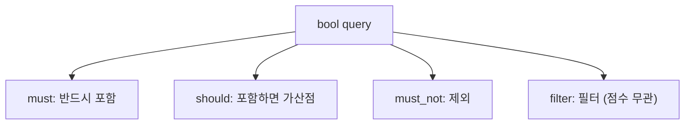

> 이전 편에서는 OpenSearch의 핵심 개념과 CRUD를 다뤘다.
> 이번 편에서는 검색 쿼리 DSL과 Aggregation을 Go 클라이언트 코드와 함께 정리한다.

# 1. 검색 쿼리

OpenSearch의 검색 쿼리는 JSON 기반의 Query DSL을 사용한다. Go 클라이언트에서는 JSON 문자열을 `strings.NewReader`로 전달하는 방식으로 쿼리를 실행한다.

```go
func Search(ctx context.Context, client *opensearchapi.Client, indexName, query string) (*opensearchapi.SearchResp, error) {
    return client.Search(ctx, &opensearchapi.SearchReq{
        Indices: []string{indexName},
        Body:    strings.NewReader(query),
    })
}
```

> 전체 코드: [search.go](https://github.com/kenshin579/tutorials-go/blob/master/database/opensearch/search.go)

## 1.1 기본 검색

### match 쿼리 (전문 검색)

`match` 쿼리는 Analyzer를 통해 텍스트를 분석한 후 검색한다. "Go Programming"을 검색하면 "go"와 "programming" 두 토큰으로 분리되어, 둘 중 하나라도 포함된 문서가 검색된다.

```go
func MatchQuery(ctx context.Context, client *opensearchapi.Client, indexName, field, text string) (*opensearchapi.SearchResp, error) {
    query := `{"query":{"match":{"` + field + `":"` + text + `"}}}`
    return Search(ctx, client, indexName, query)
}
```

```go
func TestMatchQuery(t *testing.T) {
    resp, err := MatchQuery(ctx, client, productIndex, "name", "Go Programming")
    require.NoError(t, err)
    assert.Greater(t, resp.Hits.Total.Value, 0)
}
```

### term 쿼리 (정확한 값 매칭)

`term` 쿼리는 Analyzer를 거치지 않고 정확한 값으로 매칭한다. `keyword` 타입 필드에 사용한다.

```go
func TermQuery(ctx context.Context, client *opensearchapi.Client, indexName, field, value string) (*opensearchapi.SearchResp, error) {
    query := `{"query":{"term":{"` + field + `":"` + value + `"}}}`
    return Search(ctx, client, indexName, query)
}
```

```go
func TestTermQuery(t *testing.T) {
    resp, err := TermQuery(ctx, client, productIndex, "category", "books")
    require.NoError(t, err)
    assert.Greater(t, resp.Hits.Total.Value, 0)
}
```

> **match vs term**: `text` 필드에는 `match`를, `keyword` 필드에는 `term`을 사용한다. `text` 필드에 `term`을 사용하면 분석된 토큰과 정확히 일치해야 하므로 예상과 다른 결과가 나올 수 있다.

### match_phrase 쿼리 (구문 검색)

`match_phrase`는 단어의 순서와 인접성을 고려한다. "Go programming language"를 검색하면 세 단어가 순서대로 인접해 있는 문서만 매칭된다.

```go
func TestMatchPhraseQuery(t *testing.T) {
    resp, err := MatchPhraseQuery(ctx, client, productIndex, "description", "Go programming language")
    require.NoError(t, err)
    assert.Greater(t, resp.Hits.Total.Value, 0)
}
```

### multi_match 쿼리 (여러 필드 검색)

`multi_match`는 여러 필드에서 동시에 검색한다.

```go
func MultiMatchQuery(ctx context.Context, client *opensearchapi.Client, indexName, text string, fields []string) (*opensearchapi.SearchResp, error) {
    fieldsJSON := `"` + strings.Join(fields, `","`) + `"`
    query := `{"query":{"multi_match":{"query":"` + text + `","fields":[` + fieldsJSON + `]}}}`
    return Search(ctx, client, indexName, query)
}
```

```go
func TestMultiMatchQuery(t *testing.T) {
    resp, err := MultiMatchQuery(ctx, client, productIndex, "programming", []string{"name", "description"})
    require.NoError(t, err)
    assert.Greater(t, resp.Hits.Total.Value, 0)
}
```

## 1.2 복합 쿼리

### bool 쿼리 (must, should, must_not, filter)

`bool` 쿼리는 여러 조건을 조합한다.



| 절 | 설명 | 스코어 영향 |
|---|------|------------|
| `must` | 반드시 매칭되어야 함 | O |
| `should` | 매칭되면 스코어 가산 | O |
| `must_not` | 매칭되면 제외 | X |
| `filter` | 반드시 매칭, 캐시 가능 | X |

```go
func TestBoolQuery(t *testing.T) {
    query := `{
  "query": {
    "bool": {
      "must": [
        { "match": { "category": "books" } }
      ],
      "filter": [
        { "range": { "price": { "lte": 40 } } }
      ]
    }
  }
}`
    resp, err := Search(ctx, client, productIndex, query)
    require.NoError(t, err)
    assert.Greater(t, resp.Hits.Total.Value, 0)

    for _, hit := range resp.Hits.Hits {
        var p Product
        json.Unmarshal(hit.Source, &p)
        assert.Equal(t, "books", p.Category)
        assert.LessOrEqual(t, p.Price, 40.0)
    }
}
```

위 예시에서 `must`로 카테고리가 "books"인 문서를 찾고, `filter`로 가격이 40 이하인 문서만 필터링한다. `filter`는 스코어 계산에 영향을 주지 않아 캐시가 가능하며 성능이 좋다.

### range 쿼리 (날짜, 숫자 범위)

```go
func TestRangeQuery(t *testing.T) {
    query := `{
  "query": {
    "range": {
      "price": {
        "gte": 40,
        "lte": 100
      }
    }
  }
}`
    resp, err := Search(ctx, client, productIndex, query)
    require.NoError(t, err)

    for _, hit := range resp.Hits.Hits {
        var p Product
        json.Unmarshal(hit.Source, &p)
        assert.GreaterOrEqual(t, p.Price, 40.0)
        assert.LessOrEqual(t, p.Price, 100.0)
    }
}
```

| 연산자 | 설명 |
|--------|------|
| `gt` | 초과 |
| `gte` | 이상 |
| `lt` | 미만 |
| `lte` | 이하 |

## 1.3 검색 결과 제어

### 정렬 (sort)

```go
func TestSearchWithSort(t *testing.T) {
    query := `{
  "query": { "match_all": {} },
  "sort": [
    { "price": { "order": "asc" } }
  ]
}`
    resp, err := Search(ctx, client, productIndex, query)
    require.NoError(t, err)

    var prevPrice float64
    for _, hit := range resp.Hits.Hits {
        var p Product
        json.Unmarshal(hit.Source, &p)
        assert.GreaterOrEqual(t, p.Price, prevPrice)
        prevPrice = p.Price
    }
}
```

### 페이지네이션 (from/size)

`from`과 `size`로 페이지네이션을 구현한다.

```go
func TestSearchWithPagination(t *testing.T) {
    // 첫 번째 페이지: 3건
    query := `{
  "query": { "match_all": {} },
  "from": 0,
  "size": 3,
  "sort": [{ "price": { "order": "asc" } }]
}`
    page1, err := Search(ctx, client, productIndex, query)
    require.NoError(t, err)
    assert.Equal(t, 3, len(page1.Hits.Hits))

    // 두 번째 페이지
    query = `{
  "query": { "match_all": {} },
  "from": 3,
  "size": 3,
  "sort": [{ "price": { "order": "asc" } }]
}`
    page2, err := Search(ctx, client, productIndex, query)
    require.NoError(t, err)
    assert.NotEqual(t, page1.Hits.Hits[0].ID, page2.Hits.Hits[0].ID)
}
```

> `from + size`는 10,000건 이하에서 사용한다. 대량 데이터에는 `search_after`나 Scroll API를 사용한다.

### 하이라이팅 (highlight)

검색어가 포함된 부분을 `<em>` 태그로 감싸서 반환한다.

```go
func TestSearchWithHighlight(t *testing.T) {
    query := `{
  "query": {
    "match": { "description": "programming" }
  },
  "highlight": {
    "fields": {
      "description": {}
    }
  }
}`
    resp, err := Search(ctx, client, productIndex, query)
    require.NoError(t, err)

    for _, hit := range resp.Hits.Hits {
        highlights, exists := hit.Highlight["description"]
        assert.True(t, exists)
        assert.Greater(t, len(highlights), 0)
        // 예: "The Go <em>programming</em> language is..."
    }
}
```

# 2. Aggregation

Aggregation은 검색 결과에 대한 통계, 그룹화, 분석을 수행한다. SQL의 `GROUP BY`, `AVG`, `COUNT`에 해당한다.

> 전체 코드: [aggregation.go](https://github.com/kenshin579/tutorials-go/blob/master/database/opensearch/aggregation.go)

## 2.1 Metric Aggregation

숫자 필드에 대한 통계값을 계산한다.

### avg (평균)

```go
func AvgAggregation(ctx context.Context, client *opensearchapi.Client, indexName, field string) (*opensearchapi.SearchResp, error) {
    query := `{
  "size": 0,
  "aggs": {
    "avg_value": {
      "avg": { "field": "` + field + `" }
    }
  }
}`
    return Aggregate(ctx, client, indexName, query)
}
```

```go
func TestAvgAggregation(t *testing.T) {
    resp, err := AvgAggregation(ctx, client, productIndex, "price")
    require.NoError(t, err)

    var aggs map[string]json.RawMessage
    json.Unmarshal(resp.Aggregations, &aggs)

    var avgResult struct {
        Value float64 `json:"value"`
    }
    json.Unmarshal(aggs["avg_value"], &avgResult)
    assert.Greater(t, avgResult.Value, 0.0)
}
```

> `"size": 0`을 설정하면 검색 결과(hits)는 반환하지 않고 Aggregation 결과만 받는다.

주요 Metric Aggregation:

| 종류 | 설명 |
|------|------|
| `avg` | 평균 |
| `sum` | 합계 |
| `min` | 최솟값 |
| `max` | 최댓값 |
| `cardinality` | 고유 값 개수 (approximate) |
| `percentiles` | 퍼센타일 (P50, P95, P99) |

## 2.2 Bucket Aggregation

문서를 그룹으로 나눈다. SQL의 `GROUP BY`와 유사하다.

### terms (그룹별 집계)

```go
func TermsAggregation(ctx context.Context, client *opensearchapi.Client, indexName, field string, size int) (*opensearchapi.SearchResp, error) {
    query := fmt.Sprintf(`{
  "size": 0,
  "aggs": {
    "group_by": {
      "terms": { "field": "%s", "size": %d }
    }
  }
}`, field, size)
    return Aggregate(ctx, client, indexName, query)
}
```

```go
func TestTermsAggregation(t *testing.T) {
    resp, err := TermsAggregation(ctx, client, productIndex, "category", 10)
    require.NoError(t, err)

    var aggs map[string]json.RawMessage
    json.Unmarshal(resp.Aggregations, &aggs)

    var termsResult struct {
        Buckets []struct {
            Key      string `json:"key"`
            DocCount int    `json:"doc_count"`
        } `json:"buckets"`
    }
    json.Unmarshal(aggs["group_by"], &termsResult)
    assert.Greater(t, len(termsResult.Buckets), 0)
    // 예: [{Key: "books", DocCount: 5}, {Key: "electronics", DocCount: 5}]
}
```

### date_histogram (시계열 집계)

날짜 필드를 기준으로 시간 구간별 집계를 수행한다.

```go
func DateHistogramAggregation(ctx context.Context, client *opensearchapi.Client, indexName, field, interval string) (*opensearchapi.SearchResp, error) {
    query := `{
  "size": 0,
  "aggs": {
    "over_time": {
      "date_histogram": { "field": "` + field + `", "calendar_interval": "` + interval + `" }
    }
  }
}`
    return Aggregate(ctx, client, indexName, query)
}
```

```go
func TestDateHistogramAggregation(t *testing.T) {
    resp, err := DateHistogramAggregation(ctx, client, productIndex, "created_at", "month")
    require.NoError(t, err)

    // 결과: 월별 상품 등록 수
    var aggs map[string]json.RawMessage
    json.Unmarshal(resp.Aggregations, &aggs)

    var histResult struct {
        Buckets []struct {
            KeyAsString string `json:"key_as_string"`
            DocCount    int    `json:"doc_count"`
        } `json:"buckets"`
    }
    json.Unmarshal(aggs["over_time"], &histResult)
    assert.Greater(t, len(histResult.Buckets), 0)
}
```

## 2.3 중첩 Aggregation

Bucket 안에 Metric을 중첩하면 "그룹별 통계"를 구할 수 있다.

### 카테고리별 평균 가격

```go
func NestedAggregation(ctx context.Context, client *opensearchapi.Client, indexName, bucketField, metricField string) (*opensearchapi.SearchResp, error) {
    query := `{
  "size": 0,
  "aggs": {
    "group_by": {
      "terms": { "field": "` + bucketField + `", "size": 10 },
      "aggs": {
        "avg_metric": {
          "avg": { "field": "` + metricField + `" }
        }
      }
    }
  }
}`
    return Aggregate(ctx, client, indexName, query)
}
```

```go
func TestNestedAggregation(t *testing.T) {
    resp, err := NestedAggregation(ctx, client, productIndex, "category", "price")
    require.NoError(t, err)

    var aggs map[string]json.RawMessage
    json.Unmarshal(resp.Aggregations, &aggs)

    var nestedResult struct {
        Buckets []struct {
            Key       string `json:"key"`
            DocCount  int    `json:"doc_count"`
            AvgMetric struct {
                Value float64 `json:"value"`
            } `json:"avg_metric"`
        } `json:"buckets"`
    }
    json.Unmarshal(aggs["group_by"], &nestedResult)

    for _, bucket := range nestedResult.Buckets {
        assert.Greater(t, bucket.AvgMetric.Value, 0.0)
        // 예: books 평균 38.39, electronics 평균 95.99
    }
}
```

# 3. 마무리

이번 글에서는 OpenSearch의 검색 쿼리와 Aggregation을 다뤘다.

**검색 쿼리**:
- `match`: 전문 검색 (Analyzer 적용)
- `term`: 정확한 값 매칭 (keyword 필드)
- `match_phrase`: 구문 검색 (단어 순서 유지)
- `multi_match`: 여러 필드 동시 검색
- `bool`: 복합 쿼리 (must, should, must_not, filter)
- `range`: 숫자/날짜 범위 검색

**Aggregation**:
- Metric: avg, sum, min, max, percentiles
- Bucket: terms, date_histogram
- 중첩: Bucket + Metric 조합

다음 편에서는 **OpenSearch Dashboards**를 활용하여 API 로그 데이터를 시각화하는 방법을 다룬다.

> 전체 샘플 코드: [tutorials-go/database/opensearch](https://github.com/kenshin579/tutorials-go/tree/master/database/opensearch)

# 참고

- [OpenSearch Query DSL](https://opensearch.org/docs/latest/query-dsl/)
- [OpenSearch Aggregations](https://opensearch.org/docs/latest/aggregations/)
- [OpenSearch Go Client - Search Guide](https://github.com/opensearch-project/opensearch-go/blob/main/guides/search.md)
- [OpenSearch Go Client - Bulk Guide](https://github.com/opensearch-project/opensearch-go/blob/main/guides/bulk.md)
