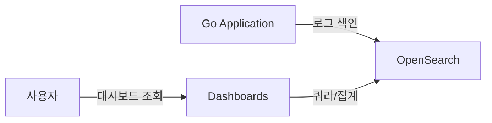

> 이전 편에서는 검색 쿼리와 Aggregation을 다뤘다.
> 이번 편에서는 API 로그 데이터를 OpenSearch에 색인하고, Dashboards에서 시각화하는 방법을 다룬다.

# 1. OpenSearch Dashboards 소개

## 1.1 Dashboards란?

OpenSearch Dashboards는 Kibana의 포크로, OpenSearch 데이터를 시각화하는 도구이다.

주요 기능:
- **Discover**: 데이터 탐색 및 검색
- **Visualize**: 차트, 테이블, 메트릭 등 시각화 생성
- **Dashboard**: 여러 시각화를 하나의 대시보드로 조합
- **Dev Tools**: REST API 직접 실행



# 2. 샘플 데이터: API Access Log

## 2.1 AccessLog 데이터 모델

실제 운영 환경에서 수집되는 API 로그를 모사한 모델이다.

```go
type AccessLog struct {
    Timestamp      time.Time `json:"timestamp"`
    Method         string    `json:"method"`           // GET, POST, PUT, DELETE
    Endpoint       string    `json:"endpoint"`          // /api/v1/products
    StatusCode     int       `json:"status_code"`       // 200, 400, 404, 500
    ResponseTimeMs float64   `json:"response_time_ms"`  // 응답 시간 (밀리초)
    ErrorMessage   string    `json:"error_message"`     // 에러 메시지
    ClientIP       string    `json:"client_ip"`
    UserAgent      string    `json:"user_agent"`
    RequestBody    string    `json:"request_body"`
    ServiceName    string    `json:"service_name"`      // moneyflow-be, inspireme-be
}
```

> 전체 코드: [model.go](https://github.com/kenshin579/tutorials-go/blob/master/database/opensearch/model.go)

## 2.2 로그 인덱스 매핑

로그 데이터에 맞는 매핑을 설정한다. `error_message`는 `text`와 `keyword` 두 가지 타입으로 매핑하여 전문 검색과 정확한 값 매칭 모두 지원한다.

```go
func AccessLogIndexMapping() string {
    return `{
  "settings": {
    "number_of_shards": 1,
    "number_of_replicas": 0
  },
  "mappings": {
    "properties": {
      "timestamp":        { "type": "date" },
      "method":           { "type": "keyword" },
      "endpoint":         { "type": "keyword" },
      "status_code":      { "type": "integer" },
      "response_time_ms": { "type": "float" },
      "error_message":    { "type": "text", "fields": { "keyword": { "type": "keyword" } } },
      "client_ip":        { "type": "ip" },
      "user_agent":       { "type": "text" },
      "request_body":     { "type": "text" },
      "service_name":     { "type": "keyword" }
    }
  }
}`
}
```

> 전체 코드: [index.go](https://github.com/kenshin579/tutorials-go/blob/master/database/opensearch/index.go)

### Multi-field 매핑

`error_message` 필드는 `text`와 `keyword` 두 가지로 매핑된다.

| 필드 | 타입 | 용도 |
|------|------|------|
| `error_message` | `text` | 전문 검색 ("database timeout" 등) |
| `error_message.keyword` | `keyword` | 정확한 값 집계 (terms agg) |

## 2.3 Go 코드로 샘플 로그 데이터 벌크 색인

샘플 데이터 50건을 벌크 색인한다.

```go
func TestBulkIndexAccessLogs(t *testing.T) {
    logs := loadAccessLogs(t) // testdata/access_logs.json 로드
    indexAccessLogs(t, logs)  // 벌크 색인
}
```

## 2.4 Index Pattern 생성

Dashboards에서 데이터를 조회하려면 Index Pattern을 생성해야 한다.

1. Dashboards 접속 (`http://localhost:5601`)
2. **Management** > **Index Patterns** 이동
3. **Create index pattern** 클릭
4. Index pattern: `test-access-logs*` 입력
5. Time field: `timestamp` 선택
6. **Create index pattern** 완료

생성 후 **Discover**에서 로그 데이터를 확인할 수 있다.

# 3. Visualization 만들기

## 3.1 Top Errors 대시보드

### Pie Chart: HTTP 상태 코드 분포

상태 코드별 요청 분포를 Pie Chart로 시각화한다.

**Dashboards 설정**:
- **Visualize** > **Create visualization** > **Pie**
- Metrics: Count
- Buckets: Terms aggregation on `status_code`

대응하는 Go 쿼리:

```go
func StatusCodeDistribution(ctx context.Context, client *opensearchapi.Client, indexName string) (*opensearchapi.SearchResp, error) {
    query := `{
  "size": 0,
  "aggs": {
    "status_codes": {
      "terms": { "field": "status_code", "size": 20 }
    }
  }
}`
    return client.Search(ctx, &opensearchapi.SearchReq{
        Indices: []string{indexName},
        Body:    strings.NewReader(query),
    })
}
```

```go
func TestStatusCodeDistribution(t *testing.T) {
    resp, err := StatusCodeDistribution(ctx, client, accessLogIndex)
    require.NoError(t, err)

    var aggs map[string]json.RawMessage
    json.Unmarshal(resp.Aggregations, &aggs)

    var termsResult struct {
        Buckets []struct {
            Key      int `json:"key"`
            DocCount int `json:"doc_count"`
        } `json:"buckets"`
    }
    json.Unmarshal(aggs["status_codes"], &termsResult)
    assert.Greater(t, len(termsResult.Buckets), 0)
    // 예: [{200, 25}, {500, 5}, {404, 4}, {400, 3}, ...]
}
```

### Data Table: Top N 에러 메시지

에러 메시지별 발생 건수를 테이블로 표시한다.

```go
func TopErrors(ctx context.Context, client *opensearchapi.Client, indexName string, topN int) (*opensearchapi.SearchResp, error) {
    query := fmt.Sprintf(`{
  "size": 0,
  "query": {
    "range": { "status_code": { "gte": 400 } }
  },
  "aggs": {
    "top_errors": {
      "terms": { "field": "error_message.keyword", "size": %d }
    }
  }
}`, topN)
    return client.Search(ctx, &opensearchapi.SearchReq{
        Indices: []string{indexName},
        Body:    strings.NewReader(query),
    })
}
```

```go
func TestTopErrors(t *testing.T) {
    resp, err := TopErrors(ctx, client, accessLogIndex, 5)
    require.NoError(t, err)
    // 결과 예:
    // 1. database connection timeout (4건)
    // 2. internal server error (2건)
    // 3. user not found (1건)
    // ...
}
```

### Vertical Bar: 시간대별 에러 발생 추이

```go
func ErrorRateOverTime(ctx context.Context, client *opensearchapi.Client, indexName, interval string) (*opensearchapi.SearchResp, error) {
    query := `{
  "size": 0,
  "query": {
    "range": { "status_code": { "gte": 400 } }
  },
  "aggs": {
    "errors_over_time": {
      "date_histogram": { "field": "timestamp", "calendar_interval": "` + interval + `" }
    }
  }
}`
    return client.Search(ctx, &opensearchapi.SearchReq{
        Indices: []string{indexName},
        Body:    strings.NewReader(query),
    })
}
```

## 3.2 API 호출 지표 대시보드

### Horizontal Bar: 엔드포인트별 호출 횟수

```go
func RequestCountByEndpoint(ctx context.Context, client *opensearchapi.Client, indexName string, topN int) (*opensearchapi.SearchResp, error) {
    query := fmt.Sprintf(`{
  "size": 0,
  "aggs": {
    "by_endpoint": {
      "terms": { "field": "endpoint", "size": %d }
    }
  }
}`, topN)
    return client.Search(ctx, &opensearchapi.SearchReq{
        Indices: []string{indexName},
        Body:    strings.NewReader(query),
    })
}
```

```go
func TestRequestCountByEndpoint(t *testing.T) {
    resp, err := RequestCountByEndpoint(ctx, client, accessLogIndex, 10)
    require.NoError(t, err)
    // 결과 예:
    // /api/v1/products    - 15건
    // /api/v1/orders      - 8건
    // /api/v1/users       - 6건
    // /api/v1/auth/login  - 5건
}
```

### Data Table: 느린 API Top N

엔드포인트별 평균 응답 시간을 내림차순으로 정렬한다.

```go
func SlowestEndpoints(ctx context.Context, client *opensearchapi.Client, indexName string, topN int) (*opensearchapi.SearchResp, error) {
    query := fmt.Sprintf(`{
  "size": 0,
  "aggs": {
    "by_endpoint": {
      "terms": { "field": "endpoint", "size": %d, "order": { "avg_response_time": "desc" } },
      "aggs": {
        "avg_response_time": {
          "avg": { "field": "response_time_ms" }
        }
      }
    }
  }
}`, topN)
    return client.Search(ctx, &opensearchapi.SearchReq{
        Indices: []string{indexName},
        Body:    strings.NewReader(query),
    })
}
```

### Metric: P95, P99 응답 시간

퍼센타일 응답 시간은 SLA 모니터링에 중요한 지표이다.

```go
func PercentileResponseTime(ctx context.Context, client *opensearchapi.Client, indexName string) (*opensearchapi.SearchResp, error) {
    query := `{
  "size": 0,
  "aggs": {
    "response_time_percentiles": {
      "percentiles": {
        "field": "response_time_ms",
        "percents": [50, 95, 99]
      }
    }
  }
}`
    return client.Search(ctx, &opensearchapi.SearchReq{
        Indices: []string{indexName},
        Body:    strings.NewReader(query),
    })
}
```

```go
func TestPercentileResponseTime(t *testing.T) {
    resp, err := PercentileResponseTime(ctx, client, accessLogIndex)
    require.NoError(t, err)

    var aggs map[string]json.RawMessage
    json.Unmarshal(resp.Aggregations, &aggs)

    var percResult struct {
        Values map[string]float64 `json:"values"`
    }
    json.Unmarshal(aggs["response_time_percentiles"], &percResult)
    assert.Contains(t, percResult.Values, "50.0")
    assert.Contains(t, percResult.Values, "95.0")
    assert.Contains(t, percResult.Values, "99.0")
    // 예: P50=55.7ms, P95=8500.1ms, P99=10234.5ms
}
```

> 전체 코드: [dashboard.go](https://github.com/kenshin579/tutorials-go/blob/master/database/opensearch/dashboard.go)

## 3.3 종합 대시보드

Dashboards에서 위에서 만든 Visualization들을 하나의 Dashboard로 조합한다.

**Dashboard 구성 방법**:
1. **Dashboard** > **Create dashboard** 클릭
2. **Add** 버튼으로 생성한 Visualization 추가
3. 레이아웃 드래그&드롭으로 배치
4. 시간 범위 필터 설정 (예: Last 24 hours)
5. 자동 새로고침 설정 (예: 10초)

**권장 대시보드 레이아웃**:

| 위치 | Visualization | 타입 |
|------|---------------|------|
| 상단 좌 | 총 요청 수 | Metric |
| 상단 중 | 평균 응답 시간 | Metric |
| 상단 우 | P95 응답 시간 | Metric |
| 중단 좌 | 상태 코드 분포 | Pie Chart |
| 중단 우 | 시간대별 에러 추이 | Vertical Bar |
| 하단 좌 | 엔드포인트별 호출 횟수 | Horizontal Bar |
| 하단 우 | Top 10 에러 메시지 | Data Table |
| 최하단 | 느린 API Top 10 | Data Table |

# 4. Dashboard를 위한 Aggregation 쿼리 (Go)

앞서 소개한 쿼리들을 정리하면 다음과 같다.

| 쿼리 함수 | 용도 | Visualization |
|-----------|------|---------------|
| `StatusCodeDistribution` | 상태 코드 분포 | Pie Chart |
| `TopErrors` | Top N 에러 메시지 | Data Table |
| `ErrorRateOverTime` | 시간대별 에러 추이 | Vertical Bar |
| `RequestCountByEndpoint` | 엔드포인트별 호출 수 | Horizontal Bar |
| `SlowestEndpoints` | 느린 API Top N | Data Table |
| `PercentileResponseTime` | P50/P95/P99 응답 시간 | Metric |

이 쿼리들은 Dashboards에서 시각화할 때 사용하는 Aggregation과 동일한 구조이다. Go 코드에서 직접 실행하면 애플리케이션 내에서 모니터링 데이터를 활용할 수 있다.

# 5. 마무리

3편의 시리즈를 통해 OpenSearch의 핵심 기능을 살펴봤다.

**시리즈 요약**:
- **1편**: 역색인, Analyzer, 매핑 등 핵심 개념과 Go 클라이언트 CRUD
- **2편**: 검색 쿼리 DSL(match, bool, range)과 Aggregation(Metric, Bucket)
- **3편**: API 로그 데이터 모델링, Dashboards Visualization, 대시보드 구성

**향후 학습 방향**:
- **한국어 형태소 분석**: Nori Plugin을 활용한 한국어 검색
- **Index Template / ILM**: 인덱스 자동 관리와 수명 주기 관리
- **Alerting Plugin**: 조건 기반 알림 설정
- **클러스터 운영**: 멀티 노드 클러스터 구성과 모니터링
- **Kubernetes 연동**: OpenSearch를 K8s에 배포하고 운영하기

> 전체 샘플 코드: [tutorials-go/database/opensearch](https://github.com/kenshin579/tutorials-go/tree/master/database/opensearch)

# 참고

- [OpenSearch Dashboards 가이드](https://opensearch.org/docs/latest/dashboards/)
- [OpenSearch Dashboards - Visualize](https://opensearch.org/docs/latest/dashboards/visualize/viz-index/)
- [OpenSearch Aggregations](https://opensearch.org/docs/latest/aggregations/)
- [OpenSearch Go Client](https://github.com/opensearch-project/opensearch-go)
- [testcontainers-go](https://golang.testcontainers.org/)
