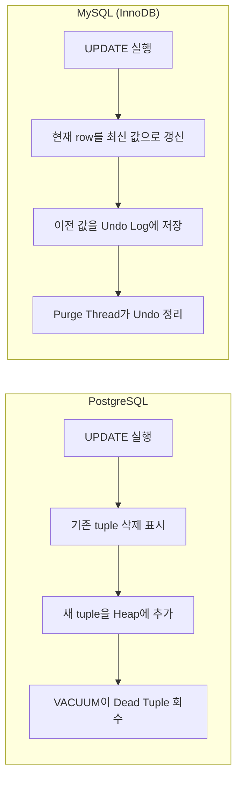
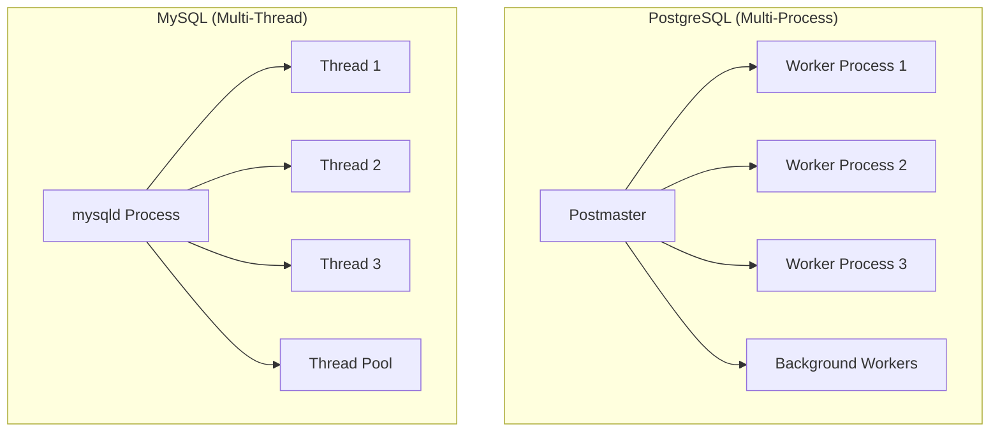
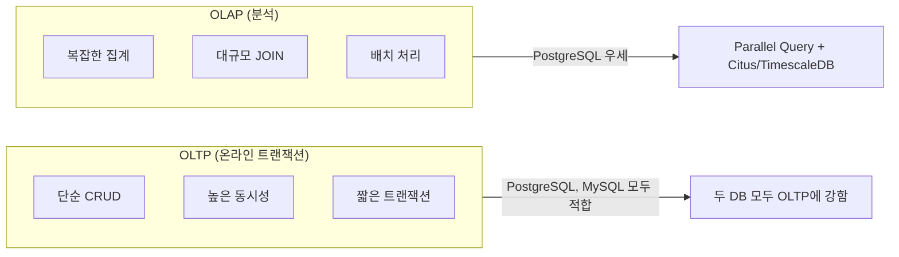
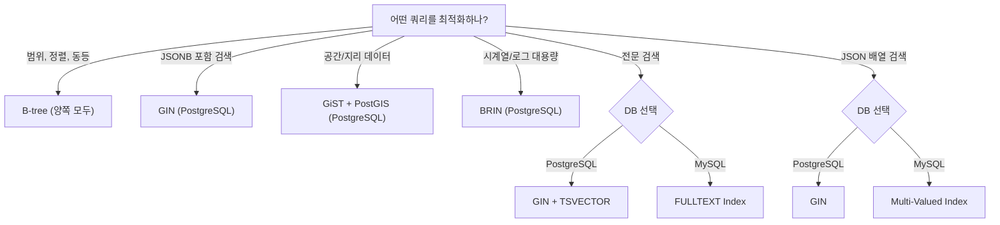
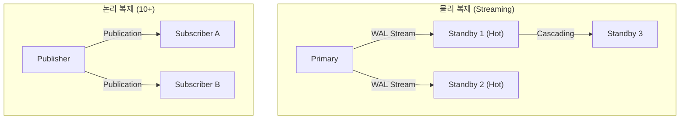
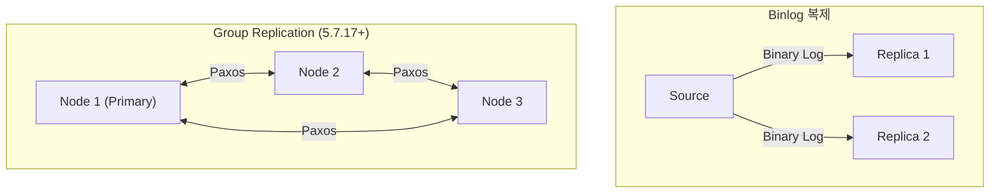
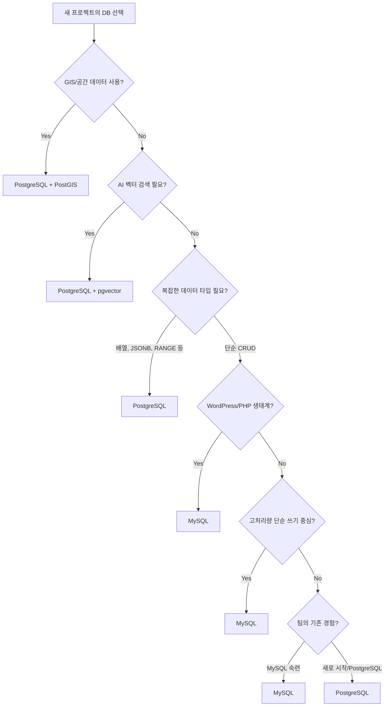

PostgreSQL과 MySQL은 가장 널리 쓰이는 오픈소스 관계형 데이터베이스다. 둘 다 검증된 RDBMS이지만, 아키텍처부터 확장 생태계까지 근본적인 차이가 있다.

이 글에서는 PostgreSQL 17과 MySQL 8.4 LTS / 9.x를 기준으로, 실무에서 DB를 선택할 때 알아야 할 핵심 차이점을 비교한다.

# 1. 핵심 아키텍처 차이

## 1.1 MVCC 구현 방식

두 DB 모두 MVCC(Multi-Version Concurrency Control)로 동시성을 제어하지만, 구현 방식이 다르다.

**PostgreSQL** - Heap 내 Tuple Versioning:

- UPDATE 시 기존 row를 삭제 표시하고, 새 버전의 row를 heap에 추가한다
- `xmin`, `xmax` 시스템 컬럼으로 트랜잭션 가시성을 제어한다
- 구 버전 tuple은 VACUUM 프로세스가 회수한다
- 높은 UPDATE/DELETE 빈도에서 Table Bloat이 발생할 수 있다

**MySQL (InnoDB)** - Undo Log 기반:

- 현재 row는 항상 최신 버전을 유지하고, 구 버전은 Undo Tablespace에 저장한다
- Purge Thread가 불필요한 undo log를 비동기로 삭제한다
- 쓰기 오버헤드가 PostgreSQL보다 낮다



| 항목 | PostgreSQL | MySQL (InnoDB) |
|------|-----------|----------------|
| MVCC 저장 위치 | Heap 내 tuple | Undo Tablespace |
| 구 버전 정리 | VACUUM (autovacuum) | Purge Thread |
| 쓰기 오버헤드 | 상대적으로 높음 | 상대적으로 낮음 |
| 팽창 위험 | Table Bloat | Undo Bloat (HLL 급증) |

## 1.2 스토리지 엔진

**PostgreSQL**은 단일 스토리지 엔진(Heap + WAL)을 사용한다. Table Access Method API로 커스텀 엔진을 이론상 추가할 수 있지만, 실질적으로 단일 엔진이다.

**MySQL**은 플러그인형 스토리지 엔진 아키텍처다. 용도에 따라 엔진을 선택할 수 있다.

| 엔진 | 특징 | 용도 |
|------|------|------|
| **InnoDB** (기본) | ACID, Row Lock, FK | 대부분의 워크로드 |
| MyISAM | Table Lock, 빠른 읽기 | 레거시 (사용 비권장) |
| Memory | 인메모리, 휘발성 | 임시 테이블 |
| NDB Cluster | 분산 인메모리 | MySQL Cluster |
| MyRocks (Percona) | LSM-Tree (RocksDB 기반) | 쓰기 집중 워크로드 |

> 현재 MySQL에서 InnoDB 외 엔진을 쓸 일은 거의 없다. 하지만 플러그인 아키텍처 자체가 MySQL의 설계 특징이다.

## 1.3 프로세스 vs 스레드 모델



| 항목 | PostgreSQL | MySQL |
|------|-----------|-------|
| 모델 | 연결당 OS 프로세스 (fork) | 연결당 OS 스레드 |
| 메모리 격리 | 완벽 (프로세스 독립) | 공유 메모리 (Buffer Pool 공유) |
| 연결 오버헤드 | 높음 (프로세스 생성) | 낮음 (스레드 생성) |
| 권장 최대 연결 | 100~500 (기본 100) | 수천 개 (스레드 풀 시) |
| 연결 풀러 | PgBouncer 필수 | ProxySQL (선택) |

**실무 영향**: PostgreSQL 기반 서비스에서는 PgBouncer 같은 연결 풀러가 사실상 필수다. MySQL은 스레드 풀로 대규모 동시 연결을 직접 처리할 수 있다.

# 2. SQL 표준 준수

PostgreSQL은 관계형 DB 중 SQL 표준 준수율이 가장 높다. MySQL은 8.0부터 CTE, Window Function 등을 추가하며 격차를 줄이고 있다.

| 기능 | PostgreSQL | MySQL | 비고 |
|------|-----------|-------|------|
| CTE (`WITH`) | 8.4+ (2005) | 8.0+ (2018) | |
| `WITH RECURSIVE` | 8.4+ | 8.0+ | |
| Window Function | 8.4+ (2008) | 8.0+ (2018) | |
| `LATERAL` JOIN | 9.3+ (2013) | 8.0.14+ (2019) | |
| `FULL OUTER JOIN` | 지원 | **미지원** | MySQL은 LEFT + RIGHT UNION으로 우회 |
| `RETURNING` 절 | 지원 | **미지원** | INSERT/UPDATE/DELETE 후 결과 반환 |
| `MERGE` 문 | 15+ (2022) | **미지원** | MySQL은 `INSERT ON DUPLICATE KEY UPDATE` |
| `CHECK` 제약 | 완전 지원 | 8.0.16+ | 이전 버전은 파싱만, 무시됨 |
| `JSON_TABLE` | 17+ (2024) | 8.0+ (2018) | MySQL이 먼저 지원 |
| `FILTER` (집계) | 9.4+ | **미지원** | |
| Functional Index | 지원 | 8.0+ | |
| Invisible Index | **미지원** | 8.0+ | 인덱스를 플래너에서 숨김 |
| Descending Index | 지원 | 8.0+ | |

## 2.1 PostgreSQL만 지원하는 주요 기능

```sql
-- RETURNING: INSERT 후 생성된 값 즉시 반환
INSERT INTO users (name, email) VALUES ('Frank', 'frank@example.com')
RETURNING id, created_at;

-- FILTER: 집계 함수에 조건 적용
SELECT
    COUNT(*) AS total,
    COUNT(*) FILTER (WHERE status = 'active') AS active_count,
    COUNT(*) FILTER (WHERE status = 'inactive') AS inactive_count
FROM users;

-- FULL OUTER JOIN
SELECT a.id, b.id
FROM table_a a FULL OUTER JOIN table_b b ON a.key = b.key;
```

## 2.2 MySQL 고유 기능

```sql
-- INSERT ON DUPLICATE KEY UPDATE (MERGE 대체)
INSERT INTO users (id, name, email)
VALUES (1, 'Frank', 'frank@example.com')
ON DUPLICATE KEY UPDATE name = VALUES(name), email = VALUES(email);

-- Invisible Index: 인덱스 효과를 테스트
ALTER TABLE users ALTER INDEX idx_email INVISIBLE;
-- 쿼리 성능 측정 후 다시 활성화
ALTER TABLE users ALTER INDEX idx_email VISIBLE;
```

# 3. 데이터 타입 비교

## 3.1 JSON 지원

**PostgreSQL**은 `JSON`과 `JSONB` 두 가지 타입을 제공한다. `JSONB`는 바이너리 파싱 저장으로, GIN 인덱스를 걸어 빠른 검색이 가능하다.

```sql
-- PostgreSQL: JSONB + GIN 인덱스
CREATE TABLE products (
    id SERIAL PRIMARY KEY,
    data JSONB
);

CREATE INDEX idx_data ON products USING GIN (data);

-- containment 연산자로 조건 검색 (GIN 인덱스 활용)
SELECT * FROM products WHERE data @> '{"category": "electronics"}';

-- 경로 표현식
SELECT data -> 'name' AS name FROM products WHERE data ->> 'price' > '100';
```

**MySQL**은 5.7.8부터 `JSON` 타입을 지원한다. 내부적으로 바이너리 저장이며, 8.0.17부터 Multi-Valued Index로 JSON 배열 인덱싱이 가능하다.

```sql
-- MySQL: JSON + Multi-Valued Index
CREATE TABLE products (
    id INT PRIMARY KEY AUTO_INCREMENT,
    data JSON
);

-- Multi-Valued Index (JSON 배열 값 인덱싱, 8.0.17+)
CREATE INDEX idx_tags ON products ((CAST(data->'$.tags' AS CHAR(50) ARRAY)));

-- 경로 표현식
SELECT data->>'$.name' AS name FROM products WHERE data->>'$.price' > '100';
```

| 항목 | PostgreSQL | MySQL |
|------|-----------|-------|
| 타입 | JSON, **JSONB** | JSON |
| 바이너리 저장 | JSONB | JSON (내부적으로 바이너리) |
| 인덱스 | **GIN** (containment, 경로 검색) | Multi-Valued Index (배열) |
| containment 연산 (`@>`) | 지원 | 미지원 |
| `JSON_TABLE` | 17+ | 8.0+ |
| Schema 검증 | 미지원 | `JSON_SCHEMA_VALID()` (8.0+) |

## 3.2 배열 및 복합 타입

PostgreSQL은 네이티브 배열 타입을 지원한다. MySQL은 배열 타입이 없어 JSON 배열로 대체한다.

```sql
-- PostgreSQL: 배열 타입
CREATE TABLE articles (
    id SERIAL PRIMARY KEY,
    title TEXT,
    tags TEXT[]  -- 문자열 배열
);

INSERT INTO articles (title, tags) VALUES ('Go 입문', ARRAY['go', 'tutorial', 'backend']);

-- 배열 containment
SELECT * FROM articles WHERE tags @> ARRAY['go'];

-- 배열 겹침 (overlap)
SELECT * FROM articles WHERE tags && ARRAY['go', 'python'];

-- GIN 인덱스로 배열 검색 최적화
CREATE INDEX idx_tags ON articles USING GIN (tags);
```

## 3.3 특수 데이터 타입

| 타입 | PostgreSQL | MySQL |
|------|-----------|-------|
| UUID | `UUID` 타입 + `gen_random_uuid()` | 함수만 (`UUID()`, 전용 타입 없음) |
| Boolean | `BOOLEAN` (true/false) | `TINYINT(1)` (0/1) |
| 네트워크 | `INET`, `CIDR`, `MACADDR` | 미지원 (VARCHAR로 대체) |
| 전문검색 | `TSVECTOR`, `TSQUERY` | `FULLTEXT INDEX` |
| 범위 | `INT4RANGE`, `TSRANGE`, `MULTIRANGE` | 미지원 |
| 기하학 | `POINT`, `LINE`, `POLYGON`, `CIRCLE` | Spatial (GIS 기능 제한적) |
| Key-Value | `HSTORE` | 미지원 (JSON으로 대체) |
| ENUM | `CREATE TYPE`으로 별도 정의 | `ENUM('a','b','c')` 컬럼 레벨 |

## 3.4 AI 벡터 타입

AI/RAG 파이프라인에서 임베딩 벡터 검색이 중요해지면서, 두 DB 모두 벡터 타입을 지원한다.

| 항목 | PostgreSQL (pgvector) | MySQL (9.0+) |
|------|----------------------|--------------|
| 도입 시기 | 2021~ (확장) | 2024.07 (9.0 내장) |
| 타입 | `VECTOR(dim)` (확장) | `VECTOR(dim)` (내장) |
| 인덱스 | IVFFlat, **HNSW** | HNSW (9.2+) |
| 거리 함수 | L2, Cosine, Inner Product | L2, Cosine, Inner Product |
| 생태계 통합 | LangChain, LlamaIndex 기본 지원 | 초기 단계 |
| 성숙도 | 프로덕션 검증 완료 | 실험적 (Innovation 릴리즈) |

```sql
-- PostgreSQL: pgvector
CREATE EXTENSION vector;

CREATE TABLE documents (
    id SERIAL PRIMARY KEY,
    content TEXT,
    embedding VECTOR(1536)  -- OpenAI embedding 차원
);

CREATE INDEX idx_embedding ON documents USING hnsw (embedding vector_cosine_ops);

-- 코사인 유사도 검색
SELECT content, 1 - (embedding <=> '[0.1, 0.2, ...]') AS similarity
FROM documents
ORDER BY embedding <=> '[0.1, 0.2, ...]'
LIMIT 5;
```

# 4. 성능 특성

## 4.1 읽기 vs 쓰기 워크로드

| 워크로드 | PostgreSQL | MySQL (InnoDB) |
|---------|-----------|----------------|
| 복잡한 JOIN/집계 | 강점 (플래너 정교) | 보통 |
| 단순 PK 조회 | 보통 | 강점 (클러스터드 인덱스) |
| 대량 INSERT | VACUUM 부하 고려 | Undo Log로 효율적 |
| 대량 UPDATE | Table Bloat 주의 | 상대적으로 낮은 오버헤드 |
| Parallel Query | 9.6+ (Parallel Seq Scan, Hash Join, Aggregate) | 제한적 |

- **복잡한 쿼리** → PostgreSQL의 쿼리 플래너가 정교하게 최적 실행 계획을 세운다
- **단순 PK 조회** → MySQL InnoDB의 클러스터드 인덱스 구조가 PK 기반 조회에서 구조적 이점이 있다

## 4.2 OLTP vs OLAP



| 분류 | PostgreSQL | MySQL |
|------|-----------|-------|
| OLTP | 복잡한 트랜잭션 로직과 결합 시 강점 | 소셜/웹앱의 고처리량 OLTP에서 검증 |
| OLAP | Parallel Query, Citus로 분산 분석 | HeatWave (Oracle Cloud 전용) |
| 혼합(HTAP) | TimescaleDB, pg_analytics | HeatWave로 부분 지원 |

# 5. 인덱스 타입

## 5.1 PostgreSQL 인덱스

PostgreSQL은 7종의 인덱스 타입을 지원한다.

| 인덱스 | 용도 | 예시 |
|--------|------|------|
| **B-tree** | 범위/정렬/동등 조건 (기본) | `WHERE age > 20`, `ORDER BY name` |
| **Hash** | 동등 비교 전용 (`=`) | `WHERE id = 42` |
| **GiST** | 기하학, 전문검색, IP 범위 | PostGIS 공간 인덱스 |
| **SP-GiST** | 비균형 공간 분할 (Quadtree) | 좌표, IP 쿼리 |
| **GIN** | 배열, JSONB, TSVECTOR | 다중값 포함 검색 |
| **BRIN** | 물리적으로 정렬된 대용량 테이블 | 시계열, 로그 데이터 |
| **Bloom** | 다중 컬럼 동등 필터 | 확장 설치 필요 |

**PostgreSQL 전용 인덱스 기능:**

```sql
-- Partial Index: 조건에 맞는 행만 인덱싱 → 크기 절감
CREATE INDEX idx_active_users ON users (email) WHERE active = true;

-- Expression Index: 함수 결과에 인덱스
CREATE INDEX idx_lower_email ON users (LOWER(email));

-- Covering Index (INCLUDE): Index-Only Scan 가능
CREATE INDEX idx_user_email ON users (email) INCLUDE (name, created_at);

-- CONCURRENTLY: 테이블 락 없이 인덱스 생성
CREATE INDEX CONCURRENTLY idx_name ON users (name);
```

## 5.2 MySQL 인덱스

| 인덱스 | 용도 | 비고 |
|--------|------|------|
| **B-tree** | 기본 인덱스 (InnoDB) | 클러스터드 인덱스 (PK) |
| **Full-Text** | 전문 검색 | `MATCH() AGAINST()` |
| **Spatial** | 공간 데이터 (R-Tree) | PostGIS 대비 제한적 |
| **Multi-Valued** | JSON 배열 인덱싱 (8.0.17+) | |
| **Functional** | 표현식 인덱스 (8.0+) | |
| **Invisible** | 플래너에서 숨김 (8.0+) | 성능 테스트용 |
| **Descending** | 내림차순 저장 (8.0+) | |

**Adaptive Hash Index (AHI)**: InnoDB가 자주 사용되는 B-tree 검색 경로를 자동으로 해시화한다. 수동 설정은 불가하다.

## 5.3 인덱스 선택 가이드



# 6. 동시성 제어

## 6.1 트랜잭션 격리 수준

| 격리 수준 | PostgreSQL | MySQL (InnoDB) |
|-----------|-----------|----------------|
| Read Uncommitted | 지원 (실제로 RC처럼 동작) | 지원 |
| **Read Committed** | **기본값** | 지원 |
| **Repeatable Read** | 지원 | **기본값** |
| Serializable | SSI 기반 | SELECT → LOCK IN SHARE MODE |

핵심 차이:
- PostgreSQL은 **Read Committed**가 기본이고, MySQL은 **Repeatable Read**가 기본이다
- PostgreSQL의 RR은 MVCC 특성상 Phantom Read도 방지한다
- MySQL의 RR은 **Gap Lock**으로 Phantom Read를 방지한다

## 6.2 PostgreSQL SSI vs MySQL Gap Lock

**PostgreSQL SSI (Serializable Snapshot Isolation)**:
- MVCC 기반으로 직렬화 이상(anomaly)을 감지한다
- 락을 걸지 않고 anti-dependency를 추적하여, 위반 시 트랜잭션을 롤백한다
- 읽기 성능에 거의 영향 없이 Serializable 격리를 제공한다

**MySQL Gap Lock**:
- RR 격리에서 인덱스 범위 내 삽입을 막는 잠금이다
- Phantom Read를 방지하지만, 잠금 경합이 발생할 수 있다

```sql
-- MySQL Gap Lock 예시: id BETWEEN 10 AND 20 범위에 Gap Lock
-- 트랜잭션 A
SELECT * FROM orders WHERE id BETWEEN 10 AND 20 FOR UPDATE;

-- 트랜잭션 B: 이 INSERT는 Gap Lock에 의해 대기
INSERT INTO orders (id, amount) VALUES (15, 100);
```

## 6.3 잠금 비교

| 항목 | PostgreSQL | MySQL (InnoDB) |
|------|-----------|----------------|
| Row Lock | `FOR UPDATE`, `FOR SHARE`, `FOR NO KEY UPDATE`, `FOR KEY SHARE` | Record Lock |
| Gap Lock | 없음 (SSI로 대체) | RR에서 자동 적용 |
| Next-Key Lock | 없음 | Record Lock + Gap Lock |
| Advisory Lock | `pg_advisory_lock()` | `GET_LOCK()` |
| DDL Lock | Concurrent Index 지원 | 대부분 테이블 락 (Online DDL 개선 중) |
| Deadlock | 자동 감지 + 롤백 | 자동 감지 + 롤백 |

# 7. 복제 및 고가용성

## 7.1 PostgreSQL 복제



| 방식 | 설명 |
|------|------|
| **Streaming Replication** | WAL 스트림 기반, 동기/비동기 선택, Hot Standby 읽기 |
| **Logical Replication** (10+) | 테이블 단위, 다른 PG 버전 간 복제 가능 |
| **Cascading** | Standby → Standby 체인 복제 |

**HA 솔루션:**

| 도구 | 특징 |
|------|------|
| **Patroni** | etcd/ZooKeeper 기반 Leader Election (사실상 표준) |
| Repmgr | 간단한 구성의 복제 관리 + 페일오버 |
| Stolon | Kubernetes 친화적 |
| Pgpool-II | 연결 풀 + 로드밸런싱 + 복제 올인원 |

## 7.2 MySQL 복제



| 방식 | 설명 |
|------|------|
| **Binlog Replication** | Statement/Row/Mixed 형식, GTID로 일관된 포인트 관리 |
| **Group Replication** (5.7.17+) | Paxos 기반 분산 합의, Single/Multi-Primary 모드 |
| **InnoDB Cluster** | Group Replication + MySQL Shell + MySQL Router (공식 HA) |
| **InnoDB ClusterSet** (8.0.27+) | 다중 데이터센터 재해복구 |

## 7.3 복제 비교

| 항목 | PostgreSQL | MySQL |
|------|-----------|-------|
| 물리 복제 | WAL Streaming | Binary Log |
| 논리 복제 | Logical Replication (10+) | GTID (5.6+) |
| 다중 마스터 | BDR (서드파티) | Group Replication (Multi-Primary) |
| 공식 HA | Patroni (커뮤니티 표준) | InnoDB Cluster (공식) |
| 분산 DB | Citus | NDB Cluster, Vitess |

# 8. 확장 생태계

PostgreSQL의 확장 생태계는 가장 큰 차별화 포인트 중 하나다. `CREATE EXTENSION` 명령으로 기능을 동적 추가할 수 있다.

## 8.1 PostgreSQL 핵심 확장

| 확장 | 분야 | 설명 |
|------|------|------|
| **PostGIS** | GIS | 지리공간 업계 표준. ArcGIS, QGIS 백엔드로 사용 |
| **pgvector** | AI | 벡터 검색. LangChain, LlamaIndex 기본 지원 |
| **TimescaleDB** | 시계열 | Hypertable 자동 파티셔닝, Continuous Aggregate |
| **Citus** | 분산 | 샤딩 + 병렬 쿼리 (Microsoft 인수) |
| `pg_stat_statements` | 모니터링 | SQL 성능 통계 (필수 확장) |
| `pg_trgm` | 검색 | 트라이그램 유사도, LIKE 쿼리 최적화 |
| `pg_cron` | 스케줄러 | DB 내 크론 작업 |
| `pg_repack` | 관리 | 테이블 재구성 (VACUUM FULL 대체) |
| `postgres_fdw` | 연합 | 다른 PostgreSQL 인스턴스 연결 |
| `pgaudit` | 보안 | 감사 로그 |

## 8.2 MySQL 플러그인

| 플러그인/컴포넌트 | 분야 | 설명 |
|-------------------|------|------|
| Clone Plugin (8.0.17+) | 관리 | 온라인 데이터 복제 |
| Audit Plugin | 보안 | MySQL Enterprise Audit |
| Keyring 컴포넌트 | 보안 | TDE (Transparent Data Encryption) |
| MeCab | 검색 | 한국어/일본어 형태소 분석 (Full-Text) |
| **HeatWave** | 분석 | Oracle Cloud 전용 인메모리 분석 엔진 |
| Percona XtraBackup | 백업 | 물리 백업 (서드파티) |
| ProxySQL | 연결 | 연결 풀 + 쿼리 라우팅 (서드파티) |

## 8.3 확장 생태계 비교

| 분야 | PostgreSQL | MySQL |
|------|-----------|-------|
| GIS | **PostGIS** (업계 표준) | Spatial (제한적) |
| AI 벡터 | **pgvector** (프로덕션 검증) | VECTOR 9.0+ (초기) |
| 시계열 | **TimescaleDB** | 없음 |
| 분산 | **Citus** | NDB Cluster, Vitess |
| 연합 쿼리 | FDW (MySQL, CSV, Redis 등 연결) | FEDERATED (제한적) |
| 분석 | pg_analytics (DuckDB 기반) | HeatWave (Oracle Cloud 전용) |

# 9. 최신 버전 주요 기능

## 9.1 PostgreSQL 17 (2024.09)

| 기능 | 설명 |
|------|------|
| `JSON_TABLE()` | SQL/JSON 표준 함수 추가 |
| VACUUM 대폭 개선 | 인덱스 오버헤드 감소, I/O prefetching |
| WAL 최적화 | `wal_compression=zstd`, WAL 쓰기 감소 |
| `MERGE RETURNING` | MERGE 문에서 RETURNING 지원 |
| `COPY ON_ERROR` | 오류 행 건너뛰기 옵션 |
| Logical Replication Failover | 슬롯 동기화를 통한 페일오버 |

## 9.2 MySQL 8.4 LTS (2024.04)

| 기능 | 설명 |
|------|------|
| LTS 지원 | 5년 Premier + 3년 Extended Support |
| 레거시 정리 | `MASTER_*` → `SOURCE_*` 파라미터만 지원 |
| `EXPLAIN ANALYZE` 개선 | 실행 통계 세분화 |
| 인증 강화 | `caching_sha2_password` 기본값 |

## 9.3 MySQL 9.x Innovation (2024.07~)

| 기능 | 버전 | 설명 |
|------|------|------|
| `VECTOR` 타입 | 9.0 | AI 임베딩 벡터 저장 |
| JavaScript Stored Programs | 9.1 | GraalVM 기반 JS 프로시저 |
| HNSW 인덱스 | 9.2 | 벡터 검색 인덱스 |

# 10. 클라우드 관리형 서비스

## 10.1 클라우드 서비스 비교

| 클라우드 | PostgreSQL | MySQL |
|---------|-----------|-------|
| **AWS** | RDS, **Aurora PostgreSQL** | RDS, **Aurora MySQL** |
| **Google** | Cloud SQL, **AlloyDB** | Cloud SQL |
| **Azure** | Flexible Server, Cosmos DB (Citus) | Flexible Server |
| **Oracle** | - | **MySQL HeatWave** |

## 10.2 Serverless / 혁신 서비스

| 서비스 | 기반 DB | 특징 |
|--------|---------|------|
| **Supabase** | PostgreSQL | Firebase 대체, pgvector 기본 포함, 오픈소스 |
| **Neon** | PostgreSQL | Serverless, Database Branching |
| **PlanetScale** | MySQL (Vitess) | Serverless MySQL, Non-blocking Schema Change |
| **TiDB Cloud** | MySQL 호환 | 분산 NewSQL, MySQL 프로토콜 호환 |

PostgreSQL 기반 혁신 서비스(Supabase, Neon, AlloyDB)가 최근 빠르게 성장하고 있다.

# 11. 라이선스

| 항목 | PostgreSQL | MySQL |
|------|-----------|-------|
| 라이선스 | **PostgreSQL License** (BSD/MIT 유사) | **GPL v2** + 상업 이중 라이선스 |
| Copyleft | 없음 | 있음 |
| 소스 공개 의무 | 없음 | 임베딩 배포 시 필요 (또는 상업 라이선스) |
| SaaS 사용 | 제약 없음 | 제약 없음 (네트워크 배포는 GPL 대상 아님) |
| 관리 주체 | **PGDG** (커뮤니티) | **Oracle Corporation** |

**실무 영향:**

- **SaaS로 DB를 사용만 하는 경우**: 두 DB 모두 라이선스 문제 없다
- **제품에 DB를 임베딩/번들하는 경우**: MySQL은 GPL에 따라 소스 공개 또는 Oracle 상업 라이선스가 필요하다. PostgreSQL은 제약 없다
- **클라우드 서비스 구축**: PostgreSQL의 permissive 라이선스 덕에 AWS Aurora, Google AlloyDB 등이 자유롭게 상업화할 수 있었다

# 12. 실제 사용 사례

## 12.1 PostgreSQL을 사용하는 기업/서비스

| 기업/서비스 | 사용 분야 | 선택 이유 |
|------------|---------|-----------|
| **Apple** | iCloud, Siri | 대규모 데이터 처리, 확장성 |
| **Instagram** | 소셜 미디어 백엔드 | Django + PostgreSQL 스택, JSONB 활용 |
| **Spotify** | 음악 스트리밍 메타데이터 | 복잡한 쿼리, 대규모 카탈로그 관리 |
| **Reddit** | 소셜 플랫폼 | 복잡한 집계/정렬 (투표, 랭킹) |
| **Uber** | 위치 기반 서비스 | PostGIS 기반 지리공간 처리 |
| **Twitch** | 라이브 스트리밍 | 높은 동시성, 복잡한 데이터 모델 |
| **Supabase** | BaaS (Backend as a Service) | PostgreSQL 기반 Firebase 대체 |
| **GitLab** | DevOps 플랫폼 | 복잡한 관계형 데이터, 전문 검색 |
| **Notion** | 협업 도구 | JSONB로 유연한 블록 구조 저장 |

**PostgreSQL이 선호되는 업종/분야:**
- **지도/위치 서비스** — PostGIS 기반 GIS 처리 (배달앱, 차량공유, 부동산)
- **AI/ML 서비스** — pgvector로 벡터 검색 (RAG, 추천 시스템, 시맨틱 서치)
- **핀테크/금융** — 트랜잭션 무결성, SSI, CHECK/DOMAIN 제약
- **IoT/모니터링** — TimescaleDB로 시계열 데이터 처리
- **SaaS 플랫폼** — JSONB로 멀티 테넌트 유연한 스키마
- **분석/BI** — Parallel Query, Citus로 대규모 집계

## 12.2 MySQL을 사용하는 기업/서비스

| 기업/서비스 | 사용 분야 | 선택 이유 |
|------------|---------|-----------|
| **Meta (Facebook)** | 소셜 네트워크 | 대규모 OLTP, 자체 포크(MyRocks) |
| **YouTube** | 동영상 플랫폼 | Vitess 기반 MySQL 샤딩 |
| **Twitter (X)** | 소셜 미디어 | 대규모 쓰기, 타임라인 처리 |
| **Shopify** | 이커머스 | Rails + MySQL 스택, 고처리량 트랜잭션 |
| **Airbnb** | 숙박 예약 | Rails 생태계, 대규모 CRUD |
| **Netflix** | 스트리밍 (일부) | MySQL + 자체 관리 도구 |
| **WordPress** | CMS (웹사이트 43%+) | LAMP 스택 공식 지원 |
| **Booking.com** | 여행 예약 | 대규모 트랜잭션 처리 |
| **Pinterest** | 소셜 핀보드 | 대규모 쓰기, 이미지 메타데이터 |

**MySQL이 선호되는 업종/분야:**
- **소셜 미디어** — 대규모 쓰기 처리 (피드, 좋아요, 팔로우)
- **이커머스** — 주문/결제 고처리량 OLTP (Shopify, Booking)
- **콘텐츠 관리** — WordPress, Drupal 등 CMS 생태계
- **웹 애플리케이션** — LAMP/LEMP 스택 (PHP, Laravel, Rails)
- **게임** — 유저 데이터, 랭킹, 인벤토리 등 단순 CRUD
- **모바일 백엔드** — 높은 동시 접속, 단순 PK 조회 중심

## 12.3 국내 기업 사용 현황

| 기업 | PostgreSQL | MySQL | 비고 |
|------|-----------|-------|------|
| **카카오** | 일부 서비스 | 주력 | MySQL 기반 자체 관리 |
| **네이버** | 일부 서비스 | 주력 | MySQL + CUBRID (자체 DB) |
| **쿠팡** | 일부 서비스 | 주력 | 이커머스 대규모 OLTP |
| **토스 (비바리퍼블리카)** | 주력 | 일부 | 핀테크 트랜잭션 무결성 |
| **당근** | 주력 | - | PostGIS 위치 기반 서비스 |
| **배달의민족** | PostGIS 활용 | 주력 | 위치 서비스는 PostgreSQL |
| **라인** | 일부 | 주력 | 대규모 메시징 OLTP |

> 대부분의 기업은 용도에 따라 두 DB를 혼용한다. 핵심은 워크로드 특성에 맞는 DB를 선택하는 것이다.

# 13. 장단점 요약

## 13.1 PostgreSQL

**장점:**
- SQL 표준 준수율 최고 (RETURNING, MERGE, FULL OUTER JOIN 등)
- 풍부한 데이터 타입 (JSONB, 배열, RANGE, 네트워크, 기하학)
- 다양한 인덱스 (GIN, GiST, BRIN, Partial, Covering)
- 강력한 확장 생태계 (PostGIS, pgvector, TimescaleDB, Citus)
- Permissive 라이선스로 상업적 사용 자유
- 복잡한 분석 쿼리 성능 (Parallel Query)
- 커뮤니티 거버넌스 (특정 기업 의존 없음)

**단점:**
- VACUUM 관리 필요 (Table Bloat 위험, autovacuum 튜닝)
- Multi-Process 모델로 연결 풀러(PgBouncer) 사실상 필수
- 단순 PK 조회 성능은 MySQL InnoDB보다 다소 불리
- 순수 쓰기 성능이 MySQL 대비 낮을 수 있음
- 초기 학습 곡선이 MySQL보다 높음

## 13.2 MySQL

**장점:**
- 단순 OLTP 성능 우수 (PK 조회, 고처리량 쓰기)
- InnoDB 클러스터드 인덱스로 PK 기반 조회에 구조적 이점
- Multi-Thread 모델로 연결 관리 효율적
- 풍부한 웹 생태계 (WordPress, PHP, LAMP 스택)
- Oracle 엔터프라이즈 지원 가능
- InnoDB Cluster로 쉬운 HA 구성
- 직관적이고 낮은 학습 곡선

**단점:**
- SQL 표준 준수 부족 (FULL OUTER JOIN, RETURNING, MERGE 미지원)
- 제한된 데이터 타입 (네이티브 배열 없음, UUID 타입 없음)
- 인덱스 종류 제한 (GIN, GiST, BRIN 없음)
- GPL 라이선스 제약 (임베딩 시 상업 라이선스 필요)
- Oracle 의존적 거버넌스
- PostGIS, pgvector, TimescaleDB에 대응하는 확장 부재
- Gap Lock으로 인한 잠금 경합 이슈 (RR 격리에서)

# 14. 어떤 DB를 선택해야 할까?

## 14.1 선택 가이드



## 14.2 한눈에 보는 요약

| 기준 | PostgreSQL | MySQL |
|------|-----------|-------|
| 아키텍처 | Multi-Process, 단일 스토리지 | Multi-Thread, 플러그인 스토리지 |
| SQL 표준 | 최고 수준 | 8.0에서 크게 개선 |
| 데이터 타입 | 매우 풍부 | 기본적 |
| 인덱스 | 7종 (GIN, GiST, BRIN 등) | B-tree 중심 + Full-Text |
| 확장 생태계 | PostGIS, pgvector, TimescaleDB | HeatWave (Oracle Cloud) |
| 동시성 | SSI (낙관적) | Gap Lock (비관적) |
| 쓰기 성능 | VACUUM 오버헤드 | Undo Log로 효율적 |
| 라이선스 | Permissive (BSD/MIT 유사) | GPL v2 + 상업 |
| 거버넌스 | 커뮤니티 | Oracle |
| 트렌드 | Stack Overflow 2024 1위 (49%) | 2위 (40%) |

## 14.3 트렌드

Stack Overflow Developer Survey 2024 기준, PostgreSQL(49%)이 MySQL(40%)을 넘어 가장 많이 사용되는 DB 1위를 차지했다. pgvector를 통한 AI 생태계 통합, Supabase/Neon 등 혁신 서비스의 등장, permissive 라이선스가 주요 요인이다.

하지만 MySQL은 WordPress와 PHP 생태계, Aurora MySQL 등 탄탄한 기반을 가지고 있어 여전히 강력한 선택지다. 새 프로젝트에서는 요구사항에 맞춰 선택하되, 특별한 이유가 없다면 PostgreSQL이 더 넓은 가능성을 제공한다.

# 참고

- [PostgreSQL 17 Documentation](https://www.postgresql.org/docs/17/)
- [MySQL 8.4 Reference Manual](https://dev.mysql.com/doc/refman/8.4/en/)
- [pgvector GitHub](https://github.com/pgvector/pgvector)
- [PostGIS Documentation](https://postgis.net/docs/)
- [TimescaleDB Documentation](https://docs.timescale.com/)
- [Patroni GitHub](https://github.com/zalando/patroni)
- [DB-Engines Ranking](https://db-engines.com/en/ranking)
- [Stack Overflow Developer Survey 2024](https://survey.stackoverflow.co/2024/)
- [Bytebase - PostgreSQL vs MySQL](https://www.bytebase.com/blog/postgres-vs-mysql/)
