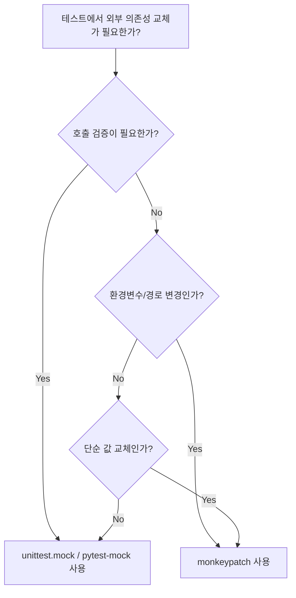

# 1. Mock이란?

## 1.1 Mock이 필요한 이유

단위 테스트를 작성하다 보면 외부 의존성을 가진 코드를 테스트해야 하는 상황이 자주 발생한다. 외부 API 호출, DB 접근, 파일 시스템 조작 등이 대표적이다. 이런 코드를 그대로 테스트하면 다음과 같은 문제가 생긴다.

- 네트워크나 인프라에 의존하여 **테스트가 불안정**해진다
- 외부 서비스 장애 시 **테스트도 실패**한다
- API 호출 비용이 발생하거나 **테스트 속도가 느려**진다
- DB 상태에 따라 **테스트 결과가 달라**진다

Mock은 이런 외부 의존성을 **가짜 객체로 교체**하여 테스트 대상 코드만 격리해서 검증할 수 있게 해준다.

## 1.2 Mock, Stub, Spy 용어 정리

| 용어 | 설명 | 특징 |
|------|------|------|
| **Mock** | 호출 여부와 인자를 **기록**하고 **검증**할 수 있는 가짜 객체 | 행위 검증(behavior verification) |
| **Stub** | 미리 정해진 값을 **반환**하는 가짜 객체 | 상태 검증(state verification) |
| **Spy** | 실제 메서드를 **실행**하면서 호출을 **기록**하는 객체 | 실제 동작 + 호출 기록 |

Python에서는 `unittest.mock.Mock`이 mock, stub, spy 역할을 모두 수행할 수 있다.

이 글에서는 아래 테스트 대상 코드를 기반으로 예제를 작성한다.

```python
# app/service.py
import requests

class UserService:
    def __init__(self, base_url: str = "https://jsonplaceholder.typicode.com"):
        self.base_url = base_url

    def get_user(self, user_id: int) -> dict:
        response = requests.get(f"{self.base_url}/users/{user_id}")
        response.raise_for_status()
        return response.json()

    def process_user(self, user_id: int) -> str:
        user = self.get_user(user_id)
        return f"{user['name']} ({user['email']})"
```

# 2. Mock 도구 비교

## 2.1 unittest.mock (표준 라이브러리)

Python 표준 라이브러리에 포함된 `unittest.mock`은 별도 설치 없이 사용 가능하다.

### Mock과 MagicMock

`Mock()`은 아무 속성이나 메서드에 접근해도 에러가 발생하지 않는 범용 가짜 객체다.

```python
from unittest.mock import Mock, MagicMock

# Mock: 아무 속성/메서드 접근 가능
mock = Mock()
mock.some_method(1, 2, 3)
mock.some_method.assert_called_once_with(1, 2, 3)

# return_value로 반환값 지정
mock.get_name.return_value = "Frank"
assert mock.get_name() == "Frank"
```

`MagicMock()`은 `Mock`의 서브클래스로, `__len__`, `__iter__` 같은 매직 메서드를 자동으로 지원한다.

```python
magic = MagicMock()
magic.__len__.return_value = 5
assert len(magic) == 5

magic.__iter__.return_value = iter([1, 2, 3])
assert list(magic) == [1, 2, 3]

# 컨텍스트 매니저로도 사용 가능
magic.__enter__.return_value = "resource"
with magic as resource:
    assert resource == "resource"
```

`spec` 파라미터로 실제 클래스 인터페이스를 제한할 수 있다. spec에 없는 속성에 접근하면 `AttributeError`가 발생한다.

```python
class Calculator:
    def add(self, a: int, b: int) -> int:
        return a + b

mock = Mock(spec=Calculator)
mock.add.return_value = 10
assert mock.add(3, 7) == 10

mock.multiply(3, 7)  # AttributeError 발생!
```

### @patch 데코레이터

`@patch`는 특정 모듈의 객체를 mock으로 교체한다. 테스트가 끝나면 원래 객체로 자동 복원된다.

```python
from unittest.mock import patch

@patch("app.service.requests.get")
def test_get_user(mock_get):
    mock_get.return_value.json.return_value = {"id": 1, "name": "Frank"}
    mock_get.return_value.raise_for_status.return_value = None

    service = UserService()
    user = service.get_user(1)

    assert user["name"] == "Frank"
    mock_get.assert_called_once_with(
        "https://jsonplaceholder.typicode.com/users/1"
    )
```

> **patch 경로 규칙**: `requests.get`이 아니라 `app.service.requests.get`을 패치해야 한다. patch 대상은 항상 **"사용하는 곳"의 import 경로** 기준이다.

컨텍스트 매니저 방식도 가능하다.

```python
def test_patch_context_manager():
    with patch("app.service.requests.get") as mock_get:
        mock_get.return_value.json.return_value = {"id": 1, "name": "Alice"}
        mock_get.return_value.raise_for_status.return_value = None

        service = UserService()
        user = service.get_user(1)
        assert user["name"] == "Alice"
```

### patch.object와 patch.dict

`patch.object`는 특정 객체의 메서드를 패치한다.

```python
def test_patch_object():
    service = UserService()
    with patch.object(service, "get_user",
                      return_value={"name": "Bob", "email": "bob@test.com"}):
        result = service.process_user(1)
        assert result == "Bob (bob@test.com)"
```

`patch.dict`는 딕셔너리를 패치한다. 환경변수 조작에 유용하다.

```python
import os

@patch.dict(os.environ, {"API_URL": "https://test.api.com"})
def test_patch_dict():
    assert os.environ["API_URL"] == "https://test.api.com"
```

## 2.2 pytest-mock (mocker fixture)

`pytest-mock`은 `unittest.mock`을 pytest fixture로 감싼 라이브러리다. 설치 후 `mocker` fixture로 사용한다.

```bash
uv add --dev pytest-mock
```

### mocker.patch

```python
def test_mocker_patch(mocker):
    mock_get = mocker.patch("app.service.requests.get")
    mock_get.return_value.json.return_value = {"id": 1, "name": "Frank"}
    mock_get.return_value.raise_for_status.return_value = None

    service = UserService()
    user = service.get_user(1)

    assert user["name"] == "Frank"
    mock_get.assert_called_once()
```

`unittest.mock`의 `@patch` 대비 장점:
- fixture scope에 따라 **자동 정리** (teardown에서 mock 해제)
- 데코레이터 중첩 없이 **여러 개를 깔끔하게** 패치 가능
- pytest의 fixture 시스템과 자연스럽게 통합

### mocker.spy

`spy`는 실제 메서드를 실행하면서 호출을 기록한다.

```python
def test_mocker_spy(mocker):
    service = UserService()
    spy = mocker.spy(service, "get_user_name")

    mocker.patch.object(service, "get_user",
                        return_value={"name": "Frank"})

    result = service.get_user_name(1)
    assert result == "Frank"
    spy.assert_called_once_with(1)
```

### mocker.stub

`stub`은 호출 기록만 남기는 빈 callable이다.

```python
def test_mocker_stub(mocker):
    callback = mocker.stub(name="on_complete")
    callback.return_value = "done"

    result = callback("task1")
    assert result == "done"
    callback.assert_called_once_with("task1")
```

## 2.3 monkeypatch (pytest 내장 fixture)

`monkeypatch`는 pytest에 내장된 fixture로, 별도 설치 없이 사용 가능하다. 속성/환경변수/경로 등을 간단히 교체한다.

### setattr - 속성/메서드 교체

```python
def test_setattr(monkeypatch):
    def fake_get_user(self, user_id):
        return {"id": user_id, "name": "Mocked User"}

    monkeypatch.setattr(UserService, "get_user", fake_get_user)

    service = UserService()
    user = service.get_user(42)
    assert user["name"] == "Mocked User"
```

### setenv / delenv - 환경변수 조작

```python
from app.config import get_api_url, get_debug_mode

def test_setenv(monkeypatch):
    monkeypatch.setenv("API_URL", "https://test.api.com")
    monkeypatch.setenv("DEBUG", "true")

    assert get_api_url() == "https://test.api.com"
    assert get_debug_mode() is True

def test_delenv(monkeypatch):
    monkeypatch.delenv("DATABASE_URL", raising=False)
```

### chdir, syspath_prepend

```python
def test_chdir(monkeypatch, tmp_path):
    monkeypatch.chdir(tmp_path)
    assert os.getcwd() == str(tmp_path)
    # 테스트 종료 후 원래 디렉토리로 자동 복원

def test_syspath(monkeypatch, tmp_path):
    monkeypatch.syspath_prepend(str(tmp_path))
    assert str(tmp_path) == sys.path[0]
```

## 2.4 mock vs monkeypatch 선택 기준

| 기능 | unittest.mock / pytest-mock | monkeypatch |
|------|-----|-------------|
| 호출 횟수 검증 | `assert_called_once()` | 불가 |
| 호출 인자 검증 | `assert_called_with()` | 불가 |
| 반환값 제어 | `return_value`, `side_effect` | 함수 교체로 간접 제어 |
| 환경변수 교체 | `patch.dict(os.environ)` | `setenv()` / `delenv()` |
| 속성 교체 | `patch.object()` | `setattr()` |
| 작업 디렉토리 변경 | 불가 | `chdir()` |
| sys.path 수정 | 불가 | `syspath_prepend()` |



# 3. 반환값 제어와 호출 검증

## 3.1 return_value와 side_effect

### return_value

`return_value`는 mock이 호출될 때 항상 같은 값을 반환하게 한다.

```python
from unittest.mock import Mock

mock = Mock()
mock.return_value = 42
assert mock() == 42
assert mock() == 42  # 항상 같은 값
```

### side_effect

`side_effect`는 더 다양한 동작을 제어한다.

**순차적 반환값** - 호출마다 다른 값을 순서대로 반환한다.

```python
mock = Mock()
mock.side_effect = [1, 2, 3]
assert mock() == 1
assert mock() == 2
assert mock() == 3
```

**커스텀 함수** - 호출 시 지정한 함수가 실행된다.

```python
mock = Mock()
mock.side_effect = lambda x: x * 2
assert mock(3) == 6
assert mock(5) == 10
```

**예외 발생** - 호출 시 예외를 발생시킨다.

```python
mock = Mock()
mock.side_effect = ValueError("잘못된 입력")

with pytest.raises(ValueError, match="잘못된 입력"):
    mock()
```

**예외와 정상값 혼합** - 재시도 로직 테스트에 유용하다.

```python
mock = Mock()
mock.side_effect = [
    ConnectionError("연결 실패"),   # 첫 번째 호출: 실패
    {"id": 1, "name": "Frank"},    # 두 번째 호출: 성공 (재시도)
]
```

> `side_effect`를 `None`으로 설정하면 다시 `return_value`가 사용된다.

## 3.2 assert_called 계열 검증

### 호출 여부 검증

```python
from unittest.mock import Mock

mock = Mock()
mock("hello")

mock.assert_called()           # 한 번이라도 호출됨
mock.assert_called_once()      # 정확히 1회 호출
mock.assert_called_with("hello")        # 마지막 호출 인자
mock.assert_called_once_with("hello")   # 1회 호출 + 인자
```

미호출 검증도 가능하다.

```python
mock = Mock()
mock.assert_not_called()  # 호출되지 않음을 검증
```

### 호출 이력 확인

```python
from unittest.mock import Mock, call

mock = Mock()
mock("first")
mock("second", x=1)
mock("third")

# 호출 횟수
assert mock.call_count == 3

# 마지막 호출 인자
assert mock.call_args.args == ("third",)

# 전체 호출 이력
assert mock.call_args_list == [
    call("first"),
    call("second", x=1),
    call("third"),
]

# 특정 인자로 한 번이라도 호출되었는지
mock.assert_any_call("second", x=1)
```

`reset_mock()`으로 호출 이력을 초기화할 수 있다.

```python
mock.reset_mock()
assert mock.call_count == 0
```

# 4. 실전 Mocking 패턴

## 4.1 외부 API 호출 mocking

### responses 라이브러리 (requests용)

`responses`는 `requests` 라이브러리의 HTTP 호출을 mock하는 전용 라이브러리다.

```bash
uv add --dev responses
```

```python
import responses
import requests

@responses.activate
def test_api_호출():
    responses.add(
        responses.GET,
        "https://jsonplaceholder.typicode.com/users/1",
        json={"id": 1, "name": "Frank Oh"},
        status=200,
    )

    service = UserService()
    user = service.get_user(1)

    assert user["name"] == "Frank Oh"
    assert len(responses.calls) == 1  # 호출 횟수 확인
```

에러 응답도 시뮬레이션할 수 있다.

```python
@responses.activate
def test_404_에러():
    responses.add(
        responses.GET,
        "https://jsonplaceholder.typicode.com/users/999",
        json={"error": "Not Found"},
        status=404,
    )

    service = UserService()
    with pytest.raises(requests.exceptions.HTTPError):
        service.get_user(999)
```

같은 URL에 여러 응답을 등록하면 순차적으로 반환된다. 재시도 로직 테스트에 유용하다.

```python
@responses.activate
def test_재시도_시나리오():
    # 첫 번째 호출: 500 에러
    responses.add(responses.GET, url, status=500)
    # 두 번째 호출: 200 성공
    responses.add(responses.GET, url, json={"name": "Frank"}, status=200)
```

### respx 라이브러리 (httpx용)

`respx`는 `httpx` 라이브러리용 HTTP mock이다.

```bash
uv add --dev respx
```

```python
import httpx
import respx

@respx.mock
def test_httpx_mock():
    respx.get("https://jsonplaceholder.typicode.com/users/1").mock(
        return_value=httpx.Response(
            200,
            json={"id": 1, "name": "Frank Oh"},
        )
    )

    service = UserService()
    user = service.get_user_httpx(1)
    assert user["name"] == "Frank Oh"
```

## 4.2 DB 의존성 mocking

Repository 패턴으로 DB 계층을 추상화하면 mock 주입이 쉬워진다.

```python
# app/repository.py
from dataclasses import dataclass

@dataclass
class User:
    id: int
    name: str
    email: str

class UserRepository:
    def find_by_id(self, user_id: int) -> User | None:
        raise NotImplementedError("DB 연결 필요")

    def find_all(self) -> list[User]:
        raise NotImplementedError("DB 연결 필요")

class UserServiceWithRepo:
    def __init__(self, repository: UserRepository):
        self.repository = repository

    def get_user_display_name(self, user_id: int) -> str:
        user = self.repository.find_by_id(user_id)
        if user is None:
            raise ValueError(f"User {user_id} not found")
        return f"{user.name} <{user.email}>"
```

서비스 테스트에서 Repository를 mock으로 교체한다.

```python
def test_repository_mock(mocker):
    mock_repo = mocker.Mock(spec=UserRepository)
    mock_repo.find_by_id.return_value = User(
        id=1, name="Frank Oh", email="frank@example.com"
    )

    service = UserServiceWithRepo(mock_repo)
    result = service.get_user_display_name(1)

    assert result == "Frank Oh <frank@example.com>"
    mock_repo.find_by_id.assert_called_once_with(1)
```

fixture로 mock repository를 제공하면 여러 테스트에서 재사용할 수 있다.

```python
@pytest.fixture
def mock_repo(mocker):
    repo = mocker.Mock(spec=UserRepository)
    repo.find_by_id.return_value = User(
        id=1, name="Test User", email="test@test.com"
    )
    return repo

@pytest.fixture
def service(mock_repo):
    return UserServiceWithRepo(mock_repo)

def test_display_name(service):
    result = service.get_user_display_name(1)
    assert result == "Test User <test@test.com>"
```

# 5. 마무리

이 글에서 다룬 내용을 정리하면 다음과 같다.

- `unittest.mock`의 `Mock`, `MagicMock`, `@patch`로 기본적인 mock 테스트를 작성할 수 있다
- `pytest-mock`의 `mocker` fixture는 `unittest.mock`을 더 깔끔하게 사용할 수 있게 해준다
- `monkeypatch`는 환경변수, 속성, 경로 등 단순 값 교체에 적합하다
- `return_value`와 `side_effect`로 mock의 동작을 세밀하게 제어할 수 있다
- `assert_called` 계열 메서드로 호출 여부와 인자를 검증할 수 있다
- `responses`/`respx`로 HTTP API 호출을 안전하게 mock할 수 있다
- Repository 패턴으로 DB 계층을 추상화하면 mock 주입이 용이하다

다음 시리즈에서는 pytest 플러그인 활용 (pytest-cov, pytest-xdist 등)에 대해 다룰 예정이다.

> 전체 소스는 [GitHub](https://github.com/kenshin579/tutorials-python/tree/master/python/pytest/mock)에서 확인할 수 있다.

## 참고

- https://docs.python.org/3/library/unittest.mock.html
- https://pytest-mock.readthedocs.io/
- https://github.com/getsentry/responses
- https://lundberg.github.io/respx/
