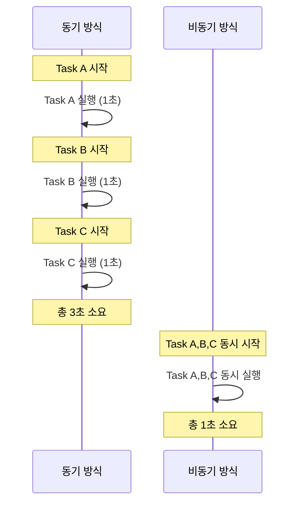
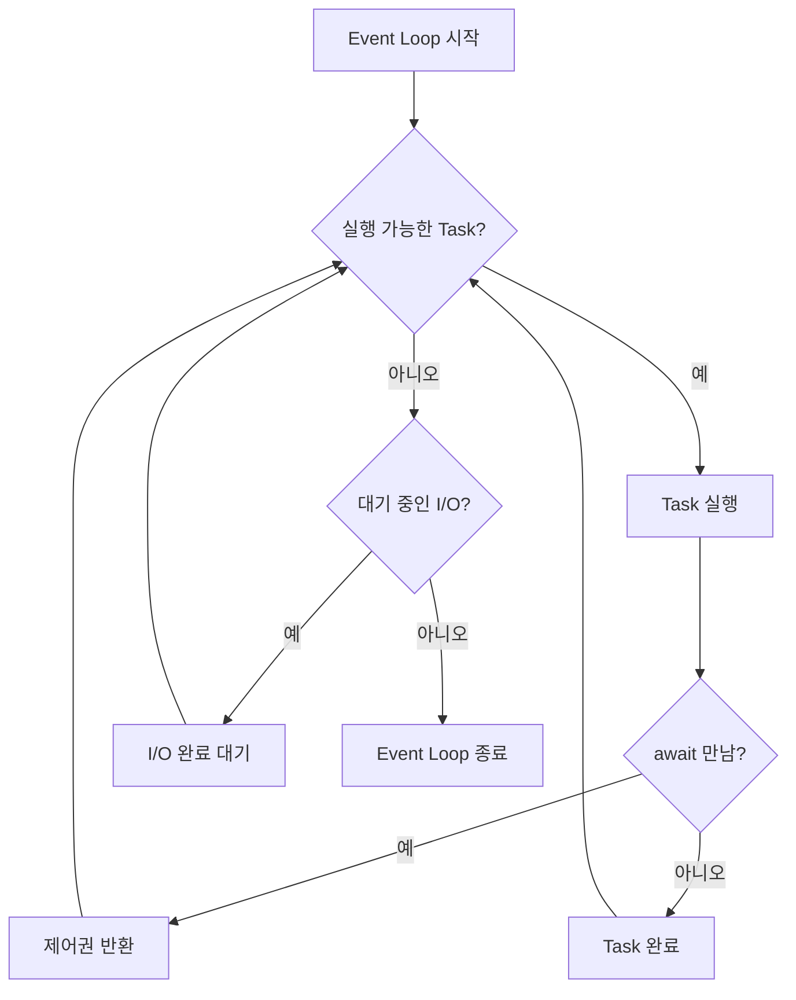

# 1. 개요

## 1.1 동기 vs 비동기 개념

동기(synchronous) 방식은 하나의 작업이 완료될 때까지 다음 작업이 대기한다. I/O 작업(네트워크 요청, 파일 읽기 등)에서 CPU가 결과를 기다리는 동안 아무 일도 하지 못하는 것이 문제다.

비동기(asynchronous) 방식은 I/O 대기 중에 다른 작업을 실행한다. CPU 유휴 시간을 활용하여 여러 작업을 효율적으로 처리할 수 있다.



코드로 비교하면 다음과 같다.

```python
import time
import asyncio

# 동기 - 순차 실행 (3초 소요)
def run_sync():
    for name in ["A", "B", "C"]:
        time.sleep(1)
        print(f"{name} done")

# 비동기 - 동시 실행 (1초 소요)
async def run_async():
    async def task(name):
        await asyncio.sleep(1)
        return f"{name} done"

    results = await asyncio.gather(task("A"), task("B"), task("C"))
    print(results)
```

# 2. asyncio 핵심 개념

## 2.1 Event Loop

Event Loop은 asyncio의 핵심이다. 코루틴을 스케줄링하고 I/O 이벤트를 감시하며, 준비된 작업을 실행하는 역할을 한다.



`asyncio.run()`은 event loop의 생성, 실행, 종료를 모두 처리하는 원스톱 함수이다.

```python
import asyncio

async def greet(name: str) -> str:
    await asyncio.sleep(0.1)
    return f"Hello, {name}!"

# asyncio.run()이 event loop 생성/실행/종료를 모두 처리
result = asyncio.run(greet("World"))
print(result)  # Hello, World!
```

실행 중인 event loop 정보를 얻으려면 `asyncio.get_running_loop()`을 사용한다.

```python
async def get_loop_info():
    loop = asyncio.get_running_loop()
    print(f"Loop: {type(loop).__name__}")
    print(f"Running: {loop.is_running()}")
```

> **참고**: `asyncio.get_event_loop()`은 deprecated 경향이 있으므로, 코루틴 내부에서는 `asyncio.get_running_loop()`을 사용하자.

## 2.2 Coroutine (`async def`, `await`)

`async def`로 정의한 함수를 **코루틴 함수**라 하고, 호출하면 **코루틴 객체**가 반환된다. 코루틴 객체는 `await`해야 실제로 실행된다.

```python
async def fetch_data(url: str) -> dict:
    await asyncio.sleep(0.1)  # I/O 시뮬레이션
    return {"url": url, "status": 200}

# 코루틴 함수 호출 → 코루틴 객체 반환 (아직 실행 안 됨)
coro = fetch_data("https://api.example.com")
print(type(coro))  # <class 'coroutine'>

# await로 실행
result = await coro  # 여기서 실제 실행됨
```

`await`의 의미는 두 가지다:
1. **결과 대기**: 코루틴이 완료될 때까지 기다린다
2. **제어권 반환**: 대기 중에 event loop가 다른 작업을 실행할 수 있도록 한다

`await` 가능한 객체(awaitable)는 세 가지다:
- **Coroutine**: `async def` 함수의 반환값
- **Task**: `asyncio.create_task()`의 반환값
- **Future**: 저수준 awaitable 객체

# 3. Task와 Future

## 3.1 Task 생성 및 관리

`asyncio.create_task()`는 코루틴을 동시 실행 가능한 Task로 래핑한다. Task를 생성하면 즉시 event loop에 등록되어 스케줄링된다.

```python
async def worker(name: str, delay: float) -> str:
    await asyncio.sleep(delay)
    return f"{name} completed"

async def main():
    # Task 생성 - 즉시 스케줄링됨
    task1 = asyncio.create_task(worker("A", 0.2), name="worker-A")
    task2 = asyncio.create_task(worker("B", 0.1), name="worker-B")

    # 모든 Task 완료 대기
    results = await asyncio.gather(task1, task2)
    print(results)  # ['A completed', 'B completed']
```

Task의 상태를 확인할 수 있다.

```python
task = asyncio.create_task(worker("check", 0.1))
print(task.done())      # False (아직 실행 중)
print(task.get_name())  # 'check' 또는 지정한 이름

result = await task
print(task.done())      # True
print(task.result())    # 'check completed'
```

Task를 취소할 수도 있다. `cancel()`을 호출하면 Task에 `CancelledError`가 발생한다.

```python
async def long_running():
    await asyncio.sleep(10)
    return "finished"

task = asyncio.create_task(long_running())
await asyncio.sleep(0.05)
task.cancel()

try:
    await task
except asyncio.CancelledError:
    print("task was cancelled")
```

## 3.2 Future 객체

Future는 미래에 완료될 결과의 placeholder이다. Task는 Future의 서브클래스로, 일반적으로 Future를 직접 사용할 일은 드물다.

```python
async def future_demo():
    loop = asyncio.get_running_loop()
    future = loop.create_future()

    async def set_result_later():
        await asyncio.sleep(0.1)
        future.set_result("future result")

    asyncio.create_task(set_result_later())
    result = await future  # future가 완료될 때까지 대기
    print(result)  # "future result"
```

```python
# Task는 Future의 서브클래스
task = asyncio.create_task(some_coroutine())
print(isinstance(task, asyncio.Future))  # True
```

# 4. 여러 코루틴 동시 실행

## 4.1 `asyncio.gather`

`gather`는 여러 코루틴을 동시에 실행하고, **인자 순서대로** 결과를 반환한다.

```python
async def delayed_result(name: str, delay: float) -> str:
    await asyncio.sleep(delay)
    return f"{name}({delay}s)"

results = await asyncio.gather(
    delayed_result("A", 0.3),
    delayed_result("B", 0.1),
    delayed_result("C", 0.2),
)
print(results)  # ['A(0.3s)', 'B(0.1s)', 'C(0.2s)'] - 순서 보장
```

`return_exceptions=True`를 사용하면 예외도 결과로 수집된다.

```python
async def failing():
    raise ValueError("failed")

results = await asyncio.gather(
    delayed_result("OK", 0.1),
    failing(),
    return_exceptions=True,
)
# ['OK(0.1s)', ValueError('failed')]
```

## 4.2 `asyncio.wait`

`wait`는 더 세밀한 완료 조건을 제어할 수 있다.

```python
tasks = [
    asyncio.create_task(delayed_result("slow", 0.3)),
    asyncio.create_task(delayed_result("fast", 0.1)),
]

# 가장 먼저 완료된 Task만 처리
done, pending = await asyncio.wait(tasks, return_when=asyncio.FIRST_COMPLETED)

first = done.pop()
print(first.result())  # 'fast(0.1s)'

# 남은 Task 정리
for task in pending:
    task.cancel()
```

`return_when` 옵션:
- `FIRST_COMPLETED`: 하나라도 완료되면 반환
- `FIRST_EXCEPTION`: 예외 발생 시 반환
- `ALL_COMPLETED`: 모두 완료될 때까지 대기 (기본값)

## 4.3 `asyncio.as_completed`

`as_completed`는 완료된 순서대로 결과를 처리할 수 있다.

```python
coros = [
    delayed_result("slow", 0.3),
    delayed_result("fast", 0.1),
    delayed_result("medium", 0.2),
]

for coro in asyncio.as_completed(coros):
    result = await coro
    print(result)
# fast(0.1s)   ← 가장 먼저 출력
# medium(0.2s)
# slow(0.3s)
```

| 함수 | 결과 순서 | 예외 처리 | 사용 시점 |
|---|---|---|---|
| `gather` | 인자 순서 보장 | `return_exceptions` 옵션 | 모든 결과가 필요할 때 |
| `wait` | set으로 반환 | `return_when` 옵션 | 세밀한 제어가 필요할 때 |
| `as_completed` | 완료 순서 | 개별 try/except | 빠른 것부터 처리할 때 |

# 5. 비동기 문법

## 5.1 비동기 반복 (`async for`)

`__aiter__`와 `__anext__` 메서드를 구현하면 `async for`로 순회할 수 있다.

```python
class AsyncCounter:
    def __init__(self, stop: int):
        self.stop = stop
        self.current = 0

    def __aiter__(self):
        return self

    async def __anext__(self) -> int:
        if self.current >= self.stop:
            raise StopAsyncIteration
        await asyncio.sleep(0.01)
        value = self.current
        self.current += 1
        return value

async for value in AsyncCounter(5):
    print(value)  # 0, 1, 2, 3, 4
```

## 5.2 비동기 컨텍스트 매니저 (`async with`)

`__aenter__`와 `__aexit__` 메서드를 구현하면 `async with`로 리소스를 관리할 수 있다.

```python
class AsyncResource:
    def __init__(self, name: str):
        self.name = name
        self.connected = False

    async def __aenter__(self):
        await asyncio.sleep(0.01)  # 연결 시뮬레이션
        self.connected = True
        return self

    async def __aexit__(self, exc_type, exc_val, exc_tb):
        await asyncio.sleep(0.01)  # 해제 시뮬레이션
        self.connected = False
        return False

async with AsyncResource("db") as r:
    print(r.connected)  # True
print(r.connected)      # False
```

## 5.3 비동기 제네레이터와 컴프리헨션

비동기 제네레이터는 `async def` + `yield`로 정의한다.

```python
async def async_range(start: int, stop: int):
    for i in range(start, stop):
        await asyncio.sleep(0.01)
        yield i

# async for로 소비
async for value in async_range(0, 5):
    print(value)

# 비동기 컴프리헨션
doubled = [x * 2 async for x in async_range(0, 5)]
print(doubled)  # [0, 2, 4, 6, 8]
```

# 6. 에러 핸들링

## 6.1 비동기 예외 전파

`await` 표현식에서 발생한 예외는 일반적인 `try/except`로 처리할 수 있다.

```python
async def risky_task(name: str, should_fail: bool = False) -> str:
    await asyncio.sleep(0.1)
    if should_fail:
        raise ValueError(f"{name} failed")
    return f"{name} success"

try:
    result = await risky_task("task1", should_fail=True)
except ValueError as e:
    print(f"caught: {e}")  # caught: task1 failed
```

`gather`에서 `return_exceptions=False`(기본값)인 경우, 첫 번째 예외가 발생하면 나머지 Task는 취소되지 않고 계속 실행된다. 이는 의도치 않은 동작을 유발할 수 있다.

## 6.2 `TaskGroup` (Python 3.11+)

`TaskGroup`은 `gather`의 개선된 버전으로, 예외 발생 시 그룹 내 모든 Task를 자동으로 취소한다.

```python
async with asyncio.TaskGroup() as tg:
    task1 = tg.create_task(risky_task("ok"))
    task2 = tg.create_task(risky_task("ok-2"))
    task3 = tg.create_task(risky_task("ok-3"))

# 모든 Task가 성공하면 여기로 진행
results = [task1.result(), task2.result(), task3.result()]
```

예외 발생 시 `ExceptionGroup`으로 묶여서 전파된다. `except*` 구문으로 처리한다.

```python
try:
    async with asyncio.TaskGroup() as tg:
        tg.create_task(risky_task("ok"))
        tg.create_task(risky_task("fail", should_fail=True))
except* ValueError as eg:
    for e in eg.exceptions:
        print(f"caught: {e}")
    # 예외 발생 시 그룹 내 다른 Task도 자동 취소됨
```

| 비교 | `gather` | `TaskGroup` |
|---|---|---|
| 예외 시 다른 Task | 계속 실행됨 | 자동 취소됨 |
| 예외 처리 | `return_exceptions` 옵션 | `except*` 구문 |
| 최소 Python 버전 | 3.4+ | 3.11+ |
| 권장 사용 시점 | 개별 예외 수집 필요 시 | 모든 Task가 성공해야 할 때 |

# 7. 실전 예제: 비동기 HTTP 요청

실전에서 asyncio는 주로 네트워크 I/O에 활용된다. `httpx` 라이브러리의 `AsyncClient`를 사용하면 비동기 HTTP 요청을 쉽게 보낼 수 있다.

## 7.1 기본 사용법

```python
import httpx

async def fetch(url: str) -> dict:
    async with httpx.AsyncClient() as client:
        response = await client.get(url)
        return {"url": url, "status": response.status_code}
```

## 7.2 여러 URL 동시 요청

```python
async def fetch_all(urls: list[str]) -> list[dict]:
    async with httpx.AsyncClient() as client:
        async def fetch_one(url):
            response = await client.get(url)
            return {"url": url, "status": response.status_code}

        return await asyncio.gather(*[fetch_one(url) for url in urls])
```

## 7.3 동기 vs 비동기 성능 비교

```python
import time
import requests  # 동기
import httpx     # 비동기

urls = ["https://httpbin.org/delay/1"] * 5

# 동기: 약 5초
start = time.time()
for url in urls:
    requests.get(url)
print(f"동기: {time.time() - start:.2f}초")

# 비동기: 약 1초
async def async_fetch():
    start = time.time()
    async with httpx.AsyncClient() as client:
        await asyncio.gather(*[client.get(url) for url in urls])
    print(f"비동기: {time.time() - start:.2f}초")

asyncio.run(async_fetch())
```

5개의 1초짜리 요청을 보낼 때, 동기 방식은 약 5초, 비동기 방식은 약 1초가 걸린다. I/O 바운드 작업에서 asyncio의 효과가 극대화된다.

# 8. 마치며

asyncio의 핵심 개념을 정리하면 다음과 같다.

| 개념 | 역할 |
|---|---|
| Event Loop | 코루틴 스케줄링, I/O 멀티플렉싱 |
| Coroutine | `async def`로 정의, `await`로 실행 |
| Task | 코루틴을 동시 실행 가능하게 래핑 |
| Future | 미래 결과의 placeholder (Task의 부모 클래스) |
| `gather` | 여러 코루틴 동시 실행, 순서 보장 |
| `TaskGroup` | 예외 시 자동 취소, Python 3.11+ |

**언제 asyncio를 사용하면 좋은가:**
- 네트워크 요청 (API 호출, 웹 크롤링)
- 데이터베이스 쿼리 (비동기 드라이버 사용 시)
- 파일 I/O (대량 파일 처리)
- 웹소켓, 실시간 통신

**asyncio가 적합하지 않은 경우:**
- CPU 바운드 작업 (이미지 처리, 암호화) → `multiprocessing` 사용
- 간단한 스크립트 → 동기 코드가 더 간단

이 글에서 작성한 전체 예제 코드는 [GitHub](https://github.com/kenshin579/tutorials-python/tree/main/python/asyncio/basics)에서 확인할 수 있다.

# 9. 참고

- [Python asyncio — Asynchronous I/O](https://docs.python.org/3/library/asyncio.html)
- [PEP 492 – Coroutines with async and await syntax](https://peps.python.org/pep-0492/)
- [Real Python - Async IO in Python](https://realpython.com/async-io-python/)
