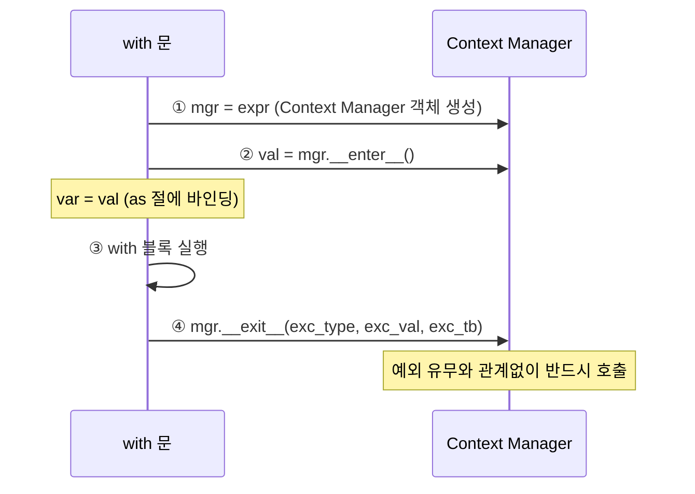

# 1. 개요

Python에서 파일, DB 연결, 락 같은 리소스를 사용할 때 가장 중요한 것은 **사용 후 반드시 정리하는 것**이다. `with` 문은 이 과정을 자동화한다.

```python
# with 문 사용 — 자동으로 close()
with open("data.txt") as f:
    data = f.read()
# 여기서 f는 이미 닫힘

# with 문 없이 — 수동 정리
f = open("data.txt")
try:
    data = f.read()
finally:
    f.close()
```

`with` 문이 가능한 이유는 **Context Manager 프로토콜** 덕분이다.

# 2. with 문의 동작 원리

## 2.1 `with expr as var:` 실행 흐름

`with` 문은 내부적으로 다음 단계를 거친다.



```python
class Tracer:
    def __enter__(self):
        print("1. __enter__() 호출")
        return "리소스 객체"  # as 절에 바인딩

    def __exit__(self, exc_type, exc_val, exc_tb):
        print(f"3. __exit__() 호출 (exc={exc_type})")
        return False  # False: 예외 전파

with Tracer() as resource:
    print(f"2. with 블록 (resource={resource})")
# 출력:
# 1. __enter__() 호출
# 2. with 블록 (resource=리소스 객체)
# 3. __exit__() 호출 (exc=None)
```

## 2.2 예외 발생 시 `__exit__` 호출 보장

`with` 블록에서 예외가 발생해도 `__exit__`는 반드시 호출된다. `try/finally`와 같은 효과다.

```python
try:
    with Tracer() as resource:
        raise ValueError("에러!")
except ValueError:
    print("4. 예외 처리")
# 출력:
# 1. __enter__() 호출
# 2. with 블록은 실행 안 됨 (바로 __exit__ 호출)
# 3. __exit__() 호출 (exc=<class 'ValueError'>)
# 4. 예외 처리
```

# 3. `__enter__` / `__exit__` 프로토콜

## 3.1 프로토콜 구조

| 메서드 | 역할 | 반환값 |
|--------|------|--------|
| `__enter__(self)` | 리소스 획득 | `as` 절에 바인딩될 값 |
| `__exit__(self, exc_type, exc_val, exc_tb)` | 리소스 해제 | `True`: 예외 억제, `False`: 예외 전파 |

## 3.2 `__exit__`의 예외 억제

`__exit__`에서 `True`를 반환하면 예외가 억제(suppressed)된다.

```python
class SuppressError:
    def __init__(self, *exceptions):
        self.exceptions = exceptions

    def __enter__(self):
        return self

    def __exit__(self, exc_type, exc_val, exc_tb):
        if exc_type and issubclass(exc_type, self.exceptions):
            print(f"예외 억제: {exc_val}")
            return True  # 예외 억제!
        return False

with SuppressError(ValueError):
    raise ValueError("무시됨")
print("프로그램 계속 실행")
```

## 3.3 클래스 기반 Context Manager 구현

DB 연결을 관리하는 Context Manager를 구현해보자.

```python
class DatabaseConnection:
    def __init__(self, host):
        self.host = host
        self.connected = False

    def __enter__(self):
        self.connected = True
        print(f"DB 연결: {self.host}")
        return self

    def __exit__(self, exc_type, exc_val, exc_tb):
        self.connected = False
        if exc_type:
            print(f"에러 → 롤백: {exc_val}")
        else:
            print("커밋 완료")
        print(f"DB 종료: {self.host}")
        return False

    def execute(self, query):
        return f"result: {query}"

with DatabaseConnection("localhost:5432") as db:
    db.execute("SELECT * FROM users")
```

# 4. `contextlib.contextmanager` 데코레이터

## 4.1 yield 기반 Context Manager

`@contextmanager`를 사용하면 클래스 없이 함수로 Context Manager를 만들 수 있다.

```python
from contextlib import contextmanager

@contextmanager
def managed_resource(name):
    print(f"리소스 획득: {name}")   # __enter__ 부분
    try:
        yield name                  # as 절에 바인딩
    finally:
        print(f"리소스 해제: {name}")  # __exit__ 부분

with managed_resource("DB") as name:
    print(f"작업: {name}")
```

`yield` 기준으로 **위쪽 = `__enter__`**, **아래쪽 = `__exit__`**에 대응한다.

## 4.2 try/finally 패턴

예외 발생 시에도 정리를 보장하려면 반드시 `try/finally`로 감싸야 한다.

```python
@contextmanager
def safe_resource():
    resource = acquire()
    try:
        yield resource
    except Exception as e:
        handle_error(e)
        raise  # 예외를 재발생 (억제하려면 raise 제거)
    finally:
        release(resource)  # 반드시 실행
```

### 클래스 기반 vs @contextmanager 비교

```python
# 클래스 기반: 8줄
class TimerClass:
    def __enter__(self):
        self.start = time.perf_counter()
        return self
    def __exit__(self, *args):
        print(f"{time.perf_counter() - self.start:.4f}초")
        return False

# @contextmanager: 5줄
@contextmanager
def timer(label=""):
    start = time.perf_counter()
    try:
        yield
    finally:
        print(f"{label}: {time.perf_counter() - start:.4f}초")
```

# 5. contextlib 유틸리티

## 5.1 `suppress()` — 예외 무시

특정 예외를 깔끔하게 무시한다.

```python
from contextlib import suppress

# suppress 사용
with suppress(FileNotFoundError):
    os.remove("nonexistent.txt")

# 동일한 코드 (suppress 없이)
try:
    os.remove("nonexistent.txt")
except FileNotFoundError:
    pass
```

## 5.2 `redirect_stdout` / `redirect_stderr`

stdout/stderr를 다른 곳으로 리다이렉트한다.

```python
import io
from contextlib import redirect_stdout

f = io.StringIO()
with redirect_stdout(f):
    print("이 출력은 캡처됨")

captured = f.getvalue()  # "이 출력은 캡처됨\n"
```

## 5.3 `closing()` — close() 자동 호출

Context Manager 프로토콜은 없지만 `close()` 메서드가 있는 객체를 `with`로 사용할 수 있게 한다.

```python
from contextlib import closing

with closing(urllib.request.urlopen("https://example.com")) as page:
    data = page.read()
# page.close() 자동 호출
```

## 5.4 `nullcontext()` — 조건부 적용

조건에 따라 Context Manager를 적용하거나 건너뛸 때 사용한다.

```python
from contextlib import nullcontext

cm = timer("작업") if verbose else nullcontext()
with cm:
    do_work()
```

# 6. 중첩 Context Manager (`ExitStack`)

## 6.1 동적 개수 관리

`ExitStack`은 동적 개수의 Context Manager를 관리한다.

```python
from contextlib import ExitStack

with ExitStack() as stack:
    files = [stack.enter_context(open(f)) for f in file_list]
    # 모든 파일이 자동으로 닫힘
```

## 6.2 `enter_context()`와 `callback()`

```python
with ExitStack() as stack:
    # Context Manager 등록
    db = stack.enter_context(DatabaseConnection("host"))

    # cleanup 콜백 등록
    stack.callback(print, "정리 완료")
    stack.callback(cleanup_func, arg1, arg2)
```

## 6.3 cleanup 순서 (LIFO)

등록된 순서의 **역순**(LIFO)으로 정리된다. 나중에 등록된 것이 먼저 해제된다.

```python
with ExitStack() as stack:
    stack.callback(print, "첫 번째 등록")
    stack.callback(print, "두 번째 등록")
    stack.callback(print, "세 번째 등록")
# 출력:
# 세 번째 등록
# 두 번째 등록
# 첫 번째 등록
```

# 7. 비동기 Context Manager

## 7.1 `async with`와 `__aenter__`/`__aexit__`

비동기 리소스를 관리할 때는 `async with`와 `__aenter__`/`__aexit__` 프로토콜을 사용한다.

```python
class AsyncDBConnection:
    async def __aenter__(self):
        await self.connect()
        return self

    async def __aexit__(self, exc_type, exc_val, exc_tb):
        await self.disconnect()
        return False

async with AsyncDBConnection("host") as db:
    result = await db.query("SELECT 1")
```

## 7.2 `asynccontextmanager` 데코레이터

```python
from contextlib import asynccontextmanager

@asynccontextmanager
async def async_http_session(base_url):
    session = await create_session(base_url)
    try:
        yield session
    finally:
        await session.close()

async with async_http_session("https://api.example.com") as session:
    data = await session.get("/users")
```

## 7.3 `AsyncExitStack`

비동기 버전의 `ExitStack`이다.

```python
from contextlib import AsyncExitStack

async with AsyncExitStack() as stack:
    db1 = await stack.enter_async_context(AsyncDBConnection("db1"))
    db2 = await stack.enter_async_context(AsyncDBConnection("db2"))
```

# 8. 실전 활용 패턴

## 8.1 DB 트랜잭션 관리

```python
@contextmanager
def transaction(db):
    snapshot = dict(db.data)
    try:
        yield db
        print("커밋")
    except Exception as e:
        db.data = snapshot  # 롤백
        print(f"롤백: {e}")
        raise

with transaction(db) as d:
    d.set("user", "Alice")
# 에러 발생 시 자동 롤백
```

## 8.2 여러 파일 동시 처리

```python
@contextmanager
def multi_open(*filenames, mode="r"):
    files = []
    try:
        for name in filenames:
            files.append(open(name, mode))
        yield files
    finally:
        for f in files:
            f.close()

with multi_open("a.txt", "b.txt", "c.txt") as files:
    for f in files:
        print(f.read())
```

## 8.3 락 관리 (`threading.Lock`)

```python
import threading

lock = threading.Lock()

# 기본 사용 (Lock 자체가 Context Manager)
with lock:
    shared_resource.update()

# 타임아웃 지원 래퍼
@contextmanager
def locked(lock, timeout=-1):
    acquired = lock.acquire(timeout=timeout)
    if not acquired:
        raise TimeoutError("락 획득 실패")
    try:
        yield
    finally:
        lock.release()
```

## 8.4 임시 리소스 관리

```python
# 환경변수 임시 변경
@contextmanager
def temp_env(**env_vars):
    old = {k: os.environ.get(k) for k in env_vars}
    os.environ.update(env_vars)
    try:
        yield
    finally:
        for k, v in old.items():
            if v is None:
                os.environ.pop(k, None)
            else:
                os.environ[k] = v

with temp_env(DEBUG="true", MODE="test"):
    assert os.environ["DEBUG"] == "true"

# 표준 라이브러리의 임시 리소스
import tempfile
with tempfile.TemporaryDirectory() as tmpdir:
    # tmpdir은 with 종료 시 자동 삭제
    pass
```

## 8.5 실행 시간 측정

```python
@contextmanager
def timer(label=""):
    start = time.perf_counter()
    try:
        yield
    finally:
        elapsed = time.perf_counter() - start
        print(f"{label}: {elapsed:.4f}초")

with timer("데이터 처리"):
    result = process_data()
```

# 9. 마무리

| 방식 | 적합한 상황 |
|------|-------------|
| 클래스 기반 (`__enter__`/`__exit__`) | 상태가 복잡한 리소스, 재사용 가능한 Context Manager |
| `@contextmanager` | 간단한 리소스 관리, 빠른 프로토타이핑 |
| `ExitStack` | 동적 개수의 리소스, 조건부 리소스 관리 |
| `async with` | 비동기 리소스 (DB 풀, HTTP 세션) |
| `suppress()` | 특정 예외를 깔끔하게 무시 |
| `nullcontext()` | 조건부 Context Manager 적용 |

> 전체 샘플 코드는 [GitHub - tutorials-python/python/context-manager](https://github.com/kenshin579/tutorials-python/tree/master/python/context-manager)에서 확인할 수 있다.

# 10. 참고

- [Python 공식 문서 - contextlib](https://docs.python.org/3/library/contextlib.html)
- [Python 공식 문서 - with 문](https://docs.python.org/3/reference/compound_stmts.html#the-with-statement)
- [PEP 343 - The "with" Statement](https://peps.python.org/pep-0343/)
- [Real Python - Python with Statement](https://realpython.com/python-with-statement/)
