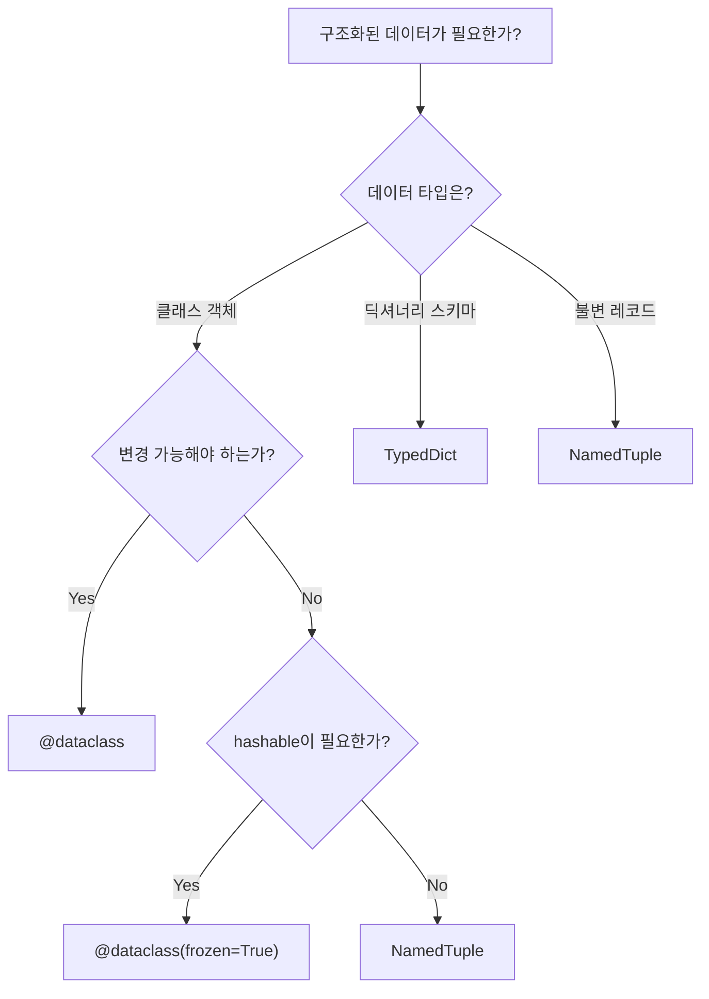

# 1. dataclass 기본 문법

## 1.1 @dataclass 기본 사용법

`@dataclass` 데코레이터를 사용하면 `__init__`, `__repr__`, `__eq__`를 자동으로 생성해준다. Python 3.7에서 도입되었으며, boilerplate 코드를 크게 줄여준다.

### dataclass 없이 작성한 클래스

```python
class PointManual:
    def __init__(self, x: float, y: float) -> None:
        self.x = x
        self.y = y

    def __repr__(self) -> str:
        return f"PointManual(x={self.x}, y={self.y})"

    def __eq__(self, other: object) -> bool:
        if not isinstance(other, PointManual):
            return NotImplemented
        return self.x == other.x and self.y == other.y
```

### dataclass로 동일한 클래스

```python
from dataclasses import dataclass

@dataclass
class Point:
    x: float
    y: float
```

두 줄로 동일한 기능을 얻는다. `@dataclass`가 자동 생성하는 메서드는 다음과 같다.

| 매개변수 | 기본값 | 설명 |
|---|---|---|
| `init` | `True` | `__init__` 생성 |
| `repr` | `True` | `__repr__` 생성 |
| `eq` | `True` | `__eq__`, `__ne__` 생성 |
| `order` | `False` | `__lt__`, `__le__`, `__gt__`, `__ge__` 생성 |
| `frozen` | `False` | 불변 인스턴스 |
| `slots` | `False` | `__slots__` 사용 (3.10+) |
| `kw_only` | `False` | 키워드 전용 인자 (3.10+) |

### 기본값과 order

```python
@dataclass
class Config:
    host: str = "localhost"
    port: int = 8080
    debug: bool = False

# order=True로 비교 연산자 자동 생성
@dataclass(order=True)
class Version:
    major: int
    minor: int
    patch: int

v1 = Version(1, 0, 0)
v2 = Version(2, 1, 0)
v3 = Version(1, 2, 0)
sorted([v2, v3, v1])  # [Version(1,0,0), Version(1,2,0), Version(2,1,0)]
```

## 1.2 field() 옵션

`field()` 함수를 사용하면 각 필드의 동작을 세밀하게 제어할 수 있다.

### default_factory — mutable 기본값

리스트, 딕셔너리 같은 mutable 타입은 `default_factory`를 사용해야 한다. 직접 `= []`로 지정하면 모든 인스턴스가 같은 객체를 공유하는 버그가 발생한다.

```python
from dataclasses import dataclass, field

@dataclass
class Student:
    name: str
    grades: list[int] = field(default_factory=list)
    metadata: dict[str, str] = field(default_factory=dict)

s1 = Student("Alice")
s2 = Student("Bob")
s1.grades.append(90)
print(s1.grades)  # [90]
print(s2.grades)  # [] — 독립적
```

### repr, compare 제외

```python
@dataclass
class User:
    username: str
    email: str
    password: str = field(repr=False)          # repr에서 숨김
    login_count: int = field(default=0, compare=False)  # 비교에서 제외

u1 = User("alice", "a@b.com", "secret", login_count=5)
u2 = User("alice", "a@b.com", "secret", login_count=10)
print(u1)           # User(username='alice', email='a@b.com', login_count=5)
print(u1 == u2)     # True — login_count는 비교 안 함
```

### init=False — 생성자에서 제외

```python
@dataclass
class Article:
    title: str
    content: str
    word_count: int = field(init=False)

    def __post_init__(self) -> None:
        self.word_count = len(self.content.split())
```

### kw_only (Python 3.10+)

```python
@dataclass(kw_only=True)
class Connection:
    host: str
    port: int = 5432
    database: str = "mydb"

# 반드시 키워드로 전달
conn = Connection(host="localhost", port=5432)

# 일부 필드만 kw_only
@dataclass
class Request:
    method: str
    url: str
    headers: dict[str, str] = field(default_factory=dict, kw_only=True)
    timeout: int = field(default=30, kw_only=True)
```

## 1.3 __post_init__ 활용

`__post_init__`은 `__init__` 완료 후 자동 호출되는 메서드다. 검증, 파생 필드 계산 등에 활용한다.

### 검증 로직

```python
@dataclass
class Temperature:
    celsius: float

    def __post_init__(self) -> None:
        if self.celsius < -273.15:
            raise ValueError(f"절대영도 미만: {self.celsius}°C")
```

### 파생 필드 — 다른 필드에서 계산

```python
@dataclass
class Rectangle:
    width: float
    height: float
    area: float = field(init=False)
    perimeter: float = field(init=False)

    def __post_init__(self) -> None:
        self.area = self.width * self.height
        self.perimeter = 2 * (self.width + self.height)

rect = Rectangle(10.0, 5.0)
print(rect.area)       # 50.0
print(rect.perimeter)  # 30.0
```

### InitVar — init 전용 매개변수

`InitVar[T]`는 `__init__` 매개변수로는 받지만 인스턴스 필드로는 저장하지 않는다. `__post_init__`의 인자로 전달된다.

```python
from dataclasses import InitVar

@dataclass
class User:
    name: str
    email: str
    email_domain: str = field(init=False)
    greeting: str = field(init=False)
    uppercase: InitVar[bool] = False

    def __post_init__(self, uppercase: bool) -> None:
        self.email_domain = self.email.split("@")[1]
        self.greeting = f"Hello, {self.name.upper() if uppercase else self.name}!"

u = User("Alice", "alice@example.com", uppercase=True)
print(u.greeting)       # Hello, ALICE!
print(u.email_domain)   # example.com
# uppercase는 필드가 아님 → u.uppercase 접근 불가
```

# 2. dataclass 고급 기능

## 2.1 frozen=True (불변 데이터클래스)

`frozen=True`를 설정하면 인스턴스 생성 후 속성 변경이 불가능하다.

```python
from dataclasses import dataclass, replace, FrozenInstanceError

@dataclass(frozen=True)
class Point:
    x: float
    y: float

p = Point(1.0, 2.0)
p.x = 10.0  # FrozenInstanceError 발생!
```

### __hash__ 자동 생성

`frozen=True`이면 `__hash__`가 자동 생성되므로 dict 키나 set 요소로 사용할 수 있다.

```python
@dataclass(frozen=True)
class Color:
    r: int
    g: int
    b: int

red = Color(255, 0, 0)
green = Color(0, 255, 0)

color_names = {red: "Red", green: "Green"}
print(color_names[red])  # "Red"

unique = {red, green, Color(255, 0, 0)}
print(len(unique))  # 2 — 중복 제거
```

### replace() — 불변 객체 복사 + 수정

불변 객체의 일부 값만 바꾼 새 인스턴스를 만들 때 `dataclasses.replace()`를 사용한다.

```python
@dataclass(frozen=True)
class Config:
    host: str = "localhost"
    port: int = 8080
    debug: bool = False

default = Config()
dev = replace(default, debug=True)
prod = replace(default, host="0.0.0.0", port=443)
```

## 2.2 상속과 데이터클래스

### 필드 순서 규칙

부모 dataclass를 상속하면 부모 필드 → 자식 필드 순서로 합쳐진다.

```python
@dataclass
class Animal:
    name: str
    sound: str = "..."

@dataclass
class Dog(Animal):
    breed: str = "Unknown"

    def speak(self) -> str:
        return f"{self.name} says {self.sound}"

# __init__(self, name: str, sound: str = "...", breed: str = "Unknown")
dog = Dog(name="Buddy", sound="Woof!", breed="Golden")
```

### 기본값 문제와 해결법

부모에 기본값 있는 필드가 있으면, 자식에 기본값 없는 필드를 추가할 수 없다 (기본값 없는 필드가 기본값 있는 필드 뒤에 올 수 없으므로).

```python
@dataclass
class Base:
    name: str
    value: int = 0

# TypeError! required_field에 기본값이 없는데 value(기본값 있음) 뒤에 위치
# @dataclass
# class Child(Base):
#     required_field: str

# 해결: kw_only 사용
@dataclass(kw_only=True)
class Child(Base):
    required_field: str

child = Child(name="test", value=1, required_field="필수값")
```

### slots=True (Python 3.10+)

`slots=True`를 설정하면 `__dict__` 대신 `__slots__`를 사용하여 메모리를 크게 절약하고 속성 접근 속도도 향상된다.

```python
@dataclass
class RegularPoint:
    x: float
    y: float
    z: float

@dataclass(slots=True)
class SlottedPoint:
    x: float
    y: float
    z: float
```

| 구분 | RegularPoint | SlottedPoint |
|---|---|---|
| 크기 | 344 bytes (인스턴스 + `__dict__`) | 56 bytes |
| 절감 | - | 84% |
| `__dict__` | 있음 | 없음 |

# 3. dataclass vs NamedTuple vs TypedDict 비교

Python에서 구조화된 데이터를 표현하는 세 가지 방법을 비교한다.

```python
from dataclasses import dataclass
from typing import NamedTuple, TypedDict

@dataclass
class UserDC:
    name: str
    age: int
    email: str

class UserNT(NamedTuple):
    name: str
    age: int
    email: str

class UserTD(TypedDict):
    name: str
    age: int
    email: str
```

## 기능 비교

| 특성 | dataclass | NamedTuple | TypedDict |
|---|---|---|---|
| 변경 가능 | O (기본) | X (불변) | O (dict 기반) |
| 상속 | O | O (제한적) | O |
| 메서드 추가 | O | O | X |
| 인덱싱 | X | O (`nt[0]`) | O (`td["key"]`) |
| 언패킹 | X | O | X |
| `__hash__` | frozen일 때 | 기본 제공 | X |
| `slots` | 3.10+ | N/A | N/A |
| 기본값 | O | O | O (total=False) |

## 벤치마크

실제 측정 결과 (Python 3.13, 100,000회 생성 기준):

| 구분 | 메모리 (bytes) | 생성 속도 (s) |
|---|---|---|
| dataclass | 336 | 0.0065 |
| dataclass(slots) | 56 | 0.0053 |
| NamedTuple | 64 | 0.0083 |
| TypedDict (dict) | 184 | 0.0029 |

## 선택 가이드



- **dataclass**: 일반적인 데이터 객체, 메서드가 필요한 경우
- **NamedTuple**: 불변 레코드, 튜플 호환이 필요한 경우
- **TypedDict**: 외부 API/JSON 응답의 딕셔너리 스키마 정의

# 4. attrs / cattrs 생태계

## 4.1 attrs 라이브러리

[attrs](https://www.attrs.org/)는 dataclass의 영감이 된 라이브러리로, 더 많은 기능을 제공한다. `@define`(mutable)과 `@frozen`(immutable) API를 사용한다.

### 기본 사용법

```python
from attrs import define, frozen, field

@define
class Point:
    x: float
    y: float

@frozen
class Color:
    r: int
    g: int
    b: int
```

### validator — 필드 값 검증

attrs는 내장 validator를 제공하며, 커스텀 validator도 쉽게 작성할 수 있다.

```python
from attrs import define, field, validators

@define
class User:
    name: str = field(validator=validators.instance_of(str))
    age: int = field(validator=[
        validators.instance_of(int),
        validators.ge(0),
        validators.le(150),
    ])
    email: str = field(validator=validators.matches_re(r".+@.+\..+"))

# 커스텀 validator
def validate_port(instance, attribute, value):
    if not 1 <= value <= 65535:
        raise ValueError(f"포트 번호는 1~65535 사이여야 합니다: {value}")

@define
class ServerConfig:
    host: str = "localhost"
    port: int = field(default=8080, validator=validate_port)
```

### converter — 자동 타입 변환

```python
@define
class Record:
    id: int = field(converter=int)
    name: str = field(converter=str)

record = Record(id="42", name=123)
print(record.id)    # 42 (int)
print(record.name)  # "123" (str)
```

### dataclass vs attrs 기능 비교

| 기능 | dataclass | attrs |
|---|---|---|
| 기본 메서드 생성 | O | O |
| `slots` | 3.10+ (옵션) | 기본 활성화 |
| validator | 수동 (`__post_init__`) | 내장 + 커스텀 |
| converter | X | O |
| `frozen` | O | O |
| `factory` | `field(default_factory=...)` | `field(factory=...)` |
| 외부 의존성 | 없음 (표준 라이브러리) | 필요 (`pip install attrs`) |
| 호환성 | Python 3.7+ | Python 3.7+ |

## 4.2 cattrs (직렬화/역직렬화)

[cattrs](https://cattrs.readthedocs.io/)는 attrs/dataclass 객체를 dict/JSON으로 변환하는 라이브러리다.

### structure / unstructure

```python
import cattrs
from attrs import define

@define
class User:
    name: str
    age: int
    email: str

# unstructure: 객체 → dict
user = User(name="Alice", age=30, email="alice@example.com")
user_dict = cattrs.unstructure(user)
# {"name": "Alice", "age": 30, "email": "alice@example.com"}

# structure: dict → 객체
data = {"name": "Bob", "age": 25, "email": "bob@test.com"}
user2 = cattrs.structure(data, User)
# User(name='Bob', age=25, email='bob@test.com')
```

### 중첩 구조 및 리스트

cattrs는 중첩된 구조와 리스트도 자동으로 처리한다.

```python
from attrs import frozen

@frozen
class Address:
    city: str
    country: str

@frozen
class Employee:
    name: str
    role: str
    address: Address

@frozen
class Team:
    name: str
    members: list[Employee]

team = Team(
    name="Backend",
    members=[
        Employee("Alice", "Lead", Address("Seoul", "Korea")),
        Employee("Bob", "Developer", Address("Tokyo", "Japan")),
    ],
)

# 객체 → dict (중첩 자동 변환)
team_dict = cattrs.unstructure(team)

# dict → 객체 (중첩 자동 복원)
restored = cattrs.structure(team_dict, Team)
```

### JSON API 응답 변환 실전 예시

```python
import json
import cattrs

@frozen
class APIResponse:
    status: int
    data: list[User]
    total: int

json_response = '{"status": 200, "data": [{"name": "Alice", "age": 30, "email": "a@b.com"}], "total": 1}'

# JSON → dict → 타입 안전한 객체
raw = json.loads(json_response)
response = cattrs.structure(raw, APIResponse)

print(response.status)         # 200
print(response.data[0].name)   # "Alice"

# 객체 → JSON (역방향)
back = json.dumps(cattrs.unstructure(response))
```

# 5. 마무리

| 개념 | 핵심 |
|---|---|
| `@dataclass` | `__init__`, `__repr__`, `__eq__` 자동 생성 |
| `field()` | `default_factory`, `repr`, `compare`, `init`, `kw_only` 세밀 제어 |
| `__post_init__` | 검증, 파생 필드 계산, `InitVar` |
| `frozen=True` | 불변 인스턴스, `__hash__` 자동, `replace()` |
| `slots=True` | 메모리 84% 절약 (3.10+) |
| `NamedTuple` | 불변 튜플 + 이름 접근, 인덱싱/언패킹 |
| `TypedDict` | 딕셔너리 스키마, 외부 API 타입 정의 |
| `attrs` | validator, converter, slots 기본 활성화 |
| `cattrs` | structure/unstructure로 직렬화/역직렬화 |

> 전체 샘플 코드는 [GitHub - tutorials-python/python/dataclasses](https://github.com/kenshin579/tutorials-python/tree/master/python/dataclasses)에서 확인할 수 있다.

# 6. 참고

- [Python 공식 문서 - dataclasses](https://docs.python.org/3/library/dataclasses.html)
- [PEP 557 - Data Classes](https://peps.python.org/pep-0557/)
- [attrs 공식 문서](https://www.attrs.org/)
- [cattrs 공식 문서](https://cattrs.readthedocs.io/)
- [Real Python - Data Classes in Python](https://realpython.com/python-data-classes/)
