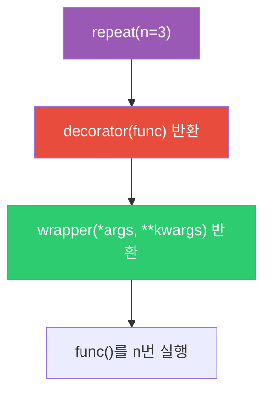
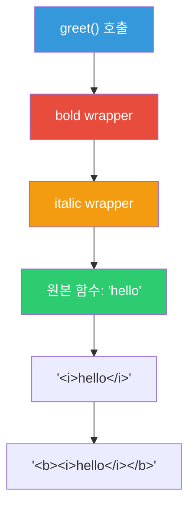

> 전체 소스 코드는 [tutorials-python/python/decorator](https://github.com/kenshin579/tutorials-python/tree/master/python/decorator)를 참조한다.

# 1. 데코레이터 기초

## 1.1 데코레이터란?

데코레이터는 **기존 함수를 수정하지 않고 기능을 추가**하는 패턴이다. 이를 이해하려면 Python의 두 가지 핵심 개념을 먼저 알아야 한다.

### 일급 함수 (First-Class Function)

Python에서 함수는 **일급 객체(first-class object)**다. 변수에 할당하고, 다른 함수의 인자로 전달하며, 함수의 반환값으로 사용할 수 있다.

```python
def greet(name: str) -> str:
    return f"Hello, {name}!"

def call_func(func, arg):
    return func(arg)

result = call_func(greet, "World")  # "Hello, World!"
```

### 클로저 (Closure)

클로저는 **외부 함수의 변수를 기억하는 내부 함수**다. 외부 함수가 실행을 마친 후에도 내부 함수가 외부 변수에 접근할 수 있다.

```python
def outer(message: str):
    def inner(name: str) -> str:
        return f"{message}, {name}!"  # message를 캡처
    return inner

hello = outer("Hello")
hello("Python")  # "Hello, Python!"
```

`outer`는 이미 실행이 끝났지만, `inner`는 `message` 변수를 여전히 참조한다. 이것이 클로저다.

### `@` 문법의 정체

`@decorator` 문법은 사실 **문법적 설탕(syntactic sugar)**이다.

```python
@decorator
def func():
    pass

# 위 코드는 아래와 동일하다
def func():
    pass
func = decorator(func)
```


## 1.2 함수 데코레이터 기본

데코레이터의 기본 구조는 **함수를 받아서 wrapper 함수를 반환**하는 것이다.

```python
def simple_decorator(func):
    def wrapper(*args, **kwargs):
        print(f"Before: {func.__name__}")
        result = func(*args, **kwargs)
        print(f"After: {func.__name__}")
        return result
    return wrapper

@simple_decorator
def say_hello(name):
    return f"Hello, {name}!"

say_hello("World")
# Before: say_hello
# After: say_hello
```

핵심 포인트:

- `*args, **kwargs`로 원본 함수의 모든 인자를 그대로 전달한다
- `result = func(*args, **kwargs)`로 원본 함수를 호출하고 반환값을 저장한다
- **반환값을 `return`하지 않으면** 원본 함수의 결과가 사라지므로 주의한다

## 1.3 `functools.wraps`의 역할

위의 `simple_decorator`에는 중요한 문제가 있다. 데코레이터를 적용하면 **원본 함수의 메타데이터가 손실**된다.

```python
@simple_decorator
def my_func():
    """My docstring"""
    pass

print(my_func.__name__)  # "wrapper" (원본은 "my_func")
print(my_func.__doc__)   # None (원본은 "My docstring")
```

`functools.wraps`는 이 문제를 해결한다.

```python
import functools

def proper_decorator(func):
    @functools.wraps(func)
    def wrapper(*args, **kwargs):
        print(f"Before: {func.__name__}")
        result = func(*args, **kwargs)
        print(f"After: {func.__name__}")
        return result
    return wrapper
```

| 항목 | `@wraps` 없음 | `@wraps` 있음 |
|------|--------------|--------------|
| `__name__` | `"wrapper"` | 원본 함수명 |
| `__doc__` | `None` | 원본 docstring |
| `__module__` | 데코레이터 모듈 | 원본 모듈 |
| `__wrapped__` | 없음 | 원본 함수 참조 |

`__wrapped__` 속성으로 원본 함수에 직접 접근할 수도 있다.

```python
@proper_decorator
def original():
    return 42

original.__wrapped__()  # 42 (데코레이터를 우회하여 원본 호출)
```

> 데코레이터를 작성할 때는 **반드시 `@functools.wraps(func)`를 적용**하는 것이 모범 사례다.

---

# 2. 데코레이터 심화

## 2.1 인자를 받는 데코레이터 (데코레이터 팩토리)

`@repeat(n=3)`처럼 인자를 받으려면 **한 단계 더 중첩**해야 한다. 이것이 3중 중첩 함수 구조다.

```python
def repeat(n: int = 2):
    def decorator(func):            # 실제 데코레이터
        @functools.wraps(func)
        def wrapper(*args, **kwargs):  # 실제 wrapper
            result = None
            for _ in range(n):
                result = func(*args, **kwargs)
            return result
        return wrapper
    return decorator

@repeat(n=3)
def greet():
    print("Hello!")

greet()  # "Hello!" 3번 출력
```



### 인자 선택적 데코레이터

`@decorator`와 `@decorator()` 모두 지원하려면 첫 번째 인자가 함수인지 확인한다.

```python
def flexible_decorator(func=None, *, n: int = 2):
    def decorator(f):
        @functools.wraps(f)
        def wrapper(*args, **kwargs):
            result = None
            for _ in range(n):
                result = f(*args, **kwargs)
            return result
        return wrapper

    if func is not None:  # @flexible_decorator (인자 없이 사용)
        return decorator(func)
    return decorator       # @flexible_decorator(n=4) (인자와 함께 사용)

@flexible_decorator        # 인자 없이
def func_a(): ...

@flexible_decorator(n=4)   # 인자와 함께
def func_b(): ...
```

## 2.2 클래스 데코레이터

### `__call__`을 활용한 상태 유지 데코레이터

클래스로 데코레이터를 만들면 **상태를 유지**할 수 있다.

```python
class CountCalls:
    def __init__(self, func):
        functools.update_wrapper(self, func)
        self.func = func
        self.count = 0

    def __call__(self, *args, **kwargs):
        self.count += 1
        return self.func(*args, **kwargs)

@CountCalls
def say_hello():
    return "hello"

say_hello()
say_hello()
print(say_hello.count)  # 2
```

### 클래스를 대상으로 하는 데코레이터

함수뿐 아니라 **클래스 자체**에도 데코레이터를 적용할 수 있다.

```python
def add_method(cls):
    cls.greet = lambda self: f"Hello from {cls.__name__}"
    return cls

@add_method
class MyClass:
    pass

obj = MyClass()
obj.greet()  # "Hello from MyClass"
```

`__init_subclass__`와의 차이점:

| 항목 | 클래스 데코레이터 | `__init_subclass__` |
|------|-----------------|-------------------|
| 적용 대상 | 데코레이터가 붙은 클래스 자체 | 서브클래스가 생성될 때 |
| 적용 시점 | 클래스 정의 완료 후 | 서브클래스 정의 시 |
| 상속 전파 | 자동 전파 안 됨 | 자동 전파됨 |

## 2.3 데코레이터 체이닝

여러 데코레이터를 동시에 적용할 수 있다. 실행 순서를 이해하는 것이 핵심이다.

```python
def bold(func):
    @functools.wraps(func)
    def wrapper(*args, **kwargs):
        return f"<b>{func(*args, **kwargs)}</b>"
    return wrapper

def italic(func):
    @functools.wraps(func)
    def wrapper(*args, **kwargs):
        return f"<i>{func(*args, **kwargs)}</i>"
    return wrapper

@bold
@italic
def greet():
    return "hello"

greet()  # "<b><i>hello</i></b>"
```

**적용 순서**: 아래에서 위로 (`italic` → `bold`)
**실행 순서**: 위에서 아래로 (`bold`의 wrapper → `italic`의 wrapper → 원본 함수)



위 코드는 다음과 동일하다.

```python
greet = bold(italic(greet))
```

---

# 3. 실전 활용 패턴

## 3.1 로깅 데코레이터

함수 호출과 반환을 자동으로 기록한다.

```python
import logging

logger = logging.getLogger(__name__)

def log_calls(func):
    @functools.wraps(func)
    def wrapper(*args, **kwargs):
        logger.info("Calling %s(args=%s, kwargs=%s)", func.__name__, args, kwargs)
        result = func(*args, **kwargs)
        logger.info("%s returned %s", func.__name__, result)
        return result
    return wrapper

@log_calls
def add(a, b):
    return a + b

add(1, 2)
# INFO: Calling add(args=(1, 2), kwargs={})
# INFO: add returned 3
```

## 3.2 캐싱 데코레이터

### `@lru_cache` (표준 라이브러리)

가장 간단한 캐싱 방법이다. LRU(Least Recently Used) 전략으로 결과를 캐시한다.

```python
from functools import lru_cache

@lru_cache(maxsize=128)
def expensive(n):
    print(f"Computing {n}...")
    return n * 2

expensive(5)  # "Computing 5..." → 10
expensive(5)  # 캐시 히트 → 10 (출력 없음)
```

### TTL 기반 커스텀 캐시

`@lru_cache`는 만료 시간이 없다. 시간 기반 캐시가 필요하면 직접 구현한다.

```python
def ttl_cache(seconds: int = 60):
    def decorator(func):
        cache: dict = {}

        @functools.wraps(func)
        def wrapper(*args):
            now = time.time()
            if args in cache:
                result, timestamp = cache[args]
                if now - timestamp < seconds:
                    return result
            result = func(*args)
            cache[args] = (result, now)
            return result
        return wrapper
    return decorator

@ttl_cache(seconds=30)
def get_price(symbol):
    return fetch_from_api(symbol)
```

## 3.3 retry 데코레이터

네트워크 호출 등 일시적 오류가 발생할 수 있는 작업에 유용하다. **지수 백오프(exponential backoff)**로 재시도 간격을 점진적으로 늘린다.

```python
def retry(max_retries: int = 3, delay: float = 1.0, backoff: float = 2.0):
    def decorator(func):
        @functools.wraps(func)
        def wrapper(*args, **kwargs):
            current_delay = delay
            for attempt in range(max_retries):
                try:
                    return func(*args, **kwargs)
                except Exception:
                    if attempt == max_retries - 1:
                        raise
                    time.sleep(current_delay)
                    current_delay *= backoff
        return wrapper
    return decorator

@retry(max_retries=3, delay=1.0, backoff=2.0)
def call_api():
    response = requests.get("https://api.example.com/data")
    response.raise_for_status()
    return response.json()
```

재시도 간격: 1초 → 2초 → 4초 (지수 백오프)

## 3.4 실행 시간 측정

`time.perf_counter()`는 고해상도 타이머로, 벤치마크에 적합하다.

```python
def timer(func):
    @functools.wraps(func)
    def wrapper(*args, **kwargs):
        start = time.perf_counter()
        result = func(*args, **kwargs)
        elapsed = time.perf_counter() - start
        print(f"{func.__name__} took {elapsed:.4f}s")
        return result
    return wrapper

@timer
def process_data(data):
    # 데이터 처리 로직
    return sorted(data)

process_data(range(1000000))
# process_data took 0.0823s
```

## 3.5 입력값 검증 데코레이터

함수 인자의 타입을 런타임에 검증한다.

```python
def validate_types(**type_hints):
    def decorator(func):
        import inspect
        sig = inspect.signature(func)
        param_names = list(sig.parameters.keys())

        @functools.wraps(func)
        def wrapper(*args, **kwargs):
            for i, value in enumerate(args):
                if i < len(param_names):
                    name = param_names[i]
                    if name in type_hints and not isinstance(value, type_hints[name]):
                        raise TypeError(
                            f"{name} must be {type_hints[name].__name__}, "
                            f"got {type(value).__name__}"
                        )
            for name, value in kwargs.items():
                if name in type_hints and not isinstance(value, type_hints[name]):
                    raise TypeError(
                        f"{name} must be {type_hints[name].__name__}, "
                        f"got {type(value).__name__}"
                    )
            return func(*args, **kwargs)
        return wrapper
    return decorator

@validate_types(name=str, age=int)
def greet(name, age):
    return f"{name} is {age}"

greet("Alice", 30)   # OK
greet(123, 30)        # TypeError: name must be str, got int
```

---

# 4. 표준 라이브러리 데코레이터 정리

## 4.1 프로퍼티 관련

`@property`는 메서드를 속성처럼 접근할 수 있게 한다. `@setter`, `@deleter`와 체인으로 사용한다.

```python
class Circle:
    def __init__(self, radius):
        self._radius = radius

    @property
    def radius(self):
        return self._radius

    @radius.setter
    def radius(self, value):
        if value < 0:
            raise ValueError("반지름은 음수일 수 없다")
        self._radius = value

    @radius.deleter
    def radius(self):
        del self._radius

c = Circle(5)
print(c.radius)    # 5 (getter)
c.radius = 10      # setter
del c.radius        # deleter
```

## 4.2 메서드 관련

```python
class MyClass:
    class_var = "shared"

    @staticmethod
    def static_method():
        """인스턴스/클래스 접근 불필요한 유틸리티 메서드"""
        return "static"

    @classmethod
    def class_method(cls):
        """클래스 자체를 첫 인자로 받는 메서드"""
        return f"class: {cls.class_var}"
```

| 항목 | `@staticmethod` | `@classmethod` |
|------|----------------|----------------|
| 첫 번째 인자 | 없음 | `cls` (클래스) |
| 인스턴스 접근 | 불가 | 불가 |
| 클래스 변수 접근 | 직접 참조만 가능 | `cls`로 접근 |
| 주요 용도 | 유틸리티 함수 | 팩토리 메서드, 대안 생성자 |

## 4.3 클래스/함수 유틸리티

| 데코레이터 | 모듈 | 용도 |
|-----------|------|------|
| `@dataclass` | `dataclasses` | `__init__`, `__repr__`, `__eq__` 등 자동 생성 |
| `@total_ordering` | `functools` | `__eq__`와 비교 메서드 하나만 정의하면 나머지 자동 완성 |
| `@singledispatch` | `functools` | 첫 번째 인자 타입에 따른 함수 오버로딩 |
| `@lru_cache` | `functools` | LRU 캐시 기반 메모이제이션 |
| `@cache` | `functools` | 크기 제한 없는 캐시 (`@lru_cache(maxsize=None)` 동일) |

### `@singledispatch` 예시

```python
from functools import singledispatch

@singledispatch
def process(data):
    raise TypeError(f"지원하지 않는 타입: {type(data)}")

@process.register(str)
def _(data):
    return data.upper()

@process.register(list)
def _(data):
    return [x * 2 for x in data]

process("hello")    # "HELLO"
process([1, 2, 3])  # [2, 4, 6]
```

---

# 5. 참고

- [Real Python - Primer on Python Decorators](https://realpython.com/primer-on-python-decorators/)
- [Python 공식 문서 - Decorator](https://docs.python.org/3/glossary.html#term-decorator)
- [Python 공식 문서 - functools](https://docs.python.org/3/library/functools.html)
- [PEP 318 - Decorators for Functions and Methods](https://peps.python.org/pep-0318/)
- [PEP 3129 - Class Decorators](https://peps.python.org/pep-3129/)
