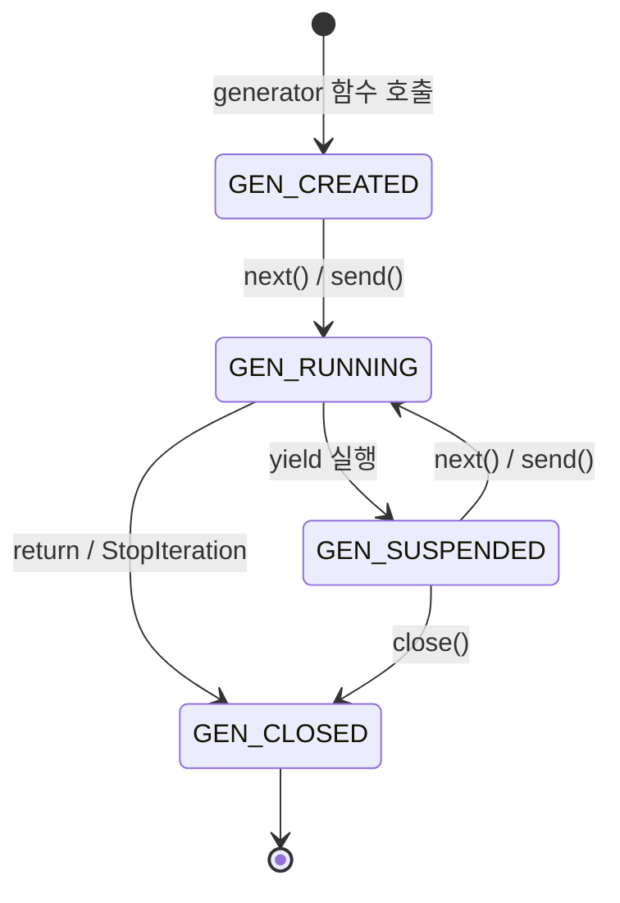
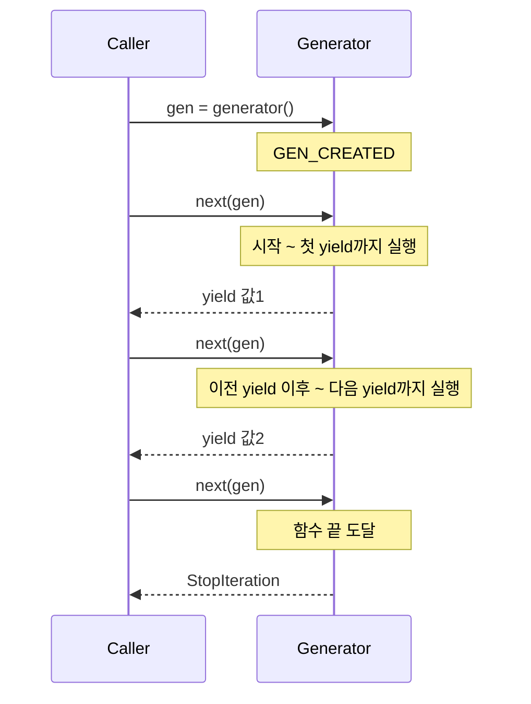
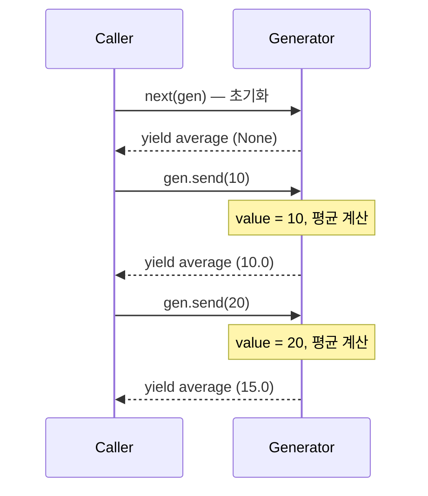

# 1. Iterator 프로토콜

Python의 `for` 루프는 내부적으로 **Iterator 프로토콜**을 사용한다. 이 프로토콜은 두 개의 매직 메서드로 구성된다.

- `__iter__()` — Iterator 객체 자신을 반환
- `__next__()` — 다음 값을 반환하고, 더 이상 값이 없으면 `StopIteration` 예외를 발생시킴

## 1.1 for 루프의 내부 동작

`for item in iterable` 구문은 실제로 다음과 같이 동작한다.

```python
iterator = iter(iterable)   # __iter__() 호출
while True:
    try:
        item = next(iterator)  # __next__() 호출
    except StopIteration:
        break                  # 루프 종료
```

## 1.2 커스텀 Iterator 클래스 구현

카운트다운을 하는 Iterator를 직접 구현해보자.

```python
class CountDown:
    def __init__(self, start: int):
        self.current = start

    def __iter__(self):
        return self

    def __next__(self):
        if self.current <= 0:
            raise StopIteration
        value = self.current
        self.current -= 1
        return value

for n in CountDown(5):
    print(n, end=" ")  # 5 4 3 2 1
```

`__iter__`와 `__next__`를 모두 구현해야 하고, 상태 관리도 직접 해야 한다. 이 번거로움을 Generator가 해결한다.

## 1.3 Iterable vs Iterator

| 구분 | Iterable | Iterator |
|------|----------|----------|
| 필수 메서드 | `__iter__()` | `__iter__()` + `__next__()` |
| 여러 번 순회 | 가능 (매번 새 Iterator 생성) | 불가 (소진되면 끝) |
| 예시 | `list`, `str`, `dict` | `iter([1,2,3])`, Generator |

```python
class Range:
    """Iterable - 여러 번 순회 가능"""
    def __init__(self, start, end):
        self.start, self.end = start, end

    def __iter__(self):
        return RangeIterator(self.start, self.end)

r = Range(1, 4)
print(list(r))  # [1, 2, 3]
print(list(r))  # [1, 2, 3] — 다시 순회 가능
```

# 2. Generator 기본

## 2.1 Generator 함수 (`yield`)

`yield` 키워드를 사용하는 함수는 **Generator 함수**가 된다. 호출하면 Generator 객체를 반환하고, `next()`를 호출할 때마다 다음 `yield`까지 실행된다.

```python
def simple_generator():
    yield 1
    yield 2
    yield 3

gen = simple_generator()
print(next(gen))  # 1
print(next(gen))  # 2
print(next(gen))  # 3
```

### yield vs return

| 항목 | `return` | `yield` |
|------|----------|---------|
| 실행 방식 | 값 반환 후 함수 종료 | 값 반환 후 상태 보존 (일시 중단) |
| 호출 결과 | 반환값 | Generator 객체 |
| 재개 가능 | 불가 | `next()`로 재개 |

### Generator 생명주기

Generator 객체는 4가지 상태를 가진다. `inspect.getgeneratorstate()`로 확인할 수 있다.



```python
import inspect

def countdown(n):
    while n > 0:
        yield n
        n -= 1

gen = countdown(3)
print(inspect.getgeneratorstate(gen))  # GEN_CREATED
next(gen)
print(inspect.getgeneratorstate(gen))  # GEN_SUSPENDED
list(gen)  # 나머지 소진
print(inspect.getgeneratorstate(gen))  # GEN_CLOSED
```

### next() 호출 시 실행 흐름



### Iterator 클래스 vs Generator 비교

앞서 만든 `CountDown`을 Generator로 다시 구현하면 훨씬 간결하다.

```python
# Iterator 클래스: 12줄
class CountDown:
    def __init__(self, start):
        self.current = start
    def __iter__(self):
        return self
    def __next__(self):
        if self.current <= 0:
            raise StopIteration
        value = self.current
        self.current -= 1
        return value

# Generator 함수: 4줄
def countdown_gen(start):
    while start > 0:
        yield start
        start -= 1
```

## 2.2 Generator Expression vs List Comprehension

### 문법 비교

```python
# List Comprehension — 대괄호 [], 즉시 생성 (eager)
squares_list = [x**2 for x in range(n)]

# Generator Expression — 소괄호 (), 요청 시 생성 (lazy)
squares_gen = (x**2 for x in range(n))
```

### 메모리 사용량 비교

`sys.getsizeof()`로 측정한 결과:

| N | List (bytes) | Generator (bytes) | 배율 |
|---|---|---|---|
| 1,000 | 8,856 | 192 | 46x |
| 10,000 | 85,176 | 192 | 444x |
| 100,000 | 824,456 | 192 | 4,294x |
| 1,000,000 | 8,448,728 | 192 | 44,004x |

Generator Expression은 데이터 크기에 관계없이 **192 bytes**로 일정하다.

### 선택 기준

| 상황 | 추천 |
|------|------|
| 한 번만 순회 | Generator Expression |
| 대용량 데이터 | Generator Expression |
| 인덱싱/슬라이싱 필요 | List Comprehension |
| 여러 번 재사용 | List Comprehension |
| `len()` 필요 | List Comprehension |
| `sum()`, `max()` 등에 전달 | Generator Expression |

```python
# Generator Expression이 적합한 경우
total = sum(x**2 for x in range(1_000_000))

# List Comprehension이 적합한 경우
squares = [x**2 for x in range(10)]
print(squares[0], squares[-1], len(squares))
```

# 3. Generator 고급 기능

## 3.1 `send()`, `throw()`, `close()`

Generator는 단순히 값을 생산하는 것뿐 아니라, 외부와 **양방향 통신**이 가능하다.

### send() — Generator에 값 전달

`send(value)`는 `yield` 표현식의 반환값으로 전달된다.



```python
def running_average():
    """send()를 활용한 러닝 평균 계산기"""
    total = 0.0
    count = 0
    average = None
    while True:
        value = yield average
        if value is None:
            break
        total += value
        count += 1
        average = total / count

avg = running_average()
next(avg)           # 초기화 (첫 yield까지 실행)
avg.send(10)        # → 10.0
avg.send(20)        # → 15.0
avg.send(30)        # → 20.0
```

### throw() — 예외 주입

```python
def resilient_generator():
    while True:
        try:
            value = yield
            print(f"받은 값: {value}")
        except ValueError as e:
            print(f"ValueError 처리: {e}")

gen = resilient_generator()
next(gen)
gen.send(42)                        # 받은 값: 42
gen.throw(ValueError, "잘못된 값")   # ValueError 처리: 잘못된 값
gen.send(100)                       # 받은 값: 100
```

### close() — Generator 종료

`close()`를 호출하면 Generator 내부에 `GeneratorExit` 예외가 발생한다. `try/except`로 잡아 리소스 정리가 가능하다.

```python
def resource_generator():
    print("리소스 열기")
    try:
        while True:
            yield "data"
    except GeneratorExit:
        print("리소스 닫기")

gen = resource_generator()
next(gen)     # 리소스 열기
gen.close()   # 리소스 닫기
```

## 3.2 `yield from` (서브 제네레이터 위임)

### 중첩 Generator 간결화

```python
# yield from 없이
def chain_manual(*iterables):
    for it in iterables:
        for item in it:
            yield item

# yield from 사용 — 간결하고 명확
def chain_yield_from(*iterables):
    for it in iterables:
        yield from it

list(chain_yield_from([1, 2], [3, 4]))  # [1, 2, 3, 4]
```

### 이터러블 평탄화

`yield from`은 재귀적으로 사용하여 중첩 리스트를 평탄화할 수 있다.

```python
def flatten(nested):
    for item in nested:
        if isinstance(item, list):
            yield from flatten(item)
        else:
            yield item

list(flatten([1, [2, 3], [4, [5, 6]], 7]))
# [1, 2, 3, 4, 5, 6, 7]
```

### 반환값 처리

서브 제네레이터의 `return` 값은 `yield from` 표현식의 결과로 전달된다.

```python
def sub_generator():
    total = 0
    while True:
        value = yield
        if value is None:
            return total    # StopIteration(total)
        total += value

def delegating_generator():
    result = yield from sub_generator()
    yield result

dg = delegating_generator()
next(dg)
dg.send(10)
dg.send(20)
result = dg.send(None)  # sub_generator 종료 → result = 30
```

# 4. itertools 활용

`itertools`는 효율적인 Iterator를 만드는 표준 라이브러리 모듈이다.

## 4.1 무한 이터레이터

| 함수 | 설명 | 예시 |
|------|------|------|
| `count(start, step)` | start부터 step씩 증가 | `count(10, 2)` → 10, 12, 14, ... |
| `cycle(iterable)` | 반복 순환 | `cycle('AB')` → A, B, A, B, ... |
| `repeat(elem, n)` | elem을 n번 반복 | `repeat(7, 3)` → 7, 7, 7 |

```python
from itertools import count, islice

# 무한 이터레이터는 islice로 제한
list(islice(count(10, 2), 5))  # [10, 12, 14, 16, 18]
```

## 4.2 조합 이터레이터

| 함수 | 설명 | 예시 |
|------|------|------|
| `chain(*iterables)` | 여러 이터러블 연결 | `chain([1,2], [3,4])` → 1, 2, 3, 4 |
| `islice(iterable, stop)` | 슬라이싱 | `islice(range(100), 5)` → 0~4 |
| `zip_longest(*iterables)` | 긴 쪽 기준 zip | `zip_longest([1,2,3], ['a','b'])` |

## 4.3 필터링

| 함수 | 설명 | 예시 |
|------|------|------|
| `takewhile(pred, it)` | 조건 True인 동안 가져옴 | 첫 False에서 중단 |
| `dropwhile(pred, it)` | 조건 True인 동안 건너뜀 | 첫 False부터 전부 |
| `filterfalse(pred, it)` | 조건 False인 것만 | `filter`의 반대 |

```python
from itertools import takewhile, dropwhile

data = [1, 3, 5, 2, 4, 6]
list(takewhile(lambda x: x < 5, data))  # [1, 3]
list(dropwhile(lambda x: x < 5, data))  # [5, 2, 4, 6]
```

## 4.4 그룹핑

`groupby()`는 **연속된 동일 키**를 그룹핑한다. 반드시 **정렬 후** 사용해야 같은 키가 하나로 묶인다.

```python
from itertools import groupby

data = [
    {"name": "Alice", "dept": "Engineering"},
    {"name": "Bob", "dept": "Engineering"},
    {"name": "Charlie", "dept": "Marketing"},
    {"name": "Eve", "dept": "Engineering"},
]

# 정렬하지 않으면 Engineering이 두 그룹으로 분리됨
sorted_data = sorted(data, key=lambda x: x["dept"])
for key, group in groupby(sorted_data, key=lambda x: x["dept"]):
    print(f"{key}: {[p['name'] for p in group]}")
# Engineering: ['Alice', 'Bob', 'Eve']
# Marketing: ['Charlie']
```

## 4.5 조합론

| 함수 | 설명 | 결과 수 |
|------|------|---------|
| `product('AB', '12')` | 데카르트 곱 | n*m개 |
| `permutations('ABC', 2)` | 순열 (순서 O) | nPr개 |
| `combinations('ABCD', 2)` | 조합 (순서 X) | nCr개 |

```python
from itertools import product, permutations, combinations

list(product("AB", "12"))
# [('A','1'), ('A','2'), ('B','1'), ('B','2')]

list(permutations("ABC", 2))
# [('A','B'), ('A','C'), ('B','A'), ('B','C'), ('C','A'), ('C','B')]

list(combinations("ABCD", 2))
# [('A','B'), ('A','C'), ('A','D'), ('B','C'), ('B','D'), ('C','D')]
```

# 5. 성능과 실전 패턴

## 5.1 메모리 효율 비교 (list vs generator 벤치마크)

`tracemalloc`으로 실제 메모리 사용량을 측정했다.

| N | List 메모리 | Generator 메모리 | List 시간 | Generator 시간 |
|---|---|---|---|---|
| 10,000 | 395 KB | 0.5 KB | 2.4ms | 2.1ms |
| 100,000 | 3,907 KB | 0.5 KB | 23.1ms | 20.9ms |
| 1,000,000 | 39,500 KB | 0.5 KB | 231.6ms | 198.5ms |

Generator는 데이터 크기에 관계없이 **약 0.5 KB**만 사용한다. 100만 건 처리 시 List 대비 **약 79,000배** 적은 메모리를 사용하면서, 처리 속도도 약간 빠르다.

```python
import tracemalloc

def process_with_list(n):
    return sum([x**2 for x in range(n)])

def process_with_generator(n):
    return sum(x**2 for x in range(n))

tracemalloc.start()
process_with_generator(1_000_000)
_, peak = tracemalloc.get_traced_memory()
tracemalloc.stop()
print(f"Peak memory: {peak / 1024:.1f} KB")  # ~0.5 KB
```

## 5.2 실전 패턴

### 대용량 파일 처리 파이프라인

Generator를 체이닝하면 대용량 파일을 메모리에 올리지 않고 처리할 수 있다.


```python
def read_lines(filepath):
    with open(filepath) as f:
        for line in f:
            yield line.strip()

def filter_non_empty(lines):
    for line in lines:
        if line:
            yield line

def to_upper(lines):
    for line in lines:
        yield line.upper()

# 파이프라인 조합
lines = read_lines("data.txt")
non_empty = filter_non_empty(lines)
result = list(to_upper(non_empty))
```

각 단계가 한 줄씩 처리하므로 파일 크기에 관계없이 일정한 메모리를 사용한다.

### 무한 시퀀스

```python
# 피보나치 수열
def fibonacci():
    a, b = 0, 1
    while True:
        yield a
        a, b = b, a + b

fib = fibonacci()
print([next(fib) for _ in range(10)])
# [0, 1, 1, 2, 3, 5, 8, 13, 21, 34]

# ID 생성기
def id_generator(prefix="ID"):
    n = 1
    while True:
        yield f"{prefix}-{n:06d}"
        n += 1

ids = id_generator("USR")
print(next(ids))  # USR-000001
print(next(ids))  # USR-000002
```

### 데이터 파이프라인 체이닝

범용 `pipe()` 함수로 Generator들을 체이닝할 수 있다.

```python
def pipe(data, *functions):
    result = data
    for func in functions:
        result = func(result)
    return result

def keep_even(items):
    for x in items:
        if x % 2 == 0:
            yield x

def double(items):
    for x in items:
        yield x * 2

def take(n):
    def _take(items):
        for i, item in enumerate(items):
            if i >= n:
                break
            yield item
    return _take

result = pipe(range(1, 20), keep_even, double, take(5))
print(list(result))  # [4, 8, 12, 16, 20]
```

# 6. 마무리

| 개념 | 핵심 |
|------|------|
| Iterator 프로토콜 | `__iter__` + `__next__` + `StopIteration` |
| Generator 함수 | `yield`로 상태 보존, Iterator 자동 구현 |
| Generator Expression | Lazy evaluation, 일정한 메모리 |
| send/throw/close | 양방향 통신, 예외 주입, 리소스 정리 |
| yield from | 서브 제네레이터 위임, 반환값 전달 |
| itertools | 효율적인 표준 Iterator 도구 |
| 실전 패턴 | 파이프라인, 무한 시퀀스, 체이닝 |

> 전체 샘플 코드는 [GitHub - tutorials-python/python/generator](https://github.com/kenshin579/tutorials-python/tree/master/python/generator)에서 확인할 수 있다.

# 7. FAQ

### Q. Generator는 언제 사용해야 하나요?

대용량 데이터를 한 번만 순회하거나, 무한 시퀀스를 다루거나, 파이프라인 패턴이 필요할 때 적합하다. 데이터가 작고 여러 번 접근해야 한다면 리스트가 낫다.

### Q. Generator와 코루틴의 관계는?

`send()`를 사용하는 Generator는 Python 코루틴의 초기 형태다. Python 3.5부터 `async/await` 구문이 도입되어 비동기 코루틴은 `async def`로 작성하는 것이 표준이다. Generator 기반 코루틴은 레거시로 간주된다.

### Q. `yield from`과 단순 `for` 루프의 차이는?

`yield from`은 `send()`, `throw()`, `close()`를 서브 제네레이터에 자동 전달한다. 단순 `for` 루프는 `next()`만 전달하므로 양방향 통신이 불가하다.

### Q. `groupby()`를 쓸 때 왜 정렬이 필요한가요?

`groupby()`는 **연속된 동일 키**만 그룹핑한다. 정렬하지 않으면 같은 키가 여러 그룹으로 분리된다. SQL의 `GROUP BY`와 달리 전체 데이터를 한 번에 보지 않기 때문이다.

# 8. 참고

- [Python 공식 문서 - Functional Programming HOWTO](https://docs.python.org/3/howto/functional.html)
- [Python 공식 문서 - itertools](https://docs.python.org/3/library/itertools.html)
- [Python 공식 문서 - Generator 표현식](https://docs.python.org/3/reference/expressions.html#generator-expressions)
- [PEP 255 - Simple Generators](https://peps.python.org/pep-0255/)
- [PEP 380 - Syntax for Delegating to a Subgenerator](https://peps.python.org/pep-0380/)
