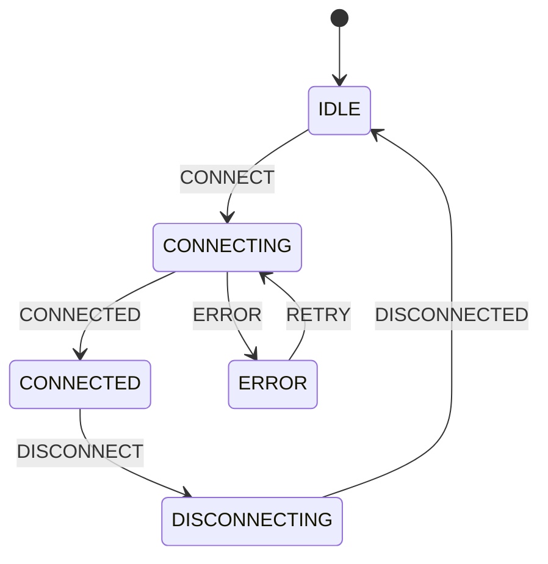

> 전체 소스 코드는 [tutorials-python/python/pattern-matching](https://github.com/kenshin579/tutorials-python/tree/master/python/pattern-matching)을 참조한다.

# 1. 개요

Python 3.10에서 도입된 **structural pattern matching**(PEP 634)은 값의 구조를 분해하면서 동시에 조건 분기를 수행하는 문법이다. 다른 언어의 `switch/case`와 비슷해 보이지만, **구조 분해(destructuring)**가 핵심이라는 점에서 본질적으로 다르다.

```python
def http_status(status: int) -> str:
    match status:
        case 200:
            return "OK"
        case 301:
            return "Moved Permanently"
        case 404:
            return "Not Found"
        case 500:
            return "Internal Server Error"
        case _:
            return f"Unknown: {status}"

http_status(200)  # "OK"
http_status(418)  # "Unknown: 418"
```

`match subject:`로 매칭 대상을 지정하고, `case pattern:`으로 각 패턴을 나열한다. 위에서부터 순서대로 매칭을 시도하며, **첫 번째로 매칭되는 케이스**가 실행된다.

> Python 3.10 이상이 필요하다. `sys.version_info >= (3, 10)`으로 버전을 확인할 수 있다.

# 2. 기본 패턴

## 2.1 리터럴 패턴

정확한 값과 매칭한다. 정수, 문자열, `bool`, `None` 등을 사용할 수 있다.

```python
def greet(lang: str) -> str:
    match lang:
        case "ko":
            return "안녕하세요"
        case "en":
            return "Hello"
        case "ja":
            return "こんにちは"
        case _:
            return "Hi"
```

`bool`과 `None`도 리터럴 패턴으로 매칭된다.

```python
def check_value(value) -> str:
    match value:
        case True:
            return "boolean True"
        case False:
            return "boolean False"
        case None:
            return "None value"
        case 0:
            return "zero"
        case _:
            return f"other: {value}"
```

> `True`는 Python 내부에서 `int`의 서브클래스이지만, 패턴 매칭에서는 **`bool` 리터럴이 `int`보다 먼저** 매칭된다. 따라서 `True`와 `1`을 구분할 수 있다.

## 2.2 캡처 패턴

변수 이름을 패턴에 쓰면 **어떤 값이든 매칭**되고 해당 변수에 바인딩된다.

```python
def describe(value) -> str:
    match value:
        case 0:
            return "zero"
        case x:  # 어떤 값이든 매칭, x에 바인딩
            return f"captured: {x}"

describe(42)      # "captured: 42"
describe("hello") # "captured: hello"
```

문자열 분리와 조합하면 유용하다.

```python
def parse_greeting(message: str) -> str:
    match message.split():
        case ["hello", name]:
            return f"인사 대상: {name}"
        case [greeting, name]:
            return f"{greeting} -> {name}"
        case _:
            return "알 수 없는 형식"

parse_greeting("hello World")  # "인사 대상: World"
parse_greeting("hi Alice")     # "hi -> Alice"
```

## 2.3 와일드카드 패턴

`_`는 **어떤 값이든 매칭**하지만 변수에 바인딩하지 않는다. 보통 마지막에 default 분기로 사용한다.

```python
def classify(n: int) -> str:
    match n:
        case 0:
            return "zero"
        case 1:
            return "one"
        case _:  # catch-all
            return "other"
```

## 2.4 상수 매칭 — 점 표기 필수

**점 표기(dotted name)**가 없는 이름은 캡처 패턴으로 취급된다. 상수를 매칭하려면 반드시 점 표기를 사용해야 한다.

```python
from enum import Enum

class Color(Enum):
    RED = 1
    GREEN = 2
    BLUE = 3

def describe_color(color: Color) -> str:
    match color:
        case Color.RED:    # ✅ 상수 매칭 (점 표기)
            return "빨간색"
        case Color.GREEN:
            return "초록색"
        case Color.BLUE:
            return "파란색"
```

```python
# ⚠️ 주의: 점 표기 없이 쓰면 캡처 패턴이 된다
RED = 1
match color:
    case RED:   # ❌ 캡처 패턴! RED 변수에 값이 바인딩됨
        ...
```

| 패턴 | 의미 | 예시 |
|------|------|------|
| `case 200:` | 리터럴 매칭 | 정확히 200 |
| `case x:` | 캡처 (아무 값) | 변수 x에 바인딩 |
| `case _:` | 와일드카드 | 아무 값, 바인딩 없음 |
| `case Color.RED:` | 상수 매칭 | 점 표기 필수 |

# 3. 구조 패턴

## 3.1 시퀀스 패턴

리스트나 튜플을 **디스트럭처링**한다. `*`로 나머지 요소를 캡처할 수 있다.

```python
def analyze(data: list) -> str:
    match data:
        case []:
            return "빈 시퀀스"
        case [single]:
            return f"단일 요소: {single}"
        case [first, second]:
            return f"두 요소: {first}, {second}"
        case [first, *rest]:
            return f"첫 번째: {first}, 나머지: {rest}"

analyze([1, 2, 3, 4])  # "첫 번째: 1, 나머지: [2, 3, 4]"
```

**중첩 시퀀스**도 매칭할 수 있다.

```python
def analyze_coordinates(points: list) -> str:
    match points:
        case [[x1, y1], [x2, y2]]:
            dx, dy = x2 - x1, y2 - y1
            return f"거리 벡터: ({dx}, {dy})"
        case [[x, y]]:
            return f"단일 점: ({x}, {y})"

analyze_coordinates([[0, 0], [3, 4]])  # "거리 벡터: (3, 4)"
```

시퀀스 패턴은 **커맨드 파싱**에 특히 유용하다.

```python
def classify_command(command: list[str]) -> str:
    match command:
        case ["quit"]:
            return "프로그램 종료"
        case ["go", direction]:
            return f"{direction}(으)로 이동"
        case ["pick", "up", item]:
            return f"{item} 줍기"
        case _:
            return "알 수 없는 명령어"
```

## 3.2 매핑 패턴

딕셔너리의 **키 기반 매칭**을 수행한다. 지정하지 않은 추가 키가 있어도 매칭된다(partial match). `**rest`로 나머지 키-값을 캡처할 수 있다.

```python
def process_event(event: dict) -> str:
    match event:
        case {"type": "click", "x": x, "y": y}:
            return f"클릭: ({x}, {y})"
        case {"type": "keypress", "key": key}:
            return f"키 입력: {key}"
        case {"type": event_type}:
            return f"기타: {event_type}"

process_event({"type": "click", "x": 100, "y": 200, "timestamp": 123})
# "클릭: (100, 200)" — timestamp 키가 있어도 매칭됨
```

`**rest`로 나머지 키를 캡처한다.

```python
def extract_user(data: dict) -> str:
    match data:
        case {"name": name, "email": email, **rest}:
            extra = f", 추가: {rest}" if rest else ""
            return f"{name} ({email}){extra}"
        case {"name": name}:
            return f"{name} (이메일 없음)"
```

## 3.3 클래스 패턴

객체의 **속성을 기반**으로 매칭한다. `@dataclass`와 특히 잘 어울린다.

```python
from dataclasses import dataclass

@dataclass
class Point:
    x: float
    y: float

def describe_point(point: Point) -> str:
    match point:
        case Point(x=0, y=0):
            return "원점"
        case Point(x=0, y=y):
            return f"Y축 위의 점 (y={y})"
        case Point(x=x, y=0):
            return f"X축 위의 점 (x={x})"
        case Point(x=x, y=y):
            return f"일반 점 ({x}, {y})"
```

**중첩 클래스 패턴**도 가능하다.

```python
@dataclass
class Circle:
    center: Point
    radius: float

def describe_shape(shape) -> str:
    match shape:
        case Circle(center=Point(x=0, y=0), radius=r):
            return f"원점 중심 원 (반지름={r})"
        case Circle(center=center, radius=r):
            return f"원 (중심=({center.x}, {center.y}), 반지름={r})"
```

### `__match_args__`로 위치 인자 매칭

`@dataclass`는 `__match_args__`를 자동 생성하므로 위치 인자로 매칭할 수 있다. 일반 클래스에서는 직접 정의해야 한다.

```python
class Color:
    __match_args__ = ("r", "g", "b")

    def __init__(self, r: int, g: int, b: int):
        self.r, self.g, self.b = r, g, b

match color:
    case Color(0, 0, 0):       # 위치 인자 매칭
        return "검정"
    case Color(255, 255, 255):
        return "흰색"
    case Color(r, 0, 0):       # r만 캡처
        return f"빨강 계열 (r={r})"
```

# 4. 패턴 조합

## 4.1 OR 패턴 (`|`)

`|`로 여러 패턴을 하나의 `case`에 합친다.

```python
def classify_status(status: int) -> str:
    match status:
        case 200 | 201 | 204:
            return "성공"
        case 301 | 302 | 307:
            return "리다이렉트"
        case 400 | 401 | 403 | 404:
            return "클라이언트 에러"
        case 500 | 502 | 503:
            return "서버 에러"
```

OR 패턴에서 캡처 변수를 사용할 때는 **양쪽 모두 동일한 변수를 바인딩**해야 한다.

```python
@dataclass
class Attack:
    target: str

@dataclass
class Heal:
    target: str

match action:
    case Attack(target=name) | Heal(target=name):  # ✅ 양쪽 모두 name 바인딩
        print(f"대상: {name}")
```

## 4.2 guard 조건 (`if`)

패턴 매칭 후 **추가 조건**을 검사한다.

```python
def classify_age(age: int) -> str:
    match age:
        case n if n < 0:
            return "잘못된 나이"
        case n if n < 13:
            return "어린이"
        case n if n < 20:
            return "청소년"
        case n if n < 65:
            return "성인"
        case _:
            return "시니어"
```

**매핑 패턴과 guard 조합**으로 복잡한 요청을 분기할 수 있다.

```python
def process_request(request: dict) -> str:
    match request:
        case {"method": "GET", "path": path} if path.startswith("/api/"):
            return f"API 조회: {path}"
        case {"method": "GET", "path": path}:
            return f"페이지 조회: {path}"
        case {"method": "POST", "path": path, "body": body} if len(body) > 1000:
            return f"대용량 POST: {path}"
```

## 4.3 중첩 패턴

패턴 안에 패턴을 넣어 **깊은 구조**를 한 번에 매칭한다.

```python
def extract_first_user(data: dict) -> str:
    match data:
        case {"users": [{"name": name}, *_]}:
            return f"첫 번째 사용자: {name}"
        case {"users": []}:
            return "사용자 없음"
        case _:
            return "users 필드 없음"

extract_first_user({"users": [{"name": "Alice"}, {"name": "Bob"}]})
# "첫 번째 사용자: Alice"
```

**API 응답 파싱**에서 중첩 패턴이 빛을 발한다.

```python
def parse_response(response: dict) -> str:
    match response:
        case {"status": "ok", "data": {"items": [first, *rest]}}:
            return f"성공 — 첫 항목: {first}, 나머지 {len(rest)}개"
        case {"status": "ok", "data": {"items": []}}:
            return "성공 — 결과 없음"
        case {"status": "error", "error": {"code": code, "message": msg}}:
            return f"에러 [{code}]: {msg}"
```

# 5. 실전 활용

## 5.1 커맨드 파서

텍스트 기반 게임이나 CLI 도구에서 명령어를 파싱한다.

```python
def parse_command(raw: str) -> str:
    match raw.strip().split():
        case ["quit" | "exit" | "q"]:
            return "종료"
        case ["go", ("north" | "south" | "east" | "west") as direction]:
            return f"{direction}(으)로 이동"
        case ["attack", target]:
            return f"{target} 공격"
        case ["use", item, "on", target]:
            return f"{target}에게 {item} 사용"
        case ["say", *words]:
            return f'말하기: "{" ".join(words)}"'
        case []:
            return "빈 입력"
        case _:
            return "알 수 없는 명령어"
```

`("north" | "south" | ...) as direction`처럼 **OR 패턴 + as 바인딩**을 조합하면 허용된 값만 매칭하면서 변수에 캡처할 수 있다.

## 5.2 상태 머신

`(현재 상태, 이벤트)` 튜플 매칭으로 상태 전환을 선언적으로 표현한다.

```python
from enum import Enum, auto

class State(Enum):
    IDLE = auto()
    CONNECTING = auto()
    CONNECTED = auto()
    DISCONNECTING = auto()
    ERROR = auto()

class Event(Enum):
    CONNECT = auto()
    CONNECTED = auto()
    DISCONNECT = auto()
    DISCONNECTED = auto()
    ERROR = auto()
    RETRY = auto()

def transition(state: State, event: Event) -> State:
    match (state, event):
        case (State.IDLE, Event.CONNECT):
            return State.CONNECTING
        case (State.CONNECTING, Event.CONNECTED):
            return State.CONNECTED
        case (State.CONNECTING, Event.ERROR):
            return State.ERROR
        case (State.CONNECTED, Event.DISCONNECT):
            return State.DISCONNECTING
        case (State.DISCONNECTING, Event.DISCONNECTED):
            return State.IDLE
        case (State.ERROR, Event.RETRY):
            return State.CONNECTING
        case (_, Event.ERROR):       # 어떤 상태에서든 에러
            return State.ERROR
        case _:
            return state             # 상태 유지
```



## 5.3 JSON/API 응답 파싱

REST API의 다양한 응답 구조를 한 곳에서 처리한다.

```python
def handle_api_response(response: dict) -> str:
    match response:
        case {
            "status": "ok",
            "data": list(items),
            "meta": {"page": page, "total_pages": total}
        }:
            return f"페이지 {page}/{total} — {len(items)}건"
        case {"status": "ok", "data": {"id": id_, "type": type_}}:
            return f"객체: {type_}#{id_}"
        case {"status": "ok", "data": None}:
            return "데이터 없음"
        case {"status": "error", "error": {"code": 401 | 403, "message": msg}}:
            return f"인증 에러: {msg}"
        case {"status": "error", "error": {"code": code, "message": msg}}:
            return f"에러 [{code}]: {msg}"
```

`list(items)` 패턴은 값이 `list` 타입인지 확인하면서 동시에 `items` 변수에 바인딩한다.

## 5.4 AST 노드 처리

재귀적 패턴 매칭으로 AST(Abstract Syntax Tree)를 평가한다.

```python
from dataclasses import dataclass

@dataclass
class Num:
    value: float

@dataclass
class Add:
    left: object
    right: object

@dataclass
class Mul:
    left: object
    right: object

@dataclass
class Neg:
    operand: object

def evaluate(expr) -> float:
    match expr:
        case Num(value=v):
            return v
        case Add(left=l, right=r):
            return evaluate(l) + evaluate(r)
        case Mul(left=l, right=r):
            return evaluate(l) * evaluate(r)
        case Neg(operand=e):
            return -evaluate(e)
        case _:
            raise ValueError(f"알 수 없는 노드: {expr}")

# (2 + 3) * 4 = 20
expr = Mul(Add(Num(2), Num(3)), Num(4))
evaluate(expr)  # 20.0
```

패턴 매칭 없이 이 코드를 작성하면 `isinstance` 체인이 필요하다. 패턴 매칭은 **구조 분해와 타입 체크를 동시에** 수행하므로 코드가 훨씬 간결해진다.

# 6. if/elif vs match/case 비교

## 동일 로직 비교

중첩 데이터를 처리하는 코드를 두 방식으로 비교한다.

**if/elif 방식:**

```python
def handle_response_if(response: dict) -> str:
    if isinstance(response, dict):
        status = response.get("status")
        if status == "ok":
            data = response.get("data")
            if isinstance(data, dict):
                items = data.get("items")
                if isinstance(items, list) and len(items) > 0:
                    return f"첫 항목: {items[0]}"
                return "항목 없음"
        elif status == "error":
            error = response.get("error")
            if isinstance(error, dict):
                return f"에러: {error.get('message', '알 수 없음')}"
    return "알 수 없는 형식"
```

**match/case 방식:**

```python
def handle_response_match(response: dict) -> str:
    match response:
        case {"status": "ok", "data": {"items": [first, *_]}}:
            return f"첫 항목: {first}"
        case {"status": "ok", "data": {"items": []}}:
            return "항목 없음"
        case {"status": "error", "error": {"message": msg}}:
            return f"에러: {msg}"
        case _:
            return "알 수 없는 형식"
```

중첩 데이터에서는 match/case가 **중첩 if와 isinstance 체인을 제거**하여 의도가 명확하게 드러난다.

## 언제 무엇을 쓸까

| 상황 | 추천 | 이유 |
|------|------|------|
| 구조 분해 (리스트, 딕셔너리, 객체) | match/case | 한 줄로 구조와 값을 동시에 매칭 |
| 중첩 데이터 (JSON, API 응답) | match/case | isinstance + get 체인 제거 |
| 타입별 분기 (AST, 이벤트) | match/case | 클래스 패턴으로 간결하게 |
| 단순 값 비교 | 둘 다 OK | 큰 차이 없음 |
| 범위 비교 (`x < 10`) | if/elif | guard 없이 자연스럽게 |
| 복잡한 boolean 조합 | if/elif | `and`/`or` 조합이 더 직관적 |

## 성능

실측 결과, 단순 값 매칭에서 if/elif와 match/case의 **성능 차이는 미미**하다 (50만 건 기준 약 1.0~1.1x). 성능보다는 **가독성**을 기준으로 선택하는 것이 좋다.

# 7. 마무리

| 패턴 | 문법 | 용도 |
|------|------|------|
| 리터럴 | `case 200:` | 정확한 값 매칭 |
| 캡처 | `case x:` | 변수에 바인딩 |
| 와일드카드 | `case _:` | catch-all |
| 시퀀스 | `case [a, b, *rest]:` | 리스트/튜플 분해 |
| 매핑 | `case {"key": val}:` | 딕셔너리 매칭 |
| 클래스 | `case Point(x=0):` | 객체 속성 매칭 |
| OR | `case A \| B:` | 여러 패턴 합치기 |
| guard | `case x if x > 0:` | 추가 조건 |

패턴 매칭은 **구조가 복잡할수록** 빛을 발한다. 단순 분기에는 if/elif가 충분하지만, 중첩 데이터 처리·타입별 분기·커맨드 파싱 등에서는 match/case가 코드의 의도를 훨씬 명확하게 전달한다.

# 8. 참고

- [PEP 634 – Structural Pattern Matching: Specification](https://peps.python.org/pep-0634/)
- [PEP 635 – Structural Pattern Matching: Motivation and Rationale](https://peps.python.org/pep-0635/)
- [PEP 636 – Structural Pattern Matching: Tutorial](https://peps.python.org/pep-0636/)
- [Python 3.10 What's New](https://docs.python.org/3/whatsnew/3.10.html#pep-634-structural-pattern-matching)
