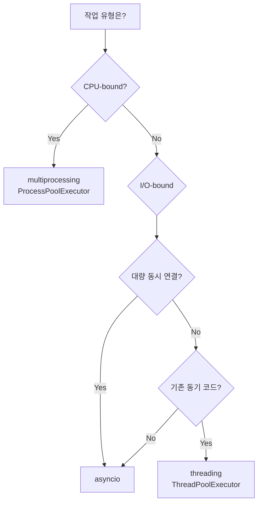

> 전체 소스 코드는 [tutorials-python/python/concurrency](https://github.com/kenshin579/tutorials-python/tree/master/python/concurrency)를 참조한다.

# 1. 개요

## 1.1 왜 동시성이 필요한가

프로그램이 순차적으로 실행되면 한 작업이 끝나야 다음 작업을 시작할 수 있다. 네트워크 요청이 응답을 기다리는 동안 CPU는 아무 일도 하지 않고, 대규모 연산을 하나의 코어에서만 처리하면 나머지 코어는 놀게 된다.

Python은 이 문제를 해결하기 위해 세 가지 동시성 모델을 제공한다.

| 모델 | 모듈 | 방식 | 적합한 작업 |
|------|------|------|------------|
| **멀티스레딩** | `threading` | 하나의 프로세스 내에서 여러 스레드 | I/O-bound |
| **멀티프로세싱** | `multiprocessing` | 별도 프로세스로 분리 | CPU-bound |
| **비동기** | `asyncio` | 단일 스레드 + 이벤트 루프 | I/O-bound (대량 동시성) |

## 1.2 CPU-bound vs I/O-bound 작업

동시성 모델을 선택하려면 먼저 작업이 **CPU-bound**인지 **I/O-bound**인지 파악해야 한다.

- **CPU-bound**: CPU 연산이 병목인 작업. 수학 연산, 이미지 처리, 데이터 변환 등
- **I/O-bound**: 외부 I/O 대기가 병목인 작업. 파일 읽기/쓰기, 네트워크 요청, DB 쿼리 등

이 구분이 중요한 이유는 Python의 GIL 때문이다.

# 2. GIL (Global Interpreter Lock)

## 2.1 GIL이란

GIL은 CPython 인터프리터의 뮤텍스로, **한 번에 하나의 스레드만 Python 바이트코드를 실행**할 수 있게 제한한다.

GIL이 존재하는 이유는 CPython의 메모리 관리 방식인 **참조 카운팅(reference counting)** 때문이다. 여러 스레드가 동시에 참조 카운트를 수정하면 메모리 관리가 깨질 수 있으므로, GIL로 이를 보호한다.

## 2.2 GIL의 영향

GIL의 영향은 작업 유형에 따라 크게 다르다.

**I/O-bound 작업**: I/O 대기 중에는 GIL이 **해제**되므로 threading이 효과적이다.

```python
import threading
import time

def io_bound_task(duration: float) -> str:
    time.sleep(duration)
    return "done"

# 두 스레드가 동시에 sleep → ~0.1초 (0.2초가 아님)
start = time.perf_counter()
t1 = threading.Thread(target=io_bound_task, args=(0.1,))
t2 = threading.Thread(target=io_bound_task, args=(0.1,))
t1.start()
t2.start()
t1.join()
t2.join()
elapsed = time.perf_counter() - start  # ~0.1초
```

**CPU-bound 작업**: GIL로 인해 멀티스레드여도 **실제 병렬 실행이 불가능**하다. multiprocessing을 사용해야 한다.

```python
import multiprocessing

def cpu_bound_task(n: int) -> int:
    total = 0
    for i in range(n):
        total += i * i
    return total

# multiprocessing: GIL 우회로 실제 병렬 실행
with multiprocessing.Pool(2) as pool:
    pool.map(cpu_bound_task, [5_000_000, 5_000_000])
```

## 2.3 Python 3.13+ free-threading (no-GIL)

PEP 703은 GIL을 선택적으로 비활성화하는 **free-threading** 빌드를 도입했다.

```bash
# free-threading 빌드 설치 (Python 3.13+)
python3.13t  # 't'가 붙은 빌드

# GIL 비활성화
PYTHON_GIL=0 python3.13t my_script.py
```

현재 **실험적 단계**이며, C 확장 모듈 호환성 문제가 있을 수 있다. 대부분의 프로덕션 환경에서는 아직 기존 방식(threading + multiprocessing)을 사용하는 것이 안전하다.

# 3. 동시성 모델별 사용법

## 3.1 threading

### Thread 생성과 join

```python
import threading

results = []

def worker(name: str):
    results.append(name)

t1 = threading.Thread(target=worker, args=("thread-1",))
t2 = threading.Thread(target=worker, args=("thread-2",))
t1.start()
t2.start()
t1.join()  # t1 완료까지 대기
t2.join()  # t2 완료까지 대기
```

### Lock으로 race condition 방지

여러 스레드가 공유 변수를 동시에 수정하면 **race condition**이 발생한다. `Lock`으로 이를 방지한다.

```python
counter = {"value": 0}
lock = threading.Lock()

def increment():
    for _ in range(100_000):
        with lock:  # Lock 획득 → 작업 → 자동 해제
            counter["value"] += 1

threads = [threading.Thread(target=increment) for _ in range(2)]
for t in threads:
    t.start()
for t in threads:
    t.join()

assert counter["value"] == 200_000  # Lock 없으면 200000보다 작을 수 있음
```

### Event로 스레드 간 신호 전달

`Event`는 한 스레드가 다른 스레드에게 신호를 보내는 패턴이다.

```python
event = threading.Event()

def waiter():
    event.wait()  # set()이 호출될 때까지 대기
    print("Signal received!")

def sender():
    time.sleep(0.1)
    event.set()  # 대기 중인 스레드에 신호 전달

t1 = threading.Thread(target=waiter)
t2 = threading.Thread(target=sender)
t1.start()
t2.start()
```

### daemon thread vs non-daemon thread

- **non-daemon (기본값)**: 메인 스레드가 종료되어도 완료될 때까지 프로그램이 대기한다.
- **daemon**: 메인 스레드가 종료되면 함께 강제 종료된다. 백그라운드 작업에 적합하다.

```python
t = threading.Thread(target=background_task, daemon=True)
t.daemon  # True
```

## 3.2 multiprocessing

### Process 생성

`Process`는 별도의 Python 인터프리터 프로세스를 생성한다. 각 프로세스가 독립된 GIL을 가지므로 CPU-bound 작업에서 진정한 병렬 실행이 가능하다.

```python
import multiprocessing
import os

def get_pid(q):
    q.put(os.getpid())

result = multiprocessing.Queue()
p = multiprocessing.Process(target=get_pid, args=(result,))
p.start()
p.join()
child_pid = result.get()  # 현재 프로세스와 다른 PID
```

### Pool로 병렬 처리

`Pool`은 프로세스 풀을 관리하며, `map()`, `apply_async()`, `starmap()` 등을 제공한다.

```python
def square(n: int) -> int:
    return n * n

# Pool.map(): 여러 입력을 병렬로 처리
with multiprocessing.Pool(2) as pool:
    results = pool.map(square, [1, 2, 3, 4, 5])
    # [1, 4, 9, 16, 25]

# Pool.apply_async(): 비동기 작업 제출
with multiprocessing.Pool(2) as pool:
    future = pool.apply_async(square, (10,))
    result = future.get(timeout=5)  # 100
```

### Queue와 Pipe: 프로세스 간 통신

프로세스는 메모리를 공유하지 않으므로 **IPC(Inter-Process Communication)** 메커니즘이 필요하다.

```python
# Queue: 다대다 통신
def worker_with_queue(q, value):
    q.put(value * value)

q = multiprocessing.Queue()
processes = [
    multiprocessing.Process(target=worker_with_queue, args=(q, i))
    for i in range(3)
]
for p in processes:
    p.start()
for p in processes:
    p.join()

results = set()
while not q.empty():
    results.add(q.get())  # {0, 1, 4}
```

```python
# Pipe: 1:1 통신
def worker_with_pipe(conn, value):
    conn.send(value * value)
    conn.close()

parent_conn, child_conn = multiprocessing.Pipe()
p = multiprocessing.Process(target=worker_with_pipe, args=(child_conn, 7))
p.start()
result = parent_conn.recv()  # 49
p.join()
```

### Value와 Array: 프로세스 간 메모리 공유

```python
shared_counter = multiprocessing.Value("i", 0)  # int 타입
shared_array = multiprocessing.Array("d", [0.0, 0.0, 0.0])  # double 배열

def update_shared(counter, arr):
    counter.value += 1
    for i in range(len(arr)):
        arr[i] = i * 1.5

p = multiprocessing.Process(target=update_shared, args=(shared_counter, shared_array))
p.start()
p.join()
# shared_counter.value == 1
# list(shared_array) == [0.0, 1.5, 3.0]
```

> **주의**: multiprocessing은 함수를 pickle로 직렬화하여 자식 프로세스에 전달한다. **모듈 레벨 함수**만 전달할 수 있으며, 람다나 로컬 함수는 pickle이 불가능하다.

## 3.3 asyncio 개요

asyncio는 **단일 스레드**에서 **이벤트 루프** 기반의 협력적 멀티태스킹을 구현한다. I/O 대기 중에 다른 코루틴에게 제어를 넘기는 방식이다.

```python
import asyncio

async def fetch(url: str) -> dict:
    await asyncio.sleep(0.05)  # I/O 대기 시뮬레이션
    return {"url": url, "status": 200}

async def main():
    # gather로 여러 코루틴을 동시에 실행
    results = await asyncio.gather(
        fetch("url1"),
        fetch("url2"),
        fetch("url3"),
    )
    return results  # 3개 동시 실행이므로 ~0.05초

asyncio.run(main())
```

asyncio의 상세한 사용법(Task, Future, TaskGroup 등)은 별도의 [asyncio 기초 편]에서 다룬다.

# 4. concurrent.futures - 고수준 통합 API

`concurrent.futures`는 threading과 multiprocessing을 **동일한 인터페이스**로 사용할 수 있는 고수준 API다. `Executor`를 바꾸기만 하면 스레드 기반↔프로세스 기반 전환이 가능하다.

## 4.1 ThreadPoolExecutor

I/O-bound 작업에 적합하다.

```python
from concurrent.futures import ThreadPoolExecutor

def io_task(name: str) -> str:
    time.sleep(0.05)
    return f"{name} done"

# submit(): 작업 제출 → Future 객체 반환
with ThreadPoolExecutor(max_workers=3) as executor:
    future = executor.submit(io_task, "task-1")
    result = future.result()  # "task-1 done"

# map(): 여러 작업 병렬 실행 (결과 순서 보장)
with ThreadPoolExecutor(max_workers=3) as executor:
    results = list(executor.map(io_task, ["a", "b", "c"]))
    # ["a done", "b done", "c done"]
```

## 4.2 ProcessPoolExecutor

CPU-bound 작업에 적합하다. 인터페이스는 `ThreadPoolExecutor`와 동일하다.

```python
from concurrent.futures import ProcessPoolExecutor

def cpu_task(n: int) -> int:
    return sum(i * i for i in range(n))

with ProcessPoolExecutor(max_workers=2) as executor:
    results = list(executor.map(cpu_task, [100, 200, 300]))
```

## 4.3 공통 패턴

### as_completed(): 완료 순서대로 결과 처리

`map()`은 입력 순서대로 결과를 반환하지만, `as_completed()`는 **먼저 완료된 것부터** 처리할 수 있다.

```python
from concurrent.futures import ThreadPoolExecutor, as_completed

def timed_task(name: str, duration: float) -> str:
    time.sleep(duration)
    return name

with ThreadPoolExecutor(max_workers=3) as executor:
    futures = [
        executor.submit(timed_task, "slow", 0.1),
        executor.submit(timed_task, "fast", 0.01),
        executor.submit(timed_task, "medium", 0.05),
    ]
    for future in as_completed(futures):
        print(future.result())
        # fast → medium → slow (완료 순서)
```

### Future 예외 처리

```python
def failing_task():
    raise ValueError("something went wrong")

with ThreadPoolExecutor(max_workers=1) as executor:
    future = executor.submit(failing_task)
    try:
        future.result()
    except ValueError as e:
        print(f"Error: {e}")  # "Error: something went wrong"
```

# 5. 성능 벤치마크와 선택 기준

## 5.1 벤치마크 비교

동일한 작업을 각 모델로 실행하여 성능을 비교했다.

### I/O-bound 벤치마크 (5개 작업, 각 0.05초 sleep)

| 방식 | 실행 시간 | 비고 |
|------|----------|------|
| sequential | ~0.25초 | 순차 실행 |
| threading | ~0.05초 | GIL 해제, 동시 실행 |
| ThreadPoolExecutor | ~0.05초 | threading의 고수준 래퍼 |
| asyncio | ~0.05초 | 단일 스레드, 이벤트 루프 |

I/O-bound에서는 threading, asyncio 모두 효과적이다.

### CPU-bound 벤치마크 (4개 작업, 각 2백만 회 연산)

| 방식 | 실행 시간 | 비고 |
|------|----------|------|
| sequential | ~1.0초 | 순차 실행 |
| threading | ~1.0초 | GIL로 인해 순차와 비슷 |
| multiprocessing | ~0.3초 | 실제 병렬 실행 |
| ProcessPoolExecutor | ~0.3초 | multiprocessing의 고수준 래퍼 |

CPU-bound에서는 **multiprocessing만** 실질적인 성능 향상을 제공한다.

> 벤치마크 결과는 하드웨어와 환경에 따라 다를 수 있다. 정확한 수치보다 **상대적인 경향**에 주목하자.

## 5.2 선택 기준 의사결정 트리



정리하면 다음과 같다.

- **CPU-bound** → `multiprocessing` 또는 `ProcessPoolExecutor`
- **I/O-bound + 대량 동시성** (수백~수천 연결) → `asyncio`
- **I/O-bound + 기존 동기 코드** → `threading` 또는 `ThreadPoolExecutor`
- **혼합 패턴** → `asyncio` + `run_in_executor()`로 동기 코드를 비동기 환경에서 실행

## 5.3 한눈에 보는 비교표

| 특성 | threading | multiprocessing | asyncio | concurrent.futures |
|------|-----------|----------------|---------|-------------------|
| **GIL 영향** | 받음 | 우회 | 단일 스레드 | Executor에 따라 |
| **병렬 실행** | I/O만 가능 | CPU+I/O 모두 | I/O만 가능 | Executor에 따라 |
| **메모리** | 공유 | 독립 (IPC 필요) | 공유 | Executor에 따라 |
| **오버헤드** | 낮음 | 높음 (프로세스 생성) | 매우 낮음 | 중간 |
| **동시 연결 수** | 수백 | 수십 | 수만 | 수백~수십 |
| **코드 스타일** | 동기 | 동기 | async/await | 동기 |
| **디버깅** | 어려움 | 어려움 | 상대적 쉬움 | 중간 |
| **적합한 작업** | I/O-bound | CPU-bound | I/O-bound (대량) | 범용 |

# 6. 마무리

Python의 동시성 모델을 정리하면 다음과 같다.

- **threading**: GIL로 인해 CPU-bound에서는 효과가 없지만, I/O-bound에서는 GIL이 해제되므로 효과적이다. 기존 동기 코드를 최소한으로 수정하여 동시성을 추가할 때 적합하다.
- **multiprocessing**: 별도 프로세스를 사용하여 GIL을 우회한다. CPU-bound 작업의 유일한 해법이지만, 프로세스 생성 비용과 IPC 오버헤드가 있다.
- **asyncio**: 단일 스레드에서 이벤트 루프로 수천 개의 동시 연결을 처리할 수 있다. I/O-bound 대량 동시성에 최적이지만, 코드 전체를 async/await로 작성해야 한다.
- **concurrent.futures**: threading과 multiprocessing의 고수준 래퍼다. 간단한 병렬 처리에 가장 실용적이며, Executor만 교체하면 스레드↔프로세스 전환이 가능하다.

작업 유형을 먼저 파악하고, 위 의사결정 트리에 따라 적합한 모델을 선택하면 된다.
