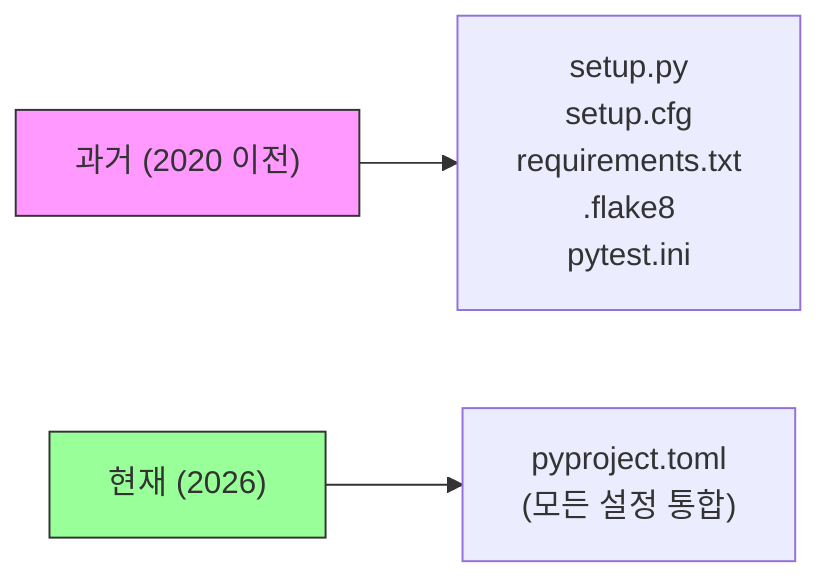
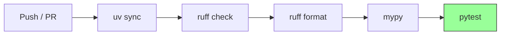

# 1. 들어가며

Python 프로젝트를 새로 시작할 때 어디서부터 설정해야 할지 막막한 경험이 있을 것이다. 과거에는 `setup.py`, `setup.cfg`, `requirements.txt`, `.flake8`, `pytest.ini` 등 여러 설정 파일을 각각 관리해야 했다.



2020년 PEP 621이 승인되면서 `pyproject.toml` 하나로 프로젝트 메타데이터, 빌드 설정, 도구 설정을 모두 통합할 수 있게 되었다. 여기에 Rust 기반의 빠른 패키지 매니저 **uv**, 올인원 린터/포매터 **ruff**까지 등장하면서 Python 개발 환경은 크게 개선되었다.

이 글에서는 2026년 기준으로 Python 프로젝트를 처음부터 셋업하는 모범 사례를 정리한다. 디렉토리 구조 선택부터 CI 파이프라인까지, 실제 동작하는 템플릿 프로젝트를 함께 구성해본다.

> 전체 샘플 코드는 [GitHub - tutorials-python/python/project-template](https://github.com/kenshin579/tutorials-python/tree/master/python/project-template)에서 확인할 수 있다.

# 2. 프로젝트 구조 & 초기화

## 2.1 디렉토리 구조 컨벤션 (src layout vs flat layout)

Python 프로젝트의 디렉토리 구조는 크게 **src layout**과 **flat layout** 두 가지가 있다.

**src layout:**

```
project-root/
├── pyproject.toml
├── src/
│   └── myapp/
│       ├── __init__.py
│       └── main.py
└── tests/
    └── test_main.py
```

**flat layout:**

```
project-root/
├── pyproject.toml
├── myapp/
│   ├── __init__.py
│   └── main.py
└── tests/
    └── test_main.py
```

두 방식의 차이점은 다음과 같다.

| 항목 | src layout | flat layout |
|------|-----------|-------------|
| 구조 | `src/패키지명/` | `패키지명/` |
| import 충돌 | 방지됨 (설치된 패키지만 import) | 로컬 디렉토리가 우선될 수 있음 |
| 테스트 격리 | 설치 후 테스트 (실제 배포 환경과 동일) | 소스 직접 참조 가능 |
| 적합한 규모 | 라이브러리 배포, 중대형 프로젝트 | 스크립트, 소규모 프로젝트 |

**선택 기준**: 라이브러리로 배포하거나 팀 프로젝트라면 **src layout**을 추천한다. import 충돌을 원천 차단하고, 설치된 상태에서 테스트하므로 배포 후 문제를 미리 발견할 수 있다. 이 글의 샘플 프로젝트도 src layout을 사용한다.

## 2.2 pyproject.toml 구조와 각 섹션 설명

`pyproject.toml`은 **PEP 621** 표준을 따르는 프로젝트 메타데이터 파일이다. 주요 섹션을 살펴보자.

### 2.2.1 [project] 섹션

프로젝트의 기본 정보를 정의한다.

```toml
[project]
name = "myapp"
version = "0.1.0"
description = "Python 프로젝트 템플릿 예제"
readme = "README.md"
requires-python = ">=3.12"
dependencies = [
    "python-dotenv>=1.0",
]
```

주요 필드:
- `name`: 패키지 이름 (PyPI 등록 시 사용)
- `version`: 시맨틱 버저닝 (MAJOR.MINOR.PATCH)
- `requires-python`: 지원하는 Python 버전 범위
- `dependencies`: 런타임 의존성 목록

### 2.2.2 [dependency-groups] 섹션

개발 전용 의존성을 그룹으로 분리한다. PEP 735에서 표준화된 방식이다.

```toml
[dependency-groups]
dev = [
    "pytest>=8.0",
    "ruff>=0.9",
    "mypy>=1.14",
    "pre-commit>=4.0",
]
```

`uv sync`를 실행하면 `dev` 그룹을 포함한 모든 의존성이 설치되고, `uv sync --no-group dev`로 개발 의존성을 제외할 수 있다.

### 2.2.3 [build-system] 섹션

빌드 백엔드를 지정한다.

```toml
[build-system]
requires = ["hatchling"]
build-backend = "hatchling.build"
```

주요 빌드 백엔드 비교:

| 항목 | hatchling | setuptools | flit |
|------|-----------|------------|------|
| 설정 복잡도 | 낮음 | 중간 | 매우 낮음 |
| 기능 범위 | 넓음 | 매우 넓음 | 최소 |
| C 확장 지원 | 플러그인 | 기본 지원 | 미지원 |
| 추천 상황 | 기본 추천 | 레거시/복잡한 빌드 | 순수 Python 패키지 |

특별한 이유가 없다면 **hatchling**을 기본으로 사용하는 것을 추천한다. uv에서도 기본 빌드 백엔드로 사용한다.

### 2.2.4 [tool.*] 섹션

각 도구의 설정을 `[tool.도구명]` 형태로 통합한다.

```toml
[tool.ruff]
target-version = "py312"
line-length = 120

[tool.pytest.ini_options]
testpaths = ["tests"]
addopts = "-v --tb=short"

[tool.mypy]
python_version = "3.12"
strict = true
```

과거에는 `.flake8`, `pytest.ini`, `mypy.ini` 등 별도 파일이 필요했지만, 이제 `pyproject.toml` 하나로 모두 관리할 수 있다.

## 2.3 uv 또는 poetry로 프로젝트 초기화

### 2.3.1 uv vs poetry 비교

| 작업 | uv | poetry |
|------|-----|--------|
| 프로젝트 초기화 | `uv init` | `poetry init` |
| 라이브러리 초기화 | `uv init --lib` | - |
| 패키지 설치 | `uv add requests` | `poetry add requests` |
| dev 의존성 추가 | `uv add --group dev pytest` | `poetry add --group dev pytest` |
| lock 파일 | `uv.lock` (자동) | `poetry.lock` (자동) |
| 가상환경 생성 | `.venv/` (자동) | `.venv/` (자동) |
| 실행 | `uv run python main.py` | `poetry run python main.py` |

**uv를 추천하는 이유**:
- Rust 기반으로 poetry 대비 **10~100배** 빠른 의존성 해석/설치
- `uv.lock`이 크로스 플랫폼 호환 (Linux/macOS/Windows 동일 lock 파일)
- pip, virtualenv, pyenv 기능을 하나로 통합

### 2.3.2 uv로 프로젝트 초기화

```bash
# src layout 라이브러리 프로젝트 생성
uv init --lib --name myapp
```

이 명령어를 실행하면 `pyproject.toml`, `src/myapp/__init__.py`, `.python-version`, `README.md`가 자동 생성된다.

의존성을 추가해보자.

```bash
# 런타임 의존성 추가
uv add python-dotenv

# 개발 의존성 추가 (dev 그룹)
uv add --group dev pytest ruff mypy pre-commit
```

의존성 설치와 가상환경 생성은 자동으로 처리된다.

```bash
# 의존성 설치 (uv.lock 기반)
uv sync

# lock 파일 갱신 없이 설치 (CI 환경)
uv sync --frozen
```

### 2.3.3 lock 파일 관리

`uv.lock`은 모든 의존성의 정확한 버전을 기록하는 파일이다. **반드시 Git에 커밋**해야 한다. 이를 통해 팀원 모두가 동일한 의존성 버전을 사용할 수 있다.

```bash
# lock 파일 기반으로 설치 (CI에서 사용)
uv sync --frozen

# 의존성 업데이트 후 lock 갱신
uv lock --upgrade
```

# 3. 코드 품질 & 개발 환경

## 3.1 ruff (린터/포매터) 설정

[ruff](https://docs.astral.sh/ruff/)는 Rust로 작성된 초고속 Python 린터/포매터다. flake8, isort, black 등 여러 도구를 하나로 대체한다.

### 3.1.1 pyproject.toml 설정

```toml
[tool.ruff]
target-version = "py312"
line-length = 120

[tool.ruff.lint]
select = ["E", "F", "I", "UP", "B", "SIM"]

[tool.ruff.lint.isort]
known-first-party = ["myapp"]
```

### 3.1.2 rule 선택 가이드

| 카테고리 | 설명 | 예시 |
|---------|------|------|
| **E** | pycodestyle 에러 | 들여쓰기, 공백 오류 |
| **F** | Pyflakes | 미사용 import, 미정의 변수 |
| **I** | isort | import 정렬 (isort 대체) |
| **UP** | pyupgrade | 최신 Python 문법으로 변환 |
| **B** | flake8-bugbear | 흔한 버그 패턴 감지 |
| **SIM** | flake8-simplify | 코드 간결화 제안 |

위 6개 카테고리가 대부분의 프로젝트에 적합한 기본 세트다. 필요에 따라 `"N"` (네이밍), `"S"` (보안), `"PT"` (pytest 스타일) 등을 추가할 수 있다.

### 3.1.3 기본 사용법

```bash
# 린트 검사
uv run ruff check .

# 자동 수정 가능한 문제 수정
uv run ruff check --fix .

# 포맷 검사
uv run ruff format --check .

# 포맷 적용
uv run ruff format .
```

`ruff check`는 코드 품질 규칙을 검사하고, `ruff format`은 black과 호환되는 코드 스타일을 적용한다. `--fix` 옵션을 사용하면 안전하게 자동 수정할 수 있는 문제를 바로 고쳐준다.

## 3.2 테스트 환경 구성

pytest 설정은 `pyproject.toml`에서 `[tool.pytest.ini_options]` 섹션으로 관리한다.

```toml
[tool.pytest.ini_options]
testpaths = ["tests"]
addopts = "-v --tb=short"
```

- `testpaths`: 테스트 파일을 찾을 디렉토리
- `addopts`: pytest 실행 시 기본 옵션 (`-v` verbose, `--tb=short` 간결한 트레이스백)

테스트 디렉토리 구조는 다음과 같이 구성한다.

```
tests/
├── __init__.py
└── test_main.py
```

간단한 테스트 예시:

```python
from myapp.main import greet


def test_greet() -> None:
    result = greet("Python")
    assert "Hello, Python!" in result
```

```bash
# 테스트 실행
uv run pytest
```

> pytest의 상세한 사용법 (fixture, parametrize, mock 등)은 별도의 pytest 입문 편에서 다룰 예정이다.

## 3.3 환경변수 관리 (.env, python-dotenv)

API 키, 데이터베이스 URL 같은 설정값은 코드에 직접 넣지 않고 환경변수로 관리한다.

### 3.3.1 .env 파일과 .env.example

`.env` 파일에 실제 환경변수 값을 저장하고, `.env.example`에 템플릿을 작성한다.

```bash
# .env.example (Git에 커밋)
APP_NAME=myapp
DEBUG=false
```

```bash
# .env (Git에 커밋하지 않음!)
APP_NAME=my-production-app
DEBUG=true
```

### 3.3.2 python-dotenv 사용법

```python
import os

from dotenv import load_dotenv

load_dotenv()  # .env 파일의 변수를 os.environ에 로드

APP_NAME: str = os.getenv("APP_NAME", "myapp")
DEBUG: bool = os.getenv("DEBUG", "false").lower() == "true"
```

`load_dotenv()`를 호출하면 `.env` 파일의 내용이 `os.environ`에 자동으로 로드된다.

### 3.3.3 .gitignore 필수 설정

`.env` 파일에는 민감한 정보가 포함될 수 있으므로 **반드시** `.gitignore`에 등록해야 한다.

```gitignore
.env
__pycache__/
*.pyc
.venv/
dist/
*.egg-info/
.mypy_cache/
.pytest_cache/
.ruff_cache/
```

# 4. 자동화 파이프라인

## 4.1 pre-commit 훅 구성

[pre-commit](https://pre-commit.com/)은 `git commit` 전에 자동으로 코드 검사를 실행하는 도구다. 린트 오류나 포맷 문제가 있는 코드가 커밋되는 것을 방지한다.

### 4.1.1 .pre-commit-config.yaml 작성

```yaml
repos:
  - repo: https://github.com/pre-commit/pre-commit-hooks
    rev: v5.0.0
    hooks:
      - id: trailing-whitespace
      - id: end-of-file-fixer
      - id: check-yaml

  - repo: https://github.com/astral-sh/ruff-pre-commit
    rev: v0.9.7
    hooks:
      - id: ruff
        args: [--fix]
      - id: ruff-format
```

등록된 훅:
- **trailing-whitespace**: 줄 끝 공백 제거
- **end-of-file-fixer**: 파일 끝 개행 추가
- **check-yaml**: YAML 문법 검사
- **ruff**: 린트 검사 + 자동 수정
- **ruff-format**: 코드 포매팅

### 4.1.2 설치 및 실행

```bash
# Git 훅 설치 (프로젝트 클론 후 1회 실행)
uv run pre-commit install

# 전체 파일에 대해 수동 실행
uv run pre-commit run --all-files
```

`pre-commit install`을 실행하면 `.git/hooks/pre-commit`이 생성된다. 이후 `git commit`을 할 때마다 자동으로 훅이 실행된다.

## 4.2 GitHub Actions CI 파이프라인

코드가 푸시되면 자동으로 린트, 타입 체크, 테스트를 실행하는 CI 파이프라인을 구성한다.



### 4.2.1 CI 워크플로우 YAML

```yaml
# .github/workflows/ci.yml
name: CI

on:
  push:
    branches: [master]
  pull_request:

jobs:
  check:
    runs-on: ubuntu-latest
    steps:
      - uses: actions/checkout@v4
      - uses: astral-sh/setup-uv@v5
        with:
          enable-cache: true
      - run: uv sync --frozen
      - run: uv run ruff check .
      - run: uv run ruff format --check .
      - run: uv run mypy src/
      - run: uv run pytest
```

핵심 포인트:
- **astral-sh/setup-uv@v5**: uv 공식 GitHub Action
- **enable-cache: true**: `.uv/cache`를 GitHub Actions 캐시로 저장하여 빌드 속도 최적화
- **uv sync --frozen**: lock 파일 변경 없이 정확한 버전으로 설치 (CI에서 필수)
- **단계별 실행**: 린트 → 포맷 → 타입체크 → 테스트 순서로 빠른 실패를 우선

# 5. 마무리

이 글에서 다룬 Python 프로젝트 셋업의 핵심을 정리하면 다음과 같다.

- **디렉토리 구조**: src layout으로 import 충돌 방지
- **pyproject.toml**: PEP 621 표준으로 모든 설정을 하나의 파일에 통합
- **패키지 매니저**: uv로 빠른 의존성 관리
- **린터/포매터**: ruff로 코드 품질 유지
- **테스트**: pytest로 테스트 환경 구성
- **환경변수**: python-dotenv로 안전한 설정 관리
- **자동화**: pre-commit + GitHub Actions CI로 코드 품질 자동 검증

이 설정들을 적용한 전체 샘플 프로젝트는 아래 GitHub 저장소에서 확인할 수 있다.

- [GitHub - tutorials-python/python/project-template](https://github.com/kenshin579/tutorials-python/tree/master/python/project-template)

# 6. 참고

- [Python Packaging User Guide](https://packaging.python.org/en/latest/)
- [PEP 621 – Storing project metadata in pyproject.toml](https://peps.python.org/pep-0621/)
- [PEP 735 – Dependency Groups in pyproject.toml](https://peps.python.org/pep-0735/)
- [uv 공식 문서](https://docs.astral.sh/uv/)
- [ruff 공식 문서](https://docs.astral.sh/ruff/)
- [pre-commit 공식 문서](https://pre-commit.com/)
- [pytest 공식 문서](https://docs.pytest.org/)
- [python-dotenv](https://github.com/theskumar/python-dotenv)
