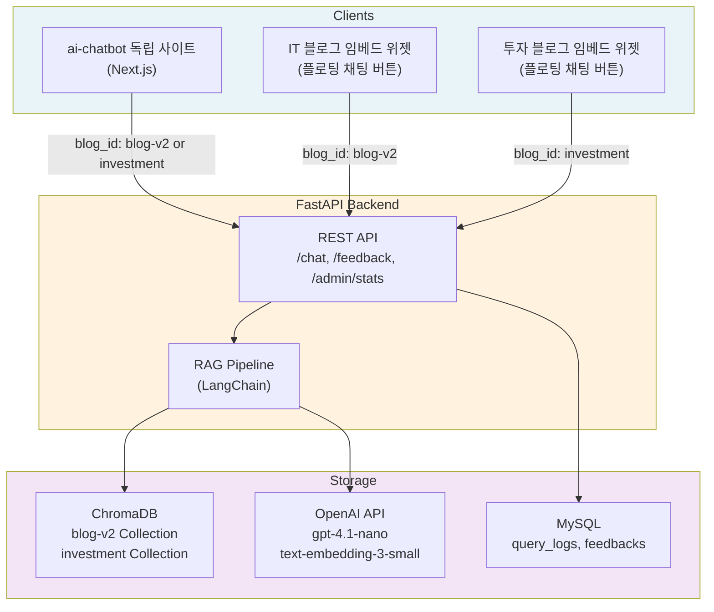
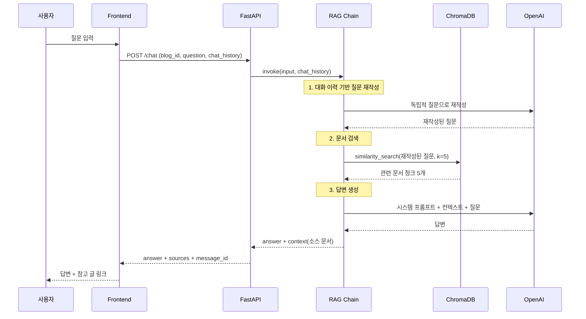
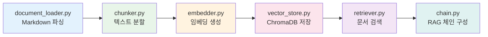
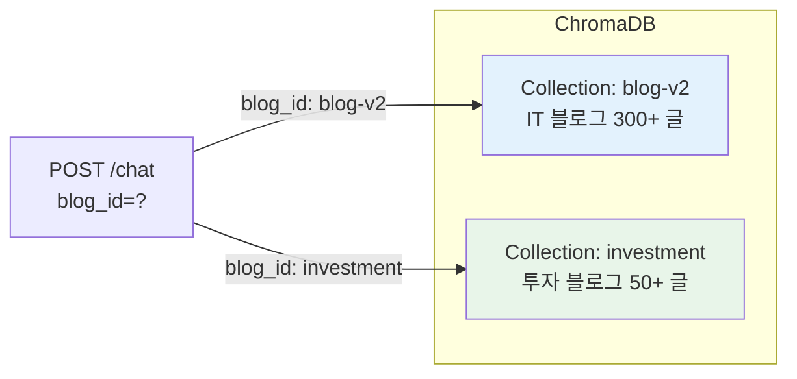
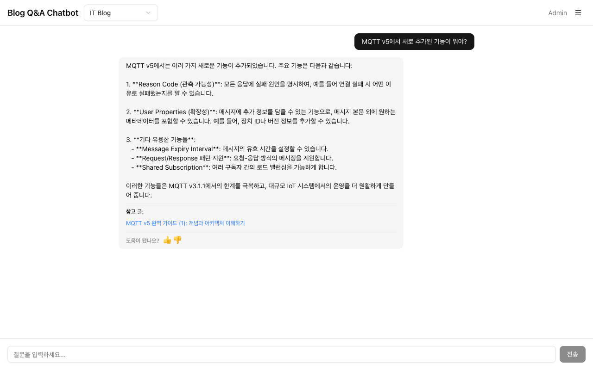
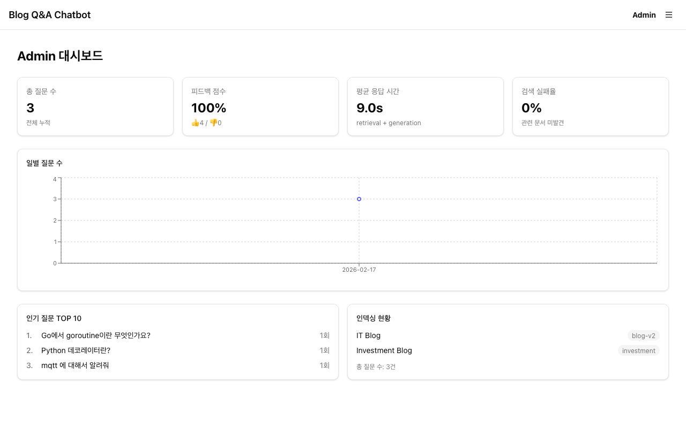
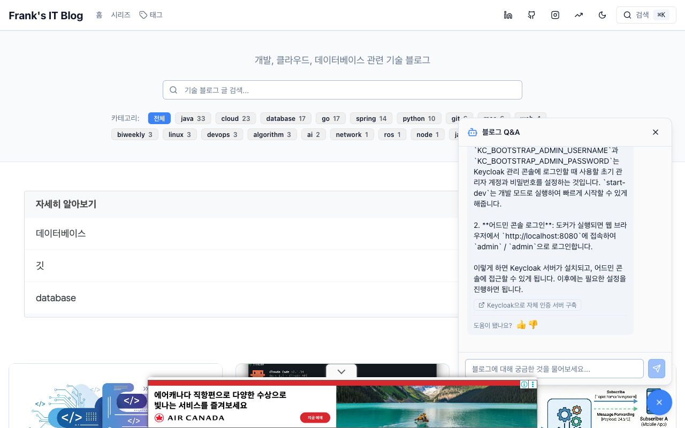
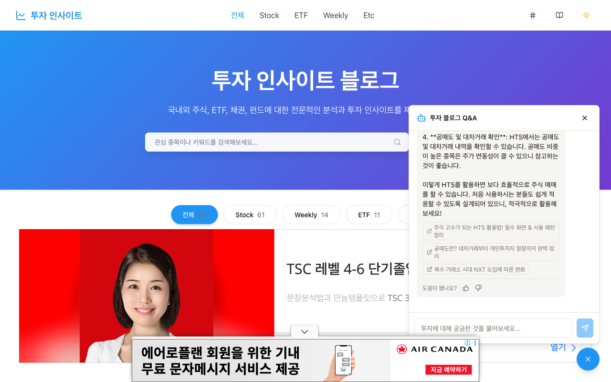

---
span
---
> 이 글은 **RAG 기반 블로그 Q&A 챗봇 만들기** 시리즈의 세 번째 편이다. 편 1~2에서 다룬 RAG 이론을 실제 토이 프로젝트에 적용한 과정을 정리한다.
>
> - **편 1**: [LLM 적응 기법과 RAG 개념](../rag-기반-블로그-qa-챗봇-만들기-1-llm-적응-기법과-rag-개념)
> - **편 2**: [프롬프트 엔지니어링과 RAG 최적화](../rag-기반-블로그-qa-챗봇-만들기-2-프롬프트-엔지니어링과-rag-최적화)
> - **편 3** (이 글): 토이 프로젝트: AI-Chat 구현기

> 전체 소스 코드는 [ai-chatbot.advenoh.pe.kr](https://github.com/kenshin579/ai-chatbot.advenoh.pe.kr)를 참조한다.

---

# 1. 프로젝트 소개

RAG 기반 스터디를 진행하면서, 단순한 예제에 머무르지 않고 의미 있는 프로젝트로 확장해보고 싶었다. 블로그 글이 300개 이상 쌓이면서 원하는 글을 찾기 어려워진 문제가 있었는데, 기존 블로그에 **Q&A 챗봇 위젯** 형태로 구현하면 RAG 학습과 실용성을 동시에 잡을 수 있겠다고 판단했다. 그래서 IT 블로그와 투자 블로그 두 곳에 플로팅 채팅 버튼으로 챗봇을 내장하고, 별도의 독립 사이트([ai-chatbot.advenoh.pe.kr](https://ai-chatbot.advenoh.pe.kr))도 함께 만들었다.

## 1.1 기술 스택


| 구분            | 기술                                                      |
| --------------- | --------------------------------------------------------- |
| **Frontend**    | Next.js 16, React 19, shadcn/ui, Tailwind CSS 4, recharts |
| **Backend**     | FastAPI, LangChain, OpenAI (gpt-4.1-nano), Python 3.12+   |
| **Vector DB**   | ChromaDB (HttpClient, blog_id별 Collection 분리)          |
| **Database**    | MySQL (쿼리 로그, 피드백 저장) + SQLAlchemy (async)       |
| **패키지 관리** | npm (frontend), uv (backend)                              |

---

# 2. 전체 아키텍처

## 2.1 시스템 구성도

이 프로젝트는 **3가지 클라이언트**가 하나의 Backend를 공유하는 구조다.



핵심은 **blog_id 하나로 어떤 블로그의 콘텐츠를 검색할지 결정**한다는 점이다. 독립 사이트는 사용자가 블로그를 선택할 수 있고, 임베드 위젯은 각 블로그에 맞게 blog_id가 고정되어 있다.

## 2.2 프로젝트 디렉토리 구조

```
ai-chatbot.advenoh.pe.kr/
├── frontend/                # Next.js 16 독립 사이트
│   ├── src/
│   │   ├── app/            # App Router (page.tsx, admin/page.tsx)
│   │   ├── components/     # ChatWindow, MessageList, ChatInput, admin/
│   │   └── lib/            # api.ts, BlogContext.tsx
│   └── Dockerfile
│
├── backend/                 # FastAPI RAG 서버
│   ├── app/
│   │   ├── api/            # routes.py, models.py
│   │   ├── rag/            # document_loader → chunker → embedder → vector_store → retriever → chain
│   │   ├── db/             # SQLAlchemy models, repository
│   │   └── prompts/        # 시스템 프롬프트 템플릿
│   ├── scripts/            # 인덱싱, 평가 스크립트
│   └── Dockerfile
│
└── Makefile                 # run-all, index, test, lint
```

## 2.3 데이터 흐름

사용자가 질문을 입력하면 다음 순서로 처리된다.



---

# 3. Backend 구현 (FastAPI + LangChain)

## 3.1 RAG 파이프라인 - 프로젝트 적용 포인트

편 1에서 다룬 RAG 파이프라인의 각 단계(문서 로드 → 청킹 → 임베딩 → 인덱싱 → 검색 → 생성)를 이 프로젝트에서는 다음과 같이 모듈로 분리했다.



각 단계의 이론적 배경은 [편 1](../rag-기반-블로그-qa-챗봇-만들기-1-llm-적응-기법과-rag-개념)을 참조하고, 여기서는 **이 프로젝트에서의 구현 결정**에 집중한다.

### 3.1.1 블로그 마크다운 특화 처리

일반 텍스트 문서와 달리, 블로그 마크다운은 **YAML frontmatter**에 메타데이터가 포함되어 있다. `document_loader.py`에서 이를 파싱하여 LangChain `Document`의 metadata로 분리한다.

```python
# backend/app/rag/document_loader.py

def parse_frontmatter(content: str) -> tuple[dict, str]:
    """YAML frontmatter를 파싱하여 metadata와 본문을 분리한다."""
    pattern = r"^---\s*\n(.*?)\n---\s*\n(.*)$"
    match = re.match(pattern, content, re.DOTALL)
    if not match:
        return {}, content
    metadata = yaml.safe_load(match.group(1)) or {}
    body = match.group(2)
    return metadata, body
```

로드 시 각 블로그 글의 URL도 자동 생성한다. 디렉토리 구조(`contents/go/go에서의-열거형/index.md`)에서 slug를 추출하고, blog_id에 따라 도메인을 결정한다.

```python
# backend/app/rag/document_loader.py

def build_post_url(relative_path: str, blog_id: str) -> str:
    base_urls = {
        "blog-v2": "https://blog.advenoh.pe.kr",
        "investment": "https://investment.advenoh.pe.kr",
    }
    base_url = base_urls.get(blog_id, "")
    path = Path(relative_path)
    slug = path.parent.name
    return f"{base_url}/{slug}" if slug and slug != "." else base_url
```

이렇게 생성된 URL은 챗봇 답변의 **"참고 글"** 링크로 사용된다. 사용자가 답변을 보고 원본 블로그 글로 바로 이동할 수 있다.

### 3.1.2 설정값 결정 과정

청킹과 검색의 핵심 설정값은 `config.py`에서 관리한다.

```python
# backend/app/config.py

class Settings(BaseSettings):
    chunk_size: int = 1000
    chunk_overlap: int = 200
    top_k: int = 5
    use_hybrid_search: bool = False
```

**chunk_size=1000, chunk_overlap=200을 선택한 이유:**

블로그 글은 평균 3,000~8,000자 정도다. chunk_size를 너무 크게 잡으면(예: 2000) 하나의 청크에 여러 주제가 섞여 검색 정확도가 떨어졌고, 너무 작게 잡으면(예: 500) 맥락이 끊겨 답변 품질이 낮아졌다. 1000자는 대략 하나의 섹션(H2~H3 단위)에 해당하여 적절한 균형점이었다.

청킹 시 **마크다운 구조를 인식하는 separators**를 사용한다. `\n## `(H2), `\n### `(H3) 등 헤딩 단위로 우선 분리하고, 그래도 chunk_size를 넘으면 빈 줄 → 줄바꿈 → 공백 순으로 분할한다.

```python
# backend/app/rag/chunker.py

def create_text_splitter(chunk_size: int = 1000, chunk_overlap: int = 200):
    return RecursiveCharacterTextSplitter(
        chunk_size=chunk_size,
        chunk_overlap=chunk_overlap,
        separators=[
            "\n## ",   # H2
            "\n### ",  # H3
            "\n#### ", # H4
            "\n\n",    # 빈 줄
            "\n",      # 줄바꿈
            " ",       # 공백
        ],
    )
```

**top_k=5:**

검색 결과 수는 5개로 설정했다. 3개로 줄이면 정보가 부족한 경우가 있었고, 10개로 늘리면 컨텍스트가 길어져 답변이 산만해졌다. 5개가 비용과 품질의 균형점이었다.

**Hybrid Search:**

`USE_HYBRID_SEARCH` 환경변수로 BM25 키워드 검색과 시맨틱 검색을 결합하는 Hybrid Search를 선택적으로 활성화할 수 있다([편 2 참조](../rag-기반-블로그-qa-챗봇-만들기-2-프롬프트-엔지니어링과-rag-최적화)). 현재는 시맨틱 검색만으로도 충분한 품질을 보여 기본값은 `False`로 두었다.

### 3.1.3 대화 이력 기반 질문 재구성

편 1~2에서 다루지 않은 내용 중 하나가 **멀티턴 대화 지원**이다. 사용자가 이전 답변에 이어서 질문할 때, "그거 말고 다른 건?" 같은 질문은 이전 맥락 없이는 의미가 없다.

이를 해결하기 위해 `chain.py`에서 **History-Aware Retriever**를 사용한다. 사용자의 후속 질문을 대화 히스토리를 참고하여 독립적인 질문으로 재작성한 뒤 검색에 사용한다.

```python
# backend/app/rag/chain.py

def create_rag_chain(vector_store, model, top_k=5, retriever=None):
    llm = ChatOpenAI(model=model, temperature=0)

    if retriever is None:
        retriever = vector_store.as_retriever(search_kwargs={"k": top_k})

    # 대화 히스토리를 고려한 질문 재작성 체인
    contextualize_prompt = ChatPromptTemplate.from_messages([
        ("system", "대화 히스토리와 최신 사용자 질문을 고려하여, "
         "대화 히스토리 없이도 이해할 수 있는 독립적인 질문으로 재작성하세요. "
         "질문을 답변하지 마세요. 재작성이 필요 없으면 그대로 반환하세요."),
        MessagesPlaceholder("chat_history"),
        ("human", "{input}"),
    ])
    history_aware_retriever = create_history_aware_retriever(
        llm, retriever, contextualize_prompt
    )

    # QA 체인
    qa_prompt = ChatPromptTemplate.from_messages([
        ("system", SYSTEM_PROMPT),
        MessagesPlaceholder("chat_history"),
        ("human", "{input}"),
    ])
    question_answer_chain = create_stuff_documents_chain(llm, qa_prompt)

    return create_retrieval_chain(history_aware_retriever, question_answer_chain)
```

실제 동작 예시:


| 턴  | 사용자 질문                | 재작성된 질문                            |
| --- | -------------------------- | ---------------------------------------- |
| 1턴 | "Go에서 goroutine이 뭐야?" | "Go에서 goroutine이 뭐야?" (그대로)      |
| 2턴 | "channel은?"               | "Go에서 channel이 뭐야?" (맥락 반영)     |
| 3턴 | "둘의 차이점은?"           | "Go에서 goroutine과 channel의 차이점은?" |

이 재작성 단계 덕분에 후속 질문에서도 올바른 문서를 검색할 수 있다.

RAG 체인의 QA 단계에서 사용하는 시스템 프롬프트는 블로그 Q&A에 특화된 규칙을 포함한다.

```python
# backend/app/prompts/templates.py

SYSTEM_PROMPT = """당신은 블로그 콘텐츠 기반 Q&A 어시스턴트입니다.
사용자의 질문에 대해 아래 컨텍스트를 참고하여 **자신의 말로 요약하고 설명**합니다.

## 답변 스타일

- **대화형 답변**: 질문자에게 설명하듯 자연스러운 말투로 답변하세요.
- **자기 말로 재구성**: 컨텍스트 내용을 자신의 말로 소화하여 전달하세요.
- **질문 중심**: 컨텍스트 전체를 나열하지 말고, 핵심만 선별하여 답변하세요.

## 답변 규칙

1. **근거 기반**: 반드시 컨텍스트에 포함된 내용을 근거로 답변하세요.
2. **정보 없음 처리**: 관련 내용이 없으면 "블로그에서 관련 내용을 찾지 못했습니다."라고 답변하세요.
3. **코드는 선별적**: 핵심을 설명하는 데 필요한 코드만 포함하세요.
4. **한국어 답변**: 항상 한국어로 답변하세요.
5. **간결함**: 핵심을 중심으로 간결하게 답변하세요.

## 컨텍스트

{context}"""
```

"자기 말로 재구성"과 "질문 중심" 규칙이 중요하다. 이 규칙이 없으면 LLM이 검색된 블로그 원문을 통째로 복사하여 답변하는 경향이 있었다.

## 3.2 멀티블로그 지원

이 프로젝트의 특징 중 하나는 **하나의 Backend로 여러 블로그를 동시에 지원**한다는 점이다. 설계의 핵심은 blog_id로 ChromaDB Collection을 분리하는 것이다.

```python
# backend/app/config.py

class Settings(BaseSettings):
    blog_collections: dict[str, str] = {
        "blog-v2": "IT 블로그",
        "investment": "투자 블로그",
    }
```

`VectorStoreManager`가 blog_id를 받아 해당 Collection에 접근한다.

```python
# backend/app/rag/vector_store.py

class VectorStoreManager:
    def get_store(self, blog_id: str) -> Chroma:
        """blog_id에 해당하는 Collection을 Chroma wrapper로 반환한다."""
        return Chroma(
            client=self.client,
            collection_name=blog_id,
            embedding_function=self.embeddings,
        )

    def index_documents(self, blog_id: str, documents: list[Document]) -> int:
        store = self.get_store(blog_id)
        store.add_documents(documents)
        return len(documents)
```



새 블로그를 추가하려면 `blog_collections`에 항목을 추가하고, 해당 블로그의 contents 디렉토리 경로만 `routes.py`의 `contents_dirs`에 등록하면 된다.

## 3.3 API 설계

FastAPI로 5개의 엔드포인트를 제공한다.


| 메서드 | 경로               | 설명                           | 인증         |
| ------ | ------------------ | ------------------------------ | ------------ |
| POST   | `/chat`            | 질문 → RAG 답변 + 출처        | -            |
| POST   | `/index/{blog_id}` | 문서 재인덱싱                  | Bearer token |
| POST   | `/feedback`        | 사용자 피드백 (thumbs up/down) | -            |
| GET    | `/admin/stats`     | 대시보드 통계                  | -            |
| GET    | `/health`          | 헬스체크                       | -            |

`/chat` 엔드포인트의 핵심 흐름을 보면:

```python
# backend/app/api/routes.py

@router.post("/chat", response_model=ChatResponse)
async def chat(request: ChatRequest, settings=Depends(get_settings),
               manager=Depends(get_vector_store_manager)):
    start_time = time.time()
    message_id = str(uuid.uuid4())

    # 1. blog_id로 ChromaDB Collection 선택
    store = manager.get_store(request.blog_id)
    chain = create_rag_chain(store, settings.openai_model, settings.top_k)

    # 2. chat_history를 LangChain 메시지 형식으로 변환
    chat_history = []
    if request.chat_history:
        for msg in request.chat_history:
            if msg.role == "human":
                chat_history.append(HumanMessage(content=msg.content))
            else:
                chat_history.append(AIMessage(content=msg.content))

    # 3. RAG 체인 실행
    result = chain.invoke({"input": request.question, "chat_history": chat_history})

    # 4. 소스 문서에서 중복 제거하여 출처 생성
    seen_urls = set()
    sources = []
    for doc in result.get("context", []):
        url = doc.metadata.get("url", "")
        if url and url not in seen_urls:
            seen_urls.add(url)
            sources.append(Source(title=doc.metadata.get("title", ""), url=url))

    # 5. 쿼리 로그 저장
    response_time_ms = int((time.time() - start_time) * 1000)
    # ... MySQL에 query_log 저장 ...

    return ChatResponse(answer=result["answer"], sources=sources, message_id=message_id)
```

`message_id`(UUID)가 질문-답변-피드백을 연결하는 키 역할을 한다. 사용자가 답변에 thumbs up/down을 누르면 이 `message_id`와 함께 피드백이 저장된다.

## 3.4 데이터베이스 설계

모든 Q&A 상호작용을 MySQL에 기록한다. 두 개의 테이블로 구성된다.

```python
# backend/app/db/models.py

class QueryLog(Base):
    __tablename__ = "query_logs"

    id: Mapped[int] = mapped_column(BigInteger, primary_key=True)
    message_id: Mapped[str] = mapped_column(String(255))    # 질문-피드백 연결 키
    blog_id: Mapped[str] = mapped_column(String(100), index=True)
    question: Mapped[str] = mapped_column(Text)
    answer: Mapped[str] = mapped_column(Text)
    sources: Mapped[dict | None] = mapped_column(JSON)
    response_time_ms: Mapped[int | None] = mapped_column(Integer)
    has_results: Mapped[bool | None] = mapped_column(Boolean)  # 검색 실패 판별
    created_at: Mapped[datetime] = mapped_column(server_default=func.now(), index=True)


class Feedback(Base):
    __tablename__ = "feedbacks"

    id: Mapped[int] = mapped_column(BigInteger, primary_key=True)
    message_id: Mapped[str] = mapped_column(String(255), index=True)
    blog_id: Mapped[str] = mapped_column(String(100))
    question: Mapped[str] = mapped_column(Text)
    rating: Mapped[str] = mapped_column(String(10))  # "up" or "down"
    created_at: Mapped[datetime] = mapped_column(server_default=func.now(), index=True)
```

`has_results` 필드가 핵심이다. 검색 결과가 0건이면 `False`로 기록되어 **검색 실패율**을 추적할 수 있다. Admin 대시보드에서 이 지표를 모니터링하고, 실패율이 높으면 인덱싱 범위를 넓히거나 청킹 전략을 조정하는 데 활용한다.

DB 스키마 관리는 **Liquibase**를 사용한다. K8s 배포 시 pre-sync job으로 마이그레이션이 자동 실행된다.

---

# 4. Frontend 구현

## 4.1 독립 사이트 (ai-chatbot.advenoh.pe.kr)

독립 사이트([ai-chatbot.advenoh.pe.kr](https://ai-chatbot.advenoh.pe.kr))는 Next.js 16 + shadcn/ui로 구성된 전용 채팅 인터페이스다. 크게 **채팅 페이지**와 **Admin 대시보드** 두 화면으로 나뉜다.



컴포넌트 구조는 `page.tsx → ChatWindow → MessageList + ChatInput`으로 단순하게 유지했다. `ChatWindow`가 메시지 상태와 API 호출을 관리하는 컨테이너 역할을 하고, `BlogContext`로 IT 블로그와 투자 블로그를 전환할 수 있다.

### Admin 대시보드

`/admin` 페이지에서 챗봇 운영 현황을 한눈에 볼 수 있다. 4개의 핵심 지표를 표시한다.



- **총 질문 수**: 전체 누적 질문 수
- **피드백 점수**: thumbs up 비율 (%)
- **평균 응답 시간**: retrieval + generation 소요 시간
- **검색 실패율**: 관련 문서를 찾지 못한 비율

일별 질문 수 추이 차트(recharts)와 인기 질문 TOP 10도 제공한다.

## 4.2 블로그 임베드 채팅 위젯

독립 사이트와 별개로, 각 블로그에 직접 채팅 위젯을 내장했다. 블로그를 읽다가 바로 질문할 수 있어 컨텍스트 전환이 필요 없다.

| IT 블로그 채팅 위젯 | 투자 블로그 채팅 위젯 |
|---|---|
|  |  |

화면 우하단에 플로팅 채팅 버튼을 두고, 클릭하면 채팅 창이 열리는 구조다. 두 블로그의 위젯은 동일한 컴포넌트 구조를 사용하되, `chat-api.ts`에서 **blog_id만 다르게 고정**하여 각 블로그에 맞는 콘텐츠를 검색한다.

독립 사이트와 임베드 위젯 모두 답변 하단에 thumbs up/down 피드백 버튼을 제공한다. 피드백 데이터는 MySQL `feedbacks` 테이블에 저장되고, LangSmith가 설정되어 있으면 동시에 전송된다.

---

# 5. 운영 & 개선

## 5.1 실제 사용 데이터 분석

Admin 대시보드에서 수집한 데이터를 통해 챗봇의 실제 사용 패턴을 파악할 수 있다.

관찰한 패턴:

- 기술 용어 관련 질문 (예: "goroutine이 뭐야?", "Spring DI란?")이 가장 많다
- 특정 주제의 글 목록을 요청하는 질문도 빈번하다 (예: "Go 관련 글 알려줘")
- 멀티턴 대화는 평균 2~3턴 정도로 짧다

## 5.2 발견한 문제와 해결

프로젝트를 운영하면서 발견한 주요 이슈들:

**1. 코드블록 청킹 문제**

마크다운의 코드블록(````python ... ````)이 chunk 경계에서 잘리면, 불완전한 코드가 컨텍스트에 포함되어 답변 품질이 떨어졌다. 마크다운 헤딩 기반 separators(`\n## `, `\n### `)를 우선 사용함으로써 코드블록이 중간에 잘리는 빈도를 줄였다.

**2. "참고 글" 중복 문제**

top_k=5로 검색하면 같은 글의 다른 청크가 여러 개 반환되어 출처가 중복 표시되었다. `seen_urls` set으로 URL 기준 중복을 제거하여 해결했다.

**3. 원문 복사 답변**

초기에는 LLM이 검색된 블로그 원문을 거의 그대로 복사하여 답변하는 경향이 있었다. 시스템 프롬프트에 "자기 말로 재구성", "질문 중심" 규칙을 추가하여 개선했다.

---

# 6. 마무리

이 글에서는 RAG 스터디에서 출발하여 블로그 Q&A 챗봇을 실제 서비스로 구현한 과정을 정리했다. blog_id 기반 멀티블로그 아키텍처, 마크다운 특화 청킹, 대화 이력 기반 질문 재구성 등 프로젝트에서 내린 구현 결정들을 중심으로 다루었다. 직접 운영하면서 느낀 점은, RAG 파이프라인 자체보다 **청킹 전략, 프롬프트 설계, 피드백 루프** 같은 세부 조정이 답변 품질을 결정한다는 것이다.

---

# 7. 참고

- [ai-chatbot.advenoh.pe.kr GitHub](https://github.com/kenshin579/ai-chatbot.advenoh.pe.kr)
- [LangChain Documentation](https://python.langchain.com/)
- [ChromaDB Documentation](https://docs.trychroma.com/)
- [FastAPI Documentation](https://fastapi.tiangolo.com/)
- [Next.js Documentation](https://nextjs.org/docs)
- [shadcn/ui Documentation](https://ui.shadcn.com/)
