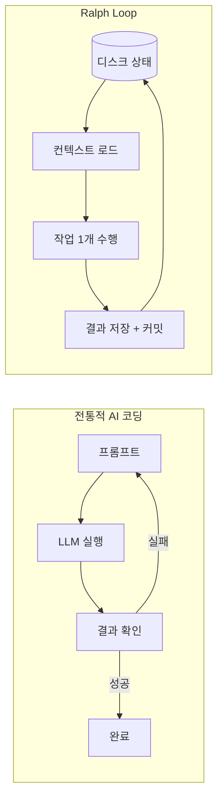
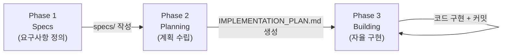
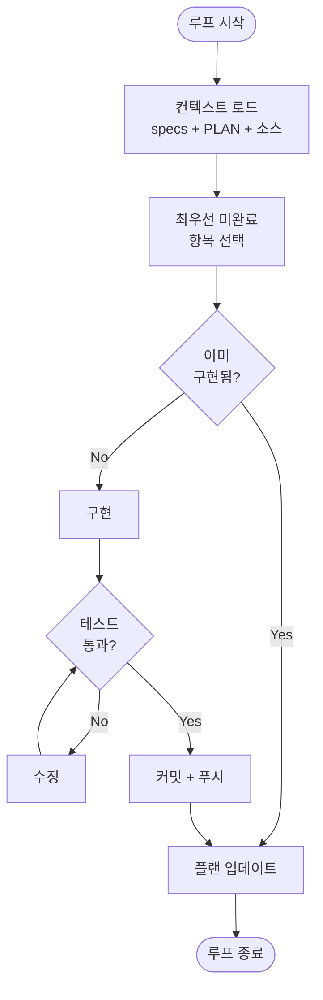
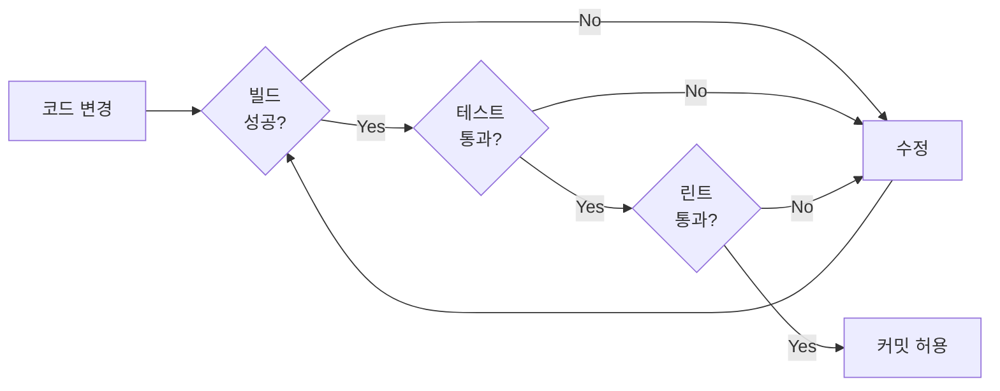

# Ralph Loop 완벽 가이드 - AI 에이전트 자율 개발 패턴

## 1. Ralph Loop란?

### 1.1 탄생 배경

Ralph Loop는 호주 개발자 Geoffrey Huntley가 2025년 말 고안한 AI 개발 방법론이다. 그는 CURSED라는 난해한 프로그래밍 언어를 만들면서, AI 코딩 에이전트를 반복 실행하면 자율적으로 소프트웨어를 완성할 수 있다는 것을 발견했다.

이 기법의 이름은 심슨 가족의 캐릭터 **Ralph Wiggum**에서 따왔다. Ralph Wiggum은 실패해도 끈질기게 반복하는 캐릭터인데, AI 에이전트가 루프를 돌며 반복적으로 작업을 시도하는 모습이 이와 닮았다.

2025년 말 바이럴을 타며 주목받기 시작했고, 2026년 현재 가장 널리 사용되는 에이전틱 코딩 패턴 중 하나로 자리잡았다. Anthropic은 Claude Code 공식 [Ralph Wiggum 플러그인](https://github.com/anthropics/claude-code/blob/main/plugins/ralph-wiggum/README.md)을 출시했고, 다양한 구현체들이 등장하고 있다.

### 1.2 핵심 아이디어

Ralph Loop의 핵심은 단 한 줄로 요약된다:

> **"상태는 디스크에, 컨텍스트는 매번 새로"**

LLM의 컨텍스트 윈도우는 무한하지 않다. 연구에 따르면 컨텍스트의 60~70%를 넘기면 성능이 눈에 띄게 저하된다. Ralph Loop는 이 문제를 매 반복마다 **새로운 컨텍스트 윈도우**를 할당하여 해결한다.

진행 상태는 LLM의 메모리가 아닌 **파일 시스템과 git 히스토리**에 저장된다. 각 반복은:

1. 새 컨텍스트에서 시작
2. 디스크에서 현재 상태를 읽고
3. 하나의 작업을 수행한 뒤
4. 결과를 디스크에 기록하고 종료

이 반복을 통해 **결국 일관성(Eventual Consistency)**을 달성한다.

### 1.3 Ralph Loop vs 전통적 AI 코딩

| 항목 | 전통적 AI 코딩 | Ralph Loop |
|------|---------------|------------|
| 실행 방식 | 일회성 프롬프트 | 무한 반복 루프 |
| 컨텍스트 | 누적 (점점 저하) | 매번 초기화 (항상 최적) |
| 상태 관리 | LLM 메모리 의존 | 파일 시스템 + git |
| 작업 범위 | 한번에 많은 것 시도 | 루프당 하나의 작업 |
| 실패 처리 | 수동 재시도 | 자동 반복으로 자가 수정 |
| 인간 역할 | 프롬프트 작성자 | 루프 관찰자/엔지니어 |



## 2. 핵심 구조: Loop의 해부학

### 2.1 기본 루프 스크립트

Ralph Loop의 가장 단순한 형태는 놀랍도록 간단하다:

```bash
while :; do cat PROMPT.md | claude-code ; done
```

이 한 줄이 전부다. 프롬프트 파일을 Claude Code에 반복적으로 먹이는 무한 루프.

실전에서는 모드 선택, 반복 횟수 제한, 자동 push 등을 추가한 확장 버전을 사용한다:

```bash
#!/bin/bash
# Usage: ./loop.sh [plan|build] [max_iterations]

set -euo pipefail

MODE="${1:-build}"
PROMPT_FILE="PROMPT_${MODE}.md"
MAX="${2:-0}"
BRANCH=$(git branch --show-current)
COUNT=0

# 프롬프트 파일 존재 여부 확인
if [ ! -f "$PROMPT_FILE" ]; then
  echo "Error: $PROMPT_FILE 파일이 없습니다."
  exit 1
fi

while true; do
  [ "$MAX" -gt 0 ] && [ "$COUNT" -ge "$MAX" ] && break

  cat "$PROMPT_FILE" | claude -p \
    --dangerously-skip-permissions \
    --output-format=stream-json \
    --model opus \
    --verbose

  git push origin "$BRANCH" 2>/dev/null || true
  COUNT=$((COUNT + 1))
done
```

주요 플래그:
- `-p`: 헤드리스(headless) 모드 — stdin 입력을 받아 비대화형으로 실행
- `--dangerously-skip-permissions`: 도구 호출 시 자동 승인 (샌드박스 필수!)
- `--output-format=stream-json`: 구조화된 로깅
- `--model opus`: 복잡한 추론에 적합 (단순 작업은 `sonnet`도 가능)

> 전체 코드: [tutorials-go/ai/ralph-loop/loop.sh](https://github.com/kenshin579/tutorials-go/tree/master/ai/ralph-loop/loop.sh)

### 2.2 프로젝트 디렉토리 구조

Ralph Loop 프로젝트의 표준 구조는 다음과 같다:

```
project-root/
├── loop.sh                    # Ralph Loop 실행 스크립트
├── PROMPT_plan.md             # Planning 모드 프롬프트
├── PROMPT_build.md            # Building 모드 프롬프트
├── AGENTS.md                  # 에이전트 운영 가이드 (매 루프마다 로드)
├── CLAUDE.md                  # Claude Code 설정
├── IMPLEMENTATION_PLAN.md     # 구현 계획 (Ralph가 생성/관리)
├── specs/                     # 요구사항 스펙 (1 파일 = 1 관심사)
│   ├── api-server.md
│   └── health-check.md
├── prd.json                   # PRD JSON (진행 상태 추적)
└── src/                       # 애플리케이션 소스 코드
```

각 파일의 역할:

| 파일 | 역할 | 누가 관리 |
|------|------|----------|
| `loop.sh` | 루프 실행 | 인간 |
| `PROMPT_*.md` | 모드별 지시사항 | 인간 |
| `AGENTS.md` | 운영 지식 축적 | Ralph + 인간 |
| `CLAUDE.md` | 프로젝트 컨텍스트 | 인간 |
| `IMPLEMENTATION_PLAN.md` | 구현 계획 | Ralph |
| `specs/` | 요구사항 정의 | 인간 |
| `prd.json` | 진행 상태 | Ralph |

### 2.3 컨텍스트 관리 전략

Ralph Loop의 성능은 **컨텍스트 관리**에 달려 있다. 핵심 전략:

**결정론적 스택 할당**: 매 루프마다 동일한 파일을 로드하여 에이전트가 항상 알려진 상태에서 시작한다.

**스마트 존 유지**: 전체 컨텍스트의 40~60%를 추론에 사용할 수 있도록 입력을 절제한다.
- specs에 약 5,000 토큰 할당
- 프롬프트는 간결하게 (Markdown > JSON)

**비싼 작업은 서브에이전트로**: 메인 에이전트는 스케줄러 역할만 하고, 코드 읽기/테스트 실행 같은 비용이 큰 작업은 서브에이전트에 위임한다.

```
메인 에이전트 (스케줄러)
  ├─ 읽기용 서브에이전트 (병렬, 여러 개 가능)
  └─ 빌드/테스트용 서브에이전트 (1개만 → Backpressure)
```

## 3. 3단계 워크플로우

Ralph Loop는 3개의 단계로 구성된다:



### 3.1 Phase 1: 요구사항 정의 (Specs)

첫 번째 단계는 LLM과 대화하며 요구사항을 정의하는 것이다. **JTBD(Jobs to Be Done)** 기반으로 사용자 니즈를 분해하고, 각 관심사(Topic of Concern)별로 별도의 스펙 파일을 만든다.

**스코프 테스트**: "and 없이 한 문장으로 설명할 수 있는가?"

```markdown
<!-- ✅ 좋은 스펙: 단일 관심사 -->
# API Server
HTTP API 서버가 /api/hello 엔드포인트에서 JSON 응답을 반환한다.

<!-- ❌ 나쁜 스펙: 여러 관심사가 섞임 -->
# 전체 시스템
HTTP 서버, 데이터베이스 연동, 인증 시스템, 로깅, 모니터링을 모두 구현한다.
```

> 전체 예시: [tutorials-go/ai/ralph-loop/specs/](https://github.com/kenshin579/tutorials-go/tree/master/ai/ralph-loop/specs/)

### 3.2 Phase 2: 계획 (Planning)

Planning 모드에서는 `./loop.sh plan 3`으로 실행한다. PROMPT_plan.md가 에이전트에게 다음을 지시한다:

1. specs/의 모든 스펙 파일 분석
2. 현재 코드와 Gap Analysis 수행
3. IMPLEMENTATION_PLAN.md 생성/업데이트

**핵심 규칙: 구현 금지, 분석만.** Planning은 보통 1~2회 반복으로 충분하다.

```markdown
# PROMPT_plan.md 핵심 지시사항

## 지시사항
1. specs/의 각 요구사항과 현재 코드를 비교하라
2. 누락된 기능, TODO, 플레이스홀더를 찾아라
3. IMPLEMENTATION_PLAN.md를 우선순위 순으로 작성하라

**절대로 코드를 구현하지 마라. 분석과 계획만 수행하라.**
```

> 전체 프롬프트: [tutorials-go/ai/ralph-loop/PROMPT_plan.md](https://github.com/kenshin579/tutorials-go/tree/master/ai/ralph-loop/PROMPT_plan.md)

### 3.3 Phase 3: 구현 (Building)

Building 모드에서는 `./loop.sh build 10`으로 실행한다. 각 반복에서 에이전트는:

1. IMPLEMENTATION_PLAN.md에서 **최우선 미완료 항목 하나**를 선택
2. 코드베이스 검색으로 이미 구현되어 있지 않은지 확인
3. 스펙에 맞게 **완전한 구현** (플레이스홀더 금지!)
4. 테스트 실행 — 통과해야만 커밋 가능
5. IMPLEMENTATION_PLAN.md 업데이트 후 종료



> 전체 프롬프트: [tutorials-go/ai/ralph-loop/PROMPT_build.md](https://github.com/kenshin579/tutorials-go/tree/master/ai/ralph-loop/PROMPT_build.md)

## 4. PRD 구조와 진행 상태 추적

### 4.1 PRD의 역할

Ralph Loop에서 PRD(Product Requirements Document)는 단순한 요구사항 문서가 아니다. **스코프 정의 + 진행 추적**을 겸하는 살아있는 TODO 리스트다.

두 가지 형식이 사용된다:
- **마크다운 PRD**: IMPLEMENTATION_PLAN.md — 사람이 읽기 쉽고, 에이전트가 자유롭게 업데이트
- **JSON PRD**: prd.json — 구조화된 데이터, 프로그래밍 방식으로 상태 확인 가능

### 4.2 prd.json 구조

```json
{
  "name": "ralph-loop-demo",
  "description": "Ralph Loop 데모용 Go HTTP API 서버",
  "branchName": "feat/ralph-loop-demo",
  "userStories": [
    {
      "id": "US-001",
      "title": "GET /api/hello 엔드포인트 구현",
      "priority": 1,
      "passes": true,
      "acceptanceCriteria": [
        "GET /api/hello가 200 상태코드를 반환한다",
        "응답이 JSON 형식이다"
      ]
    },
    {
      "id": "US-002",
      "title": "GET /health 헬스체크 엔드포인트 구현",
      "priority": 2,
      "passes": false,
      "acceptanceCriteria": [
        "GET /health가 200 상태코드를 반환한다"
      ]
    }
  ]
}
```

핵심은 `passes` 필드다. Ralph는 작업 완료 시 이 값을 `true`로 변경한다. 모든 스토리가 `passes: true`가 되면 루프가 종료된다.

진행 상태 확인:

```bash
cat prd.json | jq '.userStories[] | {id, title, passes}'
```

> 전체 예시: [tutorials-go/ai/ralph-loop/prd.json](https://github.com/kenshin579/tutorials-go/tree/master/ai/ralph-loop/prd.json)

### 4.3 진행 상태 관리

Ralph Loop는 3가지 채널로 상태를 관리한다:

| 채널 | 형태 | 역할 |
|------|------|------|
| `git commit history` | 영속적 | 코드 변경 이력, 가장 신뢰할 수 있는 상태 저장소 |
| `progress.txt` | Append-only | 루프 간 학습 내용 전달, 발견한 이슈나 패턴 기록 |
| `AGENTS.md` | 업데이트 가능 | 운영 지식 축적 (빌드 명령어, 검증 규칙, 발견된 패턴) |

> AGENTS.md 예시: [tutorials-go/ai/ralph-loop/AGENTS.md](https://github.com/kenshin579/tutorials-go/tree/master/ai/ralph-loop/AGENTS.md)

## 5. 안전과 제어

### 5.1 샌드박스 환경

Ralph Loop의 자율 실행을 위해서는 `--dangerously-skip-permissions` 플래그가 필요하다. 이름 그대로 **위험한** 옵션으로, Claude의 권한 시스템을 완전히 우회한다.

따라서 **샌드박스 환경은 선택이 아닌 필수**다:

- **Docker**: 컨테이너 내에서 격리 실행
- **E2B**: 클라우드 기반 샌드박스
- **Fly Sprites**: Fly.io의 마이크로 VM

```bash
# Docker에서 Ralph Loop 실행 예시
docker run --rm -v $(pwd):/app -w /app \
  -e ANTHROPIC_API_KEY=$ANTHROPIC_API_KEY \
  node:20 bash -c "./loop.sh build 10"
```

### 5.2 Backpressure 메커니즘

Backpressure는 Ralph Loop의 품질 보증 장치다. 테스트/린트/빌드가 통과해야만 커밋할 수 있게 하여, 잘못된 코드가 축적되는 것을 방지한다.



AGENTS.md에 검증 명령어를 명시하면 에이전트가 자동으로 실행한다:

```markdown
## 검증 규칙 [필수]
- 커밋 전 `go test ./...` 통과 필수
- `go build .` 성공 필수
- `go vet ./...` 경고 없어야 함
```

### 5.3 관찰자의 역할

Ralph Loop에서 개발자의 역할은 코드를 작성하는 것이 아니라 **루프를 관찰하고 조율하는 것**이다.

> "루프 안이 아닌 루프 위에 앉아라" — Geoffrey Huntley

구체적으로:

- **초기에는 적극 관찰**: 실패 패턴을 파악하고 프롬프트를 조정
- **CTRL+C로 수동 개입**: 방향이 틀어지면 중단하고 프롬프트 수정
- **환경 엔지니어링**: 에이전트가 성공할 수 있는 환경을 설계
- **플랜 재생성**: 궤도가 벗어나면 Planning 모드로 재시작 (비용 저렴)

## 6. 실전 적용 가이드

### 6.1 적합한 프로젝트

- **Greenfield(신규) 프로젝트**: Ralph Loop가 가장 빛나는 영역
- **기계적이고 잘 정의된 작업**: CRUD API, 데이터 변환, 테스트 작성
- **자동 검증 가능한 작업**: 테스트가 존재하거나 쉽게 작성 가능

### 6.2 부적합한 프로젝트

- **기존 대규모 코드베이스**: 원작자도 "기존 코드베이스에 Ralph를 사용할 생각은 없다"고 경고
- **판단력이 필요한 모호한 요구사항**: 에이전트는 명확한 지시를 선호
- **UI/UX 관련 주관적 평가**: 자동 검증이 어려운 영역

### 6.3 Claude Code에서 Ralph Loop 실행하기

**방법 1: bash 스크립트 (기본)**

```bash
./loop.sh build 10
```

**방법 2: Claude Code 플러그인 (Stop hook 방식)**

Claude Code의 Ralph Wiggum 플러그인은 Stop hook을 사용한다. Claude가 종료를 시도하면 hook이 이를 가로채고 같은 프롬프트를 다시 먹인다.

```bash
# 플러그인 설치
claude plugin install ralph-wiggum
```

### 6.4 Best Practices

| DO | DON'T |
|----|-------|
| 프롬프트에 "한 가지만" 명시 | 여러 작업을 한 루프에 넣기 |
| 서브에이전트를 읽기용으로 병렬 활용 | 빌드/테스트에 여러 서브에이전트 사용 |
| 플랜이 어긋나면 재생성 (비용 저렴) | 틀어진 플랜을 억지로 따르기 |
| AGENTS.md에 운영 발견사항 기록 | 프롬프트에 모든 규칙 나열 |
| specs 파일을 "and 없이 한 문장"으로 | 하나의 spec에 여러 관심사 |
| 샌드박스 환경에서 실행 | 프로덕션 코드에 --dangerously-skip-permissions |
| 테스트/린트로 Backpressure 확보 | 검증 없이 자동 커밋 |

## 7. Ralph Loop의 다양한 구현체

| 구현체 | 방식 | 특징 | AI 도구 |
|--------|------|------|---------|
| [Huntley 원본](https://github.com/ghuntley/how-to-ralph-wiggum) | bash + claude | 가장 단순, 원조 | Claude Code |
| [snarktank/ralph](https://github.com/snarktank/ralph) | PRD-driven | prd.json으로 진행 추적, 자동 아카이빙 | Amp, Claude Code |
| [Claude Code 플러그인](https://github.com/anthropics/claude-code/blob/main/plugins/ralph-wiggum/README.md) | Stop hook | Claude Code 네이티브 통합 | Claude Code |
| [Vercel ralph-loop-agent](https://github.com/vercel-labs/ralph-loop-agent) | AI SDK | Vercel AI SDK 기반, 프로그래밍 방식 | AI SDK |

**어떤 구현체를 선택해야 할까?**

- 빠르게 시작: Huntley 원본 (bash 한 줄)
- 진행 상태 추적이 중요: snarktank/ralph (prd.json)
- Claude Code 사용 중: 공식 플러그인
- 커스텀 오케스트레이션: Vercel ralph-loop-agent

## 8. 마무리

### 8.1 Ralph Loop가 바꾸는 개발자의 역할

Ralph Loop 이전의 개발자는 **코드를 작성하는 사람**이었다. Ralph Loop 이후의 개발자는:

- **컨텍스트 엔지니어**: 에이전트가 성공할 수 있는 환경(프롬프트, 스펙, AGENTS.md)을 설계
- **관찰자**: 루프를 관찰하고 실패 패턴을 파악
- **아키텍트**: 큰 그림을 그리고 에이전트가 채울 수 없는 10%를 완성

Geoffrey Huntley의 말처럼, **"루프를 엔지니어링하는 것이 당신의 새로운 일"**이다.

### 8.2 한계와 주의점

- **90% 규칙**: Ralph Loop는 프로젝트의 약 90%를 자율적으로 완성한다. 나머지 10%는 인간의 전문성이 필요한 아키텍처 결정, 리팩토링, 에지 케이스 처리다.
- **보안**: 샌드박스 없이 `--dangerously-skip-permissions`를 실행하면 안 된다. 에이전트가 시스템에 무제한 접근 권한을 갖게 된다.
- **비용**: API 호출 비용이 누적된다. 반복 횟수 제한과 비용 모니터링이 필수.
- **비결정적**: 같은 프롬프트라도 매번 다른 결과가 나올 수 있다. 이것이 반복이 필요한 이유이기도 하다.

### 8.3 향후 전망

Ralph Loop는 단순한 bash 루프에서 시작했지만, 더 큰 비전의 시작점이다.

- **오케스트레이션 레이어**: Geoffrey Huntley는 "The Weaving Loom"이라는 진화된 오케스트레이션 인프라를 개발 중이다
- **Agent Teams**: 여러 에이전트가 팀으로 협업하는 패턴과 Ralph Loop의 결합
- **"Everything is a Ralph Loop"**: 소프트웨어 개발뿐 아니라 모든 반복적 작업에 루프 패턴 적용

## 참고 자료

### 원작자 자료
- [Ralph Wiggum as a "software engineer" - Geoffrey Huntley](https://ghuntley.com/ralph/)
- [Everything is a Ralph Loop - Geoffrey Huntley](https://ghuntley.com/loop/)
- [how-to-ralph-wiggum GitHub Repository](https://github.com/ghuntley/how-to-ralph-wiggum)
- [Inventing the Ralph Wiggum Loop - LinearB Podcast](https://linearb.io/dev-interrupted/podcast/inventing-the-ralph-wiggum-loop)

### 구현체 & 도구
- [snarktank/ralph - Autonomous AI Agent Loop](https://github.com/snarktank/ralph)
- [Claude Code Ralph Wiggum Plugin](https://github.com/anthropics/claude-code/blob/main/plugins/ralph-wiggum/README.md)
- [Vercel ralph-loop-agent](https://github.com/vercel-labs/ralph-loop-agent)

### 블로그 & 분석
- [What is Ralph Loop? A New Era of Autonomous Coding - Medium](https://medium.com/@tentenco/what-is-ralph-loop-a-new-era-of-autonomous-coding-96a4bb3e2ac8)
- [2026 - The Year of the Ralph Loop Agent - DEV Community](https://dev.to/alexandergekov/2026-the-year-of-the-ralph-loop-agent-1gkj)
- [Mastering Ralph Loops - LinearB Blog](https://linearb.io/blog/ralph-loop-agentic-engineering-geoffrey-huntley)

### 샘플 코드
- [tutorials-go/ai/ralph-loop/](https://github.com/kenshin579/tutorials-go/tree/master/ai/ralph-loop) - 이 글의 데모 프로젝트
