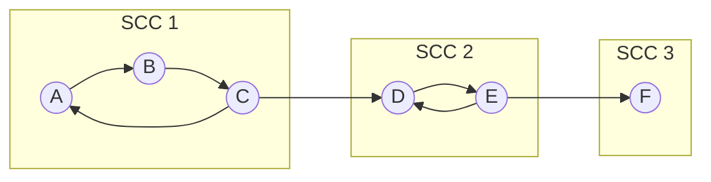
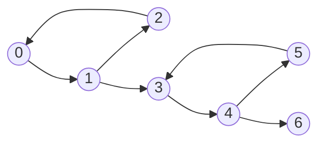
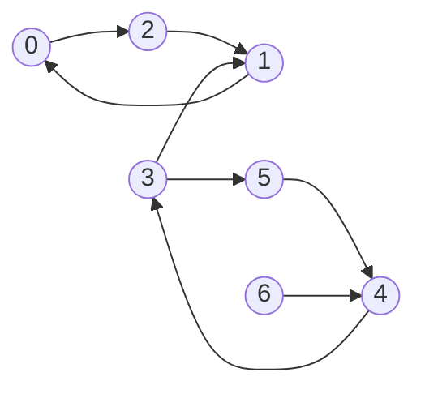
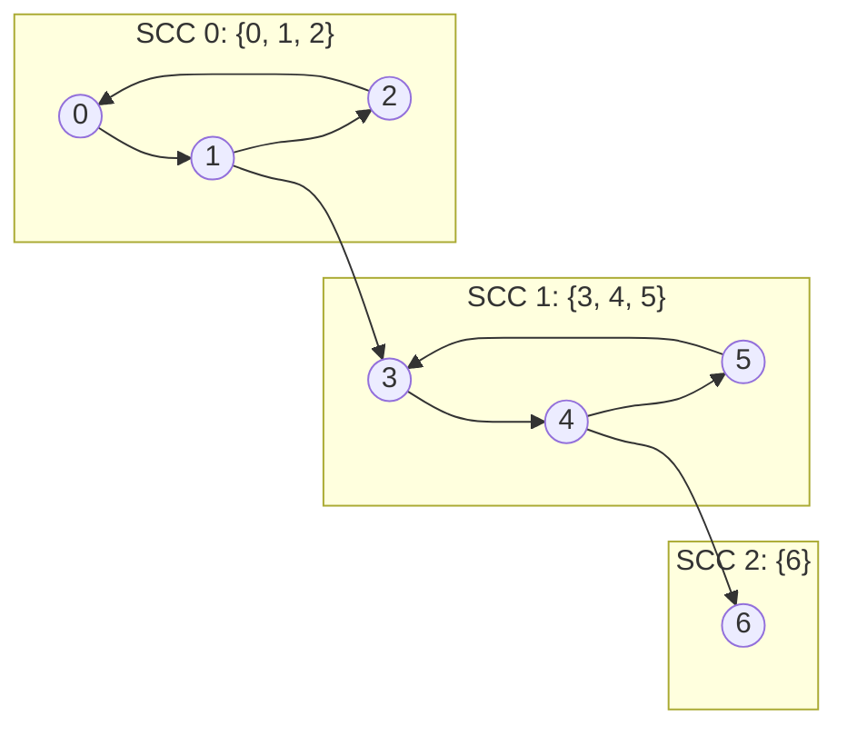
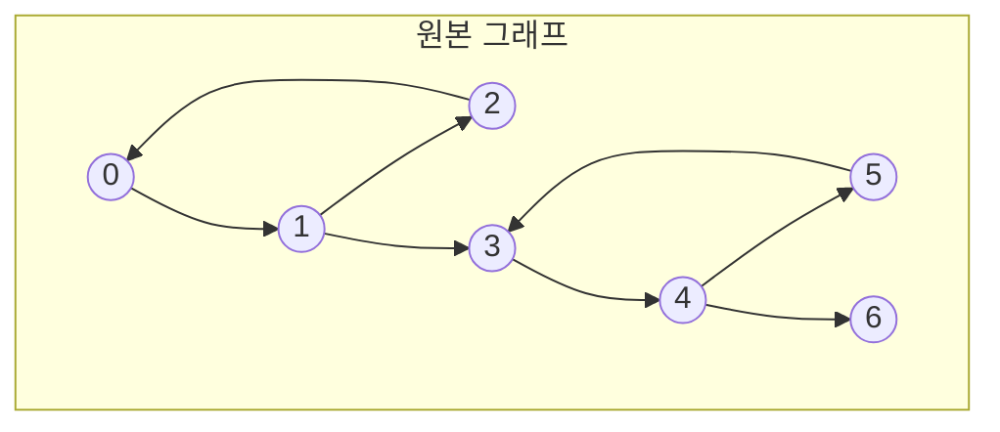
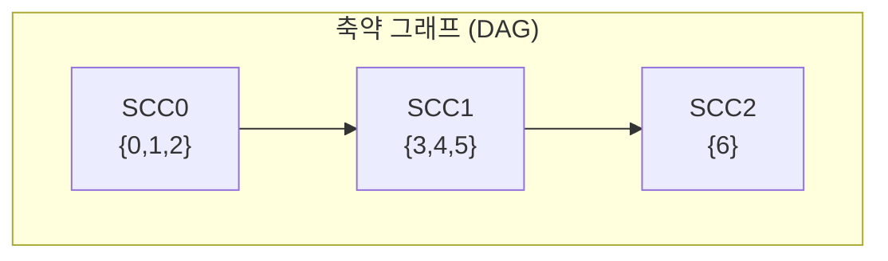
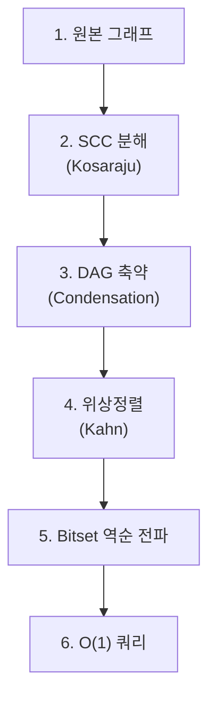
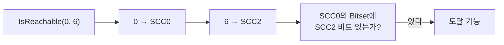

> 이 글은 **그래프 기초: DFS, DAG, 위상정렬 완벽 가이드**의 후속 글이다. DFS Finish Order, 간선 분류, 그래프 전치, 위상정렬 개념을 먼저 읽으면 이해가 쉽다.

# 1. SCC란 무엇인가

## 1.1 정의

**SCC(Strongly Connected Component, 강연결 요소)**란 방향 그래프에서 **서로 도달 가능한 정점들의 최대 집합**이다. 즉, SCC 내의 임의의 두 정점 u, v에 대해 `u → ... → v` 경로와 `v → ... → u` 경로가 모두 존재한다.



위 그래프에서 SCC는 3개다.
- **SCC 1**: {A, B, C} — A→B→C→A 순환으로 서로 도달 가능
- **SCC 2**: {D, E} — D→E→D 순환
- **SCC 3**: {F} — 다른 정점으로 가는 경로가 없으므로 단독 SCC

## 1.2 SCC를 왜 알아야 하는가

SCC는 다양한 분야에서 활용된다.

| 분야 | 활용 |
|------|------|
| 경로 탐색 | 도달 가능성(Reachability) 전처리 |
| 컴파일러 | 순환 의존성 탐지, 모듈 분석 |
| 2-SAT | 논리식 만족 가능성 판정 |
| 소셜 네트워크 | 강하게 연결된 커뮤니티 탐지 |
| 웹 그래프 | 페이지 클러스터링 |

이 글에서는 SCC 알고리즘을 학습한 뒤, 실전에서 **O(1) 도달 가능성 판정**에 활용하는 방법까지 다룬다.

---

# 2. SCC 알고리즘

## 2.1 Kosaraju 알고리즘

Kosaraju 알고리즘은 **2-pass DFS**로 SCC를 찾는다. 직관적이고 이해하기 쉬워 교육용으로 많이 사용된다.

### 2.1.1 핵심 아이디어

1. **1차 DFS**: 원본 그래프에서 DFS를 수행하며 **Finish Order**(후위 순서)를 기록한다
2. **그래프 전치**: 모든 간선의 방향을 뒤집는다
3. **2차 DFS**: Finish Order의 **역순**으로 전치 그래프에서 DFS를 수행한다. 이때 각 DFS 트리가 하나의 SCC이다

### 2.1.2 단계별 동작

다음 그래프로 Kosaraju 알고리즘의 동작을 살펴보자.



**Step 1: 1차 DFS — Finish Order 기록**

원본 그래프에서 DFS를 수행하며 각 정점의 완료 시점을 기록한다.

| 정점 | Discovery | Finish | 완료 순서 |
|------|------|------|------|
| 0 | 1 | 14 | 7번째 |
| 1 | 2 | 13 | 6번째 |
| 2 | 3 | 4 | 1번째 |
| 3 | 5 | 12 | 5번째 |
| 4 | 6 | 11 | 4번째 |
| 5 | 7 | 8 | 2번째 |
| 6 | 9 | 10 | 3번째 |

Finish Order: `[2, 5, 6, 4, 3, 1, 0]`

Finish Order 역순: **`[0, 1, 3, 4, 6, 5, 2]`**

**Step 2: 그래프 전치**

모든 간선의 방향을 뒤집는다.



**Step 3: 2차 DFS — SCC 추출**

Finish Order 역순 `[0, 1, 3, 4, 6, 5, 2]`으로 전치 그래프에서 DFS를 수행한다.

| DFS 시작 정점 | 방문한 정점 (전치 그래프) | SCC |
|------|------|------|
| 0 | 0 → 2 → 1 | **{0, 1, 2}** |
| 3 | 3 → 5 → 4 | **{3, 4, 5}** |
| 6 | 6 | **{6}** |



### 2.1.3 시간복잡도

| 단계 | 복잡도 |
|------|------|
| 1차 DFS | O(V + E) |
| 그래프 전치 | O(V + E) |
| 2차 DFS | O(V + E) |
| **전체** | **O(V + E)** |

### 2.1.4 왜 정확한가

Kosaraju 알고리즘이 올바르게 동작하는 핵심 직관은 다음과 같다.

- 1차 DFS의 Finish Order 역순은 **SCC 간의 위상 순서**를 보장한다
- 전치 그래프에서 DFS를 수행하면, SCC 내부의 간선은 그대로 SCC 내부를 순환하지만, **SCC 간 간선은 역방향**이 된다
- 따라서 위상 순서대로 2차 DFS를 시작하면, 다른 SCC로 넘어가지 않고 **현재 SCC의 정점만 방문**한다

## 2.2 Tarjan 알고리즘

Tarjan 알고리즘은 **1-pass DFS**와 **스택**으로 SCC를 찾는다. DFS 한 번으로 완료되므로 Kosaraju보다 상수 배 빠르지만, 구현이 상대적으로 복잡하다.

### 2.2.1 핵심 아이디어

각 정점에 두 가지 값을 관리한다.

- **Discovery Time `disc[u]`**: 정점 u를 처음 발견한 시점
- **Low-link `low[u]`**: u에서 DFS 트리를 통해 도달 가능한 정점 중 가장 작은 discovery time

`disc[u] == low[u]`이면 u는 SCC의 **루트**이며, 스택에서 u까지의 정점이 하나의 SCC를 구성한다.

### 2.2.2 Kosaraju vs Tarjan 비교

| 항목 | Kosaraju | Tarjan |
|------|------|------|
| DFS 횟수 | 2회 | 1회 |
| 추가 자료구조 | 전치 그래프 | 스택 + low-link 배열 |
| 구현 난이도 | 직관적 | 상대적으로 복잡 |
| 시간복잡도 | O(V + E) | O(V + E) |
| 실무 사용 | 교육/이해 용이 | 경쟁 프로그래밍에서 선호 |

이 글에서는 **Kosaraju 알고리즘**을 메인으로 다룬다. 분석 대상 코드가 Kosaraju 기반이며, 2-pass 구조가 직관적이기 때문이다.

---

# 3. SCC → DAG 축약 (Condensation Graph)

## 3.1 축약 그래프란

각 SCC를 **하나의 노드**로 압축한 그래프를 **축약 그래프(Condensation Graph)**라고 한다. 축약 그래프는 **반드시 DAG**가 된다.

왜 DAG인가? SCC 간에 순환이 있다면 해당 SCC들은 서로 도달 가능하므로 하나의 더 큰 SCC로 합쳐져야 한다. 이는 "최대 집합"이라는 SCC 정의에 모순되므로, SCC 간에는 순환이 존재할 수 없다.

## 3.2 축약 전후 비교

앞서 구한 SCC를 축약하면 다음과 같다.





축약 그래프에서 각 노드는 SCC 전체를 대표하며, SCC 내부의 간선은 제거된다. SCC 간의 간선만 남는다.

## 3.3 축약 그래프의 활용

축약 그래프가 DAG라는 성질은 강력한 도구가 된다.

- **도달 가능성(Reachability) 판정**: DAG 위에서 위상정렬 + Bitset 전파로 O(1) 쿼리 가능
- **2-SAT 문제 해결**: SCC 축약 후 위상 순서로 변수 값 결정
- **컴파일러 의존성 분석**: 순환 의존성을 SCC로 그룹화한 뒤 DAG 순서로 빌드

---

# 4. 실전 활용: O(1) 도달 가능성 판정

## 4.1 문제 정의

> "노드 A에서 노드 B로 갈 수 있는가?"

나이브한 접근은 매 쿼리마다 BFS/DFS를 수행하는 것이다. 이 경우 쿼리당 **O(V + E)** 시간이 소요된다. 쿼리 수가 많으면 비효율적이다.

**목표**: 전처리 후 모든 쿼리를 **O(1)**에 응답한다.

## 4.2 전처리 파이프라인



### 4.2.1 Step 1-3: SCC 분해 → DAG 축약

Kosaraju 알고리즘으로 SCC를 구하고, 각 SCC를 하나의 노드로 축약한다. 같은 SCC 내의 노드는 **서로 도달 가능**하므로 한 그룹으로 처리할 수 있다.

### 4.2.2 Step 4: 위상정렬

축약 DAG에 대해 Kahn 알고리즘(BFS)으로 위상정렬을 수행한다. 위상 순서는 Bitset 전파의 순서를 결정한다.

### 4.2.3 Step 5: Bitset 역순 전파

위상정렬의 **역순**으로 순회하며, 각 SCC 노드의 **도달 가능한 SCC 집합**을 Bitset으로 관리한다.

```
위상 순서: SCC0 → SCC1 → SCC2
역순 처리: SCC2 → SCC1 → SCC0
```

| 처리 순서 | SCC | 자기 자신 | 이웃의 Bitset 합산 | 최종 Bitset |
|------|------|------|------|------|
| 1 | SCC2 | {SCC2} | 없음 | {SCC2} |
| 2 | SCC1 | {SCC1} | SCC2의 {SCC2} | {SCC1, SCC2} |
| 3 | SCC0 | {SCC0} | SCC1의 {SCC1, SCC2} | {SCC0, SCC1, SCC2} |

### 4.2.4 Step 6: O(1) 쿼리

`IsReachable(from, to)` 호출 시:
1. `from`이 속한 SCC의 ID를 찾는다
2. `to`가 속한 SCC의 ID를 찾는다
3. 같은 SCC이면 → **도달 가능**
4. `from`의 SCC Bitset에서 `to`의 SCC 비트가 켜져 있는지 확인 → **O(1)**



## 4.3 복잡도 분석

| 항목 | 복잡도 |
|------|------|
| 전처리 시간 | O(V + E) |
| 전처리 공간 | O(V + S²/64) (S = SCC 수, Bitset) |
| 쿼리 시간 | O(1) |

쿼리가 많은 환경에서 전처리 비용은 빠르게 상쇄된다.

---

# 5. Go 구현 예제

아래 모든 코드는 동일한 `graph` 패키지에 속한다.

## 5.1 그래프 구조체

```go
package graph

import "sort"

const (
    White = iota
    Gray
    Black
)

type Graph struct {
    adj map[int][]int
}

func NewGraph() *Graph {
    return &Graph{adj: make(map[int][]int)}
}

func (g *Graph) AddEdge(u, v int) {
    g.adj[u] = append(g.adj[u], v)
    if _, ok := g.adj[v]; !ok {
        g.adj[v] = []int{}
    }
}

func (g *Graph) Vertices() []int {
    verts := make([]int, 0, len(g.adj))
    for v := range g.adj {
        verts = append(verts, v)
    }
    sort.Ints(verts)
    return verts
}

func (g *Graph) Transpose() *Graph {
    gt := NewGraph()
    for u, neighbors := range g.adj {
        if _, ok := gt.adj[u]; !ok {
            gt.adj[u] = []int{}
        }
        for _, v := range neighbors {
            gt.adj[v] = append(gt.adj[v], u)
        }
    }
    return gt
}

func (g *Graph) IsDAG() bool {
    color := make(map[int]int)
    for _, v := range g.Vertices() {
        if color[v] == White {
            if g.hasCycle(v, color) {
                return false
            }
        }
    }
    return true
}

func (g *Graph) hasCycle(u int, color map[int]int) bool {
    color[u] = Gray
    for _, v := range g.adj[u] {
        if color[v] == Gray {
            return true
        }
        if color[v] == White && g.hasCycle(v, color) {
            return true
        }
    }
    color[u] = Black
    return false
}
```

## 5.2 Kosaraju 알고리즘

```go
// Kosaraju는 SCC를 구하여 각 정점의 SCC ID와 SCC 목록을 반환한다.
type SCCResult struct {
    SCCOf      map[int]int   // 정점 → SCC ID
    Components [][]int       // SCC ID → 정점 리스트
}

func (g *Graph) Kosaraju() *SCCResult {
    // Step 1: 1차 DFS — Finish Order 기록
    finishOrder := []int{}
    visited := make(map[int]bool)

    var dfs1 func(u int)
    dfs1 = func(u int) {
        visited[u] = true
        for _, v := range g.adj[u] {
            if !visited[v] {
                dfs1(v)
            }
        }
        finishOrder = append(finishOrder, u)
    }

    for _, v := range g.Vertices() {
        if !visited[v] {
            dfs1(v)
        }
    }

    // Step 2: 그래프 전치
    gt := g.Transpose()

    // Step 3: 2차 DFS — Finish Order 역순으로 전치 그래프 탐색
    visited = make(map[int]bool)
    result := &SCCResult{
        SCCOf: make(map[int]int),
    }
    sccID := 0

    var dfs2 func(u int, component *[]int)
    dfs2 = func(u int, component *[]int) {
        visited[u] = true
        *component = append(*component, u)
        result.SCCOf[u] = sccID
        for _, v := range gt.adj[u] {
            if !visited[v] {
                dfs2(v, component)
            }
        }
    }

    // Finish Order 역순으로 순회
    for i := len(finishOrder) - 1; i >= 0; i-- {
        u := finishOrder[i]
        if !visited[u] {
            component := []int{}
            dfs2(u, &component)
            sort.Ints(component)
            result.Components = append(result.Components, component)
            sccID++
        }
    }

    return result
}
```

## 5.3 DAG 축약 (Condensation Graph)

```go
// Condense는 SCC를 하나의 노드로 축약한 DAG를 생성한다.
func (g *Graph) Condense(scc *SCCResult) *Graph {
    dag := NewGraph()

    // 모든 SCC 노드를 초기화
    for i := 0; i < len(scc.Components); i++ {
        if _, ok := dag.adj[i]; !ok {
            dag.adj[i] = []int{}
        }
    }

    // 원본 간선 중 SCC가 다른 간선만 DAG에 추가
    seen := make(map[[2]int]bool)
    for u, neighbors := range g.adj {
        for _, v := range neighbors {
            su, sv := scc.SCCOf[u], scc.SCCOf[v]
            if su != sv {
                edge := [2]int{su, sv}
                if !seen[edge] {
                    dag.AddEdge(su, sv)
                    seen[edge] = true
                }
            }
        }
    }

    return dag
}
```

## 5.4 Bitset 기반 Reachability

```go
// Reachability는 O(1) 도달 가능성 판정을 위한 전처리 구조체다.
// 교육 목적으로 map을 사용했다. 프로덕션에서는 []uint64 기반 bitset을 사용하면
// OR 연산 한 번으로 도달 가능 집합을 합산할 수 있어 성능이 크게 향상된다.
type Reachability struct {
    scc    *SCCResult
    reach  map[int]map[int]bool // SCC ID → 도달 가능한 SCC ID 집합
}

// NewReachability는 그래프에 대해 전처리를 수행한다.
func NewReachability(g *Graph) *Reachability {
    // 1. SCC 분해
    scc := g.Kosaraju()

    // 2. DAG 축약
    dag := g.Condense(scc)

    // 3. 위상정렬 (Kahn)
    topoOrder := dag.KahnTopologicalSort()

    // 4. Bitset 역순 전파
    reach := make(map[int]map[int]bool)
    for i := 0; i < len(scc.Components); i++ {
        reach[i] = map[int]bool{i: true} // 자기 자신은 도달 가능
    }

    // 위상정렬 역순으로 전파
    for i := len(topoOrder) - 1; i >= 0; i-- {
        u := topoOrder[i]
        for _, v := range dag.adj[u] {
            // v의 도달 가능 집합을 u에 합산
            for sccID := range reach[v] {
                reach[u][sccID] = true
            }
        }
    }

    return &Reachability{scc: scc, reach: reach}
}

// IsReachable은 정점 from에서 정점 to로 도달 가능한지 O(1)으로 판정한다.
func (r *Reachability) IsReachable(from, to int) bool {
    sccFrom := r.scc.SCCOf[from]
    sccTo := r.scc.SCCOf[to]
    return r.reach[sccFrom][sccTo]
}
```

## 5.5 Kahn 위상정렬

```go
func (g *Graph) KahnTopologicalSort() []int {
    inDegree := make(map[int]int)
    for _, v := range g.Vertices() {
        inDegree[v] = 0
    }
    for _, neighbors := range g.adj {
        for _, v := range neighbors {
            inDegree[v]++
        }
    }

    queue := []int{}
    for _, v := range g.Vertices() {
        if inDegree[v] == 0 {
            queue = append(queue, v)
        }
    }

    result := []int{}
    for len(queue) > 0 {
        u := queue[0]
        queue = queue[1:]
        result = append(result, u)

        for _, v := range g.adj[u] {
            inDegree[v]--
            if inDegree[v] == 0 {
                queue = append(queue, v)
            }
        }
    }

    if len(result) != len(g.adj) {
        return nil
    }
    return result
}
```

## 5.6 테스트

```go
package graph

import (
    "testing"
)

func buildTestGraph() *Graph {
    // 0 → 1 → 2 → 0 (SCC: {0,1,2})
    // 1 → 3 → 4 → 5 → 3 (SCC: {3,4,5})
    // 4 → 6 (SCC: {6})
    g := NewGraph()
    g.AddEdge(0, 1)
    g.AddEdge(1, 2)
    g.AddEdge(2, 0)
    g.AddEdge(1, 3)
    g.AddEdge(3, 4)
    g.AddEdge(4, 5)
    g.AddEdge(5, 3)
    g.AddEdge(4, 6)
    return g
}

func TestKosaraju(t *testing.T) {
    g := buildTestGraph()
    scc := g.Kosaraju()

    // SCC 수 확인
    if len(scc.Components) != 3 {
        t.Fatalf("Expected 3 SCCs, got %d", len(scc.Components))
    }

    // 같은 SCC에 속하는 정점 확인
    if scc.SCCOf[0] != scc.SCCOf[1] || scc.SCCOf[1] != scc.SCCOf[2] {
        t.Error("Vertices 0, 1, 2 should be in the same SCC")
    }
    if scc.SCCOf[3] != scc.SCCOf[4] || scc.SCCOf[4] != scc.SCCOf[5] {
        t.Error("Vertices 3, 4, 5 should be in the same SCC")
    }

    // 다른 SCC에 속하는 정점 확인
    if scc.SCCOf[0] == scc.SCCOf[3] {
        t.Error("Vertices 0 and 3 should be in different SCCs")
    }
    if scc.SCCOf[3] == scc.SCCOf[6] {
        t.Error("Vertices 3 and 6 should be in different SCCs")
    }
}

func TestCondense(t *testing.T) {
    g := buildTestGraph()
    scc := g.Kosaraju()
    dag := g.Condense(scc)

    // 축약 그래프의 정점 수 = SCC 수
    if len(dag.adj) != 3 {
        t.Fatalf("Expected 3 nodes in condensation, got %d", len(dag.adj))
    }

    // 축약 그래프가 DAG인지 확인
    if !dag.IsDAG() {
        t.Error("Condensation graph should be a DAG")
    }
}

func TestReachability(t *testing.T) {
    g := buildTestGraph()
    r := NewReachability(g)

    // 같은 SCC 내: 서로 도달 가능
    if !r.IsReachable(0, 1) {
        t.Error("0 → 1 should be reachable (same SCC)")
    }
    if !r.IsReachable(2, 0) {
        t.Error("2 → 0 should be reachable (same SCC)")
    }
    if !r.IsReachable(3, 5) {
        t.Error("3 → 5 should be reachable (same SCC)")
    }

    // SCC 간: 순방향 도달 가능
    if !r.IsReachable(0, 3) {
        t.Error("0 → 3 should be reachable (SCC0 → SCC1)")
    }
    if !r.IsReachable(0, 6) {
        t.Error("0 → 6 should be reachable (SCC0 → SCC1 → SCC2)")
    }
    if !r.IsReachable(3, 6) {
        t.Error("3 → 6 should be reachable (SCC1 → SCC2)")
    }

    // SCC 간: 역방향 도달 불가
    if r.IsReachable(3, 0) {
        t.Error("3 → 0 should NOT be reachable")
    }
    if r.IsReachable(6, 0) {
        t.Error("6 → 0 should NOT be reachable")
    }
    if r.IsReachable(6, 3) {
        t.Error("6 → 3 should NOT be reachable")
    }
}

func TestIsDAG(t *testing.T) {
    dag := NewGraph()
    dag.AddEdge(0, 1)
    dag.AddEdge(1, 2)
    if !dag.IsDAG() {
        t.Error("Expected DAG")
    }

    cyclic := NewGraph()
    cyclic.AddEdge(0, 1)
    cyclic.AddEdge(1, 0)
    if cyclic.IsDAG() {
        t.Error("Expected cyclic graph")
    }
}
```

---

# 6. 정리

## 6.1 요약

| 개념 | 핵심 내용 |
|------|------|
| SCC | 서로 도달 가능한 정점의 최대 집합 |
| Kosaraju | 2-pass DFS (Finish Order → 전치 그래프 DFS) |
| Tarjan | 1-pass DFS + 스택 + low-link |
| DAG 축약 | SCC를 단일 노드로 압축 → 반드시 DAG |
| Bitset 전파 | 위상정렬 역순으로 도달 가능 집합 합산 |
| O(1) 쿼리 | SCC Bitset lookup으로 도달 가능성 판정 |

## 6.2 알고리즘 선택 기준

| 상황 | 추천 |
|------|------|
| 이해/교육 목적 | Kosaraju (직관적인 2-pass 구조) |
| 경쟁 프로그래밍 | Tarjan (1-pass로 상수 배 빠름) |
| 도달 가능성 전처리 | Kosaraju + DAG 축약 + Bitset |

---

# 7. 참고

- Introduction to Algorithms (CLRS) — Chapter 22: Elementary Graph Algorithms
- [Wikipedia: Strongly Connected Component](https://en.wikipedia.org/wiki/Strongly_connected_component)
- [Wikipedia: Kosaraju's Algorithm](https://en.wikipedia.org/wiki/Kosaraju%27s_algorithm)
- [Wikipedia: Tarjan's Strongly Connected Components Algorithm](https://en.wikipedia.org/wiki/Tarjan%27s_strongly_connected_components_algorithm)
