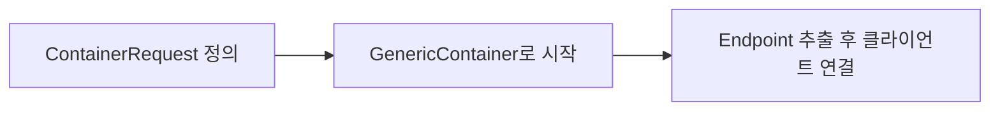
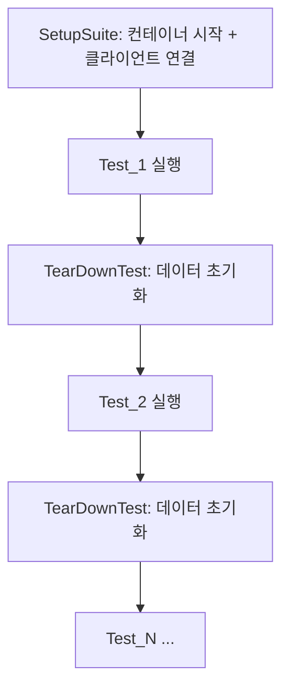

데이터베이스와 상호작용하는 코드를 테스트할 때 Mock을 사용하면 실제 DB 동작과 차이가 발생할 수 있다. Testcontainers는 Docker 컨테이너로 실제 DB를 띄워 프로덕션에 가까운 환경에서 테스트할 수 있게 해준다.

이 글에서는 `testcontainers-go`를 사용하여 Redis, MongoDB, MySQL 통합 테스트를 작성하는 방법을 알아본다.

> 전제 조건: Docker가 설치되어 있어야 한다.

# 1. 통합 테스트가 필요한 이유

## 1.1 Mock의 한계

단위 테스트에서 DB를 Mock으로 대체하면 빠르고 격리된 테스트가 가능하다. 하지만 한계가 있다.

- **SQL 방언 차이**: Mock은 실제 DB 엔진의 SQL 파싱, 타입 캐스팅, 트랜잭션 동작을 재현하지 못한다
- **스키마 변경 감지 불가**: 테이블 구조가 변경되어도 Mock은 이전 스키마로 동작한다
- **드라이버 호환성**: 실제 드라이버의 커넥션 풀, 타임아웃 동작을 검증할 수 없다

```go
// Mock 기반 테스트 - 실제 DB 동작을 보장하지 못한다
mockDB.ExpectQuery("SELECT").WillReturnRows(rows)
```

## 1.2 통합 테스트 vs E2E 테스트

| 구분 | 단위 테스트 | 통합 테스트 | E2E 테스트 |
|------|-----------|-----------|-----------|
| 범위 | 함수/메서드 단위 | 모듈 + 외부 의존성 | 전체 시스템 |
| 속도 | 매우 빠름 | 보통 | 느림 |
| 격리 | Mock/Stub | 실제 DB (컨테이너) | 실제 인프라 |
| 신뢰도 | 낮음 | 높음 | 매우 높음 |

Testcontainers는 통합 테스트에 해당한다. 테스트마다 격리된 실제 DB를 Docker 컨테이너로 생성하고, 테스트가 끝나면 자동으로 정리한다.

# 2. Testcontainers 소개

## 2.1 설치

```bash
go get github.com/testcontainers/testcontainers-go
```

## 2.2 핵심 구조

Testcontainers의 기본 흐름은 3단계다.



### 2.2.1 ContainerRequest

컨테이너 설정을 정의하는 구조체다. Docker 이미지, 포트, 환경변수, 준비 완료 조건(WaitingFor)을 지정한다.

```go
req := testcontainers.ContainerRequest{
    Image:        "redis:6",
    ExposedPorts: []string{"6379/tcp"},
    WaitingFor:   wait.ForLog("Ready to accept connections"),
}
```

주요 필드:

| 필드 | 설명 |
|------|------|
| `Image` | Docker 이미지 (예: `redis:6`, `mysql:8`) |
| `ExposedPorts` | 노출할 포트 (`"포트/tcp"` 형식) |
| `Env` | 환경변수 맵 |
| `WaitingFor` | 컨테이너 준비 완료 판단 전략 |

### 2.2.2 GenericContainer

`ContainerRequest`를 받아 실제 Docker 컨테이너를 생성하고 시작한다.

```go
container, err := testcontainers.GenericContainer(ctx, testcontainers.GenericContainerRequest{
    ContainerRequest: req,
    Started:          true,  // 생성과 동시에 시작
})
```

### 2.2.3 엔드포인트 추출

컨테이너가 시작되면 매핑된 호스트와 포트를 추출하여 클라이언트를 연결한다.

```go
// 방법 1: host:port 형태로 한번에 가져오기
endpoint, err := container.Endpoint(ctx, "")

// 방법 2: host와 port를 각각 가져오기
host, err := container.Host(ctx)
mappedPort, err := container.MappedPort(ctx, "3306")
```

## 2.3 Wait 전략

컨테이너가 실제로 요청을 받을 준비가 되었는지 확인하는 전략이다. DB마다 적절한 전략을 선택해야 한다.

| 전략 | 사용 예 | 설명 |
|------|--------|------|
| `wait.ForLog(msg)` | Redis, MongoDB | 특정 로그 메시지가 출력될 때까지 대기 |
| `wait.ForSQL(port, driver, url)` | MySQL, PostgreSQL | 실제 SQL 커넥션이 성공할 때까지 대기 |
| `wait.ForListeningPort(port)` | 범용 | 포트가 열릴 때까지 대기 |

# 3. DB별 통합 테스트 실전 예제

## 3.1 Redis

### 3.1.1 컨테이너 설정

Redis는 `wait.ForLog`로 준비 완료를 판단한다. 컨테이너가 시작되면 `Endpoint`로 접속 주소를 추출한다.

```go
func NewRedisV9Client() *redislib_v9.Client {
    endPoint, err := startRedisContainer()
    if err != nil {
        panic(err)
    }
    client := redislib_v9.NewClient(&redislib_v9.Options{
        Addr: endPoint,
    })
    return client
}

func startRedisContainer() (string, error) {
    ctx := context.Background()
    req := testcontainers.ContainerRequest{
        Image:        "redis:6",
        ExposedPorts: []string{"6379/tcp"},
        WaitingFor:   wait.ForLog("Ready to accept connections"),
    }
    redisC, err := testcontainers.GenericContainer(ctx, testcontainers.GenericContainerRequest{
        ContainerRequest: req,
        Started:          true,
    })
    if err != nil {
        panic(err)
    }

    endPoint, err := redisC.Endpoint(ctx, "")
    if err != nil {
        panic(err)
    }
    return endPoint, nil
}
```

### 3.1.2 테스트 코드

Testify Suite 패턴으로 테스트를 구성한다. `SetupSuite`에서 컨테이너를 한 번 시작하고, `TearDownTest`에서 각 테스트 후 데이터를 초기화한다.

```go
type redisTestContainerTestSuite struct {
    suite.Suite
    redisV9Client *redislib_v9.Client
    ctx           context.Context
}

func TestRedisTestSuite(t *testing.T) {
    suite.Run(t, new(redisTestContainerTestSuite))
}

func (suite *redisTestContainerTestSuite) SetupSuite() {
    suite.redisV9Client = NewRedisV9Client()
    suite.ctx = context.Background()
}

func (suite *redisTestContainerTestSuite) TearDownTest() {
    suite.NoError(suite.redisV9Client.FlushAll(suite.ctx).Err())
}

func (suite *redisTestContainerTestSuite) Test_RedisTestContainers() {
    suite.Run("Test Set and Get", func() {
        suite.redisV9Client.Set(suite.ctx, "hello", "world", time.Duration(0))

        value := suite.redisV9Client.Get(suite.ctx, "hello").Val()
        suite.Equal("world", value)
    })
}
```

## 3.2 MongoDB

### 3.2.1 컨테이너 설정

MongoDB는 별도의 Wait 전략 없이도 안정적으로 시작된다. `Endpoint`로 접속 URI를 구성하여 `mongo.Connect`에 전달한다.

```go
func NewMongoClient() *mongo.Client {
    endPoint, _ := startMongoContainer()

    uri := fmt.Sprintf("mongodb://%s", endPoint)
    client, err := mongo.Connect(context.Background(), options.Client().ApplyURI(uri))
    if err != nil {
        panic(err)
    }
    return client
}

func startMongoContainer() (string, error) {
    ctx := context.Background()
    req := testcontainers.ContainerRequest{
        Image:        "mongo:4.4.4-bionic",
        ExposedPorts: []string{"27017/tcp"},
    }

    mongodbC, err := testcontainers.GenericContainer(ctx, testcontainers.GenericContainerRequest{
        ContainerRequest: req,
        Started:          true,
    })
    if err != nil {
        panic(err)
    }

    endPoint, err := mongodbC.Endpoint(ctx, "")
    if err != nil {
        panic(err)
    }
    return endPoint, nil
}
```

### 3.2.2 테스트 코드

`SetupSuite`에서 클라이언트와 컬렉션을 초기화하고, `TearDownTest`에서 컬렉션을 Drop하여 테스트 간 데이터를 격리한다.

```go
type mongoTestContainerTestSuite struct {
    suite.Suite
    ctx        context.Context
    client     *mongo.Client
    collection *mongo.Collection
}

func TestMongoTestSuite(t *testing.T) {
    suite.Run(t, new(mongoTestContainerTestSuite))
}

func (s *mongoTestContainerTestSuite) SetupSuite() {
    s.ctx = context.Background()
    s.client = NewMongoClient()
    s.collection = s.client.Database("testdb").Collection("items")
}

func (s *mongoTestContainerTestSuite) TearDownTest() {
    s.NoError(s.collection.Drop(s.ctx))
}

func (s *mongoTestContainerTestSuite) Test_InsertAndFind() {
    doc := bson.M{"name": "testcontainers", "language": "go"}
    _, err := s.collection.InsertOne(s.ctx, doc)
    s.NoError(err)

    var result bson.M
    err = s.collection.FindOne(s.ctx, bson.M{"name": "testcontainers"}).Decode(&result)
    s.NoError(err)
    s.Equal("testcontainers", result["name"])
    s.Equal("go", result["language"])
}
```

## 3.3 MySQL (GORM)

### 3.3.1 컨테이너 설정

MySQL은 `wait.ForSQL`을 사용하여 실제 SQL 커넥션이 가능한 시점까지 대기한다. 컨테이너가 준비되면 GORM으로 연결한다.

```go
func NewMysqlDB() *gorm.DB {
    password, database := "root", "test_db"
    host, port, err := startMysqlContainer(password, database)
    if err != nil {
        panic(err)
    }

    dsn := fmt.Sprintf("root:%s@tcp(%s:%s)/%s?charset=utf8mb4&parseTime=true",
        password, host, port, database)
    db, err := gorm.Open(mysqlDriver.Open(dsn), &gorm.Config{})
    if err != nil {
        panic(err)
    }
    return db
}

func startMysqlContainer(password, database string) (string, string, error) {
    ctx := context.Background()
    port := "3306"

    req := testcontainers.ContainerRequest{
        Image:        "mysql:8",
        ExposedPorts: []string{port + "/tcp"},
        Env: map[string]string{
            "MYSQL_DATABASE":      database,
            "MYSQL_ROOT_PASSWORD": password,
        },
        WaitingFor: wait.ForSQL(nat.Port(port), "mysql", func(port nat.Port) string {
            return fmt.Sprintf("root:%s@tcp(%s:%s)/%s?charset=utf8mb4&parseTime=true",
                password, "localhost", port.Port(), database)
        }).WithPollInterval(3 * time.Second),
    }

    mysqlC, err := testcontainers.GenericContainer(ctx, testcontainers.GenericContainerRequest{
        ContainerRequest: req,
        Started:          true,
    })
    if err != nil {
        return "", "", err
    }

    host, err := mysqlC.Host(ctx)
    if err != nil {
        return "", "", err
    }
    mappedPort, err := mysqlC.MappedPort(ctx, nat.Port(port))
    if err != nil {
        return "", "", err
    }
    return host, mappedPort.Port(), nil
}
```

`wait.ForLog` 대신 `wait.ForSQL`을 사용하는 이유는 MySQL이 로그에 "ready for connections"를 출력해도 실제로 SQL 쿼리를 받을 준비가 안 된 경우가 있기 때문이다. `wait.ForSQL`은 주기적으로 실제 커넥션을 시도하여 확인한다.

### 3.3.2 테스트 코드

GORM의 `AutoMigrate`로 테이블을 생성하고 CRUD 테스트를 작성한다.

```go
type User struct {
    gorm.Model
    Name  string
    Email string
}

type mysqlTestContainerTestSuite struct {
    suite.Suite
    db *gorm.DB
}

func TestMysqlTestSuite(t *testing.T) {
    suite.Run(t, new(mysqlTestContainerTestSuite))
}

func (s *mysqlTestContainerTestSuite) SetupSuite() {
    s.db = NewMysqlDB()
    s.NoError(s.db.AutoMigrate(&User{}))
}

func (s *mysqlTestContainerTestSuite) TearDownTest() {
    s.db.Exec("DELETE FROM users")
}

func (s *mysqlTestContainerTestSuite) Test_CreateAndFind() {
    user := User{Name: "Frank", Email: "frank@example.com"}
    result := s.db.Create(&user)
    s.NoError(result.Error)
    s.NotZero(user.ID)

    var found User
    s.NoError(s.db.First(&found, user.ID).Error)
    s.Equal("Frank", found.Name)
    s.Equal("frank@example.com", found.Email)
}

func (s *mysqlTestContainerTestSuite) Test_Update() {
    user := User{Name: "Alice", Email: "alice@example.com"}
    s.db.Create(&user)

    s.NoError(s.db.Model(&user).Update("Email", "alice@newmail.com").Error)

    var updated User
    s.db.First(&updated, user.ID)
    s.Equal("alice@newmail.com", updated.Email)
}

func (s *mysqlTestContainerTestSuite) Test_Delete() {
    user := User{Name: "Bob", Email: "bob@example.com"}
    s.db.Create(&user)

    s.NoError(s.db.Delete(&user).Error)

    var found User
    err := s.db.First(&found, user.ID).Error
    s.ErrorIs(err, gorm.ErrRecordNotFound)
}
```

GORM의 soft delete 기능에 의해 `Delete`는 실제로 `deleted_at` 컬럼에 타임스탬프를 설정한다. 이후 `First`로 조회하면 soft delete된 레코드는 조회되지 않아 `ErrRecordNotFound`가 반환된다.

# 4. 테스트 라이프사이클 관리

## 4.1 Suite 패턴으로 컨테이너 재사용

위 예제들은 모두 Testify의 Suite 패턴을 사용한다. 이 패턴의 핵심은 **컨테이너를 Suite 단위로 한 번만 생성**하고, 테스트마다 데이터만 초기화하는 것이다.



| 콜백 | 실행 시점 | 역할 |
|------|---------|------|
| `SetupSuite` | Suite 시작 시 1회 | 컨테이너 생성, 클라이언트 연결, 스키마 마이그레이션 |
| `TearDownTest` | 각 테스트 종료 후 | 데이터 초기화 (FlushAll, DELETE, Drop) |

이 방식은 컨테이너 시작 오버헤드를 한 번만 부담하면서도 테스트 간 데이터 격리를 보장한다.

## 4.2 컨테이너 재사용 전략

### 4.2.1 Suite-level 재사용 (현재 예제)

위 예제 코드에서 사용하는 패턴이다. `SetupSuite`에서 컨테이너를 생성하면 해당 Suite의 모든 테스트가 같은 컨테이너를 공유한다. Testcontainers 버전에 관계없이 사용 가능하다.

### 4.2.2 Reuse 옵션 (v0.20+)

`testcontainers-go` v0.20 이상에서는 `GenericContainerRequest`에 `Reuse` 필드가 추가되었다. 이를 사용하면 여러 Suite 간에도 같은 컨테이너를 재사용할 수 있다.

```go
// testcontainers-go v0.20+ 에서만 사용 가능
container, err := testcontainers.GenericContainer(ctx, testcontainers.GenericContainerRequest{
    ContainerRequest: req,
    Started:          true,
    Reuse:            true,  // 기존 컨테이너가 있으면 재사용
})
```

> v0.13.0 등 이전 버전에서는 `Reuse` 필드를 지원하지 않는다. Suite-level 재사용 패턴을 사용하자.

# 5. CI/CD 적용 & 실전 팁

## 5.1 GitHub Actions에서 사용하기

GitHub Actions에서는 Docker가 기본 제공되므로 추가 설정 없이 Testcontainers를 사용할 수 있다.

```yaml
# .github/workflows/test.yml
name: Integration Tests
on: [push, pull_request]
jobs:
  test:
    runs-on: ubuntu-latest
    steps:
      - uses: actions/checkout@v4
      - uses: actions/setup-go@v5
        with:
          go-version: '1.21'
      - name: Run integration tests
        run: go test -v -tags=integration ./...
```

## 5.2 테스트 태그로 통합 테스트 분리

통합 테스트는 Docker가 필요하므로 빌드 태그로 분리하면 로컬에서 빠른 단위 테스트만 실행할 수 있다.

```go
//go:build integration

package go_testcontainers

// 이 파일의 테스트는 -tags=integration 옵션이 있을 때만 실행된다
```

```bash
# 단위 테스트만 실행
go test ./...

# 통합 테스트 포함
go test -tags=integration ./...
```

## 5.3 주의사항

- **포트 충돌 없음**: Testcontainers는 매번 랜덤 포트를 매핑하므로 호스트 포트 충돌이 발생하지 않는다
- **이미지 캐시**: 처음 실행 시 Docker 이미지를 Pull하므로 시간이 걸린다. CI에서는 Docker layer caching을 활용하면 좋다
- **리소스 정리**: 테스트가 비정상 종료되면 컨테이너가 남을 수 있다. `docker ps -a | grep testcontainers`로 확인 후 정리하자

# 6. 마무리

Testcontainers를 사용하면 Mock 없이도 실제 DB에 대한 통합 테스트를 쉽게 작성할 수 있다. 정리하면:

- **Mock보다 높은 신뢰도**: 실제 DB 엔진에서 테스트하므로 프로덕션 환경과의 차이가 줄어든다
- **간편한 설정**: Docker 이미지와 포트만 지정하면 컨테이너 생성부터 정리까지 자동으로 처리된다
- **Suite 패턴 활용**: `SetupSuite`에서 컨테이너를 한 번 생성하고 테스트마다 데이터만 초기화하면 효율적이다

이 글의 전체 예제 코드는 [GitHub](https://github.com/kenshin579/tutorials-go/tree/master/go-unit-test/testcontainers)에서 확인할 수 있다.

# 7. 참고

- https://testcontainers.com/
- https://golang.testcontainers.org/
- https://github.com/testcontainers/testcontainers-go
- https://pkg.go.dev/github.com/testcontainers/testcontainers-go
