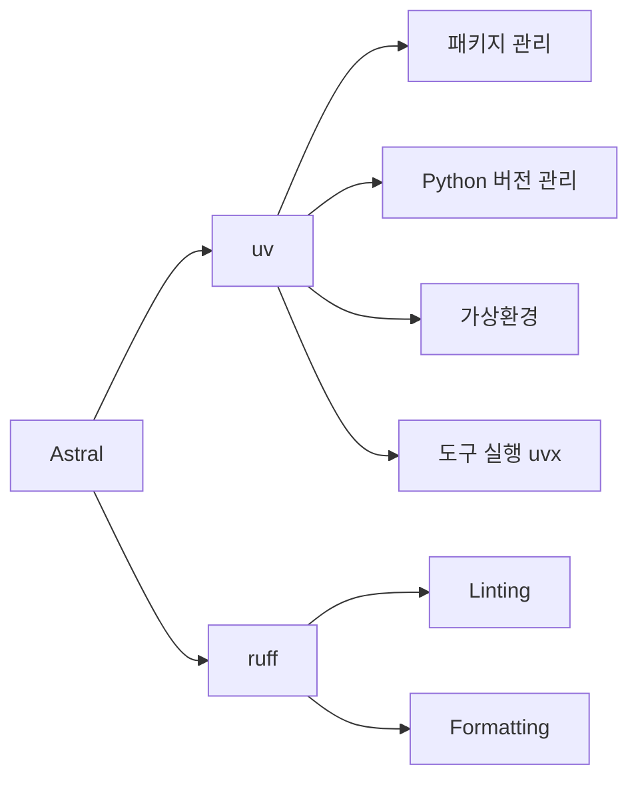

## 1. 개요 (uv란?)

[uv](https://github.com/astral-sh/uv)는 Rust로 작성된 초고속 Python 패키지 및 프로젝트 매니저다. [Ruff](https://github.com/astral-sh/ruff)(Python linter/formatter)를 만든 [Astral](https://astral.sh/)에서 개발했으며, 기존에 분산되어 있던 Python 도구들을 하나로 통합하는 것을 목표로 한다.

uv 하나로 대체할 수 있는 도구들:

| 기존 도구 | 역할 | uv 대체 명령어 |
|---|---|---|
| pip | 패키지 설치 | `uv pip install` |
| pip-tools | 의존성 잠금 | `uv lock` |
| virtualenv | 가상환경 생성 | `uv venv` |
| pyenv | Python 버전 관리 | `uv python` |
| pipx | CLI 도구 실행 | `uvx` |
| poetry/pdm | 프로젝트 관리 | `uv init`, `uv add` |

**핵심 특징:**

- **속도**: pip 대비 10~100배 빠름 (Rust 구현)
- **단일 바이너리**: Python이 없어도 설치 가능
- **글로벌 캐시**: 디스크 절약을 위한 Copy-on-Write 하드링크
- **유니버설 Lock 파일**: 모든 플랫폼을 하나의 `uv.lock`으로 관리
- **월간 PyPI 다운로드**: ~7,500만 (Poetry ~6,600만 추월)

### 1.1 Python 패키지 매니저 생태계 비교

Python 생태계에는 다양한 패키지 매니저가 존재한다. pip + pip-tools (전통적 방식) → Poetry (올인원) → uv (차세대)로 발전해왔다.

| 기능 | pip | Poetry | PDM | uv |
|---|---|---|---|---|
| 속도 | 보통 | 보통 | 빠름 | **가장 빠름** (10~100x) |
| 언어 | Python | Python | Python | **Rust** |
| Lock 파일 | 없음 | `poetry.lock` | `pdm.lock` | `uv.lock` (유니버설) |
| 가상환경 | 수동 | 내장 | 선택적 | **내장** (80x 빠름) |
| Python 버전 관리 | 없음 | 없음 | 제한적 | **내장** |
| PyPI 배포 | 없음 | 지원 | 없음 | **지원** (`uv publish`) |
| 의존성 그룹 | 없음 | dev만 | 지원 | **지원** (PEP 735) |
| pyproject.toml | 부분 | 지원 | 지원 | **지원** |
| Workspace | 없음 | 없음 | 없음 | **지원** (Cargo 스타일) |
| 도구 실행 (pipx) | 없음 | 없음 | 없음 | **지원** (`uvx`) |
| 인라인 스크립트 | 없음 | 없음 | 없음 | **지원** (PEP 723) |

> pipenv는 2026년 기준 거의 사용되지 않으므로 비교에서 제외했다.

### 1.2 성능 벤치마크

uv의 가장 큰 장점은 속도다. [공식 벤치마크](https://github.com/astral-sh/uv/blob/main/BENCHMARKS.md)에서 발췌한 수치를 살펴보자.

**의존성 해석 (cold, 캐시 없음):**

| 프로젝트 | uv | Poetry | PDM |
|---|---|---|---|
| Transformers | 7.48초 | 47.91초 | 91.91초 |

**의존성 해석 (warm, 캐시 있음):**

| 프로젝트 | uv | Poetry | PDM |
|---|---|---|---|
| Jupyter | 0.02초 | 0.78초 | 6.27초 |

**패키지 설치 (cold):**

| 프로젝트 | uv | pip |
|---|---|---|
| JupyterLab | 2.6초 | 21.4초 |

**가상환경 생성:**

| 도구 | 시간 | 배수 |
|---|---|---|
| `uv venv` | ~0.01초 | 1x |
| virtualenv | ~0.07초 | 7x 느림 |
| `python -m venv` | ~0.8초 | 80x 느림 |

## 2. 설치 및 프로젝트 셋업

### 설치 (macOS)

```bash
# Homebrew (가장 간단)
brew install uv

# 또는 standalone installer (자동 업데이트 지원)
curl -LsSf https://astral.sh/uv/install.sh | sh
```

설치 후 셸 자동완성을 설정하면 편리하다.

```bash
# Zsh
echo 'eval "$(uv generate-shell-completion zsh)"' >> ~/.zshrc

# Bash
echo 'eval "$(uv generate-shell-completion bash)"' >> ~/.bashrc
```

자동 업데이트:

```bash
uv self update
```

### 프로젝트 생성 (`uv init`)

```bash
# 기본 애플리케이션 프로젝트
uv init my-app

# 라이브러리 프로젝트 (src 레이아웃, PyPI 배포용)
uv init --lib my-lib

# 패키지 애플리케이션 (CLI 엔트리포인트 포함)
uv init --package my-pkg

# 특정 Python 버전으로 생성
uv init my-project --python 3.12
```

각 옵션으로 생성되는 디렉토리 구조:

```
# uv init my-app (기본 앱)
my-app/
├── .gitignore
├── .python-version
├── README.md
├── main.py
└── pyproject.toml

# uv init --lib my-lib (라이브러리)
my-lib/
├── .python-version
├── README.md
├── pyproject.toml
└── src/
    └── my_lib/
        ├── __init__.py
        └── py.typed
```

### 2.1 pyproject.toml 구조

uv 프로젝트의 핵심은 `pyproject.toml`이다. 주요 섹션별로 살펴보자.

```toml
# 프로젝트 기본 정보
[project]
name = "my-project"
version = "0.1.0"
description = "프로젝트 설명"
readme = "README.md"
requires-python = ">=3.11"
license = { text = "MIT" }
authors = [
    { name = "Frank Oh", email = "frank@example.com" }
]
dependencies = [
    "httpx>=0.27.0",
    "fastapi>=0.110.0",
]

# CLI 엔트리포인트 (선택)
[project.scripts]
my-cli = "my_project:main"

# 의존성 그룹 (PEP 735, 로컬 전용 - PyPI 배포에 포함 안 됨)
[dependency-groups]
dev = [
    { include-group = "test" },
    { include-group = "lint" },
]
test = ["pytest>=8.0", "pytest-asyncio"]
lint = ["ruff>=0.5.0"]

# uv 전용 설정
[tool.uv]
package = true

# 커스텀 패키지 인덱스
[[tool.uv.index]]
name = "company"
url = "https://pypi.company.com/simple/"

# 빌드 시스템
[build-system]
requires = ["uv_build>=0.10.7,<0.11.0"]
build-backend = "uv_build"
```

**`[dependency-groups]`** 섹션은 PEP 735로 표준화된 기능으로, Poetry의 dev-dependencies보다 유연하다. `include-group`으로 그룹 간 포함 관계를 설정할 수 있다.

## 3. 환경 관리 (Python 버전 + 가상환경)

### 3.1 Python 버전 관리

uv는 Python 버전 관리를 내장하고 있어 별도의 pyenv가 필요 없다.

```bash
# 설치 가능한 Python 버전 목록
uv python list

# 설치된 버전만 보기
uv python list --only-installed

# Python 설치
uv python install 3.12
uv python install 3.12.3        # 특정 패치 버전
uv python install '>=3.8,<3.10' # 범위 지정

# 프로젝트 Python 버전 고정 (.python-version 파일 생성)
uv python pin 3.12
```

**pyenv와의 비교:**

| 기능 | pyenv | uv python |
|---|---|---|
| Python 설치 | 소스 컴파일 (느림) | **프리빌트 바이너리** (빠름) |
| 자동 다운로드 | 수동 | **자동** |
| 프로젝트 버전 고정 | `.python-version` | `.python-version` |
| 글로벌 기본값 | `pyenv global` | `uv python pin --global` |
| free-threaded Python | 미지원 | **지원** (3.13t) |
| 별도 설치 필요 | 별도 도구 | **uv에 내장** |

> uv는 프리빌트 CPython 바이너리를 사용하므로, pyenv처럼 소스를 컴파일하는 것보다 훨씬 빠르게 설치된다.

### 3.2 가상환경 관리

```bash
# 기본 가상환경 생성 (.venv 디렉토리)
uv venv

# 특정 Python 버전으로 생성
uv venv --python 3.12

# 수동 활성화 (전통적 방식)
source .venv/bin/activate
```

**하지만 대부분의 경우 가상환경을 수동으로 관리할 필요가 없다.** `uv run`을 사용하면 가상환경을 자동으로 생성하고 활성화한다.

```bash
# uv run은 자동으로:
# 1. uv.lock이 최신인지 확인
# 2. .venv가 없으면 생성
# 3. 의존성 동기화
# 4. 가상환경 내에서 명령 실행
uv run python main.py
uv run pytest
```

## 4. 의존성 관리

### 4.1 패키지 추가/제거

```bash
# 패키지 추가 (자동으로 uv.lock 갱신)
uv add httpx
uv add "httpx>=0.20"
uv add "httpx[http2]"             # extras 포함

# Git 저장소에서 추가
uv add git+https://github.com/encode/httpx

# dev 의존성
uv add --dev pytest
uv add --dev ruff

# 특정 그룹에 추가
uv add --group test pytest-cov
uv add --group lint mypy

# 패키지 제거
uv remove httpx
uv remove --dev pytest

# 의존성 트리 확인
uv tree
```

`uv tree` 출력 예시:

```
my-project v0.1.0
├── fastapi v0.110.0
│   ├── pydantic v2.6.0
│   │   ├── annotated-types v0.6.0
│   │   └── pydantic-core v2.16.0
│   └── starlette v0.36.3
│       └── anyio v4.3.0
└── httpx v0.27.2
    ├── certifi v2024.8.30
    └── httpcore v1.0.4
```

### 4.2 Lock & Sync

```bash
# Lock 파일 생성/갱신
uv lock

# 특정 패키지만 업그레이드
uv lock --upgrade-package httpx

# 전체 업그레이드
uv lock --upgrade

# 환경 동기화 (lock 파일 기반으로 설치)
uv sync                # 전체 (dev 포함)
uv sync --no-dev       # 프로덕션만
uv sync --group test   # 특정 그룹만
uv sync --frozen       # lock 파일 검증 없이 그대로 사용 (CI/CD에 적합)

# requirements.txt로 내보내기
uv export --format requirements.txt
uv export --format requirements.txt --no-dev > requirements.txt
```

**uv.lock 파일 특징:**

- TOML 형식의 사람이 읽을 수 있는 포맷
- **유니버설 Lock**: 모든 OS/아키텍처/Python 버전을 하나의 파일로 관리
- SHA-256 해시 포함으로 보안 보장
- **반드시 버전 관리에 커밋**해야 함 (직접 수정하지 말 것)

**Lock 파일 비교:**

| | requirements.txt | poetry.lock | uv.lock |
|---|---|---|---|
| 포맷 | 텍스트 | TOML | TOML |
| 크로스 플랫폼 | 불가 | 불가 | **유니버설** |
| 해시 | 선택 | 포함 | **포함** |
| 전이 의존성 | 미포함 | 포함 | **포함** |
| 내보내기 | N/A | `poetry export` | `uv export` |

## 5. 실행 및 도구 (`uv run`, `uvx`)

### 5.1 스크립트 실행 (`uv run`)

```bash
# 프로젝트 환경에서 스크립트 실행
uv run main.py
uv run script.py arg1 arg2

# pytest 등 도구 실행
uv run pytest
uv run -m pytest

# 추가 의존성과 함께 실행 (프로젝트에 없는 패키지)
uv run --with rich script.py
```

**인라인 스크립트 의존성 (PEP 723)**

별도의 `pyproject.toml` 없이 단일 스크립트 파일에 의존성을 선언할 수 있다.

```python
#!/usr/bin/env -S uv run --script
# /// script
# requires-python = ">=3.12"
# dependencies = [
#   "requests<3",
#   "rich",
# ]
# ///

import requests
from rich import print

response = requests.get("https://api.github.com")
print(response.json())
```

```bash
# 실행하면 uv가 자동으로 Python + 의존성을 설치하고 실행
uv run example.py

# 스크립트에 인라인 의존성 추가
uv add --script example.py 'requests<3' 'rich'
```

### 5.2 도구 실행 (`uvx`)

`uvx`는 `pipx`의 대체제로, 일회성 도구를 임시 환경에서 실행한다.

```bash
# 일회성 실행 (설치하지 않고 바로 실행)
uvx ruff check .
uvx black .

# 버전 지정
uvx ruff@0.5.0 check .

# 패키지 이름과 명령어가 다른 경우
uvx --from httpie http https://api.example.com

# 글로벌 도구 설치 (PATH에 추가)
uv tool install ruff

# 설치된 도구 목록
uv tool list

# 도구 업그레이드
uv tool upgrade ruff
uv tool upgrade --all

# 도구 제거
uv tool uninstall ruff
```

**pipx와의 비교:**

| 기능 | pipx | uvx |
|---|---|---|
| 일회성 실행 | `pipx run` | `uvx` |
| 영구 설치 | `pipx install` | `uv tool install` |
| 속도 | 느림 | **빠름** (Rust) |
| Python 관리 | 불가 | **가능** |
| uv 생태계 통합 | 별도 도구 | **내장** |

### 5.3 pip 호환 명령어

기존 pip 워크플로우에서 점진적으로 전환할 때 유용하다.

```bash
# pip 호환 설치
uv pip install requests
uv pip install -r requirements.txt
uv pip install -e .               # editable 설치

# 설치 목록 확인
uv pip list
uv pip list --outdated

# freeze (requirements.txt 형식 출력)
uv pip freeze

# pip-compile 대체 (pip-tools)
uv pip compile pyproject.toml -o requirements.txt
uv pip compile requirements.in -o requirements.txt

# 환경 동기화
uv pip sync requirements.txt
```

> `uv pip`은 pip을 래핑하는 것이 아니라 Rust로 완전히 재구현한 것이다.

## 6. 기존 프로젝트 마이그레이션

### requirements.txt에서 전환

```bash
# 1. uv 프로젝트 초기화 (샘플 파일 없이)
uv init --bare

# 2. 런타임 의존성 가져오기
uv add -r requirements.txt

# 3. dev 의존성 가져오기
uv add --dev -r requirements-dev.txt

# 4. 확인
uv tree

# 5. 기존 파일 정리
rm requirements.txt requirements-dev.txt
```

### Poetry에서 전환

```bash
# 자동 마이그레이션 도구 사용 (권장)
uvx migrate-to-uv

# 먼저 dry-run으로 확인
uvx migrate-to-uv --dry-run
```

`migrate-to-uv`가 자동으로 처리하는 것:
- `[tool.poetry]` → `[project]` 변환
- `poetry.lock` → `uv.lock` 변환
- 빌드 시스템 변경
- dev-dependencies → `[dependency-groups]` 변환

마이그레이션 후 검증:

```bash
uv sync
uv run pytest
```

## 7. Workspace (모노레포 관리)

uv는 Cargo(Rust) 스타일의 워크스페이스를 지원한다. 하나의 저장소에서 여러 패키지를 관리할 때 유용하다.

**디렉토리 구조:**

```
my-workspace/
├── pyproject.toml          ← 루트 (워크스페이스 정의)
├── uv.lock                 ← 단일 공유 lock 파일
├── packages/
│   ├── my-lib/
│   │   ├── pyproject.toml  ← 멤버 패키지
│   │   └── src/my_lib/
│   │       └── __init__.py
│   └── my-utils/
│       ├── pyproject.toml  ← 멤버 패키지
│       └── src/my_utils/
│           └── __init__.py
└── src/my_app/
    └── __init__.py
```

**루트 pyproject.toml:**

```toml
[project]
name = "my-app"
version = "0.1.0"
requires-python = ">=3.11"
dependencies = ["my-lib"]    # 워크스페이스 멤버 참조

[tool.uv.sources]
my-lib = { workspace = true }   # 워크스페이스 내 패키지

[tool.uv.workspace]
members = ["packages/*"]         # glob 패턴으로 멤버 지정
# exclude = ["packages/archived"]

[build-system]
requires = ["uv_build>=0.10.7,<0.11.0"]
build-backend = "uv_build"
```

**멤버 pyproject.toml (`packages/my-lib/`):**

```toml
[project]
name = "my-lib"
version = "0.1.0"
requires-python = ">=3.11"
dependencies = []

[build-system]
requires = ["hatchling"]
build-backend = "hatchling.build"
```

**워크스페이스 명령어:**

```bash
# 전체 동기화
uv sync

# 특정 멤버만 동기화
uv sync --package my-lib

# 특정 멤버에서 명령 실행
uv run --package my-lib pytest

# 특정 멤버에 의존성 추가
uv add numpy --package my-lib

# 특정 멤버 빌드
uv build --package my-lib
```

**워크스페이스 핵심 특징:**
- 전체 워크스페이스에 대해 **단일 `uv.lock`** 공유
- 각 멤버는 독립적인 `pyproject.toml` 보유
- 멤버 간 의존성은 `{ workspace = true }`로 참조
- 하나의 가상환경 공유

## 8. uv + ruff 조합 (Astral 생태계)

[ruff](https://github.com/astral-sh/ruff)는 Astral이 만든 Rust 기반 Python linter & formatter로, Flake8, Black, isort, pydocstyle, pyupgrade 등을 하나로 대체한다. uv와 함께 사용하면 Python 개발 환경 전체를 Astral 생태계로 통일할 수 있다.

**ruff 설정 및 사용:**

```bash
# dev 의존성으로 추가
uv add --dev ruff

# 또는 uvx로 설치 없이 실행
uvx ruff check .      # 린팅
uvx ruff format .     # 포매팅

# 자동 수정
uvx ruff check --fix .
```

**pyproject.toml에서 ruff 설정:**

```toml
[dependency-groups]
dev = [
    { include-group = "lint" },
    { include-group = "test" },
]
lint = ["ruff>=0.5.0"]
test = ["pytest>=8.0"]

[tool.ruff]
line-length = 88
target-version = "py311"

[tool.ruff.lint]
select = [
    "E",    # pycodestyle errors
    "W",    # pycodestyle warnings
    "F",    # pyflakes
    "I",    # isort (import 정렬)
    "B",    # flake8-bugbear
    "UP",   # pyupgrade
]

[tool.ruff.format]
quote-style = "double"
indent-style = "space"
```

**pre-commit 연동:**

```yaml
# .pre-commit-config.yaml
repos:
  - repo: https://github.com/astral-sh/ruff-pre-commit
    rev: v0.5.6
    hooks:
      - id: ruff
        args: [--fix]
      - id: ruff-format
```

**Astral 생태계 구성도:**



| 도구 | 대체 대상 | 속도 향상 |
|---|---|---|
| **uv** | pip, pip-tools, virtualenv, pyenv, pipx, poetry | 10~100x |
| **ruff** | flake8, black, isort, pydocstyle, pyupgrade | 10~100x |

## 마무리

uv는 2026년 현재 Python 생태계에서 가장 빠르게 성장하고 있는 패키지 매니저다. pip 대비 10~100배 빠른 속도와 올인원 도구라는 장점으로, 신규 프로젝트에서는 사실상 표준으로 자리잡고 있다.

기존 프로젝트도 `uvx migrate-to-uv`로 간단히 전환할 수 있으니, 아직 사용해보지 않았다면 한번 시도해볼 것을 추천한다.

## 참고

- [uv 공식 문서](https://docs.astral.sh/uv/)
- [uv GitHub 저장소](https://github.com/astral-sh/uv)
- [Astral 블로그 - uv: Unified Python packaging](https://astral.sh/blog/uv-unified-python-packaging)
- [uv 공식 벤치마크](https://github.com/astral-sh/uv/blob/main/BENCHMARKS.md)
- [ruff 공식 문서](https://docs.astral.sh/ruff/)
- [uv 마이그레이션 가이드](https://docs.astral.sh/uv/guides/migration/pip-to-project/)
