[basics](../basics/)에서 WebRTC의 개념과 프로토콜을 모두 다루었다. 이번 편에서는 **실제 구현**으로 들어간다. Signaling 서버를 Golang으로 구현하고, Pion WebRTC 라이브러리를 파악한 뒤, 브라우저 ↔ Golang 피어 간 첫 P2P 연결을 수립한다.

# 1. Signaling 서버

Signaling의 역할과 필요성은 [basics — Signaling](../basics/#223-signaling--누구와-어떻게-협상하는가)에서 다루었다. 여기서는 바로 구현에 들어간다.

## 1.1 Signaling 방식 비교

전송 방식은 크게 세 가지이다.

**WebSocket** — 가장 일반적인 방식. 양방향 실시간 통신이 가능하여 Trickle ICE에 적합하다.

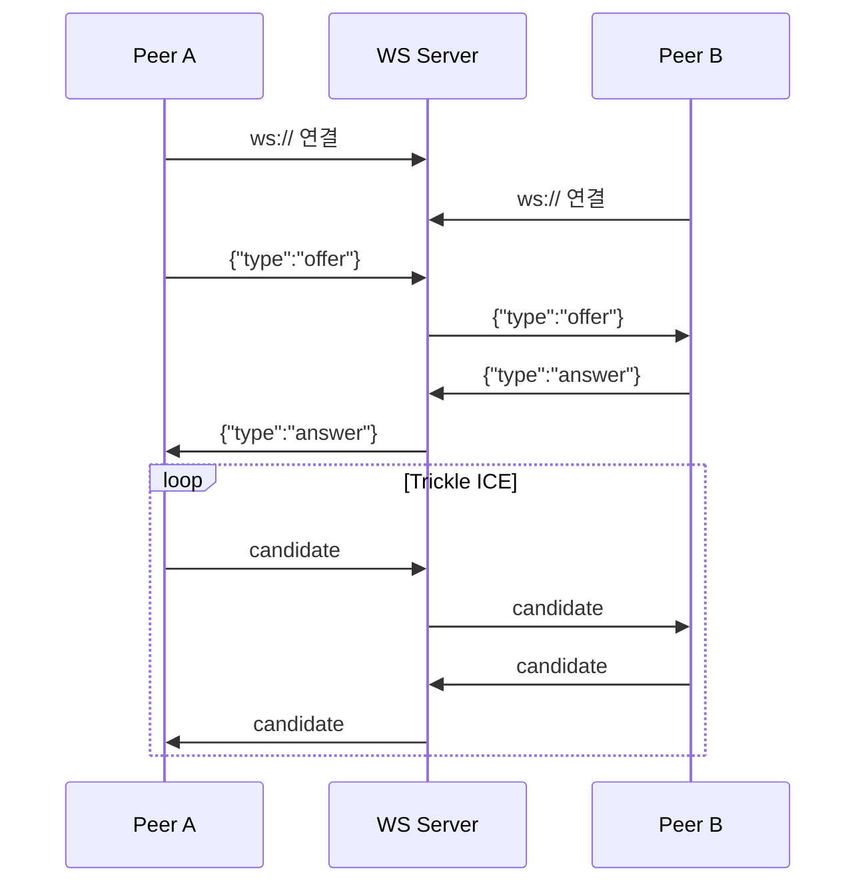

**HTTP REST API** — 폴링 또는 Long Polling 방식. 구현이 간단하지만 실시간성이 떨어진다.

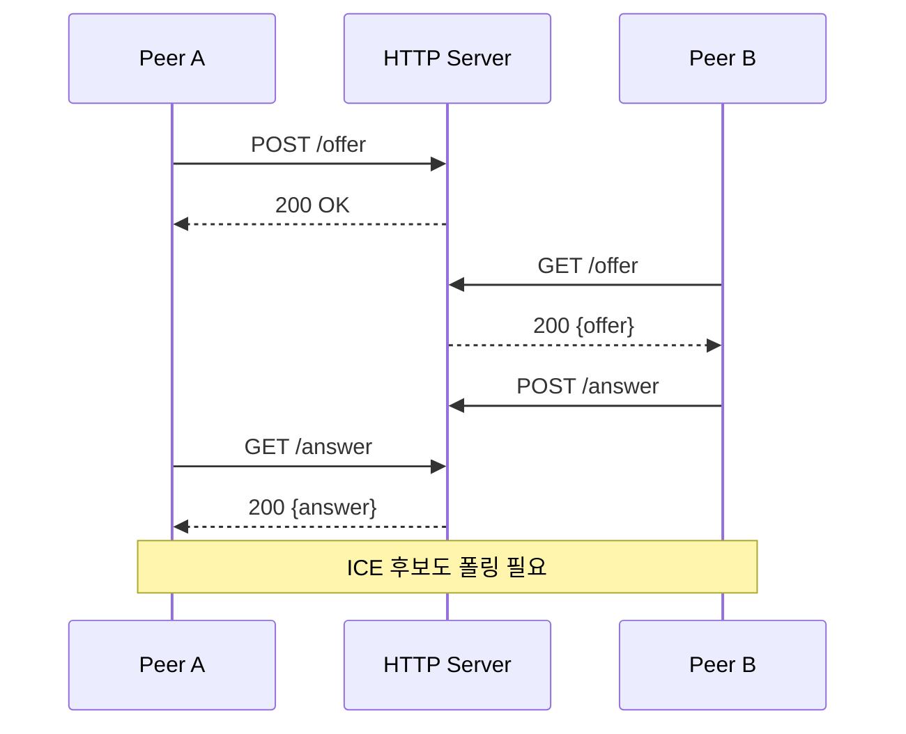

**MQTT** — IoT/로봇 환경에서 이미 MQTT 인프라가 있다면 활용할 수 있다.

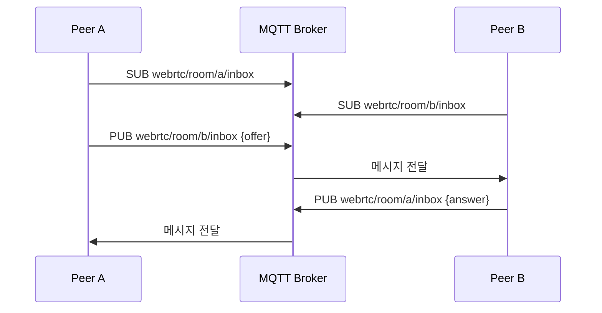

| 항목 | WebSocket | HTTP REST | MQTT |
|------|-----------|-----------|------|
| 방향 | 양방향 | 단방향 (폴링 필요) | 양방향 (Pub/Sub) |
| 실시간성 | 높음 | 낮음~중간 | 높음 |
| Trickle ICE | 자연스러움 | 불편 (폴링) | 자연스러움 |
| 추가 인프라 | 없음 | 없음 | MQTT Broker 필요 |
| 브라우저 지원 | 네이티브 | 네이티브 | 라이브러리 필요 |
| **추천 용도** | **범용 (기본 선택)** | 프로토타입 | IoT/로봇 |

이 글에서는 가장 범용적인 **WebSocket** 방식으로 구현한다.

## 1.2 메시지 프로토콜 설계

모든 메시지는 **JSON 형식**으로 통일한다.

| 방향 | 메시지 타입 | 설명 |
|------|-----------|------|
| Client → Server | `join` | 방 참여 요청 |
| Client → Server | `leave` | 방 퇴장 |
| Client → Server | `offer` / `answer` / `candidate` | SDP/ICE 전달 |
| Server → Client | `peer-joined` / `peer-left` | 피어 입퇴장 알림 |
| Server → Client | `offer` / `answer` / `candidate` | SDP/ICE 중계 |
| Server → Client | `room-info` / `error` | 방 정보 / 에러 |

```json
{
  "type": "offer",
  "from": "peer-a",
  "to": "peer-b",
  "room": "room-123",
  "payload": { ... }
}
```

## 1.3 서버 설계

### 1.3.1 데이터 구조

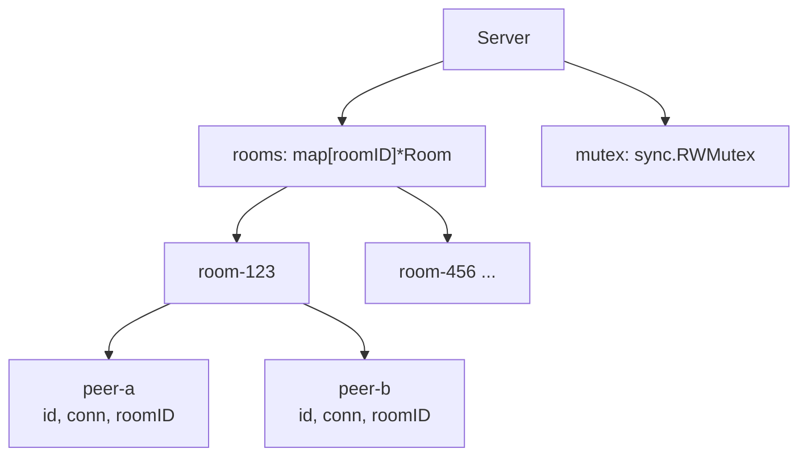

### 1.3.2 메시지 흐름

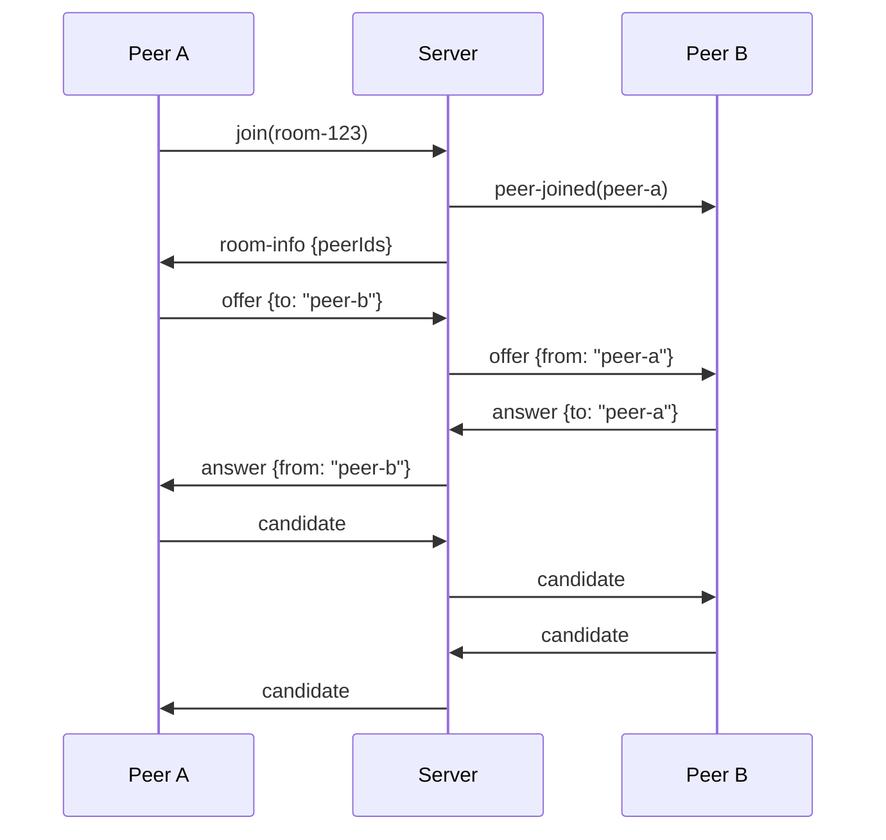

서버는 `to` 필드를 보고 해당 피어에게 메시지를 **그대로 전달**할 뿐이다.

## 1.4 Golang 구현

### 1.4.1 프로젝트 구조

```
signaling-server/
├── main.go           # 서버 진입점
├── server.go         # SignalingServer 핵심 로직
├── room.go           # Room 관리
├── peer.go           # Peer 관리 (WebSocket 연결)
├── message.go        # 메시지 타입 정의
├── go.mod
└── go.sum
```

### 1.4.2 메시지 타입 정의 (message.go)

```go
// message.go
package main

import "encoding/json"

// 메시지 타입 상수
const (
	TypeJoin      = "join"
	TypeLeave     = "leave"
	TypeOffer     = "offer"
	TypeAnswer    = "answer"
	TypeCandidate = "candidate"

	// 서버 → 클라이언트
	TypePeerJoined = "peer-joined"
	TypePeerLeft   = "peer-left"
	TypeRoomInfo   = "room-info"
	TypeError      = "error"
)

// Message는 클라이언트와 서버 간 교환되는 메시지이다.
type Message struct {
	Type    string          `json:"type"`
	From    string          `json:"from,omitempty"`
	To      string          `json:"to,omitempty"`
	Room    string          `json:"room,omitempty"`
	Payload json.RawMessage `json:"payload,omitempty"`
}

// RoomInfoPayload는 방 정보 응답이다.
type RoomInfoPayload struct {
	RoomID  string   `json:"roomId"`
	PeerIDs []string `json:"peerIds"`
}

// ErrorPayload는 에러 응답이다.
type ErrorPayload struct {
	Code    string `json:"code"`
	Message string `json:"message"`
}
```

`Payload`를 `json.RawMessage`로 선언하여 SDP/ICE 내용을 **파싱 없이 그대로 중계**한다.

### 1.4.3 Peer 구현 (peer.go)

```go
// peer.go
package main

import (
	"encoding/json"
	"log"
	"sync"

	"github.com/gorilla/websocket"
)

// Peer는 하나의 WebSocket 연결을 나타낸다.
type Peer struct {
	id     string
	conn   *websocket.Conn
	roomID string
	mu     sync.Mutex // 쓰기 동시성 보호
}

// NewPeer는 새 Peer를 생성한다.
func NewPeer(id string, conn *websocket.Conn) *Peer {
	return &Peer{
		id:   id,
		conn: conn,
	}
}

// Send는 피어에게 메시지를 전송한다.
func (p *Peer) Send(msg *Message) error {
	p.mu.Lock()
	defer p.mu.Unlock()
	return p.conn.WriteJSON(msg)
}

// SendError는 에러 메시지를 전송한다.
func (p *Peer) SendError(code, message string) {
	payload, _ := json.Marshal(ErrorPayload{
		Code:    code,
		Message: message,
	})
	p.Send(&Message{
		Type:    TypeError,
		Payload: payload,
	})
}

// ReadLoop는 피어로부터 메시지를 읽는 루프이다.
func (p *Peer) ReadLoop(handler func(*Peer, *Message)) {
	defer p.conn.Close()

	for {
		var msg Message
		if err := p.conn.ReadJSON(&msg); err != nil {
			if websocket.IsUnexpectedCloseError(err,
				websocket.CloseGoingAway,
				websocket.CloseNormalClosure,
			) {
				log.Printf("peer %s: read error: %v", p.id, err)
			}
			return
		}
		msg.From = p.id // 발신자를 서버에서 설정 (클라이언트 위변조 방지)
		handler(p, &msg)
	}
}
```

`msg.From = p.id`를 서버에서 강제 설정하여 클라이언트의 `from` 위변조를 방지한다.

### 1.4.4 Room 구현 (room.go)

```go
// room.go
package main

import (
	"encoding/json"
	"log"
	"sync"
)

// Room은 하나의 통화방을 나타낸다.
type Room struct {
	id    string
	peers map[string]*Peer
	mu    sync.RWMutex
}

// NewRoom은 새 Room을 생성한다.
func NewRoom(id string) *Room {
	return &Room{
		id:    id,
		peers: make(map[string]*Peer),
	}
}

// AddPeer는 방에 피어를 추가한다.
func (r *Room) AddPeer(peer *Peer) {
	r.mu.Lock()
	defer r.mu.Unlock()

	peer.roomID = r.id
	r.peers[peer.id] = peer

	log.Printf("room %s: peer %s joined (total: %d)", r.id, peer.id, len(r.peers))
}

// RemovePeer는 방에서 피어를 제거한다.
func (r *Room) RemovePeer(peerID string) {
	r.mu.Lock()
	defer r.mu.Unlock()

	delete(r.peers, peerID)

	log.Printf("room %s: peer %s left (total: %d)", r.id, peerID, len(r.peers))
}

// GetPeer는 특정 피어를 반환한다.
func (r *Room) GetPeer(peerID string) *Peer {
	r.mu.RLock()
	defer r.mu.RUnlock()

	return r.peers[peerID]
}

// PeerIDs는 현재 방의 피어 ID 목록을 반환한다.
func (r *Room) PeerIDs() []string {
	r.mu.RLock()
	defer r.mu.RUnlock()

	ids := make([]string, 0, len(r.peers))
	for id := range r.peers {
		ids = append(ids, id)
	}
	return ids
}

// Broadcast는 특정 피어를 제외한 모든 피어에게 메시지를 전송한다.
func (r *Room) Broadcast(msg *Message, excludePeerID string) {
	r.mu.RLock()
	defer r.mu.RUnlock()

	for id, peer := range r.peers {
		if id == excludePeerID {
			continue
		}
		if err := peer.Send(msg); err != nil {
			log.Printf("room %s: failed to send to peer %s: %v", r.id, id, err)
		}
	}
}

// SendTo는 특정 피어에게 메시지를 전송한다.
func (r *Room) SendTo(peerID string, msg *Message) bool {
	r.mu.RLock()
	defer r.mu.RUnlock()

	peer, ok := r.peers[peerID]
	if !ok {
		return false
	}
	if err := peer.Send(msg); err != nil {
		log.Printf("room %s: failed to send to peer %s: %v", r.id, peerID, err)
		return false
	}
	return true
}

// IsEmpty는 방이 비어있는지 확인한다.
func (r *Room) IsEmpty() bool {
	r.mu.RLock()
	defer r.mu.RUnlock()

	return len(r.peers) == 0
}

// NotifyPeerJoined는 기존 피어들에게 새 피어 입장을 알린다.
func (r *Room) NotifyPeerJoined(newPeerID string) {
	payload, _ := json.Marshal(map[string]string{"peerId": newPeerID})
	r.Broadcast(&Message{
		Type:    TypePeerJoined,
		Payload: payload,
	}, newPeerID)
}

// NotifyPeerLeft는 남은 피어들에게 퇴장을 알린다.
func (r *Room) NotifyPeerLeft(leftPeerID string) {
	payload, _ := json.Marshal(map[string]string{"peerId": leftPeerID})
	r.Broadcast(&Message{
		Type:    TypePeerLeft,
		Payload: payload,
	}, leftPeerID)
}
```

### 1.4.5 Signaling Server 핵심 로직 (server.go)

```go
// server.go
package main

import (
	"encoding/json"
	"log"
	"net/http"
	"sync"

	"github.com/gorilla/websocket"
)

var upgrader = websocket.Upgrader{
	ReadBufferSize:  1024,
	WriteBufferSize: 1024,
	CheckOrigin: func(r *http.Request) bool {
		return true // 개발 환경용. 프로덕션에서는 Origin 검증 필요
	},
}

// SignalingServer는 WebRTC Signaling 서버이다.
type SignalingServer struct {
	rooms map[string]*Room
	mu    sync.RWMutex
}

// NewSignalingServer는 새 Signaling 서버를 생성한다.
func NewSignalingServer() *SignalingServer {
	return &SignalingServer{
		rooms: make(map[string]*Room),
	}
}

// HandleWebSocket은 WebSocket 연결을 처리하는 HTTP 핸들러이다.
func (s *SignalingServer) HandleWebSocket(w http.ResponseWriter, r *http.Request) {
	conn, err := upgrader.Upgrade(w, r, nil)
	if err != nil {
		log.Printf("upgrade error: %v", err)
		return
	}

	peerID := r.URL.Query().Get("peerId")
	if peerID == "" {
		conn.WriteJSON(Message{Type: TypeError, Payload: marshalJSON(ErrorPayload{
			Code: "MISSING_PEER_ID", Message: "peerId is required",
		})})
		conn.Close()
		return
	}

	peer := NewPeer(peerID, conn)
	log.Printf("peer %s connected", peerID)

	defer s.handleDisconnect(peer)
	peer.ReadLoop(s.handleMessage)
}

// handleMessage는 수신한 메시지를 타입별로 처리한다.
func (s *SignalingServer) handleMessage(peer *Peer, msg *Message) {
	switch msg.Type {
	case TypeJoin:
		s.handleJoin(peer, msg)
	case TypeLeave:
		s.handleLeave(peer)
	case TypeOffer, TypeAnswer, TypeCandidate:
		s.handleRelay(peer, msg)
	default:
		peer.SendError("UNKNOWN_TYPE", "unknown message type: "+msg.Type)
	}
}

// handleJoin은 방 참여를 처리한다.
func (s *SignalingServer) handleJoin(peer *Peer, msg *Message) {
	roomID := msg.Room
	if roomID == "" {
		peer.SendError("MISSING_ROOM", "room is required")
		return
	}

	if peer.roomID != "" {
		s.handleLeave(peer)
	}

	room := s.getOrCreateRoom(roomID)
	room.AddPeer(peer)
	room.NotifyPeerJoined(peer.id)

	payload, _ := json.Marshal(RoomInfoPayload{
		RoomID:  roomID,
		PeerIDs: room.PeerIDs(),
	})
	peer.Send(&Message{
		Type:    TypeRoomInfo,
		Payload: payload,
	})
}

// handleLeave는 방 퇴장을 처리한다.
func (s *SignalingServer) handleLeave(peer *Peer) {
	if peer.roomID == "" {
		return
	}

	s.mu.RLock()
	room, ok := s.rooms[peer.roomID]
	s.mu.RUnlock()

	if !ok {
		return
	}

	room.RemovePeer(peer.id)
	room.NotifyPeerLeft(peer.id)

	if room.IsEmpty() {
		s.mu.Lock()
		delete(s.rooms, room.id)
		s.mu.Unlock()
		log.Printf("room %s removed (empty)", room.id)
	}

	peer.roomID = ""
}

// handleRelay는 Offer/Answer/Candidate를 대상 피어에게 중계한다.
func (s *SignalingServer) handleRelay(peer *Peer, msg *Message) {
	if peer.roomID == "" {
		peer.SendError("NOT_IN_ROOM", "join a room first")
		return
	}

	s.mu.RLock()
	room, ok := s.rooms[peer.roomID]
	s.mu.RUnlock()

	if !ok {
		peer.SendError("ROOM_NOT_FOUND", "room not found")
		return
	}

	if msg.To == "" {
		room.Broadcast(msg, peer.id)
		return
	}

	if !room.SendTo(msg.To, msg) {
		peer.SendError("PEER_NOT_FOUND", "peer not found: "+msg.To)
	}
}

// handleDisconnect는 WebSocket 연결 종료를 처리한다.
func (s *SignalingServer) handleDisconnect(peer *Peer) {
	log.Printf("peer %s disconnected", peer.id)
	s.handleLeave(peer)
}

// getOrCreateRoom은 방을 조회하거나 새로 생성한다.
func (s *SignalingServer) getOrCreateRoom(roomID string) *Room {
	s.mu.Lock()
	defer s.mu.Unlock()

	room, ok := s.rooms[roomID]
	if !ok {
		room = NewRoom(roomID)
		s.rooms[roomID] = room
		log.Printf("room %s created", roomID)
	}
	return room
}

func marshalJSON(v interface{}) json.RawMessage {
	data, _ := json.Marshal(v)
	return data
}
```

### 1.4.6 서버 진입점 (main.go)

```go
// main.go
package main

import (
	"log"
	"net/http"
)

func main() {
	server := NewSignalingServer()

	http.HandleFunc("/ws", server.HandleWebSocket)

	http.HandleFunc("/health", func(w http.ResponseWriter, r *http.Request) {
		w.WriteHeader(http.StatusOK)
		w.Write([]byte("ok"))
	})

	addr := ":8080"
	log.Printf("Signaling server starting on %s", addr)
	if err := http.ListenAndServe(addr, nil); err != nil {
		log.Fatal(err)
	}
}
```

```bash
# 의존성 초기화 및 실행
go mod init signaling-server
go get github.com/gorilla/websocket
go run .
```

## 1.5 브라우저 클라이언트

### 1.5.1 SignalingClient 클래스

```javascript
class SignalingClient {
  constructor(serverUrl, peerId) {
    this.peerId = peerId;
    this.ws = new WebSocket(`${serverUrl}?peerId=${peerId}`);
    this.handlers = {};

    this.ws.onmessage = (event) => {
      const msg = JSON.parse(event.data);
      const handler = this.handlers[msg.type];
      if (handler) handler(msg);
    };

    this.ws.onclose = () => {
      console.log('Signaling connection closed');
    };
  }

  join(roomId) {
    this.send({ type: 'join', room: roomId });
  }

  sendOffer(toPeerId, sdp) {
    this.send({ type: 'offer', to: toPeerId, payload: sdp });
  }

  sendAnswer(toPeerId, sdp) {
    this.send({ type: 'answer', to: toPeerId, payload: sdp });
  }

  sendCandidate(toPeerId, candidate) {
    this.send({ type: 'candidate', to: toPeerId, payload: candidate });
  }

  on(type, handler) {
    this.handlers[type] = handler;
  }

  send(msg) {
    this.ws.send(JSON.stringify(msg));
  }
}
```

### 1.5.2 WebRTC 연결 통합 예시

```javascript
const signaling = new SignalingClient('wss://signal.example.com/ws', 'peer-a');
let pc = null;

signaling.join('room-123');

// 새 피어 입장 → Offer 시작
signaling.on('peer-joined', async (msg) => {
  const remotePeerId = msg.payload.peerId;
  pc = createPeerConnection(remotePeerId);

  const stream = await navigator.mediaDevices.getUserMedia({ audio: true, video: true });
  stream.getTracks().forEach(track => pc.addTrack(track, stream));

  const offer = await pc.createOffer();
  await pc.setLocalDescription(offer);
  signaling.sendOffer(remotePeerId, pc.localDescription);
});

// Offer 수신 → Answer 생성
signaling.on('offer', async (msg) => {
  pc = createPeerConnection(msg.from);

  await pc.setRemoteDescription(new RTCSessionDescription(msg.payload));

  const stream = await navigator.mediaDevices.getUserMedia({ audio: true, video: true });
  stream.getTracks().forEach(track => pc.addTrack(track, stream));

  const answer = await pc.createAnswer();
  await pc.setLocalDescription(answer);
  signaling.sendAnswer(msg.from, pc.localDescription);
});

// Answer/Candidate 수신
signaling.on('answer', async (msg) => {
  await pc.setRemoteDescription(new RTCSessionDescription(msg.payload));
});

signaling.on('candidate', async (msg) => {
  await pc.addIceCandidate(new RTCIceCandidate(msg.payload));
});

function createPeerConnection(remotePeerId) {
  const pc = new RTCPeerConnection({
    iceServers: [{ urls: 'stun:stun.l.google.com:19302' }]
  });

  pc.onicecandidate = (event) => {
    if (event.candidate) {
      signaling.sendCandidate(remotePeerId, event.candidate);
    }
  };

  pc.ontrack = (event) => {
    document.getElementById('remoteVideo').srcObject = event.streams[0];
  };

  return pc;
}
```

## 1.6 프로덕션 고려사항

### 인증 흐름

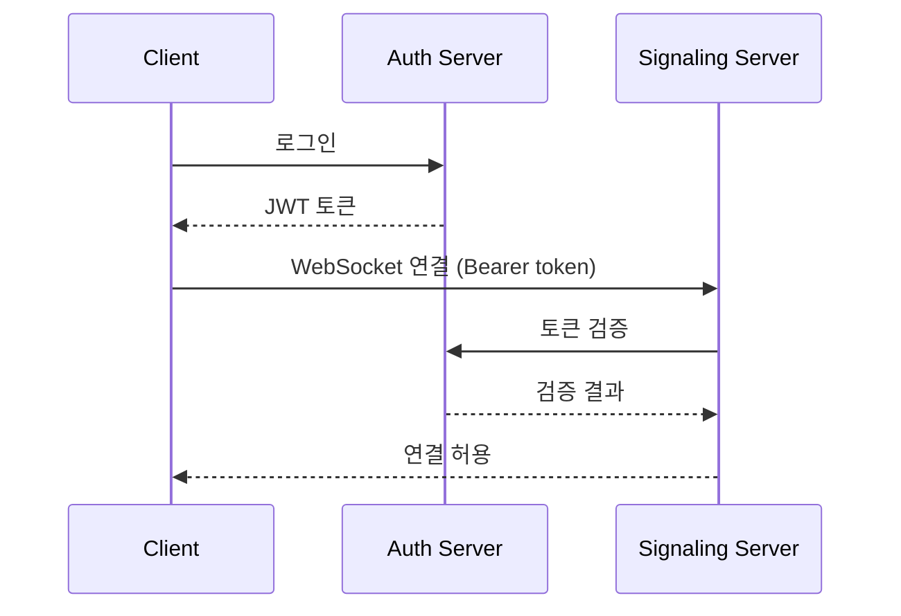

### 프로덕션 체크리스트

| 항목 | 최소 서버 | 프로덕션 |
|------|----------|---------|
| 인증/권한 | X | JWT 또는 세션 기반 인증 |
| TLS (WSS) | X | 필수. Let's Encrypt 또는 리버스 프록시 |
| 방 크기 제한 | X | 서비스 요구사항에 맞게 |
| Heartbeat | X | Ping/Pong으로 좀비 연결 감지 |
| 재연결 처리 | X | 클라이언트 재연결 시 방 복귀 |
| 로깅/모니터링 | 기본 log | 구조화된 로깅 (JSON), 메트릭 수집 |
| 수평 확장 | 단일 인스턴스 | Redis Pub/Sub로 인스턴스 간 동기화 |
| Rate Limiting | X | 피어당 메시지 빈도 제한 |
| Origin 검증 | 모든 Origin 허용 | 허용된 도메인만 |

### 수평 확장

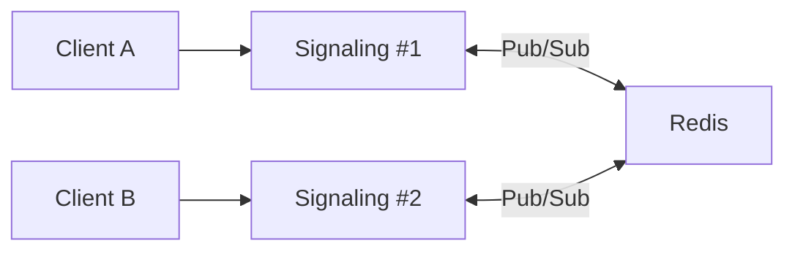

여러 인스턴스를 운영할 때, 서로 다른 인스턴스에 연결된 피어 간 메시지를 Redis Pub/Sub로 동기화한다.

# 2. Pion WebRTC 라이브러리

## 2.1 Pion 소개와 선택 이유

[Pion](https://github.com/pion/webrtc)은 **Pure Go**로 구현된 WebRTC 라이브러리이다. W3C 명세를 Go로 충실히 구현하여, Golang 애플리케이션이 브라우저와 직접 통신할 수 있게 해준다.

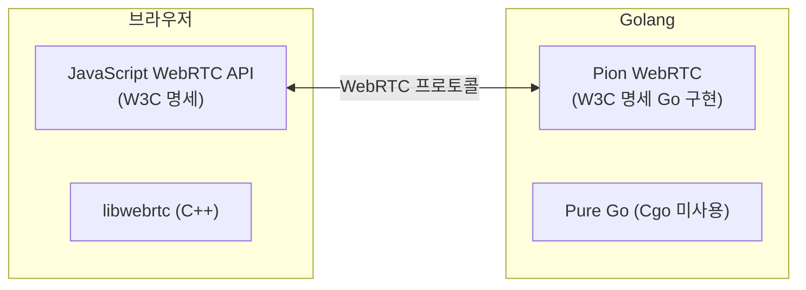

| 라이브러리 | 언어 | 특징 |
|-----------|------|------|
| **Pion** | Pure Go | Cgo 없음, 크로스 플랫폼, MIT 라이선스 |
| libwebrtc 바인딩 | C++ + Go | Google 공식 구현, 빌드 복잡 |
| GStreamer 바인딩 | C + Go | 미디어 파이프라인 강력, Cgo 필요 |

**Pion을 선택하는 이유**:

- **빌드**: 크로스 컴파일 간단 (`GOOS=linux GOARCH=arm go build`), Docker 이미지 경량화 (scratch 사용 가능)
- **배포**: 단일 바이너리, 라즈베리파이/ARM 서버에 그대로 배포
- **디버깅**: Go 표준 도구 (pprof, race detector) 사용, C++ 메모리 이슈 없음
- **생태계**: GitHub 16,000+ 스타, MIT 라이선스, 활발한 Discord 커뮤니티

## 2.2 모듈 구조

```
github.com/pion/
├── webrtc/v4        ← 핵심: PeerConnection, Track, DataChannel
├── ice/v4           ← ICE Agent, 후보 수집
├── dtls/v3          ← DTLS 핸드셰이크
├── srtp/v3          ← SRTP 암호화/복호화
├── rtp/v2           ← RTP 패킷 파싱/생성
├── rtcp/v2          ← RTCP 패킷 파싱/생성
├── sdp/v3           ← SDP 파싱/생성
├── sctp             ← SCTP (DataChannel 전송)
├── interceptor      ← RTP/RTCP 미들웨어
└── logging          ← 로깅 프레임워크
```

대부분 `github.com/pion/webrtc/v4`만 임포트하면 된다. 저수준 제어(RTP 패킷 직접 조작 등)가 필요할 때만 개별 모듈을 사용한다.

## 2.3 주요 컴포넌트

### 2.3.1 PeerConnection

```go
// PeerConnection 생성
config := webrtc.Configuration{
    ICEServers: []webrtc.ICEServer{
        {URLs: []string{"stun:stun.l.google.com:19302"}},
        {
            URLs:       []string{"turn:turn.example.com:3478"},
            Username:   "user",
            Credential: "pass",
        },
    },
}

pc, err := webrtc.NewPeerConnection(config)
if err != nil {
    log.Fatal(err)
}
defer pc.Close()
```

```go
// Offer/Answer 교환
// ── Offerer 측
offer, err := pc.CreateOffer(nil)
if err != nil {
    log.Fatal(err)
}
err = pc.SetLocalDescription(offer)

// ── Answerer 측
err = pc.SetRemoteDescription(webrtc.SessionDescription{
    Type: webrtc.SDPTypeOffer,
    SDP:  offerSDP, // 시그널링으로 수신
})
answer, err := pc.CreateAnswer(nil)
err = pc.SetLocalDescription(answer)
```

```go
// ICE Candidate 처리
pc.OnICECandidate(func(candidate *webrtc.ICECandidate) {
    if candidate == nil {
        return // 수집 완료
    }
    sendViaSignaling(candidate.ToJSON())
})

err = pc.AddICECandidate(webrtc.ICECandidateInit{
    Candidate: candidateString,
})
```

연결 상태 모니터링에 대한 자세한 내용은 [basics — 연결 완료 · 상태 변화](../basics/#46-연결-완료--상태-변화)를 참고한다.

```go
pc.OnConnectionStateChange(func(state webrtc.PeerConnectionState) {
    log.Printf("Connection state: %s", state.String())
})
```

### 2.3.2 Track (TrackLocal / TrackRemote)

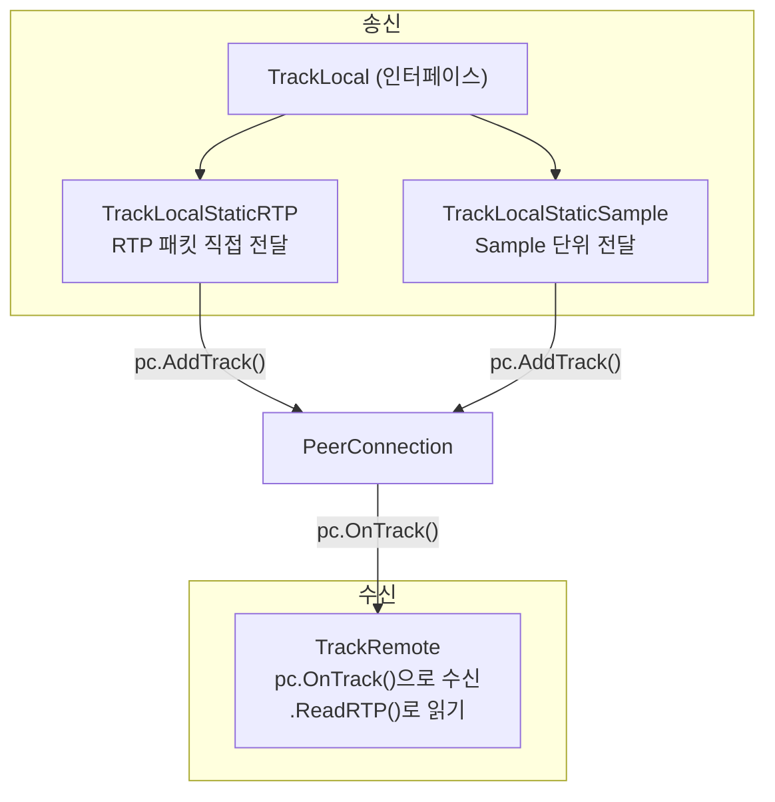

```go
// TrackLocalStaticRTP — RTP 패킷 단위 전송
videoTrack, err := webrtc.NewTrackLocalStaticRTP(
    webrtc.RTPCodecCapability{MimeType: webrtc.MimeTypeVP8},
    "video",        // Track ID
    "video-stream", // Stream ID
)
sender, err := pc.AddTrack(videoTrack)
```

```go
// TrackLocalStaticSample — 샘플 단위 전송 (Pion이 RTP 패킷화 자동 처리)
import "github.com/pion/webrtc/v4/pkg/media"

audioTrack, err := webrtc.NewTrackLocalStaticSample(
    webrtc.RTPCodecCapability{MimeType: webrtc.MimeTypeOpus},
    "audio",
    "audio-stream",
)
pc.AddTrack(audioTrack)

err = audioTrack.WriteSample(media.Sample{
    Data:     opusFrame,
    Duration: 20 * time.Millisecond,
})
```

```go
// TrackRemote — 원격 미디어 수신
pc.OnTrack(func(remoteTrack *webrtc.TrackRemote, receiver *webrtc.RTPReceiver) {
    log.Printf("Track received: kind=%s, codec=%s",
        remoteTrack.Kind(), remoteTrack.Codec().MimeType)

    for {
        rtpPacket, _, err := remoteTrack.ReadRTP()
        if err != nil {
            return
        }
        processRTPPacket(rtpPacket)
    }
})
```

### 2.3.3 DataChannel

DataChannel의 개념은 [basics — DataChannel](../basics/#24-datachannel)을 참고한다.

```go
// 생성 측 (Offerer)
ordered := true
dc, err := pc.CreateDataChannel("chat", &webrtc.DataChannelInit{
    Ordered: &ordered,
})

dc.OnOpen(func() {
    dc.SendText("Hello from Go!")
    dc.Send([]byte{0x01, 0x02, 0x03})
})

dc.OnMessage(func(msg webrtc.DataChannelMessage) {
    if msg.IsText {
        log.Printf("Text: %s", string(msg.Data))
    } else {
        log.Printf("Binary: %d bytes", len(msg.Data))
    }
})
```

```go
// 수신 측 (Answerer)
pc.OnDataChannel(func(dc *webrtc.DataChannel) {
    dc.OnOpen(func() {
        log.Println("DataChannel opened")
    })
    dc.OnMessage(func(msg webrtc.DataChannelMessage) {
        dc.SendText("Echo: " + string(msg.Data))
    })
})
```

### 2.3.4 RTPTransceiver

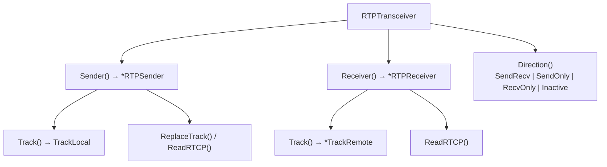

```go
// RTCP 피드백 읽기 (NACK, PLI 등)
go func() {
    sender, _ := pc.AddTrack(videoTrack)
    for {
        rtcpPackets, _, err := sender.ReadRTCP()
        if err != nil {
            return
        }
        for _, pkt := range rtcpPackets {
            switch pkt.(type) {
            case *rtcp.PictureLossIndication:
                log.Println("PLI: 키프레임 요청")
            case *rtcp.ReceiverEstimatedMaximumBitrate:
                log.Println("REMB: 비트레이트 조절")
            }
        }
    }
}()
```

## 2.4 브라우저 API와의 비교

### 2.4.1 API 대응표

| 브라우저 (JavaScript) | Pion (Go) | 차이점 |
|----------------------|-----------|--------|
| `new RTCPeerConnection(config)` | `webrtc.NewPeerConnection(config)` | Go는 에러 반환 |
| `pc.createOffer()` | `pc.CreateOffer(nil)` | Promise → (값, error) |
| `pc.createAnswer()` | `pc.CreateAnswer(nil)` | Promise → (값, error) |
| `pc.setLocalDescription(sdp)` | `pc.SetLocalDescription(sdp)` | 동일 |
| `pc.setRemoteDescription(sdp)` | `pc.SetRemoteDescription(sdp)` | 동일 |
| `pc.addIceCandidate(c)` | `pc.AddICECandidate(c)` | 동일 |
| `pc.addTrack(track, stream)` | `pc.AddTrack(track)` | Go는 stream 인자 없음 |
| `pc.createDataChannel(label)` | `pc.CreateDataChannel(label, opts)` | 동일 |
| `pc.ontrack = fn` | `pc.OnTrack(fn)` | 이벤트 → 콜백 메서드 |
| `pc.onicecandidate = fn` | `pc.OnICECandidate(fn)` | 동일 패턴 |
| `pc.close()` | `pc.Close()` | 동일 |

### 2.4.2 핵심 차이점

**getUserMedia가 없다** — Go 서버는 보통 카메라가 없으므로, 미디어 소스를 직접 제어한다.

| 소스 | 방법 |
|------|------|
| 파일 (IVF, Ogg) | `play-from-disk` 패턴 |
| 카메라/마이크 | `github.com/pion/mediadevices` |
| FFmpeg/GStreamer | RTP → Pion (`rtp-to-webrtc` 패턴) |
| 다른 피어 | `OnTrack` → 다른 PC에 `AddTrack` (SFU 패턴) |

**동시성 모델** — 브라우저는 단일 스레드(이벤트 루프)이지만, Go는 고루틴을 사용한다. `OnTrack` 콜백 내에서 무한 루프로 RTP 패킷을 읽는 패턴은 Go에서만 가능하다.

## 2.5 Pion 전용 기능

### 2.5.1 SettingEngine

```go
se := webrtc.SettingEngine{}
se.SetEphemeralUDPPortRange(50000, 60000) // ICE 포트 범위 제한
se.SetLite(true)                           // ICE Lite 모드
se.SetNAT1To1IPs([]string{"203.0.113.5"}, webrtc.ICECandidateTypeHost)

api := webrtc.NewAPI(webrtc.WithSettingEngine(se))
pc, err := api.NewPeerConnection(config)
```

### 2.5.2 Interceptor

```go
import "github.com/pion/interceptor"

m := &webrtc.MediaEngine{}
m.RegisterDefaultCodecs()

i := &interceptor.Registry{}
webrtc.RegisterDefaultInterceptors(m, i) // NACK, TWCC 등 자동 등록

api := webrtc.NewAPI(
    webrtc.WithMediaEngine(m),
    webrtc.WithInterceptorRegistry(i),
)
pc, err := api.NewPeerConnection(config)
```

### 2.5.3 MediaEngine

```go
m := &webrtc.MediaEngine{}
m.RegisterCodec(webrtc.RTPCodecParameters{
    RTPCodecCapability: webrtc.RTPCodecCapability{
        MimeType:    webrtc.MimeTypeOpus,
        ClockRate:   48000,
        Channels:    2,
        SDPFmtpLine: "minptime=10;useinbandfec=1",
    },
    PayloadType: 111,
}, webrtc.RTPCodecTypeAudio)

api := webrtc.NewAPI(webrtc.WithMediaEngine(m))
```

## 2.6 Pion 공식 예제 학습 가이드

| 예제 | 설명 | 학습 포인트 |
|------|------|------------|
| **data-channels** | 브라우저와 메시지 교환 | CreateDataChannel, OnDataChannel |
| **reflect** | 수신 미디어를 그대로 돌려보냄 | OnTrack, AddTrack |
| **play-from-disk** | 파일 → 브라우저 영상 전송 | TrackLocalStaticSample |
| **save-to-disk** | 브라우저 영상 → 파일 저장 | TrackRemote.ReadRTP |
| **broadcast** | 1:N 영상 브로드캐스트 | 한 트랙을 여러 PC에 AddTrack |
| **rtp-to-webrtc** | RTP → WebRTC 변환 | FFmpeg/GStreamer 연동 |
| **trickle-ice** | Trickle ICE 구현 | OnICECandidate 타이밍 |
| **ice-single-port** | 단일 포트 서빙 | SettingEngine, 서버 배포 |

**추천 학습 순서**: `data-channels` → `reflect` → `play-from-disk` → `save-to-disk` → `broadcast` → `ice-single-port`

# 3. 실습: 브라우저 ↔ Golang 첫 WebRTC 연결

## 3.1 실습 목표와 구조

브라우저에서 텍스트를 입력하면 Golang 서버가 Echo를 돌려주는 **DataChannel 기반 통신**이다. [Signaling → ICE → DTLS](../basics/#41-6단계-개요) 흐름을 체험하는 것이 목표이며, 미디어(영상/음성)는 사용하지 않는다.

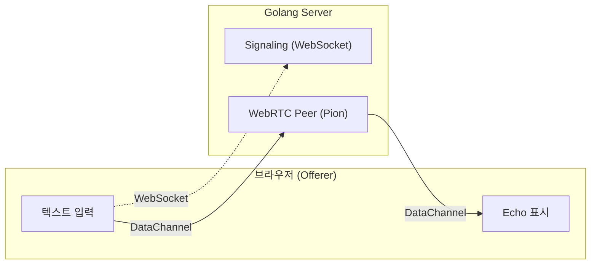

```
webrtc-first-connection/
├── main.go              # Signaling + WebRTC 피어 (하나의 프로세스)
├── web/
│   └── index.html       # 브라우저 클라이언트
├── go.mod
└── go.sum
```

## 3.2 Signaling 메시지 프로토콜

```json
// Offer (브라우저 → 서버)
{ "type": "offer", "sdp": "v=0\r\no=- ..." }

// Answer (서버 → 브라우저)
{ "type": "answer", "sdp": "v=0\r\no=- ..." }

// ICE Candidate (양방향)
{ "type": "candidate", "candidate": "candidate:...", "sdpMLineIndex": 0, "sdpMid": "0" }
```

## 3.3 Golang 서버 구현 (main.go)

```go
package main

import (
	"encoding/json"
	"fmt"
	"log"
	"net/http"
	"sync"

	"github.com/gorilla/websocket"
	"github.com/pion/webrtc/v4"
)

// ──── 메시지 타입 ────

type SignalingMessage struct {
	Type          string  `json:"type"`
	SDP           string  `json:"sdp,omitempty"`
	Candidate     string  `json:"candidate,omitempty"`
	SDPMLineIndex *uint16 `json:"sdpMLineIndex,omitempty"`
	SDPMid        string  `json:"sdpMid,omitempty"`
}

// ──── WebSocket 설정 ────

var upgrader = websocket.Upgrader{
	CheckOrigin: func(r *http.Request) bool { return true },
}

func main() {
	http.Handle("/", http.FileServer(http.Dir("web")))
	http.HandleFunc("/ws", handleWebSocket)

	addr := ":8080"
	log.Printf("Server starting at http://localhost%s", addr)
	log.Fatal(http.ListenAndServe(addr, nil))
}

func handleWebSocket(w http.ResponseWriter, r *http.Request) {
	conn, err := upgrader.Upgrade(w, r, nil)
	if err != nil {
		log.Printf("WebSocket upgrade error: %v", err)
		return
	}
	defer conn.Close()

	log.Println("Browser connected via WebSocket")

	// ──── 1. PeerConnection 생성 ────
	pc, err := webrtc.NewPeerConnection(webrtc.Configuration{
		ICEServers: []webrtc.ICEServer{
			{URLs: []string{"stun:stun.l.google.com:19302"}},
		},
	})
	if err != nil {
		log.Printf("PeerConnection error: %v", err)
		return
	}
	defer pc.Close()

	var wsMu sync.Mutex
	sendJSON := func(msg SignalingMessage) {
		wsMu.Lock()
		defer wsMu.Unlock()
		if err := conn.WriteJSON(msg); err != nil {
			log.Printf("WebSocket send error: %v", err)
		}
	}

	// ──── 2. ICE Candidate 콜백 ────
	pc.OnICECandidate(func(c *webrtc.ICECandidate) {
		if c == nil {
			return
		}
		candidateJSON := c.ToJSON()
		sendJSON(SignalingMessage{
			Type:          "candidate",
			Candidate:     candidateJSON.Candidate,
			SDPMLineIndex: candidateJSON.SDPMLineIndex,
			SDPMid:        *candidateJSON.SDPMid,
		})
		log.Printf("ICE candidate sent: %s", c.Typ.String())
	})

	// ──── 3. 연결 상태 모니터링 ────
	pc.OnConnectionStateChange(func(state webrtc.PeerConnectionState) {
		log.Printf("Connection state: %s", state.String())
		if state == webrtc.PeerConnectionStateFailed {
			pc.Close()
		}
	})

	pc.OnICEConnectionStateChange(func(state webrtc.ICEConnectionState) {
		log.Printf("ICE connection state: %s", state.String())
	})

	// ──── 4. DataChannel 수신 처리 ────
	pc.OnDataChannel(func(dc *webrtc.DataChannel) {
		log.Printf("DataChannel received: label='%s'", dc.Label())

		dc.OnOpen(func() {
			log.Printf("DataChannel '%s' opened", dc.Label())
			dc.SendText("Connected to Go server!")
		})

		dc.OnMessage(func(msg webrtc.DataChannelMessage) {
			text := string(msg.Data)
			log.Printf("Received: %s", text)

			reply := fmt.Sprintf("Echo: %s", text)
			if err := dc.SendText(reply); err != nil {
				log.Printf("Send error: %v", err)
			}
		})

		dc.OnClose(func() {
			log.Printf("DataChannel '%s' closed", dc.Label())
		})
	})

	// ──── 5. Signaling 메시지 처리 루프 ────
	for {
		var msg SignalingMessage
		if err := conn.ReadJSON(&msg); err != nil {
			if websocket.IsUnexpectedCloseError(err,
				websocket.CloseGoingAway, websocket.CloseNormalClosure) {
				log.Printf("WebSocket read error: %v", err)
			}
			return
		}

		switch msg.Type {
		case "offer":
			log.Println("Offer received")

			err := pc.SetRemoteDescription(webrtc.SessionDescription{
				Type: webrtc.SDPTypeOffer,
				SDP:  msg.SDP,
			})
			if err != nil {
				log.Printf("SetRemoteDescription error: %v", err)
				continue
			}

			answer, err := pc.CreateAnswer(nil)
			if err != nil {
				log.Printf("CreateAnswer error: %v", err)
				continue
			}

			if err = pc.SetLocalDescription(answer); err != nil {
				log.Printf("SetLocalDescription error: %v", err)
				continue
			}

			sendJSON(SignalingMessage{
				Type: "answer",
				SDP:  pc.LocalDescription().SDP,
			})
			log.Println("Answer sent")

		case "candidate":
			log.Printf("ICE candidate received")

			candidateInit := webrtc.ICECandidateInit{
				Candidate:     msg.Candidate,
				SDPMLineIndex: msg.SDPMLineIndex,
				SDPMid:        &msg.SDPMid,
			}

			if err := pc.AddICECandidate(candidateInit); err != nil {
				log.Printf("AddICECandidate error: %v", err)
			}

		default:
			log.Printf("Unknown message type: %s", msg.Type)
		}
	}
}
```

## 3.4 브라우저 클라이언트 구현 (index.html)

```html
<!DOCTYPE html>
<html lang="ko">
<head>
  <meta charset="UTF-8">
  <title>WebRTC First Connection</title>
  <style>
    * { box-sizing: border-box; margin: 0; padding: 0; }
    body { font-family: monospace; max-width: 700px; margin: 40px auto; padding: 0 20px; }
    h1 { margin-bottom: 20px; font-size: 1.4em; }

    .status {
      padding: 8px 12px;
      border-radius: 4px;
      margin-bottom: 16px;
      font-size: 0.9em;
    }
    .status.connecting { background: #fff3cd; }
    .status.connected { background: #d4edda; }
    .status.failed { background: #f8d7da; }

    .controls {
      display: flex;
      gap: 8px;
      margin-bottom: 16px;
    }
    .controls input {
      flex: 1;
      padding: 8px;
      border: 1px solid #ccc;
      border-radius: 4px;
      font-family: monospace;
    }
    .controls button {
      padding: 8px 16px;
      border: none;
      border-radius: 4px;
      cursor: pointer;
      font-family: monospace;
    }
    #connectBtn { background: #007bff; color: white; }
    #connectBtn:disabled { background: #ccc; }
    #sendBtn { background: #28a745; color: white; }
    #sendBtn:disabled { background: #ccc; }

    #log {
      background: #1e1e1e;
      color: #d4d4d4;
      padding: 16px;
      border-radius: 4px;
      height: 400px;
      overflow-y: auto;
      font-size: 0.85em;
      line-height: 1.6;
    }
    .log-send { color: #569cd6; }
    .log-recv { color: #4ec9b0; }
    .log-info { color: #9cdcfe; }
    .log-error { color: #f44747; }
  </style>
</head>
<body>
  <h1>WebRTC First Connection (Browser ↔ Golang)</h1>

  <div id="status" class="status connecting">Disconnected</div>

  <div class="controls">
    <button id="connectBtn" onclick="connect()">Connect</button>
  </div>
  <div class="controls">
    <input id="msgInput" type="text" placeholder="메시지 입력..." disabled
           onkeydown="if(event.key==='Enter') sendMessage()">
    <button id="sendBtn" onclick="sendMessage()" disabled>Send</button>
  </div>

  <div id="log"></div>

  <script>
    let pc = null;
    let dc = null;
    let ws = null;

    function appendLog(text, cls) {
      const el = document.getElementById('log');
      const line = document.createElement('div');
      line.className = cls || '';
      line.textContent = `[${new Date().toLocaleTimeString()}] ${text}`;
      el.appendChild(line);
      el.scrollTop = el.scrollHeight;
    }

    function setStatus(text, cls) {
      const el = document.getElementById('status');
      el.textContent = text;
      el.className = 'status ' + cls;
    }

    async function connect() {
      document.getElementById('connectBtn').disabled = true;
      setStatus('Connecting...', 'connecting');
      appendLog('Starting WebRTC connection...', 'log-info');

      const protocol = location.protocol === 'https:' ? 'wss:' : 'ws:';
      ws = new WebSocket(`${protocol}//${location.host}/ws`);

      ws.onopen = async () => {
        appendLog('WebSocket connected', 'log-info');
        await startWebRTC();
      };

      ws.onmessage = async (event) => {
        const msg = JSON.parse(event.data);
        await handleSignalingMessage(msg);
      };

      ws.onclose = () => {
        appendLog('WebSocket disconnected', 'log-error');
        setStatus('Disconnected', 'failed');
      };
    }

    async function startWebRTC() {
      pc = new RTCPeerConnection({
        iceServers: [{ urls: 'stun:stun.l.google.com:19302' }]
      });

      pc.oniceconnectionstatechange = () => {
        appendLog(`ICE connection state: ${pc.iceConnectionState}`, 'log-info');
      };

      pc.onconnectionstatechange = () => {
        appendLog(`Connection state: ${pc.connectionState}`, 'log-info');
        if (pc.connectionState === 'connected') {
          setStatus('Connected (P2P)', 'connected');
        } else if (pc.connectionState === 'failed') {
          setStatus('Connection Failed', 'failed');
        }
      };

      pc.onicecandidate = (event) => {
        if (event.candidate) {
          ws.send(JSON.stringify({
            type: 'candidate',
            candidate: event.candidate.candidate,
            sdpMLineIndex: event.candidate.sdpMLineIndex,
            sdpMid: event.candidate.sdpMid
          }));
          appendLog(`ICE candidate sent: ${event.candidate.type || 'unknown'}`, 'log-info');
        }
      };

      dc = pc.createDataChannel('chat');

      dc.onopen = () => {
        appendLog('DataChannel opened!', 'log-info');
        document.getElementById('msgInput').disabled = false;
        document.getElementById('sendBtn').disabled = false;
        document.getElementById('msgInput').focus();
      };

      dc.onmessage = (event) => {
        appendLog(`← ${event.data}`, 'log-recv');
      };

      dc.onclose = () => {
        appendLog('DataChannel closed', 'log-info');
        document.getElementById('msgInput').disabled = true;
        document.getElementById('sendBtn').disabled = true;
      };

      const offer = await pc.createOffer();
      await pc.setLocalDescription(offer);

      ws.send(JSON.stringify({
        type: 'offer',
        sdp: pc.localDescription.sdp
      }));
      appendLog('Offer sent', 'log-info');
    }

    async function handleSignalingMessage(msg) {
      switch (msg.type) {
        case 'answer':
          appendLog('Answer received', 'log-info');
          await pc.setRemoteDescription(new RTCSessionDescription({
            type: 'answer',
            sdp: msg.sdp
          }));
          break;

        case 'candidate':
          appendLog('ICE candidate received', 'log-info');
          await pc.addIceCandidate(new RTCIceCandidate({
            candidate: msg.candidate,
            sdpMLineIndex: msg.sdpMLineIndex,
            sdpMid: msg.sdpMid
          }));
          break;
      }
    }

    function sendMessage() {
      const input = document.getElementById('msgInput');
      const text = input.value.trim();
      if (!text || !dc || dc.readyState !== 'open') return;

      dc.send(text);
      appendLog(`→ ${text}`, 'log-send');
      input.value = '';
    }
  </script>
</body>
</html>
```

## 3.5 실행 및 테스트

```bash
mkdir webrtc-first-connection && cd webrtc-first-connection
mkdir web
# main.go, web/index.html 생성 (위 코드 참조)

go mod init webrtc-first-connection
go get github.com/pion/webrtc/v4
go get github.com/gorilla/websocket

go run main.go
# Server starting at http://localhost:8080
```

`http://localhost:8080`에 접속하여 **Connect** → 텍스트 입력 → **Send** 순서로 테스트한다.

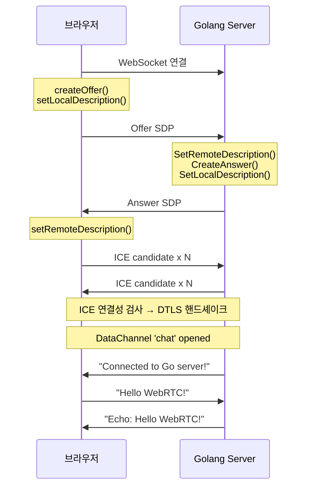

### 정상 동작 시 예상 로그

**브라우저**:

```
[12:00:01] Starting WebRTC connection...
[12:00:01] WebSocket connected
[12:00:01] Offer sent
[12:00:01] Answer received
[12:00:01] ICE connection state: checking
[12:00:01] Connection state: connected
[12:00:01] DataChannel opened!
[12:00:01] ← Connected to Go server!
[12:00:05] → Hello WebRTC!
[12:00:05] ← Echo: Hello WebRTC!
```

**Golang 서버**:

```
Server starting at http://localhost:8080
Browser connected via WebSocket
Offer received
Answer sent
ICE connection state: connected
Connection state: connected
DataChannel received: label='chat'
DataChannel 'chat' opened
Received: Hello WebRTC!
```

## 3.6 트러블슈팅

### 자주 발생하는 문제

| 증상 | 원인 | 해결 |
|------|------|------|
| ICE state: failed | STUN 서버 접근 불가 | 인터넷 확인, 다른 STUN 서버 시도 |
| ICE state: failed | 방화벽이 UDP 차단 | TURN 서버 추가 |
| DataChannel 안 열림 | `createDataChannel`을 Offer 후에 호출 | Offer **전에** 호출해야 SDP에 포함됨 |
| DataChannel 안 열림 | 서버에 `OnDataChannel` 미등록 | 핸들러 등록 확인 |
| WebSocket 연결 실패 | 서버 미실행 또는 포트 충돌 | `go run main.go` 확인, `lsof -i :8080` |

### 디버깅 도구

- **브라우저**: `chrome://webrtc-internals/` — SDP 전문, ICE 후보 목록, 선택된 후보쌍, 연결 상태 타임라인
- **Golang**: SDP 로깅 (`log.Printf("Offer SDP:\n%s", msg.SDP)`)

### ICE Candidate 순서 문제 해결

Answer를 `setRemoteDescription` 하기 전에 ICE Candidate가 도착하면 `addIceCandidate`가 실패한다. Candidate 큐로 해결한다.

```javascript
let pendingCandidates = [];
let remoteDescSet = false;

async function handleSignalingMessage(msg) {
  switch (msg.type) {
    case 'answer':
      await pc.setRemoteDescription(
        new RTCSessionDescription({ type: 'answer', sdp: msg.sdp })
      );
      remoteDescSet = true;

      // 큐에 쌓인 후보 처리
      for (const c of pendingCandidates) {
        await pc.addIceCandidate(c);
      }
      pendingCandidates = [];
      break;

    case 'candidate':
      const candidate = new RTCIceCandidate({
        candidate: msg.candidate,
        sdpMLineIndex: msg.sdpMLineIndex,
        sdpMid: msg.sdpMid
      });

      if (remoteDescSet) {
        await pc.addIceCandidate(candidate);
      } else {
        pendingCandidates.push(candidate); // 큐에 저장
      }
      break;
  }
}
```

# 4. 정리

| 구성 요소 | 핵심 내용 |
|-----------|----------|
| **Signaling** | WebSocket 기반 Room 관리. `from`은 서버가 설정, `payload`는 파싱 없이 중계 |
| **Pion** | Pure Go WebRTC. Cgo 없음, 브라우저 API와 1:1 대응, SettingEngine/Interceptor로 서버 최적화 |
| **연결 흐름** | 브라우저 Offer → 서버 Answer → ICE 교환 → DTLS → DataChannel 열림 |
| **프로덕션** | 인증(JWT), TLS, Heartbeat, 수평 확장(Redis Pub/Sub) 필요 |

# 5. 참고 자료

- [WebRTC for the Curious - Signaling](https://webrtcforthecurious.com/ko/docs/02-signaling/)
- [gorilla/websocket GitHub](https://github.com/gorilla/websocket)
- [Pion WebRTC GitHub](https://github.com/pion/webrtc)
- [Pion WebRTC v4 패키지 문서](https://pkg.go.dev/github.com/pion/webrtc/v4)
- [Pion 공식 예제](https://github.com/pion/webrtc/tree/master/examples)
- [Pion mediadevices](https://github.com/pion/mediadevices)
- [MDN - RTCPeerConnection](https://developer.mozilla.org/en-US/docs/Web/API/RTCPeerConnection)
- [Chrome WebRTC Internals](chrome://webrtc-internals/)
