[basics](../basics/)에서 WebRTC 프로토콜과 토폴로지 이론을, [p2p](../p2p/)에서 Pion 라이브러리와 1:1 연결 실습을 다뤘다. 이번 글에서는 **다자 통화**를 위한 SFU 아키텍처를 이해하고, Pion으로 직접 SFU를 구현한 뒤 LiveKit 매니지드 서비스와 비교한다. 마지막으로 프로덕션 배포에 필수인 **보안(DTLS/SRTP)** 과 **운영(coturn, 모니터링)** 까지 다룬다.

# 1. P2P의 한계와 서버 중계

## 1.1 Full Mesh 연결 수 폭발

1:1 연결을 N명으로 확장하면 **Full Mesh** 구조가 된다. 모든 참가자가 서로 직접 연결하므로, 참가자 수(N)가 늘어나면 연결 수는 **N × (N-1) / 2**로 급증한다.

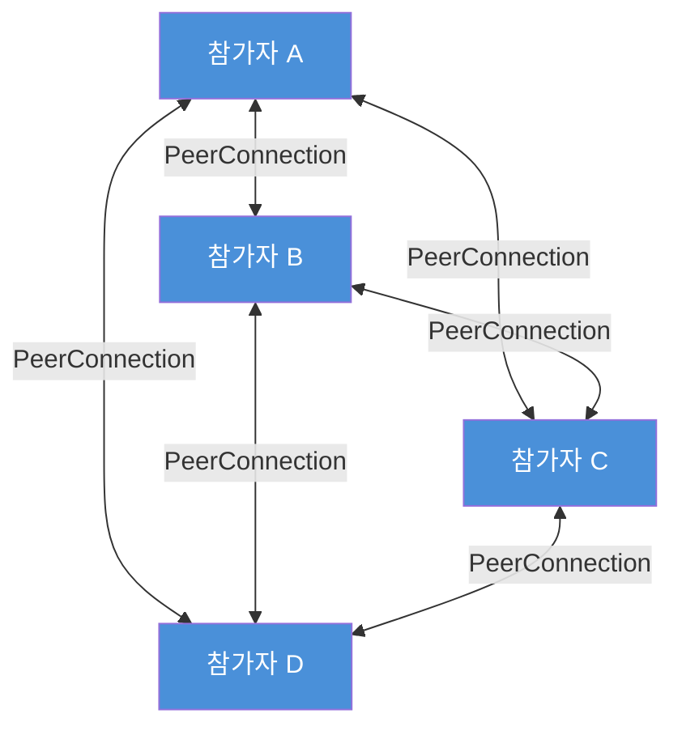

| 참가자 수 | 연결 수 | 인코딩 스트림 (인당) | 총 업로드 |
|-----------|---------|---------------------|-----------|
| 2 | 1 | 1 | 2 |
| 4 | 6 | 3 | 12 |
| 8 | 28 | 7 | 56 |
| 16 | 120 | 15 | 240 |

8명 기준으로 참가자 한 명이 7번 인코딩, 14Mbps 업로드/다운로드가 필요하다. 실무에서 Full Mesh는 **4~5명 이하**에서만 현실적이며, 그 이상은 서버 중계가 필요하다.

> 토폴로지 기초 개념은 [basics — §5. 네트워크 토폴로지](../basics/#5-네트워크-토폴로지)를 참고한다.

## 1.2 세 가지 아키텍처 비교

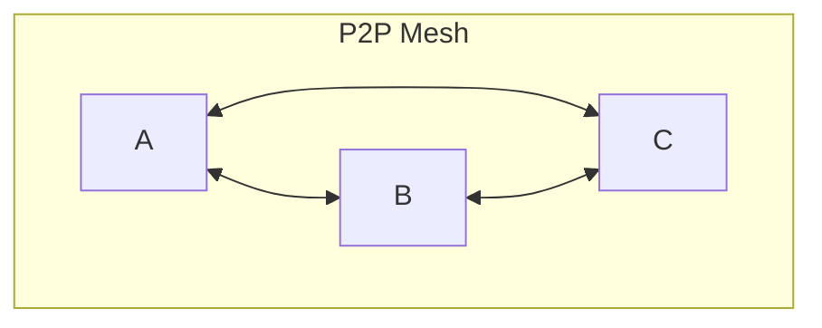

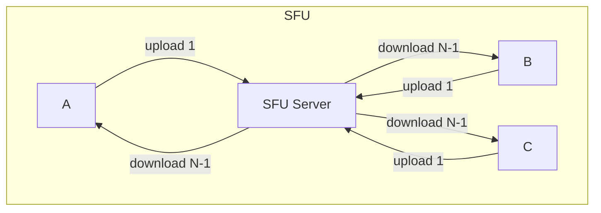

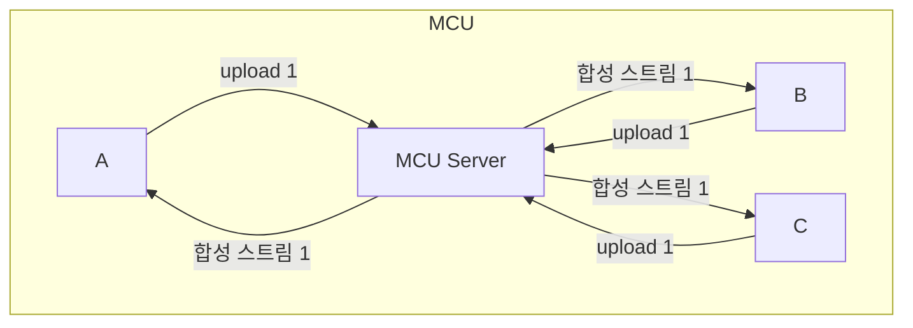

| 항목 | P2P Mesh | SFU | MCU |
|------|----------|-----|-----|
| **서버 역할** | 없음 (Signaling만) | 패킷 포워딩 | 디코딩+합성+인코딩 |
| **클라이언트 업로드** | N-1 스트림 | 1 스트림 | 1 스트림 |
| **클라이언트 다운로드** | N-1 스트림 | N-1 스트림 | 1 스트림 (합성) |
| **서버 CPU** | 없음 | 낮음 | **매우 높음** |
| **서버 대역폭** | 없음 | 높음 | 중간 |
| **클라이언트 CPU** | 높음 (N-1 인코딩) | 낮음 (1 인코딩) | **가장 낮음** |
| **지연** | 최소 | 낮음 | 중간~높음 |
| **확장성** | ~4명 | ~수백 명 | ~수십 명 |
| **레이아웃 제어** | 클라이언트 | 클라이언트 | **서버** |

## 1.3 아키텍처 선택 가이드

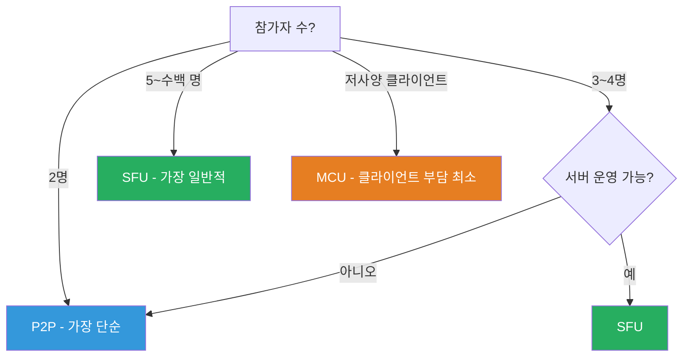

| 서비스 유형 | 권장 아키텍처 |
|------------|-------------|
| 화상회의 (Google Meet, Zoom) | SFU |
| 라이브 방송 (1:N) | SFU |
| 교육 플랫폼 (녹화 포함) | SFU + 녹화 |
| IoT 모니터링 (다수 카메라) | SFU |
| 저대역폭 환경 | MCU |

# 2. SFU 동작 원리

## 2.1 Publish/Subscribe 모델

SFU의 핵심은 **Pub/Sub 모델**이다. 각 참가자는 자신의 미디어를 **Publish(업로드)** 하고, 다른 참가자의 미디어를 **Subscribe(다운로드)** 한다.

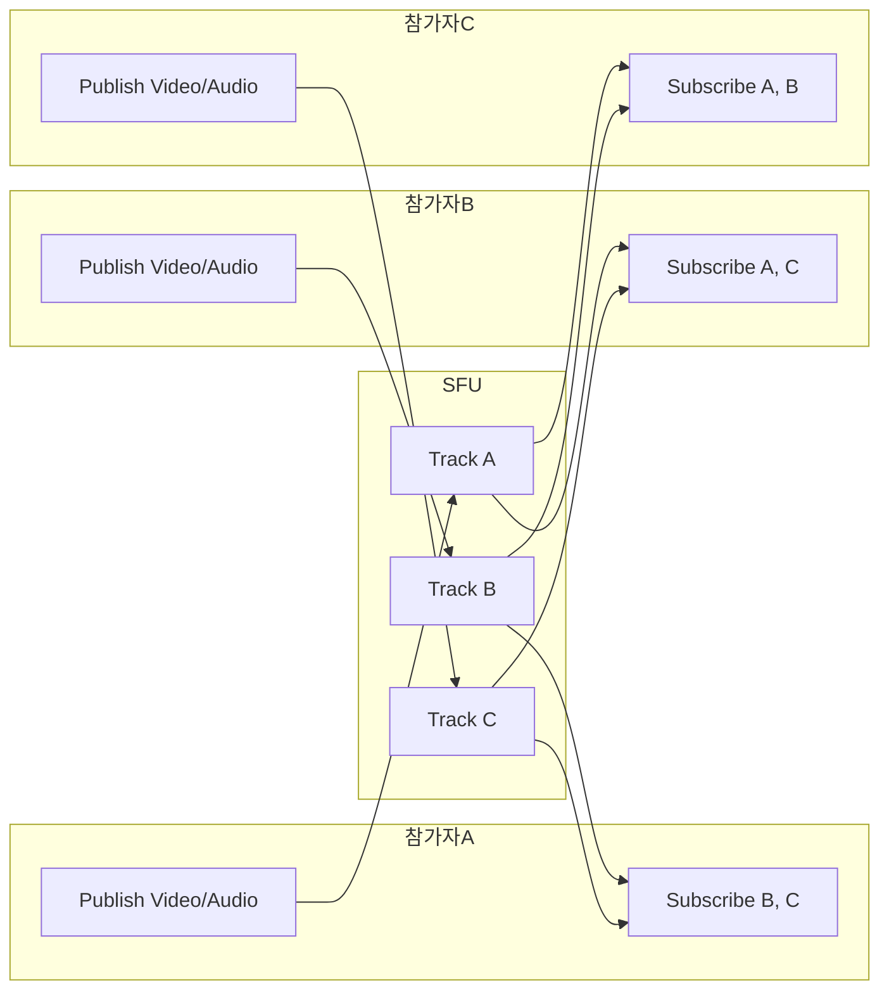

트랜스코딩이 없으므로 **서버 CPU 부담이 매우 낮다**. 이것이 SFU가 MCU보다 확장성이 좋은 핵심 이유다.

## 2.2 SFU에서의 PeerConnection 구조

SFU 구현에 따라 하나의 PeerConnection에서 송수신을 모두 처리하거나, Publisher/Subscriber를 별도 PeerConnection으로 분리한다.

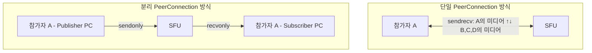

이 글의 Pion SFU 실습에서는 **단일 PeerConnection 방식**을 사용한다. LiveKit 같은 프로덕션 SFU는 분리 방식을 주로 사용한다.

## 2.3 SFU가 하는 일 / 하지 않는 일

| SFU가 하는 일 | SFU가 하지 않는 일 |
|--------------|------------------|
| RTP 패킷 포워딩 (수신 → 재전송) | 미디어 디코딩/재인코딩 (트랜스코딩) |
| Simulcast 레이어 선택 | 영상 합성 (그리드 레이아웃) |
| RTCP 피드백 처리 (PLI, NACK, REMB) | 코덱 변환 (VP8→H.264 등) |
| 대역폭 추정 및 적응 | 해상도/프레임레이트 변경 |
| 활성 화자 감지 (Audio Level) | — |
| 구독 관리 (누가 누구의 스트림을 받을지) | — |

# 3. Simulcast와 SVC

SFU에서 다양한 네트워크 환경의 수신자를 지원하려면, **하나의 소스에서 여러 품질의 스트림을 제공**해야 한다.

## 3.1 Simulcast (동시 다중 인코딩)

발신 측이 같은 영상을 **3개 품질로 동시 인코딩**하여 SFU에 전송한다. SFU는 수신 측 네트워크 상태에 따라 적절한 레이어를 선택하여 전달한다.

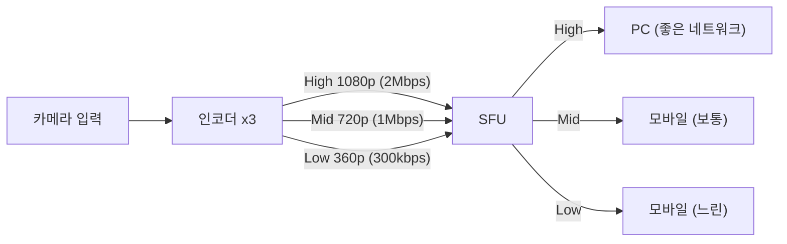

| 레이어 | 해상도 | 비트레이트 | 용도 |
|--------|--------|-----------|------|
| High (f) | 1080p/720p | 1.5~2.5 Mbps | 발표자, 큰 화면 |
| Mid (h) | 720p/360p | 500k~1 Mbps | 일반 참가자 |
| Low (q) | 360p/180p | 100~300 kbps | 썸네일, 저대역폭 |

**장점**: SFU가 트랜스코딩 없이 레이어만 선택하면 됨
**단점**: 발신 측이 3번 인코딩 → 업로드 대역폭 증가 (약 3~4Mbps)

## 3.2 SVC (Scalable Video Coding)

SVC는 **단일 스트림에 레이어를 내장**한다. SFU가 불필요한 상위 레이어를 드롭하여 품질을 조절한다.

| 구분 | Simulcast | SVC |
|------|-----------|-----|
| 인코딩 횟수 | 3회 (레이어별) | 1회 (레이어 내장) |
| 업로드 대역폭 | 높음 (합산) | 낮음 (단일 스트림) |
| SFU 처리 | 스트림 선택 | 레이어 드롭 |
| 지원 코덱 | VP8, H.264, VP9, AV1 | VP9, AV1 |
| 전환 지연 | 키프레임 대기 필요 | 즉시 전환 |
| 브라우저 지원 | 광범위 | VP9/AV1만 |

**실무에서는 Simulcast가 더 보편적**이다. SVC는 VP9/AV1 코덱에서만 지원되고, 브라우저 호환성이 제한적이기 때문이다.

## 3.3 Dynacast (동적 스트림 최적화)

최신 SFU는 **Dynacast** 기능을 제공한다. 아무도 구독하지 않는 스트림의 발신을 자동으로 중단하여 대역폭을 절약한다.

예를 들어 10명 중 발표자 A만 큰 화면이고 나머지는 썸네일이라면:

- **Dynacast 없음**: 모든 참가자가 High+Mid+Low 3개 레이어 업로드 (대부분의 High 레이어가 낭비)
- **Dynacast 있음**: 발표자 A만 High+Mid+Low 업로드, 나머지 9명은 Low만 업로드 → CPU/대역폭 절약

## 3.4 활성 화자 감지

SFU는 각 참가자의 오디오 레벨(RFC 6464)을 모니터링하여 **현재 말하고 있는 사람**을 감지한다. 활성 화자의 영상은 High 레이어로, 나머지는 Low 레이어로 전달하여 대역폭을 최적화한다.

```javascript
// LiveKit SDK 예시
room.on('activeSpeakersChanged', (speakers) => {
  speakers.forEach(speaker => {
    highlightVideo(speaker.identity);
  });
});
```

# 4. 실습 1: Pion SFU 직접 구현

이번 섹션에서는 Pion WebRTC 라이브러리를 사용하여 **다자 화상 통화 SFU**를 직접 구현한다. Pion 기초는 [p2p — §2. Pion WebRTC 라이브러리](../p2p/#2-pion-webrtc-라이브러리)를 참고한다.

> 전체 소스 코드: [tutorials-go/webrtc/multi-users-sfu-pion](https://github.com/kenshin579/tutorials-go/tree/master/webrtc/multi-users-sfu-pion)

## 4.1 프로젝트 구조

```
multi-users-sfu-pion/
├── backend/
│   ├── main.go                  # Echo 서버 진입점
│   ├── handler/
│   │   └── signaling.go         # WebSocket + SFU 시그널링 핸들러
│   ├── sfu/
│   │   └── peer.go              # Peer 구조체 (PC + WebSocket 래핑)
│   └── room/
│       └── manager.go           # Room 관리 (Join/Leave/Broadcast)
├── frontend/
│   ├── src/
│   │   ├── hooks/
│   │   │   ├── useSignaling.ts  # WebSocket 연결 관리
│   │   │   └── useWebRTC.ts     # WebRTC PeerConnection 관리
│   │   └── App.tsx              # UI 컴포넌트
│   └── package.json
├── Makefile
└── docker-compose.yml
```

## 4.2 Peer와 Room 관리

`Peer`는 WebSocket 연결과 PeerConnection을 하나로 묶는 구조체다. `localTracks`는 이 피어가 발행하는 트랙이고, `senders`는 다른 피어의 트랙을 이 피어에게 전달하는 RTPSender 맵이다.

> 전체 코드: [sfu/peer.go](https://github.com/kenshin579/tutorials-go/tree/master/webrtc/multi-users-sfu-pion/backend/sfu/peer.go)

```go
// Peer wraps a WebSocket connection and a Pion PeerConnection for a single client.
type Peer struct {
    ID   string
    Conn *websocket.Conn
    PC   *webrtc.PeerConnection

    mu          sync.Mutex
    localTracks []*webrtc.TrackLocalStaticRTP // tracks published BY this peer
    senders     map[string]*webrtc.RTPSender  // tracks added TO this peer from others
}

// AddRemoteTrack adds another peer's forwarded track to this peer's PeerConnection.
func (p *Peer) AddRemoteTrack(track *webrtc.TrackLocalStaticRTP) error {
    p.mu.Lock()
    defer p.mu.Unlock()

    sender, err := p.PC.AddTrack(track)
    if err != nil {
        return err
    }
    p.senders[track.ID()] = sender

    // Drain RTCP from the sender
    go func() {
        buf := make([]byte, 1500)
        for {
            if _, _, err := sender.Read(buf); err != nil {
                return
            }
        }
    }()
    return nil
}
```

`Room`은 참가자(Peer) 맵을 관리하며, 최대 6명까지 허용한다.

> 전체 코드: [room/manager.go](https://github.com/kenshin579/tutorials-go/tree/master/webrtc/multi-users-sfu-pion/backend/room/manager.go)

```go
const MaxPeersPerRoom = 6

type Room struct {
    mu    sync.RWMutex
    Peers map[string]*sfu.Peer
}

type Manager struct {
    mu    sync.RWMutex
    rooms map[string]*Room
}

func (m *Manager) Join(roomID string, peer *sfu.Peer) bool {
    m.mu.Lock()
    r := m.getOrCreateRoom(roomID)
    m.mu.Unlock()

    r.mu.Lock()
    defer r.mu.Unlock()

    if len(r.Peers) >= MaxPeersPerRoom {
        return false
    }
    r.Peers[peer.ID] = peer
    return true
}
```

## 4.3 Signaling 핸들러

WebSocket 메시지 루프에서 `offer`, `answer`, `ice`, `chat` 메시지를 처리한다. Signaling 서버 설계 기초는 [p2p — §1. Signaling 서버](../p2p/#1-signaling-서버)를 참고한다.

> 전체 코드: [handler/signaling.go](https://github.com/kenshin579/tutorials-go/tree/master/webrtc/multi-users-sfu-pion/backend/handler/signaling.go)

```go
func (s *Signaling) HandleWebSocket(c echo.Context) error {
    roomID := c.QueryParam("roomId")
    ws, err := upgrader.Upgrade(c.Response(), c.Request(), nil)
    if err != nil {
        return err
    }
    defer ws.Close()

    peerID := uuid.New().String()[:8]
    peer, err := sfu.NewPeer(peerID, ws)
    if err != nil {
        return nil
    }
    defer peer.Close()

    if !s.rm.Join(roomID, peer) {
        peer.SendJSON(SignalingMessage{Type: "error", Message: "room is full"})
        return nil
    }
    defer s.cleanupPeer(roomID, peer)

    s.setupTrackForwarding(roomID, peer)

    // Notify existing peers about the new peer
    s.rm.Broadcast(roomID, peerID, SignalingMessage{
        Type: "join", SenderID: peerID,
    })

    // Message loop
    for {
        _, msg, err := ws.ReadMessage()
        if err != nil {
            break
        }
        var sm SignalingMessage
        if err := json.Unmarshal(msg, &sm); err != nil {
            continue
        }
        sm.SenderID = peerID

        switch sm.Type {
        case "offer":
            s.handleOffer(roomID, peer, sm)
        case "answer":
            s.handleAnswer(peer, sm)
        case "ice":
            s.handleICE(peer, sm)
        case "chat":
            s.rm.Broadcast(roomID, peerID, sm)
        }
    }
    return nil
}
```

## 4.4 RTP 포워딩 — SFU의 핵심

`setupTrackForwarding`이 이 SFU의 핵심이다. 새 참가자의 트랙이 도착하면 `TrackLocalStaticRTP`를 만들고, 다른 모든 참가자의 PeerConnection에 추가한 뒤, RTP 패킷을 무한 루프로 포워딩한다.

```mermaid
sequenceDiagram
    participant A as 참가자 A
    participant SFU as SFU Server
    participant B as 참가자 B
    participant C as 참가자 C

    A->>SFU: Offer (video+audio tracks)
    SFU->>A: Answer
    A->>SFU: RTP 패킷 전송
    Note over SFU: OnTrack 발동
    Note over SFU: TrackLocalStaticRTP 생성
    SFU->>B: AddTrack + Renegotiation Offer
    B->>SFU: Answer
    SFU->>C: AddTrack + Renegotiation Offer
    C->>SFU: Answer
    loop RTP 포워딩
        A->>SFU: remoteTrack.Read(buf)
        SFU->>B: localTrack.Write(buf)
        SFU->>C: localTrack.Write(buf)
    end
```

```go
// setupTrackForwarding registers OnTrack to forward RTP packets from this peer to others.
func (s *Signaling) setupTrackForwarding(roomID string, peer *sfu.Peer) {
    peer.PC.OnTrack(func(remoteTrack *webrtc.TrackRemote, receiver *webrtc.RTPReceiver) {
        // 1. 로컬 트랙 생성 (원격 트랙과 같은 코덱)
        localTrack, err := webrtc.NewTrackLocalStaticRTP(
            remoteTrack.Codec().RTPCodecCapability,
            remoteTrack.ID(),
            peer.ID,
        )
        if err != nil {
            return
        }
        peer.AddLocalTrack(localTrack)

        // 2. 방의 다른 모든 참가자에게 트랙 추가
        r := s.rm.GetRoom(roomID)
        if r != nil {
            for _, otherPeer := range r.GetOtherPeers(peer.ID) {
                if err := otherPeer.AddRemoteTrack(localTrack); err != nil {
                    continue
                }
                s.renegotiate(otherPeer) // 재협상 필요
            }
        }

        // 3. RTP 패킷 포워딩 (디코딩/재인코딩 없이 바이트 복사)
        buf := make([]byte, 1500)
        for {
            n, _, readErr := remoteTrack.Read(buf)
            if readErr != nil {
                return
            }
            if _, writeErr := localTrack.Write(buf[:n]); writeErr != nil {
                return
            }
        }
    })
}
```

핵심은 `remoteTrack.Read(buf)` → `localTrack.Write(buf[:n])` 루프다. **디코딩/재인코딩 없이 RTP 바이트를 그대로 복사**하므로 서버 CPU 사용이 최소화된다.

## 4.5 재협상 (Renegotiation)

참가자가 입장/퇴장하면 트랙이 추가/제거되므로 **재협상(Renegotiation)** 이 필요하다. SFU가 새 Offer를 만들어 클라이언트에게 보내고, 클라이언트가 Answer를 반환한다.

```go
// renegotiate sends a new offer to the peer when tracks have been added/removed.
func (s *Signaling) renegotiate(peer *sfu.Peer) {
    if peer.PC.SignalingState() != webrtc.SignalingStateStable {
        return // 이전 협상이 진행 중이면 스킵
    }

    offer, err := peer.PC.CreateOffer(nil)
    if err != nil {
        return
    }
    if err := peer.PC.SetLocalDescription(offer); err != nil {
        return
    }
    peer.SendJSON(SignalingMessage{
        Type:    "offer",
        Payload: mustMarshal(offer),
    })
}
```

## 4.6 프론트엔드 WebRTC Hook

브라우저 측에서는 SFU로부터 받는 `offer` 메시지가 **재협상 요청**임을 인식하고 Answer를 반환해야 한다.

> 전체 코드: [hooks/useWebRTC.ts](https://github.com/kenshin579/tutorials-go/tree/master/webrtc/multi-users-sfu-pion/frontend/src/hooks/useWebRTC.ts)

```typescript
// Signaling 메시지 핸들러 (SFU 재협상 처리)
setOnMessage(async (msg: SignalingMessage) => {
  if (msg.type === 'offer') {
    // SFU가 새 트랙 추가 후 보낸 재협상 Offer
    console.log('[WebRTC] received offer (renegotiation)');
    await pc.setRemoteDescription(
      new RTCSessionDescription(msg.payload as RTCSessionDescriptionInit),
    );
    const answer = await pc.createAnswer();
    await pc.setLocalDescription(answer);
    send({ type: 'answer', payload: answer });
  } else if (msg.type === 'answer') {
    await pc.setRemoteDescription(
      new RTCSessionDescription(msg.payload as RTCSessionDescriptionInit),
    );
  } else if (msg.type === 'ice') {
    await pc.addIceCandidate(
      new RTCIceCandidate(msg.payload as RTCIceCandidateInit),
    );
  }
});
```

## 4.7 실행 및 테스트

```bash
# 1. 백엔드 실행
cd backend && go run main.go
# → :8080에서 WebSocket 서버 시작

# 2. 프론트엔드 실행
cd frontend && npm install && npm run dev
# → http://localhost:5173

# 3. 테스트
# 브라우저 탭 2~3개를 열고 같은 Room ID로 입장
# → 카메라/마이크 공유 허용 → 다자 화상 통화 확인
```

# 5. 실습 2: LiveKit 매니지드 SFU

## 5.1 LiveKit 소개

[LiveKit](https://livekit.io/)은 Go로 작성된 프로덕션 레벨 SFU 플랫폼이다. 단일 바이너리 배포, JWT 인증, 분산 아키텍처, 7+ 플랫폼 클라이언트 SDK를 제공한다. 내부적으로 Pion WebRTC를 사용한다.

```bash
# 설치 (macOS)
brew install livekit

# 개발 모드 실행
livekit-server --dev
# API Key: devkey, API Secret: secret
```

> 전체 소스 코드: [tutorials-go/webrtc/multi-users-sfu-livekit](https://github.com/kenshin579/tutorials-go/tree/master/webrtc/multi-users-sfu-livekit)

## 5.2 JWT 토큰 서버

LiveKit은 JWT 기반 인증을 사용한다. 애플리케이션 서버에서 토큰을 발급하고, 클라이언트가 이 토큰으로 LiveKit 서버에 연결한다.

> 전체 코드: [backend/main.go](https://github.com/kenshin579/tutorials-go/tree/master/webrtc/multi-users-sfu-livekit/backend/main.go)

```go
func handleToken(c echo.Context) error {
    roomID := c.QueryParam("roomId")
    userName := c.QueryParam("userName")

    at := auth.NewAccessToken(apiKey, apiSecret)
    grant := &auth.VideoGrant{
        RoomJoin: true,
        Room:     roomID,
    }
    at.SetVideoGrant(grant).
        SetIdentity(userName).
        SetValidFor(time.Hour)

    token, err := at.ToJWT()
    if err != nil {
        return echo.NewHTTPError(http.StatusInternalServerError, "failed to generate token")
    }
    return c.JSON(http.StatusOK, map[string]string{"token": token})
}
```

## 5.3 프론트엔드 Room Hook

LiveKit의 `livekit-client` SDK는 Room 생성, 트랙 구독/해제, 데이터 전송을 모두 추상화한다.

> 전체 코드: [hooks/useRoom.ts](https://github.com/kenshin579/tutorials-go/tree/master/webrtc/multi-users-sfu-livekit/frontend/src/hooks/useRoom.ts)

```typescript
const room = new Room({
  adaptiveStream: true,  // 자동 품질 조절
  dynacast: true,        // 구독자 없는 스트림 자동 중단
});

room
  .on(RoomEvent.TrackSubscribed, (track, _pub, participant) => {
    // 원격 트랙 수신 → UI에 표시
    if (track.kind === Track.Kind.Video) {
      setRemoteTracks(prev => new Map(prev).set(track.sid!, {
        track, participantIdentity: participant.identity,
      }));
    }
    if (track.kind === Track.Kind.Audio) {
      document.body.appendChild(track.attach());
    }
  })
  .on(RoomEvent.TrackUnsubscribed, (track) => {
    track.detach();
  });

// 토큰 발급 → LiveKit 서버 연결 → 카메라/마이크 발행
const { token } = await (await fetch(`/token?roomId=${roomId}&userName=${userName}`)).json();
await room.connect('ws://localhost:7880', token);
await room.localParticipant.enableCameraAndMicrophone();
```

## 5.4 Pion SFU vs LiveKit 비교

| 항목 | Pion SFU (직접 구현) | LiveKit |
|------|---------------------|---------|
| **구현 난이도** | 높음 (RTP 포워딩, 재협상 직접 구현) | 낮음 (SDK 제공) |
| **코드량** | 백엔드 ~500줄 + 프론트 ~200줄 | 백엔드 ~60줄 + 프론트 ~170줄 |
| **Simulcast** | 직접 구현 필요 | 내장 (`adaptiveStream: true`) |
| **Dynacast** | 미지원 | 내장 (`dynacast: true`) |
| **활성 화자** | 직접 구현 필요 | 내장 (`ActiveSpeakersChanged` 이벤트) |
| **인증** | 직접 구현 | JWT 내장 |
| **분산 배포** | 직접 구현 필요 | 내장 (Redis 기반) |
| **녹화** | 미지원 | Egress API 지원 |
| **적합 용도** | 학습, SFU 원리 이해 | 프로덕션 서비스 |

**권장**: SFU 동작 원리를 학습한 후에는 프로덕션에서 **LiveKit이나 mediasoup을 기반**으로 시작하는 것이 현실적이다.

# 6. 보안

## 6.1 WebRTC 보안 아키텍처

WebRTC는 **모든 통신을 암호화**한다. 선택이 아니라 필수다.

```
WebRTC가 보장하는 것:
├── ✅ 미디어/데이터 암호화 (DTLS + SRTP)
├── ✅ 피어 인증 (DTLS 인증서 fingerprint)
└── ✅ 동의 기반 전송 (ICE consent)

애플리케이션이 책임져야 하는 것:
├── ⚠️ Signaling 채널 암호화 (WSS/HTTPS)
├── ⚠️ 사용자 인증 (JWT, OAuth 등)
└── ⚠️ 권한 제어 (Room 접근, 미디어 권한)
```

| 위협 | 공격 방법 | 대응 |
|------|----------|------|
| **Signaling MitM** | Signaling 채널 가로채기 | WSS/HTTPS 사용 |
| **IP 주소 노출** | P2P 연결 시 IP 노출 | TURN 강제, mDNS 후보 |
| **미인가 참여** | Room에 무단 접속 | JWT 토큰 인증 |
| **SRTP 헤더 노출** | RTP 헤더 분석 | 프로토콜 한계 (완화 어려움) |
| **Mixed Content** | HTTP 페이지에서 WebRTC | HTTPS 필수 |

> DTLS/SRTP 기초 이론은 [basics — §3.6 DTLS / SRTP — 보안](../basics/#36-dtls--srtp--보안)을 참고한다.

## 6.2 DTLS 핸드셰이크

**DTLS(Datagram Transport Layer Security)** 는 UDP 위에서 TLS와 동일한 보안을 제공한다. 핸드셰이크는 6단계(Flight)로 구성된다.

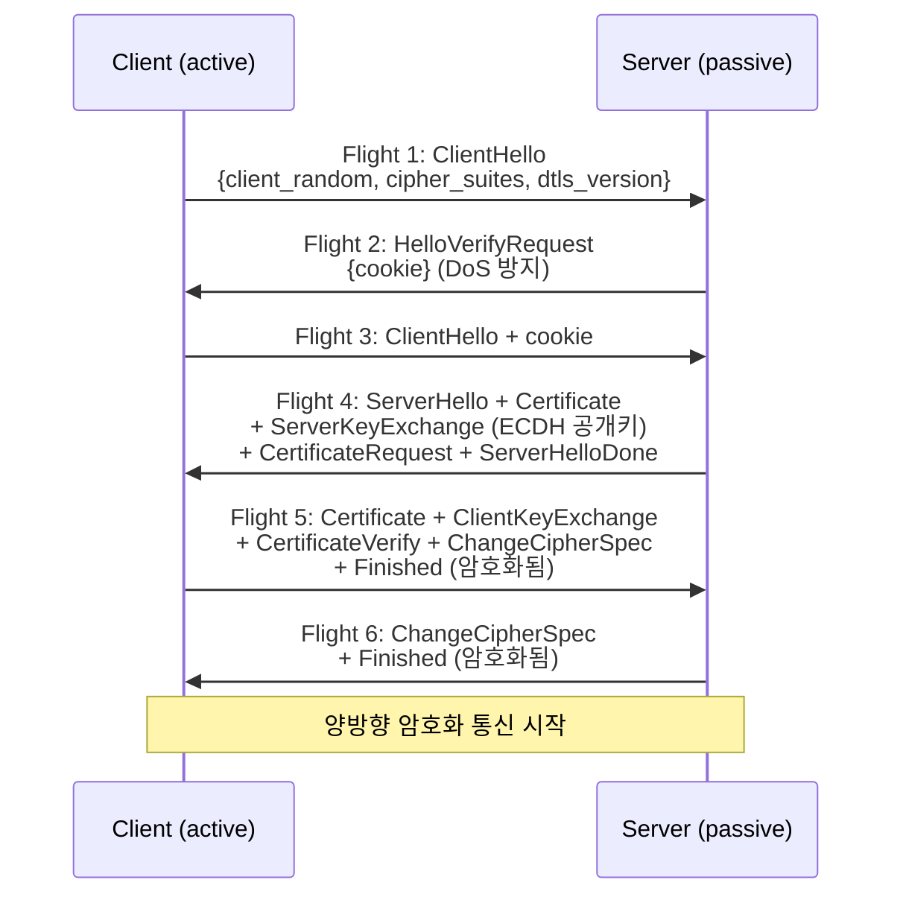

### Flight 2: HelloVerifyRequest (DoS 방지)

서버는 cookie를 포함한 HelloVerifyRequest를 보내 **위조 IP 공격을 방지**한다. 공격자는 위조 IP로 cookie를 수신할 수 없으므로, 서버가 리소스를 할당하기 전에 정상 클라이언트를 구분할 수 있다.

### Fingerprint 검증

WebRTC는 **자체 서명(self-signed) 인증서**를 사용한다. CA 검증 대신 **SDP에 포함된 fingerprint**로 인증한다.

1. SDP 교환 시 `a=fingerprint:sha-256 AA:BB:CC:DD:...` 포함
2. DTLS 핸드셰이크에서 인증서 교환
3. 수신한 인증서의 SHA-256 해시 ↔ SDP fingerprint 비교
4. 일치 → 연결 허용, 불일치 → 연결 거부 (MitM 가능성)

> **중요**: Signaling 채널이 탈취되면 fingerprint도 변조 가능하다. 이것이 **Signaling 채널을 WSS/HTTPS로 보호해야 하는 이유**다.

## 6.3 SRTP 키 도출

SRTP는 자체 키 교환 메커니즘이 없다. DTLS 핸드셰이크가 완료되면 **DTLS 세션에서 키를 추출**하여 SRTP에 사용한다.

```
DTLS 핸드셰이크 완료
    │
    ▼
Master Secret 생성
    │
    ▼
TLS Exporter로 SRTP 키 추출
    │
    ▼
키 분배:
├── client_write_SRTP_master_key   (16 bytes)
├── server_write_SRTP_master_key   (16 bytes)
├── client_write_SRTP_master_salt  (14 bytes)
└── server_write_SRTP_master_salt  (14 bytes)
```

| 프로파일 | 암호화 | 키 길이 | 인증 태그 |
|---------|--------|---------|----------|
| **SRTP_AES128_CM_HMAC_SHA1_80** (필수) | AES-128 CTR | 16 bytes | 80 bits |
| SRTP_AEAD_AES_128_GCM | AES-128 GCM | 16 bytes | 128 bits |

SRTP 패킷에서 **페이로드는 AES로 암호화**되지만, **RTP 헤더는 평문**이다. SFU가 트랜스코딩 없이 패킷을 라우팅하려면 SSRC, Payload Type 등을 읽어야 하기 때문이다.

## 6.4 Signaling 인증 (JWT)

가장 일반적인 WebRTC 인증 방식이다. LiveKit, Twilio 등 주요 서비스가 이 패턴을 사용한다.

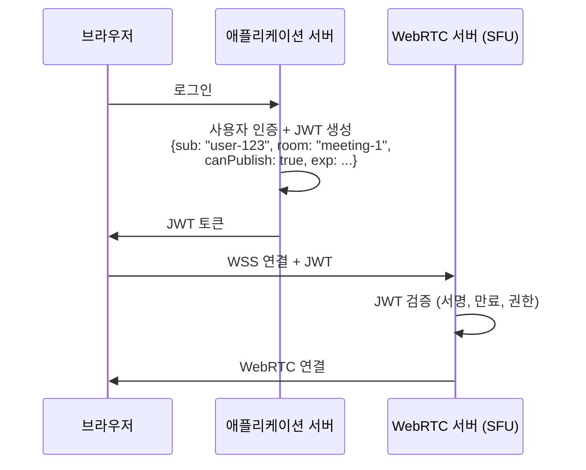

### Golang 서버에서 토큰 발급

```go
type RoomClaims struct {
    Room         string `json:"room"`
    CanPublish   bool   `json:"canPublish"`
    CanSubscribe bool   `json:"canSubscribe"`
    jwt.RegisteredClaims
}

func generateToken(userID, room string, canPublish, canSubscribe bool) (string, error) {
    claims := RoomClaims{
        Room:         room,
        CanPublish:   canPublish,
        CanSubscribe: canSubscribe,
        RegisteredClaims: jwt.RegisteredClaims{
            Subject:   userID,
            ExpiresAt: jwt.NewNumericDate(time.Now().Add(24 * time.Hour)),
            IssuedAt:  jwt.NewNumericDate(time.Now()),
        },
    }
    token := jwt.NewWithClaims(jwt.SigningMethodHS256, claims)
    return token.SignedString(jwtSecret)
}
```

### WebSocket 연결 시 검증

```go
func handleWebSocket(w http.ResponseWriter, r *http.Request) {
    tokenStr := r.URL.Query().Get("token")
    if tokenStr == "" {
        http.Error(w, "token required", http.StatusUnauthorized)
        return
    }

    claims, err := validateToken(tokenStr)
    if err != nil {
        http.Error(w, "invalid token", http.StatusUnauthorized)
        return
    }

    log.Printf("User %s joined room %s (publish=%v, subscribe=%v)",
        claims.Subject, claims.Room, claims.CanPublish, claims.CanSubscribe)

    conn, err := upgrader.Upgrade(w, r, nil)
    if err != nil {
        return
    }
    defer conn.Close()

    handleAuthenticatedPeer(conn, claims)
}
```

## 6.5 TURN 인증 (REST API)

TURN 서버에 접속할 때 **시간 제한 자격 증명(Time-Limited Credentials)** 을 사용하면 보안을 강화할 수 있다.

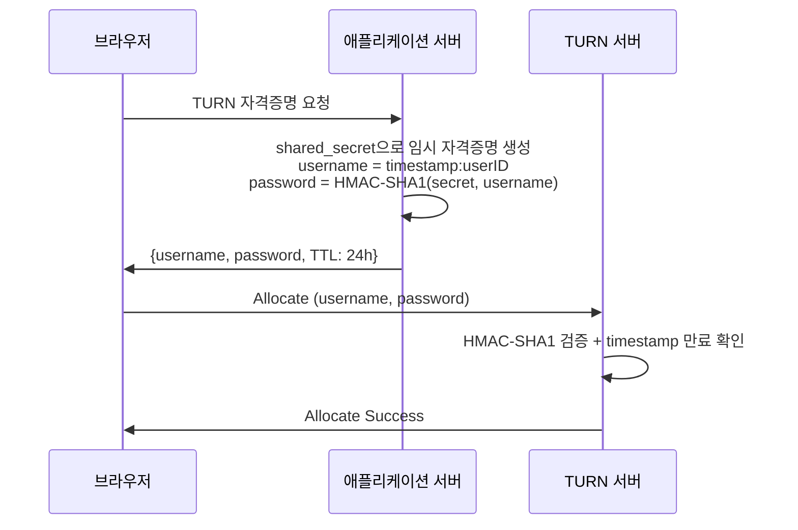

```go
func generateTURNCredentials(userID string, ttl time.Duration) (username, password string) {
    timestamp := time.Now().Add(ttl).Unix()
    username = fmt.Sprintf("%d:%s", timestamp, userID)

    mac := hmac.New(sha1.New, []byte(turnSharedSecret))
    mac.Write([]byte(username))
    password = base64.StdEncoding.EncodeToString(mac.Sum(nil))

    return username, password
}
```

# 7. 운영

## 7.1 TURN 서버 (coturn)

> ICE/STUN/TURN 기초는 [basics — §3.5 ICE](../basics/#35-ice-interactive-connectivity-establishment)를 참고한다.

### 설치

```bash
# Ubuntu/Debian
sudo apt-get update && sudo apt-get install -y coturn

# 자동 시작 활성화
sudo sed -i 's/#TURNSERVER_ENABLED=1/TURNSERVER_ENABLED=1/' /etc/default/coturn
```

### 핵심 설정 (/etc/turnserver.conf)

```bash
realm=turn.example.com
listening-ip=0.0.0.0
external-ip=203.0.113.50        # 공인 IP (클라우드에서 필수)
listening-port=3478
tls-listening-port=5349
min-port=10000
max-port=20000

# TLS 인증서
cert=/etc/letsencrypt/live/turn.example.com/fullchain.pem
pkey=/etc/letsencrypt/live/turn.example.com/privkey.pem

# REST API 인증
lt-cred-mech
use-auth-secret
static-auth-secret=MySharedSecret123

# 보안
fingerprint
no-multicast-peers
no-loopback-peers
denied-peer-ip=0.0.0.0-0.255.255.255
denied-peer-ip=127.0.0.0-127.255.255.255

# 모니터링
prometheus
prometheus-port=9641
```

### 방화벽 설정

```bash
sudo ufw allow 3478/tcp      # STUN/TURN
sudo ufw allow 3478/udp
sudo ufw allow 5349/tcp      # TURNS (TLS)
sudo ufw allow 443/tcp       # 대체 포트 (방화벽 우회)
sudo ufw allow 10000:20000/udp  # 릴레이 포트 범위
```

### 클라우드 배포 시 주의

AWS EC2, GCP, Azure VM에서는 `external-ip`를 반드시 설정해야 한다.

```bash
# 공인IP/사설IP 형식 (AWS에서 필수)
external-ip=54.180.x.x/10.0.1.5
```

### 규모 산정

| 항목 | 기준 |
|------|------|
| **대역폭** | 영상 2~4 Mbps, 음성 50~100 Kbps |
| **CPU** | STUN: 수만 세션/코어, TURN: 수천 세션/코어 |
| **메모리** | ~1~2 MB / 활성 할당 |
| **포트** | 할당당 1 릴레이 포트 |

예시: 동시 500명, TURN 사용률 20% (100명) → 필요 대역폭 400Mbps, 메모리 200MB, 4코어

## 7.2 모니터링

### 모니터링 포인트

| 계층 | 주요 지표 |
|------|----------|
| **Signaling** | WebSocket 연결 수, Offer/Answer 성공률, 인증 실패 횟수 |
| **ICE/연결** | ICE 연결 성공률, 연결 수립 시간, 후보 타입 비율 (host/srflx/relay) |
| **미디어** | 비트레이트, 패킷 손실률, 지터, RTT, FPS, PLI/NACK 횟수 |
| **TURN** | 활성 할당 수, 릴레이 대역폭, 인증 실패율 |

### Prometheus 메트릭 (Golang SFU)

```go
import "github.com/prometheus/client_golang/prometheus"

var (
    activeConnections = prometheus.NewGauge(prometheus.GaugeOpts{
        Name: "webrtc_active_connections",
        Help: "Number of active WebRTC connections",
    })
    iceConnectionDuration = prometheus.NewHistogram(prometheus.HistogramOpts{
        Name:    "webrtc_ice_connection_duration_seconds",
        Help:    "Time from offer to ICE connected",
        Buckets: []float64{0.5, 1, 2, 5, 10, 30},
    })
    candidateTypeUsed = prometheus.NewCounterVec(prometheus.CounterOpts{
        Name: "webrtc_candidate_type_total",
        Help: "ICE candidate types used for connections",
    }, []string{"type"})
)

func onPeerConnected(candidateType string, duration time.Duration) {
    activeConnections.Inc()
    iceConnectionDuration.Observe(duration.Seconds())
    candidateTypeUsed.WithLabelValues(candidateType).Inc()
}
```

### coturn Prometheus 메트릭

```bash
# coturn 설정에서 활성화
prometheus
prometheus-port=9641
```

| 메트릭 | 설명 |
|--------|------|
| `turn_total_allocations` | 누적 할당 수 |
| `turn_active_allocations` | 현재 활성 할당 수 |
| `turn_total_traffic_rcvb` | 수신 바이트 수 |
| `turn_total_traffic_sentb` | 전송 바이트 수 |

### 알림 설정 기준

| 지표 | 경고 | 위험 | 대응 |
|------|------|------|------|
| ICE 연결 실패율 | > 5% | > 15% | STUN/TURN 확인 |
| 패킷 손실률 | > 3% | > 10% | 네트워크/대역폭 확인 |
| RTT | > 200ms | > 500ms | TURN 서버 위치 최적화 |
| TURN 인증 실패율 | > 1% | > 5% | 자격증명 만료, 시크릿 확인 |
| 서버 CPU | > 70% | > 90% | 스케일 아웃 |
| 연결 수립 시간 | > 3초 | > 10초| STUN/TURN/네트워크 확인 |

## 7.3 SFU 배포 아키텍처

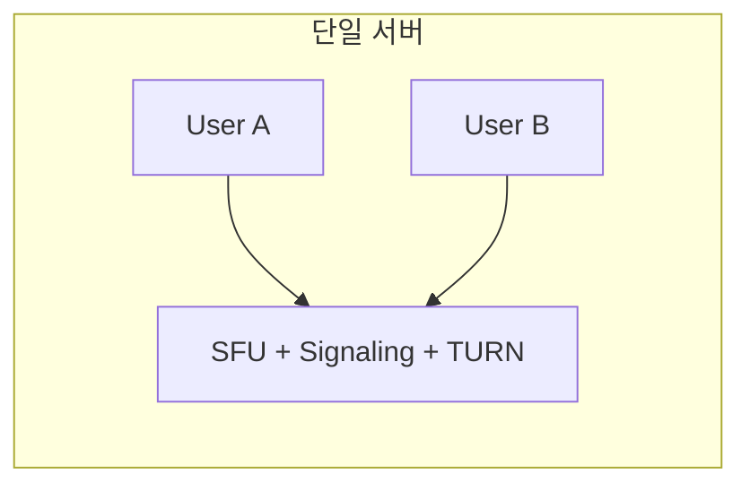

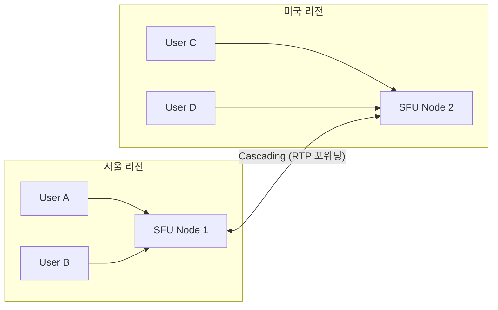

| 구성 | 적합 규모 | 장점 | 단점 |
|------|----------|------|------|
| 단일 서버 | ~100명 동시 | 구성 단순 | 단일 장애 지점, 지리적 지연 |
| 분산 (Cascading) | 수백~수천 명 | 지역 최적화, 고가용성 | 구성 복잡 |

LiveKit은 **분산 아키텍처를 내장**하고 있어 멀티 리전 배포가 가능하다.

## 7.4 운영 체크리스트

### 배포 전

```
보안:
├── □ Signaling 채널: WSS/HTTPS 사용
├── □ JWT 또는 OAuth 인증 구현
├── □ TURN REST API 인증 (static-auth-secret)
├── □ CORS 설정 (허용 도메인 제한)
└── □ Rate limiting (DoS 방지)

TURN:
├── □ TLS 인증서 설정 (Let's Encrypt)
├── □ external-ip 설정 (클라우드)
├── □ 방화벽 포트 개방 (UDP 3478, 5349, 10000-20000)
├── □ denied-peer-ip 설정 (루프백 차단)
└── □ 로그 로테이션 설정

모니터링:
├── □ Prometheus 메트릭 수집
├── □ Grafana 대시보드 구성
├── □ 알림 규칙 설정
└── □ 로그 수집 (ELK 또는 CloudWatch)

성능:
├── □ 커널 파라미터 튜닝 (rmem_max, wmem_max)
├── □ 파일 디스크립터 제한 확인 (ulimit)
└── □ 부하 테스트 수행
```

### 장애 대응 요약

| 시나리오 | 감지 | 대응 |
|---------|------|------|
| TURN 서버 다운 | 활성 할당 급감 | 백업 서버 전환, TURN 이중화 |
| 인증서 만료 | TLS 핸드셰이크 실패 로그 | `certbot renew`, 만료 30일 전 알림 |
| 포트 고갈 | 할당 실패율 증가 | min-port~max-port 범위 확장 |
| 대역폭 초과 | 패킷 손실률 증가 | 비트레이트 제한, 사용자 분산 |

# 8. 오픈소스 SFU 비교

## 8.1 비교 요약

| 항목 | LiveKit | ion-sfu | mediasoup | Janus |
|------|---------|---------|-----------|-------|
| **언어** | Go | Go | Node.js / Rust | C |
| **유형** | 완성형 플랫폼 | SFU 라이브러리 | 임베더블 SFU | 모듈형 게이트웨이 |
| **Simulcast** | ✅ | ✅ | ✅ | 플러그인 |
| **SVC** | VP9, AV1 | 제한적 | VP9, AV1 | 플러그인 |
| **E2EE** | ✅ | ❌ | 가능 | 플러그인 |
| **배포 난이도** | 낮음 (단일 바이너리) | 중간 | 높음 (통합 필요) | 중간 |
| **확장성** | 분산 클러스터링 | 단일 서버 | 단일 서버 | 단일 서버 |
| **클라이언트 SDK** | 7+ 플랫폼 | JS | JS, C++, Python | JS |
| **라이선스** | Apache 2.0 | MIT | ISC | GPL v3 |

## 8.2 학습 순서 가이드

| 순서 | SFU | 이유 |
|------|-----|------|
| 1 | **Pion (직접 구현)** | RTP 포워딩, 재협상 등 SFU 핵심 원리 이해 |
| 2 | **ion-sfu** | Pion 기반 SFU 라이브러리 구조 학습 |
| 3 | **LiveKit** | 프로덕션 SFU 아키텍처, 분산, 인증, 모니터링 |
| 4 | **mediasoup / Janus** | 다른 언어 생태계, 커스텀 요구사항 시 |

- [LiveKit](https://livekit.io/) — Go, 프로덕션 레벨, 분산, JWT, 7+ SDK
- [ion-sfu](https://github.com/pion/ion-sfu) — Go, Pion 기반, 라이브러리 형태
- [mediasoup](https://mediasoup.org/) — Node.js/Rust, 임베더블, 로우레벨 API
- [Janus](https://janus.conf.meetecho.com/) — C, 플러그인 아키텍처, SFU+MCU+SIP

# 9. 정리

| 주제 | 핵심 내용 |
|------|----------|
| **P2P Mesh 한계** | N×(N-1)/2 연결, 4~5명 초과 시 비현실적 |
| **SFU** | 패킷 포워딩만, 트랜스코딩 없음, CPU 낮음, 가장 보편적 |
| **Simulcast** | 3개 품질 동시 인코딩, SFU가 레이어 선택 |
| **Pion SFU 핵심** | `remoteTrack.Read` → `localTrack.Write` (RTP 바이트 복사) |
| **LiveKit** | Pion 기반 프로덕션 SFU, JWT/분산/Simulcast/Dynacast 내장 |
| **DTLS** | 6 Flight 핸드셰이크, fingerprint 검증, DoS 방지 |
| **SRTP** | DTLS에서 키 도출, AES-128 암호화, 헤더는 평문 |
| **인증** | JWT (Room/권한), TURN REST API (HMAC-SHA1) |
| **coturn** | external-ip, TLS 인증서, REST API 인증, 포트 범위 |
| **모니터링** | Prometheus+Grafana, ICE 성공률/RTT/패킷 손실 |

```
[시리즈 흐름]

  basics    →  WebRTC 프로토콜, SDP, ICE, DTLS/SRTP 이론
  p2p       →  Pion 라이브러리, Signaling 서버, 1:1 연결 실습
  sfu       →  SFU 아키텍처, 다자 통화 실습, 보안과 운영 ← 지금 여기
  advanced  →  기술 선택 가이드, 대안 기술 비교
```

# 10. 참고 자료

- [WebRTC for the Curious - Applied WebRTC](https://webrtcforthecurious.com/ko/docs/08-applied-webrtc/)
- [WebRTC for the Curious - Securing](https://webrtcforthecurious.com/ko/docs/04-securing/)
- [LiveKit - Open Source WebRTC SFU](https://livekit.io/)
- [LiveKit Docs - Architecture](https://docs.livekit.io/home/)
- [Pion ion-sfu](https://github.com/pion/ion-sfu)
- [mediasoup - Cutting Edge WebRTC](https://mediasoup.org/)
- [Janus WebRTC Gateway](https://janus.conf.meetecho.com/)
- [RFC 6347 - DTLS Version 1.2](https://tools.ietf.org/html/rfc6347)
- [RFC 5764 - DTLS Extension to Establish Keys for SRTP](https://tools.ietf.org/html/rfc5764)
- [RFC 3711 - SRTP](https://tools.ietf.org/html/rfc3711)
- [coturn - TURN Server](https://github.com/coturn/coturn)
