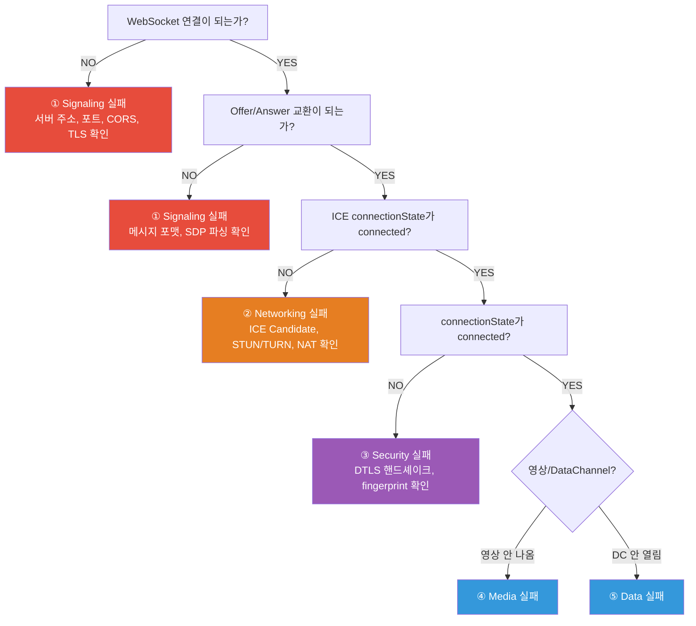
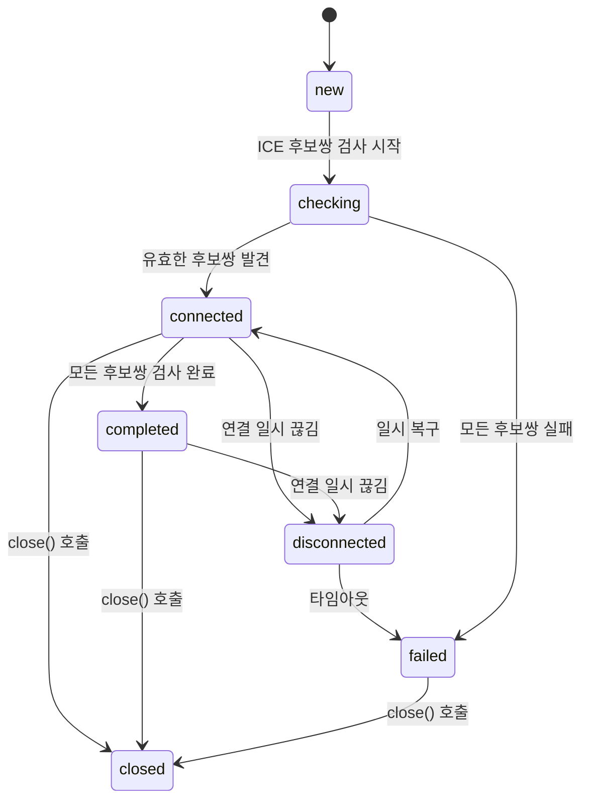
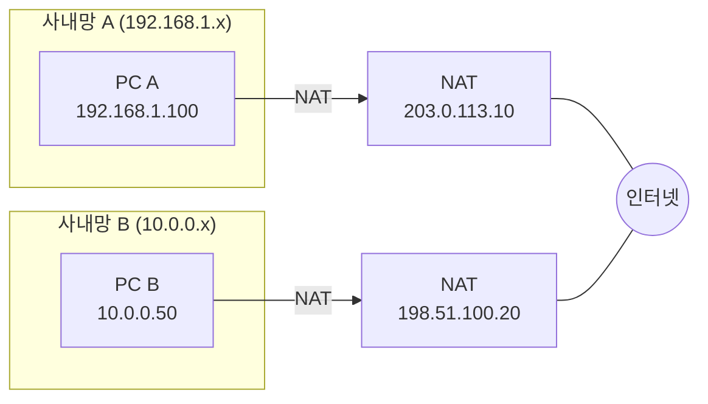
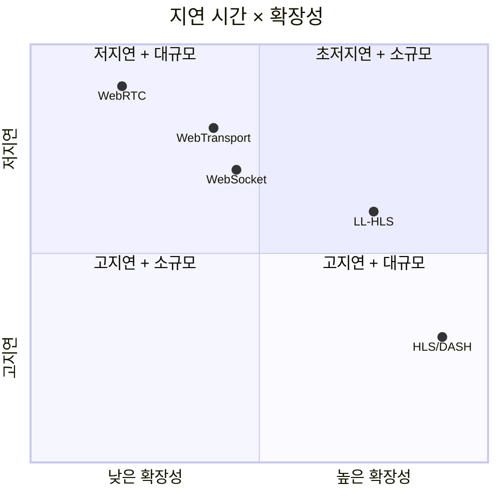
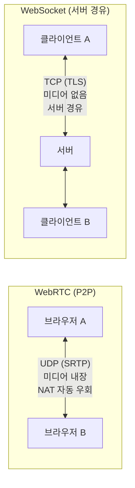
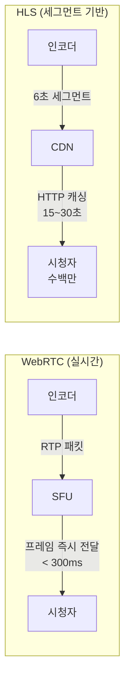
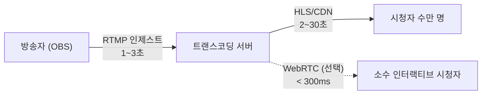
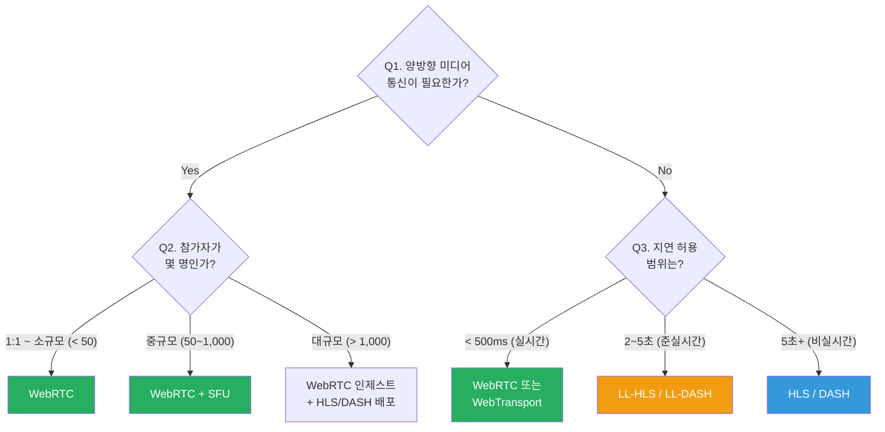
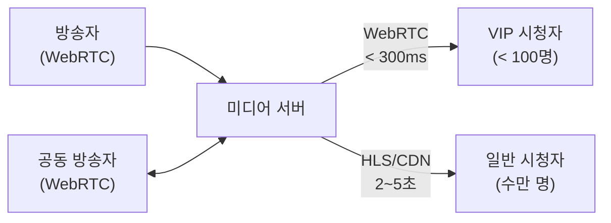
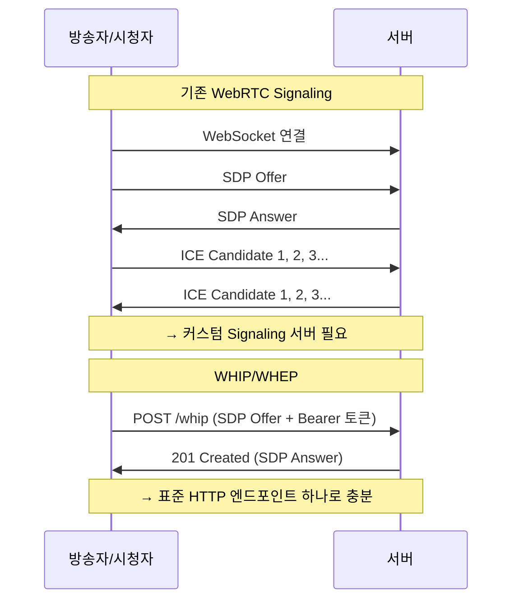

[basics](../basics/)에서 프로토콜 이론을, [p2p](../p2p/)에서 1:1 연결 실습을, [sfu](../sfu/)에서 다자 통화와 보안/운영을 다뤘다. 이번 마지막 글에서는 두 가지를 다룬다. 먼저 WebRTC 연결 문제를 **체계적으로 진단하고 해결하는 방법**을 정리하고, 이어서 한 걸음 물러나 **WebRTC를 언제 쓰면 안 되는가**를 생각해본다. 모든 기술에는 적합한 영역이 있다.

# 1. 네트워크 트러블슈팅

## 1.1 실패 유형 5가지

WebRTC 문제는 크게 5가지 유형으로 분류할 수 있다. 문제를 만났을 때 가장 먼저 할 일은 **어떤 유형에 해당하는지 판별**하는 것이다.

| # | 유형 | 증상 |
|---|------|------|
| ① | **Signaling 실패** | WebSocket 연결 안 됨, Offer/Answer 교환 실패 |
| ② | **Networking 실패** | ICE 연결 안 됨, NAT 통과 실패, 방화벽 차단 |
| ③ | **Security 실패** | DTLS 핸드셰이크 실패, 인증서 문제 |
| ④ | **Media 실패** | 영상/음성 안 나옴, 코덱 불일치, 프레임 깨짐 |
| ⑤ | **Data 실패** | DataChannel 안 열림, 메시지 전달 안 됨 |

## 1.2 빠른 판별 흐름도



## 1.3 ICE 상태 머신

WebRTC에는 두 가지 연결 상태가 있다. `connectionState`는 전체 연결(ICE+DTLS)을, `iceConnectionState`는 ICE 에이전트만 추적한다.



| 상태 | 의미 | 대응 |
|------|------|------|
| `new` | ICE 에이전트 초기화됨 | 정상. Offer/Answer 교환 대기 중 |
| `checking` | 후보쌍 연결성 검사 중 | 정상. STUN/TURN 응답 대기 중 |
| `connected` | 유효한 후보쌍 발견 | 정상. 미디어/데이터 전송 가능 |
| `completed` | 모든 후보쌍 검사 완료 | 정상. 최적 경로 확정 |
| `disconnected` | 연결 일시 끊김 | **자동 복구 가능**. 네트워크 변경 시 발생 |
| `failed` | 모든 후보쌍 불가 | **ICE restart 또는 TURN 필요** |
| `closed` | PeerConnection 닫힘 | 정리 완료 |

## 1.4 상태 모니터링 코드

```javascript
// 브라우저: 두 상태 모두 모니터링
pc.oniceconnectionstatechange = () => {
  console.log('ICE:', pc.iceConnectionState);
  switch (pc.iceConnectionState) {
    case 'disconnected':
      console.warn('네트워크 변경? 자동 복구 대기 중');
      break;
    case 'failed':
      console.error('ICE failed - ICE restart 시도');
      pc.restartIce();
      break;
  }
};

pc.onconnectionstatechange = () => {
  console.log('Connection:', pc.connectionState);
  if (pc.connectionState === 'failed') {
    // DTLS 또는 ICE 완전 실패 → 새 PeerConnection으로 재연결 필요
  }
};
```

```go
// Golang/Pion: 상태 모니터링
pc.OnICEConnectionStateChange(func(state webrtc.ICEConnectionState) {
    log.Printf("ICE state: %s", state.String())
})

pc.OnConnectionStateChange(func(state webrtc.PeerConnectionState) {
    log.Printf("Connection state: %s", state.String())
    switch state {
    case webrtc.PeerConnectionStateDisconnected:
        log.Println("Disconnected - 자동 복구 대기")
    case webrtc.PeerConnectionStateFailed:
        log.Println("Failed - 재연결 필요")
        pc.Close()
    }
})
```

## 1.5 연결 안 될 때 체크리스트

### 단계 1: Signaling 확인

```
□ WebSocket 서버가 실행 중인가? → lsof -i :8080
□ 브라우저에서 WebSocket 연결이 되는가? → 개발자 도구 Console/Network 탭
□ Offer/Answer가 정상 교환되는가? → 서버 로그에 SDP 내용 출력
□ HTTPS/WSS 환경인가? → 프로덕션에서는 WSS 필수
```

### 단계 2: ICE Candidate 확인

```
□ ICE Candidate가 생성되는가? → onicecandidate 이벤트 확인
□ ICE Candidate가 교환되는가? → WebSocket 메시지 송수신 로그
□ Host Candidate가 있는가? → chrome://webrtc-internals
□ Server Reflexive(srflx) Candidate가 있는가? → 없으면 STUN 서버 접근 불가
□ Relay Candidate가 있는가? → 없으면 TURN 인증 실패 가능
```

### 단계 3: STUN/TURN 서버 점검

```
□ STUN 서버 접근 가능한가? → 브라우저 STUN 테스트 (아래 참조)
□ TURN 서버 접근 가능한가? → 인증 정보, 포트 (3478, 5349) 확인
□ TURN이 필요한 환경인가? → 대칭 NAT, 기업 방화벽 UDP 차단 여부
```

### 단계 4: 네트워크/방화벽 확인

```
□ UDP 트래픽이 허용되는가? → 기업 네트워크에서 UDP 차단 흔함
□ 관련 포트가 열려있는가? → STUN/TURN: 3478, 5349 / 미디어: 49152-65535
□ DPI(Deep Packet Inspection)가 있는가? → TURN over TLS (443 포트) 검토
□ VPN을 사용 중인가? → Split tunneling 설정 확인
```

> ICE/STUN/TURN 기초 개념은 [basics — §3.5 ICE](../basics/#35-ice-interactive-connectivity-establishment)를, coturn 운영 상세는 [sfu — §7.1 TURN 서버](../sfu/#71-turn-서버-coturn)를 참고한다.

# 2. ICE Candidate 분석

## 2.1 Candidate 문자열 해석

```
candidate:842163049 1 udp 2122260223 192.168.1.100 54321 typ host
│         │         │ │   │          │              │     │   │
│         │         │ │   │          │              │     │   └── 후보 타입
│         │         │ │   │          │              │     └── 포트
│         │         │ │   │          │              └── IP 주소
│         │         │ │   │          └── 우선순위
│         │         │ │   └── 프로토콜 (udp/tcp)
│         │         │ └── 컴포넌트 ID (1=RTP, 2=RTCP)
│         │         └── foundation
│         └── candidate ID
└── 접두사
```

## 2.2 후보 타입별 의미

| 타입 | 설명 | 연결 가능 범위 | 우선순위 |
|------|------|-------------|---------|
| **host** | 로컬 네트워크 인터페이스 IP | 같은 네트워크 내 직접 연결 | 가장 높음 |
| **srflx** | STUN 서버가 알려준 NAT 외부 주소 | NAT 타입에 따라 다름 | 중간 |
| **prflx** | ICE 검사 중 발견된 NAT 외부 주소 | 예측 불가 | 중간 |
| **relay** | TURN 서버가 할당한 릴레이 주소 | 모든 환경 (최후 수단) | 가장 낮음 |

### 후보가 없을 때 원인

| 상황 | 원인 | 확인 방법 |
|------|------|----------|
| srflx 후보 없음 | STUN 서버 접근 불가 (UDP 차단) | STUN 테스트 실행 |
| srflx 후보 없음 | STUN 서버 주소 오류 / DNS 실패 | 주소 확인, nslookup |
| relay 후보 없음 | TURN 미설정 | ICE 서버 설정 확인 |
| relay 후보 없음 | TURN 인증 실패 (username/credential) | TURN 테스트 실행 |

## 2.3 우선순위와 연결 경로 선택

ICE는 후보쌍을 우선순위 순으로 검사한다. 높은 우선순위부터 시도하여 처음 성공한 쌍을 사용한다.

```
1순위: host ↔ host        (같은 네트워크, 직접 연결)
2순위: host ↔ srflx       (한쪽이 NAT 뒤)
3순위: srflx ↔ srflx      (양쪽 NAT 뒤, NAT 타입에 따라)
4순위: host ↔ relay       (한쪽이 TURN 경유)
5순위: srflx ↔ relay      (한쪽 NAT + 한쪽 TURN)
6순위: relay ↔ relay      (양쪽 TURN 경유, 최후 수단)
```

# 3. 환경별 차이와 대응

## 3.1 로컬 / LAN

로컬(`localhost`)이나 같은 서브넷(LAN)에서는 **host 후보**로 직접 연결된다. NAT이 없으므로 STUN/TURN이 불필요하고, 문제가 거의 발생하지 않는다. 이 환경에서 되는데 다른 환경에서 안 되면 → NAT/방화벽 문제다.

## 3.2 사내망 (NAT 뒤)



| 문제 | 원인 | 해결 |
|------|------|------|
| UDP 차단 | 기업 방화벽이 UDP 차단 | TURN over TCP/TLS (443 포트) |
| 대칭 NAT | srflx 후보로 연결 불가 | TURN 서버 필수 |
| DPI | 알 수 없는 UDP 패킷 차단 | TURN over TLS (HTTPS로 위장) |

## 3.3 클라우드 (공인 IP)

클라우드 VM(AWS EC2, GCP, Azure)은 **private IP만 인식**한다. Pion이 host 후보로 `10.0.1.5`를 사용하면 브라우저에서 접근 불가하다.

```go
// 해결: NAT 1:1 매핑 설정
settingEngine := webrtc.SettingEngine{}

// private IP → public IP 매핑
settingEngine.SetNAT1To1IPs(
    []string{"54.x.x.x"},     // 공인 IP (Elastic IP)
    webrtc.ICECandidateTypeHost,
)

// UDP 포트 범위 제한 (보안 그룹에 맞춤)
settingEngine.SetEphemeralUDPPortRange(50000, 50100)

api := webrtc.NewAPI(webrtc.WithSettingEngine(settingEngine))
pc, _ := api.NewPeerConnection(config)
```

> Pion SettingEngine 상세는 [p2p — §2.5 Pion 전용 기능](../p2p/#25-pion-전용-기능)을 참고한다.

## 3.4 모바일 네트워크

모바일은 **CGNAT(Carrier-Grade NAT)** 를 사용하므로 대칭 NAT일 가능성이 높다. 또한 WiFi ↔ LTE 전환이 빈번하여 `disconnected` 상태가 자주 발생한다.

- STUN + TURN 모두 설정 필수
- `disconnected` 상태에서 ICE restart 로직 구현
- 적응형 비트레이트로 대역폭 변동 대응

## 3.5 환경별 요약

| 환경 | STUN | TURN | 예상 후보 | 주요 이슈 |
|------|------|------|----------|----------|
| 로컬 | 불필요 | 불필요 | host | 거의 없음 |
| LAN | 불필요 | 불필요 | host | OS 방화벽 |
| 사내망 | 필수 | 자주 필요 | host+srflx+relay | UDP 차단, 대칭 NAT |
| 클라우드 | 필수 | 가끔 필요 | host+srflx | private IP, 보안 그룹 |
| 모바일 | 필수 | 높은 확률 | host+srflx+relay | CGNAT, 네트워크 전환 |

# 4. 자주 보는 에러 패턴

## 4.1 ICE failed

**증상**: `iceConnectionState`가 `checking` → `failed`로 전이

| 원인 | 진단 | 해결 |
|------|------|------|
| 모든 후보쌍에서 연결 불가 | chrome://webrtc-internals → ICE candidates | TURN 서버 추가, 방화벽 확인 |
| Candidate 교환 타이밍 문제 | "cannot add ICE candidate before RemoteDescription" | Answer 설정 후 Candidate 추가 (큐 사용) |
| ICE ufrag/pwd 불일치 | Offer/Answer의 ice-ufrag 비교 | SDP 교환 과정 점검 |
| 양쪽 모두 대칭 NAT | srflx 후보 있지만 연결 불가 | 최소 한쪽에 TURN 필요 |

## 4.2 DTLS 핸드셰이크 실패

**증상**: ICE는 connected인데 `connectionState`가 `failed`

| 원인 | 진단 | 해결 |
|------|------|------|
| SDP fingerprint 불일치 | Answer의 a=fingerprint 확인 | SDP 변조 없이 원본 전달 |
| DTLS 타임아웃 | ICE connected 후 몇 초 뒤 failed | TURN over TLS 사용 |
| DTLS 버전 불일치 | Pion 버전 확인 | Pion WebRTC 최신 버전 사용 |

> DTLS 핸드셰이크 상세는 [sfu — §6.2 DTLS 핸드셰이크](../sfu/#62-dtls-핸드셰이크)를 참고한다.

## 4.3 미디어 안 나옴

**증상**: 연결은 성공했지만 영상/음성이 재생되지 않음

| 원인 | 진단 | 해결 |
|------|------|------|
| Transceiver 방향 불일치 | SDP에서 sendrecv/recvonly 확인 | `addTransceiver('video', {direction:'recvonly'})` |
| 코덱 불일치 | Offer/Answer m= 라인에서 공통 코덱 확인 | 양쪽 모두 지원하는 코덱 사용 (VP8 권장) |
| autoplay 정책 | 콘솔에 "play() failed" 에러 | `<video autoplay playsinline muted>` + 사용자 인터랙션 후 unmute |
| RTCP 읽기 미수행 (Pion) | 영상이 몇 초 후 멈춤 | `go readRTCP(sender)` 고루틴 추가 |
| 키프레임 간격 문제 | 영상이 처음에 안 나오다가 시작 | ffmpeg에서 `-g 30` (키프레임 간격) |

## 4.4 DataChannel 안 열림

| 원인 | 진단 | 해결 |
|------|------|------|
| createOffer 전에 DataChannel 미생성 | SDP에 `m=application` 라인 없음 | `createDataChannel()`을 `createOffer()` 전에 호출 |
| 서버에서 OnDataChannel 미등록 | 서버 측 이벤트 로그 없음 | `pc.OnDataChannel(func(dc){...})` 등록 |
| SCTP 연결 실패 | ICE+DTLS connected인데 DC 안 열림 | Pion 버전 업데이트 |

## 4.5 연결이 자주 끊김

| 원인 | 진단 | 해결 |
|------|------|------|
| NAT 매핑 타임아웃 (~5분) | 연결 후 일정 시간 뒤 disconnected | 주기적 데이터 전송 (keepalive) |
| 모바일 네트워크 전환 | WiFi ↔ LTE 전환 시 disconnected | ICE restart 로직 구현 |
| 서버 측 타임아웃 | WebSocket 닫힘 로그 | WebSocket heartbeat (ping/pong) |

# 5. 디버깅 도구

## 5.1 chrome://webrtc-internals

가장 강력한 WebRTC 디버깅 도구다. PeerConnection의 모든 정보를 실시간으로 확인할 수 있다.

```
확인 가능한 정보:
├── SDP (Offer/Answer 전문)
├── ICE Candidates (Local/Remote/Selected pair)
├── 연결 상태 변화 타임라인
├── 통계 그래프 (비트레이트, 패킷 손실률, 지터, RTT, FPS)
└── RTCP 통계 (nackCount, pliCount, firCount)

사용법:
1. chrome://webrtc-internals/ 탭 열기
2. WebRTC 연결이 있는 페이지에서 연결 수행
3. 자동으로 PeerConnection이 목록에 나타남
4. 클릭하여 상세 정보 확인
```

Firefox는 `about:webrtc`에서 동일한 정보를 확인할 수 있다.

## 5.2 STUN/TURN 테스트

### 브라우저에서 STUN 테스트

```javascript
async function testSTUN() {
  const pc = new RTCPeerConnection({
    iceServers: [{ urls: 'stun:stun.l.google.com:19302' }]
  });
  pc.createDataChannel('test');

  pc.onicecandidate = (e) => {
    if (e.candidate) {
      if (e.candidate.type === 'srflx') {
        console.log('✅ STUN OK - 공인 IP:', e.candidate.address);
      }
    } else {
      console.log('ICE gathering complete');
      pc.close();
    }
  };

  const offer = await pc.createOffer();
  await pc.setLocalDescription(offer);
}
testSTUN();
```

### 브라우저에서 TURN 테스트

```javascript
async function testTURN() {
  const pc = new RTCPeerConnection({
    iceServers: [{
      urls: 'turn:turn.example.com:3478',
      username: 'user',
      credential: 'pass'
    }],
    iceTransportPolicy: 'relay'  // relay 후보만 수집
  });
  pc.createDataChannel('test');

  pc.onicecandidate = (e) => {
    if (e.candidate && e.candidate.type === 'relay') {
      console.log('✅ TURN OK - 릴레이 주소:', e.candidate.address);
    }
  };

  const offer = await pc.createOffer();
  await pc.setLocalDescription(offer);
}
testTURN();
```

## 5.3 tcpdump / Wireshark

```bash
# WebRTC 관련 UDP 패킷 캡처
sudo tcpdump -i any udp -w webrtc_debug.pcap

# STUN 패킷만 캡처
sudo tcpdump -i any 'udp port 3478 or udp port 19302' -w stun.pcap
```

Wireshark에서 pcap 파일을 열면 STUN, DTLS, RTP, RTCP 패킷을 프로토콜별로 해석해 준다.

| Wireshark 필터 | 대상 |
|---------------|------|
| `stun` | STUN 패킷 |
| `dtls` | DTLS 핸드셰이크 |
| `rtp` | RTP 미디어 패킷 |
| `rtcp` | RTCP 제어 패킷 |

## 5.4 Pion 디버깅

```go
// ICE Candidate 상세 로그
pc.OnICECandidate(func(c *webrtc.ICECandidate) {
    if c == nil {
        log.Println("ICE gathering complete")
        return
    }
    log.Printf("ICE candidate: type=%s protocol=%s address=%s:%d",
        c.Typ.String(), c.Protocol.String(), c.Address, c.Port)
})

// 선택된 후보쌍 확인
pc.OnConnectionStateChange(func(state webrtc.PeerConnectionState) {
    if state == webrtc.PeerConnectionStateConnected {
        sctp := pc.SCTP()
        if sctp != nil {
            transport := sctp.Transport()
            if transport != nil {
                iceTransport := transport.ICETransport()
                pair, _ := iceTransport.GetSelectedCandidatePair()
                if pair != nil {
                    log.Printf("Selected: Local=%s:%d(%s) Remote=%s:%d(%s)",
                        pair.Local.Address, pair.Local.Port, pair.Local.Typ,
                        pair.Remote.Address, pair.Remote.Port, pair.Remote.Typ)
                }
            }
        }
    }
})
```

## 5.5 ICE Restart

`iceConnectionState`가 `failed`이거나 네트워크가 변경되면 ICE Restart가 필요하다.

```javascript
// 브라우저에서 ICE Restart
pc.oniceconnectionstatechange = () => {
  if (pc.iceConnectionState === 'failed') {
    pc.restartIce(); // negotiationneeded 이벤트 자동 발생
  }
};

pc.onnegotiationneeded = async () => {
  const offer = await pc.createOffer({ iceRestart: true });
  await pc.setLocalDescription(offer);
  ws.send(JSON.stringify({ type: 'offer', sdp: pc.localDescription.sdp }));
};
```

Pion에서는 브라우저가 ICE restart Offer를 보내면 기존 Signaling 루프에서 새 Answer를 반환하면 된다.

## 5.6 성능 문제 진단

```javascript
// 패킷 손실 측정
async function checkPacketLoss() {
  const stats = await pc.getStats();
  stats.forEach(report => {
    if (report.type === 'inbound-rtp') {
      const lossRate = report.packetsReceived > 0
        ? (report.packetsLost / (report.packetsReceived + report.packetsLost) * 100)
        : 0;
      if (lossRate > 5) {
        console.warn(`${report.kind} packet loss: ${lossRate.toFixed(2)}%`);
      }
    }
  });
}
setInterval(checkPacketLoss, 5000);
```

| 증상 | 원인 | 대응 |
|------|------|------|
| 패킷 손실 > 5% | 네트워크 혼잡 | 비트레이트 낮추기 |
| 지터 > 30ms | 네트워크 불안정 | 지터 버퍼 크기 조정 |
| RTT > 300ms | 경로가 길거나 TURN 경유 | 더 가까운 TURN 서버 |
| FPS 드롭 | 인코더 과부하 | 해상도/프레임레이트 제한 |

# 6. 트러블슈팅 요약

| 증상 | 가능한 원인 | 진단 방법 | 해결 |
|------|------------|----------|------|
| WebSocket 연결 실패 | 서버 미실행, CORS, TLS | 브라우저 콘솔 | 서버 확인, WSS 사용 |
| ICE checking에서 멈춤 | UDP 차단, STUN 응답 없음 | webrtc-internals | TURN 추가, 방화벽 확인 |
| ICE failed | 모든 후보 연결 불가 | Candidate 목록 | TURN 서버, NAT 타입 확인 |
| ICE disconnected | NAT 타임아웃, 네트워크 변경 | 끊김 시점 패턴 | ICE restart, keepalive |
| DTLS 실패 | fingerprint 불일치, 타임아웃 | ICE connected 확인 | SDP 무변조 전달 |
| 영상 안 나옴 | 코덱 불일치, autoplay | SDP 코덱 확인 | VP8, muted autoplay |
| DataChannel 안 열림 | 생성 순서, 핸들러 미등록 | SDP m=application | 순서 수정 |
| 연결 자주 끊김 | NAT 타임아웃, 네트워크 | 끊김 패턴 | keepalive, ICE restart |

---

# 7. WebRTC를 언제 쓰면 안 되는가

WebRTC의 핵심 강점은 **초저지연(< 300ms) 양방향 미디어 통신**이다. 하지만 이 강점에는 대가가 따른다.

```
인프라 비용:
├── Signaling 서버 (WebSocket 기반, 직접 구현)
├── STUN 서버 (경량, 저비용)
├── TURN 서버 (고비용 — 모든 트래픽 릴레이)
└── SFU/MCU 서버 (다자간 통화 시)

개발 복잡도:
├── SDP Offer/Answer 상태 머신
├── ICE 후보 수집/교환/연결
└── 네트워크 환경별 대응 (NAT, 방화벽)
```

## 7.1 WebRTC가 과한 5가지 시나리오

### ① 대규모 단방향 스트리밍

1만 명 이상에게 라이브 영상을 송출하는 경우, WebRTC는 **시청자마다 개별 연결**을 유지해야 하므로 비용이 선형 증가한다. HLS/DASH는 CDN 캐싱으로 수백만 시청자를 저비용으로 커버한다.

| 항목 | WebRTC (SFU) | HLS (CDN) |
|------|-------------|-----------|
| 10,000명 시청, 1시간 | ~$900 (서버+대역폭) | ~$60 (CDN 전송비용) |
| 시청자 10배 증가 시 | 비용 10배 | 비용 2~3배 |

### ② 텍스트 기반 실시간 메시징

채팅, 알림, 실시간 데이터 업데이트에는 **WebSocket**이 훨씬 적합하다. Signaling 서버, ICE 연결, STUN/TURN 인프라가 모두 불필요하고, 서버에서 메시지를 필터링·저장·라우팅할 수 있다. **실시간 애플리케이션의 90%는 WebSocket으로 충분하다.**

### ③ 서버→클라이언트 단방향 푸시

주식 시세, 대시보드 갱신, AI 응답 스트리밍처럼 서버에서 클라이언트로만 데이터를 보내는 경우, **SSE(Server-Sent Events)** 가 가장 단순한 선택이다. HTTP 기반이므로 방화벽, CDN과 자연스럽게 호환되고, 브라우저가 자동 재연결을 처리한다.

```javascript
// SSE — 클라이언트 코드 3줄이면 충분
const source = new EventSource('/api/stream');
source.onmessage = (e) => console.log(e.data);
source.onerror = () => console.log('자동 재연결 중...');
```

### ④ 지연 허용 대규모 배포

5~30초 지연이 허용되는 콘텐츠(스포츠 중계, 교육, 엔터테인먼트)에 WebRTC를 쓰면 비용만 높고 이점은 없다.

### ⑤ 기업 방화벽 환경

기업 내부망은 HTTP/HTTPS 외의 프로토콜을 차단하는 경우가 많다. WebRTC는 TURN over TCP 폴백이 필요하고 추가 비용과 지연이 따른다. HTTP 기반 기술(SSE, WebSocket, HLS)은 방화벽을 자연스럽게 통과한다.

# 8. 대안 기술 비교

## 8.1 기술별 포지셔닝



## 8.2 프로토콜 비교표

| 기술 | 방향 | 지연 | 확장성 | 복잡도 | 적합한 용도 |
|------|------|------|--------|--------|------------|
| **WebRTC** | 양방향 (P2P) | < 300ms | 낮음 | 매우 높음 | 1:1 영상통화, 소규모 회의 |
| **WebSocket** | 양방향 (서버경유) | 50~100ms | 중간 | 중간 | 채팅, 게임, 협업 도구 |
| **SSE** | 단방향 (서버→클라) | 50~100ms | 높음 | 매우 낮음 | 알림, 대시보드, AI 스트리밍 |
| **HLS** | 단방향 | 15~30초 | 매우 높음 | 낮음 | 대규모 라이브, VOD |
| **LL-HLS** | 단방향 | 2~5초 | 매우 높음 | 낮음 | 인터랙티브 라이브 |
| **DASH** | 단방향 | 10~30초 | 매우 높음 | 낮음 | 크로스 플랫폼 스트리밍 |
| **RTMP** | 단방향 (클라→서버) | 1~3초 | 낮음 | 중간 | 방송 인제스트 (송출) |
| **WebTransport** | 양방향 (서버경유) | < 100ms | 중간 | 중간~높음 | 게임, IoT |

## 8.3 WebRTC vs WebSocket

가장 흔한 혼동이다. 둘 다 "실시간"이지만 목적이 다르다.



**WebSocket 선택**: 텍스트/JSON 메시지 교환, 서버 제어 필요, 메시지 순서 보장 필수
**WebRTC 선택**: 음성/영상 통화, P2P 직접 연결, 300ms 미만 초저지연 필수

## 8.4 WebRTC vs HLS/DASH



| 항목 | WebRTC (SFU) | HLS/DASH (CDN) |
|------|-------------|----------------|
| **100명, 1시간** | ~$10~50 | ~$2~10 |
| **10,000명, 1시간** | ~$1,000~5,000 | ~$20~100 |
| **100만 명, 1시간** | 사실상 불가능 | ~$2,000~10,000 |
| **ABR (적응형 비트레이트)** | 제한적 (Simulcast) | 완전 지원 |
| **DVR/되감기** | 미지원 | 기본 지원 |
| **DRM** | 미지원 | 지원 |

### LL-HLS (Low-Latency HLS)

Apple이 2019년 도입한 LL-HLS는 **부분 세그먼트(Partial Segments)** 로 지연을 2~5초로 줄인다. 기존 HLS의 6초 세그먼트를 1초 부분 세그먼트로 나누어 즉시 전달하고, Blocking Playlist로 폴링을 제거한다.

## 8.5 WebRTC vs RTMP

RTMP(Real-Time Messaging Protocol)는 **방송 인제스트(송출)** 전용이다. 시청자 배포용이 아니다.



최근에는 **WHIP**(WebRTC-HTTP Ingestion Protocol)가 RTMP를 대체하려는 움직임이 있다 (§10 참조).

# 9. 기술 선택 의사결정 트리

## 9.1 핵심 질문 3가지



## 9.2 실시간 vs 준실시간 판단

"실시간"이라는 단어를 쓸 때 정확히 어떤 지연 범위를 의미하는지 구분해야 한다.

| 구분 | 지연 범위 | 사용자 체감 | 적합 기술 | 대표 사례 |
|------|----------|-----------|----------|----------|
| **실시간** | < 300ms | 대화가 자연스러움 | WebRTC | 영상통화, 원격 제어 |
| **거의 실시간** | 300ms~2초 | 약간의 지연 인지 | WebRTC(SFU), WebTransport | 라이브 경매, 게임 |
| **준실시간** | 2~5초 | 지연 인지하지만 수용 | LL-HLS, LL-DASH | 스포츠 중계, 라이브 커머스 |
| **비실시간** | 5~30초 | 명확한 지연 | HLS, DASH | TV 중계, 교육, VOD |

**핵심 기준**: "시청자가 방송자에게 **즉각 반응**해야 하는가?"
- Yes → 실시간 (WebRTC)
- 채팅으로 반응하면 충분 → 준실시간 (LL-HLS)
- 반응 불필요 → 비실시간 (HLS/DASH)

## 9.3 실제 서비스 기술 스택

| 서비스 | 인제스트 | 서버 | 배포 |
|--------|---------|------|------|
| **Twitch** | RTMP | 트랜스코딩 | LL-HLS (CDN) |
| **YouTube Live** | RTMP/HLS | 트랜스코딩 | LL-DASH (CDN) |
| **Google Meet** | WebRTC | SFU | WebRTC |
| **Zoom** | 커스텀 | SFU | 커스텀 (RTP 기반) |
| **Discord** | WebRTC | SFU | WebRTC |
| **Netflix** | — | 인코딩 | DASH (CDN) |

### 하이브리드 패턴

대부분의 대규모 인터랙티브 스트리밍은 **하이브리드 구조**를 사용한다.



| 사용 사례 | WebRTC 대상 | HLS 대상 |
|----------|------------|----------|
| 라이브 경매 | 입찰자 | 관전자 |
| 라이브 커머스 | 판매자 | 구매자 |
| 교육 | 강사 + 질문자 | 청강생 |

## 9.4 선택 체크리스트

```
□ 1. 통신 방향은?
     ├── 양방향 미디어 → WebRTC
     ├── 양방향 데이터 → WebSocket
     └── 단방향 (서버→클라이언트) → SSE 또는 HLS

□ 2. 허용 가능한 지연 시간은?
     ├── < 300ms → WebRTC 필수
     ├── < 5초   → LL-HLS/LL-DASH 가능
     └── > 5초   → HLS/DASH 충분

□ 3. 동시 사용자 수는?
     ├── < 50명   → WebRTC P2P 또는 SFU
     ├── < 1,000명 → WebRTC SFU
     └── > 1,000명 → HLS/DASH 또는 하이브리드

□ 4. 인프라 예산은?
     ├── 최소 비용 → SSE, WebSocket, HLS
     └── 투자 가능 → WebRTC + SFU/TURN

□ 5. 브라우저 호환성은?
     ├── 모든 브라우저 → WebRTC, HLS, WebSocket
     └── 모던 브라우저만 → WebTransport 가능

□ 6. 기업 방화벽 환경?
     ├── Yes → HTTP 기반 (HLS, SSE, WebSocket over HTTPS)
     └── No  → 제한 없음
```

# 10. 새로운 표준과 미래

## 10.1 WHIP / WHEP

WHIP(WebRTC-HTTP Ingestion Protocol)과 WHEP(WebRTC-HTTP Egress Protocol)는 WebRTC의 **Signaling 복잡도**를 해결한다.



**WHIP** (RFC 9725, 2025년 3월 표준화):
- RTMP를 대체하는 초저지연 인제스트 프로토콜
- OBS Studio, Cloudflare Stream 등에서 이미 지원
- 단일 HTTP POST로 Signaling 완료

**WHEP** (Internet-Draft, 표준화 진행 중):
- WebRTC 기반 표준화된 시청 프로토콜
- 범용 WebRTC 플레이어 구현 가능
- Bearer 토큰 인증으로 기존 인프라와 통합 용이

## 10.2 WebTransport

WebTransport는 HTTP/3(QUIC) 위에 구축된 **클라이언트-서버 실시간 통신** 프로토콜이다.

| 항목 | WebRTC | WebTransport |
|------|--------|-------------|
| **목적** | P2P 미디어 통신 | 클라이언트-서버 데이터 통신 |
| **전송** | SRTP/SCTP over DTLS | QUIC (HTTP/3) |
| **설정** | SDP + ICE + STUN/TURN | HTTP/3 연결 (설정 불필요) |
| **미디어** | 코덱, 에코 제거 내장 | 없음 (WebCodecs와 조합) |
| **HOL 블로킹** | 부분적 | 없음 (QUIC) |
| **브라우저** | 전체 지원 | Chrome, Firefox (Safari 미지원) |

WebTransport의 핵심 이점은 **ICE/STUN/TURN 인프라가 불필요**하다는 것이다. 다만 미디어 처리 스택이 없으므로 영상통화에는 적합하지 않다.

**WebTransport가 더 나은 경우**: 서버-클라이언트 구조(P2P 불필요), 게임 상태 동기화, IoT 텔레메트리
**WebRTC가 여전히 필요한 경우**: 브라우저 간 P2P, 내장 미디어 스택, 전체 브라우저 호환

## 10.3 MoQ (Media over QUIC)

MoQ는 WebRTC의 초저지연과 HLS/DASH의 확장성을 **동시에 달성**하려는 새로운 표준이다.

- QUIC 기반 Pub/Sub 모델
- CDN 릴레이 네이티브 지원
- 되감기/DVR 기능 내장
- 목표: < 1초 지연으로 대규모 CDN 배포

MoQ는 아직 초기 단계(IETF Working Group)이지만, WebRTC와 HLS 사이의 간극을 메우는 유망한 기술이다.

# 11. 최종 선택 가이드

| 시나리오 | 추천 기술 | 이유 |
|---------|----------|------|
| **1:1 영상통화** | WebRTC | 양방향 미디어, 초저지연 |
| **소규모 회의 (2~20명)** | WebRTC + SFU | 양방향, 합리적 비용 |
| **대규모 웨비나 (100명+)** | WebRTC + LL-HLS | 하이브리드로 비용 최적화 |
| **대규모 라이브 방송** | RTMP + HLS | CDN 확장성, 검증된 아키텍처 |
| **초저지연 라이브** | WHIP + WHEP | RTMP 대체, 표준화된 WebRTC |
| **실시간 채팅** | WebSocket | 신뢰성, 서버 제어, 단순함 |
| **알림/대시보드** | SSE | 가장 단순, HTTP 호환 |
| **게임 상태 동기화** | WebSocket 또는 WebTransport | 서버 권위 모델, 저지연 |
| **P2P 파일 전송** | WebRTC DataChannel | 서버 비용 제거 |
| **VOD 서비스** | HLS 또는 DASH | CDN, ABR, DRM |

# 12. 정리

이 시리즈는 4편에 걸쳐 WebRTC를 체계적으로 다루었다.

| 주제 | 핵심 내용 |
|------|----------|
| **트러블슈팅** | 5가지 실패 유형 → 판별 흐름도 → 환경별 대응 |
| **ICE 상태** | new→checking→connected→completed, failed 시 ICE restart |
| **환경별 차이** | 로컬은 host, 사내망은 TURN 필수, 클라우드는 NAT1To1 |
| **WebRTC 한계** | 대규모 단방향, 텍스트 메시징, 서버 푸시에는 과잉 |
| **대안 기술** | WebSocket(채팅), SSE(푸시), HLS/DASH(대규모), WebTransport(게임) |
| **의사결정** | 양방향 미디어? → 참가자 수? → 지연 허용 범위? |
| **하이브리드** | WebRTC(소수 인터랙티브) + HLS(대규모 시청) |
| **미래** | WHIP/WHEP(HTTP Signaling), WebTransport(QUIC), MoQ |

```
[시리즈 흐름]

  basics    →  WebRTC 프로토콜, SDP, ICE, DTLS/SRTP 이론
  p2p       →  Pion 라이브러리, Signaling 서버, 1:1 연결 실습
  sfu       →  SFU 아키텍처, 다자 통화 실습, 보안과 운영
  ops       →  트러블슈팅, 대안 기술 비교, 기술 선택 가이드 ← 지금 여기
```

WebRTC를 깊이 이해한 사람만이 "**이 상황에서는 WebRTC가 아니라 HLS가 맞다**"고 판단할 수 있다. 기술을 제대로 아는 것과 적재적소에 쓰는 것은 별개의 역량이다.

# 13. 참고 자료

- [WebRTC for the Curious - Debugging](https://webrtcforthecurious.com/ko/docs/08-debugging/)
- [WebRTC for the Curious - Connecting](https://webrtcforthecurious.com/ko/docs/03-connecting/)
- [MDN - RTCPeerConnection](https://developer.mozilla.org/en-US/docs/Web/API/RTCPeerConnection)
- [Pion SettingEngine](https://pkg.go.dev/github.com/pion/webrtc/v4#SettingEngine)
- [Trickle ICE 테스트](https://webrtc.github.io/samples/src/content/peerconnection/trickle-ice/)
- [RFC 9725 - WHIP](https://datatracker.ietf.org/doc/rfc9725/)
- [WHEP Internet-Draft](https://datatracker.ietf.org/doc/draft-ietf-wish-whep/)
- [W3C WebTransport](https://www.w3.org/TR/webtransport/)
- [Apple LL-HLS](https://developer.apple.com/documentation/http-live-streaming/enabling-low-latency-http-live-streaming-hls)
- [LiveKit - WebRTC vs HLS](https://blog.livekit.io/webrtc-vs-hls-livestreaming/)
- [coturn - TURN 서버](https://github.com/coturn/coturn)
