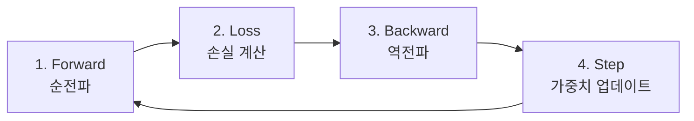

> 이 글은 **딥러닝 기초 시리즈** 4편 중 1편입니다.
> 전체 코드는 [tutorials-python/ai/deep-learning-basics](https://github.com/kenshin579/tutorials-python/tree/master/ai/deep-learning-basics)에서 확인할 수 있습니다.

딥러닝을 배우려면 먼저 **이미지가 컴퓨터에서 어떻게 표현되는지** 이해해야 합니다.
이 글에서는 이미지의 디지털 표현부터 시작하여 PyTorch로 신경망 학습의 핵심 사이클을 직접 체험해봅니다.

## 1. 이미지는 숫자다

우리 눈에 보이는 사진은 컴퓨터에게 **숫자로 이루어진 3차원 배열**입니다.

```python
from PIL import Image
import numpy as np

img = Image.open("sample_image.png").convert("RGB")
np_img = np.array(img)

print(f"이미지 shape: {np_img.shape}")
# 이미지 shape: (280, 280, 3)
#  → 높이=280px, 너비=280px, 채널=3(RGB)
```

- **height(높이)**: 세로 픽셀 수
- **width(너비)**: 가로 픽셀 수
- **channels(채널)**: 색상 채널 수 — RGB는 Red, Green, Blue 3개

각 픽셀의 값은 **0~255** 범위의 정수이며, 0은 검은색, 255는 해당 채널의 최대 밝기를 의미합니다.

### 이미지 크롭(Crop)

numpy 슬라이싱으로 이미지의 특정 영역을 잘라낼 수 있습니다.

```python
# 이미지 중앙 영역을 크롭
h, w = np_img.shape[:2]
crop_h, crop_w = 100, 150
start_h = h // 2 - crop_h // 2
start_w = w // 2 - crop_w // 2
cropped = np_img[start_h:start_h+crop_h, start_w:start_w+crop_w]

print(f"크롭 전: {np_img.shape} → 크롭 후: {cropped.shape}")
# 크롭 전: (280, 280, 3) → 크롭 후: (100, 150, 3)
```

배열의 인덱싱은 `[높이 범위, 너비 범위, 채널]` 순서입니다.

### RGB 채널 분리

컬러 이미지는 R, G, B 3개 채널의 조합입니다. 각 채널만 남기면 해당 색상 성분을 시각적으로 확인할 수 있습니다.

```python
import matplotlib.pyplot as plt

fig, axes = plt.subplots(1, 4, figsize=(16, 4))

axes[0].imshow(cropped)
axes[0].set_title("Original")

channel_names = ["Red", "Green", "Blue"]
for i, name in enumerate(channel_names):
    channel_img = np.zeros_like(cropped)
    channel_img[:, :, i] = cropped[:, :, i]  # 해당 채널만 복사
    axes[i + 1].imshow(channel_img)
    axes[i + 1].set_title(f"{name} Channel")

plt.tight_layout()
plt.show()
```

3개 채널을 평균내면 **그레이스케일(흑백)** 이미지가 됩니다.

```python
grey = np.mean(cropped, axis=2).astype(np.uint8)
print(f"그레이스케일 shape: {grey.shape}")
# (100, 150) — 채널 차원이 사라짐
```

## 2. PyTorch 텐서 소개

PyTorch는 딥러닝에 특화된 텐서 연산 라이브러리입니다. numpy 배열과 유사하지만, 두 가지 핵심 차이가 있습니다:

- **GPU 가속**: CUDA를 통한 병렬 연산
- **자동 미분(autograd)**: 역전파에 필요한 기울기를 자동으로 계산

```python
import torch

# numpy → tensor 변환
np_arr = np.array([1.0, 2.0, 3.0])
tensor = torch.from_numpy(np_arr)

# 디바이스 설정
device = "cuda" if torch.cuda.is_available() else "cpu"
print(f"사용 디바이스: {device}")

# 텐서 연산
a = torch.tensor([1.0, 2.0, 3.0])
b = torch.tensor([4.0, 5.0, 6.0])
print(f"덧셈: {a + b}")       # tensor([5., 7., 9.])
print(f"내적: {torch.dot(a, b)}")  # tensor(32.)
```

## 3. 신경망의 가장 작은 단위: Linear 레이어

신경망의 기본 구성 요소인 **Linear 레이어**는 다음 연산을 수행합니다:

$$y = xW^T + b$$

| 기호 | 의미 | 예시 |
|---|---|---|
| x | 입력 벡터 | (4,) 차원 |
| W | 가중치 행렬 | (2, 4) — 학습 대상 |
| b | 편향 벡터 | (2,) — 학습 대상 |
| y | 출력 벡터 | (2,) 차원 |

```python
import torch.nn as nn

# 4차원 입력 → 2차원 출력
linear = nn.Linear(4, 2, bias=True).to(device)

print(f"가중치(W) shape: {linear.weight.shape}")  # torch.Size([2, 4])
print(f"편향(b) shape: {linear.bias.shape}")       # torch.Size([2])
```

가중치(W)와 편향(b)은 **학습을 통해 최적값을 찾아야 하는 파라미터**입니다. 초기값은 랜덤으로 설정됩니다.

## 4. 학습의 핵심 사이클

딥러닝 학습은 4단계의 반복입니다:



| 단계 | 설명 | PyTorch 코드 |
|---|---|---|
| Forward | 입력을 모델에 통과시켜 예측값 계산 | `prediction = linear(X)` |
| Loss | 예측값과 정답의 차이 측정 | `loss = criterion(prediction, Y)` |
| Backward | 손실에 대한 각 가중치의 기울기 계산 | `loss.backward()` |
| Step | 기울기 방향으로 가중치 업데이트 | `optimizer.step()` |

### 한 사이클 상세 관찰

```python
# 간단한 분류 문제 설정
inputs = np.array([2.0, 4.0, 5.0, 6.0])
target_class = 0

X = torch.Tensor(inputs).view(1, -1).to(device)
Y = torch.tensor([target_class]).to(device)

criterion = nn.CrossEntropyLoss().to(device)
optimizer = torch.optim.SGD(linear.parameters(), lr=0.1)
```

```python
# 1단계: Forward (순전파)
optimizer.zero_grad()  # 기울기 초기화 (누적 방지)
prediction = linear(X)
# prediction: tensor([[-2.23, -0.70]])

# 2단계: Loss (손실 계산)
loss = criterion(prediction, Y)
# loss: 1.7273

# 3단계: Backward (역전파) — 기울기 계산
loss.backward()
# linear.weight.grad에 기울기가 저장됨

# 4단계: Step (가중치 업데이트)
optimizer.step()
# weight가 기울기 방향으로 lr(0.1)만큼 업데이트됨
```

`optimizer.zero_grad()`를 매번 호출하는 이유는 PyTorch가 기울기를 **누적(accumulate)**하기 때문입니다. 초기화하지 않으면 이전 배치의 기울기와 합산됩니다.

## 5. 반복 학습으로 손실 줄이기

위의 4단계를 여러 번 반복하면, 가중치가 점차 최적값에 수렴하며 **손실(loss)이 줄어듭니다**.

```python
losses = []
for epoch in range(20):
    optimizer.zero_grad()
    prediction = linear(X)
    loss = criterion(prediction, Y)
    loss.backward()
    optimizer.step()
    losses.append(loss.item())
    if (epoch + 1) % 5 == 0:
        print(f"Epoch {epoch+1:02d} | loss = {loss.item():.6f}")
```

```
Epoch 05 | loss = 0.000342
Epoch 10 | loss = 0.000005
Epoch 15 | loss = 0.000005
Epoch 20 | loss = 0.000005
```

loss가 0에 수렴한다는 것은 모델의 예측이 정답에 가까워졌다는 의미입니다.

## 정리

| 개념 | 설명 |
|---|---|
| 이미지 | 숫자로 이루어진 3차원 배열 (H × W × C) |
| 텐서 | PyTorch의 기본 데이터 구조 (GPU 연산 + 자동 미분 지원) |
| Linear 레이어 | y = xW^T + b 연산을 수행하는 신경망의 기본 단위 |
| 학습 사이클 | Forward → Loss → Backward → Step 의 반복 |

핵심 메시지: **이미지는 숫자 배열**이고, **학습은 가중치 업데이트의 반복**입니다.

다음 편에서는 실제 이미지 데이터셋(FashionMNIST)을 사용하여 완전연결 신경망을 학습해봅니다.

## 참고 자료

- [PyTorch 공식 튜토리얼](https://pytorch.org/tutorials/)
- [전체 소스 코드 - tutorials-python/ai/deep-learning-basics](https://github.com/kenshin579/tutorials-python/tree/master/ai/deep-learning-basics)
