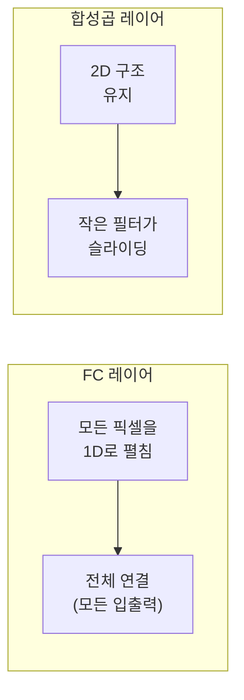
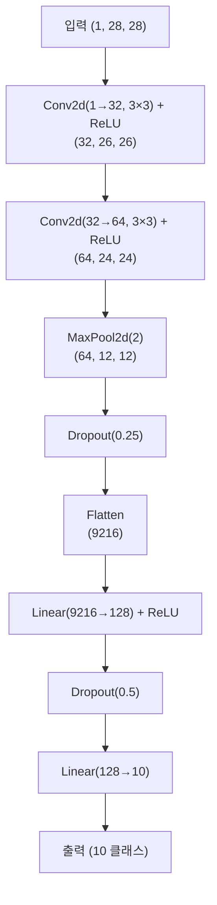
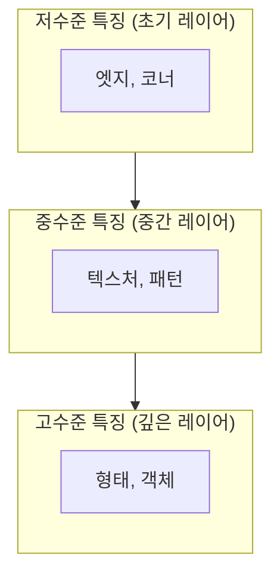

> 이 글은 **딥러닝 기초 시리즈** 4편 중 3편입니다.
> 전체 코드는 [tutorials-python/ai/deep-learning-basics](https://github.com/kenshin579/tutorials-python/tree/master/ai/deep-learning-basics)에서 확인할 수 있습니다.

2편에서 완전연결(FC) 신경망의 치명적인 문제를 확인했습니다 — **계층을 쌓을수록 파라미터가 폭발적으로 증가**한다는 것입니다. 이번 편에서는 **CNN(Convolutional Neural Network, 합성곱 신경망)**이 이 문제를 어떻게 해결하는지 살펴봅니다.

## 1. 합성곱(Convolution)이란?

FC 레이어의 문제는 이미지의 모든 픽셀을 1차원으로 펼쳐 처리한다는 것입니다. 이 과정에서 **인접 픽셀 간의 공간적 관계(지역성)**가 완전히 사라집니다.

합성곱은 완전히 다른 접근 방식을 취합니다:



| 특성 | FC (완전연결) | CNN (합성곱) |
|---|---|---|
| 입력 처리 | 1D로 펼침 | **2D 구조 유지** |
| 연결 방식 | 모든 입출력 연결 | **지역적 연결** (커널 크기만큼) |
| 파라미터 | 입력 × 출력 | **커널 크기 × 채널 수** |
| 이미지 크기 의존성 | 비례하여 폭발 | **무관** |

### 핵심 아이디어 두 가지

**지역적 연결(Local Connectivity)**: 작은 필터(예: 3×3)가 이미지 위를 슬라이딩하며 해당 영역의 특징만 추출합니다. 전체 이미지를 한 번에 보지 않고, **작은 영역씩** 봅니다.

**파라미터 공유(Parameter Sharing)**: 동일한 필터를 이미지의 모든 위치에서 재사용합니다. 3×3 필터 하나의 파라미터는 단 9개이며, 이것이 28×28 이미지 전체를 커버합니다.

## 2. CNN의 핵심 구성 요소

| 레이어 | 역할 | PyTorch |
|---|---|---|
| Conv2d | 합성곱으로 특징 추출 | `nn.Conv2d(in, out, kernel)` |
| ReLU | 비선형성 추가 (음수 → 0) | `F.relu(x)` |
| MaxPool2d | 공간 크기 축소 (최대값 추출) | `F.max_pool2d(x, 2)` |
| Dropout | 과적합 방지 (뉴런 무작위 비활성화) | `nn.Dropout(p)` |
| Linear | 최종 분류 | `nn.Linear(in, out)` |

### 각 레이어가 shape을 어떻게 변화시키는지 확인

```python
import torch
import torch.nn as nn
import torch.nn.functional as F

sample = torch.randn(1, 1, 28, 28)  # (배치, 채널, 높이, 너비)
print(f"입력:             {sample.shape}")

conv1_out = nn.Conv2d(1, 32, 3)(sample)
print(f"Conv2d(1→32, 3×3): {conv1_out.shape}")
# → (1, 32, 26, 26) — 28-3+1=26

conv2_out = nn.Conv2d(32, 64, 3)(conv1_out)
print(f"Conv2d(32→64, 3×3): {conv2_out.shape}")
# → (1, 64, 24, 24) — 26-3+1=24

pool_out = F.max_pool2d(conv2_out, 2)
print(f"MaxPool2d(2):       {pool_out.shape}")
# → (1, 64, 12, 12) — 24/2=12
```

Conv2d를 통과하면 크기가 `커널-1`만큼 줄고, MaxPool2d를 통과하면 **절반**으로 줄어듭니다.

## 3. CNN 모델 구현



```python
class ConvNet(nn.Module):
    def __init__(self):
        super().__init__()
        self.conv1 = nn.Conv2d(1, 32, 3)    # 합성곱 레이어 1
        self.conv2 = nn.Conv2d(32, 64, 3)   # 합성곱 레이어 2
        self.dropout1 = nn.Dropout(0.25)
        self.dropout2 = nn.Dropout(0.5)
        self.fc1 = nn.Linear(9216, 128)      # 완전연결 레이어 1
        self.fc2 = nn.Linear(128, 10)        # 완전연결 레이어 2

    def forward(self, x):
        x = F.relu(self.conv1(x))      # (N, 32, 26, 26)
        x = F.relu(self.conv2(x))      # (N, 64, 24, 24)
        x = F.max_pool2d(x, 2)         # (N, 64, 12, 12)
        x = self.dropout1(x)
        x = torch.flatten(x, 1)        # (N, 9216)
        x = F.relu(self.fc1(x))        # (N, 128)
        x = self.dropout2(x)
        x = self.fc2(x)                # (N, 10)
        return F.log_softmax(x, dim=1)
```

FC 모델과의 가장 큰 차이점: CNN은 **이미지를 Flatten하지 않고 2D 구조 그대로** 입력받습니다.

```python
# FC: X = X.view(-1, 28 * 28)  ← Flatten 필요
# CNN: X = X                    ← 그대로 사용!
```

## 4. FashionMNIST 학습

```python
cnn_net = ConvNet().to(device)
optimizer = torch.optim.SGD(cnn_net.parameters(), lr=0.001, momentum=0.9)
criterion = nn.CrossEntropyLoss().to(device)

for epoch in range(10):
    start_time = time.time()
    avg_cost = 0
    for X, Y in train_dataloader:
        X = X.to(device)  # Flatten 없이 그대로!
        Y = Y.to(device)
        optimizer.zero_grad()
        cost = criterion(cnn_net(X), Y)
        cost.backward()
        optimizer.step()
        avg_cost += cost.item() / len(train_dataloader)

    elapsed = time.time() - start_time
    print(f"Epoch {epoch+1:02d} | cost = {avg_cost:.6f} | time = {elapsed:.2f}s")
```

## 5. FC NN vs CNN 비교

세 모델을 동일 조건(SGD, lr=0.001, momentum=0.9, 10 에포크)으로 학습한 결과입니다.

### 파라미터 수 비교

| 모델 | 파라미터 수 | FC 1계층 대비 |
|---|---|---|
| FC 1계층 | 7,850 | 1x |
| FC 3계층 | 67,706,090 | 8,625x |
| **CNN** | **1,199,882** | **153x** |

CNN은 FC 3계층보다 **약 56배 적은 파라미터**를 사용합니다.

### CNN 파라미터가 적은 이유

```
Conv2d(1→32, 3×3):  1 × 32 × 3 × 3 + 32(bias) =        320
Conv2d(32→64, 3×3): 32 × 64 × 3 × 3 + 64(bias) =     18,496
Linear(9216→128):   9216 × 128 + 128(bias) =        1,179,776
Linear(128→10):     128 × 10 + 10(bias) =                1,290
──────────────────────────────────────────────────
합계:                                               1,199,882
```

합성곱 레이어의 파라미터(320 + 18,496 = **18,816개**)는 전체의 **1.6%**에 불과합니다.
나머지 대부분은 마지막 FC 레이어에 있습니다. 이것이 합성곱의 파라미터 효율성입니다.

### 성능 비교 요약

| 항목 | FC 1계층 | FC 3계층 | CNN |
|---|---|---|---|
| 파라미터 수 | 7,850 | 67,706,090 | 1,199,882 |
| 에포크 당 시간 | ~4s | ~11s | ~5s |
| 10 에포크 후 cost | ~0.40 | ~0.29 | ~0.22 |

CNN은 FC 3계층보다:
- 파라미터가 **56배 적고**
- 학습 시간이 **약 2배 빠르며**
- cost가 **더 낮습니다** (성능이 더 좋음)

## CNN이 효과적인 이유 정리



CNN이 이미지 처리에 적합한 근본적인 이유는 **이미지의 특성**과 맞아떨어지기 때문입니다:

1. **지역성(Locality)**: 이미지의 의미 있는 패턴은 인접 픽셀들의 조합으로 만들어집니다. 옷의 소매, 신발의 밑창 등은 특정 위치의 **지역적 패턴**입니다.

2. **병진 불변성(Translation Invariance)**: 동일한 패턴은 이미지의 어디에 있든 같은 의미를 가집니다. 같은 필터를 전체에 공유하므로 위치에 관계없이 패턴을 인식합니다.

3. **계층적 특징 학습**: 초기 레이어는 엣지나 코너 같은 저수준 특징을, 깊은 레이어는 형태나 객체 같은 고수준 특징을 자동으로 학습합니다.

다음 편에서는 분류가 아닌 **생성**으로 방향을 바꿔, GAN으로 새로운 패션 아이템 이미지를 만들어봅니다.

## 참고 자료

- [CNN Explainer - 시각적 CNN 학습 도구](https://poloclub.github.io/cnn-explainer/)
- [PyTorch Conv2d 공식 문서](https://pytorch.org/docs/stable/generated/torch.nn.Conv2d.html)
- [전체 소스 코드 - tutorials-python/ai/deep-learning-basics](https://github.com/kenshin579/tutorials-python/tree/master/ai/deep-learning-basics)
