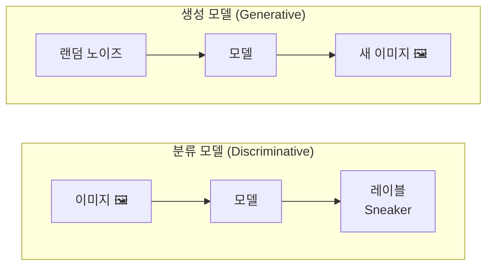
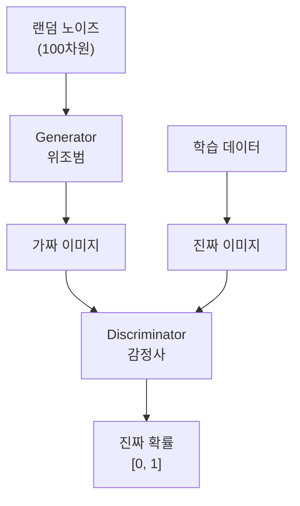
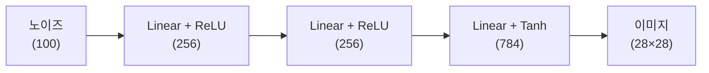
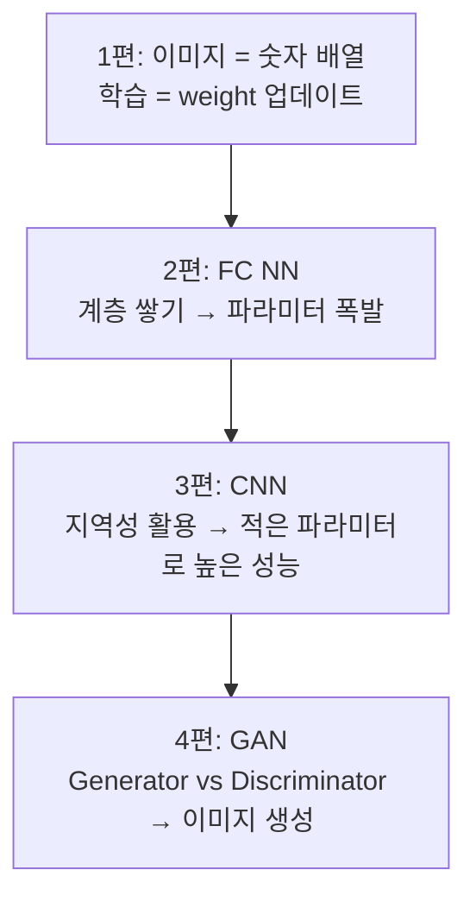

> 이 글은 **딥러닝 기초 시리즈** 4편 중 마지막 편입니다.
> 전체 코드는 [tutorials-python/ai/deep-learning-basics](https://github.com/kenshin579/tutorials-python/tree/master/ai/deep-learning-basics)에서 확인할 수 있습니다.

지금까지 이미지를 **분류**하는 모델을 학습했습니다. 이번 편에서는 방향을 완전히 바꿔, 아무것도 없는 상태에서 **새로운 이미지를 생성**하는 모델을 만들어봅니다.

## 1. 분류 모델 vs 생성 모델



| | 분류 모델 | 생성 모델 |
|---|---|---|
| 입력 | 이미지 | 랜덤 노이즈 |
| 출력 | 클래스 레이블 | 새로운 이미지 |
| 학습 대상 | 클래스 경계 | **데이터의 확률 분포** |
| 예시 | "이것은 Sneaker" | "Sneaker처럼 보이는 이미지 생성" |

생성 모델은 학습 데이터의 **확률 분포**를 학습하여, 그 분포에서 새로운 샘플을 뽑아냅니다.

## 2. GAN의 구조

**GAN(Generative Adversarial Network, 생성적 적대 신경망)**은 2014년 Ian Goodfellow가 제안한 모델로, 두 개의 신경망이 서로 **경쟁(적대적 학습)**하며 발전합니다.



| 구성 요소 | 비유 | 역할 |
|---|---|---|
| Generator | 위조범 | 랜덤 노이즈로부터 가짜 이미지를 생성 |
| Discriminator | 감정사 | 진짜/가짜 이미지를 판별 |

학습이 진행되면:
- Generator는 점점 정교한 가짜 이미지를 만들고
- Discriminator는 점점 정밀하게 판별하려 하며
- 최종적으로 Generator가 **진짜와 구별 불가능한 이미지**를 생성하게 됩니다

## 3. 데이터 준비

GAN에서는 이미지의 픽셀 값을 **[-1, 1] 범위**로 정규화합니다. Generator의 출력 활성화 함수인 Tanh의 출력 범위가 [-1, 1]이기 때문입니다.

```python
import torch
import torch.nn as nn
import torch.optim as optim
import torchvision.datasets as dsets
import torchvision.transforms as transforms
import numpy as np
from matplotlib import pyplot as plt

device = torch.device("cuda" if torch.cuda.is_available() else "cpu")

standardizer = transforms.Compose([
    transforms.ToTensor(),
    transforms.Normalize(mean=(0.5,), std=(0.5,))  # [0,1] → [-1,1]
])

train_data = dsets.FashionMNIST(
    root="data/", train=True, transform=standardizer, download=True
)

batch_size = 200
train_loader = torch.utils.data.DataLoader(
    train_data, batch_size, shuffle=True
)
```

## 4. 모델 구현

### Generator (생성자)

랜덤 노이즈(100차원)를 받아 28×28 이미지를 생성합니다.



```python
d_noise = 100   # 노이즈 차원
d_hidden = 256  # 은닉층 차원

def sample_noise(batch_size=1, d_noise=100):
    return torch.randn(batch_size, d_noise, device=device)

G = nn.Sequential(
    nn.Linear(d_noise, d_hidden),
    nn.ReLU(),
    nn.Dropout(0.1),
    nn.Linear(d_hidden, d_hidden),
    nn.ReLU(),
    nn.Dropout(0.1),
    nn.Linear(d_hidden, 28 * 28),
    nn.Tanh(),  # 출력 범위: [-1, 1]
).to(device)
```

**Tanh**를 사용하는 이유: 이미지 픽셀이 [-1, 1]로 정규화되어 있으므로, Generator의 출력도 같은 범위여야 합니다.

### Discriminator (판별자)

28×28 이미지를 받아 "진짜일 확률"을 출력합니다.

```python
D = nn.Sequential(
    nn.Linear(28 * 28, d_hidden),
    nn.LeakyReLU(0.2),
    nn.Dropout(0.1),
    nn.Linear(d_hidden, d_hidden),
    nn.LeakyReLU(0.2),
    nn.Dropout(0.1),
    nn.Linear(d_hidden, 1),
    nn.Sigmoid(),  # 출력: 진짜일 확률 [0, 1]
).to(device)
```

**LeakyReLU**를 사용하는 이유: 일반 ReLU는 음수 입력을 모두 0으로 만들어 기울기가 사라지는 문제(dying ReLU)가 있습니다. LeakyReLU는 음수에도 작은 기울기(0.2)를 허용하여 안정적인 학습을 돕습니다.

### 파라미터 수

```python
print(f"Generator 파라미터:     {sum(p.numel() for p in G.parameters()):,}")
# Generator 파라미터:     267,536
print(f"Discriminator 파라미터: {sum(p.numel() for p in D.parameters()):,}")
# Discriminator 파라미터: 267,009
```

두 모델 합쳐 **약 53만 개**로, CNN(약 120만 개)보다 적습니다.

## 5. GAN 학습 과정

매 배치마다 두 단계로 학습합니다:

### Discriminator 학습

진짜 이미지는 1, 가짜 이미지는 0으로 판별하도록 학습합니다.

```python
# 진짜 이미지에 대한 판별
p_real = D(real_images.view(-1, 28*28))
loss_real = -torch.log(p_real).mean()       # 1에 가까울수록 손실 감소

# 가짜 이미지에 대한 판별
p_fake = D(G(sample_noise(batch_size)))
loss_fake = -torch.log(1.0 - p_fake).mean() # 0에 가까울수록 손실 감소

loss_d = loss_real + loss_fake
loss_d.backward()
optimizer_d.step()
```

### Generator 학습

가짜 이미지를 Discriminator가 **진짜로 판별**하도록 속이는 방향으로 학습합니다.

```python
p_fake = D(G(sample_noise(batch_size)))
loss_g = -torch.log(p_fake).mean()  # 1에 가까울수록 손실 감소 (속이기 성공)
loss_g.backward()
optimizer_g.step()
```

### 전체 학습 루프

```python
def init_weights(model):
    for p in model.parameters():
        if p.dim() > 1:
            nn.init.xavier_normal_(p)
        else:
            nn.init.uniform_(p, 0.1, 0.2)

init_weights(G)
init_weights(D)

opt_g = optim.Adam(G.parameters(), lr=0.0002)
opt_d = optim.Adam(D.parameters(), lr=0.0002)

for epoch in range(100):
    train_one_epoch(G, D, opt_g, opt_d)
    p_real, p_fake = evaluate(G, D)

    if (epoch + 1) % 10 == 0:
        print(f"Epoch {epoch+1:3d} | p_real: {p_real:.4f} | p_fake: {p_fake:.4f}")
```

**Adam 옵티마이저**를 사용하는 이유: SGD보다 학습률을 적응적으로 조절하여 GAN의 불안정한 학습을 안정화합니다.

## 6. 학습 결과 분석

### p_real과 p_fake의 수렴

- **p_real**: Discriminator가 진짜 이미지를 진짜로 판별하는 확률
- **p_fake**: Discriminator가 가짜 이미지를 진짜로 판별하는 확률

이상적인 수렴: **둘 다 0.5**에 수렴합니다. 이는 Discriminator가 진짜와 가짜를 **전혀 구별하지 못한다**는 의미입니다 — Generator가 완벽한 이미지를 생성하고 있다는 뜻입니다.

### 에포크별 생성 이미지 변화

학습 초기에는 Generator가 노이즈만 출력하지만, 학습이 진행될수록 점점 패션 아이템의 형태가 나타납니다:

| 에포크 | 생성 이미지 특징 |
|---|---|
| 1~10 | 의미 없는 노이즈 |
| 20~30 | 흐릿한 형태가 나타남 |
| 50~70 | 옷, 신발의 윤곽이 보임 |
| 80~100 | 패션 아이템으로 인식 가능한 이미지 |

## 7. GAN 학습의 어려움

GAN은 강력하지만, 학습이 쉽지 않습니다:

### 모드 붕괴(Mode Collapse)

Generator가 **한 가지 종류의 이미지만** 반복적으로 생성하는 현상입니다. 예를 들어 10가지 패션 아이템 중 Trouser만 계속 생성하는 경우입니다.

원인: Generator가 Discriminator를 속이는 "안전한" 출력 하나를 발견하면, 다양성을 포기하고 그것만 반복합니다.

### 학습 불안정

Generator와 Discriminator의 학습 속도 균형이 중요합니다:
- Discriminator가 너무 강하면: Generator의 기울기가 사라져 학습 불가
- Generator가 너무 강하면: Discriminator가 학습할 동기를 잃음

### 평가 기준 부재

분류 모델은 정확도(accuracy)로 성능을 측정하지만, 생성 모델은 "이미지가 얼마나 자연스러운가"를 객관적으로 측정하기 어렵습니다. FID(Frechet Inception Distance) 같은 지표가 사용되지만, 완벽하지 않습니다.

## 시리즈 전체 요약



| 편 | 모델 | 핵심 메시지 |
|---|---|---|
| 1편 | Linear | 이미지는 숫자 배열이며, 학습은 가중치를 업데이트하는 반복이다 |
| 2편 | FC NN | 완전연결 신경망은 계층을 쌓을수록 파라미터가 폭발한다 |
| 3편 | CNN | 합성곱은 이미지의 지역성을 활용하여 적은 파라미터로 높은 성능을 달성한다 |
| 4편 | GAN | Generator와 Discriminator의 경쟁을 통해 새로운 이미지를 생성할 수 있다 |

이 시리즈에서 다룬 개념들은 현대 AI의 기반입니다. 최근 화제인 Stable Diffusion, DALL-E 같은 이미지 생성 모델도 GAN의 아이디어에서 출발하여 Diffusion 기법으로 발전한 것입니다.

## 참고 자료

- [GAN 원논문 - Goodfellow et al., 2014](https://arxiv.org/abs/1406.2661)
- [PyTorch DCGAN 튜토리얼](https://pytorch.org/tutorials/beginner/dcgan_faces_tutorial.html)
- [전체 소스 코드 - tutorials-python/ai/deep-learning-basics](https://github.com/kenshin579/tutorials-python/tree/master/ai/deep-learning-basics)
