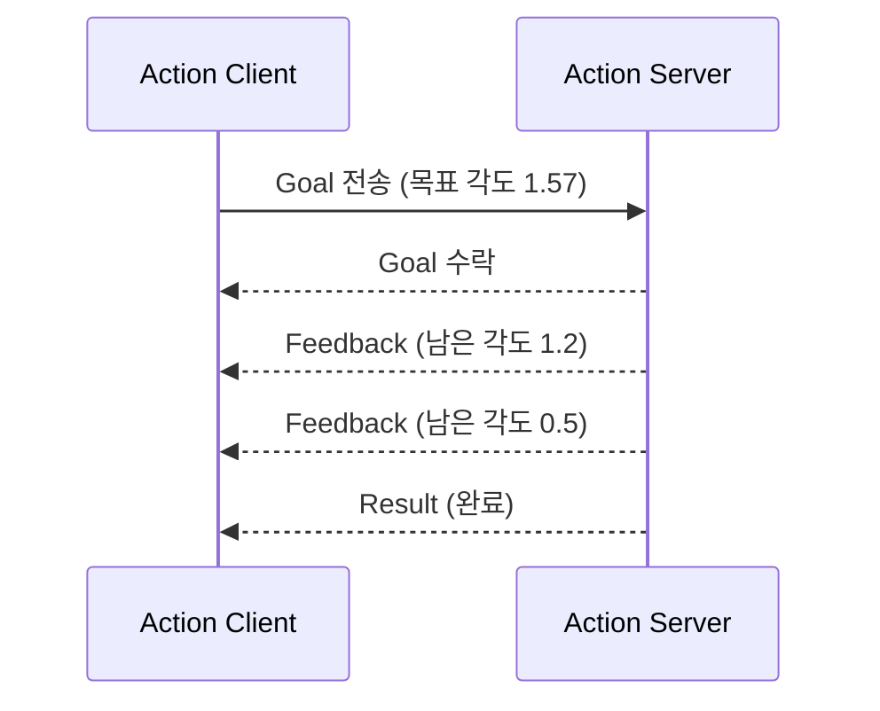
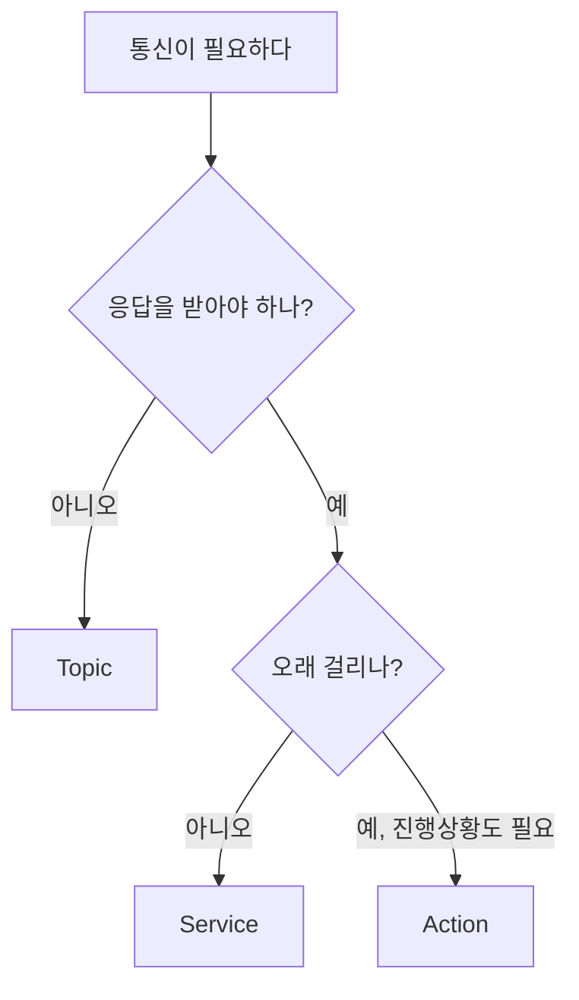

<!-- TODO(초안 메모, 발행 전 삭제): 이 글의 명령어 출력은 Mac + Docker(ros:jazzy-ros-base, arm64)에서 캡처한 것이다. 네이티브 Ubuntu 24.04에서 실습하면서 실제 출력으로 교체하고, TODO(실습) 표시된 스크린샷을 채울 것. -->

로봇 소프트웨어를 한 번도 다뤄본 적 없는 백엔드 개발자가 ROS2를 처음부터 공부하면서 남기는 시리즈다. 1편에서는 Ubuntu 24.04에 ROS2 Jazzy를 설치하고, `turtlesim`이라는 연습용 시뮬레이터로 ROS2의 다섯 가지 핵심 개념을 직접 실행해 본다.

이 시리즈는 로봇 전공 지식을 전제하지 않는다. 대신 **마이크로서비스, MQTT, gRPC를 다뤄본 경험**을 지렛대로 삼아 ROS2를 설명한다. 알고 보면 ROS2는 로봇이라는 도메인에 맞춰 만들어진 분산 시스템 런타임이고, 백엔드에서 쓰던 개념이 거의 그대로 대응된다.

**이 글에서 하는 것**

- ROS2가 무엇이고 무엇이 아닌지 정리한다
- Ubuntu 24.04에 ROS2 Jazzy를 설치한다
- turtlesim으로 Node, Topic, Service, Action, Parameter를 하나씩 실행해 본다
- ROS2 개념을 백엔드 개념에 대응시켜 정리한다

**실습 환경**

| 항목 | 버전 |
|---|---|
| OS | Ubuntu 24.04 LTS (Noble Numbat) |
| ROS2 | Jazzy Jalisco |
| 언어 | 이 글은 CLI만 사용한다 (코드는 2편부터) |

# 1. ROS2란 무엇인가

## 1.1 로봇 소프트웨어가 풀어야 하는 문제

자율주행 로봇 한 대가 움직이려면 최소한 이런 일들이 동시에 일어나야 한다.

- 라이다(LiDAR) 센서가 초당 수십 번 주변 거리 데이터를 쏟아낸다
- 그 데이터로 지도를 만들고 로봇이 지도 어디쯤 있는지 계산한다
- 목적지까지 경로를 계획한다
- 계획대로 바퀴 모터에 속도 명령을 내린다
- 사람이 언제든 개입해서 멈추거나 목적지를 바꿀 수 있어야 한다

이걸 하나의 거대한 프로그램으로 만들면 센서 하나를 바꿀 때마다 전체를 건드려야 한다. 그래서 로봇 소프트웨어는 **기능별로 프로세스를 나누고 서로 메시지를 주고받는 구조**로 만든다. 백엔드에서 모놀리스를 마이크로서비스로 쪼개는 것과 같은 이유다.


## 1.2 ROS는 운영체제가 아니다

이름이 Robot Operating System이라 오해하기 쉽지만, ROS는 운영체제가 아니다. Ubuntu 위에서 돌아가는 **미들웨어와 도구 모음**이다. 크게 세 가지를 제공한다.

1. **통신 미들웨어**: 프로세스끼리 메시지를 주고받는 규격과 라이브러리
2. **개발 도구**: 빌드 도구(`colcon`), CLI(`ros2`), 시각화 도구(RViz, rqt), 시뮬레이터 연동
3. **패키지 생태계**: 센서 드라이버, SLAM, 내비게이션, 로봇팔 제어 등 이미 만들어진 패키지들

백엔드 식으로 요약하면 이렇다.

> ROS2 = 메시징 미들웨어 + 프로세스 실행/설정 관리 + 관측 도구 + 도메인 라이브러리 생태계

## 1.3 ROS1과 ROS2

자료를 찾다 보면 ROS1 기준 글이 많이 나온다. 둘은 이름만 비슷할 뿐 내부 구조가 다르다.

| | ROS1 | ROS2 |
|---|---|---|
| 통신 | 자체 프로토콜(TCPROS), **마스터 노드 필수** | **DDS** 기반, 마스터 없음 |
| 노드 발견 | roscore가 중개 | 노드끼리 자동으로 서로를 발견 |
| 실시간성 | 약함 | 실시간 제어를 염두에 두고 설계 |
| 멀티 로봇 | 어려움 | 기본 지원 |
| 지원 | Noetic이 마지막, 2025년 5월 EOL | 현재 개발 중 |

**마스터 노드가 사라진 것**이 가장 큰 변화다. ROS1은 `roscore`라는 중앙 프로세스가 떠 있어야 노드들이 서로를 찾을 수 있었다. 이 프로세스가 죽으면 전체가 멈추는 단일 장애점이었다. ROS2는 DDS라는 산업 표준 미들웨어를 쓰면서 중앙 서버 없이 노드끼리 직접 서로를 발견한다.

MQTT를 써본 입장에서는 이 지점이 꽤 낯설다. MQTT는 브로커가 반드시 있어야 하고 모든 메시지가 브로커를 거친다. ROS2에는 브로커가 없고 노드끼리 직접 연결한다. Consul이나 Eureka 같은 레지스트리 없이 서비스 디스커버리가 되는 셈인데, 어떻게 가능한지는 사이드 트랙 글에서 패킷까지 까 보면서 다룬다.

**새로 시작한다면 무조건 ROS2다.** 이 시리즈도 ROS2 기준이고, 인터넷에서 `roscore`, `catkin_make`, `rospy`가 나오는 글을 만나면 ROS1 자료라고 보면 된다.

## 1.4 어떤 배포판을 고를 것인가

ROS2는 Ubuntu처럼 배포판(distribution) 단위로 릴리즈되고, **배포판마다 지원하는 Ubuntu 버전이 정해져 있다.** 여기서 짝을 잘못 맞추면 설치부터 막힌다.

| ROS2 배포판 | Ubuntu | 지원 종료 | 비고 |
|---|---|---|---|
| Humble Hawksbill | 22.04 | 2027년 5월 | 아직 자료가 가장 많다 |
| **Jazzy Jalisco** | **24.04** | **2029년 5월** | **이 시리즈 기준** |
| Kilted Kaiju | 24.04 | 2026년 11월 | 비 LTS 릴리즈 |
| Lyrical Luth | 26.04 | 2031년 5월 | 최신 LTS |

Jazzy를 고른 이유는 두 가지다. Ubuntu 24.04와 짝이 맞는 LTS라 2029년까지 지원되고, 앞으로 쓸 Gazebo(시뮬레이터), Nav2(자율주행), TurtleBot3 패키지가 모두 안정적으로 릴리즈되어 있다. 최신 Lyrical도 좋지만 튜토리얼과 서드파티 자료 대부분이 아직 Jazzy 기준이라, 처음 배우는 입장에서는 자료가 많은 쪽이 낫다.

# 2. ROS2 Jazzy 설치하기

Ubuntu 24.04가 설치되어 있다는 전제로 진행한다. 전체 과정은 apt 저장소를 하나 추가하고 패키지를 설치하는, 흔한 Ubuntu 패키지 설치와 다르지 않다.

## 2.1 로케일 확인

ROS2는 UTF-8 로케일을 요구한다. 먼저 현재 설정을 확인한다.

```bash
locale
```

`LANG`이나 `LC_ALL`이 UTF-8이 아니면 아래처럼 설정한다. 데스크톱으로 설치한 Ubuntu라면 대개 이미 UTF-8이라 건너뛰어도 된다.

```bash
sudo apt update && sudo apt install locales
sudo locale-gen en_US en_US.UTF-8
sudo update-locale LC_ALL=en_US.UTF-8 LANG=en_US.UTF-8
export LANG=en_US.UTF-8
```

## 2.2 apt 저장소 등록

ROS2 패키지는 Ubuntu 기본 저장소에 없다. ROS 저장소를 추가해야 한다.

먼저 universe 저장소를 켠다.

```bash
sudo apt install software-properties-common
sudo add-apt-repository universe
```

그다음 ROS 저장소 정보가 담긴 `ros2-apt-source` 패키지를 설치한다. 예전 문서에는 GPG 키를 직접 내려받아 `/etc/apt/sources.list.d/`에 파일을 만드는 방식이 나오는데, 지금은 이 과정을 패키지 하나로 대신한다. 키가 갱신되면 apt 업데이트로 따라간다.

```bash
sudo apt update && sudo apt install curl -y
export ROS_APT_SOURCE_VERSION=$(curl -s https://api.github.com/repos/ros-infrastructure/ros-apt-source/releases/latest | grep -F "tag_name" | awk -F'"' '{print $4}')
curl -L -o /tmp/ros2-apt-source.deb "https://github.com/ros-infrastructure/ros-apt-source/releases/download/${ROS_APT_SOURCE_VERSION}/ros2-apt-source_${ROS_APT_SOURCE_VERSION}.$(. /etc/os-release && echo ${UBUNTU_CODENAME:-${VERSION_CODENAME}})_all.deb"
sudo dpkg -i /tmp/ros2-apt-source.deb
```

## 2.3 패키지 설치

저장소를 추가했으니 시스템을 최신으로 올리고 ROS2를 설치한다.

```bash
sudo apt update && sudo apt upgrade
sudo apt install ros-jazzy-desktop
```

`ros-jazzy-desktop`은 약 4GB 정도를 차지하고, 네트워크 속도에 따라 십여 분 걸린다. 설치 패키지는 크게 세 가지 중에서 고른다.

| 패키지 | 포함 내용 | 언제 |
|---|---|---|
| `ros-jazzy-ros-base` | 통신 라이브러리와 CLI만 | GUI 없는 로봇 본체 |
| **`ros-jazzy-desktop`** | ros-base + RViz, 데모, 튜토리얼 | **학습용, 이 시리즈 기준** |
| `ros-jazzy-desktop-full` | desktop + 데모·시뮬레이션 관련 패키지를 더 넓게 포함 | 용량 여유가 있고 한 번에 다 깔고 싶을 때 |

개발 도구(colcon, rosdep 등)도 함께 설치한다. 2편에서 직접 패키지를 만들 때 필요하다.

```bash
sudo apt install ros-dev-tools
```

## 2.4 환경 설정

여기가 처음 설치할 때 가장 많이 걸려 넘어지는 부분이다. ROS2는 설치만 한다고 `ros2` 명령을 바로 쓸 수 없다. **터미널마다 환경 설정 스크립트를 불러와야 한다.**

```bash
source /opt/ros/jazzy/setup.bash
```

이 스크립트는 `PATH`, `PYTHONPATH`, `AMENT_PREFIX_PATH` 같은 환경 변수를 채워 넣는다. Python 가상환경의 `activate`와 비슷한 역할이라고 보면 된다. 매번 치기 번거로우니 `~/.bashrc`에 넣어둔다.

```bash
echo "source /opt/ros/jazzy/setup.bash" >> ~/.bashrc
source ~/.bashrc
```

제대로 적용됐는지 확인한다.

```bash
printenv ROS_DISTRO
# jazzy
```

> **팁**: 여러 배포판을 오가며 테스트할 계획이라면 `.bashrc`에 넣지 말고 `alias sj='source /opt/ros/jazzy/setup.bash'` 같은 alias를 두는 편이 낫다. 환경이 섞이면 원인 찾기 어려운 오류가 난다.

## 2.5 설치 확인 - talker와 listener

ROS2에는 설치 확인용 데모가 들어 있다. **터미널 두 개**를 열고 각각 실행한다. ROS2 실습은 터미널을 여러 개 쓰는 일이 많아서, 탭을 나눠 쓰거나 `terminator` 같은 도구를 쓰면 편하다.

터미널 1에서 메시지를 보내는 노드를 띄운다.

```bash
ros2 run demo_nodes_cpp talker
```

```text
[INFO] [1789313506.159174595] [talker]: Publishing: 'Hello World: 1'
[INFO] [1789313507.158795304] [talker]: Publishing: 'Hello World: 2'
[INFO] [1789313508.161687971] [talker]: Publishing: 'Hello World: 3'
[INFO] [1789313509.157932430] [talker]: Publishing: 'Hello World: 4'
[INFO] [1789313510.159467389] [talker]: Publishing: 'Hello World: 5'
```

터미널 2에서 받는 노드를 띄운다.

```bash
ros2 run demo_nodes_py listener
```

```text
[INFO] [1789313513.169665793] [listener]: I heard: [Hello World: 2]
[INFO] [1789313514.161243376] [listener]: I heard: [Hello World: 3]
[INFO] [1789313515.158940585] [listener]: I heard: [Hello World: 4]
[INFO] [1789313516.156770544] [listener]: I heard: [Hello World: 5]
[INFO] [1789313517.159132419] [listener]: I heard: [Hello World: 6]
```

보내는 쪽은 C++, 받는 쪽은 Python으로 만들어진 노드다. **서로 다른 언어로 짠 프로세스가 아무 설정 없이 메시지를 주고받는다.** 두 프로그램 사이에 브로커도, 포트 설정도, 접속 주소도 없다. 실행만 하면 알아서 서로를 찾는다. 이것이 DDS discovery다.

여기까지 나오면 설치는 끝났다. `Ctrl+C`로 둘 다 종료한다.

# 3. turtlesim으로 핵심 개념 잡기

`turtlesim`은 ROS2를 배울 때 쓰는 2D 시뮬레이터다. 화면 위의 거북이 한 마리를 움직이는 게 전부지만, 실제 로봇과 **똑같은 방식으로** 통신한다. 실제 로봇에서 바퀴 속도를 주는 토픽 이름이 `/cmd_vel`인데, turtlesim도 `/turtle1/cmd_vel`로 받는다. 나중에 TurtleBot3 시뮬레이션으로 넘어가도 구조가 같다.

터미널 하나를 열고 실행한다.

```bash
ros2 run turtlesim turtlesim_node
```

```text
[INFO] [1789313521.336828588] [turtlesim]: Starting turtlesim with node name /turtlesim
[INFO] [1789313521.338662005] [turtlesim]: Spawning turtle [turtle1] at x=[5.544445], y=[5.544445], theta=[0.000000]
```

파란 창에 거북이 한 마리가 뜬다. 이 창은 계속 띄워둔 채로, **새 터미널**에서 아래 명령들을 실행한다.

<!-- TODO(실습): turtlesim 실행 화면 스크린샷 → turtlesim.png -->

## 3.1 Node - 기능 단위 프로세스

**Node는 하나의 기능을 담당하는 실행 단위**다. 백엔드의 마이크로서비스 하나에 대응한다. 지금 실행한 turtlesim은 "거북이 시뮬레이터" 노드 하나다.

실행 중인 노드 목록을 본다.

```bash
ros2 node list
```

```text
/turtlesim
```

특정 노드가 무엇을 주고받는지 본다. 서비스의 API 명세를 조회하는 것과 비슷하다.

```bash
ros2 node info /turtlesim
```

```text
/turtlesim
  Subscribers:
    /parameter_events: rcl_interfaces/msg/ParameterEvent
    /turtle1/cmd_vel: geometry_msgs/msg/Twist
  Publishers:
    /parameter_events: rcl_interfaces/msg/ParameterEvent
    /rosout: rcl_interfaces/msg/Log
    /turtle1/color_sensor: turtlesim/msg/Color
    /turtle1/pose: turtlesim/msg/Pose
  Service Servers:
    /clear: std_srvs/srv/Empty
    /kill: turtlesim/srv/Kill
    /reset: std_srvs/srv/Empty
    /spawn: turtlesim/srv/Spawn
    /turtle1/set_pen: turtlesim/srv/SetPen
    /turtle1/teleport_absolute: turtlesim/srv/TeleportAbsolute
    /turtle1/teleport_relative: turtlesim/srv/TeleportRelative
    /turtlesim/describe_parameters: rcl_interfaces/srv/DescribeParameters
    /turtlesim/get_parameter_types: rcl_interfaces/srv/GetParameterTypes
    /turtlesim/get_parameters: rcl_interfaces/srv/GetParameters
    /turtlesim/get_type_description: type_description_interfaces/srv/GetTypeDescription
    /turtlesim/list_parameters: rcl_interfaces/srv/ListParameters
    /turtlesim/set_parameters: rcl_interfaces/srv/SetParameters
    /turtlesim/set_parameters_atomically: rcl_interfaces/srv/SetParametersAtomically
  Service Clients:

  Action Servers:
    /turtle1/rotate_absolute: turtlesim/action/RotateAbsolute
  Action Clients:
```

출력이 Subscribers / Publishers / Service Servers / Action Servers로 나뉜다. **이 네 가지가 ROS2 통신의 전부다.** 아래에서 하나씩 살펴본다.

> 노드는 프로세스와 1:1이 아니다. 한 프로세스 안에 여러 노드를 담을 수도 있고(컴포지션), 이 경우 같은 프로세스 안에서는 메시지를 복사 없이 주고받는다. 자세한 건 뒤 편에서 다룬다.

## 3.2 Topic - 단방향 pub/sub

**Topic은 이름이 붙은 단방향 메시지 스트림**이다. MQTT의 토픽, Kafka의 토픽과 같은 개념이다. 보내는 쪽(publisher)은 누가 받는지 모르고, 받는 쪽(subscriber)은 누가 보내는지 모른다.

현재 살아 있는 토픽 목록을 본다.

```bash
ros2 topic list
```

```text
/parameter_events
/rosout
/turtle1/cmd_vel
/turtle1/color_sensor
/turtle1/pose
```

`-t` 옵션을 붙이면 각 토픽이 어떤 메시지 타입을 쓰는지 함께 나온다.

```bash
ros2 topic list -t
```

```text
/parameter_events [rcl_interfaces/msg/ParameterEvent]
/rosout [rcl_interfaces/msg/Log]
/turtle1/cmd_vel [geometry_msgs/msg/Twist]
/turtle1/color_sensor [turtlesim/msg/Color]
/turtle1/pose [turtlesim/msg/Pose]
```

`/turtle1/pose`는 거북이의 현재 위치를 계속 내보내는 토픽이다. 실제로 흐르는 데이터를 들여다본다.

```bash
ros2 topic echo /turtle1/pose --once
```

```text
x: 5.544444561004639
y: 5.544444561004639
theta: 0.0
linear_velocity: 0.0
angular_velocity: 0.0
---
```

`--once`를 빼면 계속 흘러나온다. `mosquitto_sub`로 MQTT 토픽을 구독하는 것과 같다.

토픽에 누가 붙어 있는지도 확인할 수 있다.

```bash
ros2 topic info /turtle1/cmd_vel --verbose
```

```text
Type: geometry_msgs/msg/Twist

Publisher count: 0

Subscription count: 1

Node name: turtlesim
Node namespace: /
Topic type: geometry_msgs/msg/Twist
Topic type hash: RIHS01_9c45bf16fe0983d80e3cfe750d6835843d265a9a6c46bd2e609fcddde6fb8d2a
Endpoint type: SUBSCRIPTION
GID: 01.0f.eb.7d.a0.06.57.08.00.00.00.00.00.00.1d.04
QoS profile:
  Reliability: RELIABLE
  History (Depth): UNKNOWN
  Durability: VOLATILE
  Lifespan: Infinite
  Deadline: Infinite
  Liveliness: AUTOMATIC
  Liveliness lease duration: Infinite
```

`Publisher count: 0`은 지금 이 토픽에 보내는 쪽이 하나도 없다는 뜻이다. 아직 아무도 거북이에게 속도 명령을 주지 않았으니 맞는 얘기다. 받는 쪽(turtlesim)만 1개 붙어 있다.

출력 끝에 QoS 설정이 보인다. Reliability, Durability, History 같은 항목인데, MQTT의 QoS 0/1/2나 retained message와 대응되는 개념이다. 센서 데이터처럼 최신값만 중요한 경우와 명령처럼 반드시 전달돼야 하는 경우를 다르게 설정한다. 이 시리즈의 사이드 트랙에서 따로 다룬다.

메시지 타입의 구조는 `interface show`로 본다. Protobuf 정의를 읽는 것과 같다.

```bash
ros2 interface show geometry_msgs/msg/Twist
```

```text
# This expresses velocity in free space broken into its linear and angular parts.

Vector3  linear
	float64 x
	float64 y
	float64 z
Vector3  angular
	float64 x
	float64 y
	float64 z
```

`linear`는 직진 속도(m/s), `angular`는 회전 속도(rad/s)다. 이 타입은 turtlesim만의 것이 아니라 **ROS2 로봇 대부분이 쓰는 표준 속도 명령 타입**이다. 직접 발행해서 거북이를 움직여 본다.

```bash
ros2 topic pub --once /turtle1/cmd_vel geometry_msgs/msg/Twist "{linear: {x: 2.0, y: 0.0, z: 0.0}, angular: {x: 0.0, y: 0.0, z: 1.8}}"
```

```text
publisher: beginning loop
publishing #1: geometry_msgs.msg.Twist(linear=geometry_msgs.msg.Vector3(x=2.0, y=0.0, z=0.0), angular=geometry_msgs.msg.Vector3(x=0.0, y=0.0, z=1.8))
```

turtlesim 창의 거북이가 호를 그리며 움직인다. 위치 토픽을 다시 보면 좌표가 바뀌어 있다.

```text
x: 6.635563373565674
y: 6.750038146972656
theta: 1.6416000127792358
linear_velocity: 2.0
angular_velocity: 1.7999999523162842
---
```

<!-- TODO(실습): 거북이가 움직인 뒤 궤적이 그려진 화면 스크린샷 → turtlesim_moved.png -->

토픽이 초당 몇 번 발행되는지도 측정할 수 있다. 센서 주기를 확인할 때 자주 쓴다.

```bash
ros2 topic hz /turtle1/pose
```

```text
average rate: 62.429
	min: 0.012s max: 0.020s std dev: 0.00174s window: 64
average rate: 62.507
	min: 0.009s max: 0.022s std dev: 0.00186s window: 127
average rate: 62.500
	min: 0.009s max: 0.022s std dev: 0.00175s window: 190
```

> 키보드로 조종해 보고 싶다면 새 터미널에서 `ros2 run turtlesim turtle_teleop_key`를 실행하고 방향키를 누르면 된다. 이 노드가 하는 일도 결국 `/turtle1/cmd_vel`에 Twist 메시지를 발행하는 것뿐이다.

## 3.3 Service - 요청과 응답

토픽은 응답이 없다. 결과를 받아야 하는 일회성 요청에는 **Service**를 쓴다. REST의 POST 한 번, gRPC의 unary 호출에 해당한다.

서비스 목록을 본다.

```bash
ros2 service list
```

```text
/clear
/kill
/reset
/spawn
/turtle1/set_pen
/turtle1/teleport_absolute
/turtle1/teleport_relative
/turtlesim/describe_parameters
/turtlesim/get_parameter_types
/turtlesim/get_parameters
/turtlesim/get_type_description
/turtlesim/list_parameters
/turtlesim/set_parameters
/turtlesim/set_parameters_atomically
```

`/turtlesim/get_parameters`처럼 파라미터 관련 서비스는 모든 노드에 자동으로 생기는 것이고, turtlesim 고유의 서비스는 `/spawn`, `/kill`, `/clear`, `/reset` 같은 것들이다.

`/spawn`은 거북이를 새로 추가하는 서비스다. 요청/응답 타입을 확인한다.

```bash
ros2 service type /spawn
```

```text
turtlesim/srv/Spawn
```

```bash
ros2 interface show turtlesim/srv/Spawn
```

```text
float32 x
float32 y
float32 theta
string name # Optional.  A unique name will be created and returned if this is empty
---
string name
```

`---` 위가 요청, 아래가 응답이다. 호출해 본다.

```bash
ros2 service call /spawn turtlesim/srv/Spawn "{x: 2.0, y: 2.0, theta: 0.2, name: 'turtle2'}"
```

```text
requester: making request: turtlesim.srv.Spawn_Request(x=2.0, y=2.0, theta=0.2, name='turtle2')

response:
turtlesim.srv.Spawn_Response(name='turtle2')
```

거북이가 한 마리 더 생겼다. 토픽 목록을 다시 보면 `/turtle2/`로 시작하는 토픽들이 추가되어 있다.

```bash
ros2 topic list
```

```text
/parameter_events
/rosout
/turtle1/cmd_vel
/turtle1/color_sensor
/turtle1/pose
/turtle2/cmd_vel
/turtle2/color_sensor
/turtle2/pose
```

주의할 점은 **노드 목록(`ros2 node list`)에는 여전히 `/turtlesim` 하나뿐**이라는 것이다. 거북이가 늘어난 것이지 프로세스가 늘어난 게 아니다. 노드 하나가 여러 개의 토픽 묶음을 관리할 수 있다는 걸 보여주는 예다.

<!-- TODO(실습): 거북이 두 마리가 있는 화면 스크린샷 → turtlesim_spawn.png -->

## 3.4 Action - 오래 걸리는 작업

"목적지까지 이동해라" 같은 명령은 완료까지 수십 초가 걸리고, 중간에 취소하거나 진행 상황을 봐야 한다. 서비스로 처리하면 응답이 올 때까지 블로킹되니 곤란하다. ROS2는 이런 작업을 위해 **Action**을 따로 제공한다.

백엔드로 치면 비동기 작업 API다. 작업을 등록하고(goal), 진행률을 받고(feedback), 최종 결과를 받는다(result). 취소도 된다. 차이가 있다면 이 흐름이 프레임워크에 내장되어 있어서 직접 만들 필요가 없다는 점이다.



액션 목록을 본다.

```bash
ros2 action list -t
```

```text
/turtle1/rotate_absolute [turtlesim/action/RotateAbsolute]
/turtle2/rotate_absolute [turtlesim/action/RotateAbsolute]
```

`/turtle1/rotate_absolute`는 지정한 절대 각도까지 거북이를 회전시키는 액션이다. `--feedback`을 붙여 호출하면 진행 상황이 실시간으로 찍힌다.

```bash
ros2 action send_goal /turtle1/rotate_absolute turtlesim/action/RotateAbsolute "{theta: 1.57}" --feedback
```

```text
Waiting for an action server to become available...
Sending goal:
     theta: 1.57

Goal accepted with ID: a52fc7c8e8b14de7aab1dc3de3f346c9

Feedback:
    remaining: 1.5700000524520874

Feedback:
    remaining: 1.5540000200271606

Feedback:

... (중략) ...

    remaining: 0.018000006675720215

Result:
    delta: -1.5520000457763672

Goal finished with status: SUCCEEDED
```

`remaining` 값이 줄어드는 게 feedback이고, 마지막 `Result`가 최종 응답이다.

## 3.5 Parameter - 실행 중에 바꾸는 설정

**Parameter는 노드가 가진 설정값**이다. 백엔드의 애플리케이션 설정과 같은데, **노드를 재시작하지 않고 실행 중에 바꿀 수 있다**는 점이 다르다. 센서 임계값이나 제어 게인을 튜닝할 때 유용하다.

```bash
ros2 param list
```

```text
/turtlesim:
  background_b
  background_g
  background_r
  holonomic
  qos_overrides./parameter_events.publisher.depth
  qos_overrides./parameter_events.publisher.durability
  qos_overrides./parameter_events.publisher.history
  qos_overrides./parameter_events.publisher.reliability
  start_type_description_service
  use_sim_time
```

turtlesim의 배경색 파라미터를 읽고 바꿔 본다.

```bash
ros2 param get /turtlesim background_b
```

```text
Integer value is: 255
```

```bash
ros2 param set /turtlesim background_r 150
```

```text
Set parameter successful
```

turtlesim 창의 배경색이 즉시 바뀐다. 현재 설정 전체를 YAML로 뽑을 수도 있다. 이 파일은 3편에서 다룰 launch에서 그대로 쓴다.

```bash
ros2 param dump /turtlesim
```

```text
/turtlesim:
  ros__parameters:
    background_b: 255
    background_g: 86
    background_r: 150
    holonomic: false
    qos_overrides:
      /parameter_events:
        publisher:
          depth: 1000
          durability: volatile
          history: keep_last
          reliability: reliable
    start_type_description_service: true
    use_sim_time: false
```

<!-- TODO(실습): 배경색이 바뀐 화면 스크린샷 → turtlesim_param.png -->

## 3.6 rqt_graph - 전체 구조 보기

지금까지 만든 연결을 그림으로 볼 수 있다. 분산 추적 도구의 서비스 맵과 비슷하다.

```bash
rqt_graph
```

거북이 두 마리와 노드들, 그 사이를 잇는 토픽이 그래프로 나온다. 화면 왼쪽 위 새로고침 버튼을 눌러야 최신 상태가 반영된다.

<!-- TODO(실습): rqt_graph 화면 스크린샷 → rqt_graph.png -->

# 4. 백엔드 개념으로 정리하기

지금까지 실행해 본 다섯 가지를 백엔드 개념에 대응시키면 이렇게 정리된다.

| ROS2 | 백엔드에서 비슷한 것 | 통신 방향 | 언제 쓰나 |
|---|---|---|---|
| **Node** | 마이크로서비스 프로세스 | - | 기능 단위로 나눌 때 |
| **Topic** | MQTT 토픽, Kafka 토픽 | 단방향, 1:N | 센서 데이터, 상태 스트림 |
| **Service** | REST 호출, gRPC unary | 양방향, 1:1, 즉시 | 설정 변경, 즉시 끝나는 질의 |
| **Action** | 비동기 작업 API + 진행률 조회 | 양방향, 1:1, 오래 걸림 | 이동, 로봇팔 동작 |
| **Parameter** | 애플리케이션 설정 | - | 실행 중 튜닝하는 값 |

세 가지를 어떻게 고를지는 **응답이 필요한가**와 **얼마나 걸리는가**로 판단한다.



대응 관계가 깔끔해 보이지만, 실제로 써보면 백엔드와 다른 지점이 몇 군데 있다.

**브로커가 없다.** MQTT나 Kafka는 중앙에 브로커가 있고 모든 메시지가 그곳을 지난다. ROS2는 노드가 뜨면 UDP 멀티캐스트로 "나 여기 있다"고 알리고, 서로 맞는 토픽을 가진 노드끼리 직접 연결한다. 브로커 운영 부담이 없고 지연이 짧은 대신, **같은 네트워크에 있는 다른 사람의 노드와 의도치 않게 연결될 수 있다.** 실제로 연구실이나 사무실에서 여러 명이 동시에 실습하면 남의 거북이가 내 토픽 목록에 나타난다. 이걸 막는 것이 `ROS_DOMAIN_ID`다.

```bash
export ROS_DOMAIN_ID=42
```

같은 값을 가진 노드끼리만 통신한다. 팀에서 실습한다면 각자 다른 숫자(0~101 권장)를 쓴다.

**메시지 타입이 미리 정해져 있다.** JSON을 던지는 게 아니라 `.msg` 파일로 정의된 타입을 쓴다. Protobuf와 비슷하게 빌드 시점에 코드가 생성되고, 타입이 맞지 않으면 아예 연결되지 않는다. 그래서 `geometry_msgs/msg/Twist`처럼 **표준 타입을 공유하는 것이 생태계의 핵심**이다. 어느 회사가 만든 로봇이든 `/cmd_vel`에 Twist를 보내면 움직인다.

**QoS 협상이 있다.** publisher와 subscriber의 QoS 설정이 호환되지 않으면 둘 다 정상 실행 중인데도 메시지가 오지 않는다. 에러도 안 난다. ROS2 입문자가 가장 많이 겪는 함정이라 사이드 트랙에서 따로 다룬다.

# 5. 자주 막히는 지점

처음 설치하고 실습할 때 걸리기 쉬운 것들을 모았다.

**`ros2: command not found`**
환경 설정을 안 불러온 터미널이다. `source /opt/ros/jazzy/setup.bash`를 실행하거나 `.bashrc`에 추가했는지 확인한다. 새 터미널을 열 때마다 필요하다.

**`ros2 node list`에 아무것도 안 나온다**
노드를 실행한 터미널과 명령을 치는 터미널의 `ROS_DOMAIN_ID`가 다를 수 있다. 양쪽에서 `printenv ROS_DOMAIN_ID`로 확인한다.

**남의 노드가 목록에 보인다**
같은 네트워크의 다른 사람 노드다. `ROS_DOMAIN_ID`를 각자 다르게 설정한다.

**토픽 목록에는 있는데 `echo`를 해도 아무것도 안 나온다**
발행자가 실제로 데이터를 보내고 있지 않거나, QoS가 맞지 않는 경우다. `ros2 topic info <토픽> --verbose`로 publisher 수와 QoS를 확인한다.

**가상머신이나 WSL에서 노드끼리 통신이 안 된다**
DDS discovery는 UDP 멀티캐스트를 쓴다. 네트워크가 NAT 모드면 막히는 경우가 있어 브리지 모드로 바꿔야 한다. WSL2는 설정이 더 까다로워서, 처음 배우는 동안에는 네이티브 Ubuntu를 쓰는 편이 마음 편하다.

# 6. 정리

1편에서는 ROS2를 설치하고 다섯 가지 핵심 개념을 실행해 봤다.

- **ROS2는 운영체제가 아니라 로봇용 분산 시스템 미들웨어 + 도구 모음**이다
- Ubuntu 24.04에는 Jazzy를 설치하고, 터미널마다 `setup.bash`를 불러와야 한다
- 통신은 **Topic(단방향 스트림), Service(요청/응답), Action(오래 걸리는 작업)** 세 가지다
- 브로커 없이 노드끼리 직접 서로를 찾는다. 그래서 `ROS_DOMAIN_ID`로 격리한다

2편에서는 `colcon` 워크스페이스를 만들고 Python(`rclpy`)으로 직접 노드를 작성한다. 이번 편에서 CLI로 해본 publish/subscribe를 코드로 옮기고, 나만의 메시지 타입도 정의해 본다.

# 7. 참고 자료

- [ROS 2 Documentation: Jazzy](https://docs.ros.org/en/jazzy/index.html)
- [ROS 2 Jazzy 설치 가이드](https://docs.ros.org/en/jazzy/Installation/Ubuntu-Install-Debs.html)
- [ROS 2 Tutorials - Beginner: CLI Tools](https://docs.ros.org/en/jazzy/Tutorials/Beginner-CLI-Tools.html)
- [ROS 2 배포판 목록](https://docs.ros.org/en/rolling/Releases.html)
- [DDS와 ROS 미들웨어](https://docs.ros.org/en/jazzy/Concepts/Intermediate/About-Different-Middleware-Vendors.html)
