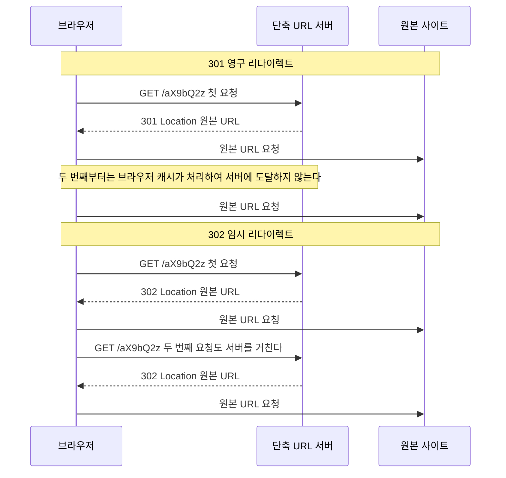
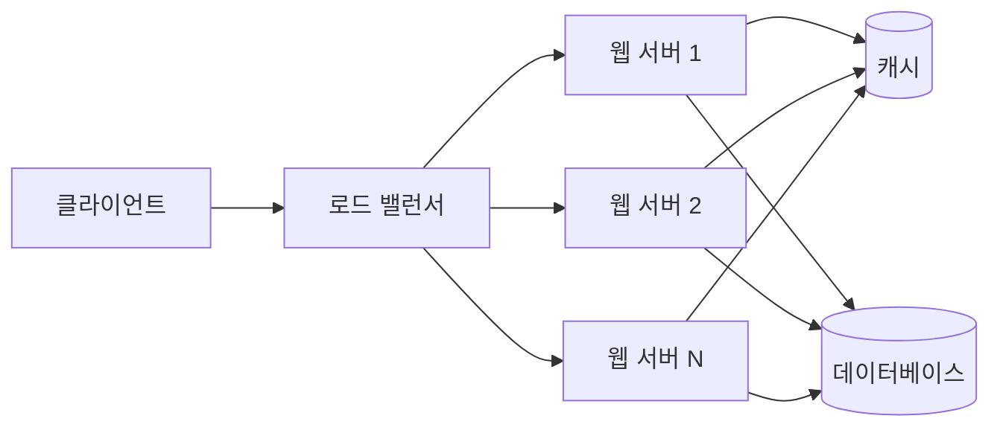

> 시스템 디자인을 제대로 공부해보고 싶어서 스터디한 내용을 시리즈로 정리한다.
> 첫 주제는 URL 단축기다. 이 글의 목적은 URL 단축기 자체보다, 처음 보는 시스템을 어떤 순서로 설계해 나가는지 그 방법을 익히는 데 있다.

# 1. 개요

URL 단축기는 긴 URL을 받아 짧은 URL로 바꿔주는 서비스다. `bit.ly`나 `t.co` 같은 서비스가 대표적인데, 원본 주소가 아무리 길어도 `https://bit.ly/3xY9kQz` 정도의 주소로 줄여준다. 이 짧은 주소로 접속하면 원본 주소로 리다이렉트된다.

기능만 놓고 보면 단순하다. 그런데 하루에 수억 건을 처리해야 하고 한 번 발급한 링크는 몇 년 뒤에도 살아 있어야 한다는 조건이 붙으면 얘기가 달라진다. 짧은 문자열을 어떻게 만들지, 중복은 어떻게 피할지, 데이터를 어디에 얼마나 쌓을지가 전부 결정해야 할 사항이 된다. URL 단축기가 시스템 디자인 입문 문제로 자주 쓰이는 이유다.

이 글은 다음 4단계를 순서대로 따라간다.

1. **요구사항 명확화** — 무엇을 만들고 무엇을 만들지 않을지 정하고, 규모를 숫자로 추정한다
2. **개략적 설계** — API, 데이터 모델, 컴포넌트 배치 같은 큰 그림을 잡는다
3. **상세 설계** — 핵심 난제를 하나씩 파고든다. 이 글에서는 짧은 URL 생성 알고리즘과 캐시다
4. **마무리** — 남은 이슈와 확장 지점을 정리한다

이 틀은 URL 단축기 전용이 아니다. 시리즈의 다음 주제에도 같은 순서를 그대로 쓸 생각이다. 문제마다 답은 달라지지만 답을 찾아가는 절차는 크게 다르지 않다.

범위는 설계까지다. 실행 가능한 구현 코드는 넣지 않는다. 대신 각 단계에서 어떤 선택지가 있었고 왜 그중 하나를 골랐는지를 남긴다.

# 2. 1단계: 요구사항 명확화

설계를 시작하기 전에 무엇을 만들지 합의하는 단계다. 요구사항이 모호한 채로 구조부터 그리면, 나중에 전제 하나가 바뀔 때 설계를 통째로 다시 짜야 한다. 여기서는 기능과 비기능 요구사항을 정하고 대략적인 규모를 숫자로 잡아둔다.

## 2.1 기능 요구사항

이 글에서 만들 URL 단축기의 기능은 두 가지다.

- **단축**: 긴 URL을 받아 짧은 URL을 돌려준다
- **리다이렉트**: 짧은 URL로 접근하면 원본 URL로 리다이렉트한다

실제 서비스라면 커스텀 별칭, 만료 시각(TTL), 클릭 분석 같은 기능이 따라붙는다. 이 글에서는 모두 범위 밖으로 둔다.

요구사항을 좁히는 것 자체가 설계의 첫 단계다. 기능을 다 얹어놓고 시작하면 어떤 결정이 어떤 요구사항 때문에 나왔는지 흐려진다. 두 가지만 남겨두면 뒤에 나오는 선택들이 어디에서 비롯됐는지 추적할 수 있다.

## 2.2 비기능 요구사항

- **고가용성**: 리다이렉트가 죽으면 이미 세상에 뿌려진 짧은 링크가 한꺼번에 죽는다. 발급된 링크는 메일, 문자, SNS 게시물에 박혀 있어서 회수할 방법이 없다.
- **낮은 지연**: 리다이렉트는 사용자가 링크를 누른 뒤 목적지 페이지가 뜨기까지의 경로 한가운데 있다. 여기서 늘어난 시간은 그대로 체감 로딩 시간이 된다.
- **추측 불가능한 짧은 URL**: 순차적으로 증가하는 값을 그대로 노출하면 앞뒤 값을 넣어보는 것만으로 남이 만든 링크를 훑을 수 있다. 짧은 URL은 그 자체가 사실상 접근 권한이므로 다음 값을 예측할 수 없어야 한다.

## 2.3 개략적 규모 추정

규모 추정은 이후 결정의 근거를 만드는 작업이다. 정확한 값을 맞히는 게 목적이 아니라, 자릿수를 확인해서 어떤 선택이 가능하고 어떤 선택이 불가능한지 가르는 게 목적이다.

가정은 다음과 같이 둔다.

- 하루 1억 건의 단축 요청
- 읽기 대 쓰기 비율 10 대 1
- 레코드 하나당 평균 100바이트
- 서비스 기간 10년

하루 1억 건을 하루 초 수인 86,400으로 나누면 쓰기 QPS가 나온다. 읽기는 그 10배다. 저장 용량은 10년 누적 건수에 레코드 크기를 곱해서 구한다.

| 항목 | 계산 | 결과 |
|---|---|---|
| 쓰기 QPS | 1억 건 / 86,400초 | 약 1,160 |
| 읽기 QPS | 쓰기의 10배 | 약 11,600 |
| 10년 누적 건수 | 1억 x 365 x 10 | 3,650억 건 |
| 10년 저장 용량 | 3,650억 x 100바이트 | 약 36.5TB |

이 숫자들은 뒤에서 계속 근거로 쓰인다. 3,650억이라는 누적 건수는 짧은 URL을 몇 자로 할지 역산하는 기준이 되고(2.4), 읽기가 쓰기보다 10배 많다는 비율은 캐시를 둘지 판단하는 근거가 된다(4.6). 36.5TB는 DB 한 대로 감당할 크기인지 따져보는 출발점이다.

## 2.4 짧은 URL의 길이

짧은 URL의 길이는 앞의 추정에서 바로 역산할 수 있다. 10년간 3,650억 건을 담아야 하므로, 짧은 URL이 표현할 수 있는 경우의 수가 그보다 커야 한다.

짧은 URL에 쓸 문자는 `0-9`(10개), `a-z`(26개), `A-Z`(26개)를 합한 62개로 잡는다. 하이픈이나 밑줄 같은 기호를 더 넣을 수도 있지만, 영숫자만 쓰면 URL 인코딩을 신경 쓸 일이 없고 사람이 받아 적기에도 낫다.

길이가 n자라면 표현 가능한 조합은 62^n이다.

- 6자: `62^6` = 약 568억 → 3,650억 건을 담지 못한다
- 7자: `62^7` = 약 3.5조 → 3,650억 건의 열 배 가까운 여유가 있다

따라서 짧은 URL의 길이는 **7자**로 정한다. 한 자 늘릴 때마다 경우의 수가 62배씩 커지므로 8자, 9자로 더 늘릴 이유는 없다. 짧게 만드는 것이 이 서비스의 존재 이유이기도 하다.

# 3. 2단계: 개략적 설계

요구사항과 규모가 정해졌으니 큰 그림을 그릴 차례다. 외부에 어떤 API를 열지, 짧은 URL 요청에 어떤 응답을 돌려줄지, 데이터를 어떤 형태로 저장할지, 컴포넌트를 어떻게 배치할지를 정한다. 아직 짧은 URL을 어떻게 만들지는 다루지 않는다. 그건 이 설계에서 가장 어려운 부분이라 4장에서 따로 다룬다.

## 3.1 API 설계

2.1에서 기능을 두 가지로 좁혔으므로 엔드포인트도 두 개면 된다.

**단축 API**는 새 매핑을 만드는 동작이므로 `POST`를 쓴다.

```
POST /api/v1/data/shorten
Content-Type: application/json

{
  "longUrl": "https://example.com/very/long/path?utm_source=newsletter&utm_campaign=2026"
}
```

응답으로 짧은 URL을 돌려준다.

```
201 Created

{
  "shortUrl": "https://short.ly/aX9bQ2z"
}
```

원본 URL을 질의 문자열에 실어 `GET`으로 보내는 방식도 생각해볼 수 있지만 두 가지가 걸린다. 원본 URL이 서버 접근 로그와 중간 프록시에 그대로 남고, URL 길이 제한에 걸릴 수 있다. 긴 URL을 다루는 서비스에서 긴 URL을 URL 안에 넣는 건 자충수다. 본문에 담는 편이 낫다.

**리다이렉트 API**는 `GET /{shortUrl}` 하나다.

```
GET /aX9bQ2z
```

여기에는 `/api/v1` 같은 접두사를 붙이지 않는다. 이 경로가 곧 사용자에게 배포되는 짧은 URL이기 때문이다. 접두사를 붙이면 그만큼 링크가 길어져서 서비스의 존재 이유를 갉아먹는다. 응답에는 본문이 없고 상태 코드와 `Location` 헤더만 실린다. 이때 어떤 상태 코드를 쓰느냐가 생각보다 큰 결정이라 절을 나눠 살펴본다.

## 3.2 리다이렉트 동작과 301 vs 302

리다이렉트는 서버가 클라이언트에게 "요청한 자원은 여기 없으니 저 주소로 다시 요청하라"고 알려주는 응답이다. 3xx 상태 코드와 `Location` 헤더가 한 쌍으로 나가고, 브라우저는 `Location` 값을 읽어 그 주소로 새 요청을 보낸다.

사용자 눈에는 짧은 URL을 주소창에 넣었더니 원본 페이지가 열린 것처럼 보이지만 실제로는 요청이 두 번 나간다. 첫 번째는 단축 서버로, 두 번째는 원본 사이트로 간다. 단축 서버가 하는 일은 7자짜리 키로 원본 URL을 찾아 헤더에 실어 돌려보내는 것뿐이다. 본문을 만들지도, 원본 사이트를 대신 호출하지도 않는다.

문제는 3xx 중에서 무엇을 쓰느냐다. 후보는 301과 302 두 개다.

- **301 Moved Permanently**: 이 자원은 앞으로 영구히 저 주소에 있다는 뜻이다. 브라우저는 이 응답을 캐싱해도 된다고 해석한다.
- **302 Found**: 지금은 저 주소에 있지만 나중에 바뀔 수 있다는 뜻이다. 브라우저는 매번 원래 주소로 다시 물어본다.

의미만 보면 사소한 차이 같지만 브라우저 캐싱이 끼어들면서 결과가 크게 갈린다.



301을 쓰면 같은 브라우저에서 같은 링크를 두 번째로 누르는 순간부터 요청이 단축 서버에 도달하지 않는다. 브라우저가 캐시에 저장해둔 원본 주소로 곧장 간다. 2.3에서 추정한 읽기 11,600 QPS는 링크 클릭 총량이지 서버가 받는 요청 수가 아니다. 널리 퍼진 링크일수록 같은 사람이 여러 번 누르고 같은 브라우저에서 여러 번 열리므로, 301을 쓰면 서버가 실제로 받는 요청은 그 수치보다 훨씬 줄어든다. 인프라 비용을 그대로 아끼는 효과다.

대신 잃는 것이 있다. 서버에 도달하지 않는 요청은 셀 수 없다. 클릭 수, 유입 경로, 시간대별 분포, 지역 분포 같은 데이터가 첫 클릭을 빼고 전부 사라진다. URL 단축 서비스를 쓰는 주된 동기가 클릭 분석인 경우는 흔하다. 링크를 짧게 만들기만 하면 된다면 굳이 남의 서비스를 거칠 이유가 없다.

| 항목 | 301 영구 리다이렉트 | 302 임시 리다이렉트 |
|---|---|---|
| 브라우저 캐싱 | 캐싱한다 | 캐싱하지 않는다 |
| 서버 부하 | 첫 요청 이후 거의 없다 | 요청마다 발생한다 |
| 클릭 분석 | 불가능하다 | 가능하다 |
| 적합한 상황 | 트래픽 절감이 최우선일 때 | 클릭 추적이 필요할 때 |

여기서 덜 언급되는 위험이 하나 더 있다. 301로 내보낸 매핑은 서버가 되돌릴 방법이 사실상 없다는 점이다. 브라우저 캐시에 들어간 매핑은 서버 관할 밖이라 무효화할 수단이 없다. 원본 URL을 잘못 등록했거나, 등록된 링크가 나중에 악성 사이트로 신고되거나, 원본 사이트의 주소 체계가 바뀌어도 이미 한 번 눌러본 사용자는 계속 옛 주소로 간다. `Cache-Control`로 캐싱 기간을 제한할 수는 있지만 브라우저마다 해석이 제각각이고, 한번 저장된 뒤에는 서버가 손댈 수 없다는 사실 자체가 달라지지 않는다.

2.2에서 "발급된 링크는 회수할 방법이 없다"고 적었다. 301은 여기에 한 겹을 더 얹는다. 링크가 가리키는 목적지마저 되돌릴 수 없게 만든다.

**이 글에서는 302를 고른다.** 매핑의 통제권을 서버가 계속 쥐고 있어야 한다는 판단이 첫 번째 이유고, 클릭 분석 여지를 남겨두는 것이 두 번째 이유다.

이 선택에는 값을 치러야 한다. 읽기 요청 11,600 QPS가 브라우저 캐시에 걸러지지 않고 그대로 서버까지 들어온다. 매 요청마다 7자 키로 원본 URL을 찾아야 하는데, 이걸 전부 DB 조회로 처리하면 2.2에서 정한 낮은 지연을 지키기 어렵다. 이 부담을 어디서 흡수할지가 4.6에서 캐시를 도입하는 이유가 된다. 302를 고른 이상 캐시는 뒤에서 빼놓을 수 없는 전제가 된다.

## 3.3 데이터 모델

리다이렉트가 하는 일은 짧은 URL로 긴 URL을 찾는 조회 하나다. 개념적으로는 `<shortURL, longURL>` 해시 테이블이면 충분하다.

하지만 인메모리 해시 테이블로는 두 가지가 막힌다. 첫째, 크기다. 2.3에서 추정한 10년 누적 36.5TB는 서버 한 대의 메모리에 올릴 수 있는 규모가 아니다. 둘째, 휘발성이다. 프로세스가 재시작하면 매핑이 통째로 사라지는데, 이는 발급된 모든 링크가 죽는다는 뜻이고 2.2의 고가용성과 정면으로 충돌한다.

그래서 영속 저장소에 관계형 테이블로 둔다.

| 컬럼 | 설명 |
|---|---|
| `id` | 기본 키. 자동 증가 정수 |
| `shortURL` | 7자 짧은 URL 문자열(2.4). 유일 인덱스 |
| `longURL` | 원본 URL |

`shortURL`에 유일 인덱스를 거는 데는 이유가 두 가지 있다. 조회 경로가 전부 `shortURL`을 거치므로 인덱스가 없으면 3,650억 행을 훑어야 한다. 그리고 유일 제약 자체가 같은 짧은 URL이 서로 다른 원본에 두 번 발급되는 사고를 DB 차원에서 막아준다. 4.2에서 다룰 충돌 처리의 마지막 방어선이다.

## 3.4 상위 아키텍처



웹 서버는 무상태다. 요청을 받아 캐시나 DB에서 매핑을 찾고 응답을 만들어 돌려줄 뿐, 요청 사이에 기억해야 할 것을 자기 안에 두지 않는다. 그래서 어떤 요청이 어느 서버로 가든 결과가 같고, 부하가 늘면 서버를 늘리고 줄면 빼면 된다. 상태는 전부 캐시와 DB에 모여 있으므로 확장의 어려움도 그쪽으로 모인다. 웹 서버 대수를 늘리는 건 쉬운 축에 속하고, 실제 난제는 3,650억 건이 쌓이는 저장소와 11,600 QPS를 받아내는 캐시 쪽에 있다.

# 4. 3단계: 상세 설계

## 4.1 접근 1: 해시 함수

## 4.2 충돌 처리

## 4.3 접근 2: 유일 ID와 Base62 변환

## 4.4 유일 ID 생성기가 어려운 이유

## 4.5 두 접근 비교

## 4.6 읽기 편중과 캐시

## 4.7 전체 흐름 정리

# 5. 4단계: 마무리 - 더 고민할 것들

# 6. 마무리

# 7. 참고자료
