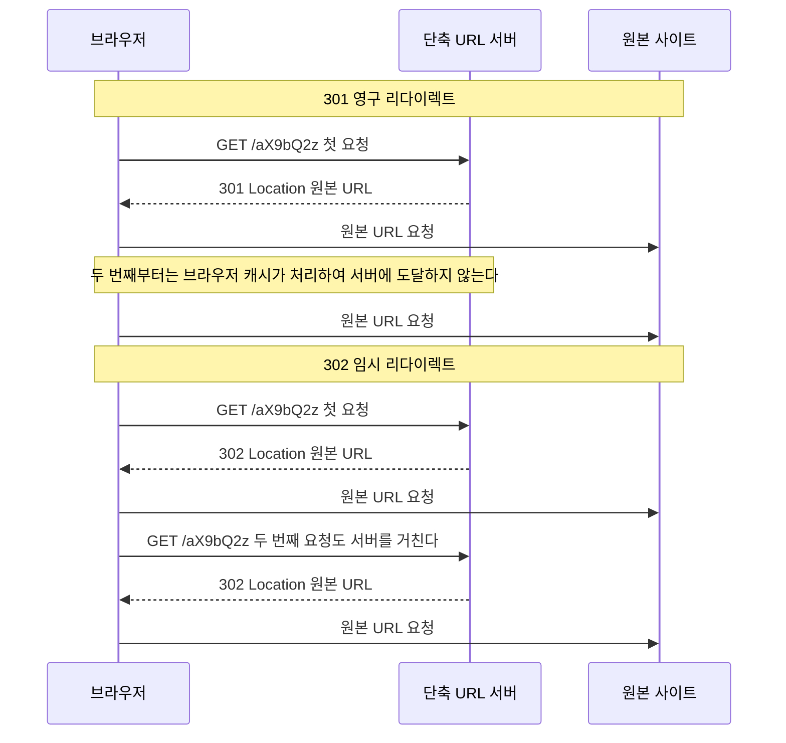
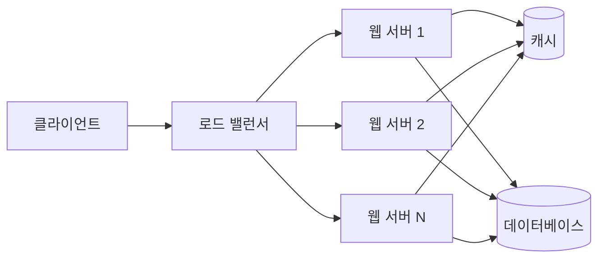

> 시스템 디자인을 제대로 공부해보고 싶어서 스터디한 내용을 시리즈로 정리한다.
> 첫 주제는 URL 단축기다. 이 글의 목적은 URL 단축기 자체보다, 처음 보는 시스템을 어떤 순서로 설계해 나가는지 그 방법을 익히는 데 있다.

# 1. 개요

URL 단축기는 긴 URL을 받아 짧은 URL로 바꿔주는 서비스다. `bit.ly`나 `t.co` 같은 서비스가 대표적인데, 원본 주소가 아무리 길어도 `https://bit.ly/3xY9kQz` 정도의 주소로 줄여준다. 이 짧은 주소로 접속하면 원본 주소로 리다이렉트된다.

기능만 놓고 보면 단순하다. 그런데 하루에 수억 건을 처리해야 하고 한 번 발급한 링크는 몇 년 뒤에도 살아 있어야 한다는 조건이 붙으면 얘기가 달라진다. 짧은 문자열을 어떻게 만들지, 중복은 어떻게 피할지, 데이터를 어디에 얼마나 쌓을지가 전부 결정해야 할 사항이 된다. URL 단축기가 시스템 디자인 입문 문제로 자주 쓰이는 이유다.

이 글은 다음 4단계를 순서대로 따라간다.

1. **요구사항 명확화** — 무엇을 만들고 무엇을 만들지 않을지 정하고, 규모를 숫자로 추정한다
2. **개략적 설계** — API, 데이터 모델, 컴포넌트 배치 같은 큰 그림을 잡는다
3. **상세 설계** — 핵심 난제를 하나씩 파고든다. 이 글에서는 짧은 URL 생성 알고리즘과 캐시다
4. **마무리** — 남은 이슈와 확장 지점을 정리한다

이 틀은 URL 단축기 전용이 아니다. 시리즈의 다음 주제에도 같은 순서를 그대로 쓸 생각이다. 문제마다 답은 달라지지만 답을 찾아가는 절차는 크게 다르지 않다.

범위는 설계까지다. 실행 가능한 구현 코드는 넣지 않는다. 대신 각 단계에서 어떤 선택지가 있었고 왜 그중 하나를 골랐는지를 남긴다.

# 2. 1단계: 요구사항 명확화

설계를 시작하기 전에 무엇을 만들지 합의하는 단계다. 요구사항이 모호한 채로 구조부터 그리면, 나중에 전제 하나가 바뀔 때 설계를 통째로 다시 짜야 한다. 여기서는 기능과 비기능 요구사항을 정하고 대략적인 규모를 숫자로 잡아둔다.

## 2.1 기능 요구사항

이 글에서 만들 URL 단축기의 기능은 두 가지다.

- **단축**: 긴 URL을 받아 짧은 URL을 돌려준다
- **리다이렉트**: 짧은 URL로 접근하면 원본 URL로 리다이렉트한다

실제 서비스라면 커스텀 별칭, 만료 시각(TTL), 클릭 분석 같은 기능이 따라붙는다. 이 글에서는 모두 범위 밖으로 둔다.

요구사항을 좁히는 것 자체가 설계의 첫 단계다. 기능을 다 얹어놓고 시작하면 어떤 결정이 어떤 요구사항 때문에 나왔는지 흐려진다. 두 가지만 남겨두면 뒤에 나오는 선택들이 어디에서 비롯됐는지 추적할 수 있다.

## 2.2 비기능 요구사항

- **고가용성**: 리다이렉트가 죽으면 이미 세상에 뿌려진 짧은 링크가 한꺼번에 죽는다. 발급된 링크는 메일, 문자, SNS 게시물에 박혀 있어서 회수할 방법이 없다.
- **낮은 지연**: 리다이렉트는 사용자가 링크를 누른 뒤 목적지 페이지가 뜨기까지의 경로 한가운데 있다. 여기서 늘어난 시간은 그대로 체감 로딩 시간이 된다.
- **추측 불가능한 짧은 URL**: 순차적으로 증가하는 값을 그대로 노출하면 앞뒤 값을 넣어보는 것만으로 남이 만든 링크를 훑을 수 있다. 짧은 URL은 그 자체가 사실상 접근 권한이므로 다음 값을 예측할 수 없어야 한다.

## 2.3 개략적 규모 추정

규모 추정은 이후 결정의 근거를 만드는 작업이다. 정확한 값을 맞히는 게 목적이 아니라, 자릿수를 확인해서 어떤 선택이 가능하고 어떤 선택이 불가능한지 가르는 게 목적이다.

가정은 다음과 같이 둔다.

- 하루 1억 건의 단축 요청
- 읽기 대 쓰기 비율 10 대 1
- 레코드 하나당 평균 100바이트
- 서비스 기간 10년

하루 1억 건을 하루 초 수인 86,400으로 나누면 쓰기 QPS가 나온다. 읽기는 그 10배다. 저장 용량은 10년 누적 건수에 레코드 크기를 곱해서 구한다.

| 항목 | 계산 | 결과 |
|---|---|---|
| 쓰기 QPS | 1억 건 / 86,400초 | 약 1,160 |
| 읽기 QPS | 쓰기의 10배 | 약 11,600 |
| 10년 누적 건수 | 1억 x 365 x 10 | 3,650억 건 |
| 10년 저장 용량 | 3,650억 x 100바이트 | 약 36.5TB |

이 숫자들은 뒤에서 계속 근거로 쓰인다. 3,650억이라는 누적 건수는 짧은 URL을 몇 자로 할지 역산하는 기준이 되고(2.4), 읽기가 쓰기보다 10배 많다는 비율은 캐시를 둘지 판단하는 근거가 된다(4.6). 36.5TB는 DB 한 대로 감당할 크기인지 따져보는 출발점이다.

## 2.4 짧은 URL의 길이

짧은 URL의 길이는 앞의 추정에서 바로 역산할 수 있다. 10년간 3,650억 건을 담아야 하므로, 짧은 URL이 표현할 수 있는 경우의 수가 그보다 커야 한다.

짧은 URL에 쓸 문자는 `0-9`(10개), `a-z`(26개), `A-Z`(26개)를 합한 62개로 잡는다. 하이픈이나 밑줄 같은 기호를 더 넣을 수도 있지만, 영숫자만 쓰면 URL 인코딩을 신경 쓸 일이 없고 사람이 받아 적기에도 낫다.

길이가 n자라면 표현 가능한 조합은 62^n이다.

- 6자: `62^6` = 약 568억 → 3,650억 건을 담지 못한다
- 7자: `62^7` = 약 3.5조 → 3,650억 건의 열 배 가까운 여유가 있다

따라서 짧은 URL의 길이는 **7자**로 정한다. 한 자 늘릴 때마다 경우의 수가 62배씩 커지므로 8자, 9자로 더 늘릴 이유는 없다. 짧게 만드는 것이 이 서비스의 존재 이유이기도 하다.

# 3. 2단계: 개략적 설계

요구사항과 규모가 정해졌으니 큰 그림을 그릴 차례다. 외부에 어떤 API를 열지, 짧은 URL 요청에 어떤 응답을 돌려줄지, 데이터를 어떤 형태로 저장할지, 컴포넌트를 어떻게 배치할지를 정한다. 아직 짧은 URL을 어떻게 만들지는 다루지 않는다. 그건 이 설계에서 가장 어려운 부분이라 4장에서 따로 다룬다.

## 3.1 API 설계

2.1에서 기능을 두 가지로 좁혔으므로 엔드포인트도 두 개면 된다.

**단축 API**는 새 매핑을 만드는 동작이므로 `POST`를 쓴다.

```
POST /api/v1/data/shorten
Content-Type: application/json

{
  "longUrl": "https://example.com/very/long/path?utm_source=newsletter&utm_campaign=2026"
}
```

응답으로 짧은 URL을 돌려준다.

```
201 Created

{
  "shortUrl": "https://short.ly/aX9bQ2z"
}
```

원본 URL을 질의 문자열에 실어 `GET`으로 보내는 방식도 생각해볼 수 있지만 두 가지가 걸린다. 원본 URL이 서버 접근 로그와 중간 프록시에 그대로 남고, URL 길이 제한에 걸릴 수 있다. 긴 URL을 다루는 서비스에서 긴 URL을 URL 안에 넣는 건 자충수다. 본문에 담는 편이 낫다.

**리다이렉트 API**는 `GET /{shortUrl}` 하나다.

```
GET /aX9bQ2z
```

여기에는 `/api/v1` 같은 접두사를 붙이지 않는다. 이 경로가 곧 사용자에게 배포되는 짧은 URL이기 때문이다. 접두사를 붙이면 그만큼 링크가 길어져서 서비스의 존재 이유를 갉아먹는다. 응답에는 본문이 없고 상태 코드와 `Location` 헤더만 실린다. 이때 어떤 상태 코드를 쓰느냐가 생각보다 큰 결정이라 절을 나눠 살펴본다.

## 3.2 리다이렉트 동작과 301 vs 302

리다이렉트는 서버가 클라이언트에게 "요청한 자원은 여기 없으니 저 주소로 다시 요청하라"고 알려주는 응답이다. 3xx 상태 코드와 `Location` 헤더가 한 쌍으로 나가고, 브라우저는 `Location` 값을 읽어 그 주소로 새 요청을 보낸다.

사용자 눈에는 짧은 URL을 주소창에 넣었더니 원본 페이지가 열린 것처럼 보이지만 실제로는 요청이 두 번 나간다. 첫 번째는 단축 서버로, 두 번째는 원본 사이트로 간다. 단축 서버가 하는 일은 7자짜리 키로 원본 URL을 찾아 헤더에 실어 돌려보내는 것뿐이다. 본문을 만들지도, 원본 사이트를 대신 호출하지도 않는다.

문제는 3xx 중에서 무엇을 쓰느냐다. 후보는 301과 302 두 개다.

- **301 Moved Permanently**: 이 자원은 앞으로 영구히 저 주소에 있다는 뜻이다. 브라우저는 이 응답을 캐싱해도 된다고 해석한다.
- **302 Found**: 지금은 저 주소에 있지만 나중에 바뀔 수 있다는 뜻이다. 브라우저는 매번 원래 주소로 다시 물어본다.

의미만 보면 사소한 차이 같지만 브라우저 캐싱이 끼어들면서 결과가 크게 갈린다.



301을 쓰면 같은 브라우저에서 같은 링크를 두 번째로 누르는 순간부터 요청이 단축 서버에 도달하지 않는다. 브라우저가 캐시에 저장해둔 원본 주소로 곧장 간다. 2.3에서 추정한 읽기 11,600 QPS는 링크 클릭 총량이지 서버가 받는 요청 수가 아니다. 널리 퍼진 링크일수록 같은 사람이 여러 번 누르고 같은 브라우저에서 여러 번 열리므로, 301을 쓰면 서버가 실제로 받는 요청은 그 수치보다 훨씬 줄어든다. 인프라 비용을 그대로 아끼는 효과다.

대신 잃는 것이 있다. 서버에 도달하지 않는 요청은 셀 수 없다. 클릭 수, 유입 경로, 시간대별 분포, 지역 분포 같은 데이터가 첫 클릭을 빼고 전부 사라진다. URL 단축 서비스를 쓰는 주된 동기가 클릭 분석인 경우는 흔하다. 링크를 짧게 만들기만 하면 된다면 굳이 남의 서비스를 거칠 이유가 없다.

| 항목 | 301 영구 리다이렉트 | 302 임시 리다이렉트 |
|---|---|---|
| 브라우저 캐싱 | 캐싱한다 | 캐싱하지 않는다 |
| 서버 부하 | 첫 요청 이후 거의 없다 | 요청마다 발생한다 |
| 클릭 분석 | 불가능하다 | 가능하다 |
| 적합한 상황 | 트래픽 절감이 최우선일 때 | 클릭 추적이 필요할 때 |

여기서 덜 언급되는 위험이 하나 더 있다. 301로 내보낸 매핑은 서버가 되돌릴 방법이 사실상 없다는 점이다. 브라우저 캐시에 들어간 매핑은 서버 관할 밖이라 무효화할 수단이 없다. 원본 URL을 잘못 등록했거나, 등록된 링크가 나중에 악성 사이트로 신고되거나, 원본 사이트의 주소 체계가 바뀌어도 이미 한 번 눌러본 사용자는 계속 옛 주소로 간다. `Cache-Control`로 캐싱 기간을 제한할 수는 있지만 브라우저마다 해석이 제각각이고, 한번 저장된 뒤에는 서버가 손댈 수 없다는 사실 자체가 달라지지 않는다.

2.2에서 "발급된 링크는 회수할 방법이 없다"고 적었다. 301은 여기에 한 겹을 더 얹는다. 링크가 가리키는 목적지마저 되돌릴 수 없게 만든다.

**이 글에서는 302를 고른다.** 매핑의 통제권을 서버가 계속 쥐고 있어야 한다는 판단이 첫 번째 이유고, 클릭 분석 여지를 남겨두는 것이 두 번째 이유다.

이 선택에는 값을 치러야 한다. 읽기 요청 11,600 QPS가 브라우저 캐시에 걸러지지 않고 그대로 서버까지 들어온다. 매 요청마다 7자 키로 원본 URL을 찾아야 하는데, 이걸 전부 DB 조회로 처리하면 2.2에서 정한 낮은 지연을 지키기 어렵다. 이 부담을 어디서 흡수할지가 4.6에서 캐시를 도입하는 이유가 된다. 302를 고른 이상 캐시는 뒤에서 빼놓을 수 없는 전제가 된다.

## 3.3 데이터 모델

리다이렉트가 하는 일은 짧은 URL로 긴 URL을 찾는 조회 하나다. 개념적으로는 `<shortURL, longURL>` 해시 테이블이면 충분하다.

하지만 인메모리 해시 테이블로는 두 가지가 막힌다. 첫째, 크기다. 2.3에서 추정한 10년 누적 36.5TB는 서버 한 대의 메모리에 올릴 수 있는 규모가 아니다. 둘째, 휘발성이다. 프로세스가 재시작하면 매핑이 통째로 사라지는데, 이는 발급된 모든 링크가 죽는다는 뜻이고 2.2의 고가용성과 정면으로 충돌한다.

그래서 영속 저장소에 관계형 테이블로 둔다.

| 컬럼 | 설명 |
|---|---|
| `id` | 기본 키. 자동 증가 정수 |
| `shortURL` | 7자 짧은 URL 문자열(2.4). 유일 인덱스 |
| `longURL` | 원본 URL |

`shortURL`에 유일 인덱스를 거는 데는 이유가 두 가지 있다. 조회 경로가 전부 `shortURL`을 거치므로 인덱스가 없으면 3,650억 행을 훑어야 한다. 그리고 유일 제약 자체가 같은 짧은 URL이 서로 다른 원본에 두 번 발급되는 사고를 DB 차원에서 막아준다. 4.2에서 다룰 충돌 처리의 마지막 방어선이다.

## 3.4 상위 아키텍처



웹 서버는 무상태다. 요청을 받아 캐시나 DB에서 매핑을 찾고 응답을 만들어 돌려줄 뿐, 요청 사이에 기억해야 할 것을 자기 안에 두지 않는다. 그래서 어떤 요청이 어느 서버로 가든 결과가 같고, 부하가 늘면 서버를 늘리고 줄면 빼면 된다. 상태는 전부 캐시와 DB에 모여 있으므로 확장의 어려움도 그쪽으로 모인다. 웹 서버 대수를 늘리는 건 쉬운 축에 속하고, 실제 난제는 3,650억 건이 쌓이는 저장소와 11,600 QPS를 받아내는 캐시 쪽에 있다.

# 4. 3단계: 상세 설계

3장에서 그린 것은 요청이 어디로 흘러가는지에 대한 그림이다. 정작 이 서비스의 본체인 "긴 URL을 받아 7자짜리 문자열을 만드는 일"은 통째로 미뤄뒀다. 여기서 그걸 다룬다.

방법은 크게 두 갈래다. 긴 URL 자체를 해시해서 줄이거나, 긴 URL과 무관하게 유일한 번호를 하나 발급받아 그 번호를 문자열로 바꾸거나. 4.1부터 4.5까지 두 방식을 각각 뜯어보고 비교한 다음, 3.2에서 302를 고르면서 떠안은 읽기 부하를 4.6에서 처리한다.

## 4.1 접근 1: 해시 함수

가장 먼저 떠오르는 방법이다. 긴 URL을 CRC32, MD5, SHA-1 같은 해시 함수에 넣고, 나온 결과를 2.4에서 정한 62개 문자로 표현한 뒤 **앞 7자만 잘라** 쓴다.

장점이 분명하다. 계산이 빠르고, 입력 URL이 아무리 길어도 결과는 항상 7자로 고정된다. 서버가 상태를 들고 있을 필요도 없다. 같은 URL을 넣으면 어느 서버에서 계산하든 같은 값이 나오므로 서버끼리 조율할 일이 없다.

문제는 자르는 행위 자체에 있다. MD5는 128비트, SHA-1은 160비트 값을 만드는데 그중 앞 7자만 남기면 표현 범위가 62^7, 약 3.5조로 줄어든다. 원본 해시가 아무리 고르게 흩어져 있어도 좁은 공간에 접어 넣으면 서로 다른 URL이 같은 7자로 떨어지는 경우가 생긴다. 3.5조는 2.4에서 "3,650억 건의 열 배 가까운 여유"라고 봤던 수치지만, 그 여유는 키를 다 쓸 수 있느냐의 문제일 뿐 충돌이 없다는 보장이 아니다. 값을 무작위로 뽑아 채워 넣는 상황에서는 공간이 반쯤 차기 한참 전부터 겹치기 시작한다.

## 4.2 충돌 처리

충돌이 난다는 걸 알았으니 두 가지를 정해야 한다. 어떻게 알아채고, 알아챈 다음 무엇을 할 것인가.

**알아채는 방법은 하나뿐이다.** 새로 만든 7자 키가 이미 쓰이고 있는지 저장소에 물어보는 것이다. 해시 값만 봐서는 그 값이 이미 다른 URL에 배정됐는지 알 길이 없다. 해시 함수는 자기가 과거에 무엇을 뱉었는지 기억하지 않는다. 결국 키를 만들 때마다 `shortURL` 조회가 한 번씩 붙는다.

**대응은 재시도다.** 미리 정해둔 문자열을 긴 URL 뒤에 붙이고 다시 해싱한다. 입력이 달라졌으니 해시 결과도 달라지고, 새로 나온 7자로 다시 확인한다. 비어 있으면 그 값을 쓰고, 또 겹치면 붙이는 문자열을 바꿔 한 번 더 돈다. 빈 자리를 찾을 때까지 반복하는 구조다. 저장 공간에 여유가 있는 동안에는 대개 한두 번 안에 끝난다.

**진짜 비용은 재해싱이 아니라 확인 쪽에 있다.** 해시 계산은 CPU 몇 마이크로초짜리 연산이지만 확인은 저장소 왕복이다. 2.3에서 추정한 쓰기 1,160 QPS를 그대로 대입하면 초당 1,160번의 조회가 쓰기 경로에 통째로 얹힌다. 삽입은 그다음이다. 게다가 이 조회가 향하는 테이블은 10년 뒤 3,650억 행짜리다. 3.3에서 `shortURL`에 유일 인덱스를 걸어뒀으니 조회 자체는 인덱스 탐색이지만, 인덱스가 그만큼 커지면 메모리에 다 올라가지 않아 상당수 조회가 디스크까지 내려간다. 트래픽이 늘면 이 부담도 같은 속도로 늘어난다.

이 조회를 줄이는 장치로 **Bloom filter**가 있다. 어떤 키가 이미 있는지 대략 답해주는 확률적 자료구조인데, 실제 데이터보다 훨씬 작은 요약본만 메모리에 두고 답한다. 여기서 "없다"는 답은 확실하므로 DB를 볼 필요가 없고, "있을 수도 있다"고 답할 때만 DB에 확인하러 가면 된다. 새로 만든 키는 대부분 실제로 처음 보는 값이라 앞쪽에서 걸러지고, DB까지 내려가는 조회는 소수만 남는다.

확인을 아무리 성실하게 해도 남는 구멍이 하나 있다. 확인과 삽입 사이의 틈이다. 두 요청이 거의 동시에 같은 7자를 만들어 각각 확인하면 둘 다 "비어 있다"는 답을 받고 둘 다 삽입을 시도한다. 사전 확인만으로는 이 경우가 걸러지지 않는다. 3.3에서 예고한 대로 `shortURL`의 유일 제약이 여기서 일한다. 나중에 도착한 삽입이 제약 위반으로 실패하므로, 그 요청만 새 키로 다시 시도하면 된다.

그래서 규모가 작을 때는 순서를 뒤집는 편이 낫다. Bloom filter도 사전 확인 조회도 두지 않고, 일단 삽입한 다음 유일 제약 위반이 나면 재시도한다. 데이터가 적으면 충돌 자체가 드물어서 어쩌다 한 번 나는 재시도 비용이 모든 쓰기에 조회를 하나씩 붙이는 비용보다 싸다. Bloom filter는 쓰기가 충분히 많아지고 테이블이 충분히 커져서 확인 조회가 실제로 병목이 됐을 때 꺼내는 카드다.

## 4.3 접근 2: 유일 ID와 Base62 변환

충돌을 처리하는 대신 아예 만들지 않는 방법도 있다. 긴 URL을 해시하지 않고, 유일한 ID를 하나 발급받아 그것을 62진법 문자열로 바꾸는 방식이다.

10진수를 62진수로 바꾸는 절차는 진법 변환 그대로다. 62로 나눈 나머지를 문자로 바꾸고 몫으로 넘어가기를 반복한다.

```text
BASE62 = "0123456789abcdefghijklmnopqrstuvwxyzABCDEFGHIJKLMNOPQRSTUVWXYZ"

function toBase62(id):
    if id == 0:
        return "0"

    result = ""
    while id > 0:
        result = BASE62[id % 62] + result
        id = id / 62          # 정수 나눗셈
    return result
```

ID가 11157이면 `2TX`가 나온다. 이 문자열을 짧은 URL로 쓰면 된다.

핵심은 ID가 유일하면 변환 결과도 유일하다는 점이다. 진법 변환은 일대일 대응이라 서로 다른 ID가 같은 문자열이 될 수 없다. 확인 조회도, 재시도도, Bloom filter도 필요 없다. 4.2에서 다룬 문제가 통째로 사라진다.

대신 길이가 고정되지 않는다. ID가 작으면 짧은 URL도 짧다. ID가 1이면 한 자다. ID가 커지면서 자릿수가 늘고, 62^7을 넘어서면 8자가 된다. 2.4에서 3,650억 건을 기준으로 7자를 정했으니 서비스 기간 안에 8자로 넘어갈 일은 없지만, 초기 링크가 유난히 짧게 나오는 것 자체는 짚어둘 만하다. 짧을수록 남이 대입해 보기 쉽기 때문이다. 그리고 이 방식에는 더 큰 전제가 하나 깔려 있다. 유일한 ID를 누가 어떻게 발급하느냐다.

## 4.4 유일 ID 생성기가 어려운 이유

DB의 auto increment를 쓰면 되지 않나 싶다. 3.3의 데이터 모델에도 자동 증가 정수 `id`가 이미 들어 있다. 이 방법이 성립하는 것은 번호를 발급하는 주체가 하나일 때다. DB 한 대가 모든 삽입을 받는다면 그 안에서 번호가 겹칠 일이 없다.

문제는 2.3의 숫자가 그 전제를 무너뜨린다는 데 있다. 10년 36.5TB에 쓰기 1,160 QPS를 DB 한 대로 받는 구성은 오래가지 못한다. 저장소를 여러 대로 나누는 순간 각 DB의 자동 증가 카운터는 서로를 모른다. 1번 샤드도 1부터 세고 2번 샤드도 1부터 센다. 시작값과 증가폭을 샤드마다 다르게 잡는 요령(1, 3, 5...와 2, 4, 6...처럼)이 있지만, 샤드를 추가하는 순간 그 배치를 다시 짜야 하고 이미 발급된 번호와 겹치지 않게 맞추는 일이 골치다. 결국 "전체에서 유일한 번호를 어디서 받을 것인가"라는 문제가 그대로 남는다. 대안은 세 갈래다.

**Snowflake 방식**은 번호를 여러 조각으로 나눠 구성한다. 타임스탬프, 노드 ID, 같은 밀리초 안에서 증가하는 시퀀스를 이어 붙여 하나의 64비트 정수를 만든다. 노드 ID가 서버마다 다르므로 서로 다른 서버가 같은 번호를 만들 수 없고, 그래서 발급할 때 다른 서버에 물어볼 필요가 없다. 네트워크 왕복 없이 각자 만들어 쓰니 빠르고, 서버를 늘리면 발급 처리량도 같이 는다. 앞자리가 타임스탬프라 대략 시간순으로 정렬된다는 부수 효과도 딸려 온다.

그 대가로 시계에 의존한다. 서버 시계가 뒤로 감기면 이미 지나온 밀리초 구간을 다시 발급하게 되고, 그러면 같은 번호가 두 번 나올 수 있다. 그래서 구현체들은 시계 역행을 감지하면 그 시간만큼 기다리거나 발급을 거부한다. 정상 동작이 시계 동기화라는 외부 조건에 묶여 있다는 뜻이다. 노드 ID를 누가 배정하고 죽은 노드의 번호를 어떻게 회수할지도 따로 정해야 한다. 컨테이너가 수시로 뜨고 지는 환경에서는 이 배정이 생각보다 성가시다.

**Redis INCR**는 발급 창구를 하나로 둔다. `INCR`는 단일 스레드에서 원자적으로 처리되므로 동시에 몇 개가 들어와도 같은 번호가 두 번 나가지 않는다. 이해하기 쉽고 운영 부담이 작다. 캐시로 Redis를 이미 쓰고 있다면 새로 들일 컴포넌트도 아니다.

문제는 이 창구가 단일 장애점이 된다는 점이다. Redis가 멈추면 단축 요청 전체가 멈춘다. 2.2에서 고가용성을 요구사항으로 걸어둔 이상 복제와 장애 조치를 붙여야 하는데, 비동기 복제 상태에서 장애 조치가 일어나면 마지막 몇 개의 증가분이 유실되고 이미 나간 번호가 다시 나올 수 있다. 요청마다 하나씩 받는 대신 1,000개 단위로 구간을 받아두면 왕복 횟수도 줄고 유실 구간도 줄지만, 서버가 죽을 때 쓰다 남은 구간이 통째로 버려진다.

**키 생성 서비스(KGS)**는 발급 시점을 앞당긴다. 7자 키를 미리 대량으로 만들어 저장소에 쌓아두고, 단축 요청이 오면 그중 하나를 꺼내 준다. 요청 처리 경로에서 하는 일이 "미사용 키 하나 꺼내기"로 끝나니 응답이 빠르다. 키를 만들어 둘 때 순서를 섞어두면 뒤에서 이야기할 추측 문제까지 같이 정리된다.

값은 별도 서비스를 운영하는 비용으로 치른다. 미사용 키와 사용된 키를 나눠 관리해야 하고, 같은 키가 두 번 나가지 않도록 꺼내는 동작 자체가 원자적이어야 한다. 여러 웹 서버가 동시에 키를 요청하면 KGS가 다시 병목이자 단일 장애점이 되므로 각 서버가 키를 뭉치로 미리 받아두는 구성을 쓰는데, 그러면 서버가 내려갈 때 들고 있던 키가 통째로 사라진다. 재고가 떨어지기 전에 채워 넣는 일도 누군가 해야 한다. 번호를 만드는 문제가 재고를 관리하는 문제로 성격이 바뀐다.

세 방법에 공통으로 걸리는 문제가 하나 더 있다. Snowflake든 Redis INCR든 발급되는 번호가 시간에 따라 커지고, 그 번호를 그대로 62진법으로 바꾸면 짧은 URL도 순서대로 커진다. 방금 받은 주소의 끝자리를 하나씩 바꿔보는 것만으로 남이 만든 링크를 훑을 수 있다는 뜻이다. 2.2에서 "추측 불가능한 짧은 URL"을 비기능 요구사항으로 못 박아뒀는데, 순차 ID를 그대로 노출하는 순간 이 요구사항이 정면으로 깨진다. 충돌을 피하려고 고른 방식이 다른 요구사항을 무너뜨리는 셈이다.

완화할 방법이 없지는 않다. ID를 그대로 변환하지 않고 순서를 흩뜨리는 일대일 변환을 한 단계 끼워 넣거나, 키를 미리 만들어 섞어두는 KGS 방식을 쓰면 유일성은 지키면서 겉으로 드러나는 순서만 지울 수 있다. 어느 쪽이든 따로 설계해야 하는 일이라, 유일 ID 방식이 "충돌이 없다"는 장점을 공짜로 주지는 않는다.

## 4.5 두 접근 비교

두 방식은 어느 한쪽이 낫다기보다 서로 다른 문제를 떠안는다.

| 항목 | 해시 방식 | 유일 ID + Base62 |
|---|---|---|
| 짧은 URL 길이 | 항상 고정 (앞 7자 절단) | ID가 커지면 함께 길어진다 |
| 충돌 | 발생한다 | 발생하지 않는다 |
| 충돌 처리 | 필요하다 (재시도, Bloom filter) | 필요 없다 |
| 유일 ID 생성기 | 필요 없다 | 필요하다 |
| 예측 가능성 | 낮다 | 순차 ID면 다음 값을 추측할 수 있다 |

이 표에서 읽어야 할 것은 각 칸의 값보다 칸들 사이의 관계다. 충돌 처리와 그 아래 딸린 재시도, Bloom filter는 URL 단축기가 원래 필요로 하는 부품이 아니다. 해시 함수를 골라 결과를 7자로 잘랐기 때문에 생긴 문제를 메우는 장치다. 유일 ID 방식을 고르면 그 두 줄이 통째로 비고, 대신 "유일 ID 생성기가 필요하다"는 줄이 채워지면서 4.4에서 본 어려움을 떠안는다. 앞 단계의 선택이 뒤 단계의 필요를 만든다. 3.2에서 302를 고른 탓에 캐시가 선택이 아닌 전제가 된 것과 같은 구조다. 그래서 이 비교는 정답을 고르는 문제가 아니라 어느 문제를 떠안을지 정하는 문제에 가깝다.

## 4.6 읽기 편중과 캐시

## 4.7 전체 흐름 정리

# 5. 4단계: 마무리 - 더 고민할 것들

# 6. 마무리

# 7. 참고자료
