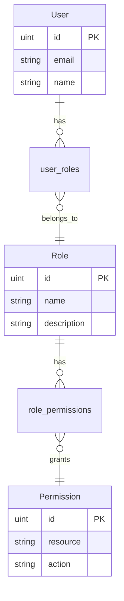
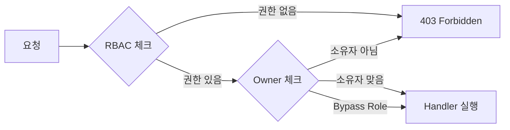

# 1. 어드민 권한 관리란

웹 서비스를 운영하다 보면 사용자마다 접근할 수 있는 기능의 범위가 달라야 하는 상황이 반드시 생긴다.

예를 들어 쇼핑몰 어드민 시스템을 생각해보자.

- **관리자(admin)**: 사용자 관리, 권한 설정, 모든 상품/주문 관리
- **매니저(manager)**: 자기가 등록한 상품 관리, 주문 처리
- **일반 사용자(user)**: 상품 조회, 본인 주문 생성/취소

권한 관리가 없으면 어떤 문제가 발생할까?

- 일반 사용자가 다른 사람의 주문을 취소할 수 있다
- 매니저가 다른 매니저의 상품을 삭제할 수 있다
- 모든 사용자가 관리자 전용 기능(사용자 삭제, 권한 변경)에 접근할 수 있다

이런 문제를 체계적으로 해결하기 위해 **접근 제어(Access Control)** 모델이 필요하다.

# 2. 접근 제어 모델 비교

접근 제어 모델은 크게 세 가지가 있다. 각각의 특성과 적합한 상황이 다르다.

| 구분 | ACL | RBAC | ABAC |
|------|-----|------|------|
| **정의** | 리소스마다 허용된 사용자 목록을 직접 관리 | 역할(Role)에 권한을 부여하고, 사용자에게 역할을 할당 | 사용자/리소스/환경의 속성(Attribute)을 기반으로 정책 평가 |
| **권한 부여 방식** | 사용자 → 리소스 직접 매핑 | 사용자 → 역할 → 권한 간접 매핑 | 속성 기반 정책 규칙 평가 |
| **장점** | 단순하고 직관적 | 관리 효율적, 조직 구조와 자연스럽게 매핑 | 세밀한 제어 가능, 동적 정책 |
| **단점** | 사용자 수 증가 시 관리 복잡 | 역할이 많아지면 Role Explosion | 정책 설계/디버깅이 복잡 |
| **적합한 경우** | 소규모 시스템, 파일 시스템 | 대부분의 웹 서비스, 어드민 시스템 | 대규모 엔터프라이즈, 다중 조건 필요 시 |

**RBAC을 선택하는 기준:**
- 사용자를 역할 단위로 그룹핑할 수 있는 경우 (관리자, 매니저, 사용자 등)
- 같은 역할의 사용자는 동일한 권한을 갖는 경우
- 권한 변경이 역할 단위로 일괄 적용되어야 하는 경우

대부분의 어드민 시스템은 RBAC으로 충분하며, 이 글에서도 RBAC을 중심으로 설명한다.

# 3. RBAC 핵심 구성 요소

## 3.1 User, Role, Permission 3계층 구조

RBAC의 핵심은 **사용자에게 직접 권한을 부여하지 않는 것**이다. 대신 역할(Role)이라는 중간 계층을 두고, 역할에 권한(Permission)을 매핑한다.



- **User ↔ Role**: M:N 관계 — 한 사용자가 여러 역할을 가질 수 있고, 한 역할에 여러 사용자가 속할 수 있다
- **Role ↔ Permission**: M:N 관계 — 한 역할이 여러 권한을 가질 수 있고, 한 권한이 여러 역할에 포함될 수 있다

이 구조의 장점은 **권한 변경이 역할 단위로 일괄 적용**된다는 것이다. 매니저에게 새로운 권한을 추가하면, 모든 매니저에게 자동으로 반영된다.

## 3.2 Permission 키 설계

Permission은 `resource:action` 형태로 설계한다. 어떤 리소스에 대해 어떤 행위가 가능한지를 명확하게 표현할 수 있다.

```
products:create    // 상품 생성
products:read      // 상품 조회
products:update    // 상품 수정
products:delete    // 상품 삭제
orders:status:update  // 주문 상태 변경
orders:cancel      // 주문 취소
```

Go 코드로는 `Resource`와 `Action`을 별도 필드로 저장하고, `Key()` 메서드로 조합한다.

```go
type Permission struct {
    ID       uint   `gorm:"primaryKey" json:"id"`
    Resource string `gorm:"size:100;not null" json:"resource"`
    Action   string `gorm:"size:100;not null" json:"action"`
}

func (p Permission) Key() string {
    return p.Resource + ":" + p.Action
}
```

Role과 User 엔티티는 GORM의 `many2many` 태그로 M:N 관계를 선언한다.

```go
type Role struct {
    ID          uint         `gorm:"primaryKey" json:"id"`
    Name        string       `gorm:"size:100;uniqueIndex;not null" json:"name"`
    Permissions []Permission `gorm:"many2many:role_permissions" json:"permissions"`
}

type User struct {
    ID    uint   `gorm:"primaryKey" json:"id"`
    Email string `gorm:"size:255;uniqueIndex;not null" json:"email"`
    Name  string `gorm:"size:100;not null" json:"name"`
    Roles []Role `gorm:"many2many:user_roles" json:"roles"`
}
```

> 전체 코드: [tutorials-go/rbac/backend/domain/](https://github.com/kenshin579/tutorials-go/tree/main/rbac/backend/domain)

# 4. 권한 매트릭스 설계

실제 서비스에서 RBAC을 적용하려면 **어떤 역할이 어떤 리소스에 어떤 행위를 할 수 있는지** 매트릭스로 정의해야 한다.

아래는 쇼핑몰 어드민 시스템의 권한 매트릭스 예시다.

| Resource | Permission | admin | manager | user |
|----------|-----------|:-----:|:-------:|:----:|
| users | read, create, update, delete | O | - | - |
| roles | read, create, update, delete | O | - | - |
| products | read | O | O | O |
| products | create, update, status:update | O | O | - |
| products | delete | O | - | - |
| orders | read, create | O | O | O |
| orders | status:update | O | O | - |
| orders | cancel | O | O | O |

이 매트릭스를 보면 각 역할의 책임 범위가 명확하게 드러난다.

- **admin**: 시스템 전체를 관리한다 (사용자, 역할, 상품, 주문 모든 권한)
- **manager**: 상품과 주문을 관리하되, 사용자/역할 관리는 불가하다
- **user**: 상품 조회와 주문 생성/취소만 가능하다

# 5. Owner-Based 접근 제어

## 5.1 RBAC만으로 부족한 경우

RBAC은 **"무엇을 할 수 있는가"** 를 제어하지만, **"누구의 것을 대상으로 하는가"** 는 제어하지 못한다.

예를 들어, manager A와 manager B가 모두 `products:update` 권한을 갖고 있다. RBAC만으로는 manager A가 manager B의 상품을 수정하는 것을 막을 수 없다.

이 문제를 해결하기 위해 **Owner-Based 접근 제어**를 추가한다.

## 5.2 RBAC + Owner 이중 제어

Owner-Based 접근 제어는 리소스의 소유자(Owner)를 확인하여 **"자기 것만 수정할 수 있는가"** 를 추가로 검증한다.



적용 대상:
- **상품 수정**: `products.created_by` 필드로 소유자 확인 — admin은 bypass
- **주문 상세/취소**: `orders.ordered_by` 필드로 소유자 확인 — admin, manager는 bypass

## 5.3 Bypass Role 패턴

모든 역할에 Owner 체크를 적용하면 admin도 다른 사람의 리소스를 관리할 수 없게 된다. 이를 해결하기 위해 **Bypass Role**을 설정한다.

Bypass Role로 지정된 역할은 Owner 체크를 건너뛰고 바로 Handler로 진행한다. 이 패턴을 통해 RBAC의 역할 계층을 유지하면서도 리소스 소유권을 세밀하게 제어할 수 있다.

| 리소스 | 소유자 필드 | Bypass Role |
|--------|-----------|-------------|
| 상품 수정 | `created_by` | admin |
| 주문 상세/취소 | `ordered_by` | admin, manager |

# 6. 마무리

이번 글에서는 어드민 권한 관리의 필요성과 RBAC 모델의 핵심 개념을 살펴보았다.

- **RBAC**은 역할 기반으로 권한을 간접 매핑하는 모델로, 대부분의 어드민 시스템에 적합하다
- **Permission 키**는 `resource:action` 패턴으로 설계하면 명확하고 확장성 있다
- **Owner-Based 접근 제어**를 추가하면 "자기 것만 수정" 요구사항을 해결할 수 있다
- **Bypass Role** 패턴으로 관리자 역할의 예외 처리를 깔끔하게 구현할 수 있다

다음 글에서는 이 설계를 실제로 구현한 샘플 프로젝트를 통해 백엔드(Go + Echo) 미들웨어 체인과 프론트엔드(React) 권한 UI 제어를 살펴본다.

> 전체 소스코드: [kenshin579/tutorials-go/rbac](https://github.com/kenshin579/tutorials-go/tree/main/rbac)
