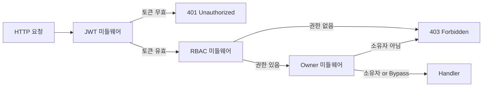

1편에서 RBAC 개념과 권한 모델 설계를 살펴보았다. 이번 글에서는 Go(Echo v4) + React 19로 구현한 샘플 프로젝트를 통해 백엔드 미들웨어 체인과 프론트엔드 권한 UI 제어를 살펴본다.

> 전체 소스코드: [kenshin579/tutorials-go/rbac](https://github.com/kenshin579/tutorials-go/tree/main/rbac)

# 1. 인증과 인가

권한 관리를 구현하기 전에 인증(Authentication)과 인가(Authorization)의 차이를 명확히 해야 한다.

| 구분 | 인증 (Authentication) | 인가 (Authorization) |
|------|----------------------|---------------------|
| **질문** | "누구인가?" | "무엇을 할 수 있는가?" |
| **구현** | JWT 토큰 검증 | RBAC 미들웨어 |
| **실패 시** | 401 Unauthorized | 403 Forbidden |

이 샘플에서는 JWT Access Token에 `user_id`와 `roles`를 포함시켜, 매 요청마다 DB 조회를 최소화한다. Access Token이 만료되면 Refresh Token으로 자동 갱신한다.

# 2. 백엔드: 미들웨어 체인으로 권한 제어

## 2.1 요청 흐름

모든 인증된 요청은 세 단계의 미들웨어 체인을 거친다.



각 미들웨어는 독립적이며, 라우트별로 필요한 것만 조합하여 적용한다.

## 2.2 JWT 미들웨어

Authorization 헤더에서 Bearer 토큰을 추출하고, 검증 후 `user_id`와 `roles`를 Echo Context에 주입한다.

```go
func JWTAuth(jwtSecret string) echo.MiddlewareFunc {
    return func(next echo.HandlerFunc) echo.HandlerFunc {
        return func(c echo.Context) error {
            token := extractBearerToken(c.Request().Header.Get("Authorization"))
            if token == "" {
                return echo.NewHTTPError(http.StatusUnauthorized, "missing token")
            }

            claims, err := jwt.ParseToken(token, jwtSecret)
            if err != nil {
                return echo.NewHTTPError(http.StatusUnauthorized, "invalid token")
            }

            c.Set("user_id", claims.UserID)
            c.Set("roles", claims.Roles)
            return next(c)
        }
    }
}
```

## 2.3 RBAC 미들웨어

JWT에서 추출한 `user_id`로 해당 사용자의 Permission 목록을 조회하고, 요청된 권한과 비교한다.

```go
func RequirePermission(permission string, permRepo domain.PermissionRepository) echo.MiddlewareFunc {
    return func(next echo.HandlerFunc) echo.HandlerFunc {
        return func(c echo.Context) error {
            userID := c.Get("user_id").(uint)

            permissions, err := permRepo.FindByUserID(userID)
            if err != nil {
                return echo.NewHTTPError(http.StatusInternalServerError, "failed to check permissions")
            }

            for _, p := range permissions {
                if p.Key() == permission {
                    return next(c)
                }
            }

            return echo.NewHTTPError(http.StatusForbidden, "insufficient permissions")
        }
    }
}
```

## 2.4 Owner 미들웨어

리소스의 소유자 필드를 DB에서 조회하여 현재 사용자와 비교한다. Bypass Role에 해당하면 소유자 체크를 건너뛴다.

```go
type OwnerConfig struct {
    ResourceTable string   // DB 테이블명 (e.g. "products")
    OwnerField    string   // 소유자 컬럼명 (e.g. "created_by")
    BypassRoles   []string // Owner 체크를 건너뛰는 Role (e.g. ["admin"])
}

func RequireOwner(config OwnerConfig, db *gorm.DB) echo.MiddlewareFunc {
    return func(next echo.HandlerFunc) echo.HandlerFunc {
        return func(c echo.Context) error {
            userID := c.Get("user_id").(uint)
            roles := c.Get("roles").([]string)

            // Bypass Role 체크
            for _, role := range roles {
                for _, bypassRole := range config.BypassRoles {
                    if role == bypassRole {
                        return next(c)
                    }
                }
            }

            // DB에서 소유자 조회
            resourceID := c.Param("id")
            var ownerID uint
            err := db.Table(config.ResourceTable).
                Where("id = ?", resourceID).
                Pluck(config.OwnerField, &ownerID).Error
            if err != nil {
                return echo.NewHTTPError(http.StatusNotFound, "resource not found")
            }

            if ownerID != userID {
                return echo.NewHTTPError(http.StatusForbidden, "not the owner of this resource")
            }

            return next(c)
        }
    }
}
```

## 2.5 라우트별 선언적 적용

라우터에서 `rbac()`과 `owner()` 헬퍼 함수를 사용하면, 라우트 설정만 보고 어떤 권한이 필요한지 한눈에 파악할 수 있다.

```go
// 헬퍼 함수
rbac := func(permission string) echo.MiddlewareFunc {
    return middleware.RequirePermission(permission, permRepo)
}
owner := func(config middleware.OwnerConfig) echo.MiddlewareFunc {
    return middleware.RequireOwner(config, db)
}

// Products 라우트
products := secured.Group("/products")
products.GET("", h.Product.List, rbac("products:read"))
products.POST("", h.Product.Create, rbac("products:create"))
products.PUT("/:id", h.Product.Update, rbac("products:update"),
    owner(middleware.OwnerConfig{
        ResourceTable: "products",
        OwnerField:    "created_by",
        BypassRoles:   []string{"admin"},
    }))
products.DELETE("/:id", h.Product.Delete, rbac("products:delete"))

// Orders 라우트
orders := secured.Group("/orders")
orders.GET("", h.Order.List, rbac("orders:read"))
orders.POST("", h.Order.Create, rbac("orders:create"))
orders.PATCH("/:id/cancel", h.Order.Cancel, rbac("orders:cancel"),
    owner(middleware.OwnerConfig{
        ResourceTable: "orders",
        OwnerField:    "ordered_by",
        BypassRoles:   []string{"admin", "manager"},
    }))
```

`PUT /products/:id` 라우트를 예로 보면:
1. `rbac("products:update")` — `products:update` 권한이 있는지 확인
2. `owner(...)` — `products.created_by`가 현재 사용자인지 확인 (admin은 bypass)

# 3. 프론트엔드: 권한 기반 UI 제어

프론트엔드의 권한 제어는 **보안이 아닌 UX 최적화** 역할이다. 실제 보안은 서버의 미들웨어가 담당하며, 프론트엔드는 권한 없는 기능을 미리 숨겨서 사용자 경험을 개선한다.

## 3.1 AuthContext — 권한 상태 관리

로그인 시 서버에서 `roles[]`와 `permissions[]`를 수신하여 전역 상태로 관리한다.

```tsx
export interface User {
  id: number;
  email: string;
  name: string;
  roles: string[];
  permissions: string[];
}

export function AuthProvider({ children }: { children: ReactNode }) {
  const [state, setState] = useState<AuthState>(() => {
    const savedUser = localStorage.getItem('user');
    const token = localStorage.getItem('access_token');
    if (savedUser && token) {
      return { user: JSON.parse(savedUser), isAuthenticated: true };
    }
    return { user: null, isAuthenticated: false };
  });

  const login = async (email: string, password: string) => {
    const response = await apiClient.post('/auth/login', { email, password });
    const { access_token, refresh_token, user } = response.data;
    localStorage.setItem('access_token', access_token);
    localStorage.setItem('refresh_token', refresh_token);
    setState({ user: user as User, isAuthenticated: true });
  };

  // ...
}
```

## 3.2 ProtectedRoute — 라우트 단위 접근 제어

미인증 사용자는 로그인 페이지로, 권한이 없는 사용자는 대시보드로 리다이렉트한다.

```tsx
export default function ProtectedRoute({ children, permission }: ProtectedRouteProps) {
  const { isAuthenticated } = useAuth();
  const { hasPermission } = usePermission();

  if (!isAuthenticated) {
    return <Navigate to="/login" replace />;
  }

  if (permission && !hasPermission(permission)) {
    return <Navigate to="/dashboard" replace />;
  }

  return <>{children}</>;
}
```

## 3.3 PermissionGate — UI 요소 단위 조건부 렌더링

버튼, 메뉴 등 개별 UI 요소를 Permission과 Owner 체크 조합으로 표시/숨김한다.

```tsx
export default function PermissionGate({ children, permission, ownerId }: PermissionGateProps) {
  const { hasPermission, hasRole, isOwner } = usePermission();

  if (!hasPermission(permission)) {
    return null;
  }

  if (ownerId !== undefined) {
    if (hasRole('admin')) return <>{children}</>;
    if (!isOwner(ownerId)) return null;
  }

  return <>{children}</>;
}
```

사용 예시:

```tsx
{/* products:update 권한 + 본인 상품만 Edit 버튼 표시 */}
<PermissionGate permission="products:update" ownerId={product.created_by}>
  <button>Edit</button>
</PermissionGate>
```

## 3.4 Sidebar 메뉴 동적 필터링

Permission 기반으로 메뉴를 동적으로 필터링한다. admin 전용 메뉴(Users, Roles, Permissions)는 별도 섹션으로 분리한다.

```tsx
const mainMenu: MenuItem[] = [
  { path: '/dashboard', label: 'Dashboard' },
  { path: '/products', label: 'Products', permission: 'products:read' },
  { path: '/orders', label: 'Orders', permission: 'orders:read' },
];

const adminMenu: MenuItem[] = [
  { path: '/users', label: 'Users', permission: 'users:read' },
  { path: '/roles', label: 'Roles', permission: 'roles:read' },
  { path: '/permissions', label: 'Permissions', permission: 'roles:read' },
];
```

각 메뉴 항목의 `permission` 필드를 `hasPermission()`으로 체크하여, 해당 권한이 없는 메뉴는 렌더링하지 않는다.

| 구분 | ProtectedRoute | PermissionGate |
|------|---------------|----------------|
| **적용 단위** | 라우트 (페이지) | UI 요소 (버튼, 메뉴) |
| **동작** | 권한 없으면 리다이렉트 | 권한 없으면 렌더링 안 함 |
| **용도** | URL 직접 접근 차단 | 버튼/메뉴 숨기기 |
| **Owner 체크** | 미지원 | 지원 (`ownerId` prop) |

<!-- TODO: Role별 화면 스크린샷 추가 -->
<!-- admin 로그인 시: 모든 메뉴 표시 -->
<!-- manager 로그인 시: Users/Roles/Permissions 메뉴 숨김 -->
<!-- user 로그인 시: Users/Roles/Permissions 메뉴 숨김, 상품 Create/Edit 버튼 숨김 -->

# 4. 마무리

이번 글에서는 1편에서 설계한 RBAC을 실제 코드로 구현하는 방법을 살펴보았다.

**백엔드 핵심:**
- 미들웨어 체인(JWT → RBAC → Owner)으로 관심사를 분리하고 선언적으로 적용
- `rbac()`, `owner()` 헬퍼로 라우트 설정만 보고 권한 구조 파악 가능

**프론트엔드 핵심:**
- 프론트엔드 권한 제어는 UX 최적화 역할이며, 실제 보안은 서버가 담당
- `ProtectedRoute`(라우트 단위)와 `PermissionGate`(UI 요소 단위) 이중 제어

> 전체 소스코드: [kenshin579/tutorials-go/rbac](https://github.com/kenshin579/tutorials-go/tree/main/rbac)
