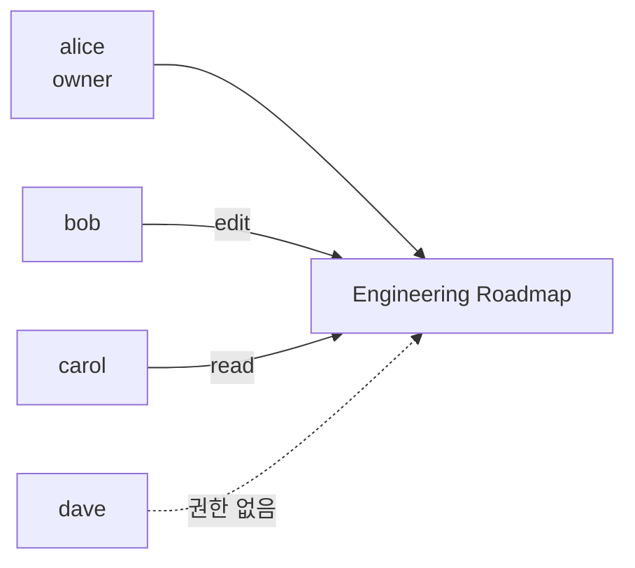
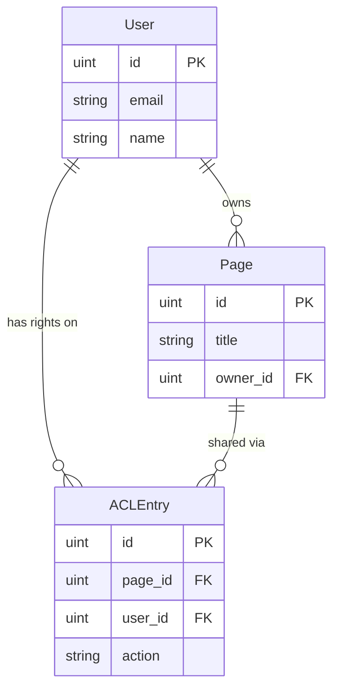
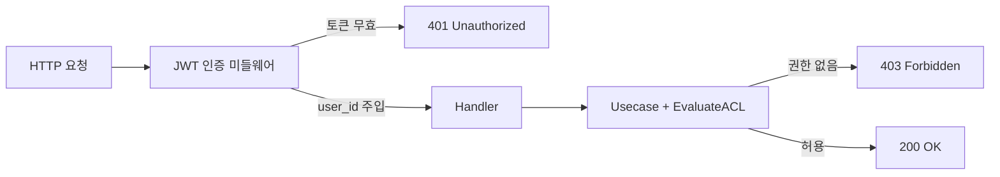

웹 애플리케이션을 만들다 보면 "이 사용자가 이 리소스에 접근할 수 있는가"를 결정해야 하는 순간이 온다. 권한 모델은 이 결정을 어떻게 표현하고 저장하느냐의 문제다. 이 시리즈에서는 자주 쓰이는 세 가지 모델 — **ACL**, **RBAC**, **ABAC** — 을 같은 메타 컨텍스트(사내 위키) 위에서 풀스택 코드로 비교한다.

이번 1편은 가장 직관적인 출발점인 **ACL(Access Control List)** 이다.

# 1. 시리즈 개요

세 모델을 한 줄로 요약하면 다음과 같다.

| 모델 | 한 줄 정의 | 잘 맞는 도메인 |
|---|---|---|
| ACL (1편) | 리소스마다 사용자별 권한을 직접 매핑 | 페이지/파일 공유 (Notion, Google Drive 식) |
| RBAC (2편 예정) | 사용자에게 역할(Role)을 주고, 역할에 권한을 매핑 | 어드민 콘솔, 워크스페이스 운영 |
| ABAC (3편 예정) | 사용자/리소스/환경의 속성(Attribute)으로 정책 평가 | 분류·부서·시간대 등 다중 조건 |

세 모델은 배타적이지 않다. 한 시스템에서 ACL과 RBAC가 함께 쓰이는 경우가 흔하다. 하지만 한 번에 하나씩 깊이 들여다보면 각 모델이 어떤 문제를 풀고 어떤 한계를 갖는지 명확해진다.

# 2. 사내 위키 시나리오

사내에 위키 서비스가 있다고 하자. 사용자는 페이지를 만들고 다른 사람과 공유한다. 요구사항은 단순하다.

- alice가 "Engineering Roadmap" 페이지를 만들었다 (alice가 owner).
- bob에게는 **편집** 권한, carol에게는 **읽기** 권한을 주고 싶다.
- dave는 이 페이지에 접근할 수 없어야 한다.

Notion이나 Google Drive에서 "이 사람에게 편집 권한 주기" UI를 떠올리면 된다. 이 직관이 그대로 ACL의 정의다.

> 페이지마다 사용자별 권한을 직접 나열한 목록 = Access Control List

# 3. ACL의 핵심 — 리소스 ↔ 사용자 직접 매핑



ACL이 표현하는 정보는 `(page, user, action)` 트리플의 집합이다. 이걸 그대로 테이블 한 개로 만들면 끝난다.

| page_id | user_id | action |
|---|---|---|
| 1 (EngRoadmap) | 2 (bob) | edit |
| 1 (EngRoadmap) | 3 (carol) | read |

owner는 페이지의 모든 액션을 할 수 있으므로 `pages.owner_id`로 따로 두고, 그 외 사용자에게 부여한 권한만 ACL 테이블에 둔다.

# 4. 도메인 모델

GORM 엔티티로 모델을 표현하면 다음과 같다.

```go
// domain/user.go
type User struct {
    ID           uint   `gorm:"primaryKey"`
    Email        string `gorm:"size:255;uniqueIndex;not null"`
    Name         string `gorm:"size:100;not null"`
    PasswordHash string `gorm:"size:255;not null"`
    // CreatedAt/UpdatedAt 생략
}

// domain/page.go
type Page struct {
    ID      uint   `gorm:"primaryKey"`
    Title   string `gorm:"size:255;not null"`
    Content string `gorm:"type:text"`
    OwnerID uint   `gorm:"not null;index:owner_id"`
    Owner   *User  `gorm:"foreignKey:OwnerID"`
}

// domain/acl_entry.go
type Action string

const (
    ActionRead Action = "read"
    ActionEdit Action = "edit"
)

type ACLEntry struct {
    ID     uint   `gorm:"primaryKey"`
    PageID uint   `gorm:"not null;uniqueIndex:idx_page_user_action"`
    UserID uint   `gorm:"not null;uniqueIndex:idx_page_user_action"`
    Action Action `gorm:"size:20;not null;uniqueIndex:idx_page_user_action"`
}
```

`(page_id, user_id, action)`을 묶는 복합 unique 인덱스 `idx_page_user_action`이 핵심이다. 같은 사람에게 같은 페이지의 같은 권한을 두 번 부여해도 DB가 자동으로 막아준다 — `Grant` 호출이 idempotent하게 만들어주는 장치다.



# 5. 권한 평가 함수 — `EvaluateACL`

ACL 모델의 핵심을 30줄 안 되는 순수 함수로 표현할 수 있다. 이 함수가 시리즈 전체에서 가장 중요한 코드다.

```go
// domain/acl_check.go
func EvaluateACL(page *Page, userID uint, want Action, entries []ACLEntry) bool {
    if page == nil {
        return false
    }
    // 1) owner는 모든 액션 허용
    if page.OwnerID == userID {
        return true
    }
    for _, e := range entries {
        if e.UserID != userID || e.PageID != page.ID {
            continue
        }
        // 2) 정확히 매칭되는 권한이 있으면 허용
        if e.Action == want {
            return true
        }
        // 3) edit 권한은 read를 함의
        if want == ActionRead && e.Action == ActionEdit {
            return true
        }
    }
    return false
}
```

규칙은 다섯 줄이다.

1. 페이지가 nil이면 거부 (방어적 처리).
2. owner는 모든 액션을 할 수 있다.
3. ACL에 정확히 매칭되는 entry가 있으면 허용.
4. read를 요청했는데 사용자에게 edit 권한이 있으면 허용 (edit이 read를 함의).
5. 위 어느 것도 아니면 거부.

이 함수의 미덕은 **순수 함수**라는 점이다. DB도, 외부 상태도 건드리지 않는다. 호출자가 페이지와 ACL 항목을 미리 가져와 넘겨주고, 이 함수는 결정만 한다. 단위 테스트도 쉽다.

```go
func TestEvaluateACL_EditImpliesRead(t *testing.T) {
    page := &Page{ID: 1, OwnerID: 100}
    entries := []ACLEntry{{PageID: 1, UserID: 200, Action: ActionEdit}}
    assert.True(t, EvaluateACL(page, 200, ActionRead, entries))
    assert.True(t, EvaluateACL(page, 200, ActionEdit, entries))
}
```

# 6. usecase 계층 — 평가 함수와 repository 결합

`EvaluateACL`은 데이터를 모르므로, usecase 계층에서 repository로부터 페이지와 entries를 가져와 함수에 넘긴다.

```go
// usecase/page_usecase.go
func (u *PageUsecase) Get(pageID, userID uint) (*domain.Page, error) {
    page, err := u.pages.FindByID(pageID)
    if err != nil {
        return nil, err
    }
    entries, err := u.acls.FindByPageAndUser(pageID, userID)
    if err != nil {
        return nil, err
    }
    if !domain.EvaluateACL(page, userID, domain.ActionRead, entries) {
        return nil, ErrForbidden
    }
    return page, nil
}
```

`Update`도 같은 패턴이지만 `ActionEdit`을 검사하고, 검사를 통과하면 `Title`과 `Content`를 갱신한 뒤 `pages.Update(page)`를 호출한다.

> 공유 관리(grant/revoke/list)는 *페이지 owner만* 할 수 있다. 이건 `EvaluateACL`이 아니라 `page.OwnerID == requesterID` 체크 한 줄이면 끝이라, 별도 `ACLUsecase.checkOwner` 헬퍼로 분리했다.

# 7. HTTP 계층 — 미들웨어와 핸들러

요청이 들어오면 두 단계로 처리된다.



JWT 미들웨어는 단순하다 — `Authorization: Bearer <token>` 헤더를 검증하고 `user_id`를 Echo context에 주입한다.

```go
// http/middleware/jwt_auth.go
func JWTAuth(secret string) echo.MiddlewareFunc {
    return func(next echo.HandlerFunc) echo.HandlerFunc {
        return func(c echo.Context) error {
            h := c.Request().Header.Get("Authorization")
            if !strings.HasPrefix(h, "Bearer ") {
                return echo.NewHTTPError(http.StatusUnauthorized, "missing bearer token")
            }
            tok := strings.TrimPrefix(h, "Bearer ")
            claims, err := jwthelper.Parse(tok, secret)
            if err != nil {
                return echo.NewHTTPError(http.StatusUnauthorized, "invalid token")
            }
            c.Set(ctxUserID, claims.UserID)
            return next(c)
        }
    }
}
```

핸들러는 usecase 호출 결과를 HTTP 상태로 매핑한다. `ErrForbidden` → 403, `ErrNotFound` → 404, 그 외 → 500.

```go
// http/handler/page_handler.go
func respondOrError(c echo.Context, page *domain.Page, err error) error {
    if err == nil {
        return c.JSON(http.StatusOK, page)
    }
    if errors.Is(err, usecase.ErrForbidden) {
        return echo.NewHTTPError(http.StatusForbidden, "forbidden")
    }
    var nf domain.ErrNotFound
    if errors.As(err, &nf) {
        return echo.NewHTTPError(http.StatusNotFound, nf.Error())
    }
    return echo.NewHTTPError(http.StatusInternalServerError, err.Error())
}
```

라우트는 6개로 끝이다.

| Method | Path | 권한 |
|---|---|---|
| POST | `/auth/login` | public (토큰 발급) |
| GET | `/api/pages` | 인증된 사용자 |
| GET | `/api/pages/:id` | ACL `read` |
| PUT | `/api/pages/:id` | ACL `edit` |
| GET | `/api/pages/:id/acl` | 페이지 owner |
| POST | `/api/pages/:id/acl` | 페이지 owner |
| DELETE | `/api/pages/:id/acl/:userId` | 페이지 owner |

# 8. Frontend — 권한 UX

프론트엔드의 권한 처리는 **UX 보조**다. 실제 보안은 서버에서 결정되고, 프론트엔드는 서버 응답을 기반으로 화면을 그린다.

세 가지 컴포넌트가 핵심이다.

**`AuthContext`** — 로그인 시 받은 access token과 사용자 정보를 localStorage에 저장하고 자식 트리에 노출한다. 토큰은 axios 인터셉터가 자동으로 모든 요청에 첨부한다.

**`ProtectedRoute`** — 미인증 사용자를 `/login`으로 리다이렉트한다. 권한 단위(action) 게이팅은 별도이며, 여기서는 인증만 검증한다.

**`ShareModal`** — 페이지 owner만 진입할 수 있는 공유 관리 화면. user id와 action을 입력해 grant/revoke를 호출한다.

```tsx
// PageDetailPage 일부 - 공유 관리 진입은 owner만
{isOwner && (
  <button onClick={() => setShareOpen(true)}>공유 관리</button>
)}
```

> 의도적으로 **편집 버튼은 모두에게 보이게 두었다.** 권한이 없는 사용자가 클릭하면 PUT 요청이 서버에서 403으로 거부된다. 사전 게이팅(편집 버튼을 미리 숨김)을 하려면 프론트엔드가 `(user, page, ActionEdit)`에 대한 ACL을 별도로 알아야 하는데, 그러면 페이지마다 추가 호출이 필요해지고 ACL의 단순함이 무너진다. 1편의 의도된 한계다 — 다음 절에서 다시 다룬다.

# 9. 동작 시연 (cURL)

전체 흐름은 cURL 몇 줄로 확인할 수 있다.

```bash
# 1. alice 로그인
TOKEN=$(curl -s -X POST localhost:8080/auth/login \
  -H 'Content-Type: application/json' \
  -d '{"email":"alice@example.com","password":"password"}' | jq -r .token)

# 2. alice가 접근 가능한 페이지 — owner 2개 + ACL read 1개 = 3개
curl -s -H "Authorization: Bearer $TOKEN" localhost:8080/api/pages | jq '.[].title'
# "Engineering Roadmap"
# "Q4 Marketing Plan"
# "Public Onboarding Guide"

# 3. dave 로그인 후 Engineering Roadmap에 직접 접근 시도 → 403
DAVE_TOKEN=$(curl -s -X POST localhost:8080/auth/login \
  -H 'Content-Type: application/json' \
  -d '{"email":"dave@example.com","password":"password"}' | jq -r .token)
curl -s -i -H "Authorization: Bearer $DAVE_TOKEN" localhost:8080/api/pages/1 | head -1
# HTTP/1.1 403 Forbidden
```

# 10. ACL의 한계 — 왜 RBAC이 필요한가

ACL은 모델이 가장 단순하지만 사용자 수가 늘면 빠르게 무너진다.

**문제 1 — 신규 사용자가 들어올 때마다 모든 페이지에 권한을 일일이 부여해야 한다.**
회사에 새 인턴이 입사했다고 하자. 인턴이 봐야 할 페이지가 200개라면 ACL 200개를 하나씩 만들어야 한다.

**문제 2 — 정책이 바뀌면 모든 ACL을 손대야 한다.**
"엔지니어링 부서는 기본적으로 모든 엔지니어링 페이지를 읽을 수 있다"는 정책을 도입하려 한다. ACL로 표현하려면 (엔지니어링 사용자 수) × (엔지니어링 페이지 수) 만큼의 entry를 만들어야 한다. 사용자나 페이지가 추가될 때마다 cross product가 늘어난다.

**문제 3 — 직관적이지 않은 일괄 변경.**
"매니저 권한을 모두 회수하라"는 요청이 오면, ACL에서 매니저들의 entry를 일일이 찾아 삭제해야 한다. "매니저"라는 개념이 ACL에는 존재하지 않기 때문이다.

세 문제의 공통 원인은 **사용자와 권한이 1:N으로 직접 묶여 있어 그 사이에 그룹화 단계가 없다**는 점이다. 사용자를 **역할(Role)** 로 그룹화하고 역할에 권한을 매핑하면 위 문제들이 한 번에 풀린다 — 다음 편 RBAC의 출발점이다.

# 11. 정리

| 핵심 | 이유 |
|---|---|
| 모델은 `(page, user, action)` 트리플 집합 | 직관에 가장 가까움 — Notion 공유 UI 그대로 |
| owner는 별도 컬럼, 그 외만 ACL 테이블 | 모든 ACL이 `read+edit`인 owner는 정보가 없는 셈 |
| 평가 함수는 30줄 순수 함수 | 도메인 ↔ DB 분리, 단위 테스트 용이 |
| 복합 unique 인덱스 | Grant idempotency를 DB가 보장 |
| edit ⇒ read 함의 | edit 받은 사람이 read를 따로 받지 않아도 페이지를 볼 수 있음 |
| ACL의 약점 | 사용자/페이지 수가 늘면 entry가 cross product로 폭발 → RBAC로 자연스러운 발전 |

다음 편에서는 같은 사내 위키 시나리오 위에서 같은 사용자/페이지 데이터를 그대로 쓰면서 권한 표현만 RBAC으로 바꿔 본다. 한 줄짜리 SQL이 어떻게 사라지고 무엇이 그 자리를 채우는지 비교해볼 수 있다.

---

> **전체 소스코드**: [`kenshin579/tutorials-go` — `wiki-permissions/1-acl/`](https://github.com/kenshin579/tutorials-go/tree/master/wiki-permissions/1-acl)
>
> **주요 파일**:
> - 도메인 평가 함수: [`domain/acl_check.go`](https://github.com/kenshin579/tutorials-go/blob/master/wiki-permissions/1-acl/backend/domain/acl_check.go)
> - usecase: [`usecase/page_usecase.go`](https://github.com/kenshin579/tutorials-go/blob/master/wiki-permissions/1-acl/backend/usecase/page_usecase.go), [`acl_usecase.go`](https://github.com/kenshin579/tutorials-go/blob/master/wiki-permissions/1-acl/backend/usecase/acl_usecase.go)
> - JWT 미들웨어: [`http/middleware/jwt_auth.go`](https://github.com/kenshin579/tutorials-go/blob/master/wiki-permissions/1-acl/backend/http/middleware/jwt_auth.go)
> - 시드 시나리오: [`config/seed.go`](https://github.com/kenshin579/tutorials-go/blob/master/wiki-permissions/1-acl/backend/config/seed.go)
