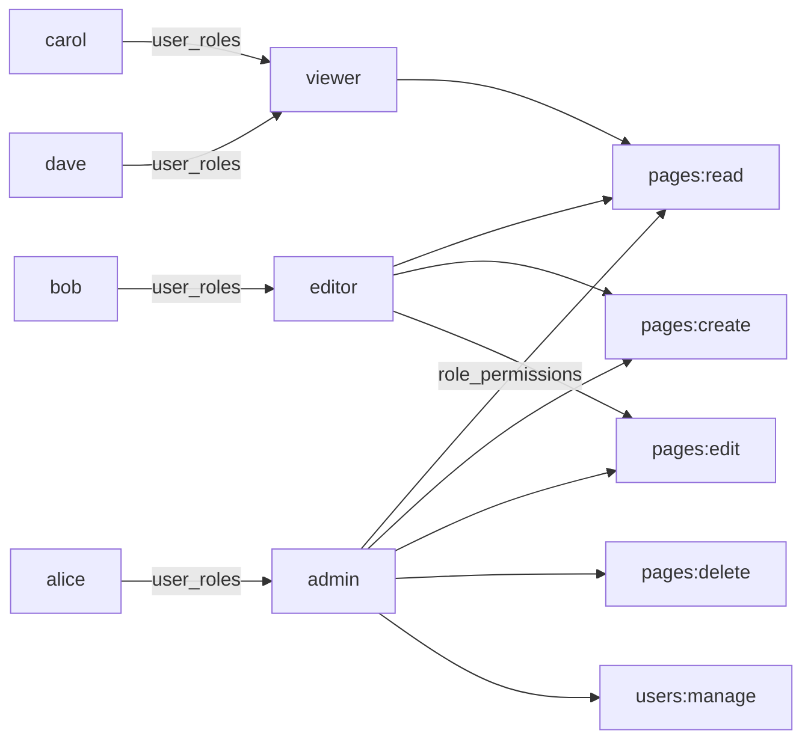

[1편](../웹-권한-모델-비교-1-acl-페이지-단위-공유)에서 ACL의 가장 큰 한계를 이렇게 정리했다.

> 사용자 수 / 페이지 수가 늘면 ACL entry가 cross product로 폭발한다. 신규 사용자가 입사할 때마다, 정책이 바뀔 때마다, 매니저 권한을 일괄 회수할 때마다 ACL을 일일이 손대야 한다.

이 모든 문제의 공통 원인은 **사용자와 권한이 1:N으로 직접 묶여 있고 그 사이에 그룹화 단계가 없다**는 점이었다. 사용자를 **역할(Role)** 로 그룹화하고 역할에 권한을 매핑하면 한 번에 풀린다 — 이게 RBAC다.

# 1. 같은 시나리오, 다른 표현

같은 사내 위키 / 협업 문서 도구 위에서 같은 사용자 풀(alice / bob / carol / dave)을 그대로 쓴다. 페이지도 동일하다. 바뀌는 건 **권한을 어떻게 표현하느냐** 하나뿐이다.

| 사용자 | 1편 ACL | 2편 RBAC |
|---|---|---|
| alice | Engineering Roadmap·Onboarding owner / Q4 read | **admin** (모든 페이지 모든 액션 + 사용자 관리) |
| bob | Engineering Roadmap edit / Q4·Onboarding read | **editor** (모든 페이지 read·create·edit) |
| carol | Q4 owner / Engineering·Onboarding read | **viewer** (모든 페이지 read) |
| dave | Onboarding read만 | **viewer** (모든 페이지 read) |

ACL에서는 페이지마다 사용자별 entry를 직접 부여했다. RBAC에서는 사용자에게 role 하나만 주고, role이 모든 페이지 권한을 일괄 결정한다.

> 같은 코어 데이터 위에 권한 표현만 바꿔보면 두 모델의 진짜 차이가 어디에 있는지 보이게 된다.

# 2. RBAC의 핵심 — 사용자 ↔ 역할 ↔ 권한 3-hop 매핑



ACL이 한 테이블 (`acl_entries`)이었다면 RBAC은 4테이블이다 — `roles`, `permissions`, 그리고 두 M:N 관계를 표현하는 `user_roles`, `role_permissions`. 데이터 모델이 늘어났지만, 권한 평가는 **사용자 → role → permission 3-hop만 따라가면 끝**이라 코드는 오히려 단순해진다.

# 3. 도메인 모델

GORM 엔티티로 표현하면 다음과 같다.

```go
// domain/user.go
type User struct {
    ID           uint   `gorm:"primaryKey"`
    Email        string `gorm:"size:255;uniqueIndex;not null"`
    Name         string `gorm:"size:100;not null"`
    PasswordHash string `gorm:"size:255;not null"`
    Roles        []Role `gorm:"many2many:user_roles"` // 1편과 차이: M:N 추가
}

// domain/role.go
type Role struct {
    ID          uint         `gorm:"primaryKey"`
    Name        string       `gorm:"size:100;uniqueIndex;not null"` // admin/editor/viewer
    Description string       `gorm:"size:255"`
    Permissions []Permission `gorm:"many2many:role_permissions"`
}

// domain/permission.go
type Permission struct {
    ID       uint   `gorm:"primaryKey"`
    Resource string `gorm:"size:100;not null;uniqueIndex:idx_resource_action"`
    Action   string `gorm:"size:100;not null;uniqueIndex:idx_resource_action"`
}

// "pages:edit" 같은 키 표기를 위한 헬퍼
func (p Permission) Key() string { return p.Resource + ":" + p.Action }
```

`many2many` 태그가 GORM에게 join 테이블(`user_roles`, `role_permissions`)을 자동으로 만들게 한다. 별도 엔티티로 정의할 필요 없다.

```mermaid
erDiagram
    User ||--o{ user_roles : has
    user_roles }o--|| Role : belongs_to
    Role ||--o{ role_permissions : has
    role_permissions }o--|| Permission : grants

    User { uint id PK; string email; string name }
    Role { uint id PK; string name }
    Permission { uint id PK; string resource; string action }
```

> `Page`는 1편과 완전히 동일하다. `owner_id`도 그대로 있다. 다만 RBAC 평가는 owner_id를 무시한다 — 이게 본 편 후반의 한계 논의 포인트가 된다.

# 4. 권한 평가 함수 — 단 한 줄의 lookup

1편의 `EvaluateACL`은 owner short-circuit + edit→read 함의 등 5가지 규칙의 30줄짜리 순수 함수였다. 2편의 평가는 한 줄이다.

```go
// usecase/page_usecase.go
func HasPermission(perms []domain.Permission, want string) bool {
    for _, p := range perms {
        if p.Key() == want {
            return true
        }
    }
    return false
}
```

평가 자체는 trivial한 lookup이다. **본 편의 무게는 평가 함수가 아니라 데이터 모델과 그 모델을 효과적으로 조회하는 SQL에 있다.** ACL은 "리스트 안에 매칭 entry가 있는가" 하나만 보면 됐다면, RBAC은 "사용자에게 부여된 role들을 통해 모은 모든 permission 집합"을 먼저 구해야 한다.

# 5. 핵심 SQL — 사용자 → role → permission 3-hop JOIN

`PermissionRepository.FindByUserID`가 본 편의 데이터 측면 핵심이다.

```go
// repository/permission_repository.go
func (r *PermissionRepository) FindByUserID(userID uint) ([]domain.Permission, error) {
    var perms []domain.Permission
    err := r.db.
        Distinct("permissions.*").
        Joins("JOIN role_permissions ON role_permissions.permission_id = permissions.id").
        Joins("JOIN user_roles       ON user_roles.role_id = role_permissions.role_id").
        Where("user_roles.user_id = ?", userID).
        Order("permissions.resource, permissions.action").
        Find(&perms).Error
    return perms, err
}
```

생성되는 SQL은 다음과 같다.

```sql
SELECT DISTINCT permissions.* FROM permissions
JOIN role_permissions ON role_permissions.permission_id = permissions.id
JOIN user_roles       ON user_roles.role_id = role_permissions.role_id
WHERE user_roles.user_id = ?
ORDER BY permissions.resource, permissions.action;
```

`Distinct`가 핵심이다. 한 사용자에게 여러 role이 부여되어 있고 두 role 모두 같은 permission을 갖고 있으면 그 permission이 두 번 매칭된다. `Distinct`로 dedup해 결과를 깨끗하게 만든다.

# 6. usecase 계층 — 평가의 형태가 단순해진다

```go
// usecase/page_usecase.go
type PageUsecase struct {
    pages domain.PageRepository
    perms domain.PermissionRepository
}

func (u *PageUsecase) requirePerm(userID uint, want string) error {
    ps, err := u.perms.FindByUserID(userID)
    if err != nil {
        return err
    }
    if !HasPermission(ps, want) {
        return ErrForbidden
    }
    return nil
}

func (u *PageUsecase) Update(pageID, userID uint, title, content string) (*domain.Page, error) {
    if err := u.requirePerm(userID, "pages:edit"); err != nil {
        return nil, err
    }
    page, err := u.pages.FindByID(pageID)
    if err != nil { return nil, err }
    page.Title = title
    page.Content = content
    return page, u.pages.Update(page)
}
```

1편 `PageUsecase.Get`/`Update`은 *페이지 + ACL entries를 둘 다* 조회하고 `EvaluateACL`에 둘 다 넘겼다. 2편은 *권한 집합만* 조회하면 된다 — 페이지는 권한 평가에 영향을 주지 않으므로 검사 후에 가져와도 된다.

> 라우트가 늘었다. 1편의 ACL 관리 라우트(`/api/pages/:id/acl`)가 사라지고, 그 자리에 페이지 CRUD의 `Create`/`Delete`가 들어왔으며, admin 전용 사용자 role 관리 라우트(`/api/users`, `/api/users/:id/roles`)가 추가됐다.

# 7. HTTP 계층 — 라우트 & 권한 매핑

| Method | Path | 권한 |
|---|---|---|
| POST | `/auth/login` | public (토큰 + permissions/roles 응답) |
| GET | `/api/pages` | `pages:read` |
| GET | `/api/pages/:id` | `pages:read` |
| POST | `/api/pages` | `pages:create` |
| PUT | `/api/pages/:id` | `pages:edit` |
| DELETE | `/api/pages/:id` | `pages:delete` (admin 전용) |
| GET | `/api/users` | `users:manage` (admin 전용) |
| POST | `/api/users/:id/roles` | `users:manage` |
| DELETE | `/api/users/:id/roles/:roleId` | `users:manage` |

`/auth/login` 응답 본문에 토큰뿐 아니라 `permissions`와 `roles`까지 포함한다. 이게 다음 절의 **프론트엔드 사전 게이팅**을 가능하게 한다.

# 8. Frontend — `PermissionGate`의 등장

1편에서는 편집 버튼이 모두에게 보였고 권한 없는 사용자가 클릭하면 서버가 403으로 거부했다. RBAC에서는 login 응답에 사용자 권한이 함께 오기 때문에 클라이언트가 사전 게이팅을 할 수 있다.

```tsx
// components/PermissionGate.tsx
export default function PermissionGate({ permission, children }: Props) {
  const { user } = useAuth();
  if (!user?.permissions.includes(permission)) return null;
  return <>{children}</>;
}
```

사용처는 깔끔하다.

```tsx
// pages/PageDetailPage.tsx
<PermissionGate permission="pages:edit">
  <button>편집</button>
</PermissionGate>

<PermissionGate permission="pages:delete">
  <button>삭제</button>
</PermissionGate>
```

권한이 없으면 `null`을 반환해 버튼 자체가 렌더되지 않는다. 사용자가 보지 못하는 액션은 클릭조차 할 수 없다.

> 단, **보안은 여전히 서버가 책임진다.** 프론트엔드 게이팅은 UX 보조다. 권한이 없는 사용자가 직접 API를 호출해도 서버가 403으로 막는다 — usecase 계층의 `requirePerm`이 그 역할을 한다.

# 9. 동작 시연 (cURL)

```bash
# 1. alice (admin) 로그인 → 6개 permission
curl -s -X POST localhost:8081/auth/login \
  -H 'Content-Type: application/json' \
  -d '{"email":"alice@example.com","password":"password"}' | jq '.permissions'
# ["pages:create","pages:delete","pages:edit","pages:read","users:manage","users:read"]

# 2. bob (editor) 로그인 → 3개 permission
curl -s -X POST localhost:8081/auth/login \
  -H 'Content-Type: application/json' \
  -d '{"email":"bob@example.com","password":"password"}' | jq '.permissions'
# ["pages:create","pages:edit","pages:read"]

# 3. bob이 pages:delete 시도 → 403
BOB=$(curl -s -X POST localhost:8081/auth/login -H 'Content-Type: application/json' \
  -d '{"email":"bob@example.com","password":"password"}' | jq -r .token)
curl -s -i -X DELETE -H "Authorization: Bearer $BOB" localhost:8081/api/pages/1 | head -1
# HTTP/1.1 403 Forbidden

# 4. alice가 dave에게 admin role 부여 → dave 재로그인 시 권한 6개로 확장
ALICE=$(curl -s -X POST localhost:8081/auth/login -H 'Content-Type: application/json' \
  -d '{"email":"alice@example.com","password":"password"}' | jq -r .token)
curl -s -X POST -H "Authorization: Bearer $ALICE" -H 'Content-Type: application/json' \
  -d '{"role_id":1}' localhost:8081/api/users/4/roles
```

# 10. RBAC의 한계 — 왜 다음 편(ABAC)이 필요한가

RBAC도 완벽하지 않다. 두 가지 부류의 한계가 있다.

## 10.1 Role explosion

조직이 커지면 role이 끝없이 늘어난다.

> "QA팀의 시니어"는 일반 QA의 read + 다른 팀의 staging environment write를 가진다. → `qa-senior` role 신설.
>
> "마케팅 인턴"은 자기 팀 페이지 read + 다른 팀의 비공개 페이지에 접근 불가. → `marketing-intern` role 신설.
>
> "엔지니어링 이사"는 모든 엔지니어링 페이지 + 사용자 관리. → `engineering-director` role 신설.

매번 새로운 조합이 등장할 때마다 role이 늘어나며, 결국 사용자만큼 role이 많아지는 역설로 향한다. 이게 유명한 **role explosion** 문제다.

## 10.2 컨텍스트가 없는 권한

RBAC은 *어떤* 액션을 *누가* 하는지 만 본다. *어떤 리소스에 대해* 인지, *언제* 인지, *어디서* 인지는 표현하지 못한다.

핵심 예시: **"내가 만든 페이지만 수정"** 을 RBAC으로 표현할 수 없다.

```
editor role: pages:edit 권한
```

이 표현에는 "어느 페이지"라는 개념이 없다. editor role을 가진 두 사용자는 서로의 페이지를 수정할 수 있다. 1편 ACL은 페이지마다 entry가 있어 owner 개념을 자연스럽게 표현했지만, RBAC은 그 정보를 잃어버렸다.

다른 예시들도 같은 패턴이다.

- "엔지니어링 페이지는 엔지니어링 부서만 read" — *페이지의 부서* 와 *사용자의 부서* 라는 속성이 필요
- "기밀 페이지는 정규직만 read" — *페이지의 분류* 와 *사용자의 고용형태* 라는 속성이 필요
- "업무시간(09–18시) 외에는 모든 쓰기 차단" — *시간대* 라는 환경 속성이 필요

이 세 가지의 공통점은 **속성(attribute)** 이다. 사용자/리소스/환경의 속성을 정책 표현에 끌어들이면 깔끔하게 풀린다 — 다음 편 ABAC의 출발점이다.

# 11. 정리

| 핵심 | 이유 |
|---|---|
| 사용자 → role → permission 3-hop | 사용자와 권한 사이에 그룹화 단계 도입 |
| `EvaluateACL` 30줄 → `HasPermission` 1줄 | 평가는 단순해지고 데이터 모델이 풍부해짐 (트레이드의 방향 변화) |
| 핵심 SQL은 평가 함수가 아니라 repository | `JOIN role_permissions + JOIN user_roles + DISTINCT` |
| login 응답에 permissions 포함 | 프론트엔드 사전 게이팅(`PermissionGate`)이 가능해짐 |
| 약점 1 — Role explosion | 조합이 많아질수록 role이 사용자만큼 늘어나는 역설 |
| 약점 2 — 컨텍스트 없음 | "내 페이지만 수정", "정규직만 read" 같은 표현 불가 → ABAC 동기 |

다음 편에서는 같은 사내 위키 시나리오 위에 사용자/리소스/환경의 속성을 끌어들여 정책으로 권한을 표현해본다. RBAC이 풀지 못한 두 가지 한계 (role explosion, 컨텍스트 부재) 가 어떻게 해결되는지 코드 차원에서 비교한다.

---

> **전체 소스코드**: [`kenshin579/tutorials-go` — `wiki-permissions/2-rbac/`](https://github.com/kenshin579/tutorials-go/tree/master/wiki-permissions/2-rbac)
>
> **주요 파일**:
> - 핵심 JOIN 쿼리: [`repository/permission_repository.go`](https://github.com/kenshin579/tutorials-go/blob/master/wiki-permissions/2-rbac/backend/repository/permission_repository.go)
> - 평가 함수: [`usecase/page_usecase.go`](https://github.com/kenshin579/tutorials-go/blob/master/wiki-permissions/2-rbac/backend/usecase/page_usecase.go) (`HasPermission`)
> - 시드 매트릭스: [`config/seed.go`](https://github.com/kenshin579/tutorials-go/blob/master/wiki-permissions/2-rbac/backend/config/seed.go)
> - 프론트엔드 게이팅: [`frontend/src/components/PermissionGate.tsx`](https://github.com/kenshin579/tutorials-go/blob/master/wiki-permissions/2-rbac/frontend/src/components/PermissionGate.tsx)
>
> **1편(ACL)**: [`1-acl/`](https://github.com/kenshin579/tutorials-go/tree/master/wiki-permissions/1-acl) — 1편/2편을 다른 포트로 동시에 띄워 비교 시연 가능 (1편 :8080/:3000, 2편 :8081/:3001).
