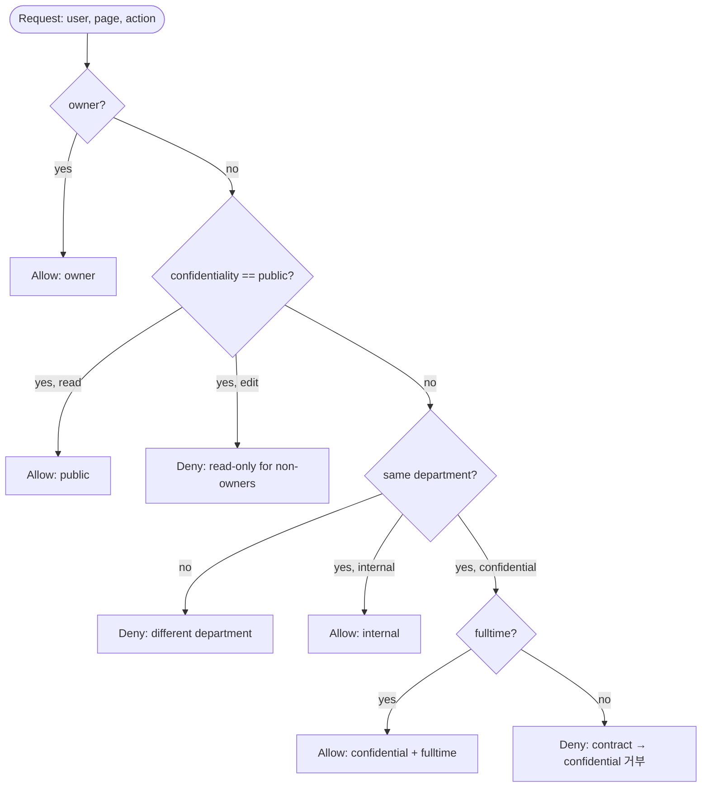

[2편](../웹-권한-모델-비교-2-rbac-워크스페이스-역할)에서 RBAC의 한계 두 가지를 정리했다.

> **Role explosion** — 조합이 늘어날수록 role이 사용자만큼 많아지는 역설.
>
> **컨텍스트 부재** — RBAC은 *어떤 액션을 누가 하는지* 만 본다. *어느 리소스인지, 언제인지, 어디서인지* 같은 컨텍스트는 표현하지 못한다. 대표적으로 "**내가 만든 페이지만 수정**" 같은 owner-aware 정책을 RBAC만으로는 풀 수 없다.

이 두 한계를 푸는 길이 **속성(attribute)** 을 정책 표현에 끌어들이는 것이다. 사용자/리소스/환경에 속성을 붙이고, 그 속성들의 조합을 평가하는 정책을 작성한다 — 이게 ABAC다.

이번 편으로 시리즈를 마무리한다.

# 1. 같은 시나리오, 더 풍부한 표현

같은 사내 위키, 같은 사용자 풀(alice / bob / carol / dave), 같은 페이지 풀이다. 다만 **사용자와 페이지에 속성을 붙인다.**

| 사용자 | Department | Employment |
|---|---|---|
| alice | Engineering | fulltime |
| bob | Engineering | fulltime |
| carol | Marketing | fulltime |
| dave | Marketing | contract |

| Page | Confidentiality | Department |
|---|---|---|
| Engineering Roadmap | internal | Engineering |
| Q4 Marketing Plan | confidential | Marketing |
| Public Onboarding Guide | public | (none) |

이제 권한을 사용자별로 부여하지도(ACL), 역할에 매핑하지도(RBAC) 않는다. 대신 **정책 함수**가 사용자 속성과 페이지 속성을 결합 평가한다.

# 2. ABAC의 핵심 — 정책 함수의 우선순위 평가



평가는 정책들의 **우선순위 순회**다. 먼저 매칭되는 정책이 결정을 내리고 종료한다. 매칭 안 되면 default deny.

> RBAC가 잃었던 "owner 개념"이 ABAC에서는 첫 번째 정책으로 자연스럽게 부활한다. 1편(ACL)의 owner short-circuit이 정책 함수 형태로 다시 표현됐다.

# 3. 도메인 모델 — 속성을 추가한다

권한 데이터 테이블이 모두 사라졌다. 그 자리에 사용자/페이지의 **속성 컬럼**과 부서 엔티티 1개가 들어왔다.

```go
// domain/department.go
type Department struct {
    ID   uint   `gorm:"primaryKey"`
    Name string `gorm:"size:100;uniqueIndex;not null"`
}

// domain/user.go
type EmploymentType string
const (
    EmploymentFulltime EmploymentType = "fulltime"
    EmploymentContract EmploymentType = "contract"
)

type User struct {
    ID             uint
    Email          string
    Name           string
    PasswordHash   string
    DepartmentID   uint
    Department     *Department
    EmploymentType EmploymentType  // ← ABAC 속성
    // ...
}

// domain/page.go
type Confidentiality string
const (
    ConfidentialityPublic       Confidentiality = "public"
    ConfidentialityInternal     Confidentiality = "internal"
    ConfidentialityConfidential Confidentiality = "confidential"
)

type Page struct {
    ID              uint
    Title           string
    Content         string
    OwnerID         uint
    Confidentiality Confidentiality  // ← ABAC 속성
    DepartmentID    *uint            // ← ABAC 속성 (public은 nil)
    Department      *Department
    // ...
}
```

```mermaid
erDiagram
    Department ||--o{ User : has
    Department ||--o{ Page : owns
    User ||--o{ Page : authored

    User { uint id PK; string email; uint department_id FK; string employment_type }
    Page { uint id PK; string title; uint owner_id FK; string confidentiality; uint department_id FK_nullable }
    Department { uint id PK; string name }
```

> 1편의 `ACLEntry`가 사라졌다. 2편의 `Role/Permission/UserRole/RolePermission` 4테이블도 사라졌다. ABAC의 권한 데이터는 **엔티티의 속성 컬럼**일 뿐이다. 정책은 코드(또는 외부 정책 언어)에 있다.

# 4. 정책 평가기 — `EvaluateABAC`

시리즈의 마지막 핵심 코드다. 우선순위 순으로 정책을 평가하고 `Decision`을 반환한다.

```go
// domain/policy.go
type Action string
const (
    ActionRead Action = "read"
    ActionEdit Action = "edit"
)

type Decision struct {
    Allowed bool   `json:"allowed"`
    Reason  string `json:"reason"`  // 사용자에게 보여줄 결정 이유
    Policy  string `json:"policy"`  // 어떤 정책이 결정했나 (감사용)
}

func EvaluateABAC(user *User, page *Page, action Action) Decision {
    if user == nil || page == nil {
        return Decision{Allowed: false, Reason: "user or page is nil", Policy: "guard"}
    }

    // 1) Owner — 모든 액션 허용
    if page.OwnerID == user.ID {
        return Decision{Allowed: true, Reason: "owner of the page", Policy: "owner"}
    }

    // 2) Public — read만 허용
    if page.Confidentiality == ConfidentialityPublic {
        if action == ActionRead {
            return Decision{Allowed: true, Reason: "public page", Policy: "public"}
        }
        return Decision{Allowed: false, Reason: "public page is read-only for non-owners", Policy: "public"}
    }

    // 3) 부서 매칭 가드
    if page.DepartmentID == nil || *page.DepartmentID != user.DepartmentID {
        return Decision{Allowed: false, Reason: "different department", Policy: "department-match"}
    }

    // 4) Internal — 같은 부서 read+edit
    if page.Confidentiality == ConfidentialityInternal {
        return Decision{Allowed: true, Reason: "same department, internal page", Policy: "internal"}
    }

    // 5) Confidential — 같은 부서 + 정규직
    if page.Confidentiality == ConfidentialityConfidential {
        if user.EmploymentType != EmploymentFulltime {
            return Decision{Allowed: false, Reason: "confidential pages require fulltime employment", Policy: "confidential"}
        }
        return Decision{Allowed: true, Reason: "same department, fulltime, confidential page", Policy: "confidential"}
    }

    return Decision{Allowed: false, Reason: "no policy matched", Policy: "default-deny"}
}
```

세 가지가 1·2편과 다르다.

**첫째, 입력이 풍부해졌다.** 1편은 `(page, user, want, entries)`, 2편은 `(perms, want)`였다. 3편은 `(user, page, action)` — user와 page 자체에 속성이 들어 있어 함수가 직접 결합 평가한다.

**둘째, 출력이 풍부해졌다.** bool 한 비트가 아니라 `Decision`이다. `Reason`은 사용자에게 보여줄 메시지, `Policy`는 어떤 정책이 결정했는지 식별자 — 디버깅과 감사 로그에 그대로 쓸 수 있다.

**셋째, owner 개념이 다시 등장했다.** RBAC에서는 표현 못 했던 "내 페이지만 수정"이 첫 번째 정책으로 자연스럽게 표현된다.

# 5. 12 케이스 매트릭스 — 4 사용자 × 3 페이지

|  | EngRoadmap (internal/Eng) | Q4 (confidential/Mkt) | Onboarding (public) |
|---|---|---|---|
| **alice** (Eng/fulltime) | owner → all | × 다른 부서 | read |
| **bob** (Eng/fulltime) | read+edit (같은 부서 internal) | × 다른 부서 | read |
| **carol** (Mkt/fulltime) | × 다른 부서 | owner → all | read |
| **dave** (Mkt/contract) | × 다른 부서 | × contract → confidential 거부 | read |

이 12 케이스가 5개 정책(`owner`, `public`, `department-match`, `internal`, `confidential`)을 모두 시연한다. 정책별로 단위 테스트도 있다 — `EvaluateABAC`는 외부 의존성 없는 순수 함수라 테스트가 매우 간단하다.

# 6. usecase 계층 — 정책 통합 + Decision 응답

```go
// usecase/page_usecase.go
type PageWithDecision struct {
    Page    *domain.Page    `json:"page"`
    CanRead domain.Decision `json:"can_read"`
    CanEdit domain.Decision `json:"can_edit"`
}

func (u *PageUsecase) Get(pageID, userID uint) (*PageWithDecision, error) {
    user, err := u.users.FindByID(userID)
    if err != nil { return nil, err }
    page, err := u.pages.FindByID(pageID)
    if err != nil { return nil, err }

    canRead := domain.EvaluateABAC(user, page, domain.ActionRead)
    if !canRead.Allowed {
        return nil, ErrForbidden
    }
    canEdit := domain.EvaluateABAC(user, page, domain.ActionEdit)
    return &PageWithDecision{Page: page, CanRead: canRead, CanEdit: canEdit}, nil
}
```

`Get` 응답에는 페이지뿐 아니라 두 액션의 Decision을 모두 담는다. 클라이언트는 `can_edit.reason`을 그대로 사용자에게 보여주면 된다.

`List`는 정책 평가를 메모리에서 돌린다.

```go
func (u *PageUsecase) List(userID uint) ([]domain.Page, error) {
    user, _ := u.users.FindByID(userID)
    all, _ := u.pages.List()
    out := make([]domain.Page, 0, len(all))
    for i := range all {
        if domain.EvaluateABAC(user, &all[i], domain.ActionRead).Allowed {
            out = append(out, all[i])
        }
    }
    return out, nil
}
```

> **확장성 주의.** 페이지가 수만 개 이상으로 늘어나면 메모리 필터는 비효율이다. 정책 일부를 SQL `WHERE` 조건으로 변환해 사전 필터링하거나 (예: 부서 매칭은 SQL로 처리), OPA의 [Partial Evaluation](https://www.openpolicyagent.org/docs/latest/policy-performance/#partial-evaluation) 같은 기법을 도입한다. 학습 코드에서는 단순함을 우선했다.

# 7. Frontend — Decision을 그대로 보여준다

이번 편 UX의 미덕은 페이지 상세 화면이다. 서버가 내려준 `Decision`을 카드로 표시한다.

```tsx
// PageDetailPage.tsx 일부
<DecisionCard label="읽기 권한" decision={data.can_read} />
<DecisionCard label="편집 권한" decision={data.can_edit} />

{data.can_edit.allowed && <button>편집</button>}
```

```
✓ 읽기 권한    policy: internal
   same department, internal page

✗ 편집 권한    policy: department-match
   different department
```

1편은 권한 없으면 그냥 403만 떨어졌다. 2편은 `PermissionGate`로 버튼을 사전에 숨겼다. 3편은 **왜 허용/거부됐는지** 를 사용자에게 명시한다 — ABAC 평가 결과가 풍부하기 때문에 가능한 UX다.

> Decision의 `policy` 식별자는 사용자보다는 운영자에게 가치가 있다. 어떤 정책이 어떤 결정을 내렸는지가 응답에 박혀 있어 감사 로그를 그대로 만들 수 있다.

# 8. 동작 시연 (cURL)

```bash
# 1. dave (Mkt/contract) 로그인 → Onboarding 1개만 보임
DAVE=$(curl -s -X POST localhost:8082/auth/login \
  -H 'Content-Type: application/json' \
  -d '{"email":"dave@example.com","password":"password"}' | jq -r .token)
curl -s -H "Authorization: Bearer $DAVE" localhost:8082/api/pages | jq '. | length'  # 1

# 2. dave가 Q4 (confidential/Mkt) 직접 접근 → 403
curl -s -i -H "Authorization: Bearer $DAVE" localhost:8082/api/pages/2 | head -1
# HTTP/1.1 403 Forbidden

# 3. bob (Eng/fulltime)이 Engineering Roadmap → Decision 표시
BOB=$(curl -s -X POST localhost:8082/auth/login \
  -H 'Content-Type: application/json' \
  -d '{"email":"bob@example.com","password":"password"}' | jq -r .token)
curl -s -H "Authorization: Bearer $BOB" localhost:8082/api/pages/1 | jq '.can_read, .can_edit'
# {"allowed":true,"reason":"same department, internal page","policy":"internal"}
```

# 9. ABAC의 한계 — 모델은 강력하지만 정책 설계가 어렵다

ABAC도 만능은 아니다.

**한계 1 — 정책 설계의 복잡도가 운영의 핵심이 된다.**
"같은 부서 + 정규직 + 업무시간(09–18시) + 동일 IP 대역" 같이 조건이 늘어나면 정책 함수가 빠르게 길어진다. 정책 카탈로그를 잘 관리하고 충돌하는 정책이 없는지 검증하는 것이 운영의 절반 이상이다.

**한계 2 — "정책이 왜 이렇게 됐는지" 추적이 어려워질 수 있다.**
RBAC은 "이 사용자가 admin이라 됐다"로 단순하지만, ABAC은 여러 속성의 조합이라 디버깅 시 결정 경로를 추적하는 도구(decision logs, evaluation trace)가 필요하다. 본 샘플의 `Decision.Policy` 필드가 그 시작점이다.

**한계 3 — 외부 시스템과의 속성 동기화.**
"부서"라는 속성이 HR 시스템에 있고, 부서가 바뀌면 권한도 바뀌어야 한다. 속성의 출처(source of truth) 관리와 캐시 갱신이 RBAC보다 까다롭다.

운영에서는 본 샘플처럼 정책을 Go 함수에 hardcode하지 않고 [OPA + Rego](https://www.openpolicyagent.org/), [Cedar](https://www.cedarpolicy.com/), [Casbin](https://casbin.org/) 같은 정책 엔진을 도입하는 것이 일반적이다. 정책을 코드와 분리해 런타임에 변경 가능하게 만들고, 정책 평가 trace를 표준화된 방식으로 다룰 수 있다. ABAC의 데이터 모델(엔티티 속성 + 환경 컨텍스트)은 그대로 가져갈 수 있다.

# 10. 시리즈 종합 비교

| 영역 | 1편 ACL | 2편 RBAC | 3편 ABAC |
|---|---|---|---|
| 권한 데이터 | `ACLEntry` 1테이블 | Role + Permission + UserRole + RolePermission | 사용자/페이지 속성 컬럼 + Department |
| 평가 함수 | 30줄 (owner short-circuit + edit→read) | 1줄 lookup | 60줄 (정책 우선순위) |
| 평가 출력 | bool | bool | `Decision{Allowed, Reason, Policy}` |
| 핵심 SQL | LEFT JOIN acl_entries | JOIN role_permissions + user_roles | (메모리 정책 평가) |
| owner 처리 | 자동 short-circuit | 무시 (한계) | 정책으로 명시 (한계 회복) |
| Frontend 표현 | 서버 403만 | PermissionGate 사전 게이팅 | Decision reason을 사용자에게 표시 |
| 표현력 | 낮음 (개별 grant) | 중간 (역할 그룹) | 높음 (속성 조합) |
| 운영 부담 | 사용자/페이지 수에 비례 | role 수에 비례 (role explosion) | 정책 수와 정책 설계 품질에 비례 |

비교의 무게 이동을 한 줄로 정리하면 — **ACL은 평가 함수에, RBAC은 데이터 모델에, ABAC은 정책 설계에 운영 비용이 든다.**

# 11. "내 도메인엔 어떤 모델?"

세 모델은 배타적이지 않다. 한 시스템에서 둘 이상이 섞이는 경우가 흔하다. 다만 처음 도입한다면 다음의 직관이 도움이 된다.

**ACL을 먼저 고려할 때**

- 사용자/리소스 수가 작다 (수십 ~ 수천 단위)
- "이 사람에게 이 리소스만"이 자연스러운 도메인 (파일·문서 공유 SaaS, 캘린더 초대)
- 정책보다 *개별 grant 의도* 가 더 중요한 경우

**RBAC를 먼저 고려할 때**

- 조직 구조에 맞춰 자연스러운 role 카탈로그를 도출 가능 (admin / editor / viewer 같은)
- 같은 역할은 같은 권한이라는 가정이 도메인 의미와 맞다
- 신규 사용자 온보딩이 빈번 → role 단위 부여로 단순화하고 싶다

**ABAC을 먼저 고려할 때**

- 시간/위치/분류/소유 등 *컨텍스트* 가 정책에 들어가야 한다 (의료, 금융, 컴플라이언스)
- "owner-aware" 또는 "부서별 차등" 같은 표현이 RBAC만으로는 어색해진다
- 정책 변경이 잦고 운영자가 코드 변경 없이 정책을 조정해야 한다 → 외부 정책 엔진(OPA 등)을 함께

**섞어 쓰는 패턴**

- RBAC + ACL: 회사 어드민(role) + 페이지별 공유(ACL) (Notion, GitHub Repository)
- RBAC + ABAC: role로 큰 줄기 + ABAC로 owner/부서 등 컨텍스트 보강 (가장 실전적)
- ACL + ABAC: 개별 grant + 시간대/지역 같은 환경 조건 (DLP, 데이터 거버넌스)

# 12. 시리즈 마무리

이 시리즈는 **같은 사내 위키 시나리오** 위에서 세 권한 모델을 같은 풀스택 구조(Go + Echo + GORM + SQLite + React 19)로 구현해 비교했다. 의도적으로 메타 컨텍스트와 사용자/페이지 풀을 통일했기에, 모델 차이가 코드 차원에서 자연스럽게 드러나도록 만들었다.

| 편 | 핵심 메시지 |
|---|---|
| 1편 ACL | 직관적이지만 cross product 폭발 |
| 2편 RBAC | 평가 함수가 단순해지는 대신 데이터 모델이 풍부해진다 — 트레이드의 방향이 바뀐다 |
| 3편 ABAC | 평가 출력이 단순한 yes/no를 넘어 reason까지 — UX와 감사 로그가 풍부해진다 |

세 편 모두의 코드는 동일 디렉토리(`tutorials-go/wiki-permissions/`)에 self-contained로 들어 있어 같이 띄워 비교할 수 있다(1편 :8080·:3000, 2편 :8081·:3001, 3편 :8082·:3002).

권한 모델은 정답이 하나가 아니다. 도메인의 요구사항·조직의 운영 능력·정책 변경 빈도가 모두 다르므로 위 의사결정 기준을 출발점으로 삼아 자기 시스템에 맞는 조합을 찾아가면 된다.

긴 시리즈를 함께 따라와주신 분들께 감사합니다.

---

> **전체 소스코드**: [`kenshin579/tutorials-go` — `wiki-permissions/`](https://github.com/kenshin579/tutorials-go/tree/master/wiki-permissions)
>
> **3편 주요 파일**:
> - 정책 평가기: [`domain/policy.go`](https://github.com/kenshin579/tutorials-go/blob/master/wiki-permissions/3-abac/backend/domain/policy.go)
> - usecase 통합: [`usecase/page_usecase.go`](https://github.com/kenshin579/tutorials-go/blob/master/wiki-permissions/3-abac/backend/usecase/page_usecase.go)
> - Decision 카드: [`frontend/src/pages/PageDetailPage.tsx`](https://github.com/kenshin579/tutorials-go/blob/master/wiki-permissions/3-abac/frontend/src/pages/PageDetailPage.tsx)
>
> **시리즈 다른 편**:
> - [1편 ACL — 페이지 단위 공유](../웹-권한-모델-비교-1-acl-페이지-단위-공유)
> - [2편 RBAC — 워크스페이스 역할](../웹-권한-모델-비교-2-rbac-워크스페이스-역할)
