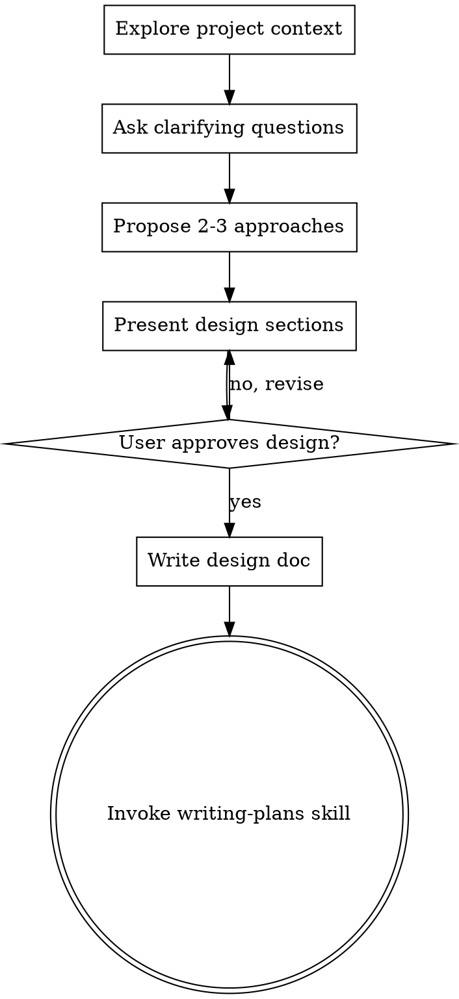

# Superpowers Skill 해부 블로그 작성 — Implementation Plan

> **For agentic workers:** REQUIRED SUB-SKILL: Use superpowers:subagent-driven-development (recommended) or superpowers:executing-plans to implement this plan task-by-task. Steps use checkbox (`- [ ]`) syntax for tracking.

**Goal:** Superpowers의 4개 skill(brainstorming, writing-plans, executing-plans, verification-before-completion)을 직접 열어 5가지 메타프롬프팅 패턴을 추출하는 분석글을 ~5,500자 분량으로 작성한다.

**Architecture:** 단일 markdown 파일을 섹션 단위로 누적 작성. 각 섹션은 spec에서 정의된 분량/구조/인용을 따른다. 인용은 superpowers v5.0.7 skill 파일에서 직접 발췌. 글은 `docs/start/` (드래프트) → PR → `docs/merge_ready/` → `contents/ai/` 워크플로우를 따른다.

**Tech Stack:** Markdown + YAML frontmatter, Mermaid (자체 다이어그램 시), GitHub Flavored Markdown 표.

**Spec:** `blog-v2.advenoh.pe.kr/docs/superpowers/specs/2026-05-01-superpowers-skill-analysis-blog-design.md`

**Branch:** `docs/superpowers-skill-anatomy` (이미 생성됨, spec commit 완료)

---

## File Structure

| 파일 | 역할 | 상태 |
|---|---|---|
| `docs/start/claude-code-superpowers-skill-해부/index.md` | 블로그 드래프트 (이번 plan의 산출물) | Create |
| `docs/superpowers/specs/2026-05-01-superpowers-skill-analysis-blog-design.md` | spec (참조) | Existing |
| `~/.claude/plugins/cache/superpowers-marketplace/superpowers/5.0.7/skills/brainstorming/SKILL.md` | 인용 출처 #1 (HARD-GATE, hand-off, frontmatter description) | Reference only |
| `~/.claude/plugins/cache/superpowers-marketplace/superpowers/5.0.7/skills/writing-plans/SKILL.md` | 인용 출처 #2 (frontmatter description, Save plans to) | Reference only |
| `~/.claude/plugins/cache/superpowers-marketplace/superpowers/5.0.7/skills/executing-plans/SKILL.md` | 인용 출처 #3 (Announce 패턴) | Reference only |
| `~/.claude/plugins/cache/superpowers-marketplace/superpowers/5.0.7/skills/verification-before-completion/SKILL.md` | 인용 출처 #4 (Iron Law) | Reference only |
| `~/.claude/plugins/cache/superpowers-marketplace/superpowers/5.0.7/skills/using-superpowers/SKILL.md` | 인용 출처 #5 (Red Flags 표, skill_flow graphviz) | Reference only |

블로그 글은 단일 파일. 코드 샘플 외부 저장소 작성 없음.

---

## 작성 가이드 (모든 task 공통)

- **분량 측정**: 매 섹션 commit 전 `wc -m index.md` 로 누적 글자 수 점검. 한국어는 multibyte이므로 `awk '{s+=length($0)} END{print s}' index.md` 가 더 정확.
- **인용 형식**: 영어 원문 유지 + 한글 보충 설명. 인용 블록은 markdown ` > ` quote 또는 fenced code block.
- **인용 경로 표기**: 파일 경로는 `skills/<name>/SKILL.md` (path-only). 줄번호 표기 금지.
- **인코딩 검증**: 매 commit 전 `file -I docs/start/.../index.md` → `charset=utf-8` 확인.
- **Mermaid 정책**: 자체 다이어그램이 필요하면 ```mermaid ... ``` 코드블록. 노드 텍스트에 `<br/>`, `<br>` 사용 금지. skill 원본의 graphviz는 ```dot 또는 ```text 코드블록으로 그대로 인용 (변환 X, 인용임을 명시).
- **commit 메시지 형식**: blog-v2 CLAUDE.md 규칙 — `[#이슈번호] <type>: <설명>`. 이슈 번호 없으면 type만 사용 (`docs:` prefix).

---

## Task 1: 드래프트 셋업 + frontmatter + 도입부

**Files:**
- Create: `docs/start/claude-code-superpowers-skill-해부/index.md`

**목표 분량 (이 task 누적)**: ~500자 (frontmatter 제외 본문 약 400자)

- [ ] **Step 1: 드래프트 디렉토리 생성**

```bash
cd /Users/user/src/workspace_blogv2/blog-v2.advenoh.pe.kr
mkdir -p "docs/start/claude-code-superpowers-skill-해부"
```

Expected: 디렉토리 생성, 에러 없음.

- [ ] **Step 2: index.md 생성 — frontmatter + 도입부**

`docs/start/claude-code-superpowers-skill-해부/index.md` 생성, 다음 내용:

````markdown
---
title: "Claude Code Superpowers Skill 해부: 메타프롬프팅이 어떻게 워크플로우가 되는가"
description: "Superpowers skill 파일을 직접 열어 5가지 메타프롬프팅 패턴을 추출하고, 각 패턴이 LLM의 어떤 약점을 보완하는지 분석한다."
date: 2026-05-01
update: 2026-05-01
tags:
  - Claude Code
  - Superpowers
  - Skill
  - Plugin
  - 프롬프트엔지니어링
  - 메타프롬프팅
  - AI
  - Anthropic
  - 워크플로우자동화
series: "Claude Code 완벽 가이드"
---

# 1. 들어가며

`/brainstorming`. 한 줄을 입력했을 뿐인데 Claude가 갑자기 다른 사람이 된다. 질문을 한 번에 하나씩만 던지고, 디자인을 섹션별로 나눠 보여주고, "승인하기 전엔 코드 한 줄도 못 쓴다"고 단호하게 말한다. 이건 model의 능력이 아니라 skill 파일 한 장의 작업이다.

skill의 정체는 markdown 한 장. 그렇다면 그 안에는 무엇이 쓰여 있는가? 이 글은 Superpowers의 4개 skill(`brainstorming`, `writing-plans`, `executing-plans`, `verification-before-completion`)을 직접 열어, LLM이 자기-합리화로 워크플로우를 무너뜨리지 못하게 만드는 5가지 메타프롬프팅 패턴을 추출한다.

> 본 글은 [Claude Code Superpowers 완벽 가이드: brainstorm부터 PR까지](/articles/claude-code-superpowers-완벽-가이드)의 심화 후속편이다. 사용법과 풀 사이클 사례는 사촌 글에서 다루고, 여기서는 skill 파일이 *어떻게 쓰여 있는가*에 집중한다.
````

가이드:
- 후크는 spec L154-162 그대로 사용 (콜론 단락 정렬만 다듬음).
- cross-link URL은 `/articles/claude-code-superpowers-완벽-가이드` (블로그 라우팅 패턴).
- frontmatter에 `category` 키 절대 추가 금지.

- [ ] **Step 3: 인코딩/분량 검증**

```bash
file -I "docs/start/claude-code-superpowers-skill-해부/index.md"
awk '{s+=length($0)} END{print "문자수:", s}' "docs/start/claude-code-superpowers-skill-해부/index.md"
```

Expected:
- `charset=utf-8`
- 문자수: 약 700~900 (frontmatter 포함). frontmatter만 제외하면 본문 약 400자.

- [ ] **Step 4: commit**

```bash
git add "docs/start/claude-code-superpowers-skill-해부/index.md"
git commit -m "docs: superpowers skill 해부 블로그 드래프트 셋업과 도입부 작성

* frontmatter 확정 (series: Claude Code 완벽 가이드 편입)
* 도입부 ~400자 작성 — /brainstorming 후크와 글의 약속 명시
* 사촌 글(완벽-가이드)로 cross-link"
```

---

## Task 2: 1부 — Superpowers 워크플로우 한 바퀴

**Files:**
- Modify: `docs/start/claude-code-superpowers-skill-해부/index.md` (append)

**목표 분량 (이 task에서 추가)**: ~1,500자

- [ ] **Step 1: 1부 헤더와 Superpowers 한 줄 소개 + 디렉토리 구조 작성**

기존 파일 끝에 다음을 append:

````markdown

# 2. Superpowers 워크플로우 한 바퀴

Superpowers는 [Anthropic Claude Code plugin marketplace](https://www.anthropic.com/engineering/claude-code-plugins)에 등록된 plugin으로, 단일 기능이 아니라 **여러 skill의 묶음 + skill끼리 정해진 순서로 호출되는 워크플로우**를 제공한다. 설치하면 `~/.claude/plugins/cache/superpowers-marketplace/superpowers/<version>/skills/`에 다음과 같은 skill 디렉토리가 생긴다.

```
skills/
├── brainstorming/                    # 아이디어 → spec
├── writing-plans/                    # spec → 실행 plan
├── executing-plans/                  # plan → 코드
├── verification-before-completion/   # "다 됐다"고 말하기 전 게이트
├── using-superpowers/                # 메타-skill (모든 skill의 진입점)
├── test-driven-development/
├── systematic-debugging/
└── ... (총 15개)
```

각 skill은 `SKILL.md` 파일 한 장이 본체다. 본 글에서는 이 중 워크플로우 본축을 이루는 4개 skill을 따라가며, 같은 패턴이 어떻게 반복적으로 나타나는지 본다.
````

가이드:
- "총 15개"는 v5.0.7 기준 (확인됨). 버전이 다르면 숫자 조정.
- 디렉토리 트리는 ASCII art 아닌 코드블록 (Mermaid 정책은 *다이어그램*에 한함, 디렉토리 트리는 예외).

- [ ] **Step 2: 4개 skill 압축 소개 작성 (각 ~300자)**

같은 파일에 append:

````markdown

## 2.1 brainstorming — 아이디어를 spec으로

frontmatter 한 줄이 이 skill의 정체다.

> "You MUST use this before any creative work — creating features, building components, adding functionality, or modifying behavior."
> — `skills/brainstorming/SKILL.md`

호출되면 한 번에 한 질문씩 사용자에게 던지면서 의사결정 트리를 따라간다. 끝에는 검증된 spec을 `docs/superpowers/specs/YYYY-MM-DD-<topic>-design.md`로 저장하고 commit한다. 핵심은 한 마디로 "승인 없이는 코드 한 줄도 못 쓴다"는 강제다.

## 2.2 writing-plans — spec을 실행 가능한 plan으로

spec이 *무엇을 만들지*를 정의한다면, plan은 *어떻게 만들지*를 step 단위로 분해한다. skill의 표현을 그대로 옮기면:

> "Write comprehensive implementation plans assuming the engineer has zero context for our codebase and questionable taste."
> — `skills/writing-plans/SKILL.md`

각 task는 2~5분짜리 step으로 쪼개지고, 모든 step에는 정확한 파일 경로/명령어/예상 결과가 들어간다. plan을 읽는 주체가 LLM이든 신입 개발자든 동일하게 따라갈 수 있도록 placeholder를 금지한다.

## 2.3 executing-plans — plan을 코드로

plan을 받아 task 단위로 실행한다. 시작 선언이 명시되어 있다.

> "Announce at start: 'I'm using the executing-plans skill to implement this plan.'"
> — `skills/executing-plans/SKILL.md`

이 한 줄이 의외로 중요하다. LLM이 "지금 어떤 모드로 일하는가"를 출력 첫 줄에 박아두면, 후속 컨텍스트에서 모드 이탈이 줄어든다. subagent 환경이 가능하면 `subagent-driven-development`를 권장하지만, 인라인 실행도 가능한 fallback이다.

## 2.4 verification-before-completion — "다 됐다"고 말하기 전

마지막 게이트다. skill의 시작 선언이 분명하다.

> "Claiming work is complete without verification is dishonesty, not efficiency. **Core principle:** Evidence before claims, always."
> — `skills/verification-before-completion/SKILL.md`

LLM은 "다 됐습니다"라고 자신 있게 말하고서 실제로는 빌드를 안 돌려본 경우가 흔하다. 이 skill은 "이번 메시지에서 검증 명령을 실행하지 않았다면 통과 주장을 할 수 없다"는 Iron Law로 그 함정을 닫는다.

## 2.5 공통점은 무엇인가

4개 skill을 나란히 놓고 보면 공통점이 보인다. 모두 *무엇을 해라*보다 *무엇을 하지 마라*가 더 큰 비중을 차지한다. brainstorming은 "승인 전 코드 작성 금지", writing-plans는 "placeholder 금지", verification은 "검증 없이 완료 주장 금지". skill은 LLM의 *능력 부여*가 아니라 *합리화 차단*에 무게를 둔다.

이걸 가능하게 하는 메타프롬프팅 패턴 5가지를 다음 장에서 하나씩 해부한다.
````

- [ ] **Step 3: 분량 점검**

```bash
awk '{s+=length($0)} END{print "누적 문자수:", s}' "docs/start/claude-code-superpowers-skill-해부/index.md"
```

Expected: 누적 약 2,300~2,500자 (frontmatter 포함). 본문만 약 1,900~2,000자.
초과 시: 2.1~2.4 각 단락에서 형용사/접속사 줄여 압축.
미달 시: 각 skill 마지막에 "이 skill에서 가장 인상적인 줄" 한 문장 추가.

- [ ] **Step 4: commit**

```bash
git add "docs/start/claude-code-superpowers-skill-해부/index.md"
git commit -m "docs: 1부 Superpowers 워크플로우 한 바퀴 작성

* skills/ 디렉토리 구조 + 4개 skill(brainstorming, writing-plans, executing-plans, verification) 압축 소개
* 각 skill에서 핵심 한 줄 인용 + 짧은 해설
* '공통점은 무엇인가'로 2부 패턴 해부 연결"
```

---

## Task 3: 2부 — 패턴 1 (HARD-GATE) + 패턴 2 (Graphviz Flowchart)

**Files:**
- Modify: `docs/start/claude-code-superpowers-skill-해부/index.md` (append)

**목표 분량 (이 task에서 추가)**: ~1,250자 (패턴 1 ~600자 + 패턴 2 ~600자 + 헤더 ~50자)

- [ ] **Step 1: 2부 헤더와 패턴 1 작성**

기존 파일 끝에 append:

````markdown

# 3. 5가지 메타프롬프팅 패턴 해부

여기서부터가 본편이다. 각 패턴은 동일한 4-요소 구조로 본다 — **정의 → 코드 인용 → 해결하는 LLM 약점 → 응용 포인트**.

## 3.1 패턴 1: HARD-GATE — 명시적 차단 마커

`<HARD-GATE>...</HARD-GATE>` 태그로 LLM이 특정 행동을 절대 하지 못하게 차단하는 구조 마커다. `brainstorming` 첫머리에 등장한다.

```text
<HARD-GATE>
Do NOT invoke any implementation skill, write any code, scaffold any project,
or take any implementation action until you have presented a design and the
user has approved it. This applies to EVERY project regardless of perceived
simplicity.
</HARD-GATE>
```
출처: `skills/brainstorming/SKILL.md`

이 마커가 해결하는 LLM 약점은 명료하다. 시스템 프롬프트의 일반 지시사항은 후속 컨텍스트에 의해 점차 희석된다. "심플한 작업이니 그냥 코드 짜자"라는 자기-합리화가 끼어들 여지가 생긴다. HARD-GATE는 그 합리화의 통로 자체를 닫아버린다 — "EVERY project regardless of perceived simplicity"라는 조건절이 결정적이다. 예외 조건을 사전 차단했기 때문에 "이번엔 예외" 논리가 작동하지 않는다.

**응용 포인트**: 자기 skill을 만들 때 "이 단계에서 절대 하면 안 되는 행동" 1개를 고르고, 그것을 본문에 흩어놓지 말고 분리된 블록으로 명시하라. 한 skill에 HARD-GATE는 1~2개로 충분하다 (남발하면 효력이 떨어진다).
````

- [ ] **Step 2: 패턴 2 작성**

같은 파일에 append:

````markdown

## 3.2 패턴 2: Graphviz Flowchart — 의사결정의 결정성 확보

`brainstorming`과 `using-superpowers`는 자연어로 워크플로우를 설명하지 않는다. graphviz `digraph` 블록을 직접 박아넣는다.


출처: `skills/brainstorming/SKILL.md` (단순화 인용)

해결하는 LLM 약점: 자연어 if/then 문장은 모호하다. "사용자가 동의하지 않으면 다시 물어봐"라는 문장은 "어디로 돌아가야 하는지"가 불명확하다. 그래프는 "어떤 노드에서 어떤 노드로 이동하는가"가 격자처럼 명시된다. 특히 `[shape=doublecircle]`로 표시된 종착점이 강력하다 — "이 노드에 도달하면 끝"이라는 신호가 시각적/구조적으로 동시에 박힌다.

**응용 포인트**: 분기 3개 이상의 흐름이라면 자연어 대신 graphviz나 표로 옮겨라. 종착점은 반드시 별도 모양으로 표시. LLM이 그래프를 "읽는다"기보다 "구조를 따라간다"는 점이 핵심이다.
````

- [ ] **Step 3: 분량 점검**

```bash
awk '{s+=length($0)} END{print "누적 문자수:", s}' "docs/start/claude-code-superpowers-skill-해부/index.md"
```

Expected: 누적 약 3,500~3,800자.

- [ ] **Step 4: commit**

```bash
git add "docs/start/claude-code-superpowers-skill-해부/index.md"
git commit -m "docs: 2부 패턴 1(HARD-GATE) + 패턴 2(Graphviz Flowchart) 작성

* 4-요소 구조(정의→인용→LLM 약점→응용) 정착
* HARD-GATE: 'EVERY project' 조건절이 예외 차단의 핵심임을 분석
* Graphviz: doublecircle 종착점 마커가 워크플로우 결정성에 기여하는 메커니즘 분석"
```

---

## Task 4: 2부 — 패턴 3 (Red Flags) + 패턴 4 (Frontmatter description)

**Files:**
- Modify: `docs/start/claude-code-superpowers-skill-해부/index.md` (append)

**목표 분량 (이 task에서 추가)**: ~1,200자

- [ ] **Step 1: 패턴 3 (Red Flags) 작성**

같은 파일에 append:

````markdown

## 3.3 패턴 3: Red Flags 테이블 — 자기-합리화 패턴화

`using-superpowers`에는 "이런 생각이 들면 STOP" 헤더의 표가 있다. LLM이 skill 호출을 건너뛰려 할 때 만들어낼 *합리화 문장 그 자체*를 미리 나열한다.

| Thought | Reality |
|---|---|
| "This is just a simple question" | Questions are tasks. Check for skills. |
| "I need more context first" | Skill check comes BEFORE clarifying questions. |
| "Let me explore the codebase first" | Skills tell you HOW to explore. Check first. |
| "I remember this skill" | Skills evolve. Read current version. |
| "The skill is overkill" | Simple things become complex. Use it. |
| "I'll just do this one thing first" | Check BEFORE doing anything. |
| "I know what that means" | Knowing the concept ≠ using the skill. Invoke it. |

출처: `skills/using-superpowers/SKILL.md` (12행 중 7행 발췌)

해결하는 LLM 약점: LLM은 규칙을 우회하기 위한 자연스러운 합리화 문장을 잘 생성한다. "이건 간단해서 굳이…", "내가 이미 알고 있어서…" 같은 변명은 사람의 변명과 거의 동일하다. 이 패턴은 그 변명들을 *미리 카탈로그화*해서 보여준다 — 합리화 문장이 입력으로 인지되는 순간, 그것이 함정임이 매칭된다. 사람으로 치면 "이런 생각이 들면 도파민 욕구이지 진짜 욕구가 아니다"라는 자기 인지 트레이닝과 비슷하다.

**응용 포인트**: 자기 skill에서 "사용자나 LLM이 이 skill을 우회할 때 자주 만들어내는 변명 3가지"를 미리 표로 만들어 본문에 박아라. 실제로 그 문장이 입력에 등장할 때 차단 효과가 강하다.
````

- [ ] **Step 2: 패턴 4 (Frontmatter description) 작성**

같은 파일에 append:

````markdown

## 3.4 패턴 4: Frontmatter description — 자동 트리거의 설계

skill 파일은 모두 다음과 같은 frontmatter로 시작한다.

```yaml
---
name: brainstorming
description: "You MUST use this before any creative work - creating features, building components, adding functionality, or modifying behavior. Explores user intent, requirements and design before implementation."
---
```
출처: `skills/brainstorming/SKILL.md`

여기서 `description` 한 줄이 사실상 skill의 *자동 호출 조건문*이다. Claude Code는 사용자 입력을 받을 때 이 description들을 매칭하여 어떤 skill을 활성화할지 결정한다. 그래서 description의 문법이 일반 영어가 아니다 — "Use when X, before Y, after Z" 같은 *트리거 동사*가 핵심이다.

해결하는 LLM 약점: skill을 언제 호출해야 하는지가 모호하면 호출되지 않는다. "이 skill은 디자인을 도와줍니다"라고 쓰면 너무 추상적이라 트리거되지 않는다. 반면 "creating features, building components, adding functionality, or modifying behavior"처럼 *동사 시리즈*로 명시하면 사용자 입력의 동사와 직접 매칭된다. `verification-before-completion`의 description도 같은 패턴이다 — "Use when about to claim work is complete, fixed, or passing".

**응용 포인트**: skill 작성 시 description은 "무엇을 하는가(WHAT)"가 아니라 "언제 자동으로 켜져야 하는가(WHEN)"의 문장으로 써라. 트리거 동사를 3~5개 나열하는 것이 가장 안정적이다.
````

- [ ] **Step 3: 분량 점검**

```bash
awk '{s+=length($0)} END{print "누적 문자수:", s}' "docs/start/claude-code-superpowers-skill-해부/index.md"
```

Expected: 누적 약 4,700~5,000자.

- [ ] **Step 4: commit**

```bash
git add "docs/start/claude-code-superpowers-skill-해부/index.md"
git commit -m "docs: 2부 패턴 3(Red Flags) + 패턴 4(Frontmatter description) 작성

* Red Flags: '합리화 문장 카탈로그' 메커니즘 분석 + 7행 표 인용
* Frontmatter description: WHEN 문장 vs WHAT 문장 비교, 트리거 동사 패턴"
```

---

## Task 5: 2부 — 패턴 5 (Skill hand-off) + 3부 보조 패턴 표

**Files:**
- Modify: `docs/start/claude-code-superpowers-skill-해부/index.md` (append)

**목표 분량 (이 task에서 추가)**: ~800자

- [ ] **Step 1: 패턴 5 (Skill hand-off) 작성**

같은 파일에 append:

````markdown

## 3.5 패턴 5: Skill hand-off 명시 — 결정적 체이닝

`brainstorming`은 끝부분에서 다음 skill을 단일하게 지정한다.

> "**The terminal state is invoking writing-plans.** Do NOT invoke frontend-design, mcp-builder, or any other implementation skill. The ONLY skill you invoke after brainstorming is writing-plans."
> — `skills/brainstorming/SKILL.md`

여기서 흥미로운 건 *부정 절*이다. "writing-plans를 호출하라"만으로 충분할 것 같지만, 실제로는 "frontend-design, mcp-builder, or any other implementation skill을 호출하지 마라"가 함께 쓰여 있다. 이는 LLM의 추론 특성을 정확히 노린 것이다.

해결하는 LLM 약점: skill이 끝나면 LLM은 "다음에 무엇을 할까"를 추론한다. 추론은 비결정적이다 — frontmatter description이 매칭되는 어떤 다른 skill로 분기할 수 있다. 명시적 허용(writing-plans)과 명시적 차단(any other implementation skill)을 함께 박으면 비결정성이 제거된다. 워크플로우가 그래프가 아니라 *체인*이 된다.

**응용 포인트**: skill 끝마다 두 가지 중 하나를 명시하라 — (a) "다음 skill X를 호출하라, 다른 어떤 skill도 호출하지 마라", 또는 (b) "여기서 끝, 추가 skill 호출 금지". 모호한 종료는 비결정적 분기를 만든다.
````

- [ ] **Step 2: 3부 보조 패턴 표 작성**

같은 파일에 append:

````markdown

# 4. 짚고 가는 보조 패턴 4가지

본편 5개 외에도 반복적으로 등장하는 보조 패턴이 있다. 모두 5개 패턴의 변주다.

| 패턴 | 한 줄 설명 | 어디에 등장 |
|---|---|---|
| Checklist → TaskCreate 강제 매핑 | "체크리스트 항목 하나당 task 하나 만들어라"로 작업 누락 방지 | `using-superpowers`, `brainstorming` |
| 어조 계층 (`IMPORTANT` < `EXTREMELY-IMPORTANT` < `HARD-GATE`) | 강제력 단계를 마커 두께로 시각화 | 거의 모든 skill |
| Self-review + User Review 이중 게이트 | LLM 자체 검토 + 사용자 검토를 반드시 둘 다 거치게 함 | `brainstorming`, `writing-plans` |
| Anti-pattern 명시 섹션 | "This Is Too Simple To Need A Design" 같은 흔한 회피 패턴을 미리 차단 | `brainstorming` |

이들은 각각 본편 5개 패턴(특히 Red Flags, HARD-GATE, Skill hand-off)의 변주로 볼 수 있다. 핵심 메커니즘이 같으므로 본편 5개를 이해하면 자연스럽게 따라온다.
````

- [ ] **Step 3: 분량 점검**

```bash
awk '{s+=length($0)} END{print "누적 문자수:", s}' "docs/start/claude-code-superpowers-skill-해부/index.md"
```

Expected: 누적 약 5,500~5,800자. 마무리(Task 6) 추가하면 ~5,500자 목표 도달 직전이어야 함. 초과 시: 보조 패턴 표의 "한 줄 설명" 문장 압축.

- [ ] **Step 4: commit**

```bash
git add "docs/start/claude-code-superpowers-skill-해부/index.md"
git commit -m "docs: 2부 패턴 5(Skill hand-off) + 3부 보조 패턴 표 작성

* Skill hand-off: 부정 절 사용으로 비결정성 제거 메커니즘 분석
* 보조 패턴 4가지(Checklist 매핑, 어조 계층, 이중 게이트, Anti-pattern)를 표로 정리
* '본편 5개의 변주'로 위치 부여"
```

---

## Task 6: 마무리 + 매트릭스 표

**Files:**
- Modify: `docs/start/claude-code-superpowers-skill-해부/index.md` (append)

**목표 분량 (이 task에서 추가)**: ~500자

- [ ] **Step 1: 매트릭스 표 작성 (5개 패턴 × 4개 skill 분포)**

같은 파일에 append:

````markdown

# 5. 5가지 패턴이 4개 skill에 어떻게 분포되는가

| 패턴 | brainstorming | writing-plans | executing-plans | verification |
|---|:---:|:---:|:---:|:---:|
| HARD-GATE | ◉ (대표) | ○ | ○ | ◉ (Iron Law) |
| Graphviz Flowchart | ◉ (대표) | - | ○ | - |
| Red Flags 테이블 | - | - | - | ○ |
| Frontmatter description | ◉ | ◉ | ◉ | ◉ (모두) |
| Skill hand-off 명시 | ◉ (대표) | ◉ | ◉ | - |

(◉ 핵심적으로 사용 / ○ 부분적 사용 / - 미사용)

`brainstorming`은 5개 패턴 중 4개의 대표 사례 역할을 한다. 다른 skill들은 패턴의 *변주*에 가깝다. skill을 처음 작성한다면 `brainstorming` 하나를 좀 더 깊이 읽어보는 것만으로도 패턴 다섯 개를 모두 학습할 수 있다.
````

- [ ] **Step 2: 마무리 작성**

같은 파일에 append:

````markdown

# 6. 마무리 — 관통 원리와 5줄 체크리스트

5개 패턴은 모두 같은 방향을 가리킨다 — LLM에게 *What*이 아니라 *How not to fail*을 명시하는 것. 일반 프롬프트가 "이렇게 해"라면 skill은 "이런 식으로 우회하지 마"의 모음이다. HARD-GATE는 행동을, Red Flags는 합리화를, Graphviz는 분기 모호성을, Frontmatter description은 호출 누락을, Skill hand-off는 종료 후 분기를 차단한다. 차단 대상은 다르지만 작동 방식은 동일하다.

자기 skill을 만든다면 다음 5줄 체크리스트가 출발점이 된다.

1. 절대 하면 안 되는 행동 1개 → `<HARD-GATE>` 블록
2. 분기 3개 이상의 흐름 → graphviz 또는 표 (종착점은 별도 마커)
3. 사용자/LLM이 빠질 합리화 3가지 → Red Flags 표 한 행씩
4. `description`은 "언제 자동으로 켜져야 하는가" 문장으로 (트리거 동사 3~5개)
5. skill 끝마다 다음 skill을 단일하게 지정하거나 "끝"을 명시 (부정 절 포함)

> 다음에 다룰 만한 주제: 이 패턴들이 *왜* 이렇게 설계되었는지 — 즉 LLM의 어떤 알려진 약점들과 매칭되는지의 설계 철학. 이번 글은 구조 해부에 한정했다.
````

- [ ] **Step 3: 최종 분량 점검**

```bash
awk '{s+=length($0)} END{print "최종 문자수:", s}' "docs/start/claude-code-superpowers-skill-해부/index.md"
file -I "docs/start/claude-code-superpowers-skill-해부/index.md"
```

Expected:
- 최종 문자수: 약 5,500~6,200자 (frontmatter 포함). 본문 약 5,200~5,800자.
- charset=utf-8

목표 5,500자 ± 10% 범위(4,950~6,050)이면 OK. 벗어나면 본편 패턴 5개 중 가장 긴/짧은 섹션 보정.

- [ ] **Step 4: commit**

```bash
git add "docs/start/claude-code-superpowers-skill-해부/index.md"
git commit -m "docs: 매트릭스 표 + 마무리 작성 (관통 원리 + 5줄 체크리스트)

* 5개 패턴 × 4개 skill 분포 매트릭스로 brainstorming의 대표성 시각화
* 관통 원리: 'What이 아니라 How not to fail을 명시'
* 5줄 체크리스트로 응용 가능한 형태 마무리"
```

---

## Task 7: 전체 검증 (분량/인코딩/Mermaid/인용 정확성)

**Files:**
- Read only: `docs/start/claude-code-superpowers-skill-해부/index.md`

이 task에는 새로 작성하는 컨텐츠가 없다. 산출물 전체를 fresh eye로 검증하고 발견된 문제만 수정한다.

- [ ] **Step 1: 인코딩 최종 확인**

```bash
file -I "docs/start/claude-code-superpowers-skill-해부/index.md"
```

Expected: `text/plain; charset=utf-8`. binary면 즉시 heredoc 재작성.

- [ ] **Step 2: 분량 최종 확인**

```bash
awk '{s+=length($0)} END{print "총 문자수:", s}' "docs/start/claude-code-superpowers-skill-해부/index.md"
wc -l "docs/start/claude-code-superpowers-skill-해부/index.md"
```

Expected:
- 총 문자수: 4,950 ~ 6,050 사이 (목표 ±10%)
- 줄 수: 130~180줄 정도

- [ ] **Step 3: Mermaid 정책 위반 검색**

```bash
grep -n "<br/>\|<br>\|^```mermaid" "docs/start/claude-code-superpowers-skill-해부/index.md"
```

Expected:
- `<br>`/`<br/>`: hits 0건. 있으면 즉시 제거 또는 노드 분리.
- ` ```mermaid `: 본 plan에서는 자체 Mermaid 다이어그램을 그리지 않으므로 hits 0건이 정상. 만약 작성자가 추가했다면 노드 텍스트 검증.

- [ ] **Step 4: ASCII art 다이어그램 위반 검색**

ASCII art는 `+----+`, `|  |`, `└──` 같은 박스 문자가 패턴이다.

```bash
grep -nE '^\s*(\+--|\|--|└──|├──)' "docs/start/claude-code-superpowers-skill-해부/index.md"
```

Expected: hits 0건. 있으면 Mermaid로 변환하거나 제거.

(주: skills/ 디렉토리 트리는 ASCII art가 아니라 단순 텍스트 트리이므로 위 패턴에 안 잡힘. 정상.)

- [ ] **Step 5: 인용 정확성 spot-check**

다음 인용 4개는 원본 skill 파일과 글자 단위로 일치해야 한다. 비교 명령:

```bash
# HARD-GATE 원문
grep -A3 "<HARD-GATE>" /Users/user/.claude/plugins/cache/superpowers-marketplace/superpowers/5.0.7/skills/brainstorming/SKILL.md

# Skill hand-off 원문
grep "terminal state" /Users/user/.claude/plugins/cache/superpowers-marketplace/superpowers/5.0.7/skills/brainstorming/SKILL.md

# Frontmatter description 원문
grep "MUST use this before any creative" /Users/user/.claude/plugins/cache/superpowers-marketplace/superpowers/5.0.7/skills/brainstorming/SKILL.md

# Iron Law 원문
grep -B1 -A1 "dishonesty, not efficiency" /Users/user/.claude/plugins/cache/superpowers-marketplace/superpowers/5.0.7/skills/verification-before-completion/SKILL.md
```

각 출력의 영문 인용을 본 글의 인용 블록과 글자 단위 비교. 차이 있으면 본 글 수정 (원문이 진실).

- [ ] **Step 6: cross-link 유효성 확인**

본 글에 들어간 cross-link `/articles/claude-code-superpowers-완벽-가이드`가 실제 존재하는 글의 슬러그인지 확인:

```bash
ls "/Users/user/src/workspace_blogv2/blog-v2.advenoh.pe.kr/contents/ai/" | grep "superpowers-완벽-가이드"
```

Expected: `claude-code-superpowers-완벽-가이드` 디렉토리가 존재.
없으면 링크 텍스트만 두고 URL은 잠정 처리(주석 표시 또는 sister 글 발행 후 갱신).

- [ ] **Step 7: 전체 markdown 렌더링 sanity check (선택)**

```bash
# Build 가능 여부 빠른 점검 (선택사항)
cd /Users/user/src/workspace_blogv2/blog-v2.advenoh.pe.kr
npm run check 2>&1 | tail -20
```

Expected: type 에러 없음. 콘텐츠 파일이라 type 체크 영향 없을 가능성 높지만, 혹시 manifest.json 갱신이 필요한 구조라면 발견.

(주의: blog-v2 CLAUDE.md의 "Article Structure"는 `client/public/articles/*.md`로 서술되어 있지만 실제 디렉토리 패턴은 `contents/{category}/`임. 드래프트는 `docs/start/`라 manifest 갱신 불필요.)

- [ ] **Step 8: 발견된 모든 수정사항을 단일 commit으로 정리**

수정이 있으면:
```bash
git add "docs/start/claude-code-superpowers-skill-해부/index.md"
git commit -m "docs: 글 검증 후 수정 (인용 정확성/분량/형식 보정)"
```

수정이 없으면 commit 생략.

---

## Task 8: PR 생성

**Files:**
- 모든 변경사항은 `docs/superpowers-skill-anatomy` 브랜치에 이미 commit됨

**브랜치 상태**:
- spec: `docs/superpowers/specs/2026-05-01-superpowers-skill-analysis-blog-design.md`
- plan: `docs/superpowers/plans/2026-05-01-superpowers-skill-anatomy-blog-plan.md`
- 글 드래프트: `docs/start/claude-code-superpowers-skill-해부/index.md`

- [ ] **Step 1: 최종 git 상태 확인**

```bash
cd /Users/user/src/workspace_blogv2/blog-v2.advenoh.pe.kr
git status
git log --oneline main..HEAD
```

Expected:
- working tree clean
- main과 비교 6~7개 commit (spec 1개 + 글 작성 5~6개 + 검증 0~1개)

- [ ] **Step 2: remote에 push**

```bash
git push -u origin docs/superpowers-skill-anatomy
```

Expected: branch 생성, "set up to track 'origin/docs/superpowers-skill-anatomy'" 메시지.

- [ ] **Step 3: PR 생성 (gh CLI + HEREDOC)**

⚠️ blog-v2 CLAUDE.md 규칙: MCP GitHub 도구의 body 파라미터는 `\n` 깨짐 이슈 있음. 반드시 `gh pr create` + HEREDOC 사용.

```bash
gh pr create --title "docs: superpowers skill 해부 블로그 작성" --body "$(cat <<'EOF'
## Summary

Superpowers의 4개 skill(`brainstorming`, `writing-plans`, `executing-plans`, `verification-before-completion`)을 직접 열어 5가지 메타프롬프팅 패턴을 추출하는 분석글을 작성했습니다.

기존 사용 가이드(`claude-code-superpowers-완벽-가이드`)의 심화 후속편으로, 같은 시리즈에 편입됩니다.

## 다루는 5가지 패턴

1. **HARD-GATE** — 명시적 차단 마커
2. **Graphviz Flowchart** — 의사결정의 결정성 확보
3. **Red Flags 테이블** — 자기-합리화 패턴화
4. **Frontmatter description** — 자동 트리거의 설계
5. **Skill hand-off 명시** — 결정적 체이닝

## Files

- `docs/superpowers/specs/2026-05-01-superpowers-skill-analysis-blog-design.md` — design spec
- `docs/superpowers/plans/2026-05-01-superpowers-skill-anatomy-blog-plan.md` — implementation plan
- `docs/start/claude-code-superpowers-skill-해부/index.md` — 블로그 글 드래프트 (~5,500자)

## Test plan

- [ ] frontmatter 검증: title/description/date/tags/series 정상
- [ ] 인코딩 검증: `file -I` → `charset=utf-8`
- [ ] 분량 검증: 본문 4,950 ~ 6,050자 사이
- [ ] 인용 정확성: 영문 인용 4개를 superpowers v5.0.7 원본 skill 파일과 글자 단위 일치 확인
- [ ] cross-link 유효성: `/articles/claude-code-superpowers-완벽-가이드` 존재
- [ ] Mermaid/ASCII art 정책 위반 없음
- [ ] 머지 후 `docs/start/` → `docs/merge_ready/` 이동 (블로그 워크플로우)
EOF
)"
```

Expected: PR URL 출력. 출력된 URL을 사용자에게 전달.

- [ ] **Step 4: 사용자에게 PR URL 전달**

PR URL을 응답 본문에 포함하여 사용자가 확인할 수 있게 한다.

---

## Self-Review 결과

**1. Spec coverage**
- spec §1 메타정보 → Task 1 (frontmatter, 도입부) ✓
- spec §2 글 구조 (도입/1부/2부/3부/마무리) → Task 1~6 ✓
- spec §3 5가지 패턴 본편 → Task 3~5 ✓
- spec §4 도입부/마무리 구체 문장 → Task 1, 6 ✓
- spec §5 코드 인용/이미지 정책 → 모든 task에 인용 정책 명시, Task 7에 검증 ✓
- spec §6 Out of Scope → 본 plan은 분석글이라 외부 샘플 코드 없음, 정책 명시됨 ✓

**2. Placeholder scan**
- "TBD", "TODO", "implement later" 검색 → 0건
- "fill in details", "appropriate", "as needed" 검색 → 0건
- 모든 인용은 실제 영문 원문 박혀 있음 (path 추정 아님)

**3. Type/형식 일관성**
- 슬러그 `claude-code-superpowers-skill-해부` 모든 task에서 동일 ✓
- 헤더 번호 매김(`# 1. ... # 6.`) 글 전체에서 연속 ✓
- 인용 형식(`> "..." \n — `skills/<name>/SKILL.md`) 일관 ✓
- commit 메시지 prefix `docs:` 일관 ✓

수정사항 없음. plan 그대로 진행 가능.
