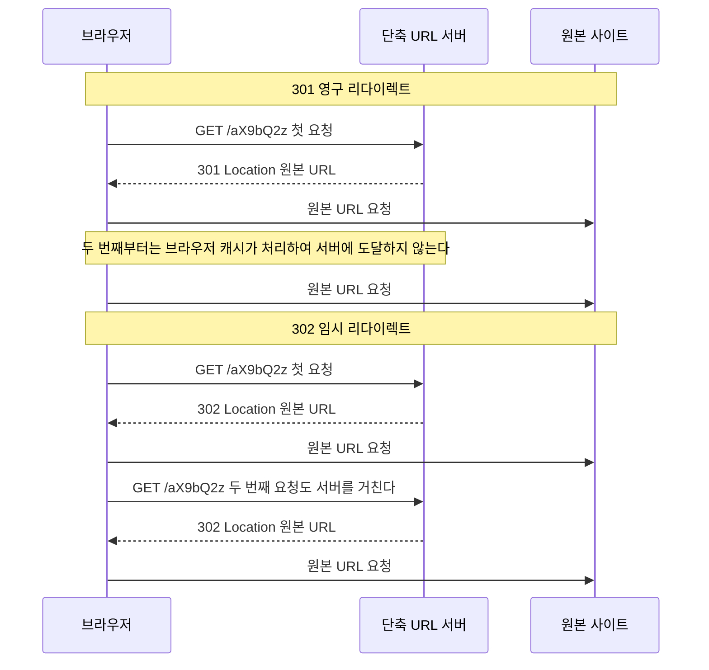
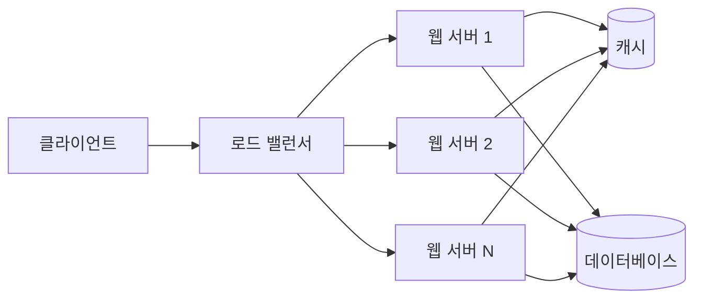
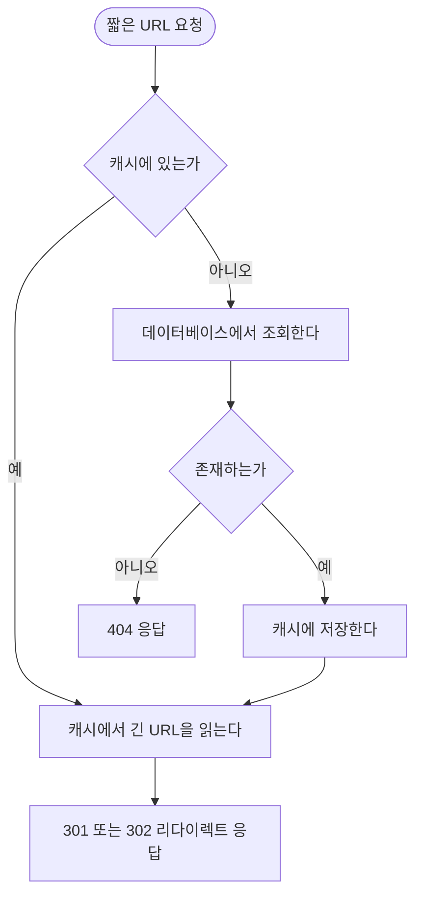
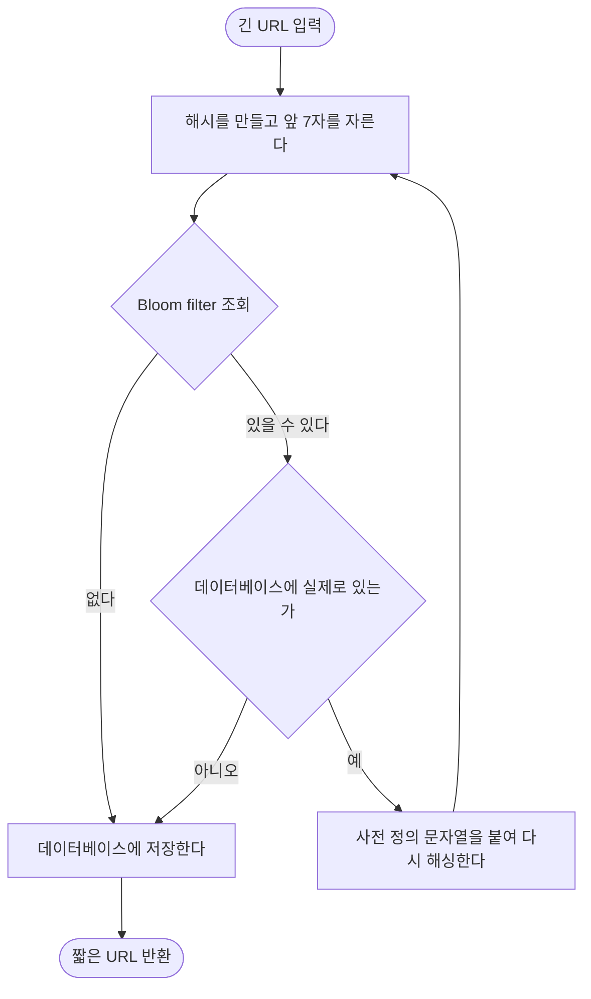

# URL 단축기 설계 블로그 글 작성 계획

> **For agentic workers:** REQUIRED SUB-SKILL: Use superpowers:subagent-driven-development (recommended) or superpowers:executing-plans to implement this plan task-by-task. Steps use checkbox (`- [ ]`) syntax for tracking.

**Goal:** 시스템 디자인 인터뷰 4단계 프레임워크로 URL 단축기를 설계하는 블로그 글 1편을 초안 상태(`docs/start/`)까지 완성하고 PR을 올린다.

**Architecture:** 글 하나(`index.md`)를 6개 장으로 나눠 장 단위로 작성하고 매번 커밋한다. 각 장을 쓴 직후 heading 번호와 Mermaid 문법을 스크립트로 검증해, 마지막에 한꺼번에 고치는 상황을 만들지 않는다. 썸네일은 본문이 확정된 뒤 생성한다.

**Tech Stack:** Markdown + YAML frontmatter, Mermaid(클라이언트 사이드 렌더링), Next.js 15 개발 서버(미리보기용), `generate-blog-image` 스킬(썸네일)

**설계 문서:** `docs/superpowers/specs/2026-07-30-url-shortener-blog-design.md`

**작업 브랜치:** `docs/system-design-url-shortener` (이미 생성되어 있고 spec 커밋이 올라가 있음)

---

## 사전 지식

이 글은 코드가 아니라 문서를 만든다. 따라서 "테스트"에 해당하는 것은 아래 세 가지 자동 검증이다.

1. **heading 번호 체계** — 이 블로그는 `# N. 제목` / `## N.M 제목` / `### N.M.K 제목` 형식을 강제한다 (`.claude/skills/content-heading-style/SKILL.md`)
2. **Mermaid 문법** — 노드 텍스트에 `<br/>` 같은 HTML 태그가 들어가면 파서 오류가 난다. 다이어그램은 브라우저에서 클라이언트 사이드로 렌더링되므로 빌드는 통과하고 화면만 깨진다. 즉 **grep 검사와 브라우저 확인이 유일한 안전장치다**
3. **UTF-8 인코딩** — 한글 콘텐츠 필수

Task 1에서 이 검증들을 스크립트로 만들어 두고, 이후 모든 Task에서 재사용한다.

## 파일 구조

| 파일 | 역할 |
|---|---|
| `docs/start/시스템-디자인-스터디-1-url-단축기-설계/index.md` | 글 본문. 이번 계획의 유일한 산출물 |
| `docs/start/시스템-디자인-스터디-1-url-단축기-설계/thumbnail.png` | 썸네일 이미지 (Task 8에서 생성) |
| `<scratchpad>/check-draft.sh` | 검증 스크립트. 저장소에 커밋하지 않는다 |

`<scratchpad>`는 `/private/tmp/claude-501/-Users-user-src-workspace-blogv2/61ff8fd5-77de-4363-bdd5-924f11985acc/scratchpad` 를 가리킨다.

**모든 명령은 `blog-v2.advenoh.pe.kr/` 디렉토리에서 실행한다.** 셸의 작업 디렉토리가 워크스페이스 루트로 초기화되는 경우가 있으므로, 검증 스크립트에 넘기는 글 경로는 절대 경로를 쓰거나 실행 전에 현재 위치를 확인한다.

검증 스크립트는 기존 글(`contents/web/mermaid-다이어그램-완벽-가이드/index.md`, Mermaid 13개 + 표 3개)로 동작을 확인해 두었다. heading 검사와 Mermaid 개수 검출이 정상이고, 표 구분선을 ASCII art로 오인하지 않는다.

`contents/`에는 아무것도 만들지 않는다. 발행은 별도 단계다.

---

## Task 1: 검증 스크립트와 글 뼈대 만들기

**Files:**
- Create: `<scratchpad>/check-draft.sh`
- Create: `docs/start/시스템-디자인-스터디-1-url-단축기-설계/index.md`

- [ ] **Step 1: 검증 스크립트를 작성한다**

아래 블록은 내부에 백틱 3개가 들어가므로 **백틱 4개 펜스**로 감싼다.

````bash
mkdir -p /private/tmp/claude-501/-Users-user-src-workspace-blogv2/61ff8fd5-77de-4363-bdd5-924f11985acc/scratchpad
cat > /private/tmp/claude-501/-Users-user-src-workspace-blogv2/61ff8fd5-77de-4363-bdd5-924f11985acc/scratchpad/check-draft.sh << 'SCRIPT'
#!/bin/bash
# 블로그 초안 검증: heading 번호, Mermaid 문법, 인코딩
# 사용법: bash check-draft.sh <index.md 경로>
set -uo pipefail

FILE="$1"
if [ ! -f "$FILE" ]; then echo "FAIL: 파일이 없다: $FILE"; exit 1; fi
FAIL=0

echo "=== 1. 인코딩 ==="
ENC=$(file -I "$FILE")
echo "$ENC"
case "$ENC" in
  *charset=utf-8*) echo "OK" ;;
  *) echo "FAIL: UTF-8이 아니다"; FAIL=1 ;;
esac

echo
echo "=== 2. heading 번호 체계 ==="
# 코드 펜스 내부는 제외하고 H1~H3만 뽑아 형식을 검사한다
BAD=$(awk '/^```/{f=!f; next} !f && /^#{1,3} /{print NR": "$0}' "$FILE" \
  | grep -vE ': (# [0-9]+\. |## [0-9]+\.[0-9]+ |### [0-9]+\.[0-9]+\.[0-9]+ )' || true)
if [ -n "$BAD" ]; then
  echo "FAIL: 형식에 맞지 않는 heading"
  echo "$BAD"
  FAIL=1
else
  echo "OK"
fi

echo
echo "=== 3. heading 목록 (번호 순서 육안 확인) ==="
awk '/^```/{f=!f; next} !f && /^#{1,3} /{print}' "$FILE"

echo
echo "=== 4. Mermaid 블록 개수 ==="
COUNT=$(grep -c '^```mermaid$' "$FILE" || true)
echo "발견: $COUNT 개"

echo
echo "=== 5. Mermaid 블록 내 HTML 태그 ==="
HTML=$(awk '/^```mermaid$/{f=1;next} f&&/^```$/{f=0;next} f' "$FILE" \
  | grep -nE '<[^>]+>' || true)
if [ -n "$HTML" ]; then
  echo "FAIL: Mermaid 노드에 HTML 태그가 있다 (파서 오류 발생)"
  echo "$HTML"
  FAIL=1
else
  echo "OK"
fi

echo
echo "=== 6. ASCII art 다이어그램 흔적 ==="
# 마크다운 표 구분선(|---|---|)은 걸리지 않도록 박스 문자만 본다
ART=$(grep -nE '^\s*\+[-+ ]{4,}|[─│┌┐└┘├┤┬┴┼]' "$FILE" || true)
if [ -n "$ART" ]; then
  echo "WARN: ASCII art로 보이는 줄 (Mermaid로 바꿔야 한다)"
  echo "$ART"
else
  echo "OK"
fi

echo
if [ "$FAIL" -eq 0 ]; then echo "=== 전체 통과 ==="; else echo "=== 실패 항목 있음 ==="; fi
exit "$FAIL"
SCRIPT
chmod +x /private/tmp/claude-501/-Users-user-src-workspace-blogv2/61ff8fd5-77de-4363-bdd5-924f11985acc/scratchpad/check-draft.sh
````

- [ ] **Step 2: 글 디렉토리와 frontmatter + 목차 뼈대를 만든다**

`docs/start/시스템-디자인-스터디-1-url-단축기-설계/index.md`를 아래 내용으로 만든다. 본문은 아직 비우고 heading만 넣는다.

```markdown
---
title: "시스템 디자인 스터디 1편: URL 단축기 설계"
description: "URL 단축기를 예제로 시스템 디자인 인터뷰 4단계 프레임워크를 따라가며 용량 추정, 인코딩 알고리즘, 충돌 처리, 캐시 전략을 정리한다."
date: 2026-07-30
update: 2026-07-30
tags:
  - 시스템 디자인
  - System Design
  - URL Shortener
  - URL 단축기
  - Base62
  - 해시
  - Bloom Filter
  - 캐시
  - 분산 시스템
  - 확장성
series: "시스템 디자인 스터디"
---

# 1. 개요

# 2. 1단계: 요구사항 명확화

## 2.1 기능 요구사항

## 2.2 비기능 요구사항

## 2.3 개략적 규모 추정

## 2.4 짧은 URL의 길이

# 3. 2단계: 개략적 설계

## 3.1 API 설계

## 3.2 리다이렉트 동작과 301 vs 302

## 3.3 데이터 모델

## 3.4 상위 아키텍처

# 4. 3단계: 상세 설계

## 4.1 접근 1: 해시 함수

## 4.2 충돌 처리

## 4.3 접근 2: 유일 ID와 Base62 변환

## 4.4 유일 ID 생성기가 어려운 이유

## 4.5 두 접근 비교

## 4.6 읽기 편중과 캐시

## 4.7 전체 흐름 정리

# 5. 4단계: 마무리 - 더 고민할 것들

# 6. 마무리

# 7. 참고자료
```

주의: 제목에 `:`가 들어가므로 frontmatter의 `title`은 반드시 큰따옴표로 감싼다.

- [ ] **Step 3: 검증 스크립트를 돌려 뼈대가 통과하는지 확인한다**

```bash
bash /private/tmp/claude-501/-Users-user-src-workspace-blogv2/61ff8fd5-77de-4363-bdd5-924f11985acc/scratchpad/check-draft.sh \
  "docs/start/시스템-디자인-스터디-1-url-단축기-설계/index.md"
```

기대 결과:
- 인코딩 `charset=utf-8` → OK
- heading 번호 체계 → OK
- heading 목록에 `# 1.` ~ `# 7.`과 `## 2.1` ~ `## 4.7`이 순서대로 출력
- Mermaid 블록 개수 → 0 개 (아직 안 넣었으므로 정상)
- HTML 태그 → OK
- 마지막 줄 `=== 전체 통과 ===`

- [ ] **Step 4: 커밋**

```bash
git add "docs/start/시스템-디자인-스터디-1-url-단축기-설계/index.md"
git commit -m "docs: URL 단축기 설계 글 뼈대 추가

* frontmatter와 6개 장 목차 작성"
```

---

## Task 2: 1장 개요, 2장 요구사항 명확화

**Files:**
- Modify: `docs/start/시스템-디자인-스터디-1-url-단축기-설계/index.md`

- [ ] **Step 1: 1장 개요를 쓴다**

`# 1. 개요` 바로 위에 인용문 도입부를 넣는다. 기존 MQTT 시리즈와 같은 형식이다.

```markdown
> 시스템 디자인을 제대로 공부해보고 싶어서 스터디한 내용을 시리즈로 정리한다.
> 첫 주제는 URL 단축기다. 이 글의 목적은 URL 단축기 자체보다, 처음 보는 시스템을 어떤 순서로 설계해 나가는지 그 방법을 익히는 데 있다.
```

**특정 회사나 업무 맥락은 절대 언급하지 않는다.**

`# 1. 개요` 본문에는 다음을 담는다.

- 썸네일 이미지 자리 (Task 8에서 파일을 만든 뒤 채운다. 지금은 넣지 않는다)
- URL 단축기가 무엇인지 한두 문장 (bit.ly 같은 서비스)
- 이 글이 따라갈 **4단계 프레임워크** 소개: ① 요구사항 명확화 → ② 개략적 설계 → ③ 상세 설계 → ④ 마무리
- 이 틀을 시리즈의 다음 주제에도 그대로 쓸 것이라는 예고
- 이 글은 설계까지만 다루고 구현 코드는 넣지 않는다는 범위 선언

- [ ] **Step 2: 2.1 기능 요구사항, 2.2 비기능 요구사항을 쓴다**

2.1에 담을 내용:
- 긴 URL을 받아 짧은 URL을 돌려준다
- 짧은 URL로 접근하면 원본 URL로 리다이렉트한다
- **범위 밖 명시**: 커스텀 별칭, 만료(TTL), 클릭 분석은 이 글에서 다루지 않는다. 요구사항을 좁히는 것 자체가 설계의 첫 단계라는 점을 짚는다

2.2에 담을 내용:
- 고가용성 — 리다이렉트가 죽으면 이미 뿌려진 모든 링크가 죽는다
- 낮은 지연 — 리다이렉트는 사용자 경로 한가운데 있다
- 추측 불가능한 짧은 URL — 순차적으로 증가하는 값이 그대로 노출되면 남의 링크를 훑을 수 있다

- [ ] **Step 3: 2.3 개략적 규모 추정을 쓴다**

가정과 계산 과정을 글로 설명한 뒤 아래 표로 정리한다. **숫자는 이 표 그대로 쓴다.**

```markdown
| 항목 | 계산 | 결과 |
|---|---|---|
| 쓰기 QPS | 1억 건 / 86,400초 | 약 1,160 |
| 읽기 QPS | 쓰기의 10배 | 약 11,600 |
| 10년 누적 건수 | 1억 x 365 x 10 | 3,650억 건 |
| 10년 저장 용량 | 3,650억 x 100바이트 | 약 36.5TB |
```

가정: 하루 1억 건 단축 요청, 읽기 대 쓰기 비율 10 대 1, 레코드 하나당 평균 100바이트.

추정이 왜 필요한지도 한 문단 넣는다 — 이 숫자가 이후 "캐시가 필요한가", "짧은 URL을 몇 자로 할까" 같은 결정의 근거가 된다.

- [ ] **Step 4: 2.4 짧은 URL의 길이를 쓴다**

- 짧은 URL에 쓸 수 있는 문자는 `0-9`, `a-z`, `A-Z` 총 62개
- n자면 표현 가능한 개수는 62^n
- `62^6 = 약 568억` → 3,650억 건을 못 담는다
- `62^7 = 약 3.5조` → 충분하다
- 따라서 **7자**

- [ ] **Step 5: 검증 스크립트를 돌린다**

```bash
bash /private/tmp/claude-501/-Users-user-src-workspace-blogv2/61ff8fd5-77de-4363-bdd5-924f11985acc/scratchpad/check-draft.sh \
  "docs/start/시스템-디자인-스터디-1-url-단축기-설계/index.md"
```

기대 결과: `=== 전체 통과 ===`. heading을 새로 추가하지 않았으므로 heading 목록은 Task 1과 동일해야 한다.

- [ ] **Step 6: 커밋**

```bash
git add "docs/start/시스템-디자인-스터디-1-url-단축기-설계/index.md"
git commit -m "docs: URL 단축기 글 1-2장 작성

* 개요와 4단계 프레임워크 소개
* 기능/비기능 요구사항, 규모 추정, 짧은 URL 길이 역산"
```

---

## Task 3: 3장 개략적 설계

**Files:**
- Modify: `docs/start/시스템-디자인-스터디-1-url-단축기-설계/index.md`

- [ ] **Step 1: 3.1 API 설계를 쓴다**

엔드포인트 두 개를 표나 코드 블록으로 정리한다.

```markdown
- `POST /api/v1/data/shorten` — 본문에 `longUrl`을 받아 짧은 URL을 반환
- `GET /{shortUrl}` — 원본 URL로 리다이렉트 응답
```

REST 설계 관례를 짧게 언급해도 좋다.

- [ ] **Step 2: 3.2에 301 vs 302 설명과 시퀀스 다이어그램을 넣는다**

이 절은 **분량을 넉넉히 쓴다.** 이 글의 첫 번째 트레이드오프다.

설명 순서: 리다이렉트가 무엇인지 → 301과 302의 차이 → 브라우저 캐싱이 만드는 결과 → 무엇을 우선하느냐의 문제.

다이어그램은 아래를 그대로 넣는다.

````markdown

````

이어서 비교 표를 넣는다.

```markdown
| 항목 | 301 영구 리다이렉트 | 302 임시 리다이렉트 |
|---|---|---|
| 브라우저 캐싱 | 캐싱한다 | 캐싱하지 않는다 |
| 서버 부하 | 첫 요청 이후 거의 없다 | 요청마다 발생한다 |
| 클릭 분석 | 불가능하다 | 가능하다 |
| 적합한 상황 | 트래픽 절감이 최우선일 때 | 클릭 추적이 필요할 때 |
```

- [ ] **Step 3: 3.3 데이터 모델을 쓴다**

- 개념적으로는 "짧은 URL → 긴 URL" 해시 테이블이다
- 하지만 인메모리 해시 테이블은 데이터가 커지면 감당이 안 되고 재시작 시 사라진다
- 실제로는 관계형 테이블: `id`, `shortURL`, `longURL`. `shortURL`에 유일 인덱스를 건다

- [ ] **Step 4: 3.4에 상위 아키텍처 다이어그램을 넣는다**

````markdown

````

웹 서버가 무상태라서 수평 확장이 가능하다는 점, 상태는 전부 캐시와 DB에 있다는 점을 한 문단으로 설명한다.

- [ ] **Step 5: 검증 스크립트를 돌린다**

```bash
bash /private/tmp/claude-501/-Users-user-src-workspace-blogv2/61ff8fd5-77de-4363-bdd5-924f11985acc/scratchpad/check-draft.sh \
  "docs/start/시스템-디자인-스터디-1-url-단축기-설계/index.md"
```

기대 결과:
- `Mermaid 블록 개수: 2 개`
- `Mermaid 블록 내 HTML 태그` → OK
- `=== 전체 통과 ===`

- [ ] **Step 6: 커밋**

```bash
git add "docs/start/시스템-디자인-스터디-1-url-단축기-설계/index.md"
git commit -m "docs: URL 단축기 글 3장 개략적 설계 작성

* API 설계, 301 vs 302 트레이드오프와 시퀀스 다이어그램
* 데이터 모델, 상위 아키텍처 다이어그램"
```

---

## Task 4: 4장 상세 설계 - 인코딩 방식 (4.1 ~ 4.5)

**Files:**
- Modify: `docs/start/시스템-디자인-스터디-1-url-단축기-설계/index.md`

- [ ] **Step 1: 4.1 접근 1 해시 함수를 쓴다**

- 긴 URL을 CRC32, MD5, SHA-1 같은 해시 함수에 넣고 결과의 **앞 7자만 잘라 쓴다**
- 단순하고 빠르며 길이가 항상 고정된다
- 그런데 해시 결과를 자르는 순간 서로 다른 URL이 같은 7자를 만들 수 있다 → 충돌

- [ ] **Step 2: 4.2 충돌 처리를 쓴다**

이 절도 **분량을 넉넉히 쓴다.** 두 번째 깊이 지점이다.

담을 내용:
1. 충돌을 어떻게 알아채는가 — 새 키를 만들 때마다 "이미 있는 키인가" 확인해야 한다
2. 충돌 시 대응 — 사전 정의된 문자열을 긴 URL 뒤에 붙여 다시 해싱하고 재시도한다
3. **진짜 비용은 확인 그 자체** — 쓰기마다 DB 조회가 한 번씩 붙는다. 초당 1,160건 쓰기면 초당 1,160번의 조회가 추가된다
4. Bloom filter로 이 조회를 줄일 수 있다 — 3~4문장으로만 다룬다
   - 키가 이미 있는지 대략 답해주는 확률적 자료구조다
   - "없다"는 답은 확실하므로 DB를 볼 필요가 없다
   - "있을 수도 있다"는 답일 때만 DB를 확인하면 된다
   - **비트 배열, 해시 함수 개수, 오탐률 계산 같은 내부 원리는 다루지 않는다**
5. 규모가 작으면 Bloom filter까지 갈 것 없이 `shortURL` 컬럼에 유일 인덱스를 걸고 위반 시 재시도하면 충분하다는 점도 덧붙인다

- [ ] **Step 3: 4.3 접근 2 유일 ID와 Base62 변환을 쓴다**

- 유일한 ID를 하나 발급받아 그것을 62진법 문자열로 바꾼다
- ID가 유일하니 변환 결과도 유일하다 → **충돌이 구조적으로 발생하지 않는다**
- 의사코드를 넣는다. 실행 가능한 Go 코드는 넣지 않는다

````markdown
```text
BASE62 = "0123456789abcdefghijklmnopqrstuvwxyzABCDEFGHIJKLMNOPQRSTUVWXYZ"

function toBase62(id):
    if id == 0:
        return "0"

    result = ""
    while id > 0:
        result = BASE62[id % 62] + result
        id = id / 62          # 정수 나눗셈
    return result
```
````

- [ ] **Step 4: 4.4 유일 ID 생성기가 어려운 이유를 쓴다**

이 절도 **분량을 넉넉히 쓴다.** 세 번째 깊이 지점이다.

- DB의 auto increment를 쓰면 되지 않나? → 단일 DB를 전제한 이야기다. DB를 여러 대로 나누는 순간 번호가 겹친다
- 대안 세 가지를 각각 장단점과 함께
  - **Snowflake**: 타임스탬프 + 노드 ID + 시퀀스를 조합해 각 서버가 독립적으로 생성. 조율이 필요 없지만 시계 동기화 문제가 있다
  - **Redis INCR**: 중앙에서 원자적으로 번호를 발급. 단순하지만 Redis가 단일 장애점이 된다
  - **키 생성 서비스(KGS)**: 미리 키를 대량 만들어 두고 나눠준다. 발급이 빠르지만 별도 서비스를 운영해야 하고 미사용 키 관리가 필요하다
- 순차 ID를 그대로 쓰면 다음 짧은 URL을 추측할 수 있다는 점(2.2의 비기능 요구사항과 충돌)도 짚는다

- [ ] **Step 5: 4.5 두 접근 비교 표를 넣는다**

```markdown
| 항목 | 해시 방식 | 유일 ID + Base62 |
|---|---|---|
| 짧은 URL 길이 | 항상 고정 (앞 7자 절단) | ID가 커지면 함께 길어진다 |
| 충돌 | 발생한다 | 발생하지 않는다 |
| 충돌 처리 | 필요하다 (재시도, Bloom filter) | 필요 없다 |
| 유일 ID 생성기 | 필요 없다 | 필요하다 |
| 예측 가능성 | 낮다 | 순차 ID면 다음 값을 추측할 수 있다 |
```

표 아래에 한 문단 — **Bloom filter는 URL 단축기의 필수 부품이 아니라 해시 방식을 고른 결과로 생긴 문제를 메우는 장치다.** 앞 단계의 선택이 뒤 단계의 필요를 만든다는 점이 이 표의 핵심이다.

- [ ] **Step 6: 검증 스크립트를 돌린다**

```bash
bash /private/tmp/claude-501/-Users-user-src-workspace-blogv2/61ff8fd5-77de-4363-bdd5-924f11985acc/scratchpad/check-draft.sh \
  "docs/start/시스템-디자인-스터디-1-url-단축기-설계/index.md"
```

기대 결과: Mermaid 블록 개수는 여전히 `2 개`, `=== 전체 통과 ===`.

- [ ] **Step 7: 커밋**

```bash
git add "docs/start/시스템-디자인-스터디-1-url-단축기-설계/index.md"
git commit -m "docs: URL 단축기 글 4.1-4.5 인코딩 방식 작성

* 해시 방식과 충돌 처리, Bloom filter를 선택지로 소개
* 유일 ID + Base62 방식과 분산 ID 생성기 트레이드오프
* 두 접근 비교표"
```

---

## Task 5: 4장 상세 설계 - 캐시와 전체 흐름 (4.6 ~ 4.7)

**Files:**
- Modify: `docs/start/시스템-디자인-스터디-1-url-단축기-설계/index.md`

- [ ] **Step 1: 4.6 읽기 편중과 캐시를 쓴다**

- 2.3에서 읽기가 쓰기의 10배로 나왔다. 리다이렉트는 같은 인기 링크에 반복해서 몰린다
- cache-aside 방식: 캐시를 먼저 보고, 없으면 DB에서 읽어 캐시에 채운 뒤 응답한다
- 캐시에 없는 키를 계속 조회하는 경우(존재하지 않는 짧은 URL)도 있으니 404 처리 경로를 분리한다

다이어그램을 넣는다.

````markdown

````

- [ ] **Step 2: 4.7 전체 흐름 정리를 쓴다**

단축 흐름만 다이어그램으로 그린다. 리다이렉트 흐름은 4.6 다이어그램이 이미 담고 있으므로 **다시 그리지 않고 문장으로 참조만 한다.**

아래 다이어그램은 해시 방식을 골랐을 때의 흐름이다. 그 전제를 본문에 한 줄로 밝힌다.

````markdown

````

- [ ] **Step 3: 검증 스크립트를 돌린다**

```bash
bash /private/tmp/claude-501/-Users-user-src-workspace-blogv2/61ff8fd5-77de-4363-bdd5-924f11985acc/scratchpad/check-draft.sh \
  "docs/start/시스템-디자인-스터디-1-url-단축기-설계/index.md"
```

기대 결과: `Mermaid 블록 개수: 4 개`, HTML 태그 OK, `=== 전체 통과 ===`.

- [ ] **Step 4: 커밋**

```bash
git add "docs/start/시스템-디자인-스터디-1-url-단축기-설계/index.md"
git commit -m "docs: URL 단축기 글 4.6-4.7 캐시와 전체 흐름 작성

* cache-aside 리다이렉트 흐름 다이어그램
* 해시 방식 기준 단축 흐름 다이어그램"
```

---

## Task 6: 5장 확장 주제, 6장 마무리, 7장 참고자료

**Files:**
- Modify: `docs/start/시스템-디자인-스터디-1-url-단축기-설계/index.md`

- [ ] **Step 1: 5장을 목록 수준으로 쓴다**

**여기서 깊게 들어가면 안 된다.** 각 항목 1~2줄이다. 6개 항목을 모두 넣는다.

- **DB 샤딩과 복제** — 36.5TB는 한 대로 감당하기 어렵다. 짧은 URL을 기준으로 나누고 읽기는 복제본으로 분산한다
- **만료와 정리** — 영구 보관이 필요 없다면 TTL을 두고 만료된 레코드를 주기적으로 지운다
- **커스텀 별칭** — 사용자가 원하는 문자열을 지정하는 기능. 별칭 선점 문제와 예약어 처리가 따라온다
- **rate limiting과 악성 URL 차단** — 단축 API 남용을 막고, 피싱 링크를 걸러내는 검사가 필요하다
- **클릭 분석** — 302를 골랐다면 리다이렉트마다 이벤트를 남겨 별도 파이프라인으로 집계한다
- **멀티 리전과 CDN** — 지연을 줄이려면 사용자와 가까운 곳에서 리다이렉트를 처리해야 한다

각 항목이 "이 글에서 다루지 않았지만 실제로는 고민해야 하는 것"이라는 점을 5장 도입부에 한 문장으로 밝힌다.

- [ ] **Step 2: 6장 마무리를 쓴다**

이 글에서 짚은 핵심 결정 세 가지를 요약한다.

1. 301이냐 302냐 — 서버 부하와 클릭 분석 중 무엇을 택할 것인가
2. 해시냐 유일 ID + Base62냐 — 충돌을 감수하고 처리할 것인가, 애초에 만들지 않을 것인가
3. 분산 환경에서 유일 ID를 어떻게 만들 것인가 — 조율 없는 생성과 중앙 발급의 트레이드오프

설계에서 정답보다 중요한 건 "무엇을 포기했는지 아는 것"이라는 취지로 마무리한다.

- [ ] **Step 3: 7장 참고자료를 쓴다**

```markdown
- 『가상 면접 사례로 배우는 대규모 시스템 설계 기초』 8장 URL 단축기 설계
- [Bloom filter - Wikipedia](https://en.wikipedia.org/wiki/Bloom_filter)
- [A RESTful Tutorial](https://www.restapitutorial.com/)
```

- [ ] **Step 4: 검증 스크립트를 돌린다**

```bash
bash /private/tmp/claude-501/-Users-user-src-workspace-blogv2/61ff8fd5-77de-4363-bdd5-924f11985acc/scratchpad/check-draft.sh \
  "docs/start/시스템-디자인-스터디-1-url-단축기-설계/index.md"
```

기대 결과: `=== 전체 통과 ===`, Mermaid 4개.

- [ ] **Step 5: 커밋**

```bash
git add "docs/start/시스템-디자인-스터디-1-url-단축기-설계/index.md"
git commit -m "docs: URL 단축기 글 5-7장 작성

* 확장 고려사항 6가지를 목록 수준으로 정리
* 마무리와 참고자료"
```

---

## Task 7: 전체 검토와 브라우저 미리보기

**Files:**
- Modify: `docs/start/시스템-디자인-스터디-1-url-단축기-설계/index.md` (수정이 필요한 경우)

- [ ] **Step 1: 글 전체를 처음부터 읽으며 아래를 확인한다**

- 3.2, 4.2, 4.4 세 절이 다른 절보다 확실히 깊게 쓰였는가 (spec의 깊이 배분 방침)
- 5장이 목록 수준을 넘어 길어지지 않았는가
- 각 절이 "왜 이 결정이 필요한가 → 선택지 → 트레이드오프 → 선택"으로 이어지는가. 결론만 나열된 절이 있으면 고친다
- 2.3의 숫자(1,160 / 11,600 / 3,650억 / 36.5TB / 7자)가 본문 다른 곳의 서술과 어긋나지 않는가
- 회사나 업무 관련 언급이 없는가
- 실행 가능한 Go 코드가 섞여 들어가지 않았는가 (의사코드 1개만 허용)

- [ ] **Step 2: 개발 서버로 Mermaid 렌더링을 눈으로 확인한다**

Mermaid는 브라우저에서 렌더링되므로 문법 오류가 있어도 빌드는 통과한다. **반드시 눈으로 봐야 한다.** 개발 서버는 `contents/`만 읽으므로 임시로 복사해서 확인한 뒤 지운다.

```bash
mkdir -p "contents/system-design"
cp -r "docs/start/시스템-디자인-스터디-1-url-단축기-설계" "contents/system-design/"
npm run dev
```

브라우저에서 해당 글 페이지를 열고 확인할 것:
- 다이어그램 4개가 모두 그림으로 렌더링되는가 (코드 블록 그대로 보이거나 빨간 오류 박스가 뜨면 실패)
- 표 3개가 표로 렌더링되는가
- 목차(TOC)에 `1.` ~ `7.` 장이 순서대로 나오는가

- [ ] **Step 3: 임시 복사본을 지우고 저장소가 깨끗한지 확인한다**

개발 서버를 종료한 뒤 실행한다.

```bash
rm -rf "contents/system-design"
git status --short
```

기대 결과: `contents/` 아래 항목이 하나도 나오지 않아야 한다. `docs/start/...` 관련 변경만 있거나 아무 변경도 없어야 한다.

**이 단계를 건너뛰면 초안이 발행 디렉토리에 섞여 들어간다.**

- [ ] **Step 4: 수정한 내용이 있으면 검증 후 커밋한다**

```bash
bash /private/tmp/claude-501/-Users-user-src-workspace-blogv2/61ff8fd5-77de-4363-bdd5-924f11985acc/scratchpad/check-draft.sh \
  "docs/start/시스템-디자인-스터디-1-url-단축기-설계/index.md"
git add "docs/start/시스템-디자인-스터디-1-url-단축기-설계/index.md"
git commit -m "docs: URL 단축기 글 전체 검토 반영"
```

수정할 게 없었다면 커밋하지 않고 넘어간다.

---

## Task 8: 썸네일 생성과 삽입

**Files:**
- Create: `docs/start/시스템-디자인-스터디-1-url-단축기-설계/thumbnail.png`
- Modify: `docs/start/시스템-디자인-스터디-1-url-단축기-설계/index.md`

- [ ] **Step 1: 썸네일을 생성한다**

`generate-blog-image` 스킬을 글 경로와 함께 호출한다.

```
/generate-blog-image docs/start/시스템-디자인-스터디-1-url-단축기-설계
```

이 스킬은 OpenAI API를 쓴다. API 키가 없어 실패하면 **여기서 멈추고 사용자에게 알린다.** 임의의 대체 이미지를 만들지 않는다.

생성된 이미지를 글 디렉토리에 `thumbnail.png`로 저장한다.

- [ ] **Step 2: 1장 개요에 이미지를 삽입한다**

`# 1. 개요` 바로 아래에 넣는다. 기존 글과 같은 형식이다.

```html

```

- [ ] **Step 3: 파일이 제자리에 있는지 확인한다**

```bash
ls -la "docs/start/시스템-디자인-스터디-1-url-단축기-설계/"
grep -n "thumbnail.png" "docs/start/시스템-디자인-스터디-1-url-단축기-설계/index.md"
```

기대 결과: `thumbnail.png`가 존재하고, `index.md`에서 정확히 1번 참조된다.

- [ ] **Step 4: 커밋**

```bash
git add "docs/start/시스템-디자인-스터디-1-url-단축기-설계/"
git commit -m "docs: URL 단축기 글 썸네일 추가"
```

---

## Task 9: PR 생성

- [ ] **Step 1: 브랜치를 푸시한다**

```bash
git push -u origin docs/system-design-url-shortener
```

- [ ] **Step 2: PR을 만든다**

`gh` CLI와 HEREDOC을 쓴다. **MCP GitHub 도구를 쓰지 않는다** (body의 `\n`이 리터럴로 렌더링된다). **`--reviewer` 플래그를 쓰지 않는다.**

```bash
gh pr create --title "docs: 시스템 디자인 스터디 1편 URL 단축기 설계 글 추가" --body "$(cat <<'EOF'
## Summary
- 시스템 디자인 스터디 시리즈를 시작하며 첫 주제로 URL 단축기 설계를 다룬 글 초안 추가
- 시스템 디자인 인터뷰 4단계 프레임워크(요구사항 명확화 → 개략적 설계 → 상세 설계 → 마무리)를 따라 전개
- 깊이는 301 vs 302, 충돌 처리, 분산 유일 ID 세 지점에 집중하고 확장 주제는 목록 수준으로 정리
- 설계 문서와 작성 계획도 함께 포함

## 범위
- 설계 글 1편 완결. 실행 가능한 구현 코드는 이번 범위 밖 (필요하면 별도 작업으로 진행)
- 영문판(index_en.md)과 슬라이드 데크는 만들지 않음
- 발행 시 카테고리 `system-design`이 새로 생김

## Test plan
- [ ] heading 번호 체계가 `# N.` / `## N.M` 형식을 따르는지 확인
- [ ] Mermaid 다이어그램 4개가 브라우저에서 정상 렌더링되는지 확인
- [ ] 표 3개가 정상 렌더링되는지 확인
- [ ] UTF-8 인코딩 확인
- [ ] `contents/`에 초안이 섞여 들어가지 않았는지 확인
EOF
)"
```

- [ ] **Step 3: PR이 생성됐는지 확인한다**

```bash
gh pr view --json number,title,url
```

---

## 이후 단계 (이 계획의 범위 밖)

PR이 머지된 뒤의 절차는 블로그의 기존 워크플로우를 따른다.

1. 리뷰 완료된 글을 `docs/start/` → `docs/merge_ready/`로 이동
2. 발행 시 `docs/merge_ready/` → `contents/system-design/`으로 이동하고 MergeReady 라벨 추가
3. 구현편(Go)을 쓸지 여부는 이 글을 쓰고 난 뒤 별도로 논의한다
