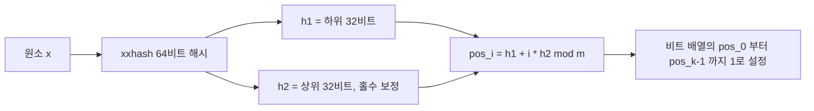
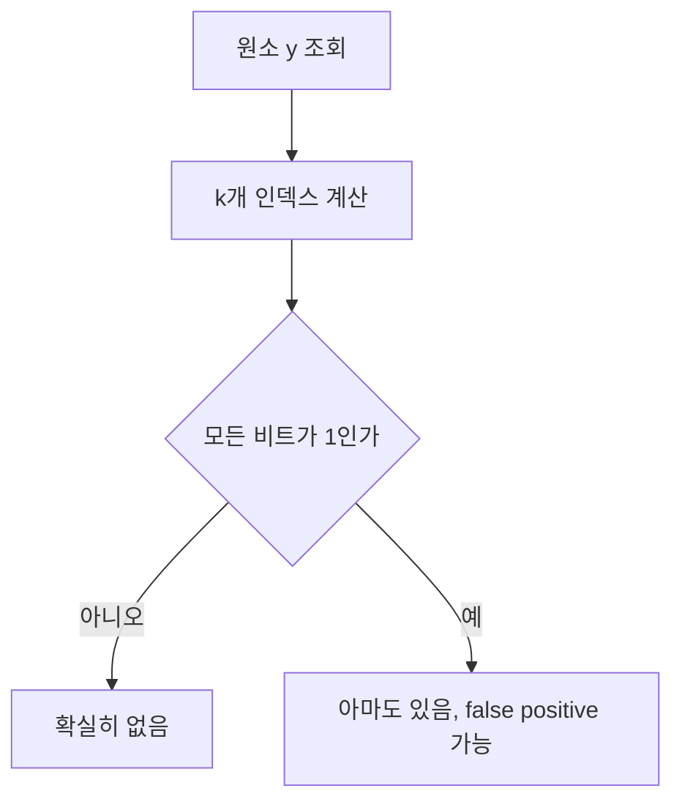

# Bloom Filter 블로그 글 Implementation Plan

> **For agentic workers:** REQUIRED SUB-SKILL: Use superpowers:subagent-driven-development (recommended) or superpowers:executing-plans to implement this plan task-by-task. Steps use checkbox (`- [ ]`) syntax for tracking.

**Goal:** Bloom Filter를 개념부터 Go 직접 구현, 라이브러리 비교, 실무 사용처까지 다루는 단일 장문 블로그 글과 그 샘플 코드를 작성한다.

**Architecture:** `tutorials-go`에 `bloomfilter` 패키지를 TDD로 먼저 구현하고 테스트·벤치마크를 통과시킨다. 거기서 나온 실측 수치를 `blog-v2`의 초안 본문 표에 그대로 옮긴다. 코드가 먼저, 글이 나중이다.

**Tech Stack:** Go 1.26, `github.com/cespare/xxhash/v2`, `github.com/bits-and-blooms/bloom/v3`, `github.com/stretchr/testify/assert`

**Spec:** `docs/superpowers/specs/2026-07-30-bloom-filter-blog-design.md`

---

## 저장소 두 곳

| 별칭 | 절대 경로 |
|------|----------|
| GO_REPO | `/Users/frankoh/src/workspace_blog/tutorials-go` |
| BLOG_REPO | `/Users/frankoh/src/workspace_blog/blog-v2.advenoh.pe.kr` |

BLOG_REPO는 이미 `docs/bloom-filter` 브랜치에 있다. GO_REPO는 Task 1에서 브랜치를 만든다.

## File Structure

### GO_REPO — `golang/data-structure/bloom-filter/` (package `bloomfilter`)

| 파일 | 책임 |
|------|------|
| `bloom_filter.go` | 자료구조 정의, 파라미터 계산, Add/Contains, EstimatedFPR |
| `bloom_filter_test.go` | 단위 테스트 + false positive rate 실측 |
| `library_test.go` | `bits-and-blooms/bloom/v3` 사용 예제 (본문 5.1절 코드) |
| `bloom_filter_bench_test.go` | 직접 구현 vs 라이브러리 벤치마크 |
| `memory_test.go` | 본문 3.3·3.4절 표의 근거가 될 메모리 측정 |

`memory_test.go`는 스펙의 파일 목록에 없던 추가분이다. 본문의 메모리 비교 표를 추정값이 아닌 실측값으로 채우기 위해 넣는다.

파라미터 계산 함수를 별도 파일로 나누지 않는다. 전체가 150줄 남짓이고 서로 밀접하게 묶여 있어 한 파일에서 읽는 편이 낫다. 라이브러리 예제와 벤치마크는 직접 구현과 책임이 다르므로 파일을 분리한다.

### BLOG_REPO

| 파일 | 책임 |
|------|------|
| `docs/start/bloom-filter-완벽-가이드-개념부터-go-구현까지/index.md` | 글 본문 (신규) |

`cover.png`, `index_en.md`, `slides.html`은 이번 범위에서 제외한다.

---

## Task 1: 패키지 생성과 파라미터 계산 함수

**Files:**
- Create: `GO_REPO/golang/data-structure/bloom-filter/bloom_filter.go`
- Test: `GO_REPO/golang/data-structure/bloom-filter/bloom_filter_test.go`

- [ ] **Step 1: 브랜치 생성**

```bash
cd /Users/frankoh/src/workspace_blog/tutorials-go
git checkout master
git pull
git checkout -b feat/bloom-filter
```

- [ ] **Step 2: 실패하는 테스트 작성**

`golang/data-structure/bloom-filter/bloom_filter_test.go` 생성:

```go
package bloomfilter

import (
	"testing"

	"github.com/stretchr/testify/assert"
)

func TestOptimalM(t *testing.T) {
	// n=100만, p=0.01 -> m = -n*ln(p) / (ln2)^2 = 9,585,059 비트 (약 1.14MiB)
	assert.Equal(t, uint64(9585059), OptimalM(1_000_000, 0.01))

	// p가 작아질수록 더 많은 비트가 필요하다
	assert.Greater(t, OptimalM(1_000_000, 0.001), OptimalM(1_000_000, 0.01))
}

func TestOptimalK(t *testing.T) {
	// k = (m/n)*ln2 = 9.585059 * 0.693147 = 6.64 -> 반올림 7
	assert.Equal(t, uint64(7), OptimalK(9585059, 1_000_000))

	// 최소 1개는 보장한다
	assert.Equal(t, uint64(1), OptimalK(10, 1_000_000))
}
```

- [ ] **Step 3: 테스트가 실패하는지 확인**

```bash
cd /Users/frankoh/src/workspace_blog/tutorials-go
go test ./golang/data-structure/bloom-filter/... -run 'TestOptimal' -v
```

Expected: FAIL — `undefined: OptimalM`, `undefined: OptimalK`

- [ ] **Step 4: 최소 구현 작성**

`golang/data-structure/bloom-filter/bloom_filter.go` 생성:

```go
// Package bloomfilter는 Bloom Filter를 비트 배열과 이중 해싱으로 직접 구현한 예제이다.
package bloomfilter

import "math"

// OptimalM은 원소 수 n과 목표 false positive 확률 p에 대해 필요한 비트 수를 계산한다.
//
//	m = -n * ln(p) / (ln2)^2
func OptimalM(n uint64, p float64) uint64 {
	if n == 0 {
		return 1
	}
	if p <= 0 || p >= 1 {
		p = 0.01
	}
	m := -float64(n) * math.Log(p) / (math.Ln2 * math.Ln2)
	return uint64(math.Ceil(m))
}

// OptimalK는 비트 수 m과 원소 수 n에 대해 최적의 해시 함수 개수를 계산한다.
//
//	k = (m/n) * ln2
func OptimalK(m, n uint64) uint64 {
	if n == 0 {
		return 1
	}
	k := (float64(m) / float64(n)) * math.Ln2
	if k < 1 {
		return 1
	}
	return uint64(math.Round(k))
}
```

- [ ] **Step 5: 테스트 통과 확인**

```bash
go test ./golang/data-structure/bloom-filter/... -run 'TestOptimal' -v
```

Expected: PASS — `TestOptimalM`, `TestOptimalK` 둘 다 ok

- [ ] **Step 6: 커밋**

```bash
git add golang/data-structure/bloom-filter/
git commit -m "feat: Bloom Filter 최적 파라미터 계산 함수 추가

* OptimalM: 목표 false positive 확률에 필요한 비트 수 계산
* OptimalK: 최적 해시 함수 개수 계산"
```

---

## Task 2: 생성자와 비트 배열

**Files:**
- Modify: `GO_REPO/golang/data-structure/bloom-filter/bloom_filter.go`
- Test: `GO_REPO/golang/data-structure/bloom-filter/bloom_filter_test.go`

- [ ] **Step 1: 실패하는 테스트 추가**

`bloom_filter_test.go` 끝에 추가:

```go
func TestNew(t *testing.T) {
	f := New(128, 3)

	assert.Equal(t, uint64(128), f.Cap())
	assert.Equal(t, uint64(3), f.K())
	assert.Equal(t, uint64(0), f.Count())
	// 128비트는 uint64 워드 2개
	assert.Len(t, f.bits, 2)
}

func TestNew_비트수가_64의_배수가_아닌_경우(t *testing.T) {
	f := New(100, 3)

	// 100비트를 담으려면 워드 2개가 필요하다
	assert.Len(t, f.bits, 2)
}

func TestNewWithEstimates(t *testing.T) {
	f := NewWithEstimates(1_000_000, 0.01)

	assert.Equal(t, uint64(9585059), f.Cap())
	assert.Equal(t, uint64(7), f.K())
}
```

- [ ] **Step 2: 테스트가 실패하는지 확인**

```bash
go test ./golang/data-structure/bloom-filter/... -run 'TestNew' -v
```

Expected: FAIL — `undefined: New`, `undefined: NewWithEstimates`

- [ ] **Step 3: 구현 추가**

`bloom_filter.go`의 `import "math"` 바로 아래에 타입과 생성자를 추가한다:

```go
// BloomFilter는 비트 배열 기반의 확률적 집합이다.
// Contains가 false를 반환하면 원소는 확실히 없고,
// true를 반환하면 있을 수도 있다(false positive).
type BloomFilter struct {
	bits []uint64 // 비트 배열을 uint64 워드 단위로 저장
	m    uint64   // 전체 비트 수
	k    uint64   // 해시 함수 개수
	n    uint64   // 추가된 원소 수
}

// New는 비트 수 m과 해시 함수 개수 k를 직접 지정해 생성한다.
func New(m, k uint64) *BloomFilter {
	if m == 0 {
		m = 1
	}
	if k == 0 {
		k = 1
	}
	return &BloomFilter{
		bits: make([]uint64, (m+63)/64), // 올림 나눗셈
		m:    m,
		k:    k,
	}
}

// NewWithEstimates는 예상 원소 수 n과 목표 false positive 확률 p로부터
// m과 k를 자동 계산해 생성한다.
func NewWithEstimates(n uint64, p float64) *BloomFilter {
	m := OptimalM(n, p)
	return New(m, OptimalK(m, n))
}

// Cap은 전체 비트 수 m을 반환한다.
func (f *BloomFilter) Cap() uint64 { return f.m }

// K는 해시 함수 개수를 반환한다.
func (f *BloomFilter) K() uint64 { return f.k }

// Count는 지금까지 추가된 원소 수를 반환한다.
func (f *BloomFilter) Count() uint64 { return f.n }
```

- [ ] **Step 4: 테스트 통과 확인**

```bash
go test ./golang/data-structure/bloom-filter/... -run 'TestNew' -v
```

Expected: PASS — `TestNew`, `TestNew_비트수가_64의_배수가_아닌_경우`, `TestNewWithEstimates`

- [ ] **Step 5: 커밋**

```bash
git add golang/data-structure/bloom-filter/
git commit -m "feat: BloomFilter 타입과 생성자 추가

* uint64 워드 배열로 비트 배열 표현
* NewWithEstimates로 m, k 자동 계산"
```

---

## Task 3: Add와 Contains

**Files:**
- Modify: `GO_REPO/golang/data-structure/bloom-filter/bloom_filter.go`
- Test: `GO_REPO/golang/data-structure/bloom-filter/bloom_filter_test.go`

- [ ] **Step 1: 의존성 추가**

```bash
cd /Users/frankoh/src/workspace_blog/tutorials-go
go get github.com/cespare/xxhash/v2
```

Expected: `go: upgraded ...` 또는 이미 존재한다는 메시지. `go.mod`에서 `xxhash`가 indirect 블록 밖으로 나오면 성공이다.

- [ ] **Step 2: 실패하는 테스트 추가**

먼저 `bloom_filter_test.go` 상단의 import 블록을 아래로 교체한다:

```go
import (
	"fmt"
	"testing"

	"github.com/stretchr/testify/assert"
)
```

이어서 파일 끝에 추가:

```go
func TestBloomFilter_AddContains(t *testing.T) {
	f := NewWithEstimates(1000, 0.01)

	f.Add([]byte("hello"))
	f.Add([]byte("world"))

	assert.True(t, f.Contains([]byte("hello")))
	assert.True(t, f.Contains([]byte("world")))
	assert.Equal(t, uint64(2), f.Count())
}

func TestBloomFilter_빈_필터는_아무것도_포함하지_않는다(t *testing.T) {
	f := NewWithEstimates(1000, 0.01)

	assert.False(t, f.Contains([]byte("hello")))
}

// Bloom Filter의 핵심 보장: false negative는 절대 발생하지 않는다.
func TestBloomFilter_FalseNegative가_없다(t *testing.T) {
	const n = 100_000
	f := NewWithEstimates(n, 0.01)

	for i := 0; i < n; i++ {
		f.Add([]byte(fmt.Sprintf("member-%d", i)))
	}

	for i := 0; i < n; i++ {
		key := fmt.Sprintf("member-%d", i)
		assert.True(t, f.Contains([]byte(key)), "추가한 원소 %s 가 없다고 나왔다", key)
	}
}
```

- [ ] **Step 3: 테스트가 실패하는지 확인**

```bash
go test ./golang/data-structure/bloom-filter/... -run 'TestBloomFilter' -v
```

Expected: FAIL — `f.Add undefined`, `f.Contains undefined`

- [ ] **Step 4: 구현 추가**

`bloom_filter.go`의 import를 아래로 바꾼다:

```go
import (
	"math"

	"github.com/cespare/xxhash/v2"
)
```

파일 끝에 추가:

```go
// hashes는 xxhash 64비트 결과 하나를 상·하위 32비트로 쪼개
// 이중 해싱(Kirsch-Mitzenmacher)에 쓸 두 값을 만든다.
// 해시 함수를 k개 따로 두지 않아도 통계적으로 동등한 분포를 얻는다.
//
// h2를 홀수로 보정하는 것은 h2 == 0을 막기 위해서다.
// h2가 0이면 k개 인덱스가 모두 h1 한 곳으로 겹쳐 사실상 k=1이 된다.
// 확률은 2^-32로 극히 낮지만 비용이 없어 방어해 둔다.
//
// 짝수 h2 자체는 해롭지 않다. k개 인덱스가 겹치려면 m/gcd(h2, m) < k 여야 하는데,
// m이 수백만이고 k가 한 자릿수인 실제 범위에서는 일어나지 않는다.
func (f *BloomFilter) hashes(data []byte) (uint64, uint64) {
	sum := xxhash.Sum64(data)
	// h1은 하위 32비트만 쓴다. m이 2^32를 넘으면 pos <= k*(2^32-1) 이라
	// 배열 뒤쪽에 도달할 수 없다. m > 2^32는 512MiB 이상이라 이 예제 범위 밖이다.
	h1 := sum & 0xffffffff
	h2 := (sum >> 32) | 1
	return h1, h2
}

// Add는 원소를 필터에 추가한다.
func (f *BloomFilter) Add(data []byte) {
	h1, h2 := f.hashes(data)
	for i := uint64(0); i < f.k; i++ {
		pos := (h1 + i*h2) % f.m
		f.bits[pos/64] |= 1 << (pos % 64)
	}
	f.n++
}

// Contains는 원소가 있을 수 있는지 확인한다.
// false면 확실히 없고, true면 있을 수도 있다.
func (f *BloomFilter) Contains(data []byte) bool {
	h1, h2 := f.hashes(data)
	for i := uint64(0); i < f.k; i++ {
		pos := (h1 + i*h2) % f.m
		if f.bits[pos/64]&(1<<(pos%64)) == 0 {
			return false
		}
	}
	return true
}
```

인덱스를 슬라이스에 모으지 않고 루프에서 바로 처리한다. 힙 할당이 0이어야 Task 5의 벤치마크 `B/op` 비교가 의미를 가진다.

- [ ] **Step 5: 테스트 통과 확인**

```bash
go test ./golang/data-structure/bloom-filter/... -run 'TestBloomFilter' -v
```

Expected: PASS — 3개 테스트 모두 ok

- [ ] **Step 6: 커밋**

```bash
git add golang/data-structure/bloom-filter/ go.mod go.sum
git commit -m "feat: Bloom Filter Add/Contains 구현

* xxhash 64비트를 상하위로 쪼개는 이중 해싱 기법 적용
* h2를 홀수로 보정해 h2가 0일 때 인덱스가 한 곳으로 뭉치는 문제 방지
* 힙 할당 없이 비트 연산만으로 처리"
```

---

## Task 4: EstimatedFPR과 false positive rate 실측

**Files:**
- Modify: `GO_REPO/golang/data-structure/bloom-filter/bloom_filter.go`
- Test: `GO_REPO/golang/data-structure/bloom-filter/bloom_filter_test.go`

- [ ] **Step 1: 실패하는 테스트 추가**

`bloom_filter_test.go` 끝에 추가:

```go
func TestBloomFilter_EstimatedFPR(t *testing.T) {
	f := NewWithEstimates(100_000, 0.01)

	// 비어 있으면 false positive가 날 수 없다
	assert.Equal(t, 0.0, f.EstimatedFPR())

	for i := 0; i < 50_000; i++ {
		f.Add([]byte(fmt.Sprintf("key-%d", i)))
	}
	half := f.EstimatedFPR()

	for i := 50_000; i < 100_000; i++ {
		f.Add([]byte(fmt.Sprintf("key-%d", i)))
	}
	full := f.EstimatedFPR()

	// 원소가 늘수록 false positive 확률은 커진다
	assert.Greater(t, full, half)
	// 설계 용량을 채웠을 때 목표치 1% 근처여야 한다.
	// 이 값은 난수가 개입하지 않는 순수 계산이므로 델타를 넉넉히 잡을 이유가 없다.
	assert.InDelta(t, 0.01, full, 0.001)
}

// 이론값과 실측값이 맞는지 확인한다. 본문 4.5절의 근거가 되는 테스트다.
func TestBloomFilter_실측_FalsePositiveRate(t *testing.T) {
	const (
		n      = 100_000   // 설계 용량
		trials = 1_000_000 // 넣지 않은 원소로 조회할 횟수
		target = 0.01      // 목표 false positive 확률
	)

	f := NewWithEstimates(n, target)
	for i := 0; i < n; i++ {
		f.Add([]byte(fmt.Sprintf("member-%d", i)))
	}

	falsePositives := 0
	for i := 0; i < trials; i++ {
		// "member-" 접두사와 겹치지 않는 키만 조회한다
		if f.Contains([]byte(fmt.Sprintf("stranger-%d", i))) {
			falsePositives++
		}
	}

	actual := float64(falsePositives) / float64(trials)
	t.Logf("m=%d k=%d n=%d", f.Cap(), f.K(), f.Count())
	t.Logf("false positive 건수=%d/%d", falsePositives, trials)
	t.Logf("이론 FPR=%.5f 실측 FPR=%.5f", f.EstimatedFPR(), actual)

	// 이론값과 실측값의 차이는 통계적 오차 범위 안에서만 나타나야 한다.
	// trials=100만, p=0.01이면 이항분포 표준편차가 약 99.5건(FPR로 1e-4)이므로
	// 델타 0.001은 약 10σ에 해당한다. 게다가 xxhash는 시드가 없고 입력이 고정되어
	// 매 실행 결과가 동일하므로 이 정도로 좁혀도 간헐적 실패가 나지 않는다.
	assert.InDelta(t, target, actual, 0.001)
}
```

- [ ] **Step 2: 테스트가 실패하는지 확인**

```bash
go test ./golang/data-structure/bloom-filter/... -run 'EstimatedFPR' -v
```

Expected: FAIL — `f.EstimatedFPR undefined`

- [ ] **Step 3: 구현 추가**

`bloom_filter.go` 끝에 추가:

```go
// EstimatedFPR은 현재 원소 수를 기준으로 false positive 확률의 이론값을 계산한다.
//
//	p = (1 - e^(-kn/m))^k
func (f *BloomFilter) EstimatedFPR() float64 {
	exponent := -float64(f.k) * float64(f.n) / float64(f.m)
	return math.Pow(1-math.Exp(exponent), float64(f.k))
}
```

- [ ] **Step 4: 테스트 통과 확인**

```bash
go test ./golang/data-structure/bloom-filter/... -run 'FalsePositive|EstimatedFPR' -v
```

Expected: PASS. 로그에 `이론 FPR=0.0xxx 실측 FPR=0.0xxx` 두 줄이 찍힌다.

- [ ] **Step 5: 실측값 기록**

위 `-v` 출력의 `m=`, `k=`, `이론 FPR=`, `실측 FPR=` 값을 그대로 메모해 둔다. Task 8에서 본문 4.5절 표에 쓴다. **추정하지 말고 출력된 숫자를 쓴다.**

- [ ] **Step 6: 전체 테스트 통과 확인**

```bash
go test ./golang/data-structure/bloom-filter/... -v
```

Expected: PASS — `ok  github.com/kenshin579/tutorials-go/golang/data-structure/bloom-filter`

- [ ] **Step 7: 커밋**

```bash
git add golang/data-structure/bloom-filter/
git commit -m "feat: EstimatedFPR 추가와 false positive rate 실측 테스트

* 이론 FPR 공식 p = (1 - e^(-kn/m))^k 구현
* 100만 회 조회로 실측 FPR이 목표치 범위 안인지 검증"
```

---

## Task 5: 라이브러리 예제와 벤치마크

**Files:**
- Create: `GO_REPO/golang/data-structure/bloom-filter/library_test.go`
- Create: `GO_REPO/golang/data-structure/bloom-filter/bloom_filter_bench_test.go`

- [ ] **Step 1: 라이브러리 의존성 추가**

```bash
cd /Users/frankoh/src/workspace_blog/tutorials-go
go get github.com/bits-and-blooms/bloom/v3
```

Expected: `go: added github.com/bits-and-blooms/bloom/v3 vX.Y.Z`

- [ ] **Step 2: 라이브러리 사용 예제 작성**

`library_test.go` 생성. 이 파일이 본문 5.1절에 그대로 실린다:

```go
package bloomfilter

import (
	"fmt"
	"testing"

	"github.com/bits-and-blooms/bloom/v3"
	"github.com/stretchr/testify/assert"
)

// bits-and-blooms/bloom 기본 사용법
func TestLibrary_기본_사용법(t *testing.T) {
	// 100만 개를 1% false positive 확률로 담는 필터
	filter := bloom.NewWithEstimates(1_000_000, 0.01)

	filter.Add([]byte("hello"))
	filter.AddString("world")

	assert.True(t, filter.Test([]byte("hello")))
	assert.True(t, filter.TestString("world"))
	assert.False(t, filter.TestString("없는-키"))

	// 직접 구현과 같은 m, k가 나오는지 확인한다
	assert.Equal(t, uint(9585059), filter.Cap())
	assert.Equal(t, uint(7), filter.K())
}

// TestAndAdd는 조회와 추가를 한 번에 처리한다. 중복 제거에 유용하다.
func TestLibrary_TestAndAdd로_중복_제거(t *testing.T) {
	filter := bloom.NewWithEstimates(1000, 0.01)

	urls := []string{"a.com", "b.com", "a.com", "c.com", "b.com"}
	unique := 0
	for _, u := range urls {
		if !filter.TestAndAddString(u) {
			unique++
		}
	}

	assert.Equal(t, 3, unique)
}

// 직접 구현과 라이브러리가 같은 원소에 대해 같은 판정을 내리는지 확인한다.
func TestLibrary_직접_구현과_동일하게_동작한다(t *testing.T) {
	mine := NewWithEstimates(10_000, 0.01)
	lib := bloom.NewWithEstimates(10_000, 0.01)

	for i := 0; i < 10_000; i++ {
		key := []byte(fmt.Sprintf("key-%d", i))
		mine.Add(key)
		lib.Add(key)
	}

	// 넣은 원소는 양쪽 모두 true여야 한다 (false negative 없음)
	for i := 0; i < 10_000; i++ {
		key := []byte(fmt.Sprintf("key-%d", i))
		assert.True(t, mine.Contains(key))
		assert.True(t, lib.Test(key))
	}
}
```

- [ ] **Step 3: 라이브러리 예제 테스트 실행**

```bash
go test ./golang/data-structure/bloom-filter/... -run 'TestLibrary' -v
```

Expected: PASS. 만약 `filter.Cap()`이 `9585059`가 아니면 라이브러리의 반올림 방식이 다른 것이므로, 실제 출력값으로 단언문을 고치고 그 차이를 본문 5.1절에 한 줄로 언급한다.

- [ ] **Step 4: 벤치마크 작성**

`bloom_filter_bench_test.go` 생성:

```go
package bloomfilter

import (
	"fmt"
	"testing"

	"github.com/bits-and-blooms/bloom/v3"
)

const benchN = 1_000_000

func benchKeys(count int) [][]byte {
	keys := make([][]byte, count)
	for i := range keys {
		keys[i] = []byte(fmt.Sprintf("key-%d", i))
	}
	return keys
}

func BenchmarkAdd_직접구현(b *testing.B) {
	keys := benchKeys(1000)
	f := NewWithEstimates(benchN, 0.01)

	b.ResetTimer()
	b.ReportAllocs()
	for i := 0; i < b.N; i++ {
		f.Add(keys[i%len(keys)])
	}
}

func BenchmarkAdd_라이브러리(b *testing.B) {
	keys := benchKeys(1000)
	f := bloom.NewWithEstimates(benchN, 0.01)

	b.ResetTimer()
	b.ReportAllocs()
	for i := 0; i < b.N; i++ {
		f.Add(keys[i%len(keys)])
	}
}

func BenchmarkContains_직접구현(b *testing.B) {
	keys := benchKeys(1000)
	f := NewWithEstimates(benchN, 0.01)
	for _, k := range keys {
		f.Add(k)
	}

	b.ResetTimer()
	b.ReportAllocs()
	for i := 0; i < b.N; i++ {
		f.Contains(keys[i%len(keys)])
	}
}

func BenchmarkContains_라이브러리(b *testing.B) {
	keys := benchKeys(1000)
	f := bloom.NewWithEstimates(benchN, 0.01)
	for _, k := range keys {
		f.Add(k)
	}

	b.ResetTimer()
	b.ReportAllocs()
	for i := 0; i < b.N; i++ {
		f.Test(keys[i%len(keys)])
	}
}
```

- [ ] **Step 5: 벤치마크 실행하고 결과 기록**

```bash
go test ./golang/data-structure/bloom-filter/... -bench . -benchmem -run '^$'
```

Expected: 4개 벤치마크의 `ns/op`, `B/op`, `allocs/op`가 출력된다. 직접 구현의 `allocs/op`는 `0`이어야 한다. 0이 아니면 `hashes`나 `Add`에서 할당이 생긴 것이므로 원인을 찾아 고친다.

출력 전체를 그대로 메모해 둔다. Task 8에서 본문 5.2절 표에 쓴다.

- [ ] **Step 6: 본문 표의 근거가 될 측정 테스트 작성**

본문 3.3·3.4절 표를 추정값으로 채우지 않기 위한 측정 테스트다. `memory_test.go` 생성:

```go
package bloomfilter

import (
	"fmt"
	"runtime"
	"testing"
)

// makeURL은 약 54바이트짜리 URL을 만든다.
func makeURL(i int) string {
	return fmt.Sprintf("https://example.com/page/%09d/detail-view-section", i)
}

// 본문 3.3절 표의 근거. 목표 FPR별로 필요한 비트 수와 메모리를 출력한다.
func TestTable_목표FPR별_메모리(t *testing.T) {
	const n = 1_000_000

	t.Log("목표p | m(비트) | 메모리 | k | 원소당비트")
	for _, p := range []float64{0.1, 0.01, 0.001, 0.0001} {
		m := OptimalM(n, p)
		k := OptimalK(m, n)
		bytes := (m + 63) / 64 * 8 // 실제 할당되는 워드 배열 크기
		t.Logf("%g | %d | %.2f MiB | %d | %.2f",
			p, m, float64(bytes)/(1024*1024), k, float64(m)/float64(n))
	}
}

// 본문 3.4절 표의 근거.
// map은 키 문자열을 계속 들고 있어야 하지만 Bloom Filter는 원소를 저장하지 않는다.
// 이 차이가 그대로 메모리 차이가 되므로, 키 생성까지 측정 구간 안에 둔다.
func TestMemory_map과_BloomFilter_비교(t *testing.T) {
	const n = 1_000_000

	mapBytes := measureHeap(func() any {
		m := make(map[string]struct{})
		for i := 0; i < n; i++ {
			m[makeURL(i)] = struct{}{}
		}
		return m
	})

	bloomBytes := measureHeap(func() any {
		f := NewWithEstimates(n, 0.01)
		for i := 0; i < n; i++ {
			f.Add([]byte(makeURL(i)))
		}
		return f
	})

	t.Logf("URL 길이: %d바이트, 원소 수: %d", len(makeURL(0)), n)
	t.Logf("map[string]struct{} 힙 사용량: %.2f MiB", float64(mapBytes)/(1024*1024))
	t.Logf("Bloom Filter(p=0.01) 힙 사용량: %.2f MiB", float64(bloomBytes)/(1024*1024))
	t.Logf("배수: %.1f배", float64(mapBytes)/float64(bloomBytes))
}

// measureHeap는 build가 만든 자료구조가 차지하는 힙 증가량을 잰다.
// 반환값을 KeepAlive로 살려두어야 GC가 측정 전에 회수하지 않는다.
func measureHeap(build func() any) uint64 {
	runtime.GC()
	var before, after runtime.MemStats
	runtime.ReadMemStats(&before)

	held := build()

	runtime.GC()
	runtime.ReadMemStats(&after)
	runtime.KeepAlive(held)

	return after.HeapAlloc - before.HeapAlloc
}
```

- [ ] **Step 7: 측정 테스트 실행하고 결과 기록**

```bash
go test ./golang/data-structure/bloom-filter/... -run 'TestTable|TestMemory' -v
```

Expected: PASS. `TestTable_목표FPR별_메모리`에서 4줄, `TestMemory_map과_BloomFilter_비교`에서 4줄이 로그로 출력된다.

두 테스트의 로그 출력을 그대로 메모해 둔다. Task 7에서 본문 3.3·3.4절 표에 쓴다. **공식으로 손계산하지 말고 출력된 숫자를 쓴다.**

- [ ] **Step 8: 전체 테스트**

```bash
go test ./golang/data-structure/bloom-filter/... -v
go build ./...
```

Expected: PASS — 모든 테스트 ok, 저장소 전체 빌드 성공

> **`go mod tidy`를 실행하지 말 것.** Task 3에서 확인된 사항이다. 이 저장소에서 `go mod tidy`를 돌리면 이번 작업과 무관한 다른 패키지들의 direct/indirect 구분이 대거 재정렬되고 `go.sum`에서 수십 줄이 사라진다. `go get`이 남긴 변경만 유지하고, `go.mod` diff가 이번 작업과 관련된 줄만 담고 있는지 `git diff go.mod go.sum`으로 직접 확인하라. 무관한 변경이 섞여 있으면 되돌린 뒤 필요한 줄만 수동으로 편집한다.

- [ ] **Step 9: 커밋**

```bash
git add golang/data-structure/bloom-filter/ go.mod go.sum
git commit -m "feat: bits-and-blooms/bloom 사용 예제와 벤치마크 추가

* 라이브러리 기본 사용법과 TestAndAdd 중복 제거 예제
* 직접 구현과 라이브러리의 Add/Contains 성능 비교 벤치마크
* 목표 FPR별 메모리와 map 대비 메모리 사용량 측정 테스트"
```

---

## 확정된 측정값 (Task 1~5 완료 시점)

아래는 `tutorials-go` `feat/bloom-filter` 브랜치에서 실제로 실행해 얻은 값이다. 리뷰어가 독립 재실행으로 교차 검증했다. **Task 7~10에서 본문 표를 채울 때 이 값을 쓴다. 다시 계산하거나 추정하지 않는다.** 환경은 Apple M1 / Go 1.26 / darwin-arm64다.

### 3.3절 — 목표 FPR별 메모리 (n=100만)

```
목표p | m(비트) | 메모리 | k | 원소당비트
0.1 | 4792530 | 0.57 MiB | 3 | 4.79
0.01 | 9585059 | 1.14 MiB | 7 | 9.59
0.001 | 14377588 | 1.71 MiB | 10 | 14.38
0.0001 | 19170117 | 2.29 MiB | 13 | 19.17
```

### 3.4절 — map 대비 메모리 (원소 100만 개)

```
Bloom Filter(p=0.01): 1.15 MiB (원소 크기와 무관)
map[uint64]struct{} (8바이트): 36.06 MiB, 배수=31.2배
map[string]struct{} (15바이트): 68.49 MiB, 배수=59.3배
map[string]struct{} (54바이트): 114.29 MiB, 배수=99.0배
map[string]struct{} (200바이트): 251.59 MiB, 배수=217.9배
```

### 4.5절 — false positive rate 실측

```
m=958506 k=7 n=100000
false positive 건수=10008/1000000
이론 FPR=0.01004 실측 FPR=0.01001
```

### 5.1절 — 두 구현의 오답 대상 비교

```
false positive: 직접 구현=965 라이브러리=1016 둘 다=7 (조회 100000회)
```

### 5.2절 — 벤치마크

```
BenchmarkAdd_직접구현-8                43154478   28.51 ns/op   0 B/op   0 allocs/op
BenchmarkAdd_라이브러리-8              25961148   47.05 ns/op   0 B/op   0 allocs/op
BenchmarkContains_직접구현-8           45509133   26.66 ns/op   0 B/op   0 allocs/op
BenchmarkContains_라이브러리-8         27284404   44.42 ns/op   0 B/op   0 allocs/op
BenchmarkContains_직접구현_없는키-8     51180073   22.87 ns/op   0 B/op   0 allocs/op
BenchmarkContains_라이브러리_없는키-8    23989464   51.02 ns/op   0 B/op   0 allocs/op
```

### 5.2.1절 — miss 경로 조사 (본문에 인용할 보조 수치)

리포지토리에 남기지 않은 일회성 실험 결과다. 5.2.1절 서술의 근거로만 쓴다.

| 항목 | 값 |
|------|-----|
| 평균 프로브 수 (직접 구현) | 히트 7.0000 / 미스 2.1230 |
| 평균 프로브 수 (라이브러리) | 히트 7.0000 / 미스 2.0450 |
| 비트 밀도 | 약 0.518 (이론 기대 미스 프로브 2.054) |
| 키를 종료 지점 순으로 정렬 시 (라이브러리) | 51.0 → 32.2 ns |
| 키를 종료 지점 순으로 정렬 시 (직접 구현) | 23.3 → 21.8 ns |
| 분기 없는 변형 (라이브러리) | 히트 44.7 / 미스 44.5 ns |
| 해시만의 비용 (54바이트 입력) | xxhash 14.2 ns / murmur3-128 30.0 ns |
| murmur3 + 우리 프로빙 | 페널티 +19.8 ns |
| xxhash + 라이브러리 프로빙 | 페널티 +0.8 ns |

미해결로 남긴 것: 예측 가능 경로 비용을 맞춰도 murmur3 쪽 페널티가 지연 시간 스케일링 예측보다 약 2.5배 크다. macOS에서 분기 예측 실패 카운터를 잴 수 없어 확인하지 못했다.

---

## Task 6: tutorials-go PR 생성

**Files:** 없음 (git 작업만)

- [ ] **Step 1: 전체 저장소 테스트에 영향이 없는지 확인**

```bash
cd /Users/frankoh/src/workspace_blog/tutorials-go
go build ./...
go vet ./golang/data-structure/bloom-filter/...
```

Expected: 출력 없음 (성공)

- [ ] **Step 2: push와 PR 생성**

```bash
git push -u origin feat/bloom-filter
gh pr create --base master --title "feat: Bloom Filter 직접 구현과 라이브러리 비교 예제 추가" --body "$(cat <<'EOF'
## 개요

`blog-v2.advenoh.pe.kr`의 Bloom Filter 글에 쓰일 샘플 코드입니다.

## 변경 사항

* `golang/data-structure/bloom-filter/` 패키지 추가
* 비트 배열과 이중 해싱(Kirsch-Mitzenmacher)으로 Bloom Filter 직접 구현
* 최적 파라미터 계산(`OptimalM`, `OptimalK`)과 이론 FPR 계산(`EstimatedFPR`)
* 100만 회 조회로 실측 false positive rate 검증하는 테스트
* `bits-and-blooms/bloom/v3` 사용 예제와 성능 비교 벤치마크

## 테스트

    go test ./golang/data-structure/bloom-filter/... -v
    go test ./golang/data-structure/bloom-filter/... -bench . -benchmem -run '^$'

🤖 Generated with [Claude Code](https://claude.com/claude-code)

https://claude.ai/code/session_01ECYScWgZhRSGEbKvWr8Yt4
EOF
)"
```

Expected: PR URL 출력

- [ ] **Step 3: PR 번호 기록**

Task 8에서 본문의 GitHub 링크를 확정할 때 참고한다. 코드 링크는 머지 후 `master` 기준 경로를 쓴다:
`https://github.com/kenshin579/tutorials-go/tree/master/golang/data-structure/bloom-filter`

---

## Task 7: 블로그 초안 1~3장

**Files:**
- Create: `BLOG_REPO/docs/start/bloom-filter-완벽-가이드-개념부터-go-구현까지/index.md`

- [ ] **Step 1: 브랜치 확인**

```bash
cd /Users/frankoh/src/workspace_blog/blog-v2.advenoh.pe.kr
git branch --show-current
```

Expected: `docs/bloom-filter`

- [ ] **Step 2: frontmatter와 1~2장 작성**

파일을 heredoc으로 생성해 UTF-8을 보장한다:

```bash
mkdir -p "docs/start/bloom-filter-완벽-가이드-개념부터-go-구현까지"
```

`index.md`의 frontmatter는 정확히 아래와 같이 쓴다. `category`는 넣지 않는다:

```markdown
---
title: "Bloom Filter 완벽 가이드 - 개념부터 Go 구현까지"
description: "Bloom Filter의 동작 원리와 false positive 확률 계산을 살펴보고, Go로 직접 구현한 뒤 라이브러리와 성능을 비교하며 실무 활용 사례까지 정리합니다"
date: 2026-07-31
update: 2026-07-31
tags:
  - bloom-filter
  - golang
  - data-structure
  - algorithm
  - probabilistic-data-structure
  - hash
  - false-positive
  - redis
  - cassandra
  - 블룸필터
  - 자료구조
  - 확률적자료구조
---
```

이어서 1~2장을 쓴다. 서술체는 `~이다`로 통일하고, 섹션 번호는 스펙의 목차를 그대로 따른다.

**1장에서 다룰 것**
- 1.1: Bloom Filter는 "이 원소가 집합에 있는가"만 답하는 확률적 자료구조다. 원소 자체를 저장하지 않고 비트만 남긴다.
- 1.2: 방문한 URL을 `map[string]struct{}`로 관리하면 키 문자열을 전부 들고 있어야 해서 원소 수에 URL 길이를 곱한 만큼 메모리가 든다. Bloom Filter는 1% 오차를 허용하는 대가로 원소당 10비트 미만으로 같은 판정을 한다. 구체적인 수치는 3.4절에서 실측한다 — **여기서는 배수를 단정하지 말고 3.4절로 넘긴다.**
- 1.3: false positive(없는데 있다고 함)는 발생하지만 false negative(있는데 없다고 함)는 절대 발생하지 않는다. 이 비대칭이 Bloom Filter를 쓸 수 있는 자리와 쓰면 안 되는 자리를 가른다.

**2장에서 다룰 것**
- 2.1: m비트짜리 비트 배열과 k개의 해시 함수. 각 해시는 원소를 0~m-1 사이 인덱스로 매핑한다.
- 2.2: Add는 k개 인덱스의 비트를 모두 1로 세운다. 아래 Mermaid 다이어그램을 넣는다.
- 2.3: Contains는 k개 인덱스를 확인해 하나라도 0이면 없음을 확신한다. 전부 1이면 "아마도 있음"이다. 아래 Mermaid 다이어그램을 넣는다.
- 2.4: 비트가 여러 원소에 공유되므로 특정 원소의 비트를 0으로 되돌리면 다른 원소까지 지워진다. 그래서 삭제가 불가능하다. (해결책은 7장에서)

2.2절 Mermaid (노드 텍스트에 HTML 태그를 쓰지 않는다):

````markdown

````

2.3절 Mermaid:

````markdown

````

- [ ] **Step 3: 3장 작성**

**3.1**: false positive 확률 공식과 유도 요약

```
p = (1 - e^(-kn/m))^k
```

비트 하나가 특정 해시로 세워지지 않을 확률이 `1 - 1/m`이고, kn번 반복하면 `(1 - 1/m)^(kn) ≈ e^(-kn/m)`이 0으로 남을 확률이다. 따라서 1일 확률은 `1 - e^(-kn/m)`이고, k개가 모두 1일 확률이 위 식이다.

**3.2**: 위 식을 k에 대해 최소화하면 아래가 나온다.

```
k = (m/n) * ln2
m = -n * ln(p) / (ln2)^2
```

Task 1의 `OptimalM`, `OptimalK` 코드를 여기서 인용한다.

**3.3**: n=100만 기준 표. **Task 5 Step 7의 `TestTable_목표FPR별_메모리` 로그 출력을 그대로 옮긴다.** 열은 아래와 같고, 값은 손계산하지 않는다.

| 목표 p | m (비트) | 메모리 | k | 원소당 비트 |
|--------|---------|-------|---|-----------|

표 아래에 두 줄 덧붙인다.
- 목표 FPR을 10배 낮출 때마다 원소당 약 4.8비트가 더 필요하고, 메모리는 선형으로만 늘어난다.
- 표의 메모리는 비트 배열(`(m+63)/64` 워드)만 계산한 값이다. 실제 힙은 Go 할당기의 사이즈 클래스 반올림 때문에 수 KB 더 크다 — 그래서 3.4절의 실측 힙과 소수점 둘째 자리가 어긋날 수 있다.

**3.4**: `map`과의 메모리 비교. **Task 5의 `TestMemory_map과_BloomFilter_비교` 로그 출력을 그대로 옮긴다.** 이 테스트는 키 크기를 바꿔가며 재므로 표가 여러 행이 된다.

| 키 | `map` | Bloom Filter (p=0.01) | 배수 |
|----|-------|----------------------|------|
| `uint64` (8바이트) | (로그) | (로그) | (로그) |
| 15바이트 문자열 | (로그) | 〃 | (로그) |
| 54바이트 URL | (로그) | 〃 | (로그) |
| 200바이트 문자열 | (로그) | 〃 | (로그) |

**표 아래에 아래 단서를 반드시 함께 싣는다.** Task 5 코드 리뷰에서 실측으로 확인된 내용이고, 이게 빠지면 "99배"라는 숫자가 독자를 오도한다.

- **배수는 키 크기가 만드는 값이다.** Bloom Filter 쪽은 원소가 무엇이든 1.15 MiB로 고정이므로, 배수는 사실상 `원소 하나의 저장 비용 ÷ 원소당 비트(9.59)`다. 위 표가 그 의존성을 그대로 보여준다.
- **배수는 세 가지를 포기하고 산 값이다.** `map`은 정확하고, 원소를 다시 꺼낼 수 있고, 삭제할 수 있다. Bloom Filter는 1%를 틀리고, 원소를 꺼낼 수 없고, 삭제할 수 없다. (6.5절에서 다시 짚는다)
- **중간 선택지가 있다.** URL 문자열을 그대로 담지 말고 64비트 해시만 담으면 `map[uint64]struct{}`가 된다 — 위 표의 첫 행이다. 정확도를 사실상 유지하면서 상당량을 아낀다. Bloom Filter가 유일한 대안인 것처럼 읽히면 안 된다.
- **Bloom Filter도 원소를 만들 때는 메모리를 쓴다.** 위 측정에서 Bloom 쪽도 URL 100만 개를 실제로 만들었고, 필터에 넣은 뒤 GC가 회수했을 뿐이다. "원소를 메모리에 올리지 않아도 된다"가 아니라 "**보관**하지 않아도 된다"이다.
- **측정 방법.** `runtime.MemStats.HeapAlloc` 델타를 GC 이후에 읽어 살아있는 객체만 잰다. Apple M1 / Go 1.26 기준이며, Go의 map 구현이나 아키텍처가 다르면 `map` 쪽 수치는 달라진다.

- [ ] **Step 4: 인코딩 확인**

```bash
file -I "docs/start/bloom-filter-완벽-가이드-개념부터-go-구현까지/index.md"
```

Expected: `text/plain; charset=utf-8`

- [ ] **Step 5: 커밋**

```bash
git add "docs/start/bloom-filter-완벽-가이드-개념부터-go-구현까지/"
git commit -m "docs: Bloom Filter 글 1~3장 초안 작성

* 개요와 확률적 자료구조 개념
* 동작 원리와 Mermaid 다이어그램 2개
* 파라미터 설계 공식과 메모리 비교 표"
```

---

## Task 8: 블로그 4~5장 (코드와 실측 수치)

**Files:**
- Modify: `BLOG_REPO/docs/start/bloom-filter-완벽-가이드-개념부터-go-구현까지/index.md`

- [ ] **Step 1: 4장 작성**

Task 1~4에서 작성한 코드를 절별로 인용한다. 코드는 실제 파일에서 복사하고 임의로 고치지 않는다.

- **4.1**: `BloomFilter` 구조체. `[]uint64` 워드 배열을 쓰는 이유 — `[]bool`은 원소당 1바이트라 8배를 낭비한다. `(m+63)/64` 올림 나눗셈 설명.
- **4.2**: `New`, `NewWithEstimates`, `OptimalM`, `OptimalK`
- **4.3**: `hashes` 함수. 해시 함수를 k개 만들지 않고 하나를 쪼개 쓰는 Kirsch-Mitzenmacher 기법.

  **`h2 |= 1` 홀수 보정을 이 글의 작은 하이라이트로 삼는다.** Task 3 코드 리뷰에서 실측으로 검증된 내용이라 근거가 확실하다. 다음 순서로 쓴다.

  1. 관례적으로 다들 `h2`를 홀수로 보정하고, 흔한 설명은 "짝수면 도달 가능한 인덱스가 줄어 FPR이 나빠진다"는 것이다.
  2. 실제로 막아주는 것은 **`h2 == 0` 하나뿐이다.** h2가 0이면 k개 인덱스가 모두 h1 한 곳으로 겹쳐 사실상 k=1이 된다. 실측: m=9,585,059 / k=7 / n=100만에서 FPR이 **1.0% → 9.9%** 로 무너진다. 이 값은 k=1일 때의 이론값 `1 - e^(-n/m) = 0.0991`과 일치한다. 발생 확률은 2⁻³²로 극히 낮지만 비용이 없으니 방어한다.
  3. **짝수 h2 자체는 해롭지 않다.** k개 인덱스가 겹치려면 `m / gcd(h2, m) < k` 여야 하는데, m이 수백만이고 k가 한 자릿수인 실제 범위에서는 일어나지 않는다. 더구나 `OptimalM(1_000_000, 0.01) = 9,585,059`는 홀수라 짝수 h2와 인수 2를 공유하지도 않는다. m이 짝수여서 인덱스가 한쪽 패리티에 갇히는 경우조차, h1의 패리티가 원소마다 균등해 절반씩 나뉘므로 각 절반의 부하율이 같아 FPR은 사실상 동일하다(partitioned Bloom filter와 같은 상황이다).
  4. Task 3 리뷰에서 나온 실측 표를 그대로 싣는다.

  | m | h2 홀수 보정 | 실측 FPR | 이론 FPR |
  |---|-------------|---------|---------|
  | 9,585,059 (홀수) | 적용 | 0.01011 | 0.01004 |
  | 9,585,059 (홀수) | 없음 | 0.00990 | 0.01004 |
  | 9,585,060 (짝수) | 적용 | 0.01020 | 0.01004 |
  | 9,585,060 (짝수) | 없음 | 0.01013 | 0.01004 |
  | 2^24 | 적용 | 0.00030 | 0.00032 |
  | 2^24 | 없음 | 0.00033 | 0.00032 |

  결론은 "보정은 유지하되 이유를 정확히 알고 쓰자"다. 관례를 부정하는 게 아니라 관례의 근거를 바로잡는 이야기로 쓴다.

  이어서 **h1의 32비트 제약**을 한 줄 언급한다. `h1 < 2^32`이고 `h2 < 2^32`이므로 mod 이전의 `pos ≤ k·(2^32 - 1)`이다. 따라서 m이 `k·2^32`를 넘으면 배열 뒷부분 전체에 도달할 수 없다. m > 2^32는 512MiB 이상이라 이 예제의 범위 밖이지만, 코드를 그대로 가져다 쓸 사람을 위해 밝혀 둔다.
- **4.4**: `Add`, `Contains`. 인덱스를 슬라이스에 모으지 않는 이유(할당 0 유지)를 짚는다.
- **4.5**: `TestBloomFilter_실측_FalsePositiveRate` 코드와 실행 결과. **Task 4 Step 5에서 기록한 실제 출력값을 쓴다.**

| 항목 | 값 |
|------|-----|
| m (비트) | (Task 4 로그의 m) |
| k | (Task 4 로그의 k) |
| n | 100,000 |
| 조회 횟수 | 1,000,000 |
| false positive 건수 | (Task 4 로그) |
| 이론 FPR | (Task 4 로그, 소수점 5자리) |
| 실측 FPR | (Task 4 로그, 소수점 5자리) |

표 아래에 차이를 해석하는 한 문단을 덧붙인다. 이항분포 표준편차가 `sqrt(trials·p·(1-p)) ≈ 99.5`건이므로, 이론값과 실측값의 차이가 이 범위 안에 있으면 공식이 맞다는 뜻이다. **소수점 4자리로 반올림하면 두 값이 같아 보여 오히려 정보가 사라지므로 5자리로 싣는다.**

- [ ] **Step 2: 5장 작성**

- **5.1**: `library_test.go`의 `TestLibrary_기본_사용법`, `TestLibrary_TestAndAdd로_중복_제거` 인용. `Test`/`TestString`/`TestAndAddString` API 설명. Task 5 Step 3에서 `Cap()` 값이 직접 구현과 달랐다면 그 차이를 한 줄 언급한다.
- **5.2**: **Task 5의 벤치마크 출력을 그대로 표로 옮긴다.** 수치를 추정하지 않는다. 벤치마크는 6개다.

| 연산 | 구현 | ns/op | B/op | allocs/op |
|------|------|-------|------|-----------|
| Add | 직접 구현 | | | |
| Add | bits-and-blooms | | | |
| Contains (있는 키) | 직접 구현 | | | |
| Contains (있는 키) | bits-and-blooms | | | |
| Contains (없는 키) | 직접 구현 | | | |
| Contains (없는 키) | bits-and-blooms | | | |

  직접 구현이 라이브러리보다 약 2배 빠르게 나온다. 독자는 이 표를 "직접 만든 게 유명 라이브러리보다 낫다"로 읽기 쉽다. **아래 단서를 반드시 함께 싣는다.** Task 5 코드 리뷰에서 라이브러리 소스 확인과 실측으로 검증된 내용이다.

  - **측정 조건.** Apple M1 / Go 1.26. 양쪽 필터 모두 n=100만, p=0.01로 만들었고 **m=9,585,059 / k=7로 완전히 동일하다.** 키는 54바이트 URL이다.
  - **왜 빠른가 — 알고리즘이 아니라 해시 함수 선택이다.** 직접 구현은 xxhash를 한 번 돌려 64비트를 얻어 32비트씩 쪼갠다. 라이브러리는 murmur3 128비트를 두 번 돌려 **256비트**를 만들고, `bitset` 타입을 한 겹 거친다.
  - **덜 만들어서 빠른 부분이 분명히 있다.** 해시 비트를 64개만 쓰는 대가로 이 구현은 m이 2^32(512MiB, p=0.01 기준 약 4.5억 개)를 넘을 수 없다. 4.3절에서 짚은 그 제약이 곧 속도의 값이다. 라이브러리는 256비트를 쓰므로 이 한계가 없다. 직렬화·`Merge`·`ApproximatedSize` 같은 것도 이 구현에는 아예 없다.
  - **다만 정확도를 깎은 것은 아니다.** 실측 FPR은 두 구현이 동등했다. 5.1절의 `TestLibrary_실측FPR은_비슷하지만_오답_대상은_다르다`가 그 근거다.
  - **이 표로 라이브러리를 버리지는 마라.** 20ns든 50ns든, 실제 서비스에서 Bloom Filter 조회 앞뒤에 놓이는 DB 조회나 네트워크 왕복은 수십 마이크로초를 쓴다. 1000배 이상 큰 비용에 가려지는 차이다.

  **5.2.1 없는 키가 더 빠를 것 같지만 — 라이브러리는 오히려 느려진다**

  이 글의 두 번째 하이라이트로 쓴다. Task 5 조사에서 대조 실험으로 규명된 내용이라 근거가 확실하다.

  표를 보면 직접 구현은 없는 키가 더 빠른데(26.66 → 22.87ns) 라이브러리는 오히려 느려진다(44.42 → 51.02ns). 격차가 히트 1.7배에서 미스 2.2배로 **벌어진다.** 다음 순서로 쓴다.

  1. 없는 키는 첫 0비트에서 조기 반환하니 당연히 빨라야 한다. 실제로 평균 프로브 수는 히트 7.00회, 미스 2.05회로 확실히 줄어든다(비트 밀도 0.518에서의 이론 기댓값 2.054와 일치).
  2. **"라이브러리가 조기 반환을 안 하는 것 아닐까"는 틀렸다.** 소스를 보면 `Test`는 첫 0비트에서 즉시 반환한다. 프로브 수 실측도 그것을 뒷받침한다. 그럴듯하지만 사실이 아닌 설명이니 짚고 넘어간다.
  3. **진짜 원인은 그 조기 반환 분기가 데이터에 의존해 예측 불가능하다는 것이다.** 결정적 증거: 같은 키 1000개를 종료 지점 순으로 **정렬만** 했더니 라이브러리가 51.0 → 32.2ns로 떨어졌다. 프로브 수도 메모리 접근량도 그대로고 분기 패턴만 바뀌었다. 직접 구현은 같은 조작에서 23.3 → 21.8ns로 거의 변화가 없었다.
  4. **왜 라이브러리만 크게 손해를 보나 — 해시 비용 때문이다.** 조기 반환을 없앤 분기 없는(branchless) 변형으로 재면 양쪽 다 미스가 히트와 같아진다. 그리고 해시를 서로 바꿔 끼우면 페널티가 그대로 따라간다. murmur3-128을 우리 프로빙에 붙이면 페널티 +19.8ns, xxhash를 라이브러리 프로빙에 붙이면 +0.8ns다. 즉 프로빙 코드가 아니라 해시가 민감도를 결정한다. 라이브러리는 아낀 프로브 5회(약 2ns)보다 분기 예측 실패 비용(약 19ns)이 훨씬 커서 손해를 보고, 직접 구현은 아낀 프로브(약 11ns)가 페널티(약 1.5ns)보다 커서 이득을 본다.
  5. **정직하게 남길 한계.** 방향과 원인은 규명됐지만 크기까지 다 설명되지는 않는다. 예측 가능한 경로에서 비용이 같도록 맞춰도 murmur3 쪽 페널티가 지연 시간 스케일링이 예측하는 것보다 약 2.5배 크다. macOS에서 분기 예측 실패 카운터를 잴 수 없어 이 부분은 미해결로 남겼다 — **이 한계를 글에 그대로 적는다.**

  교훈으로 닫는다: 조기 반환은 공짜가 아니다. 아끼는 일보다 분기 예측 실패 비용이 크면 손해다.

- **5.3**: 판단 기준. 직접 구현은 원리를 이해하고 싶을 때, 그리고 직렬화·영속화가 필요 없을 때. 라이브러리는 실무 기본값이다 — 5.1절에서 보인 `WriteTo`/`ReadFrom` 직렬화, `Merge`, `TestAndAdd`, 그리고 m이 2^32를 넘어도 되는 여유가 붙어 있다. 5.2절의 속도 차이는 이 기능들을 포기한 대가라는 점을 여기서 다시 묶는다.

- [ ] **Step 3: 커밋**

```bash
git add "docs/start/bloom-filter-완벽-가이드-개념부터-go-구현까지/"
git commit -m "docs: Bloom Filter 글 4~5장 작성

* Go 직접 구현 코드와 false positive rate 실측 결과
* bits-and-blooms 라이브러리 사용법과 벤치마크 비교"
```

---

## Task 9: 블로그 6~7장 (실무 사용처와 변종)

**Files:**
- Modify: `BLOG_REPO/docs/start/bloom-filter-완벽-가이드-개념부터-go-구현까지/index.md`

- [ ] **Step 1: 6장 작성**

각 절은 "무엇을 걸러내는가"와 "false positive가 나면 어떻게 되는가"를 반드시 함께 쓴다. 후자가 빠지면 왜 이 자리에 쓸 수 있는지가 설명되지 않는다.

- **6.1 데이터베이스**: Cassandra와 RocksDB는 SSTable마다 Bloom Filter를 둔다. 키 조회 시 필터가 "없음"이라 하면 디스크를 읽지 않고 건너뛴다. false positive가 나면 헛디스크 읽기 한 번으로 끝나고 정확성은 깨지지 않는다 — 실제 데이터를 확인하기 때문이다.
- **6.2 캐시 관통 방어**: 존재하지 않는 키로 요청이 쏟아지면 캐시를 매번 통과해 DB를 때린다. 앞단에 Bloom Filter를 두고 "없음"이면 DB까지 가지 않는다. Redis의 `BF.ADD`/`BF.EXISTS` 명령(RedisBloom 모듈) 예시를 짧게 넣는다. false positive면 DB를 한 번 조회하고 없다는 답을 받을 뿐이다.
- **6.3 Chrome Safe Browsing**: 수백만 개 악성 URL 목록을 클라이언트에 통째로 내려받을 수 없어 필터로 1차 판별하고, 걸린 것만 서버에 확인한다. false positive는 서버 조회 한 번의 비용이다.
- **6.4 크롤러 중복 제거**: 방문한 URL을 다시 큐에 넣지 않기 위해 쓴다. 5.1절의 `TestAndAddString` 패턴이 그대로 적용된다. false positive면 URL 하나를 놓친다 — 이건 손실이 있는 경우이므로 허용 가능한지 판단해야 한다고 짚는다.
- **6.5 쓰면 안 되는 경우**: 정확한 답이 필요한 곳(잔액 조회, 권한 검사, 인증). 원소를 다시 꺼내야 하는 곳(Bloom Filter는 원소를 저장하지 않는다). 삭제가 잦은 곳. 원소 수가 적어 `map`으로 충분한 곳.

- [ ] **Step 2: 7장 작성**

- **7.1 Counting Bloom Filter**: 비트 대신 작은 카운터(보통 4비트)를 두고 Add는 증가, Delete는 감소. 삭제를 지원하는 대신 메모리가 4배 늘고 카운터 오버플로 문제가 있다.
- **7.2 Cuckoo Filter**: 원소의 지문(fingerprint)을 Cuckoo 해싱으로 저장한다. 삭제를 지원하면서 낮은 FPR 구간에서는 Bloom Filter보다 공간 효율이 좋다. 대신 가득 차면 삽입이 실패할 수 있다.
- **7.3 HyperLogLog**: 이름이 나란히 등장해 혼동하기 쉽지만 푸는 문제가 다르다. "있는가"가 아니라 "몇 종류인가"(cardinality 추정)를 답한다. 멤버십 판정에는 쓸 수 없다.
- **7.4 선택 기준 표**:

| 자료구조 | 답하는 질문 | 삭제 | 공간 | 언제 쓰나 |
|---------|-----------|------|------|----------|
| Bloom Filter | 있는가 | 불가 | 기준 | 기본 선택지 |
| Counting Bloom Filter | 있는가 | 가능 | 약 4배 | 삭제가 필요하고 구현이 단순해야 할 때 |
| Cuckoo Filter | 있는가 | 가능 | 낮은 FPR에서 유리 | 삭제가 필요하고 공간이 빠듯할 때 |
| HyperLogLog | 몇 종류인가 | 해당 없음 | 매우 작음 | 고유 개수만 알면 될 때 |

- [ ] **Step 3: 커밋**

```bash
git add "docs/start/bloom-filter-완벽-가이드-개념부터-go-구현까지/"
git commit -m "docs: Bloom Filter 글 6~7장 작성

* 데이터베이스, 캐시 관통 방어, Safe Browsing, 크롤러 사용 사례
* 쓰면 안 되는 경우와 Counting/Cuckoo/HyperLogLog 비교"
```

---

## Task 10: 블로그 8~9장과 최종 검증

**Files:**
- Modify: `BLOG_REPO/docs/start/bloom-filter-완벽-가이드-개념부터-go-구현까지/index.md`

- [ ] **Step 1: 8장 정리 작성**

핵심 세 가지로 닫는다: (1) false negative가 없다는 비대칭이 쓸 자리를 정한다, (2) m·k는 감이 아니라 공식으로 정한다, (3) 실무에서는 라이브러리를 쓰되 파라미터의 의미는 알고 써야 한다.

이어서 GitHub 링크 한 줄을 넣는다:

```markdown
본 포스팅에서 작성한 코드는 [github](https://github.com/kenshin579/tutorials-go/tree/master/golang/data-structure/bloom-filter)에서 확인할 수 있다.
```

- [ ] **Step 2: 9장 참고 작성**

기존 글 형식대로 URL만 나열한다:

```markdown
# 9. 참고

- https://en.wikipedia.org/wiki/Bloom_filter
- https://pkg.go.dev/github.com/bits-and-blooms/bloom/v3
- https://pkg.go.dev/github.com/cespare/xxhash/v2
- https://redis.io/docs/latest/develop/data-types/probabilistic/bloom-filter/
- https://cassandra.apache.org/doc/latest/cassandra/managing/operating/bloom_filters.html
- https://github.com/facebook/rocksdb/wiki/RocksDB-Bloom-Filter
- https://www.eecs.harvard.edu/~michaelm/postscripts/rsa2008.pdf
- https://www.cs.cmu.edu/~dga/papers/cuckoo-conext2014.pdf
```

- [ ] **Step 3: 검증 — 인코딩**

```bash
cd /Users/frankoh/src/workspace_blog/blog-v2.advenoh.pe.kr
file -I "docs/start/bloom-filter-완벽-가이드-개념부터-go-구현까지/index.md"
```

Expected: `text/plain; charset=utf-8`

- [ ] **Step 4: 검증 — Mermaid에 HTML 태그가 없는지**

```bash
grep -n '<br' "docs/start/bloom-filter-완벽-가이드-개념부터-go-구현까지/index.md"
```

Expected: 출력 없음 (매치 없음)

- [ ] **Step 5: 검증 — 섹션 번호 누락 확인**

```bash
grep -E "^#{1,2} " "docs/start/bloom-filter-완벽-가이드-개념부터-go-구현까지/index.md"
```

Expected: `# 1.`부터 `# 9.`까지 빠짐없이 출력되고, 각 장의 하위 절 번호가 스펙 목차와 일치한다.

- [ ] **Step 6: 검증 — 표에 빈 칸이 남아 있지 않은지**

```bash
ARTICLE="docs/start/bloom-filter-완벽-가이드-개념부터-go-구현까지/index.md"
grep -nE '\|\s*\|' "$ARTICLE" || true
grep -nE 'TBD|TODO|\(Task [0-9]|로그 값' "$ARTICLE" || true
```

Expected: 두 명령 모두 출력 없음. 출력이 있으면 Task 4 Step 5, Task 5 Step 5·Step 7에서 기록한 실측값으로 채운다.

- [ ] **Step 7: 커밋**

```bash
git add "docs/start/bloom-filter-완벽-가이드-개념부터-go-구현까지/"
git commit -m "docs: Bloom Filter 글 정리와 참고 자료 추가

* 핵심 요약과 tutorials-go 코드 링크
* 참고 URL 목록"
```

---

## Task 11: blog-v2 PR 생성

**Files:** 없음 (git 작업만)

- [ ] **Step 1: push와 PR 생성**

```bash
cd /Users/frankoh/src/workspace_blog/blog-v2.advenoh.pe.kr
git push -u origin docs/bloom-filter
gh pr create --base main --title "docs: Bloom Filter 완벽 가이드 초안 작성" --body "$(cat <<'EOF'
## 개요

Bloom Filter를 개념부터 Go 직접 구현, 라이브러리 비교, 실무 사용처까지 다루는 단일 장문 글의 초안입니다.

발행 카테고리는 `algorithm`입니다.

## 변경 사항

* `docs/superpowers/specs/2026-07-30-bloom-filter-blog-design.md` 설계 문서
* `docs/superpowers/plans/2026-07-31-bloom-filter-blog.md` 실행 계획
* `docs/start/bloom-filter-완벽-가이드-개념부터-go-구현까지/index.md` 초안

## 이번 범위에서 제외

* `cover.png`
* 영문 버전 `index_en.md`
* 슬라이드 데크 `slides.html` / `slides_en.html`

리뷰 통과 후 `docs/merge_ready/`로 옮길 때 별도로 진행합니다.

## 관련

샘플 코드: kenshin579/tutorials-go `feat/bloom-filter`

🤖 Generated with [Claude Code](https://claude.com/claude-code)

https://claude.ai/code/session_01ECYScWgZhRSGEbKvWr8Yt4
EOF
)"
```

Expected: PR URL 출력

- [ ] **Step 2: 계획 문서도 커밋되었는지 확인**

```bash
git log --oneline origin/main..HEAD
```

Expected: 설계 문서 커밋, 계획 문서 커밋, 본문 커밋 3~5개가 보인다. 계획 문서가 빠져 있으면 추가로 커밋한다.
